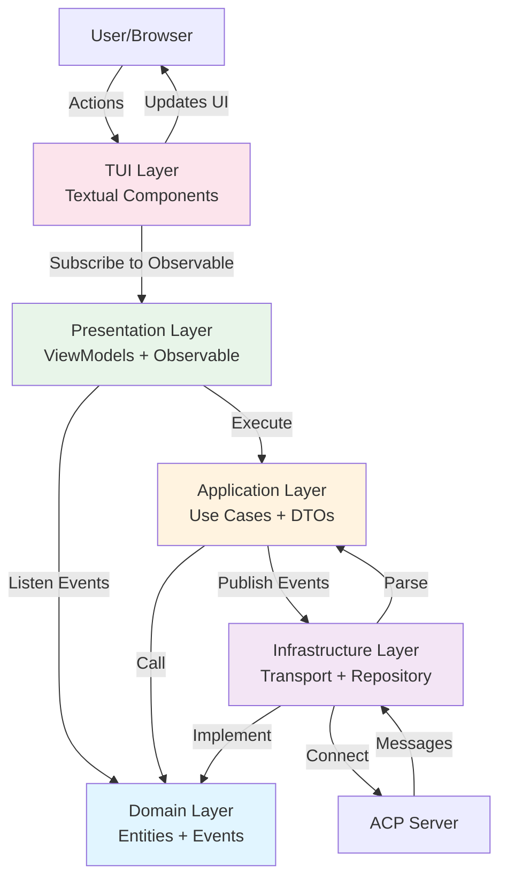
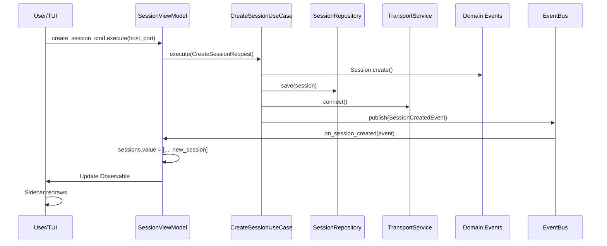

# Архитектура acp-client: Clean Architecture в 5 слоев

## Содержание

1. [Введение](#введение)
2. [Обзор слоев](#обзор-слоев)
3. [Domain Layer (слой предметной области)](#domain-layer)
4. [Application Layer (слой приложения)](#application-layer)
5. [Infrastructure Layer (инфраструктурный слой)](#infrastructure-layer)
6. [Presentation Layer (слой представления)](#presentation-layer)
7. [TUI Layer (слой пользовательского интерфейса)](#tui-layer)
8. [Правила взаимодействия между слоями](#правила-взаимодействия)
9. [Примеры типичных сценариев](#примеры-типичных-сценариев)
10. [Best Practices](#best-practices)

---

## Введение

### Что такое Clean Architecture

Clean Architecture — это архитектурный подход, предложенный Робертом Мартином (Uncle Bob), который организует код в независимые слои на основе принципа **Dependency Rule** (правило зависимостей):

> **Правило зависимостей:** Зависимости кода всегда должны направлены **внутрь**, от внешних слоев к внутренним.

### Почему мы используем слоистую архитектуру

- **Независимость**: Каждый слой имеет четкую ответственность
- **Тестируемость**: Компоненты легко тестировать благодаря интерфейсам
- **Гибкость**: Легко менять реализацию (например, транспорт, хранилище)
- **Масштабируемость**: Простое добавление новых функций без влияния на существующий код
- **Поддерживаемость**: Четкая организация делает код более понятным

### Основные принципы

1. **Dependency Rule**: Зависимости только внутрь
2. **Abstraction**: Слои общаются через интерфейсы (ABC, Protocol)
3. **Single Responsibility**: Каждый компонент отвечает за одно
4. **Loose Coupling**: Минимальные связи между слоями
5. **High Cohesion**: Все связанное находится в одном месте

---

## Обзор слоев

### Диаграмма архитектуры

```
┌─────────────────────────────────────────────────────────────────┐
│                         TUI Layer (Textual UI)                  │
│  Ответственность: User Interaction, Rendering, Navigation       │
│  Файлы: src/acp_client/tui/                                     │
└──────────────────────────▲────────────────────────────────────┬─┘
                           │                                    │
                           │ использует ViewModels            │
                           │                                    │
┌──────────────────────────┴────────────────────────────────────▼─┐
│                     Presentation Layer (MVVM)                    │
│  Ответственность: ViewModels, Observable state, Formatting      │
│  Файлы: src/acp_client/presentation/                            │
└──────────────────────────▲────────────────────────────────────┬─┘
                           │                                    │
                    использует Use Cases                        │
                           │                                    │
┌──────────────────────────┴────────────────────────────────────▼─┐
│                    Application Layer (Use Cases)                 │
│  Ответственность: Business Scenarios, Orchestration, DTOs       │
│  Файлы: src/acp_client/application/                             │
└──────────────────────────▲────────────────────────────────────┬─┘
                           │                                    │
              использует Repository & Service интерфейсы       │
                           │                                    │
┌──────────────────────────┴────────────────────────────────────▼─┐
│                    Infrastructure Layer                          │
│  Ответственность: Реализации интерфейсов, DI, Event Bus         │
│  Файлы: src/acp_client/infrastructure/                          │
└──────────────────────────▲────────────────────────────────────┬─┘
                           │                                    │
                    реализует интерфейсы из Domain              │
                           │                                    │
┌──────────────────────────┴────────────────────────────────────▼─┐
│                       Domain Layer (Core)                        │
│  Ответственность: Entities, Events, Interfaces, Business Logic  │
│  Файлы: src/acp_client/domain/                                  │
└─────────────────────────────────────────────────────────────────┘
```

### Таблица слоев

| Слой | Файлы | Ответственность | Зависит от |
|------|-------|-----------------|-----------|
| **Domain** | `domain/` | Entities, Events, Interfaces | Только stdlib |
| **Application** | `application/` | Use Cases, DTOs, State Management | Domain |
| **Infrastructure** | `infrastructure/` | Реализации, DI, Event Bus, Transport | Domain, Application |
| **Presentation** | `presentation/` | ViewModels, Observable, MVVM | Domain, Application |
| **TUI** | `tui/` | Textual Components, Navigation | Все слои |

---

## Domain Layer

### Цель и ответственность

Domain Layer (слой предметной области) содержит **чистую бизнес-логику** приложения. Это самый внутренний слой, который:

- **Не зависит** ни от чего (кроме стандартной библиотеки Python)
- **Определяет** основные сущности системы (entities)
- **Управляет** событиями системы (events)
- **Предоставляет** интерфейсы для других слоев (repositories, services)

### Структура файлов

```
src/acp_client/domain/
├── __init__.py           # Экспорт публичного API
├── entities.py          # Сущности предметной области
├── events.py            # Доменные события
├── repositories.py      # Интерфейсы repositories
└── services.py          # Интерфейсы services
```

### Entities (Сущности)

Entities — это основные объекты предметной области, которые представляют реальные концепции.

**Основные entities в acp-client:**

#### [`Session`](src/acp_client/domain/entities.py:18-60)

Представляет активную сессию с ACP-сервером:

```python
@dataclass
class Session:
    """Entity для ACP сессии."""
    
    id: str                           # Уникальный ID сессии
    server_host: str                  # Адрес сервера
    server_port: int                  # Порт сервера
    client_capabilities: dict[str, Any]  # Возможности клиента
    server_capabilities: dict[str, Any]  # Возможности сервера
    created_at: datetime              # Время создания
    is_authenticated: bool            # Авторизован ли клиент
    
    @classmethod
    def create(cls, server_host: str, server_port: int, ...) -> Session:
        """Фабрика для создания сессии."""
```

Дополнительные entities:
- `Message` — сообщение в протоколе
- `ToolCall` — вызов инструмента агентом
- `Permission` — запрос разрешения на действие
- `FileSystemEntry` — элемент файловой системы
- `TerminalOutput` — вывод терминала

### Domain Events (События)

Events представляют важные события, которые произошли в системе.

#### [`DomainEvent`](src/acp_client/domain/events.py:16-31)

Базовый класс для всех доменных событий (frozen dataclass):

```python
@dataclass(frozen=True)
class DomainEvent(ABC):
    """Базовый класс для всех доменных событий."""
    
    aggregate_id: str      # ID агрегата (обычно session_id)
    occurred_at: datetime  # Когда произошло событие (UTC)
```

**Конкретные события:**

```python
@dataclass(frozen=True)
class SessionCreatedEvent(DomainEvent):
    """Событие: новая сессия была создана."""
    session_id: str
    server_host: str
    server_port: int

@dataclass(frozen=True)
class MessageReceivedEvent(DomainEvent):
    """Событие: получено сообщение от сервера."""
    session_id: str
    message: Message

@dataclass(frozen=True)
class ToolCallRequestedEvent(DomainEvent):
    """Событие: агент запросил вызов инструмента."""
    session_id: str
    tool_call: ToolCall
```

### Repository Interfaces (Интерфейсы репозиториев)

#### [`SessionRepository`](src/acp_client/domain/repositories.py:16-40)

Абстрактный интерфейс для работы с сессиями:

```python
class SessionRepository(ABC):
    """Repository для работы с Session сущностями."""
    
    @abstractmethod
    async def save(self, session: Session) -> None:
        """Сохраняет сессию в хранилище."""
        ...
    
    @abstractmethod
    async def load(self, session_id: str) -> Session | None:
        """Загружает сессию по ID."""
        ...
    
    @abstractmethod
    async def list_all(self) -> list[Session]:
        """Получает список всех сессий."""
        ...
    
    @abstractmethod
    async def delete(self, session_id: str) -> None:
        """Удаляет сессию."""
        ...
```

**Преимущество**: Infrastructure слой может предоставить разные реализации (в памяти, файловое хранилище, БД) без изменения Domain.

### Service Interfaces (Интерфейсы сервисов)

#### [`TransportService`](src/acp_client/domain/services.py:15-50)

Интерфейс для низкоуровневой коммуникации с сервером:

```python
class TransportService(ABC):
    """Service для коммуникации с ACP сервером."""
    
    @abstractmethod
    async def connect(self) -> None:
        """Устанавливает соединение с сервером."""
        ...
    
    @abstractmethod
    async def disconnect(self) -> None:
        """Разрывает соединение."""
        ...
    
    @abstractmethod
    async def send(self, message: dict[str, Any]) -> None:
        """Отправляет JSON-RPC сообщение."""
        ...
    
    @abstractmethod
    async def receive(self) -> dict[str, Any]:
        """Получает одно сообщение с сервера."""
        ...
    
    @abstractmethod
    async def listen(self) -> AsyncIterator[dict[str, Any]]:
        """Слушает входящие сообщения (streaming)."""
        ...
```

### Правила Domain Layer

✅ **Можно:**
- Использовать стандартную библиотеку Python
- Создавать entities, events, value objects
- Определять интерфейсы (ABC, Protocol)
- Писать бизнес-логику
- Использовать dataclasses, enums, types

❌ **Нельзя:**
- Импортировать что-либо из других слоев (Application, Infrastructure, Presentation, TUI)
- Использовать внешние зависимости (кроме исключений в tests)
- Создавать HTTP/WebSocket клиентов
- Сохранять данные на диск/БД
- Взаимодействовать с UI

---

## Application Layer

### Цель и ответственность

Application Layer (слой приложения) содержит **бизнес-сценарии** (use cases) системы. Это слой, который:

- **Координирует** взаимодействие Domain с Infrastructure
- **Оркестрирует** сложные операции
- **Преобразует** данные между слоями (DTOs)
- **Управляет** состоянием приложения

### Структура файлов

```
src/acp_client/application/
├── __init__.py              # Экспорт публичного API
├── use_cases.py            # Все use cases
├── dto.py                  # Data Transfer Objects
├── state_machine.py        # ClientStateMachine
├── session_coordinator.py  # SessionCoordinator
└── dependencies.py         # (опционально) требуемые зависимости
```

### Use Cases (Бизнес-сценарии)

#### [`UseCase`](src/acp_client/application/use_cases.py:30-42)

Базовый класс для всех use cases:

```python
class UseCase(ABC):
    """Базовый класс для всех Use Cases."""
    
    @abstractmethod
    async def execute(self, *args: Any, **kwargs: Any) -> Any:
        """Выполняет use case.
        
        Аргументы зависят от конкретного use case.
        """
        ...
```

#### [`InitializeUseCase`](src/acp_client/application/use_cases.py:45-75)

Инициализирует соединение с сервером:

```python
class InitializeUseCase(UseCase):
    """Use Case для инициализации соединения с сервером."""
    
    def __init__(self, transport: TransportService) -> None:
        self._transport = transport
        self._logger = structlog.get_logger("initialize_use_case")
    
    async def execute(self) -> InitializeResponse:
        """Отправляет метод 'initialize' и получает info о сервере.
        
        Returns:
            InitializeResponse с информацией о сервере
        """
        # Логика инициализации...
```

**Другие важные use cases:**
- `CreateSessionUseCase` — создание новой сессии
- `LoadSessionUseCase` — загрузка существующей сессии
- `SendPromptUseCase` — отправка prompt-а
- `RequestPermissionUseCase` — запрос разрешения от пользователя
- `AuthenticateUseCase` — аутентификация в сессии

### DTOs (Data Transfer Objects)

DTOs используются для передачи данных между слоями и типизации параметров.

#### [`CreateSessionRequest`](src/acp_client/application/dto.py:15-36)

Request DTO для создания сессии:

```python
@dataclass
class CreateSessionRequest:
    """Request DTO для создания новой сессии."""
    
    server_host: str
    """Адрес ACP сервера."""
    
    server_port: int
    """Порт ACP сервера."""
    
    client_capabilities: dict[str, Any] | None = None
    """Возможности клиента (если None, используются default)."""
    
    auth_method: str | None = None
    """Метод аутентификации."""
    
    auth_credentials: dict[str, Any] | None = None
    """Учетные данные для аутентификации."""
```

#### [`CreateSessionResponse`](src/acp_client/application/dto.py:39-53)

Response DTO для результата создания:

```python
@dataclass
class CreateSessionResponse:
    """Response DTO для результата создания сессии."""
    
    session_id: str
    """Уникальный ID созданной сессии."""
    
    server_capabilities: dict[str, Any]
    """Возможности сервера."""
    
    is_authenticated: bool
    """Авторизован ли клиент."""
```

### State Management

#### [`ClientStateMachine`](src/acp_client/application/state_machine.py)

Управляет состоянием клиента и переходами:

```
INITIAL
  ↓
CONNECTING → CONNECTED
  ↓           ↓
  ┌───────────┘
  │
DISCONNECTING → DISCONNECTED
```

### Session Coordinator

#### [`SessionCoordinator`](src/acp_client/application/session_coordinator.py)

Координирует работу с сессиями и управляет жизненным циклом:

```python
class SessionCoordinator:
    """Координирует работу с сессиями."""
    
    async def create_session(self, request: CreateSessionRequest) -> Session:
        """Создает новую сессию."""
        
    async def send_prompt(self, session_id: str, text: str) -> None:
        """Отправляет prompt в сессию."""
        
    async def request_permission(
        self,
        session_id: str,
        request_id: str,
        approved: bool
    ) -> None:
        """Запрашивает разрешение пользователя."""
```

### Правила Application Layer

✅ **Можно:**
- Использовать entities и события из Domain
- Использовать interfaces (Repository, TransportService) из Domain
- Создавать и использовать DTOs
- Вызывать другие use cases
- Использовать infrastructure services через interfaces
- Логировать события

❌ **Нельзя:**
- Создавать entities напрямую (должны создаваться в Domain)
- Зависеть от конкретных реализаций Infrastructure
- Взаимодействовать напрямую с UI (Presentation, TUI)
- Использовать WebSocket/HTTP напрямую (только через TransportService)

---

## Infrastructure Layer

### Цель и ответственность

Infrastructure Layer (инфраструктурный слой) предоставляет **реализации** интерфейсов из Domain и Application слоев. Это слой, который:

- **Реализует** Repository интерфейсы
- **Реализует** Service интерфейсы
- **Управляет** зависимостями (DI Container)
- **Реализует** Event Bus
- **Обеспечивает** техническое взаимодействие (WebSocket, файловая система)

### Структура файлов

```
src/acp_client/infrastructure/
├── __init__.py                 # Экспорт публичного API
├── di_container.py            # Dependency Injection контейнер
├── di_bootstrapper.py         # Инициализация DI
├── repositories.py            # Реализации репозиториев
├── transport.py              # Реализации транспорта
├── handler_registry.py       # Registry для обработчиков
├── message_parser.py         # Парсинг сообщений
├── logging_config.py         # Конфигурация логирования
├── events/
│   ├── __init__.py
│   └── bus.py               # Event Bus реализация
├── plugins/                 # Plugin система
│   ├── __init__.py
│   ├── base.py
│   ├── context.py
│   └── manager.py
└── services/
    ├── __init__.py
    └── acp_transport_service.py  # Реализация TransportService
```

### DI Container

#### [`DIContainer`](src/acp_client/infrastructure/di_container.py:33-95)

Lightweight контейнер для управления зависимостями:

```python
class DIContainer:
    """DI контейнер для управления зависимостями."""
    
    def __init__(self) -> None:
        self._registrations: dict[type[Any], Registration[Any]] = {}
        self._singletons: dict[type[Any], Any] = {}
    
    def register(
        self,
        interface: type[T],
        implementation: type[T] | Callable[..., T] | T,
        scope: Scope = Scope.SINGLETON,
    ) -> None:
        """Регистрирует сервис в контейнере.
        
        Args:
            interface: Интерфейс (ABC или Protocol)
            implementation: Реализация (класс, factory или экземпляр)
            scope: Область видимости (SINGLETON, TRANSIENT, SCOPED)
        """
    
    def resolve(self, interface: type[T]) -> T:
        """Разрешает зависимость из контейнера."""
```

**Области видимости (Scope):**

```python
class Scope(Enum):
    SINGLETON = "singleton"      # Один экземпляр на всё время
    TRANSIENT = "transient"      # Новый экземпляр при каждом запросе
    SCOPED = "scoped"            # Один экземпляр на scope
```

**Пример использования:**

```python
container = DIContainer()

# Регистрация в виде синглтона
container.register(SessionRepository, InMemorySessionRepository, Scope.SINGLETON)

# Регистрация с factory функцией
def create_transport() -> TransportService:
    return WebSocketTransport(host="127.0.0.1", port=8765)

container.register(TransportService, create_transport, Scope.SINGLETON)

# Разрешение зависимостей
repo = container.resolve(SessionRepository)
transport = container.resolve(TransportService)
```

### Repository Implementations

#### [`InMemorySessionRepository`](src/acp_client/infrastructure/repositories.py:15-50)

In-memory реализация SessionRepository:

```python
class InMemorySessionRepository(SessionRepository):
    """In-memory реализация SessionRepository."""
    
    def __init__(self) -> None:
        self._sessions: dict[str, Session] = {}
    
    async def save(self, session: Session) -> None:
        """Сохраняет сессию в памяти."""
        self._sessions[session.id] = session
    
    async def load(self, session_id: str) -> Session | None:
        """Загружает сессию из памяти."""
        return self._sessions.get(session_id)
    
    async def list_all(self) -> list[Session]:
        """Получает список всех сессий."""
        return list(self._sessions.values())
    
    async def delete(self, session_id: str) -> None:
        """Удаляет сессию."""
        self._sessions.pop(session_id, None)
```

### Transport Implementation

#### [`WebSocketTransport`](src/acp_client/infrastructure/transport.py:80-140)

WebSocket реализация TransportService:

```python
class WebSocketTransport:
    """WebSocket транспорт для коммуникации с ACP сервером."""
    
    def __init__(self, host: str, port: int) -> None:
        self._host = host
        self._port = port
        self._session: ClientSession | None = None
        self._ws: ClientWebSocketResponse | None = None
    
    async def __aenter__(self) -> WebSocketTransport:
        """Открывает WebSocket соединение."""
        self._session = ClientSession()
        url = f"ws://{self._host}:{self._port}/ws"
        self._ws = await self._session.ws_connect(url)
        return self
    
    async def __aexit__(self, *args) -> None:
        """Закрывает соединение."""
        if self._ws:
            await self._ws.close()
        if self._session:
            await self._session.close()
    
    async def send_str(self, data: str) -> None:
        """Отправляет строку (JSON) через WebSocket."""
        assert self._ws is not None
        await self._ws.send_str(data)
    
    async def receive_text(self) -> str:
        """Получает строку через WebSocket."""
        assert self._ws is not None
        msg = await self._ws.receive()
        return msg.data
```

### Event Bus

#### [`EventBus`](src/acp_client/infrastructure/events/bus.py:24-70)

Publish-Subscribe шина для доменных событий:

```python
class EventBus:
    """Publish-Subscribe шина для доменных событий."""
    
    def __init__(self) -> None:
        # Словарь: тип события -> список обработчиков
        self._subscribers: dict[type[DomainEvent], list[EventHandler]] = {}
    
    def subscribe(
        self,
        event_type: type[T],
        handler: EventHandler,
    ) -> None:
        """Подписаться на события определённого типа.
        
        Args:
            event_type: Тип события для подписки
            handler: Функция-обработчик (может быть async или sync)
        """
        if event_type not in self._subscribers:
            self._subscribers[event_type] = []
        self._subscribers[event_type].append(handler)
    
    async def publish(self, event: DomainEvent) -> None:
        """Публикует событие всем подписчикам.
        
        Args:
            event: Событие для публикации
        """
        event_type = type(event)
        handlers = self._subscribers.get(event_type, [])
        
        for handler in handlers:
            if asyncio.iscoroutinefunction(handler):
                await handler(event)
            else:
                handler(event)
```

**Пример использования:**

```python
bus = EventBus()

# Подписаться на событие
async def on_session_created(event: SessionCreatedEvent) -> None:
    print(f"Session {event.session_id} created at {event.server_host}:{event.server_port}")

bus.subscribe(SessionCreatedEvent, on_session_created)

# Опубликовать событие
event = SessionCreatedEvent(
    aggregate_id="session_1",
    occurred_at=datetime.now(UTC),
    session_id="session_1",
    server_host="127.0.0.1",
    server_port=8765
)
await bus.publish(event)
```

### DIBootstrapper

#### [`DIBootstrapper`](src/acp_client/infrastructure/di_bootstrapper.py)

Инициализирует DI контейнер со всеми зависимостями:

```python
class DIBootstrapper:
    """Инициализирует DI контейнер."""
    
    @staticmethod
    def bootstrap() -> DIContainer:
        """Создает и настраивает DI контейнер.
        
        Регистрирует все service, repository и use case зависимости.
        """
        container = DIContainer()
        
        # Регистрируем инфраструктурные сервисы
        container.register(
            SessionRepository,
            InMemorySessionRepository,
            Scope.SINGLETON
        )
        
        container.register(
            TransportService,
            lambda: WebSocketTransport("127.0.0.1", 8765),
            Scope.SINGLETON
        )
        
        # Регистрируем Event Bus
        container.register(EventBus, EventBus, Scope.SINGLETON)
        
        # Регистрируем Use Cases
        container.register(
            InitializeUseCase,
            lambda: InitializeUseCase(container.resolve(TransportService)),
            Scope.SINGLETON
        )
        
        return container
```

### Правила Infrastructure Layer

✅ **Можно:**
- Реализовать интерфейсы из Domain
- Использовать entities и events из Domain
- Использовать DTOs из Application
- Использовать внешние библиотеки (aiohttp, asyncio)
- Создавать DI контейнер
- Реализовывать Event Bus
- Взаимодействовать с файловой системой, сетью

❌ **Нельзя:**
- Создавать новые entities (должны быть в Domain)
- Зависеть от Presentation или TUI слоев
- Вызывать ViewModels или UI компоненты
- Нарушать интерфейсы Domain слоя

---

## Presentation Layer

### Цель и ответственность

Presentation Layer (слой представления) содержит **MVVM ViewModels** и **Observable state** для UI. Это слой, который:

- **Предоставляет** Observable состояние для UI
- **Управляет** логикой представления (форматирование, преобразование данных)
- **Вызывает** Use Cases на основе действий пользователя
- **Обрабатывает** доменные события и обновляет состояние

### Структура файлов

```
src/acp_client/presentation/
├── __init__.py                      # Экспорт публичного API
├── observable.py                   # Observable и Observer паттерны
├── base_view_model.py              # Базовый класс для всех ViewModels
├── chat_view_model.py              # ViewModel для чата
├── session_view_model.py           # ViewModel для сессий
├── filesystem_view_model.py        # ViewModel для файловой системы
├── terminal_view_model.py          # ViewModel для терминала
├── permission_view_model.py        # ViewModel для разрешений
├── plan_view_model.py              # ViewModel для плана агента
├── file_viewer_view_model.py       # ViewModel для просмотра файлов
├── terminal_log_view_model.py      # ViewModel для логов терминала
├── ui_view_model.py                # ViewModel для глобального UI состояния
└── view_model_factory.py           # Factory для создания ViewModels
```

### Observable Pattern

#### [`Observable[T]`](src/acp_client/presentation/observable.py:17-50)

Реактивное свойство с поддержкой observers:

```python
class Observable[T]:
    """Реактивное свойство с поддержкой observers.
    
    Когда значение изменяется, все подписанные observers уведомляются.
    
    Пример:
        >>> name = Observable("Alice")
        >>> name.subscribe(lambda x: print(f"Name: {x}"))
        >>> name.value = "Bob"  # Выведет: Name: Bob
    """
    
    def __init__(self, initial_value: T) -> None:
        self._value: T = initial_value
        self._observers: list[Callable[[Any], None]] = []
    
    @property
    def value(self) -> T:
        """Получить текущее значение свойства."""
        return self._value
    
    @value.setter
    def value(self, new_value: T) -> None:
        """Установить новое значение и уведомить observers."""
        if self._value != new_value:
            self._value = new_value
            self._notify_observers()
    
    def subscribe(self, observer: Callable[[T], None]) -> None:
        """Подписаться на изменения значения.
        
        Args:
            observer: Функция, которая будет вызвана при изменении
        """
        self._observers.append(observer)
    
    def _notify_observers(self) -> None:
        """Уведомить всех observers о новом значении."""
        for observer in self._observers:
            observer(self._value)
```

**Пример использования:**

```python
# Создаем observable для количества сообщений
message_count = Observable[int](0)

# Подписываемся на изменения
message_count.subscribe(lambda count: print(f"Messages: {count}"))

# Обновляем значение
message_count.value = 5  # Выведет: Messages: 5
message_count.value = 10  # Выведет: Messages: 10
```

### Base ViewModel

#### [`BaseViewModel`](src/acp_client/presentation/base_view_model.py:22-50)

Базовый класс для всех ViewModels:

```python
class BaseViewModel:
    """Базовый класс для всех ViewModels.
    
    Предоставляет:
    - Интеграцию с EventBus
    - Структурированное логирование
    - Управление subscriptions
    """
    
    def __init__(self, event_bus: Any | None = None, logger: Any | None = None) -> None:
        self.event_bus = event_bus
        self._logger = logger or structlog.get_logger(self.__class__.__name__)
        self._subscriptions: list[tuple[type, Any]] = []
    
    def on_event(self, event_type: type[DomainEvent], handler: Callable) -> None:
        """Подписаться на доменное событие.
        
        Args:
            event_type: Тип события
            handler: Функция-обработчик
        """
        if self.event_bus:
            self.event_bus.subscribe(event_type, handler)
            self._subscriptions.append((event_type, handler))
    
    def unsubscribe_all(self) -> None:
        """Отписаться от всех событий (cleanup)."""
        # Логика отписки...
```

### MVVM Pattern: ChatViewModel

#### [`ChatViewModel`](src/acp_client/presentation/chat_view_model.py:27-100)

ViewModel для управления чатом и prompt-turn:

```python
class ChatViewModel(BaseViewModel):
    """ViewModel для управления чатом в активной сессии.
    
    Хранит состояние чата:
    - messages: история сообщений
    - tool_calls: список tool calls
    - pending_permissions: запросы разрешений
    - is_streaming: флаг активного streaming
    """
    
    def __init__(
        self,
        coordinator: SessionCoordinator,
        event_bus: EventBus | None = None,
    ) -> None:
        super().__init__(event_bus)
        self._coordinator = coordinator
        
        # Observable состояние для UI
        self.messages = Observable[list[Message]]([])
        self.tool_calls = Observable[list[ToolCall]]([])
        self.pending_permissions = Observable[list[Permission]]([])
        self.is_streaming = Observable[bool](False)
        self.error_message = Observable[str | None](None)
        
        # Команды (вызываемые из UI)
        self.send_prompt_cmd = ObservableCommand(self._send_prompt)
        self.approve_permission_cmd = ObservableCommand(self._approve_permission)
        
        # Подписаться на события
        if event_bus:
            self.on_event(MessageReceivedEvent, self._on_message_received)
            self.on_event(ToolCallRequestedEvent, self._on_tool_call_requested)
            self.on_event(PermissionRequestedEvent, self._on_permission_requested)
    
    async def _send_prompt(self, session_id: str, text: str) -> None:
        """Отправить prompt в сессию."""
        try:
            self.is_streaming.value = True
            await self._coordinator.send_prompt(session_id, text)
        except Exception as e:
            self.error_message.value = str(e)
        finally:
            self.is_streaming.value = False
    
    async def _approve_permission(
        self,
        session_id: str,
        request_id: str,
        approved: bool
    ) -> None:
        """Отправить решение по разрешению."""
        await self._coordinator.request_permission(
            session_id,
            request_id,
            approved
        )
    
    def _on_message_received(self, event: MessageReceivedEvent) -> None:
        """Обработчик события получения сообщения."""
        messages = self.messages.value.copy()
        messages.append(event.message)
        self.messages.value = messages
    
    # ... другие обработчики событий
```

### ObservableCommand

```python
class ObservableCommand:
    """Команда с возможностью отслеживания выполнения."""
    
    def __init__(self, handler: Callable[..., Any]) -> None:
        self._handler = handler
        self.is_executing = Observable[bool](False)
        self.error = Observable[str | None](None)
    
    async def execute(self, *args, **kwargs) -> None:
        """Выполнить команду."""
        try:
            self.is_executing.value = True
            self.error.value = None
            await self._handler(*args, **kwargs)
        except Exception as e:
            self.error.value = str(e)
        finally:
            self.is_executing.value = False
```

### Другие ViewModels

| ViewModel | Ответственность |
|-----------|-----------------|
| [`SessionViewModel`](src/acp_client/presentation/session_view_model.py) | Управление сессиями (список, создание, загрузка) |
| [`FileSystemViewModel`](src/acp_client/presentation/filesystem_view_model.py) | Просмотр файловой системы |
| [`TerminalViewModel`](src/acp_client/presentation/terminal_view_model.py) | Вывод и управление терминалом |
| [`PermissionViewModel`](src/acp_client/presentation/permission_view_model.py) | Запросы разрешений |
| [`PlanViewModel`](src/acp_client/presentation/plan_view_model.py) | План/стратегия агента |
| [`FileViewerViewModel`](src/acp_client/presentation/file_viewer_view_model.py) | Просмотр содержимого файлов |
| [`UIViewModel`](src/acp_client/presentation/ui_view_model.py) | Глобальное состояние UI (модалки, навигация) |

### Правила Presentation Layer

✅ **Можно:**
- Использовать entities и events из Domain
- Вызывать Use Cases из Application
- Создавать Observable состояние
- Обрабатывать доменные события
- Форматировать данные для отображения
- Использовать MVVM паттерн

❌ **Нельзя:**
- Создавать Textual компоненты (это TUI слой)
- Взаимодействовать напрямую с транспортом
- Сохранять данные на диск
- Использовать WebSocket напрямую
- Импортировать компоненты из tui/

---

## TUI Layer

### Цель и ответственность

TUI Layer (слой пользовательского интерфейса) содержит **Textual компоненты** и **навигацию**. Это внешний слой, который:

- **Отображает** данные из ViewModels
- **Обрабатывает** действия пользователя
- **Управляет** навигацией между экранами
- **Подписывается** на Observable из Presentation слоя

### Структура файлов

```
src/acp_client/tui/
├── __init__.py                 # Экспорт публичного API
├── __main__.py                 # Entry point для TUI
├── app.py                      # Главное Textual приложение
├── config.py                   # Конфигурация TUI
├── components/
│   ├── __init__.py
│   ├── chat_view.py           # Компонент для чата
│   ├── file_tree.py           # Компонент для файлового дерева
│   ├── file_viewer.py         # Компонент для просмотра файлов
│   ├── footer.py              # Footer панель
│   ├── header.py              # Header панель
│   ├── permission_modal.py    # Модаль запроса разрешения
│   ├── plan_panel.py          # Панель плана
│   ├── prompt_input.py        # Ввод prompt-а
│   ├── sidebar.py             # Боковая панель
│   ├── terminal_log_modal.py  # Модаль логов терминала
│   ├── terminal_output.py     # Вывод терминала
│   └── tool_panel.py          # Панель инструментов
├── managers/
│   ├── __init__.py
│   ├── cache.py               # Cache менеджер
│   ├── connection.py          # Connection менеджер
│   ├── session.py             # Session менеджер
│   ├── filesystem.py          # Filesystem менеджер
│   ├── terminal.py            # Terminal менеджер
│   ├── permission.py          # Permission менеджер
│   ├── handlers.py            # Обработчики сообщений
│   └── ui_state.py            # Глобальное UI состояние
├── navigation/
│   ├── __init__.py
│   ├── manager.py             # NavigationManager
│   ├── queue.py               # NavigationQueue
│   ├── tracker.py             # NavigationTracker
│   └── operations.py          # Navigation операции
├── styles/
│   └── app.tcss               # Стили компонентов
└── ... другие файлы
```

### ACPClientApp (Главное приложение)

#### [`ACPClientApp`](src/acp_client/tui/app.py:1-50)

Главное Textual приложение:

```python
class ACPClientApp(App):
    """Главное Textual приложение для ACP-Client TUI."""
    
    BINDINGS = [
        ("ctrl+c", "quit", "Quit"),
        ("ctrl+n", "new_session", "New Session"),
        ("ctrl+l", "load_session", "Load Session"),
        ("ctrl+k", "clear_chat", "Clear Chat"),
    ]
    
    CSS_PATH = "styles/app.tcss"
    
    def __init__(self) -> None:
        super().__init__()
        # Инициализируем DI контейнер
        self._di_container = DIBootstrapper.bootstrap()
        
        # Инициализируем ViewModels
        self._ui_view_model = self._di_container.resolve(UIViewModel)
        self._chat_view_model = self._di_container.resolve(ChatViewModel)
        self._session_view_model = self._di_container.resolve(SessionViewModel)
        # ... другие ViewModels
        
        # Инициализируем navigation
        self._navigation_manager = NavigationManager()
    
    def compose(self) -> ComposeResult:
        """Компонует главный макет приложения."""
        yield HeaderBar()
        with Horizontal():
            yield Sidebar()
            with Vertical():
                yield ChatView()
                yield PromptInput()
        yield FooterBar()
    
    async def on_mount(self) -> None:
        """Вызывается при загрузке приложения."""
        # Подписываемся на Observable из ViewModels
        self._chat_view_model.messages.subscribe(self._on_messages_changed)
        self._chat_view_model.is_streaming.subscribe(self._on_streaming_changed)
        
        # Инициализируем соединение
        await self._initialize_connection()
    
    def _on_messages_changed(self, messages: list[Message]) -> None:
        """Обработчик изменения сообщений."""
        chat_view = self.query_one(ChatView)
        chat_view.update_messages(messages)
    
    def _on_streaming_changed(self, is_streaming: bool) -> None:
        """Обработчик изменения статуса streaming."""
        # Обновляем UI состояние...
    
    def action_new_session(self) -> None:
        """Action для создания новой сессии."""
        self._navigation_manager.push(NavigationOperation.NEW_SESSION)
    
    # ... другие actions и обработчики
```

### Компоненты Textual

#### [`ChatView`](src/acp_client/tui/components/chat_view.py)

Компонент для отображения чата:

```python
class ChatView(Widget):
    """Компонент для отображения чата с сообщениями и tool calls."""
    
    def __init__(self, chat_vm: ChatViewModel) -> None:
        super().__init__()
        self._chat_vm = chat_vm
        
        # Подписываемся на Observable
        self._chat_vm.messages.subscribe(self._on_messages_updated)
        self._chat_vm.is_streaming.subscribe(self._on_streaming_updated)
    
    def _on_messages_updated(self, messages: list[Message]) -> None:
        """Обновляем UI при изменении сообщений."""
        self.update(self._render_messages(messages))
    
    def _render_messages(self, messages: list[Message]) -> str:
        """Отрисовка сообщений в Text виде."""
        output = ""
        for msg in messages:
            if msg.role == "user":
                output += f"[bold cyan]You[/]: {msg.content}\n"
            else:
                output += f"[bold green]Agent[/]: {msg.content}\n"
        return output
    
    def _on_streaming_updated(self, is_streaming: bool) -> None:
        """Обновляем индикатор streaming."""
        # ...
```

#### [`PromptInput`](src/acp_client/tui/components/prompt_input.py)

Компонент для ввода prompt-а:

```python
class PromptInput(Widget):
    """Компонент для ввода prompt-а."""
    
    def __init__(self, chat_vm: ChatViewModel, session_vm: SessionViewModel) -> None:
        super().__init__()
        self._chat_vm = chat_vm
        self._session_vm = session_vm
        self._text_input = Input(placeholder="Enter your prompt...")
    
    def compose(self) -> ComposeResult:
        yield self._text_input
        yield Button("Send", id="send_btn")
    
    def on_button_pressed(self, event: Button.Pressed) -> None:
        """Обработчик нажатия кнопки Send."""
        if event.button.id == "send_btn":
            text = self._text_input.value
            if text:
                # Вызываем ObservableCommand из ViewModel
                session_id = self._session_vm.active_session.value.id
                asyncio.create_task(
                    self._chat_vm.send_prompt_cmd.execute(session_id, text)
                )
                self._text_input.value = ""
```

### Navigation System

#### [`NavigationManager`](src/acp_client/tui/navigation/manager.py)

Управляет навигацией между экранами:

```python
class NavigationManager:
    """Управляет навигацией между экранами приложения."""
    
    def __init__(self) -> None:
        self._queue = NavigationQueue()
        self._tracker = NavigationTracker()
    
    def push(self, operation: NavigationOperation) -> None:
        """Добавить операцию в очередь навигации."""
        self._queue.enqueue(operation)
    
    def pop(self) -> NavigationOperation | None:
        """Получить следующую операцию навигации."""
        return self._queue.dequeue()
    
    def back(self) -> bool:
        """Вернуться на предыдущий экран."""
        return self._tracker.go_back()
    
    def can_go_back(self) -> bool:
        """Проверить, возможен ли переход назад."""
        return self._tracker.can_go_back()
```

**Navigation Operation:**

```python
class NavigationOperation(Enum):
    """Типы навигационных операций."""
    
    NEW_SESSION = "new_session"           # Создать новую сессию
    LOAD_SESSION = "load_session"         # Загрузить сессию
    CHAT_VIEW = "chat_view"               # Просмотр чата
    FILE_EXPLORER = "file_explorer"       # Обозреватель файлов
    SETTINGS = "settings"                 # Настройки
    HELP = "help"                         # Справка
    BACK = "back"                         # Вернуться назад
```

### TUI Manager Classes

#### [`ConnectionManager`](src/acp_client/tui/managers/connection.py)

Управляет соединением с сервером:

```python
class ConnectionManager:
    """Управляет соединением с ACP сервером."""
    
    async def connect(self, host: str, port: int) -> None:
        """Подключиться к серверу."""
        # Логика подключения...
    
    async def disconnect(self) -> None:
        """Отключиться от сервера."""
        # Логика отключения...
    
    async def send_message(self, message: dict[str, Any]) -> None:
        """Отправить сообщение серверу."""
        # Логика отправки...
```

### Правила TUI Layer

✅ **Можно:**
- Использовать ViewModels из Presentation слоя
- Подписываться на Observable из ViewModels
- Создавать и управлять Textual компонентами
- Реализовывать навигацию
- Обрабатывать действия пользователя
- Вызывать ObservableCommand из ViewModels

❌ **Нельзя:**
- Вызывать Use Cases напрямую (только через ViewModels)
- Импортировать компоненты из других слоев
- Создавать entities или events
- Взаимодействовать с базой данных
- Создавать WebSocket соединения напрямую

---

## Правила взаимодействия между слоями

### Dependency Rule (Правило зависимостей)

```
           TUI Layer
             ↓
        Presentation Layer
             ↓
       Application Layer
             ↓
       Infrastructure Layer
             ↓
          Domain Layer
               ↑
          (не зависит)

Зависимости ВСЕГДА направлены внутрь →
```

### Таблица разрешенных зависимостей

| От слоя | К Domain | К Application | К Infrastructure | К Presentation | К TUI |
|---------|----------|---------------|------------------|----------------|-------|
| **Domain** | ✅ | ❌ | ❌ | ❌ | ❌ |
| **Application** | ✅ | ✅ | ❌ | ❌ | ❌ |
| **Infrastructure** | ✅ | ✅ | ✅ | ❌ | ❌ |
| **Presentation** | ✅ | ✅ | ❌ | ✅ | ❌ |
| **TUI** | ✅ | ❌ | ❌ | ✅ | ✅ |

### Как слои общаются друг с другом

#### 1. Domain → Application (вверх)

**Application использует Domain интерфейсы:**

```python
# domain/services.py (интерфейс)
class TransportService(ABC):
    @abstractmethod
    async def send(self, message: dict[str, Any]) -> None: ...

# application/use_cases.py (использование)
class SendPromptUseCase(UseCase):
    def __init__(self, transport: TransportService) -> None:
        self._transport = transport
    
    async def execute(self, message: dict[str, Any]) -> None:
        # Используем interface, не конкретную реализацию
        await self._transport.send(message)
```

#### 2. Application → Infrastructure (реализация)

**Infrastructure реализует Domain интерфейсы:**

```python
# infrastructure/transport.py (реализация)
class WebSocketTransport(TransportService):
    async def send(self, message: dict[str, Any]) -> None:
        # Конкретная реализация
        await self._ws.send_str(json.dumps(message))

# infrastructure/di_bootstrapper.py (регистрация)
container.register(TransportService, WebSocketTransport, Scope.SINGLETON)
```

#### 3. Presentation → Application (вызов Use Cases)

**Presentation вызывает Use Cases:**

```python
# presentation/chat_view_model.py
class ChatViewModel(BaseViewModel):
    def __init__(self, send_prompt_use_case: SendPromptUseCase) -> None:
        self._use_case = send_prompt_use_case
    
    async def send_prompt(self, text: str) -> None:
        # Вызываем Use Case
        await self._use_case.execute(text)
```

#### 4. TUI → Presentation (подписка на Observable)

**TUI подписывается на Observable из ViewModels:**

```python
# tui/components/chat_view.py
class ChatView(Widget):
    def __init__(self, chat_vm: ChatViewModel) -> None:
        self._chat_vm = chat_vm
        
        # Подписываемся на Observable
        self._chat_vm.messages.subscribe(self._update_messages)
    
    def _update_messages(self, messages: list[Message]) -> None:
        # Обновляем UI при изменении state
        self.update(self._render(messages))
```

### Anti-Patterns (Что НЕЛЬЗЯ делать)

❌ **TUI вызывает Use Cases напрямую**

```python
# НЕПРАВИЛЬНО!
class ChatView(Widget):
    async def send_prompt(self, text: str):
        await send_prompt_use_case.execute(text)  # ❌ НЕПРАВИЛЬНО
```

✅ **Правильно: через ViewModel**

```python
# ПРАВИЛЬНО
class ChatView(Widget):
    async def send_prompt(self, text: str):
        await self._chat_vm.send_prompt_cmd.execute(text)  # ✅
```

---

❌ **Application импортирует Infrastructure реализации**

```python
# application/use_cases.py
# НЕПРАВИЛЬНО!
from acp_client.infrastructure.transport import WebSocketTransport

class SendPromptUseCase:
    def __init__(self):
        self._transport = WebSocketTransport(...)  # ❌ НЕПРАВИЛЬНО
```

✅ **Правильно: через interface**

```python
# application/use_cases.py
# ПРАВИЛЬНО
from acp_client.domain.services import TransportService

class SendPromptUseCase:
    def __init__(self, transport: TransportService) -> None:
        self._transport = transport  # ✅ Зависит от интерфейса
```

---

❌ **Presentation импортирует TUI компоненты**

```python
# presentation/chat_view_model.py
# НЕПРАВИЛЬНО!
from acp_client.tui.components.chat_view import ChatView

class ChatViewModel:
    def __init__(self):
        self._view = ChatView()  # ❌ НЕПРАВИЛЬНО
```

✅ **Правильно: ViewModel не знает о UI**

```python
# presentation/chat_view_model.py
# ПРАВИЛЬНО
class ChatViewModel:
    # Observable для UI
    messages = Observable([])
    
    # UI подписывается сам
```

---

## Примеры типичных сценариев

### Сценарий 1: Создание новой сессии

**Поток через все слои:**

```
┌─────────────────────────────────────────────────────────────────┐
│ 1. TUI: Пользователь нажимает "New Session"                     │
│         ActionNewSession вызывает NavigationManager              │
└────────────────────────┬────────────────────────────────────────┘
                         │
┌────────────────────────▼────────────────────────────────────────┐
│ 2. Presentation: SessionViewModel получает запрос               │
│    create_session_cmd.execute(host, port)                       │
│    Вызывает CreateSessionUseCase                                │
└────────────────────────┬────────────────────────────────────────┘
                         │
┌────────────────────────▼────────────────────────────────────────┐
│ 3. Application: CreateSessionUseCase                            │
│    - Преобразует параметры в Session entity (Domain)            │
│    - Вызывает SessionRepository.save()                          │
│    - Вызывает TransportService.connect()                        │
│    - Генерирует SessionCreatedEvent                             │
│    - Публикует event в EventBus                                 │
└────────────────────────┬────────────────────────────────────────┘
                         │
┌────────────────────────▼────────────────────────────────────────┐
│ 4. Infrastructure: Реализации                                   │
│    - WebSocketTransport подключается к серверу                 │
│    - InMemorySessionRepository сохраняет Session                │
│    - EventBus публикует SessionCreatedEvent                     │
└────────────────────────┬────────────────────────────────────────┘
                         │
┌────────────────────────▼────────────────────────────────────────┐
│ 5. Presentation: Слушатели событий                              │
│    SessionViewModel слушает SessionCreatedEvent                 │
│    Обновляет sessions.value = [..., new_session]                │
└────────────────────────┬────────────────────────────────────────┘
                         │
┌────────────────────────▼────────────────────────────────────────┐
│ 6. TUI: Компоненты обновляют UI                                 │
│    Sidebar подписан на sessions.value                           │
│    Перерисовывает список сессий с новой сессией                │
└─────────────────────────────────────────────────────────────────┘
```

**Код примера:**

```python
# 1. TUI слой - действие пользователя
async def on_new_session_button_pressed(self):
    host = self._host_input.value
    port = int(self._port_input.value)
    
    # Вызываем команду из ViewModel
    await self._session_vm.create_session_cmd.execute(host, port)

# 2. Presentation слой - ViewModel
class SessionViewModel(BaseViewModel):
    def __init__(self, create_session_uc: CreateSessionUseCase, event_bus: EventBus):
        super().__init__(event_bus)
        self.sessions = Observable[list[Session]]([])
        self.create_session_cmd = ObservableCommand(self._create_session)
        
        # Слушаем событие
        self.on_event(SessionCreatedEvent, self._on_session_created)
    
    async def _create_session(self, host: str, port: int):
        # Вызываем Use Case
        response = await self.create_session_uc.execute(
            CreateSessionRequest(host, port)
        )
        # Событие обновит sessions через _on_session_created

# 3. Application слой - Use Case
class CreateSessionUseCase(UseCase):
    def __init__(
        self,
        transport: TransportService,
        repo: SessionRepository,
        event_bus: EventBus
    ):
        self._transport = transport
        self._repo = repo
        self._event_bus = event_bus
    
    async def execute(self, request: CreateSessionRequest) -> CreateSessionResponse:
        # Создаем Session entity в Domain
        session = Session.create(
            server_host=request.server_host,
            server_port=request.server_port,
            client_capabilities=DEFAULT_CAPABILITIES,
            server_capabilities={}
        )
        
        # Сохраняем через Repository
        await self._repo.save(session)
        
        # Подключаемся через Transport
        await self._transport.connect()
        
        # Публикуем событие
        event = SessionCreatedEvent(
            aggregate_id=session.id,
            occurred_at=datetime.now(UTC),
            session_id=session.id,
            server_host=request.server_host,
            server_port=request.server_port
        )
        await self._event_bus.publish(event)
        
        return CreateSessionResponse(session_id=session.id, ...)

# 4. Domain слой - Entity и Event
@dataclass
class Session:
    id: str
    server_host: str
    server_port: int
    # ...

@dataclass(frozen=True)
class SessionCreatedEvent(DomainEvent):
    session_id: str
    server_host: str
    server_port: int

# 5-6. Обратное распространение
# _on_session_created обновит observable,
# TUI компоненты переподпишут и обновят UI
```

### Сценарий 2: Обработка события от сервера

```
┌──────────────────────────────────────────────────────────────────┐
│ 1. Infrastructure: Получено сообщение от сервера                │
│    TransportService.listen() получает JSON                       │
└────────────────────────┬─────────────────────────────────────────┘
                         │
┌────────────────────────▼─────────────────────────────────────────┐
│ 2. Application: MessageParser парсит сообщение                   │
│    Преобразует JSON в Message entity (Domain)                    │
│    Публикует MessageReceivedEvent в EventBus                     │
└────────────────────────┬─────────────────────────────────────────┘
                         │
┌────────────────────────▼─────────────────────────────────────────┐
│ 3. Presentation: ViewModels слушают события                      │
│    ChatViewModel получает MessageReceivedEvent                   │
│    Добавляет сообщение в messages.value                          │
└────────────────────────┬─────────────────────────────────────────┘
                         │
┌────────────────────────▼─────────────────────────────────────────┐
│ 4. TUI: Компоненты обновляют UI                                  │
│    ChatView слушает messages.value                               │
│    Перерисовывает чат с новым сообщением                         │
└──────────────────────────────────────────────────────────────────┘
```

### Сценарий 3: Добавление нового UI компонента

**Пошаговый процесс:**

1. **Определить, что нужно отображать (Domain слой)**
   - Определить entity или event (если не существует)

2. **Создать ViewModel (Presentation слой)**
   ```python
   class MyViewModel(BaseViewModel):
       def __init__(self, use_case: MyUseCase, event_bus: EventBus):
           super().__init__(event_bus)
           self.state = Observable(...)
           self.command = ObservableCommand(self._handle_action)
           self.on_event(MyEvent, self._on_event)
   ```

3. **Создать компонент Textual (TUI слой)**
   ```python
   class MyComponent(Widget):
       def __init__(self, view_model: MyViewModel):
           self._vm = view_model
           self._vm.state.subscribe(self._update_ui)
       
       async def on_button_press(self):
           await self._vm.command.execute()
   ```

4. **Интегрировать в ACPClientApp**
   ```python
   class ACPClientApp(App):
       def compose(self) -> ComposeResult:
           yield MyComponent(self._my_view_model)
   ```

---

## Best Practices

### 1. Используйте интерфейсы (ABC, Protocol)

❌ **Неправильно:**
```python
class MyUseCase:
    def __init__(self):
        self._repo = InMemorySessionRepository()  # Конкретная реализация
```

✅ **Правильно:**
```python
class MyUseCase:
    def __init__(self, repo: SessionRepository) -> None:
        self._repo = repo  # Интерфейс (ABC)
```

### 2. Инъектируйте зависимости

Используйте DI Container для управления зависимостями:

```python
# di_bootstrapper.py
container = DIContainer()
container.register(SessionRepository, InMemorySessionRepository, Scope.SINGLETON)
container.register(TransportService, WebSocketTransport, Scope.SINGLETON)

# Разрешение зависимостей
repo = container.resolve(SessionRepository)
transport = container.resolve(TransportService)
```

### 3. Создавайте Use Cases для каждого бизнес-сценария

Каждый use case отвечает за один сценарий (Single Responsibility):

```python
class SendPromptUseCase(UseCase):
    """Use Case для отправки prompt-а."""
    async def execute(self, session_id: str, text: str) -> None: ...

class RequestPermissionUseCase(UseCase):
    """Use Case для запроса разрешения."""
    async def execute(self, session_id: str, request_id: str, approved: bool) -> None: ...
```

### 4. Используйте Observable для state

Observable обеспечивает реактивное обновление UI:

```python
class ChatViewModel(BaseViewModel):
    def __init__(self):
        self.messages = Observable[list[Message]]([])
        self.is_streaming = Observable[bool](False)
```

### 5. Обрабатывайте события (Event-Driven)

Используйте доменные события для слабой связанности:

```python
# Application слой публикует событие
await event_bus.publish(SessionCreatedEvent(...))

# Presentation слой слушает
def __init__(self, event_bus: EventBus):
    self.on_event(SessionCreatedEvent, self._on_session_created)
```

### 6. Используйте DTOs для передачи данных

DTOs определяют контракты между слоями:

```python
# Request DTO с параметрами
@dataclass
class CreateSessionRequest:
    server_host: str
    server_port: int

# Response DTO с результатом
@dataclass
class CreateSessionResponse:
    session_id: str
    server_capabilities: dict[str, Any]
```

### 7. Структурируйте код по слоям

Каждый слой содержит ответственный и логичный код:

```
src/acp_client/
├── domain/          # Бизнес-логика
├── application/     # Сценарии использования
├── infrastructure/  # Реализации, DI, транспорт
├── presentation/    # ViewModels, Observable
└── tui/            # UI компоненты
```

### 8. Логируйте важные события

Используйте structlog для структурированного логирования:

```python
import structlog

logger = structlog.get_logger("my_component")
logger.info("action_executed", session_id=session.id, duration=elapsed_time)
```

### 9. Тестируйте слои независимо

Каждый слой можно тестировать отдельно благодаря интерфейсам:

```python
# Тестирование Use Case с mock-ом Repository
@pytest.fixture
def mock_repo(monkeypatch):
    mock = AsyncMock(spec=SessionRepository)
    return mock

async def test_create_session(mock_repo):
    use_case = CreateSessionUseCase(mock_repo, mock_transport)
    response = await use_case.execute(request)
    mock_repo.save.assert_called_once()
```

### 10. Типизируйте весь код

Используйте type hints для безопасности типов:

```python
async def send_prompt(
    self,
    session_id: str,
    text: str
) -> SendPromptResponse:
    """Отправляет prompt в сессию."""
    ...
```

### Типичные ошибки и как их избежать

| Ошибка | Описание | Решение |
|--------|---------|--------|
| **Обратные зависимости** | Infrastructure зависит от Application | Используйте интерфейсы (ABC) в Domain |
| **God Objects** | Один класс делает всё | Разделите на несколько use cases |
| **Отсутствие DI** | Создание объектов внутри класса | Используйте DIContainer |
| **UI logic в Entity** | Бизнес-логика в Presentation слое | Переместите в Application слой |
| **Event coupling** | Слои зависят от конкретных событий | Используйте интерфейсы, слабую связанность |

---

## Диаграммы архитектуры

### Диаграмма взаимодействия компонентов



### Диаграмма потока создания сессии



---

## Заключение

Clean Architecture в acp-client обеспечивает:

- **Четкое разделение ответственности** между слоями
- **Независимость бизнес-логики** (Domain) от технических деталей
- **Тестируемость** благодаря интерфейсам и DI
- **Масштабируемость** при добавлении новых функций
- **Гибкость** при изменении реализаций (например, транспорта)

Соблюдение правил взаимодействия между слоями критично для поддержания архитектуры.

### Дополнительные ресурсы

- [Clean Architecture by Robert C. Martin](https://www.oreilly.com/library/view/clean-architecture/9780134494272/)
- [`src/acp_client/domain/`](src/acp_client/domain/) - Domain Layer реализация
- [`src/acp_client/application/`](src/acp_client/application/) - Application Layer реализация
- [`src/acp_client/infrastructure/`](src/acp_client/infrastructure/) - Infrastructure Layer реализация
- [`src/acp_client/presentation/`](src/acp_client/presentation/) - Presentation Layer реализация
- [`src/acp_client/tui/`](src/acp_client/tui/) - TUI Layer реализация

---

**Версия документации:** 1.0  
**Последнее обновление:** Апрель 2026  
**Язык:** Русский
