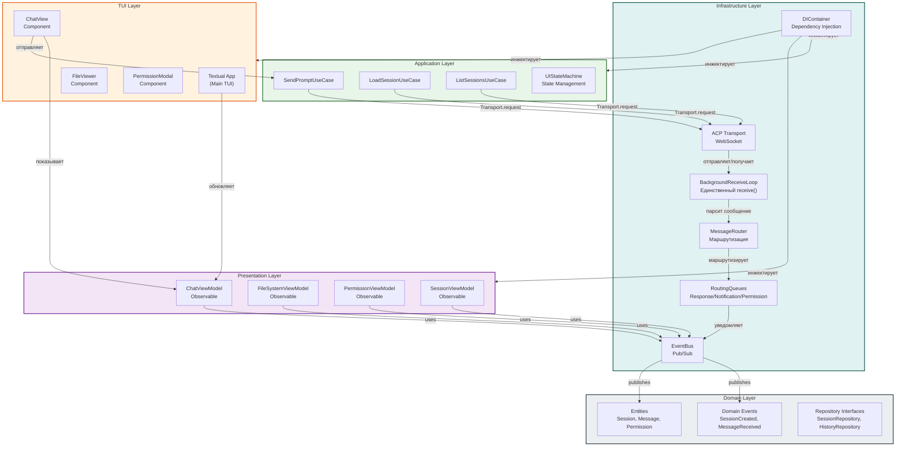
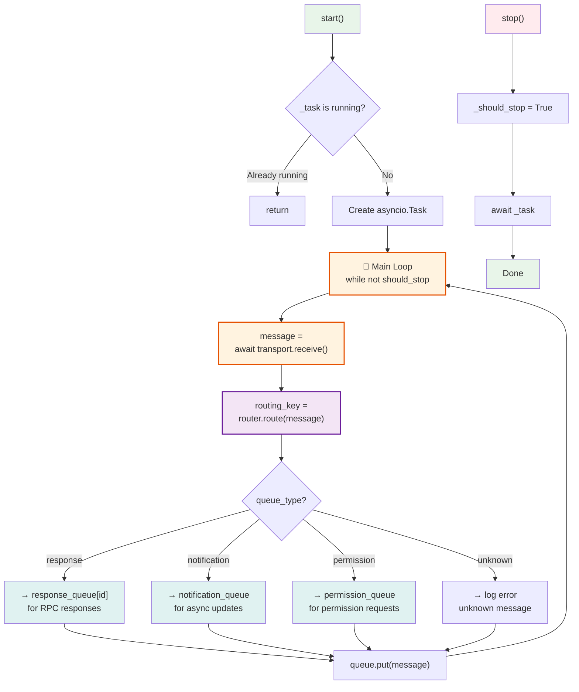
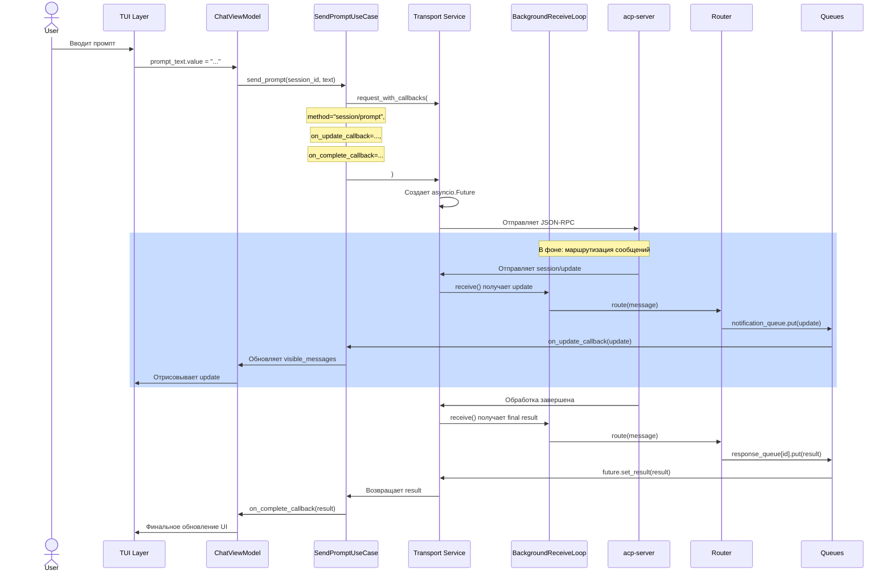
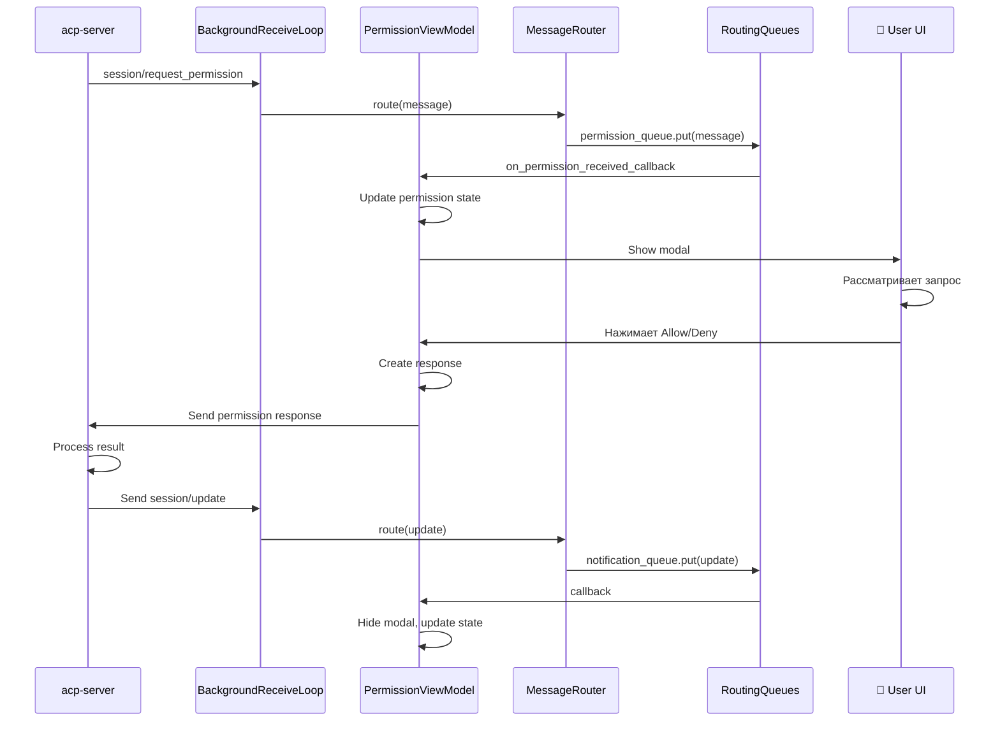

# Архитектура acp-client: Clean Architecture + Critical Components

## Содержание

1. [Введение](#введение)
2. [Обзор архитектуры](#обзор-архитектуры)
3. [Clean Architecture: 5 слоев](#clean-architecture-5-слоев)
4. **[КРИТИЧНО: BackgroundReceiveLoop](#критично-backgroundreceiveloop)**
5. [MessageRouter и RoutingQueues](#messagerouter-и-routingqueues)
6. [Dependency Injection контейнер](#dependency-injection-контейнер)
7. [Event Bus архитектура](#event-bus-архитектура)
8. [Потоки обработки](#потоки-обработки)
9. [Паттерны проектирования](#паттерны-проектирования)

---

## Введение

**acp-client** — полнофункциональный клиент ACP протокола с TUI интерфейсом, реализованный согласно **Clean Architecture** принципам. 

**Ключевые характеристики:**
- 5-слойная архитектура (Domain, Application, Infrastructure, Presentation, TUI)
- MVVM паттерн в Presentation слое
- Observable система для реактивности
- DI контейнер для управления зависимостями
- Event Bus для слабой связанности
- **КРИТИЧНО: BackgroundReceiveLoop для безопасной конкурентности**

---

## Обзор архитектуры

### Диаграмма компонентов



---

## Clean Architecture: 5 слоев

### 1. Domain Layer (Самый внутренний)

[Domain слой](../../src/acp_client/domain/) содержит **чистую бизнес-логику**:
- **Не зависит** ни от чего (только stdlib)
- **Entities** — [`Session`](../../src/acp_client/domain/entities.py), [`Message`](../../src/acp_client/domain/entities.py), [`Permission`](../../src/acp_client/domain/entities.py)
- **Events** — [`SessionCreatedEvent`](../../src/acp_client/domain/events.py), [`MessageReceivedEvent`](../../src/acp_client/domain/events.py)
- **Interfaces** — [`SessionRepository`](../../src/acp_client/domain/repositories.py:16), [`HistoryRepository`](../../src/acp_client/domain/repositories.py:78)

### 2. Application Layer

[Application слой](../../src/acp_client/application/) содержит **бизнес-сценарии**:
- **Use Cases** — [`SendPromptUseCase`](../../src/acp_client/application/use_cases.py), [`LoadSessionUseCase`](../../src/acp_client/application/use_cases.py)
- **DTOs** — Data Transfer Objects для передачи данных между слоями
- **State Machine** — [`UIStateMachine`](../../src/acp_client/application/state_machine.py) для управления состояниями приложения

### 3. Infrastructure Layer

[Infrastructure слой](../../src/acp_client/infrastructure/) содержит **реализации**:
- **Transport** — [`ACP Transport Service`](../../src/acp_client/infrastructure/services/acp_transport_service.py)
- **BackgroundReceiveLoop** — [`Критичный компонент`](../../src/acp_client/infrastructure/services/background_receive_loop.py)
- **MessageRouter** — [`Маршрутизация сообщений`](../../src/acp_client/infrastructure/services/message_router.py)
- **RoutingQueues** — [`Распределение по очередям`](../../src/acp_client/infrastructure/services/routing_queues.py)
- **EventBus** — [`Pub/Sub система`](../../src/acp_client/infrastructure/events/bus.py)
- **DIContainer** — [`Dependency Injection`](../../src/acp_client/infrastructure/di_container.py)

### 4. Presentation Layer

[Presentation слой](../../src/acp_client/presentation/) содержит **UI логику** в стиле MVVM:
- **ViewModels** — [`ChatViewModel`](../../src/acp_client/presentation/chat_view_model.py), [`PermissionViewModel`](../../src/acp_client/presentation/permission_view_model.py)
- **Observable** — [`Observable система`](../../src/acp_client/presentation/observable.py) для реактивности
- **BaseViewModel** — [`Базовый класс для всех ViewModels`](../../src/acp_client/presentation/base_view_model.py)

### 5. TUI Layer (Самый внешний)

[TUI слой](../../src/acp_client/tui/) содержит **пользовательский интерфейс**:
- **Components** — Textual компоненты (ChatView, FileViewer, PermissionModal)
- **App** — Главное приложение Textual
- **Navigation** — Управление навигацией между экранами

---

## КРИТИЧНО: BackgroundReceiveLoop

### Проблема

```python
# ❌ НЕПРАВИЛЬНО: Race Condition
async def task1():
    message1 = await ws.receive()  # Task 1 вызывает receive()

async def task2():
    message2 = await ws.receive()  # Task 2 тоже вызывает receive()
    # RuntimeError: Only one receive() allowed!
```

WebSocket API **позволяет только одному вызывающему** получать сообщения одновременно.
Если несколько задач вызывают `receive()` конкурентно, получаем `RuntimeError`.

### Решение: BackgroundReceiveLoop

[`BackgroundReceiveLoop`](../../src/acp_client/infrastructure/services/background_receive_loop.py:22) решает эту проблему:

```
┌─────────────────────────────────────────────────────┐
│         BackgroundReceiveLoop (asyncio.Task)        │
│                                                      │
│  Единственный вызывающий receive() на WebSocket     │
│                                                      │
│  while not should_stop:                             │
│    message = await transport.receive()              │
│    routing_key = router.route(message)              │
│    queue = queues.get(routing_key)                  │
│    queue.put(message)                               │
└─────────────────────────────────────────────────────┘
         │                    │                 │
         ▼                    ▼                 ▼
    ┌──────────┐       ┌──────────┐      ┌──────────────┐
    │Response  │       │Notification     │Permission    │
    │Queue     │       │Queue             │Queue         │
    │          │       │                  │              │
    │[id1]:□   │       │events: [..] │    │requests: [...│
    │[id2]:□   │       │                  │              │
    └──────────┘       └──────────┘      └──────────────┘
         ▲                    ▲                 ▲
         │ await future       │ callback       │ callback
    ┌────┴──────────────────┴──────────────┴───────┐
    │ SendPromptUseCase (request_with_callbacks)   │
    │ LoadSessionUseCase (await response)          │
    │ On*Callback handlers (receive notifications) │
    └────────────────────────────────────────────┘
```

### Архитектура BackgroundReceiveLoop



### Ключевые особенности

**1. Единственный receive()**
```python
# BackgroundReceiveLoop — единственный кто вызывает receive()
# Все остальные задачи получают сообщения из очередей
message = await transport.receive()  # Только в BackgroundReceiveLoop!
```

**2. Маршрутизация по типам сообщений**
```python
routing_key = router.route(message)  # Определяет очередь
queue = queues.get(routing_key)      # Получает очередь
queue.put(message)                    # Добавляет сообщение
```

**3. Три типа очередей**
```
response_queue[id] → для RPC ответов (asyncio.Future)
notification_queue → для session/update, fs/*, terminal/*
permission_queue   → для session/request_permission
```

**4. Graceful shutdown**
```python
async def stop(self) -> None:
    """Остановить loop."""
    self._should_stop = True
    if self._task:
        await self._task  # Дожидаемся завершения
```

**5. Диагностика**
```python
_messages_received: int  # Счетчик полученных сообщений
_messages_routed: int    # Счетчик маршрутизированных
_errors_count: int       # Счетчик ошибок
```

---

## MessageRouter и RoutingQueues

### MessageRouter: Определение маршрута

[`MessageRouter`](../../src/acp_client/infrastructure/services/message_router.py:26) анализирует сообщение и определяет его маршрут:

```python
class MessageRouter:
    def route(self, message: dict) -> RoutingKey:
        """Определяет маршрут сообщения.
        
        Правила маршрутизации (в порядке приоритета):
        1. message.method == "session/update"
           → RoutingKey(queue_type="notification")
        
        2. message.method == "session/request_permission"
           → RoutingKey(queue_type="permission")
        
        3. message.method == "fs/*" или "terminal/*"
           → RoutingKey(queue_type="notification")
        
        4. message.id присутствует (RPC ответ)
           → RoutingKey(queue_type="response", request_id=id)
        
        5. message.method == "session/cancel"
           → RoutingKey(queue_type="notification")
        
        6. Остальное
           → RoutingKey(queue_type="unknown")
        """
```

### RoutingQueues: Распределение

[`RoutingQueues`](../../src/acp_client/infrastructure/services/routing_queues.py) управляет очередями:

```python
class RoutingQueues:
    response_queue: dict[JsonRpcId, asyncio.Queue]
    notification_queue: asyncio.Queue
    permission_queue: asyncio.Queue
```

**Методы:**
- `get_response_queue(request_id)` — получить очередь RPC ответа
- `put_response(request_id, message)` — добавить ответ
- `put_notification(message)` — добавить уведомление
- `put_permission(message)` — добавить запрос разрешения

---

## Dependency Injection контейнер

### DIContainer: Управление зависимостями

[`DIContainer`](../../src/acp_client/infrastructure/di_container.py:33) — простой но мощный DI контейнер:

```python
class DIContainer:
    """Lightweight DI контейнер."""
    
    def register(
        self,
        interface: type[T],
        implementation: type[T] | Callable[..., T] | T,
        scope: Scope = Scope.SINGLETON,
    ) -> None:
        """Регистрирует сервис."""
        pass
    
    def resolve(self, interface: type[T]) -> T:
        """Разрешает зависимость."""
        pass
```

### Области видимости (Scope)

```python
class Scope(Enum):
    SINGLETON = "singleton"   # Один экземпляр на всё время
    TRANSIENT = "transient"   # Новый экземпляр при каждом запросе
    SCOPED = "scoped"         # Один экземпляр на scope
```

### Пример использования

```python
# Регистрация
container = DIContainer()

container.register(
    TransportService,
    WebSocketTransport(),
    Scope.SINGLETON
)

container.register(
    SessionRepository,
    lambda: InMemorySessionRepository(),
    Scope.SINGLETON
)

# Использование
transport = container.resolve(TransportService)
repo = container.resolve(SessionRepository)
```

---

## Event Bus архитектура

### EventBus: Pub/Sub система

[`EventBus`](../../src/acp_client/infrastructure/events/bus.py) обеспечивает **слабую связанность** между компонентами:

```python
class EventBus:
    """Pub/Sub система для событий."""
    
    def subscribe(
        self,
        event_type: type[DomainEvent],
        handler: Callable[[DomainEvent], None],
    ) -> Callable[[], None]:
        """Подписаться на событие. Возвращает unsubscribe функцию."""
        pass
    
    def publish(self, event: DomainEvent) -> None:
        """Опубликовать событие."""
        pass
```

### Типический сценарий Event Bus

```
┌──────────────────────────────────┐
│ BackgroundReceiveLoop             │
│ Получает: session/update message  │
└──────────┬───────────────────────┘
           │
           ▼
┌──────────────────────────────────┐
│ EventBus.publish(                │
│   MessageReceivedEvent(...)       │
│ )                                │
└──────────┬───────────────────────┘
           │
    ┌──────┴──────┬─────────────┐
    ▼             ▼             ▼
ChatVM        PermVM        SessionVM
Слушает     Слушает      Слушает
MessageReceived Events
    │             │             │
    ▼             ▼             ▼
update_message  check_perm  update_session
```

### ViewModels используют EventBus

```python
class ChatViewModel(BaseViewModel):
    def __init__(self, event_bus: EventBus):
        super().__init__(event_bus)
        
        # Подписка на события
        self.on_event(MessageReceivedEvent, self._on_message)
        self.on_event(ToolCallRequestedEvent, self._on_tool_call)
    
    def _on_message(self, event: MessageReceivedEvent) -> None:
        # Обновляем UI состояние
        self.messages.value.append(event.message)
```

---

## Потоки обработки

### Сценарий 1: Отправка промпта (Request + Callback)



### Сценарий 2: Permission Request



### Сценарий 3: Session Load с Replay

```mermaid
sequenceDiagram
    participant UseCase as LoadSessionUseCase
    participant Transport as Transport Service
    participant BgLoop as BackgroundReceiveLoop
    participant Server as acp-server
    participant SessionVM as SessionViewModel
    participant Replay["Session Replay<br/>(events_history)"]

    UseCase->>Transport: session/load(session_id)
    Transport->>Server: JSON-RPC request
    
    Server->>Server: Загрузить session из storage
    Server->>Server: Восстановить state через events_history
    Server->>Transport: Отправляет результат
    
    Transport->>BgLoop: receive() получает result
    BgLoop->>Router: route(message)
    Router->>Queues: response_queue[id].put(result)
    
    Queues->>Transport: future.set_result(result)
    Transport->>UseCase: Возвращает SessionState
    
    UseCase->>Replay: Воспроизвести события
    Replay->>Replay: message_added events
    Replay->>Replay: tool_call_started events
    Replay->>Replay: tool_call_completed events
    
    Replay->>SessionVM: Обновляет состояние
    SessionVM->>SessionVM: Восстанавливает полный контекст
```

---

## Паттерны проектирования

### 1. MVVM Pattern (Model-View-ViewModel)

```
View (TUI Component)
    ↓ (binds to)
ViewModel (Observable state)
    ↓ (uses)
Model (Domain entities + Use Cases)
```

**Пример:**
```python
class ChatViewModel(BaseViewModel):
    # Model
    visible_messages: Observable[list[Message]]
    input_text: Observable[str]
    
    # View-ViewModel binding
    def __init__(self):
        self.visible_messages.subscribe(self._on_messages_changed)
    
    # ViewModel-Model binding
    async def send_prompt(self, text: str):
        result = await self.use_case.send_prompt(text)
        self.visible_messages.value.append(result)
```

### 2. Observer Pattern (Observable)

[`Observable`](../../src/acp_client/presentation/observable.py) система обеспечивает реактивность:

```python
# Создание Observable
messages = Observable([])

# Подписка на изменения
messages.subscribe(lambda new_msgs: update_ui(new_msgs))

# Обновление (автоматически вызывает всех подписчиков)
messages.value = new_messages
```

### 3. Command Pattern (Use Cases)

Каждый use case — это команда:

```python
class SendPromptUseCase:
    async def execute(self, session_id: str, prompt: str) -> None:
        # Выполнить сценарий
        pass

class LoadSessionUseCase:
    async def execute(self, session_id: str) -> SessionState:
        # Выполнить сценарий
        pass
```

### 4. Pub/Sub Pattern (EventBus)

```python
# Publisher
event_bus.publish(MessageReceivedEvent(...))

# Subscribers
event_bus.subscribe(MessageReceivedEvent, handle_message)
event_bus.subscribe(MessageReceivedEvent, update_ui)
event_bus.subscribe(MessageReceivedEvent, log_event)
```

### 5. Dependency Injection

```python
# Инжекция в конструкторе
class ChatViewModel:
    def __init__(
        self,
        use_case: SendPromptUseCase,
        event_bus: EventBus,
    ):
        self.use_case = use_case  # Инжектированная зависимость
        self.event_bus = event_bus
```

---

## Правила взаимодействия между слоями

### 1. Dependency Rule

**Зависимости направлены только внутрь:**

```
TUI → Presentation → Application → Infrastructure → Domain
```

✅ Presentation может использовать Domain
❌ Domain НЕ может использовать Presentation

### 2. Communication Contracts

- **TUI ↔ Presentation**: Observable системе (value changes)
- **Presentation ↔ Application**: Use Cases (method calls)
- **Application ↔ Infrastructure**: Interfaces (repositories, services)
- **Infrastructure ↔ Domain**: Concrete entities (passed via interfaces)

### 3. No Cross-Layer Shortcuts

```python
# ❌ НЕПРАВИЛЬНО: TUI напрямую вызывает Infrastructure
async def on_button_click():
    transport = container.resolve(TransportService)
    await transport.send(...)

# ✅ ПРАВИЛЬНО: TUI вызывает через ViewModel и UseCase
async def on_button_click():
    await self.view_model.send_prompt(text)
```

---

## Резюме архитектурной стратегии

**acp-client разработан для:**
- ✅ **Чистоты кода** — строгое разделение слоев
- ✅ **Тестируемости** — все компоненты имеют интерфейсы
- ✅ **Масштабируемости** — легко добавлять новые функции
- ✅ **Конкурентности** — BackgroundReceiveLoop решает race conditions
- ✅ **Реактивности** — Observable система автоматически обновляет UI
- ✅ **Слабой связанности** — EventBus, DI, Repository interfaces
- ✅ **Поддерживаемости** — четкая организация, понятные потоки

**Критичные компоненты:**
1. **BackgroundReceiveLoop** — единственный receive() на WebSocket
2. **MessageRouter** — маршрутизация по типам сообщений
3. **RoutingQueues** — разделение на очереди (response/notification/permission)
4. **EventBus** — pub/sub для слабой связанности
5. **DIContainer** — управление зависимостями
6. **Observable** — реактивное обновление состояния
