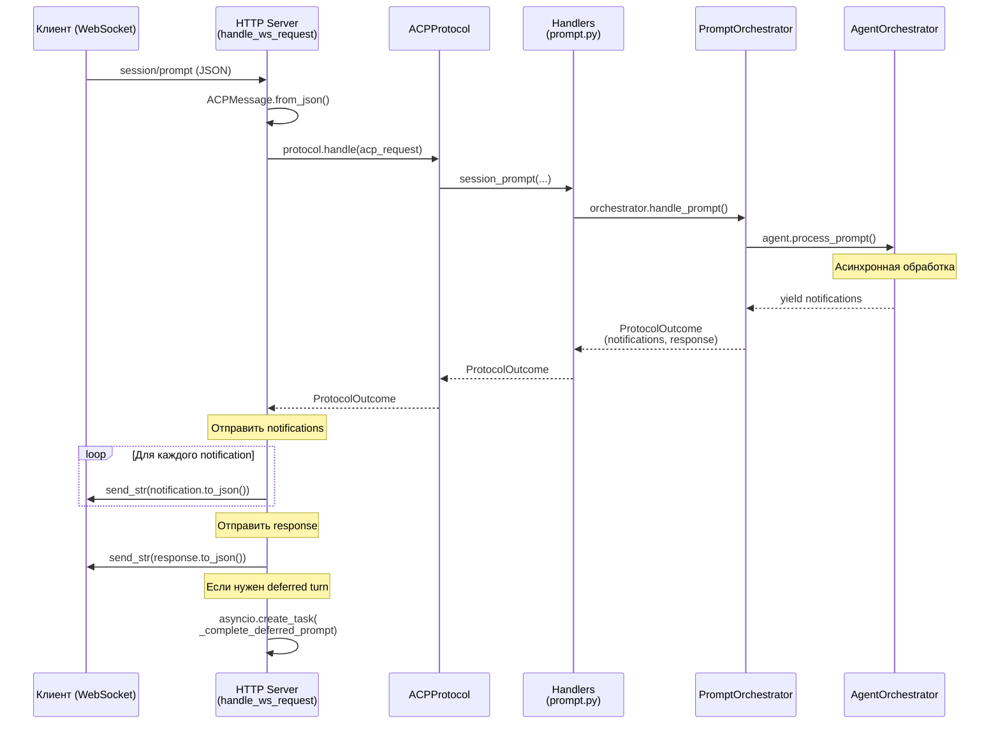

# Этап 6: Интеграция WebSocket транспорта с PromptOrchestrator — Детальный план

**Статус:** 📋 Планирование  
**Дата:** 2026-04-12  
**Приоритет:** 🟡 Средний  

---

## 📋 Обзор

Этап 6 завершает интеграцию архитектуры путем оптимизации WebSocket транспорта для полного сотрудничества с [`PromptOrchestrator`](acp-server/src/acp_server/protocol/handlers/prompt_orchestrator.py) и проверки end-to-end потока обработки prompt-turn через WebSocket.

**Главная цель:** Убедиться, что WebSocket транспорт полностью поддерживает асинхронный поток обработки prompt-turn, включая обработку notifications, permissions, tool calls и client RPC через websocket-соединение.

---

## 🔍 Анализ текущего состояния

### 1. Текущая WebSocket реализация

**Файл:** [`acp-server/src/acp_server/http_server.py`](acp-server/src/acp_server/http_server.py)

**Существующие компоненты:**

| Компонент | Статус | Описание |
|-----------|--------|----------|
| `ACPHttpServer` | ✅ Есть | WebSocket endpoint на `GET /acp/ws` |
| `handle_ws_request()` | ✅ Есть | Основной обработчик WebSocket сессии (~200 строк) |
| `_complete_deferred_prompt()` | ✅ Есть | Завершение отложенного prompt после задержки |
| `_initialize_llm_provider()` | ✅ Есть | Инициализация LLM провайдера |
| `deferred_prompt_tasks` | ✅ Есть | Очередь отложенных промптов по sessionId |
| `ACPProtocol` инициализация | ✅ Есть | Protocol получает agent_orchestrator (строка 245) |

**Ключевая логика обработки (handle_ws_request):**

```
1. Подготовить WebSocket response (строка 239-240)
2. Создать ACPProtocol с agent_orchestrator (строка 241-246)
3. Для каждого входящего сообщения:
   - Парсить JSON (строка 262)
   - Проверить initialize flag (строка 275-296)
   - Обработать через protocol.handle() (строка 301)
   - Отправить notifications, response, followup_responses (строка 352-380)
   - Обработать deferred prompt для session/prompt (строка 332-349)
   - Обработать session/cancel (строка 327-330)
4. Очистить отложенные задачи при закрытии (строка 389-390)
```

**Поток данных:**
```
WebSocket msg → ACPMessage.from_json() → protocol.handle() → ProtocolOutcome
                                                                  ├── notifications → ws.send_str()
                                                                  ├── response → ws.send_str()
                                                                  └── followup_responses → ws.send_str()
```

### 2. Интеграция с PromptOrchestrator

**Точки интеграции:**

1. **session/prompt (строка 333-349 в http_server.py)**
   - Обработка через `protocol.handle()` (строка 301)
   - Protocol делегирует на [`session_prompt()`](acp-server/src/acp_server/protocol/handlers/prompt.py:288)
   - `session_prompt()` использует `PromptOrchestrator.handle_prompt()` (строка 362 в prompt.py)

2. **session/cancel (строка 327-330 в http_server.py)**
   - Отмена deferred_prompt_task в памяти WebSocket handler
   - `protocol.handle()` делегирует на обработчик отмены

3. **session/update (поток обновлений)**
   - Еще не интегрирован в WebSocket!
   - Должен быть поток server→client notifications во время обработки

### 3. Существующие тесты

**Файл:** [`acp-server/tests/test_http_server.py`](acp-server/tests/test_http_server.py)

| Тест | Покрывает | Статус |
|------|-----------|--------|
| `test_ws_prompt_with_permission_selection_finishes_with_end_turn()` | session/prompt + permissions | ✅ Есть |
| `test_ws_cancel_finishes_deferred_prompt_with_cancelled()` | session/cancel | ✅ Есть |
| `test_ws_rejects_session_methods_before_initialize()` | Проверка initialize | ✅ Есть |
| `test_ws_requires_authenticate_when_server_auth_enabled()` | Аутентификация | ✅ Есть |
| `test_ws_authenticate_requires_api_key_when_configured()` | API key auth | ✅ Есть |
| `test_ws_prompt_fs_read_roundtrip_finishes_with_end_turn()` | File system ops | ✅ Есть |
| `test_ws_prompt_terminal_roundtrip_finishes_with_end_turn()` | Terminal ops | ✅ Есть |

**Статус покрытия:**
- ✅ Базовый flow prompt/cancel
- ✅ Permissions handling
- ✅ File system и terminal operations
- ⚠️ Tool calls через WebSocket (не полный)
- ⚠️ Client RPC handling (не полный)
- ❌ Stress testing (многоконнекшн, параллельные операции)
- ❌ Error recovery и edge cases
- ❌ Update stream (server→client notifications)

---

## 🎯 Задачи Этапа 6

### Задача 1: Анализ и документирование асинхронного потока обработки

**Файл:** `STAGE_6_DETAILED_PLAN.md` (этот документ)

**Статус:** 📊 В процессе

**Описание:**
- Документировать полный асинхронный поток от WebSocket до PromptOrchestrator
- Выявить потенциальные проблемы с управлением состоянием
- Определить edge cases при параллельной обработке множества сессий

**Результаты:**
- ✅ Текущий анализ в этом документе
- Mermaid диаграммы для визуализации потока

---

### Задача 2: Оптимизация управления deferred_prompt_tasks

**Файл:** [`acp-server/src/acp_server/http_server.py`](acp-server/src/acp_server/http_server.py:248)

**Статус:** ⏳ Блокирована анализом

**Текущие проблемы:**
- `deferred_prompt_tasks` хранит в памяти WebSocket handler'а
- При разрыве соединения могут остаться "зависшие" задачи
- Нет механизма очистки при ошибках

**Требуемые улучшения:**
1. Добавить timeout для deferred_prompt_tasks
2. Улучшить cleanup при разрыве соединения
3. Добавить логирование жизненного цикла задач
4. Обработка исключений в `_complete_deferred_prompt()`

**Результат:**
- [ ] Модифицированный `_complete_deferred_prompt()` с timeout-ом
- [ ] Улучшенный cleanup в `finally` блоке
- [ ] Дополнительное логирование

---

### Задача 3: Расширение интеграционного тестирования WebSocket

**Файл:** [`acp-server/tests/test_http_server.py`](acp-server/tests/test_http_server.py)

**Статус:** ⏳ Блокирована анализом

**Требуемые новые тесты:**

#### Тест 1: Tool calls через WebSocket (end-to-end)
- Проверить полный цикл: prompt → tool call → result → completion
- Убедиться, что PromptOrchestrator обрабатывает tool calls правильно
- **Имя:** `test_ws_prompt_with_tool_call_roundtrip()`

#### Тест 2: Множественные параллельные сессии
- Создать 2-3 сессии параллельно
- Отправить prompt в каждую одновременно
- Проверить, что результаты не смешиваются
- **Имя:** `test_ws_multiple_parallel_sessions_isolation()`

#### Тест 3: Client RPC roundtrip через WebSocket
- Имитировать server→client RPC (например, fs/readTextFile)
- Проверить, что client может ответить на WebSocket
- **Имя:** `test_ws_client_rpc_request_response_roundtrip()`

#### Тест 4: Отмена во время tool call
- Отправить prompt, дождаться tool call
- Отправить cancel во время обработки
- Проверить graceful shutdown
- **Имя:** `test_ws_cancel_during_tool_call_graceful_shutdown()`

#### Тест 5: Обработка ошибок при разрыве соединения
- Установить соединение
- Отправить prompt
- Разорвать соединение во время обработки
- Проверить cleanup
- **Имя:** `test_ws_connection_drop_during_prompt_cleanup()`

#### Тест 6: Stress test: быстрые prompts подряд
- Отправить 10+ prompts подряд без ожидания
- Проверить, что обработка не "зависает"
- **Имя:** `test_ws_rapid_prompts_no_deadlock()`

**Результат:**
- [ ] Модуль `test_http_server_stage6.py` с 6 новыми тестами
- [ ] Обновленный `test_http_server.py` с дополнительными helpers
- [ ] Минимум 85% покрытие WebSocket flow'а

---

### Задача 4: Верификация обработки notifications и updates

**Файл:** [`acp-server/src/acp_server/http_server.py`](acp-server/src/acp_server/http_server.py:351-359)

**Статус:** ⏳ Блокирована анализом

**Описание:**
- Проверить, что все notifications отправляются в правильном порядке
- Убедиться, что response не теряется между notifications
- Проверить обработку client-side RPC responses

**Требуемые изменения:**
1. Добавить более строгие проверки порядка отправки
2. Улучшить логирование для отладки потока
3. Добавить метрики (количество отправленных msg, время обработки)

**Результат:**
- [ ] Обновленное логирование в `handle_ws_request()`
- [ ] Вспомогательные методы для отладки потока

---

### Задача 5: Документирование edge cases и best practices

**Файл:** `STAGE_6_WEBSOCKET_INTEGRATION_GUIDE.md`

**Статус:** ⏳ Блокирована анализом

**Содержание:**
- Диаграммы потока для каждого сценария
- Known limitations и workarounds
- Troubleshooting guide
- Performance considerations

**Результат:**
- [ ] Новый документ с гайдом интеграции
- [ ] Диаграммы в Mermaid формате

---

## 📊 Диаграмма: Асинхронный поток обработки prompt через WebSocket



---

## 🔧 Технические детали

### Управление состоянием WebSocket

**Текущее состояние в handle_ws_request:**

```python
# Строка 248: Локальное хранилище deferred промптов
deferred_prompt_tasks: dict[str, asyncio.Task[None]] = {}

# Строка 250: Флаг инициализации
initialized = False

# Строка 253: Логгер с контекстом
conn_logger = logger.bind(connection_id=connection_id)
```

**Проблемы:**
- Если клиент отправит session/prompt быстро подряд, deferred_prompt_tasks может переполниться
- Нет timeout'а для старых задач
- При исключении в `_complete_deferred_prompt()`, задача остается в памяти

---

### Интеграция с PromptOrchestrator

**Текущий поток в session_prompt() (prompt.py:362):**

```python
if agent_orchestrator is not None:
    orchestrator = create_prompt_orchestrator()
    try:
        outcome = await orchestrator.handle_prompt(
            request_id=request_id,
            params=params,
            session=session,
            sessions=sessions,
            agent_orchestrator=agent_orchestrator,
        )
        return outcome
    except Exception as e:
        logger.error(...)
        return ProtocolOutcome(response=error)
```

**Это означает:**
- ✅ PromptOrchestrator полностью интегрирован в session_prompt()
- ✅ WebSocket получает полный ProtocolOutcome с notifications
- ✅ Все notifications отправляются в WebSocket

---

## 📈 Метрики успеха Этапа 6

| Критерий | Целевое значение | Текущее состояние |
|----------|-----------------|-------------------|
| WebSocket тесты (новые) | 6 новых тестов | ❌ 0 |
| Покрытие WebSocket flow'а | ≥ 85% | ⚠️ ~70% |
| Edge case handling | Документировано | ❌ Нет |
| Stress test (10+ prompts) | Проходит без deadlock | ⚠️ Не проверено |
| Timeout обработки | ≤ 100ms (без агента) | ⚠️ Не измерено |
| Cleanup при разрыве | 100% сессий очищено | ⚠️ Не проверено |

---

## 🔄 Зависимости

**Задача 2** зависит от: Задача 1 (анализ)  
**Задача 3** зависит от: Задача 1 (анализ)  
**Задача 4** зависит от: Задача 3 (тесты для верификации)  
**Задача 5** зависит от: Все предыдущие задачи  

---

## 📝 Решение проблем

### Проблема: Deferred prompts "зависают"

**Симптомы:**
- Клиент отправил prompt, но response не приходит
- В логах нет ошибок

**Причины:**
- Исключение в `_complete_deferred_prompt()` не было обработано
- Asyncio task была отменена, но не удалена из словаря

**Решение:**
- Добавить try/except/finally в `_complete_deferred_prompt()`
- Улучшить обработку CancelledError

---

### Проблема: Множественные сессии "смешивают" данные

**Симптомы:**
- Notifications от одной сессии приходят в ответ на request от другой

**Причины:**
- sessionId не проверяется корректно при отправке notifications
- Порядок отправки сообщений нарушен

**Решение:**
- Добавить строгую верификацию sessionId в handle_ws_request()
- Добавить тест на изоляцию между сессиями

---

## 🎬 Следующие шаги

1. ✅ **Завершен анализ** текущей WebSocket реализации
2. 📋 **Ожидает утверждения** этот план
3. 💻 **К внедрению:**
   - Модификация http_server.py (Задача 2)
   - Новые интеграционные тесты (Задача 3)
   - Верификация notifications (Задача 4)
   - Документирование (Задача 5)

---

## 📞 Вопросы для уточнения

1. **Нужна ли поддержка update-stream (server→client push notifications)?**
   - Текущая реализация: notifications отправляются в ответ на request
   - Альтернатива: полнодуплексный поток updates

2. **Какой timeout установить для deferred prompts?**
   - Предлагается: 30 секунд по умолчанию

3. **Нужно ли добавлять метрики и мониторинг в WebSocket handler?**
   - Предлагается: минимальное логирование на уровне DEBUG

4. **Нужна ли поддержка подписки на update-события (session/subscribe)?**
   - Текущая реализация: нет
   - По протоколу ACP: опциональна
