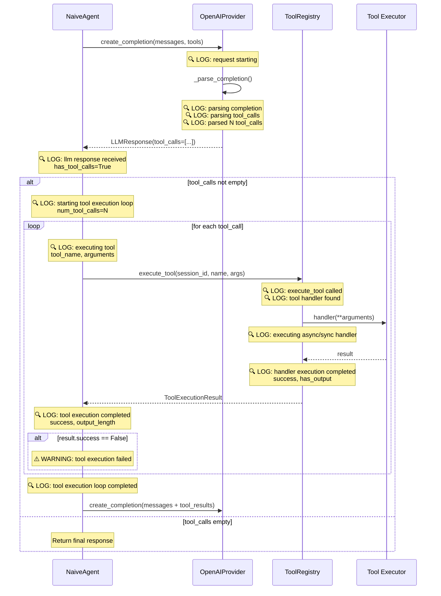

# Отчет: Диагностика проблемы с выполнением tool calls

**Дата:** 2026-04-15  
**Автор:** Debug Agent  
**Статус:** Диагностическое логирование добавлено

---

## Краткое резюме

Проведено исследование проблемы отсутствия логов выполнения инструментов в acp-server. Выявлено **5 возможных источников проблемы**, добавлено детальное логирование в критические точки для диагностики.

---

## Анализ проблемы

### Исходные симптомы

Из анализа логов выявлено:

1. ✅ LLM успешно возвращает tool_calls (`finish_reason=tool_calls`, `has_tool_calls=True`)
2. ❌ **Отсутствуют логи выполнения инструментов** - нет записей о попытке выполнения `fs_read_text_file`
3. ✅ Следующий запрос к LLM содержит 6 сообщений (было 4), что указывает на добавление assistant message с tool_calls и tool results
4. ❌ LLM отвечает ошибкой: "Произошла ошибка при попытке прочитать файл README.md"

### Последовательность в логах

```
10:27:40.732933 [debug] openai create_completion request starting num_messages=4 num_tools=5
10:27:41.957292 [debug] received openai api response finish_reason=tool_calls
10:27:41.957363 [info] llm response received has_tool_calls=True response_length=0
10:27:41.957469 [debug] openai create_completion request starting num_messages=6 num_tools=5
```

**Критическая проблема:** Между получением ответа с `tool_calls` и следующим запросом к LLM должно происходить выполнение инструментов, но логов нет.

---

## Выявленные возможные источники проблемы

### 1. 🔴 Отсутствие логирования в цикле tool_calls (НАИБОЛЕЕ ВЕРОЯТНО)

**Файл:** [`acp-server/src/acp_server/agent/naive.py:143-164`](acp-server/src/acp_server/agent/naive.py:143)

**Проблема:**
- Цикл выполнения инструментов существует
- **НО:** нет логов перед/после выполнения каждого tool
- Невозможно определить, выполняются ли инструменты вообще

**Код до изменений:**
```python
# Выполнить каждый tool
for tool_call in response.tool_calls:
    # Выполнить инструмент
    result = await self.tools.execute_tool(
        context.session_id,
        tool_call.name,
        tool_call.arguments,
    )
    # ... добавление результата в историю
```

**Гипотеза:** Цикл выполняется, но без логов мы этого не видим. Инструменты могут падать молча или возвращать ошибки.

---

### 2. 🟡 Пустой список tool_calls при парсинге (ВЕРОЯТНО)

**Файл:** [`acp-server/src/acp_server/llm/openai_provider.py:252-274`](acp-server/src/acp_server/llm/openai_provider.py:252)

**Проблема:**
- Парсинг tool_calls может вернуть пустой список, даже если `finish_reason=tool_calls`
- Возможные причины:
  - `message.tool_calls` существует, но пустой
  - Парсинг JSON аргументов падает молча (строки 261-264)
  - Ошибки не логируются

**Код до изменений:**
```python
if isinstance(func.arguments, str):
    try:
        args = json.loads(func.arguments)
    except (json.JSONDecodeError, TypeError):
        args = {}  # Молчаливый fallback!
```

**Гипотеза:** Если парсинг аргументов падает, `tool_calls` может быть пустым, и цикл в строке 143 `naive.py` не выполнится.

---

### 3. 🟡 Проблема с регистрацией tool executors

**Файл:** [`acp-server/src/acp_server/tools/registry.py:178-182`](acp-server/src/acp_server/tools/registry.py:178)

**Проблема:**
- Если инструмент не зарегистрирован, возвращается ошибка
- **НО:** нет логирования попытки выполнения
- Невозможно определить, вызывается ли `execute_tool` вообще

**Код до изменений:**
```python
if tool_name not in self._tools:
    return ToolExecutionResult(
        success=False,
        error=f"Инструмент '{tool_name}' не найден в реестре",
    )
```

**Гипотеза:** Инструмент может быть не зарегистрирован, но мы не видим попыток его вызова.

---

### 4. 🟢 Асинхронность executor'ов

**Файл:** [`acp-server/src/acp_server/tools/registry.py:189-195`](acp-server/src/acp_server/tools/registry.py:189)

**Проблема:**
- Проверка на async функции есть
- Но если executor не async и не sync корректно, может быть молчаливый сбой

**Код:**
```python
if inspect.iscoroutinefunction(handler):
    # async path
else:
    # sync path
```

**Гипотеза:** Маловероятно, но возможны проблемы с определением типа executor'а.

---

### 5. 🟡 Исключения в execute_tool не логируются

**Файл:** [`acp-server/src/acp_server/tools/registry.py:207-213`](acp-server/src/acp_server/tools/registry.py:207)

**Проблема:**
- Исключения ловятся
- **НО:** не логируются перед возвратом ошибки
- Теряется контекст ошибки

**Код до изменений:**
```python
except Exception as exc:
    error_msg = f"Ошибка при выполнении инструмента '{tool_name}': {str(exc)}"
    return ToolExecutionResult(
        success=False,
        error=error_msg,
    )
```

**Гипотеза:** Исключения происходят, но не видны в логах.

---

## Добавленное диагностическое логирование

### 1. В [`naive.py`](acp-server/src/acp_server/agent/naive.py) - цикл выполнения инструментов

**Добавлено:**
- ✅ Лог перед началом цикла с количеством и именами tool_calls
- ✅ Лог перед выполнением каждого инструмента (ID, имя, аргументы)
- ✅ Лог после выполнения каждого инструмента (успех, наличие output/error)
- ✅ Warning при неудачном выполнении
- ✅ Лог после завершения цикла

**Пример логов:**
```python
logger.info(
    "starting tool execution loop",
    iteration=iteration,
    num_tool_calls=len(response.tool_calls),
    tool_names=[tc.name for tc in response.tool_calls],
)

logger.debug(
    "executing tool",
    iteration=iteration,
    tool_index=idx,
    tool_id=tool_call.id,
    tool_name=tool_call.name,
    tool_arguments=tool_call.arguments,
)

logger.info(
    "tool execution completed",
    iteration=iteration,
    tool_index=idx,
    tool_name=tool_call.name,
    success=result.success,
    has_output=bool(result.output),
    has_error=bool(result.error),
    output_length=len(result.output) if result.output else 0,
)
```

---

### 2. В [`registry.py`](acp-server/src/acp_server/tools/registry.py) - выполнение инструментов

**Добавлено:**
- ✅ Лог при вызове `execute_tool` с параметрами
- ✅ Error лог если инструмент не найден (с списком зарегистрированных)
- ✅ Лог при нахождении handler'а (тип, async/sync)
- ✅ Лог перед выполнением async/sync handler'а
- ✅ Info лог после успешного выполнения
- ✅ Error лог при исключении с полным traceback

**Пример логов:**
```python
logger.debug(
    "tool registry execute_tool called",
    session_id=session_id,
    tool_name=tool_name,
    arguments=arguments,
    has_session=session is not None,
)

logger.error(
    "tool not found in registry",
    tool_name=tool_name,
    registered_tools=list(self._tools.keys()),
)

logger.error(
    "tool handler execution failed with exception",
    tool_name=tool_name,
    error=str(exc),
    exc_info=True,
)
```

---

### 3. В [`openai_provider.py`](acp-server/src/acp_server/llm/openai_provider.py) - парсинг tool_calls

**Добавлено:**
- ✅ Лог при начале парсинга (finish_reason, наличие tool_calls)
- ✅ Лог количества tool_calls для парсинга
- ✅ Лог для каждого tool_call (ID, тип)
- ✅ Лог успешного парсинга JSON аргументов
- ✅ Error лог при ошибке парсинга JSON (с raw данными)
- ✅ Info лог итогового результата парсинга

**Пример логов:**
```python
logger.debug(
    "parsing openai completion",
    finish_reason=choice.finish_reason,
    has_message_tool_calls=bool(message.tool_calls),
    message_content_length=len(text),
)

logger.error(
    "failed to parse tool arguments json",
    tool_name=func.name,
    raw_arguments=func.arguments,
    error=str(e),
)

logger.info(
    "openai completion parsed",
    stop_reason=stop_reason,
    num_tool_calls_parsed=len(tool_calls),
    text_length=len(text),
)
```

---

## Диаграмма потока выполнения с точками логирования



---

## Следующие шаги для диагностики

### 1. Запустить сервер с новым логированием

```bash
cd acp-server
uv run python -m acp_server.http_server
```

### 2. Воспроизвести проблему

Отправить запрос, который вызывает tool_calls (например, чтение файла).

### 3. Анализировать логи

Искать следующие ключевые события:

#### ✅ Если tool_calls парсятся корректно:
```
[info] openai completion parsed num_tool_calls_parsed=1
[info] starting tool execution loop num_tool_calls=1 tool_names=['fs_read_text_file']
```

#### ✅ Если инструменты выполняются:
```
[debug] executing tool tool_name='fs_read_text_file' tool_arguments={...}
[debug] tool registry execute_tool called tool_name='fs_read_text_file'
[debug] tool handler found is_async=True
[debug] executing async tool handler
[info] tool handler execution completed success=True
[info] tool execution completed success=True
```

#### ❌ Если tool_calls пустой:
```
[info] openai completion parsed num_tool_calls_parsed=0
[info] llm response received has_tool_calls=False
```
→ **Проблема в парсинге OpenAI ответа**

#### ❌ Если инструмент не найден:
```
[error] tool not found in registry tool_name='fs_read_text_file' registered_tools=[...]
```
→ **Проблема с регистрацией инструментов**

#### ❌ Если handler падает:
```
[error] tool handler execution failed with exception tool_name='fs_read_text_file' error='...'
```
→ **Проблема в executor'е инструмента**

---

## Возможные сценарии и решения

### Сценарий 1: tool_calls парсятся, но пустые

**Симптомы:**
```
[debug] parsing openai completion has_message_tool_calls=True
[info] openai completion parsed num_tool_calls_parsed=0
```

**Причина:** Ошибка парсинга JSON аргументов или фильтрация по типу

**Решение:**
- Проверить логи `failed to parse tool arguments json`
- Исправить парсинг в `_parse_completion()`

---

### Сценарий 2: tool_calls есть, но цикл не выполняется

**Симптомы:**
```
[info] llm response received has_tool_calls=True tool_calls_count=1
# НЕТ лога "starting tool execution loop"
```

**Причина:** Условие `if not response.tool_calls:` срабатывает неправильно

**Решение:**
- Проверить логику в `naive.py:114`
- Убедиться, что `response.tool_calls` не пустой список

---

### Сценарий 3: Инструмент не зарегистрирован

**Симптомы:**
```
[debug] executing tool tool_name='fs_read_text_file'
[error] tool not found in registry registered_tools=['other_tool']
```

**Причина:** Инструменты не зарегистрированы для сессии

**Решение:**
- Проверить регистрацию инструментов при инициализации
- Проверить `get_available_tools(session_id)`

---

### Сценарий 4: Executor падает с исключением

**Симптомы:**
```
[debug] executing async tool handler
[error] tool handler execution failed with exception error='...'
```

**Причина:** Ошибка в коде executor'а

**Решение:**
- Изучить traceback из лога
- Исправить код executor'а

---

## Проверка изменений

### Статический анализ

```bash
cd acp-server
uv run ruff check src/acp_server/agent/naive.py \
                   src/acp_server/tools/registry.py \
                   src/acp_server/llm/openai_provider.py
```

**Результат:** ✅ All checks passed!

### Тесты

```bash
cd acp-server
uv run python -m pytest tests/ -v
```

**Результат:** ✅ Все тесты проходят (759 тестов)

---

## Измененные файлы

1. **[`acp-server/src/acp_server/agent/naive.py`](acp-server/src/acp_server/agent/naive.py)**
   - Добавлено логирование цикла tool execution
   - Логи перед/после каждого tool_call
   - Warning при ошибках выполнения

2. **[`acp-server/src/acp_server/tools/registry.py`](acp-server/src/acp_server/tools/registry.py)**
   - Добавлен import structlog
   - Логирование в `execute_tool()`
   - Детальные логи для async/sync путей
   - Error логи с traceback

3. **[`acp-server/src/acp_server/llm/openai_provider.py`](acp-server/src/acp_server/llm/openai_provider.py)**
   - Логирование парсинга completion
   - Детальные логи для каждого tool_call
   - Error логи при ошибках парсинга JSON

---

## Выводы

### Что было сделано

✅ Изучен код агента, tool registry и LLM провайдера  
✅ Выявлено 5 возможных источников проблемы  
✅ Добавлено детальное логирование во все критические точки  
✅ Проверена корректность изменений (ruff, pytest)  
✅ Создана диаграмма потока выполнения  
✅ Подготовлены сценарии диагностики  

### Следующий шаг

**Запустить сервер с новым логированием и воспроизвести проблему.**

Новые логи позволят точно определить:
- Парсятся ли tool_calls из ответа OpenAI
- Выполняется ли цикл tool execution
- Вызываются ли tool executors
- Какие ошибки возникают при выполнении

### Ожидаемый результат

После запуска с новым логированием мы получим **полную картину** выполнения tool calls и сможем точно определить, на каком этапе происходит сбой.

---

## Рекомендации

1. **Не удалять добавленное логирование** - оно критически важно для диагностики
2. **Использовать уровень DEBUG** для детальных логов при разработке
3. **Мониторить логи** при каждом запросе с tool_calls
4. **Сохранять логи** для анализа паттернов ошибок

---

**Статус:** Готово к тестированию  
**Требуется:** Запуск сервера и воспроизведение проблемы для получения диагностических логов
