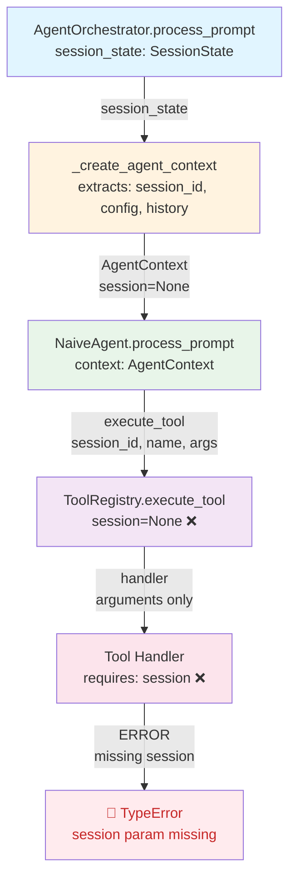
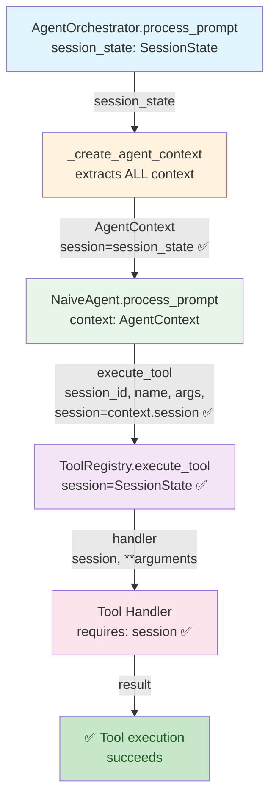

# Архитектурный план исправления передачи SessionState в tool handlers

**Дата**: 2026-04-15  
**Статус**: Planning  
**Приоритет**: High  

## 1. Анализ проблемы

### Корневая причина

Tool handlers требуют `session: SessionState` для доступа к контексту сессии (рабочая директория, конфигурация, permissions и т.д.), но `NaiveAgent` не передает `session` в `ToolRegistry.execute_tool()`.

### Текущая архитектура (с проблемой)

```
AgentOrchestrator.process_prompt(session_state: SessionState)
  ↓
  _create_agent_context(session_state) → AgentContext (БЕЗ session!)
  ↓
  NaiveAgent.process_prompt(context: AgentContext)
  ↓
  ToolRegistry.execute_tool(session_id, name, args) ← session=None!
  ↓
  handler(session=???, **arguments) ← ОШИБКА!
```

### Текущее состояние кода

1. **[`acp-server/src/acp_server/agent/base.py:12-19`](acp-server/src/acp_server/agent/base.py:12)** - `AgentContext` dataclass:
   - Содержит: `session_id`, `prompt`, `conversation_history`, `available_tools`, `config`
   - **НЕ содержит**: `session: SessionState`

2. **[`acp-server/src/acp_server/agent/orchestrator.py:87`](acp-server/src/acp_server/agent/orchestrator.py:87)** - `_create_agent_context()`:
   - Создает `AgentContext` из `SessionState`
   - Не передает сам `SessionState` в контекст

3. **[`acp-server/src/acp_server/agent/naive.py:161-165`](acp-server/src/acp_server/agent/naive.py:161)** - вызов `execute_tool()`:
   - Вызывает `self.tools.execute_tool(context.session_id, tool_call.name, tool_call.arguments)`
   - **НЕ передает** параметр `session`

4. **[`acp-server/src/acp_server/tools/registry.py:161`](acp-server/src/acp_server/tools/registry.py:161)** - `execute_tool()` signature:
   - Уже имеет параметр `session: Any = None` (опциональный)
   - Реализована логика проверки наличия `session` в сигнатуре handler (строка 222)
   - **Готов к приему session**, но его не передают

5. **[`acp-server/src/acp_server/tools/definitions/filesystem.py:119`](acp-server/src/acp_server/tools/definitions/filesystem.py:119)** - tool handlers:
   - Требуют `session: SessionState` как первый параметр
   - Используют `session.cwd`, `session.config_values` и другие поля

---

## 2. Анализ вариантов решения

### Вариант A: Добавить `session: SessionState` в `AgentContext` ✅ ВЫБРАН

**Описание**:
```python
@dataclass
class AgentContext:
    session_id: str
    session: SessionState  # NEW!
    prompt: list[dict[str, Any]]
    conversation_history: list[LLMMessage]
    available_tools: list[ToolDefinition]
    config: dict[str, Any]
```

**Преимущества**:
- ✅ Чистая архитектура: SessionState логически принадлежит контексту
- ✅ Не требует изменения сигнатур методов интерфейса (`LLMAgent.process_prompt`)
- ✅ Явное передача session через контекст (не implicit через side effects)
- ✅ Масштабируемо: если в будущем нужна другая контекстная информация, добавляется в AgentContext
- ✅ Минимальные изменения в коде (изменяются 4 файла, все изменения прямолинейные)

**Недостатки**:
- ❌ Небольшое увеличение размера AgentContext (но это вполне оправдано)

**Оценка по критериям**:
- Чистота архитектуры: ⭐⭐⭐⭐⭐ (SessionState явно часть контекста)
- Минимальность изменений: ⭐⭐⭐⭐ (4 файла с простыми изменениями)
- Обратная совместимость: ⭐⭐⭐⭐⭐ (не меняются публичные интерфейсы)
- **Выбор**: **ДА** - это оптимальное решение

---

### Вариант B: Передать `session_state` отдельно в `NaiveAgent.process_prompt()`

**Описание**:
```python
# В LLMAgent ABC:
async def process_prompt(self, context: AgentContext, session: SessionState) -> AgentResponse:
    pass

# В NaiveAgent:
async def process_prompt(self, context: AgentContext, session: SessionState) -> AgentResponse:
    # ...
    result = await self.tools.execute_tool(
        context.session_id,
        tool_call.name,
        tool_call.arguments,
        session=session  # Передаём здесь
    )
```

**Преимущества**:
- ✅ Явное разделение: контекст отдельно, session отдельно
- ✅ Не модифицирует `AgentContext`

**Недостатки**:
- ❌ Нарушает интерфейс `LLMAgent` - требует изменения сигнатуры `process_prompt`
- ❌ Требует обновления всех реализаций `LLMAgent` (сейчас только `NaiveAgent`, но возможны другие)
- ❌ Требует обновления всех вызовов `agent.process_prompt()` в `AgentOrchestrator`
- ❌ Менее логично: почему session не часть контекста?

**Оценка**: ⭐⭐⭐ - хуже, чем Вариант A из-за нарушения интерфейса

---

### Вариант C: Сохранить `session_state` в `NaiveAgent` как instance variable

**Описание**:
```python
class NaiveAgent(LLMAgent):
    def __init__(self, ...):
        self._current_session: SessionState | None = None
    
    async def process_prompt(self, context: AgentContext) -> AgentResponse:
        # Получить session из где-то и сохранить
        # Потом использовать self._current_session
```

**Преимущества**:
- ✅ Не меняет интерфейсы

**Недостатки**:
- ❌ NaiveAgent становится stateful (плохая практика)
- ❌ Требует явного управления состоянием (setting/clearing session)
- ❌ Не очевидно как получить session в NaiveAgent (придется передавать через обратный вызов)
- ❌ Не решает проблему для конкурентных вызовов

**Оценка**: ⭐⭐ - худший вариант

---

## 3. Выбранный вариант: Вариант A

**Решение**: Добавить `session: SessionState` в `AgentContext` dataclass.

**Обоснование**:
1. SessionState логически является частью контекста выполнения агента
2. Не требует изменения публичных интерфейсов (LLMAgent остается неизменным)
3. Явное (не скрытое) передача session через контекст
4. Минимальные и целевые изменения (4 файла)
5. Хорошо масштабируется для будущих расширений

---

## 4. Детальный план изменений

### 4.1. Порядок внесения изменений

1. ✅ **Шаг 1**: Обновить `AgentContext` в [`base.py`](acp-server/src/acp_server/agent/base.py)
2. ✅ **Шаг 2**: Обновить `_create_agent_context()` в [`orchestrator.py`](acp-server/src/acp_server/agent/orchestrator.py)
3. ✅ **Шаг 3**: Обновить вызов `execute_tool()` в [`naive.py`](acp-server/src/acp_server/agent/naive.py)
4. ✅ **Шаг 4**: Обновить unit тесты
5. ✅ **Шаг 5**: Добавить интеграционный тест
6. ✅ **Шаг 6**: Запустить полный набор тестов

### 4.2. Изменение 1: [`acp-server/src/acp_server/agent/base.py`](acp-server/src/acp_server/agent/base.py)

**Тип**:修改 dataclass `AgentContext`

**Что менять**:
```python
from acp_server.protocol.state import SessionState

@dataclass
class AgentContext:
    """Контекст выполнения агента для одного prompt turn."""

    session_id: str
    session: SessionState  # NEW: добавляем сюда
    prompt: list[dict[str, Any]]
    conversation_history: list[LLMMessage]
    available_tools: list[ToolDefinition]
    config: dict[str, Any]
```

**Импорты**:
- Добавить: `from acp_server.protocol.state import SessionState`

**Логика**:
- Просто добавить поле `session: SessionState` в dataclass
- Поле должно быть вторым (после `session_id`) для логичного группирования

**Тестирование**:
- Unit тест: создание AgentContext с session

---

### 4.3. Изменение 2: [`acp-server/src/acp_server/agent/orchestrator.py`](acp-server/src/acp_server/agent/orchestrator.py)

**Тип**:修改 метод `_create_agent_context()`

**Что менять** (в методе `_create_agent_context`, строка 106-144):
```python
def _create_agent_context(
    self,
    session_state: SessionState,
    prompt: str,
) -> AgentContext:
    """Преобразовать SessionState в AgentContext."""
    # ... существующий код ...
    
    return AgentContext(
        session_id=session_state.session_id,
        session=session_state,  # NEW: передавать session
        prompt=prompt_blocks,
        conversation_history=conversation_history,
        available_tools=available_tools,
        config=session_state.config_values,
    )
```

**Логика**:
- В вызове конструктора `AgentContext` добавить `session=session_state`
- Это все, что нужно в этом файле

**Тестирование**:
- Unit тест: проверить что `_create_agent_context()` возвращает AgentContext с правильным session
- Проверить что session содержит правильный session_id, cwd и т.д.

---

### 4.4. Изменение 3: [`acp-server/src/acp_server/agent/naive.py`](acp-server/src/acp_server/agent/naive.py)

**Тип**:修改 вызов `execute_tool()` в методе `process_prompt()`

**Что менять** (строка 161-165):
```python
# Было:
result = await self.tools.execute_tool(
    context.session_id,
    tool_call.name,
    tool_call.arguments,
)

# Стало:
result = await self.tools.execute_tool(
    context.session_id,
    tool_call.name,
    tool_call.arguments,
    session=context.session,  # NEW: передаём session из контекста
)
```

**Логика**:
- Добавить четвертый параметр `session=context.session` в вызов `execute_tool()`

**Тестирование**:
- Unit тест с mock ToolRegistry: проверить что execute_tool вызывается с правильными параметрами

---

### 4.5. Файлы которые НЕ нужно менять

❌ **[`acp-server/src/acp_server/tools/registry.py`](acp-server/src/acp_server/tools/registry.py)**
- Уже поддерживает параметр `session: Any = None`
- Уже реализована логика проверки сигнатуры handler
- Не требует изменений

❌ **[`acp-server/src/acp_server/tools/definitions/filesystem.py`](acp-server/src/acp_server/tools/definitions/filesystem.py)**
- Handlers уже принимают `session: SessionState`
- Уже корректно используют session
- Не требует изменений

---

## 5. План тестирования

### 5.1. Unit тесты

#### Тест 1: Создание AgentContext с session
**Файл**: `acp-server/tests/test_agent_base.py`

```python
def test_agent_context_with_session():
    """Проверить что AgentContext содержит session."""
    session = SessionState(
        session_id="test_session",
        cwd="/tmp",
        mcp_servers=[]
    )
    
    context = AgentContext(
        session_id="test_session",
        session=session,
        prompt=[{"type": "text", "text": "test"}],
        conversation_history=[],
        available_tools=[],
        config={},
    )
    
    assert context.session == session
    assert context.session.session_id == "test_session"
    assert context.session.cwd == "/tmp"
```

**Что проверяем**:
- ✅ AgentContext успешно содержит session
- ✅ session доступен и содержит корректные данные

---

#### Тест 2: _create_agent_context передает session
**Файл**: `acp-server/tests/test_agent_orchestrator.py`

```python
def test_create_agent_context_includes_session(
    orchestrator: AgentOrchestrator,
):
    """Проверить что _create_agent_context включает session."""
    session = SessionState(
        session_id="test_session",
        cwd="/home/test",
        mcp_servers=[],
    )
    
    context = orchestrator._create_agent_context(session, "test prompt")
    
    assert context.session == session
    assert context.session.session_id == "test_session"
    assert context.session.cwd == "/home/test"
```

**Что проверяем**:
- ✅ `_create_agent_context()` возвращает AgentContext с правильным session
- ✅ Все поля session доступны

---

#### Тест 3: NaiveAgent передает session в execute_tool
**Файл**: `acp-server/tests/test_naive_agent.py`

```python
@pytest.mark.asyncio
async def test_naive_agent_passes_session_to_tool_registry(
    llm_provider: MockLLMProvider,
):
    """Проверить что NaiveAgent передает session в execute_tool."""
    # Создать mock ToolRegistry которая отслеживает вызовы
    tool_registry = Mock(spec=ToolRegistry)
    tool_registry.get_available_tools.return_value = []
    
    # Мок execute_tool для проверки вызова
    async def mock_execute(session_id, name, args, session=None):
        assert session is not None
        assert isinstance(session, SessionState)
        return ToolExecutionResult(success=True, output="ok")
    
    tool_registry.execute_tool = mock_execute
    
    agent = NaiveAgent(llm=llm_provider, tools=tool_registry)
    
    session = SessionState(
        session_id="test_session",
        cwd="/tmp",
        mcp_servers=[],
    )
    
    context = AgentContext(
        session_id="test_session",
        session=session,
        prompt=[{"type": "text", "text": "test"}],
        conversation_history=[],
        available_tools=[],
        config={},
    )
    
    # LLM возвращает tool call
    llm_provider.create_completion.return_value = AgentResponse(
        text="",
        tool_calls=[
            LLMToolCall(
                id="call_1",
                name="fs/read_text_file",
                arguments={"path": "/tmp/test.txt"}
            )
        ],
        stop_reason="tool_use",
    )
    
    # Должно вызвать execute_tool с session
    await agent.process_prompt(context)
    
    # Проверяем что execute_tool был вызван с session параметром
    tool_registry.execute_tool.assert_called_once()
```

**Что проверяем**:
- ✅ `NaiveAgent.process_prompt()` передает session в `execute_tool()`
- ✅ session имеет правильный тип (SessionState)

---

### 5.2. Интеграционный тест

#### Тест: Полный flow от AgentOrchestrator до tool execution
**Файл**: `acp-server/tests/test_agent_tool_integration.py` (новый файл)

```python
@pytest.mark.asyncio
async def test_agent_orchestrator_passes_session_through_tool_execution():
    """Интеграционный тест: session передается от orchestrator через agent к tool."""
    
    # Setup
    session = SessionState(
        session_id="test_session",
        cwd="/tmp/test",
        mcp_servers=[],
    )
    
    # Create real tool registry with mock executor
    tool_registry = SimpleToolRegistry()
    
    # Регистрировать тестовый tool который проверяет session
    received_sessions = []
    
    async def test_tool_handler(session: SessionState, **args):
        received_sessions.append(session)
        assert session.session_id == "test_session"
        assert session.cwd == "/tmp/test"
        return "success"
    
    from acp_server.tools.base import ToolDefinition
    tool_registry.register(
        ToolDefinition(
            name="test/check_session",
            description="Test tool",
            parameters={"type": "object", "properties": {}},
        ),
        test_tool_handler,
    )
    
    # Create mock LLM that returns a tool call
    llm_provider = Mock(spec=LLMProvider)
    llm_provider.create_completion.return_value = AgentResponse(
        text="",
        tool_calls=[
            LLMToolCall(
                id="call_1",
                name="test/check_session",
                arguments={}
            )
        ],
        stop_reason="tool_use",
    )
    
    # Второй вызов LLM возвращает конец
    llm_provider.create_completion.side_effect = [
        # First call - tool call
        AgentResponse(
            text="",
            tool_calls=[
                LLMToolCall(
                    id="call_1",
                    name="test/check_session",
                    arguments={}
                )
            ],
            stop_reason="tool_use",
        ),
        # Second call - final response
        AgentResponse(
            text="Final answer",
            tool_calls=[],
            stop_reason="end_turn",
        ),
    ]
    
    # Create orchestrator
    config = OrchestratorConfig(agent_class="naive")
    orchestrator = AgentOrchestrator(config, llm_provider, tool_registry)
    
    # Execute
    response = await orchestrator.process_prompt(session, "test prompt")
    
    # Verify
    assert response.text == "Final answer"
    assert len(received_sessions) == 1
    assert received_sessions[0].session_id == "test_session"
    assert received_sessions[0].cwd == "/tmp/test"
```

**Что проверяем**:
- ✅ Session передается через всю цепь: orchestrator → agent → registry → handler
- ✅ Handler получает правильный session с корректными данными
- ✅ Интеграция работает end-to-end

---

### 5.3. Регрессионные тесты

#### Проверить что существующие тесты не сломаны

```bash
# Run all agent tests
cd acp-server && uv run python -m pytest tests/test_agent*.py -v

# Run all tool tests
cd acp-server && uv run python -m pytest tests/test_tool*.py -v

# Run full test suite
make check
```

**Что проверяем**:
- ✅ Все unit тесты AgentContext (test_agent_base.py)
- ✅ Все unit тесты AgentOrchestrator (test_agent_orchestrator.py)
- ✅ Все unit тесты NaiveAgent (test_naive_agent.py)
- ✅ Тесты tool_definitions
- ✅ Конформность протокола (test_conformance.py)
- ✅ E2E тесты с агентом (test_protocol_with_agent.py)

---

## 6. Диаграммы

### 6.1. Текущее состояние (с проблемой)



**Описание потока**:
1. `AgentOrchestrator` получает `session_state`
2. `_create_agent_context()` извлекает из session_state только отдельные поля
3. `AgentContext` создается БЕЗ самого session_state
4. `NaiveAgent` получает только `AgentContext`
5. Вызов `execute_tool()` не передает `session` параметр
6. `ToolRegistry.execute_tool()` получает `session=None`
7. Tool handler требует `session: SessionState` → **ERROR**

---

### 6.2. Целевое состояние (после исправления)



**Описание потока**:
1. `AgentOrchestrator` получает `session_state`
2. `_create_agent_context()` передает полный session_state в контекст ✅
3. `AgentContext` содержит `session: SessionState`
4. `NaiveAgent` получает `AgentContext` с session
5. Вызов `execute_tool()` передает `session=context.session` ✅
6. `ToolRegistry.execute_tool()` получает `session=SessionState` ✅
7. Tool handler получает `session: SessionState` → **SUCCESS** ✅

---

### 6.3. Диаграмма классов (до и после)

```mermaid
classDiagram
    class AgentContext_Before {
        session_id: str
        prompt: list[dict]
        conversation_history: list[LLMMessage]
        available_tools: list[ToolDefinition]
        config: dict[str, Any]
    }
    
    class AgentContext_After {
        session_id: str
        session: SessionState ✨
        prompt: list[dict]
        conversation_history: list[LLMMessage]
        available_tools: list[ToolDefinition]
        config: dict[str, Any]
    }
    
    class SessionState {
        session_id: str
        cwd: str
        mcp_servers: list
        config_values: dict
        history: list
        tool_calls: dict
        runtime_capabilities: ClientRuntimeCapabilities
    }
    
    note for AgentContext_After "✨ Новое поле для передачи session в handlers"
    note for SessionState "Содержит полный контекст сессии"
    
    AgentContext_After -->|содержит| SessionState
```

---

## 7. План внедрения

### Фаза 1: Изменения кода (Шаги 1-3)

1. Обновить `AgentContext` в `base.py`
   - Добавить импорт `SessionState`
   - Добавить поле `session: SessionState`
   - Обновить docstring

2. Обновить `_create_agent_context()` в `orchestrator.py`
   - Добавить `session=session_state` в конструктор AgentContext

3. Обновить `execute_tool()` вызов в `naive.py`
   - Добавить `session=context.session` в параметры

### Фаза 2: Тестирование (Шаги 4-5)

4. Создать/обновить unit тесты
   - Test для AgentContext с session (test_agent_base.py)
   - Test для _create_agent_context (test_agent_orchestrator.py)
   - Test для execute_tool вызова (test_naive_agent.py)

5. Создать интеграционный тест
   - End-to-end тест в test_agent_tool_integration.py

### Фаза 3: Проверка (Шаг 6)

6. Запустить полный набор тестов
   - `make check` для полной проверки
   - Регрессионные тесты для существующей функциональности

---

## 8. Оценка рисков

### 8.1. Риск 1: Нарушение существующих тестов

**Вероятность**: 🟡 Medium  
**Влияние**: 🔴 High  

**Описание**: Изменение сигнатуры `AgentContext` может привести к падению существующих тестов.

**Смягчение**:
- ✅ Все существующие тесты используют `AgentContext` через конструктор
- ✅ Python dataclass автоматически обновляет `__init__`
- ✅ Нужно обновить только вызовы конструктора в тестах (поиск по `AgentContext(`)

**План восстановления**:
- Локально запустить `pytest tests/test_agent*.py -v` после каждого шага
- Обновить вызовы конструктора где нужно

---

### 8.2. Риск 2: Циклические импорты

**Вероятность**: 🟡 Medium  
**Влияние**: 🟡 Medium  

**Описание**: Добавление импорта `SessionState` в `base.py` может создать циклический импорт.

**Анализ**:
- `base.py` находится в `acp_server.agent.base`
- `SessionState` находится в `acp_server.protocol.state`
- Нет существующих импортов между этими модулями
- Риск низкий, но нужно проверить

**Смягчение**:
- ✅ Проверить: `grep -r "from.*base import" acp_server/protocol/`
- ✅ Если циклический импорт, использовать `TYPE_CHECKING`:
```python
from typing import TYPE_CHECKING

if TYPE_CHECKING:
    from acp_server.protocol.state import SessionState
```

**План восстановления**:
- При ошибке импорта использовать отложенный импорт через `TYPE_CHECKING`
- Добавить `session: SessionState | None = None` в dataclass если нужно

---

### 8.3. Риск 3: Несовместимость с другими агентами

**Вероятность**: 🟢 Low  
**Влияние**: 🟡 Medium  

**Описание**: Если в будущем добавятся другие реализации `LLMAgent`, они должны будут работать с обновленным `AgentContext`.

**Анализ**:
- ✅ `LLMAgent` - это ABC (abstract base class)
- ✅ Изменение `AgentContext` не меняет интерфейс `LLMAgent.process_prompt()`
- ✅ Другие реализации просто будут получать AgentContext с session
- ✅ Это не обязательно использовать session, но он будет доступен

**Смягчение**:
- ✅ Нет изменений в интерфейсе `LLMAgent`
- ✅ `AgentContext` - это просто dataclass, расширяемая структура

---

### 8.4. Риск 4: Нарушение спецификации ACP

**Вероятность**: 🟢 Low  
**Влияние**: 🔴 Critical  

**Описание**: Это изменение должно соответствовать спецификации ACP.

**Анализ**:
- ✅ ACP протокол определен в `doc/Agent Client Protocol/`
- ✅ Это изменение - внутренняя реализация, не меняет протокол
- ✅ Не меняется никакие сообщения ACP, только внутренние структуры
- ✅ Tool handlers требуют session - это уже часть реализации

**Смягчение**:
- ✅ Не менять документацию в `doc/Agent Client Protocol/`
- ✅ Не менять сообщения протокола
- ✅ Не менять публичные интерфейсы CLI

---

### 8.5. Риск 5: Производительность

**Вероятность**: 🟢 Low  
**Влияние**: 🟢 Low  

**Описание**: Может ли добавление session в AgentContext снизить производительность?

**Анализ**:
- ✅ SessionState - это просто reference, не копируется
- ✅ Нет дополнительных выделений памяти
- ✅ Нет дополнительных операций при создании контекста

**Смягчение**:
- ✅ Нет дополнительных действий, риск минимален

---

## 9. Чек-лист внедрения

### Перед началом
- [ ] Создать feature branch: `git checkout -b fix/session-state-tool-calls`
- [ ] Убедиться что все существующие тесты проходят: `make check`

### Во время внедрения
- [ ] **Шаг 1**: Обновить `base.py` (AgentContext)
  - [ ] Добавить импорт SessionState
  - [ ] Добавить поле session
  - [ ] Коммит: `feat: add session field to AgentContext`

- [ ] **Шаг 2**: Обновить `orchestrator.py` (_create_agent_context)
  - [ ] Добавить session=session_state в конструктор
  - [ ] Запустить тесты: `pytest tests/test_agent_orchestrator.py -v`
  - [ ] Коммит: `feat: pass session to AgentContext in orchestrator`

- [ ] **Шаг 3**: Обновить `naive.py` (execute_tool вызов)
  - [ ] Добавить session=context.session в параметры
  - [ ] Запустить тесты: `pytest tests/test_naive_agent.py -v`
  - [ ] Коммит: `feat: pass session to tool registry in NaiveAgent`

- [ ] **Шаг 4**: Обновить/создать unit тесты
  - [ ] test_agent_base.py: AgentContext с session
  - [ ] test_agent_orchestrator.py: _create_agent_context
  - [ ] test_naive_agent.py: execute_tool вызов с session
  - [ ] Все тесты зеленые: `pytest tests/test_agent*.py -v`
  - [ ] Коммит: `test: add tests for session in AgentContext`

- [ ] **Шаг 5**: Создать интеграционный тест
  - [ ] test_agent_tool_integration.py: end-to-end flow
  - [ ] Тест проходит: `pytest tests/test_agent_tool_integration.py -v`
  - [ ] Коммит: `test: add integration test for session flow`

- [ ] **Шаг 6**: Полная проверка
  - [ ] Запустить `make check`
  - [ ] Все checks проходят ✅
  - [ ] Нет warnings или errors

### После внедрения
- [ ] Code review
- [ ] Merge в main branch
- [ ] Проверить CI/CD pipeline
- [ ] Обновить CHANGELOG.md если нужно

---

## 10. Выводы

### Рекомендация

**Принять Вариант A**: Добавить `session: SessionState` в `AgentContext`.

### Преимущества решения

1. ✅ **Чистая архитектура** - SessionState логически часть контекста
2. ✅ **Минимальные изменения** - 3 файла с простыми изменениями
3. ✅ **Не нарушает интерфейсы** - LLMAgent остается неизменным
4. ✅ **Явное** - не скрытые side effects
5. ✅ **Масштабируемо** - легко расширять в будущем
6. ✅ **Безопасно** - низкие риски для существующей функциональности

### Ожидаемый результат

После внедрения:
- ✅ Tool handlers будут получать `session: SessionState`
- ✅ Все операции, требующие контекста сессии, будут работать
- ✅ Тесты будут проходить зелено
- ✅ Нет регрессий существующей функциональности
- ✅ Код останется чистым и поддерживаемым

---

**Документ подготовлен**: 2026-04-15  
**Статус**: Ready for Review  
**Следующий шаг**: Switch to Code mode for implementation
