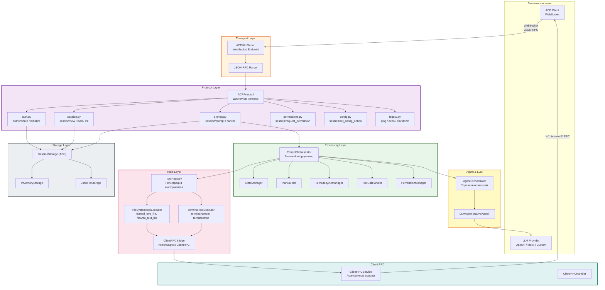
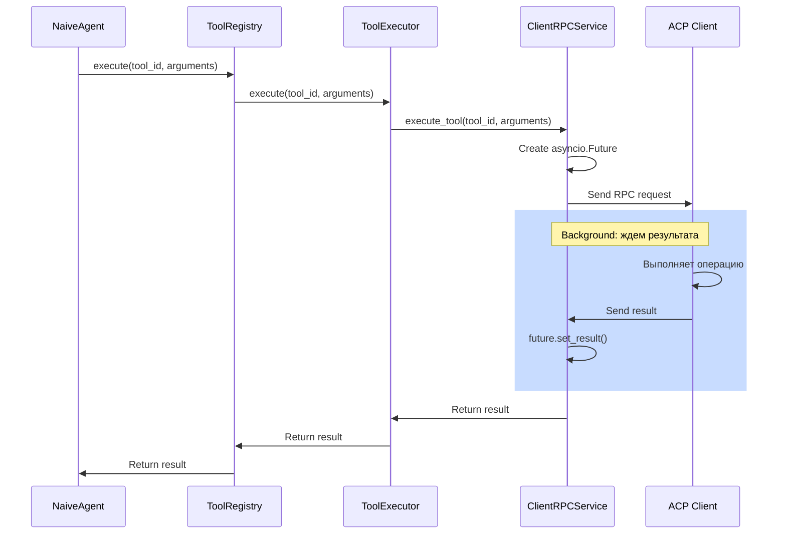
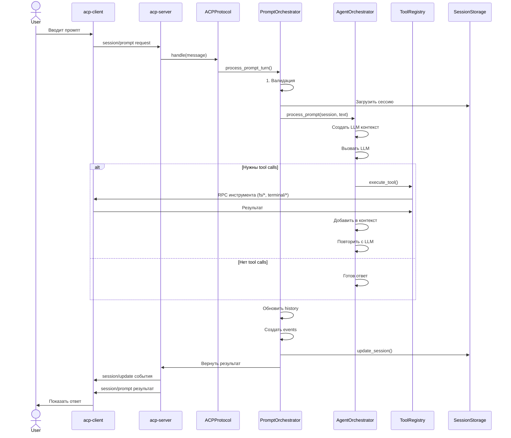

# Архитектура acp-server

## Оглавление

1. [Введение](#введение)
2. [Обзор архитектуры](#обзор-архитектуры)
3. [Модульная структура](#модульная-структура)
4. [Protocol Layer](#protocol-layer)
5. [Agent Layer](#agent-layer)
6. [Tools Layer](#tools-layer)
7. [Client RPC Layer](#client-rpc-layer)
8. [Storage Layer](#storage-layer)
9. [Transport Layer](#transport-layer)
10. [Потоки обработки](#потоки-обработки)
11. [Паттерны проектирования](#паттерны-проектирования)

---

## Введение

**acp-server** — реализация серверной части протокола ACP на Python. Отвечает за:
- Управление сессиями и их состоянием
- Обработку протокольных методов (authenticate, initialize, session/prompt и т.д.)
- Интеграцию с LLM агентом для обработки промптов
- Управление инструментами (tools) и их выполнением
- Асинхронную коммуникацию с клиентом через WebSocket
- Персистентность сессий через различные storage backends

---

## Обзор архитектуры

### Диаграмма компонентов высокого уровня



---

## Модульная структура

### Дерево файлов

```
acp-server/src/acp_server/
├── exceptions.py                    # Специализированные исключения
├── models.py                        # Pydantic модели типизации
├── messages.py                      # ACP сообщения
├── cli.py                           # CLI entry point
├── http_server.py                   # WebSocket сервер
├── logging.py                       # Структурированное логирование
├── server.py                        # TCP сервер (legacy)
├── config.py                        # Конфигурация
│
├── protocol/                        # 🔄 ЯДРО ПРОТОКОЛА
│   ├── __init__.py                  # Экспорт публичного API
│   ├── core.py                      # ACPProtocol (диспетчер)
│   ├── state.py                     # SessionState, ProtocolOutcome
│   ├── session_factory.py           # SessionFactory (фабрика сессий)
│   ├── content/                     # Типы контента
│   │   ├── base.py                  # Базовый класс Content
│   │   ├── text.py                  # TextContent
│   │   ├── image.py                 # ImageContent
│   │   ├── audio.py                 # AudioContent
│   │   ├── embedded.py              # EmbeddedContent
│   │   └── resource_link.py         # ResourceLinkContent
│   └── handlers/                    # 🎯 ОБРАБОТЧИКИ МЕТОДОВ
│       ├── auth.py                  # authenticate, initialize
│       ├── session.py               # session/new, load, list
│       ├── prompt.py                # session/prompt (входная точка)
│       ├── prompt_orchestrator.py   # PromptOrchestrator (главный координатор)
│       ├── permissions.py           # session/request_permission
│       ├── config.py                # session/set_config_option
│       ├── legacy.py                # ping, echo, shutdown
│       │
│       # Компоненты PromptOrchestrator:
│       ├── state_manager.py         # StateManager
│       ├── plan_builder.py          # PlanBuilder
│       ├── turn_lifecycle_manager.py # TurnLifecycleManager
│       ├── tool_call_handler.py     # ToolCallHandler
│       ├── permission_manager.py    # PermissionManager
│       └── client_rpc_handler.py    # ClientRPCHandler
│
├── agent/                           # 🤖 LLM АГЕНТ
│   ├── base.py                      # LLMAgent (ABC), AgentContext, AgentResponse
│   ├── naive.py                     # NaiveAgent (реализация)
│   ├── orchestrator.py              # AgentOrchestrator (управление агентом)
│   └── state.py                     # OrchestratorConfig
│
├── tools/                           # 🛠️ УПРАВЛЕНИЕ ИНСТРУМЕНТАМИ
│   ├── base.py                      # BaseTool, ToolDefinition, ToolRegistry
│   ├── registry.py                  # ToolRegistry (реализация)
│   ├── definitions/                 # Определения встроенных инструментов
│   │   ├── filesystem.py            # FileSystemToolDefinitions (fs/*)
│   │   └── terminal.py              # TerminalToolDefinitions (terminal/*)
│   ├── executors/                   # Исполнители инструментов
│   │   ├── base.py                  # BaseToolExecutor (ABC)
│   │   ├── filesystem_executor.py   # FileSystemToolExecutor
│   │   └── terminal_executor.py     # TerminalExecutor
│   └── integrations/                # Интеграции для executors
│       ├── client_rpc_bridge.py     # ClientRPCBridge (связь с RPC)
│       └── permission_checker.py    # PermissionChecker (проверка разрешений)
│
├── llm/                             # 🧠 LLM ПРОВАЙДЕРЫ
│   ├── base.py                      # BaseLLMProvider (ABC)
│   ├── mock_provider.py             # MockLLMProvider (для тестирования)
│   └── openai_provider.py           # OpenAIProvider (OpenAI API)
│
├── client_rpc/                      # 📡 АСИНХРОННЫЕ RPC ВЫЗОВЫ
│   ├── models.py                    # RpcRequest, RpcResponse
│   ├── service.py                   # ClientRPCService (управление Future)
│   ├── exceptions.py                # Исключения RPC
│   └── __init__.py                  # Экспорт
│
└── storage/                         # 💾 ХРАНИЛИЩЕ СЕССИЙ
    ├── base.py                      # SessionStorage (ABC)
    ├── memory.py                    # InMemoryStorage
    ├── json_file.py                 # JsonFileStorage
    └── __init__.py                  # Экспорт
```

---

## Protocol Layer

### ACPProtocol: Диспетчер методов

[`ACPProtocol`](../src/acp_server/protocol/core.py:39) — главный класс протокола, отвечающий за:
- Диспетчеризацию входящих методов на соответствующие handlers
- Управление состоянием на уровне протокола
- Координацию работы всех компонентов

### Обработчики методов (Handlers)

Каждый handler отвечает за группу методов протокола:

| Handler | Методы | Файл |
|---------|--------|------|
| **auth** | `authenticate`, `initialize` | [`auth.py`](../src/acp_server/protocol/handlers/auth.py) |
| **session** | `session/new`, `session/load`, `session/list` | [`session.py`](../src/acp_server/protocol/handlers/session.py) |
| **prompt** | `session/prompt`, `session/cancel` | [`prompt.py`](../src/acp_server/protocol/handlers/prompt.py) |
| **permissions** | `session/request_permission`, `session/request_permission_response` | [`permissions.py`](../src/acp_server/protocol/handlers/permissions.py) |
| **config** | `session/set_config_option` | [`config.py`](../src/acp_server/protocol/handlers/config.py) |
| **legacy** | `ping`, `echo`, `shutdown` | [`legacy.py`](../src/acp_server/protocol/handlers/legacy.py) |

### SessionState: Состояние сессии

[`SessionState`](../src/acp_server/protocol/state.py) содержит:
- `session_id`: Уникальный идентификатор
- `model`: Название модели LLM
- `system_prompt`: Системный промпт
- `messages`: История сообщений (для LLM)
- `tool_calls`: Активные tool calls
- `config_options`: Конфигурационные параметры
- `events_history`: История событий (для replay)

---

## Agent Layer

### AgentOrchestrator: Управление LLM агентом

[`AgentOrchestrator`](../src/acp_server/agent/orchestrator.py:18) отвечает за:
- Создание и управление экземплярами [`LLMAgent`](../src/acp_server/agent/base.py)
- Преобразование `SessionState` в `AgentContext` для LLM
- Координацию выполнения tool calls
- **Ключевое правило:** **НЕ модифицирует** `SessionState` при обработке промпта

```python
class AgentOrchestrator:
    async def process_prompt(
        self,
        session_state: SessionState,
        prompt: str,
    ) -> AgentResponse:
        """Обработать промпт и вернуть ответ агента.
        
        ВАЖНО: НЕ модифицирует session_state.
        История сообщений обновляется в PromptOrchestrator.
        """
        agent_context = self._create_agent_context(session_state, prompt)
        agent_response = await self.agent.process_prompt(agent_context)
        return agent_response
```

### NaiveAgent: Простая реализация агента

[`NaiveAgent`](../src/acp_server/agent/naive.py) реализует цикл:
1. Добавить user message в контекст LLM
2. Вызвать LLM
3. Если есть tool calls:
   - Выполнить tools через [`ToolRegistry`](../src/acp_server/tools/registry.py)
   - Добавить tool results в контекст
   - Повторить с LLM (до max_iterations)
4. Вернуть final assistant message

---

## Tools Layer

### ToolRegistry: Регистрация инструментов

[`ToolRegistry`](../src/acp_server/tools/registry.py) управляет регистрацией и выполнением инструментов согласно спецификации ACP:

```python
class ToolRegistry:
    async def register(
        self,
        tool_id: str,
        definition: ToolDefinition,
        executor: ToolExecutor,
    ) -> None:
        """Регистрирует инструмент."""
        pass
    
    async def execute(
        self,
        tool_id: str,
        arguments: dict,
    ) -> dict:
        """Выполняет инструмент."""
        pass
```

### Встроенные инструменты согласно ACP спецификации

#### FileSystem инструменты

[`FileSystemToolDefinitions`](../src/acp_server/tools/definitions/filesystem.py) определяет методы для работы с файловой системой клиента. Согласно [ACP File System спецификации](../../doc/Agent Client Protocol/protocol/09-File System.md):

- **`fs/read_text_file`** (RPC метод)
  - Параметры: `sessionId`, `path`, `line` (опционально), `limit` (опционально)
  - Возвращает: `content` (содержимое файла)
  - Агент должен проверить `clientCapabilities.fs.readTextFile` перед вызовом

- **`fs/write_text_file`** (RPC метод)
  - Параметры: `sessionId`, `path`, `content`
  - Возвращает: status
  - Агент должен проверить `clientCapabilities.fs.writeTextFile` перед вызовом

#### Terminal инструменты

[`TerminalToolDefinitions`](../src/acp_server/tools/definitions/terminal.py) определяет методы для работы с терминалом клиента. Согласно [ACP Terminal спецификации](../../doc/Agent Client Protocol/protocol/10-Terminal.md):

- **`terminal/create`** (RPC метод)
  - Параметры: `sessionId`, `command`, `args` (опционально), `env` (опционально), `cwd` (опционально), `outputByteLimit`
  - Возвращает: `terminalId`
  - Агент должен проверить `clientCapabilities.terminal` перед вызовом

- **`terminal/stop`** (RPC метод)
  - Параметры: `terminalId`
  - Останавливает терминал

### Диаграмма выполнения инструмента



---

## Client RPC Layer

### ClientRPCService: Асинхронное управление RPC

[`ClientRPCService`](../src/acp_server/client_rpc/service.py) управляет асинхронными вызовами методов на клиенте:

```python
class ClientRPCService:
    async def execute_tool(
        self,
        tool_id: str,
        arguments: dict,
    ) -> dict:
        """Выполнить инструмент на клиенте.
        
        1. Создает RPC request
        2. Отправляет на клиент
        3. Ждет ответа через asyncio.Future
        4. Возвращает результат
        """
        request_id = self._generate_request_id()
        future: asyncio.Future = asyncio.Future()
        
        self._pending_requests[request_id] = future
        
        # Отправляем на клиент
        await self._transport.send({
            "jsonrpc": "2.0",
            "id": request_id,
            "method": tool_id,
            "params": arguments,
        })
        
        # Ждем результата
        result = await future
        return result
```

---

## Storage Layer

### SessionStorage: Абстракция хранилища

[`SessionStorage`](../src/acp_server/storage/base.py) — абстрактный класс для управления сессиями:

```python
class SessionStorage(ABC):
    @abstractmethod
    async def create_session(self, state: SessionState) -> SessionState:
        """Создать новую сессию."""
        pass
    
    @abstractmethod
    async def load_session(self, session_id: str) -> SessionState:
        """Загрузить существующую сессию."""
        pass
    
    @abstractmethod
    async def update_session(self, state: SessionState) -> SessionState:
        """Обновить сессию."""
        pass
    
    @abstractmethod
    async def delete_session(self, session_id: str) -> None:
        """Удалить сессию."""
        pass
    
    @abstractmethod
    async def list_sessions(
        self,
        limit: int = 100,
        offset: int = 0,
    ) -> list[SessionState]:
        """Получить список сессий."""
        pass
```

### Реализации

#### InMemoryStorage

[`InMemoryStorage`](../src/acp_server/storage/memory.py) хранит сессии в памяти:
- ✅ Быстро для development и тестирования
- ❌ Данные теряются при перезагрузке
- Идеально для: Локальная разработка, CI/CD тесты

#### JsonFileStorage

[`JsonFileStorage`](../src/acp_server/storage/json_file.py) хранит сессии в JSON файлах:
- ✅ Персистентность на диск
- ✅ Восстановление через replay events_history
- ✅ Human-readable format для отладки
- Идеально для: Production, демо, архивирование

---

## Transport Layer

### ACPHttpServer: WebSocket сервер

[`ACPHttpServer`](../src/acp_server/http_server.py) управляет WebSocket соединениями и JSON-RPC обменом согласно спецификации ACP:

```python
class ACPHttpServer:
    async def handle_ws_message(self, message: dict, ws: WebSocket) -> None:
        """Обработать сообщение от клиента."""
        # 1. Парсинг JSON-RPC
        request = parse_jsonrpc(message)
        
        # 2. Передача протоколу
        outcome = await self.protocol.handle(request)
        
        # 3. Отправка ответа
        if outcome.response:
            await ws.send_json({
                "jsonrpc": "2.0",
                "id": request.id,
                "result": outcome.response,
            })
        
        # 4. Отправка updates (асинхронно)
        for update in outcome.updates:
            await ws.send_json({
                "jsonrpc": "2.0",
                "method": "session/update",
                "params": update,
            })
```

---

## Потоки обработки

### Полный цикл session/prompt



---

## Паттерны проектирования

### 1. Strategy Pattern (Storage Backends)

Разные реализации `SessionStorage`:

```python
# Development
storage = InMemoryStorage()

# Production
storage = JsonFileStorage(path="/var/lib/acp/sessions")

# Все используют один интерфейс
protocol = ACPProtocol(storage=storage)
```

### 2. Builder Pattern (SessionState)

Построение сложного `SessionState`:

```python
class SessionFactory:
    @staticmethod
    def create_session(
        session_id: str,
        model: str,
        system_prompt: str,
        tools: list[ToolDefinition],
    ) -> SessionState:
        """Фабрика для создания SessionState."""
        return SessionState(
            session_id=session_id,
            created_at=datetime.now(),
            model=model,
            system_prompt=system_prompt,
            tools=tools,
            messages=[],
            tool_calls={},
            config_options={},
            events_history=[],
        )
```

### 3. Dependency Injection (Constructor Injection)

```python
class PromptOrchestrator:
    def __init__(
        self,
        state_manager: StateManager,
        plan_builder: PlanBuilder,
        turn_lifecycle_manager: TurnLifecycleManager,
        tool_call_handler: ToolCallHandler,
        permission_manager: PermissionManager,
        client_rpc_handler: ClientRPCHandler,
        tool_registry: ToolRegistry,
    ):
        # Все зависимости инжектированы
        # Легко тестировать с mock-объектами
```

---

## Ключевые архитектурные решения

### 1. Двухуровневая история

**История сессии существует в двух формах:**

1. **SessionState.history** (для LLM):
   - Содержит Message objects (user/assistant)
   - Используется для контекста LLM
   - Компактная форма

2. **events_history** (для replay):
   - Содержит события (started, added, completed)
   - Используется при load для восстановления
   - Полная информация для воспроизведения

**Почему?** Обеспечивает разделение ответственности и полное восстановление состояния.

### 2. PromptOrchestrator как центральный координатор

**Все этапы обработки prompt-turn в одном месте:**
- Валидация
- LLM обработка
- Tool execution
- Permission checking
- History updates
- Event recording

**Почему?** Упрощает отладку, обеспечивает атомарность операций.

### 3. Фильтрация tools по ClientRuntimeCapabilities

**Не все инструменты доступны для всех клиентов:**

```python
available_tools = [
    tool for tool in all_tools
    if client_capabilities.supports(tool.id)
]
```

**Почему?** Гибкость для разных типов клиентов и безопасность.

### 4. ClientRPCService с asyncio.Future

**Асинхронное ожидание результатов инструментов:**

```python
future = asyncio.Future()
pending_requests[request_id] = future
# ... отправить на клиент ...
result = await future  # Блокирует до результата
```

**Почему?** Истинная асинхронность без блокировок, позволяет обрабатывать несколько промптов параллельно.

---

## Резюме

**acp-server архитектура разработана для:**
- ✅ Модульности (разделение на слои и компоненты)
- ✅ Расширяемости (легко добавлять tools, handlers, storage backends)
- ✅ Тестируемости (dependency injection, интерфейсы)
- ✅ Надежности (proper error handling, validation)
- ✅ Производительности (асинхронность, оптимальные структуры)
- ✅ Соответствия спецификации ACP (полная реализация протокола)
