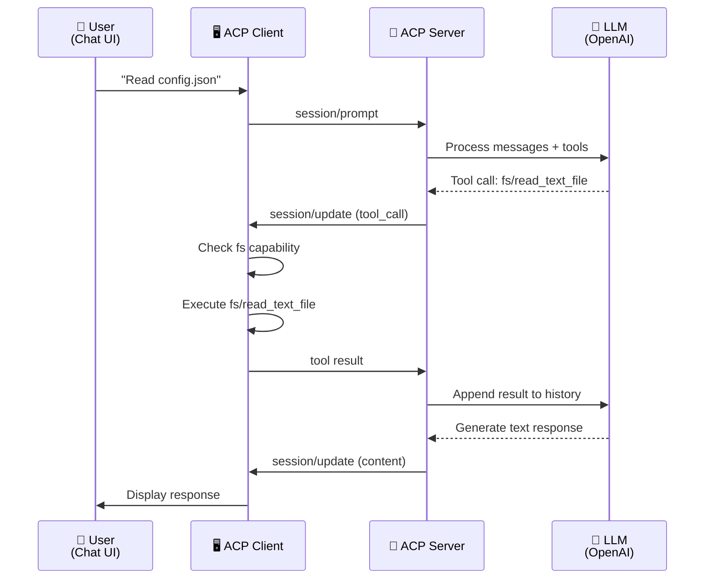
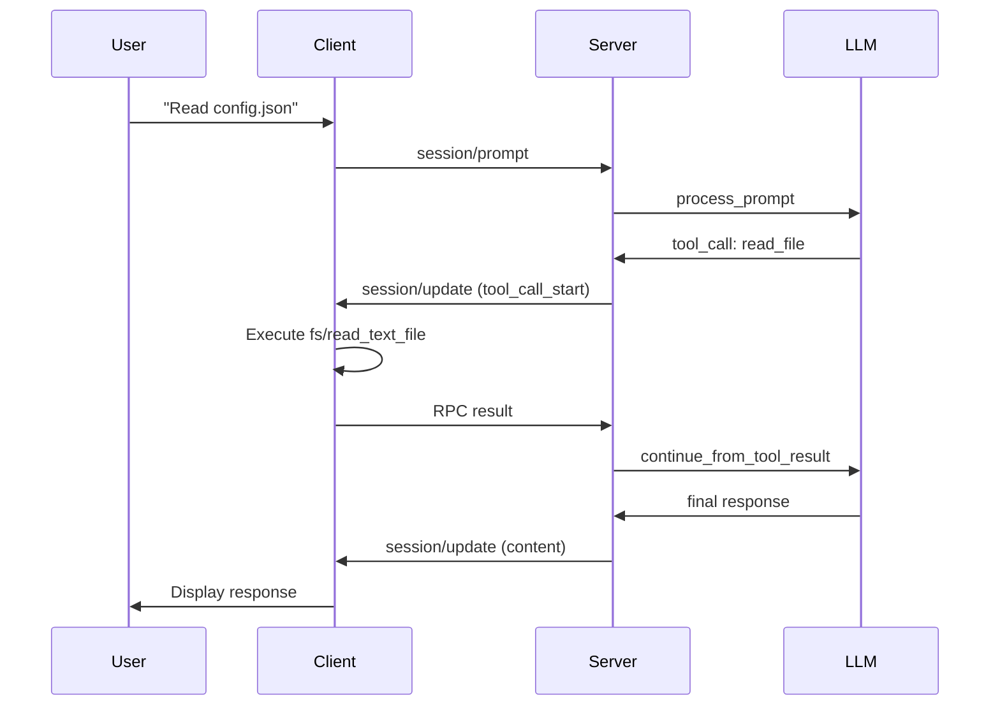

# Руководство по интеграции Agent Logic и ACP Transport Layer

**Дата:** April 2026  
**Версия:** 1.0  
**Статус:** Recommended Architecture

---

## Содержание

1. [Введение](#введение)
2. [Архитектура взаимодействия](#архитектура-взаимодействия)
3. [Flow выполнения Tool Calls](#flow-выполнения-tool-calls)
4. [Выполнение fs/* и terminal/* на клиенте](#выполнение-fs--и-terminal--на-клиенте)
5. [Рекомендуемые архитектурные паттерны](#рекомендуемые-архитектурные-паттерны)
6. [Практические примеры](#практические-примеры)
7. [Миграция с текущей архитектуры](#миграция-с-текущей-архитектуры)
8. [Рекомендации для разработчиков](#рекомендации-для-разработчиков)

---

## Введение

### Цель документа

Этот документ определяет правильный и эффективный способ организации взаимодействия между:
- **Agent Logic Layer** — бизнес-логика агента, обработка запросов, управление состоянием
- **ACP Transport Layer** — сетевой протокол (WebSocket), сериализация, доставка сообщений

### Область применения

- Реализация ACP-агентов на Python (acp-server)
- Интеграция LLM (Language Model) в протокольный слой
- Организация client RPC (fs/*, terminal/*)
- Архитектура обработчиков для tool calls
- Система управления разрешениями и пользовательскими запросами

### Ключевые принципы

1. **Separation of Concerns** — транспортный слой не должен содержать бизнес-логику
2. **Dependency Injection** — явные зависимости, не скрытое состояние
3. **Stateless Handler** — каждый обработчик должен быть stateless функцией
4. **Clear Message Flow** — явная направленность обмена сообщениями
5. **Testability** — архитектура должна позволять тестировать компоненты независимо

---

## Архитектура взаимодействия

### Обзор компонентов

```
┌─────────────────────────────────────────────────────────────┐
│                     ACP Server (acp-server)                 │
├─────────────────────────────────────────────────────────────┤
│                                                               │
│  ┌──────────────────────────────────────────────────────┐   │
│  │           Transport Layer (http_server.py)           │   │
│  │  WebSocket Endpoint, JSON-RPC, Message Dispatch      │   │
│  └──────────────────────┬───────────────────────────────┘   │
│                         │                                     │
│  ┌──────────────────────▼───────────────────────────────┐   │
│  │          Protocol Layer (protocol/core.py)           │   │
│  │  ACPProtocol: Method Dispatcher, Session Manager     │   │
│  └──────────────────────┬───────────────────────────────┘   │
│                         │                                     │
│  ┌──────────────────────▼───────────────────────────────┐   │
│  │        Handlers (protocol/handlers/*.py)             │   │
│  │  authenticate, session/*, prompt, permissions        │   │
│  └──────────────────────┬───────────────────────────────┘   │
│                         │                                     │
│  ┌──────────────────────▼───────────────────────────────┐   │
│  │        Agent Logic (agent/llm_agent.py)              │   │
│  │  LLMAgent, Tool Execution, State Management          │   │
│  └──────────────────────┬───────────────────────────────┘   │
│                         │                                     │
│  ┌──────────────────────▼───────────────────────────────┐   │
│  │      External Services (storage, llm_provider)       │   │
│  │  SessionStorage, LLMProvider, PermissionManager      │   │
│  └──────────────────────────────────────────────────────┘   │
│                                                               │
└─────────────────────────────────────────────────────────────┘
                         │
                    WebSocket
                         │
┌─────────────────────────▼───────────────────────────────────┐
│                   ACP Client (acp-client)                    │
├─────────────────────────────────────────────────────────────┤
│                                                               │
│  ┌──────────────────────────────────────────────────────┐   │
│  │      Transport Layer (infrastructure/transport)      │   │
│  │  WebSocket Connection, Message Queue                 │   │
│  └──────────────────────┬───────────────────────────────┘   │
│                         │                                     │
│  ┌──────────────────────▼───────────────────────────────┐   │
│  │     Client RPC Handlers (handlers/filesystem.py      │   │
│  │                         handlers/terminal.py)        │   │
│  │  Handle fs/*, terminal/* requests from server        │   │
│  └──────────────────────┬───────────────────────────────┘   │
│                         │                                     │
│  ┌──────────────────────▼───────────────────────────────┐   │
│  │      Application Layer (application/*.py)            │   │
│  │  SessionCoordinator, Use Cases, State Machine        │   │
│  └──────────────────────┬───────────────────────────────┘   │
│                         │                                     │
│  ┌──────────────────────▼───────────────────────────────┐   │
│  │      Presentation Layer (presentation/*.py)          │   │
│  │  ViewModels, UI Components                           │   │
│  └──────────────────────────────────────────────────────┘   │
│                                                               │
└─────────────────────────────────────────────────────────────┘
```

### Разделение ответственности

| Компонент | Ответственность | Не отвечает за |
|-----------|-----------------|-----------------|
| **Transport Layer** | Доставка сообщений, JSON-RPC, WebSocket | Бизнес-логика, принятие решений |
| **Protocol Layer** | Диспетчеризация методов, управление сессиями | Выполнение инструментов, интеграция LLM |
| **Handlers** | Валидация параметров, преобразование данных | Обработка сложных алгоритмов |
| **Agent Logic** | Генерация tool calls, обработка результатов | Отправка сообщений, управление сокетом |
| **Client RPC** | Выполнение fs/*, terminal/* запросов | Генерация tool calls, планирование |

---

## Flow выполнения Tool Calls

### Детальное описание этапов

#### Этап 1: Пользователь отправляет prompt

```
Клиент отправляет:
session/prompt {
  sessionId: "sess_abc123",
  messages: [
    { role: "user", content: "Read /tmp/config.json and check values" }
  ]
}
```

#### Этап 2: Сервер обрабатывает prompt через LLM

**Файл:** [`acp-server/src/acp_server/protocol/handlers/prompt.py`](acp-server/src/acp_server/protocol/handlers/prompt.py)

```python
# Pseudo-code логики обработки
async def handle_session_prompt(protocol, params):
    session_id = params["sessionId"]
    messages = params["messages"]
    
    # 1. Получить сессию и её конфигурацию
    session = protocol._sessions[session_id]
    
    # 2. Добавить сообщения в историю LLM
    session.agent_state.llm_message_history.extend(messages)
    
    # 3. Отправить в LLM для генерации ответа/tool calls
    # LLM может:
    # - Ответить текстом (chat completion)
    # - Запросить tool calls (function calling)
    
    agent_response = await session.agent.process_prompt(
        session_id=session_id,
        prompt=messages,
        tools=session.tools,  # Доступные инструменты
        config=session.config
    )
    
    # 4. Обработать ответ агента
    if agent_response.tool_calls:
        for tool_call in agent_response.tool_calls:
            # Отправить tool call клиенту через session/update
            await protocol.send_tool_call_to_client(
                session_id, tool_call
            )
```

#### Этап 3: Tool Call передается клиенту через session/update

**Из спецификации ACP (protocol/08-Tool Calls.md):**

> When the language model requests a tool invocation, the Agent **SHOULD** report it to the Client:

```json
{
  "jsonrpc": "2.0",
  "method": "session/update",
  "params": {
    "sessionId": "sess_abc123def456",
    "update": {
      "sessionUpdate": "tool_call",
      "toolCallId": "call_001",
      "title": "Reading configuration file",
      "kind": "read",
      "status": "pending"
    }
  }
}
```

#### Этап 4: Клиент получает tool call и проверяет тип

**Файл:** `acp-client/src/acp_client/handlers/filesystem.py`

```python
async def handle_server_fs_request(protocol, params):
    """Обработка RPC запроса fs/* от сервера."""
    
    method = params.get("method")  # "fs/read_text_file" или "fs/write_text_file"
    
    if method == "fs/read_text_file":
        path = params["params"]["path"]
        line = params["params"].get("line")
        limit = params["params"].get("limit")
        
        try:
            content = read_file_from_client_fs(path, line, limit)
            return {
                "jsonrpc": "2.0",
                "id": params.get("id"),
                "result": {"content": content}
            }
        except Exception as e:
            return error_response(params.get("id"), str(e))
```

#### Этап 5: Клиент отправляет результат серверу

```json
{
  "jsonrpc": "2.0",
  "id": 10,
  "result": {
    "content": "{\n  \"debug\": true,\n  \"version\": \"1.0.0\"\n}"
  }
}
```

#### Этап 6: Сервер получает результат и передает LLM

```python
async def handle_tool_call_result(protocol, session_id, tool_call_id, result):
    """Обработка результата tool call от клиента."""
    
    session = protocol._sessions[session_id]
    
    # Найти tool call в истории
    tool_call = session.agent_state.find_tool_call(tool_call_id)
    
    # Добавить результат в историю LLM (как assistant message)
    session.agent_state.llm_message_history.append({
        "role": "assistant",
        "content": [
            {
                "type": "tool_result",
                "tool_use_id": tool_call_id,
                "content": result["content"]
            }
        ]
    })
    
    # Продолжить обработку с LLM
    next_response = await session.agent.continue_from_tool_result(
        session_id=session_id,
        tool_call_id=tool_call_id,
        result=result
    )
```

#### Этап 7: Цикл повторяется до завершения

Агент может:
- Сгенерировать еще tool calls → вернуться к Этапу 3
- Отправить финальный ответ пользователю → завершить обработку
- Запросить разрешение пользователя → использовать session/request_permission

### Sequence диаграмма



### Примеры кода

**Реализация Agent интерфейса:**

```python
# acp-server/src/acp_server/agent/llm_agent.py

from abc import ABC, abstractmethod
from dataclasses import dataclass
from typing import AsyncIterator

@dataclass
class ToolCall:
    """Описание вызова инструмента."""
    id: str
    name: str
    input: dict[str, str]

@dataclass
class PromptResponse:
    """Ответ агента на prompt."""
    tool_calls: list[ToolCall]
    response_text: str | None = None

class LLMAgent(ABC):
    """Базовый интерфейс для LLM-агентов в ACP."""
    
    @abstractmethod
    async def initialize(self, config: dict) -> None:
        """Инициализация агента."""
        pass
    
    @abstractmethod
    async def process_prompt(
        self,
        session_id: str,
        messages: list[dict],
        tools: list[dict],
        config: dict,
    ) -> PromptResponse:
        """Обработка prompt и генерация tool calls."""
        pass
    
    @abstractmethod
    async def continue_from_tool_result(
        self,
        session_id: str,
        tool_call_id: str,
        result: dict,
    ) -> PromptResponse:
        """Продолжение обработки после получения результата tool call."""
        pass
    
    @abstractmethod
    async def cancel_prompt(self, session_id: str) -> None:
        """Отмена текущей обработки."""
        pass


class OpenAIAgent(LLMAgent):
    """Реализация агента с использованием OpenAI API."""
    
    def __init__(self, api_key: str, model: str = "gpt-4"):
        self.api_key = api_key
        self.model = model
        self.client = None
    
    async def initialize(self, config: dict) -> None:
        """Инициализация OpenAI клиента."""
        from openai import AsyncOpenAI
        self.client = AsyncOpenAI(api_key=self.api_key)
    
    async def process_prompt(
        self,
        session_id: str,
        messages: list[dict],
        tools: list[dict],
        config: dict,
    ) -> PromptResponse:
        """Отправить messages в OpenAI и получить ответ."""
        
        response = await self.client.chat.completions.create(
            model=self.model,
            messages=messages,
            tools=tools,
            tool_choice="auto"
        )
        
        # Парсить результат
        tool_calls = []
        response_text = None
        
        for content_block in response.choices[0].message.content:
            if content_block.type == "tool_use":
                tool_calls.append(ToolCall(
                    id=content_block.id,
                    name=content_block.name,
                    input=content_block.input
                ))
            elif content_block.type == "text":
                response_text = content_block.text
        
        return PromptResponse(
            tool_calls=tool_calls,
            response_text=response_text
        )
```

---

## Выполнение fs/* и terminal/* на клиенте

### Механизм Client RPC

ACP протокол определяет **двусторонний RPC**:

| Направление | Вызывающий | Получатель | Методы |
|-------------|-----------|-----------|--------|
| **Server → Client (RPC)** | ACP Server | ACP Client | `fs/read_text_file`, `fs/write_text_file`, `terminal/create`, `terminal/send_input`, `terminal/cancel` |
| **Client → Server (Notifications)** | ACP Client | ACP Server | `session/update` (события о tool calls) |

**Из спецификации ACP (protocol/09-File System.md):**

> The filesystem methods allow Agents to read and write text files within the Client's environment. These methods enable Agents to access unsaved editor state and allow Clients to track file modifications made during agent execution.

### Примеры запросов/ответов

#### fs/read_text_file

**Запрос (Server → Client):**

```json
{
  "jsonrpc": "2.0",
  "id": 10,
  "method": "fs/read_text_file",
  "params": {
    "sessionId": "sess_abc123",
    "path": "/home/user/project/src/main.py",
    "line": 10,
    "limit": 50
  }
}
```

**Ответ (Client → Server):**

```json
{
  "jsonrpc": "2.0",
  "id": 10,
  "result": {
    "content": "def main():\n    print('Hello')\n"
  }
}
```

**Реализация на клиенте:**

```python
# acp-client/src/acp_client/handlers/filesystem.py

import os
from pathlib import Path

async def handle_fs_read_text_file(params: dict) -> dict:
    """Обработка запроса fs/read_text_file от сервера."""
    
    path = params["path"]
    line = params.get("line")
    limit = params.get("limit")
    
    try:
        # Валидировать путь (security check)
        abs_path = os.path.abspath(path)
        if not os.path.isfile(abs_path):
            return {
                "error": f"File not found: {path}",
                "code": "FILE_NOT_FOUND"
            }
        
        # Прочитать файл
        with open(abs_path, 'r', encoding='utf-8') as f:
            content = f.read()
        
        # Применить line и limit фильтры
        if line is not None:
            lines = content.split('\n')
            start = max(0, line - 1)
            end = start + (limit or len(lines))
            content = '\n'.join(lines[start:end])
        
        return {
            "content": content
        }
    
    except Exception as e:
        return {
            "error": str(e),
            "code": "READ_ERROR"
        }
```

#### terminal/create

**Запрос (Server → Client):**

```json
{
  "jsonrpc": "2.0",
  "id": 11,
  "method": "terminal/create",
  "params": {
    "sessionId": "sess_abc123",
    "command": "npm",
    "args": ["test", "--coverage"],
    "cwd": "/home/user/project",
    "env": [
      { "name": "NODE_ENV", "value": "test" }
    ]
  }
}
```

**Ответ (Client → Server, immediate):**

```json
{
  "jsonrpc": "2.0",
  "id": 11,
  "result": {
    "terminalId": "term_xyz789"
  }
}
```

**Потоковые обновления (Client → Server):**

```json
{
  "jsonrpc": "2.0",
  "method": "session/update",
  "params": {
    "sessionId": "sess_abc123",
    "update": {
      "sessionUpdate": "tool_call_update",
      "toolCallId": "call_001",
      "status": "in_progress",
      "content": [
        {
          "type": "content",
          "content": {
            "type": "text",
            "text": "npm test output..."
          }
        }
      ]
    }
  }
}
```

**Реализация на клиенте:**

```python
# acp-client/src/acp_client/handlers/terminal.py

import asyncio
import subprocess
from typing import Optional

class TerminalManager:
    """Менеджер терминальных сессий."""
    
    def __init__(self):
        self._processes: dict[str, TerminalSession] = {}
    
    async def create_terminal(
        self,
        session_id: str,
        terminal_id: str,
        command: str,
        args: list[str],
        cwd: Optional[str] = None,
        env: Optional[dict] = None,
        output_byte_limit: int = 1048576
    ) -> None:
        """Создать новый терминальный процесс."""
        
        # Подготовить окружение
        process_env = os.environ.copy()
        if env:
            process_env.update({item['name']: item['value'] for item in env})
        
        # Создать процесс
        process = await asyncio.create_subprocess_exec(
            command,
            *args,
            cwd=cwd,
            env=process_env,
            stdout=asyncio.subprocess.PIPE,
            stderr=asyncio.subprocess.STDOUT,
            limit=output_byte_limit
        )
        
        # Сохранить сессию
        self._processes[terminal_id] = TerminalSession(
            id=terminal_id,
            process=process,
            session_id=session_id
        )
        
        # Запустить читалку output'а (background task)
        asyncio.create_task(
            self._stream_terminal_output(terminal_id)
        )
    
    async def _stream_terminal_output(self, terminal_id: str) -> None:
        """Потоковое чтение и отправка output от терминала."""
        
        session = self._processes[terminal_id]
        
        try:
            while True:
                line = await session.process.stdout.readline()
                if not line:
                    break
                
                # Отправить обновление серверу
                await send_tool_call_update(
                    session_id=session.session_id,
                    tool_call_id=terminal_id,
                    status="in_progress",
                    content=[{
                        "type": "content",
                        "content": {
                            "type": "text",
                            "text": line.decode('utf-8', errors='replace')
                        }
                    }]
                )
        finally:
            # Дождаться завершения процесса
            await session.process.wait()
```

### Обработка ошибок

```python
async def handle_terminal_error(
    session_id: str,
    terminal_id: str,
    error: Exception
) -> None:
    """Отправить ошибку терминала серверу."""
    
    await send_tool_call_update(
        session_id=session_id,
        tool_call_id=terminal_id,
        status="error",
        content=[{
            "type": "error",
            "error": {
                "code": "TERMINAL_ERROR",
                "message": str(error)
            }
        }]
    )

# Примеры обработки
try:
    await terminal_manager.create_terminal(...)
except FileNotFoundError:
    await handle_terminal_error(
        session_id,
        terminal_id,
        Exception("Command not found")
    )
except PermissionError:
    await handle_terminal_error(
        session_id,
        terminal_id,
        Exception("Permission denied")
    )
```

### Best Practices

1. **Валидировать входные параметры** перед выполнением (path, command)
2. **Соблюдать byte limits** для output (не отправлять гигабайты данных)
3. **Обрабатывать таймауты** для длительных операций
4. **Логировать все RPC вызовы** для отладки
5. **Реализовать graceful shutdown** процессов при отмене
6. **Использовать контекстные менеджеры** для очистки ресурсов

---

## Рекомендуемые архитектурные паттерны

### 1. Dependency Injection через интерфейс (Основной подход) ⭐

**Суть:** Все зависимости передаются через конструктор или явные параметры.

**Преимущества:**
- ✅ Легко тестировать (подставлять mock'и)
- ✅ Явные зависимости (видны в сигнатуре)
- ✅ Гибкая конфигурация
- ✅ Следует SOLID принципам

**Реализация:**

```python
# 1. Определить интерфейс (ABC)
class LLMProvider(ABC):
    """Интерфейс для провайдера LLM."""
    
    @abstractmethod
    async def generate_response(
        self,
        messages: list[dict],
        tools: list[dict]
    ) -> dict:
        pass

class PermissionManager(ABC):
    """Интерфейс для управления разрешениями."""
    
    @abstractmethod
    async def request_permission(
        self,
        session_id: str,
        tool_call: dict
    ) -> bool:
        pass


# 2. Создать реализации
class OpenAIProvider(LLMProvider):
    def __init__(self, api_key: str):
        self.api_key = api_key
    
    async def generate_response(self, messages, tools):
        # OpenAI implementation
        pass

class ACPPermissionManager(PermissionManager):
    def __init__(self, client_rpc_handler):
        self.client_rpc_handler = client_rpc_handler
    
    async def request_permission(self, session_id, tool_call):
        # ACP implementation
        pass


# 3. Внедрить зависимости в Handler
class PromptHandler:
    def __init__(
        self,
        llm_provider: LLMProvider,
        permission_manager: PermissionManager,
        storage: SessionStorage
    ):
        self.llm = llm_provider
        self.permissions = permission_manager
        self.storage = storage
    
    async def handle_prompt(self, session_id, messages):
        # Использовать зависимости
        response = await self.llm.generate_response(
            messages=messages,
            tools=await self.storage.get_tools(session_id)
        )
        
        for tool_call in response.get("tool_calls", []):
            # Запросить разрешение перед выполнением
            allowed = await self.permissions.request_permission(
                session_id, tool_call
            )
            if allowed:
                # Выполнить tool call
                pass


# 4. Bootstrap контейнер
class DIContainer:
    """Контейнер зависимостей."""
    
    def __init__(self):
        self._instances: dict[type, object] = {}
        self._factories: dict[type, callable] = {}
    
    def register(self, interface: type, factory: callable):
        self._factories[interface] = factory
    
    def resolve(self, interface: type) -> object:
        if interface not in self._instances:
            factory = self._factories[interface]
            self._instances[interface] = factory()
        return self._instances[interface]


# 5. Использовать в application
container = DIContainer()

# Регистрировать реализации
container.register(
    LLMProvider,
    lambda: OpenAIProvider(api_key="sk-...")
)
container.register(
    PermissionManager,
    lambda: ACPPermissionManager(client_rpc_handler)
)
container.register(
    SessionStorage,
    lambda: JsonFileStorage(path="./sessions")
)

# Создать обработчик с инжекцией зависимостей
prompt_handler = PromptHandler(
    llm_provider=container.resolve(LLMProvider),
    permission_manager=container.resolve(PermissionManager),
    storage=container.resolve(SessionStorage)
)
```

**Файлы в проекте, которые уже используют этот паттерн:**
- [`acp-server/src/acp_server/protocol/core.py`](acp-server/src/acp_server/protocol/core.py) — ACPProtocol принимает SessionStorage
- [`acp-client/src/acp_client/infrastructure/di_container.py`](acp-client/src/acp_client/infrastructure/di_container.py) — DI контейнер

---

### 2. Event-Driven архитектура (Альтернатива)

**Суть:** Компоненты общаются через события, не зная друг о друге.

**Преимущества:**
- ✅ Слабая связанность
- ✅ Легко добавлять новые обработчики
- ✅ Асинхронная обработка

**Недостатки:**
- ❌ Сложнее отследить flow
- ❌ Больше кода
- ❌ Хардер отлаживать

**Реализация:**

```python
from dataclasses import dataclass
from typing import Callable, AsyncIterator
import asyncio

@dataclass
class Event:
    """Базовое событие."""
    type: str
    data: dict

class EventBus:
    """Шина событий."""
    
    def __init__(self):
        self._subscribers: dict[str, list[Callable]] = {}
    
    def subscribe(self, event_type: str, handler: Callable):
        if event_type not in self._subscribers:
            self._subscribers[event_type] = []
        self._subscribers[event_type].append(handler)
    
    async def publish(self, event: Event):
        if event.type in self._subscribers:
            for handler in self._subscribers[event.type]:
                await handler(event)

# Использование
bus = EventBus()

# Подписываться на события
bus.subscribe("tool_call_started", async def handle_tool_call(event):
    print(f"Tool call started: {event.data['tool_id']}")
)

# Публиковать события
await bus.publish(Event(
    type="tool_call_started",
    data={"tool_id": "call_001", "name": "read_file"}
))
```

**Файлы в проекте, которые используют этот паттерн:**
- [`acp-client/src/acp_client/infrastructure/events/bus.py`](acp-client/src/acp_client/infrastructure/events/bus.py)

---

### 3. Plugin Architecture (Расширяемость)

**Суть:** Компоненты регистрируются как плагины и могут быть подменены.

**Преимущества:**
- ✅ Максимальная расширяемость
- ✅ Легко добавлять новые LLM провайдеры
- ✅ Runtime конфигурация

**Реализация:**

```python
from abc import ABC, abstractmethod

class AgentPlugin(ABC):
    """Базовый интерфейс плагина агента."""
    
    @property
    @abstractmethod
    def name(self) -> str:
        pass
    
    @property
    @abstractmethod
    def version(self) -> str:
        pass
    
    @abstractmethod
    async def initialize(self, config: dict) -> None:
        pass

class PluginRegistry:
    """Реестр плагинов."""
    
    def __init__(self):
        self._plugins: dict[str, AgentPlugin] = {}
    
    def register(self, plugin: AgentPlugin):
        self._plugins[plugin.name] = plugin
    
    def get(self, name: str) -> AgentPlugin | None:
        return self._plugins.get(name)
    
    def list_plugins(self) -> list[str]:
        return list(self._plugins.keys())

# Использование
class OpenAIPlugin(AgentPlugin):
    name = "openai"
    version = "1.0.0"
    
    async def initialize(self, config):
        self.api_key = config["api_key"]

registry = PluginRegistry()
registry.register(OpenAIPlugin())

# В runtime выбрать плагин
plugin = registry.get("openai")
await plugin.initialize({"api_key": "sk-..."})
```

---

### Сравнительная таблица

| Критерий | DI | Event-Driven | Plugin |
|----------|----|--------------|----|
| **Тестируемость** | ⭐⭐⭐⭐⭐ | ⭐⭐⭐ | ⭐⭐⭐ |
| **Читаемость** | ⭐⭐⭐⭐⭐ | ⭐⭐⭐ | ⭐⭐⭐ |
| **Гибкость** | ⭐⭐⭐⭐ | ⭐⭐⭐⭐⭐ | ⭐⭐⭐⭐⭐ |
| **Простота** | ⭐⭐⭐⭐ | ⭐⭐⭐ | ⭐⭐ |
| **Производительность** | ⭐⭐⭐⭐⭐ | ⭐⭐⭐⭐ | ⭐⭐⭐⭐ |
| **Debug-гость** | ⭐⭐⭐⭐⭐ | ⭐⭐ | ⭐⭐⭐ |

**Рекомендация:** Использовать **DI как основной паттерн**, Event-Driven для асинхронных уведомлений, Plugin для расширяемости.

---

## Практические примеры

### Сценарий 1: Чтение файла

**User Story:** Агент должен прочитать файл /tmp/config.json и вернуть содержимое пользователю.

```python
# === Server Side ===

# 1. Пользователь отправляет prompt
prompt_message = {
    "role": "user",
    "content": "Please read /tmp/config.json and tell me what's inside"
}

# 2. Обработчик session/prompt вызывает LLM
agent_response = await llm_provider.generate_response(
    messages=[prompt_message],
    tools=[
        {
            "type": "function",
            "function": {
                "name": "read_file",
                "description": "Read a text file",
                "parameters": {
                    "type": "object",
                    "properties": {
                        "path": {"type": "string"}
                    }
                }
            }
        }
    ]
)

# 3. LLM генерирует tool call
tool_calls = agent_response["tool_calls"]  # [{id: "call_001", name: "read_file", input: {"path": "/tmp/config.json"}}]

# 4. Отправить tool call клиенту
await send_to_client({
    "jsonrpc": "2.0",
    "method": "session/update",
    "params": {
        "sessionId": "sess_123",
        "update": {
            "sessionUpdate": "tool_call",
            "toolCallId": "call_001",
            "title": "Reading /tmp/config.json",
            "kind": "read",
            "status": "pending"
        }
    }
})

# === Client Side ===

# 5. Получить RPC вызов от сервера
# Сервер вызывает: fs/read_text_file {path: "/tmp/config.json"}

async def handle_fs_read():
    content = read_file_from_fs("/tmp/config.json")
    return {"content": content}

# 6. Отправить результат серверу
await send_to_server({
    "jsonrpc": "2.0",
    "id": 10,
    "result": {"content": '{"debug": true, "version": "1.0.0"}'}
})

# === Server Side (продолжение) ===

# 7. Получить результат от клиента
result = {
    "content": '{"debug": true, "version": "1.0.0"}'
}

# 8. Добавить результат в историю LLM
await llm_provider.continue_from_tool_result(
    messages=[
        prompt_message,
        {
            "role": "assistant",
            "content": [
                {
                    "type": "tool_use",
                    "id": "call_001",
                    "name": "read_file",
                    "input": {"path": "/tmp/config.json"}
                }
            ]
        },
        {
            "role": "user",
            "content": [
                {
                    "type": "tool_result",
                    "tool_use_id": "call_001",
                    "content": result["content"]
                }
            ]
        }
    ]
)

# 9. LLM генерирует финальный ответ
final_response = await llm_provider.generate_response(...)
# response: "The config file contains: debug mode enabled, version 1.0.0"

# 10. Отправить ответ клиенту
await send_to_client({
    "jsonrpc": "2.0",
    "method": "session/update",
    "params": {
        "sessionId": "sess_123",
        "update": {
            "sessionUpdate": "content",
            "content": [{
                "type": "text",
                "text": "The config file contains: debug mode enabled, version 1.0.0"
            }]
        }
    }
})
```

**Диаграмма обмена сообщениями:**



---

### Сценарий 2: Выполнение команды

**User Story:** Агент должен выполнить команду `npm test` и вернуть результат.

```python
# === Server Side ===

# 1. Пользователь: "Run npm test in /home/user/project"
prompt = "Run npm test in /home/user/project and show me the results"

# 2. LLM генерирует tool call
tool_calls = [
    {
        "id": "call_002",
        "name": "terminal_execute",
        "input": {
            "command": "npm",
            "args": ["test"],
            "cwd": "/home/user/project"
        }
    }
]

# 3. Отправить tool call клиенту
await send_to_client({
    "jsonrpc": "2.0",
    "method": "session/update",
    "params": {
        "sessionId": "sess_123",
        "update": {
            "sessionUpdate": "tool_call",
            "toolCallId": "call_002",
            "title": "Running npm test",
            "kind": "execute",
            "status": "pending"
        }
    }
})

# === Client Side ===

# 4. Получить RPC вызов: terminal/create
async def handle_terminal_create(params):
    terminal_id = generate_id()
    
    # Создать процесс
    process = subprocess.Popen(
        [params["command"]] + params["args"],
        cwd=params["cwd"],
        stdout=subprocess.PIPE,
        stderr=subprocess.STDOUT,
        text=True
    )
    
    # Отправить terminal_id сразу
    return {"terminalId": terminal_id}

# 5. В фоне потоком читать output
async def stream_terminal_output(terminal_id, process):
    output = ""
    for line in process.stdout:
        output += line
        
        # Отправлять обновления серверу
        await send_to_server({
            "jsonrpc": "2.0",
            "method": "session/update",
            "params": {
                "sessionId": "sess_123",
                "update": {
                    "sessionUpdate": "tool_call_update",
                    "toolCallId": "call_002",
                    "status": "in_progress",
                    "content": [{
                        "type": "text",
                        "text": line
                    }]
                }
            }
        })
    
    # Отправить финальный результат
    return_code = process.wait()
    await send_to_server({
        "jsonrpc": "2.0",
        "method": "session/update",
        "params": {
            "sessionId": "sess_123",
            "update": {
                "sessionUpdate": "tool_call_update",
                "toolCallId": "call_002",
                "status": "completed",
                "rawOutput": {
                    "exitCode": return_code,
                    "stdout": output
                }
            }
        }
    })

# === Server Side (финиш) ===

# 6. Получить results от клиента (через обновления)
# Собрать все обновления в результат
tool_result = {
    "exitCode": 0,
    "stdout": "PASS  ./tests/index.test.js\n  ✓ test passes\n"
}

# 7. Передать результат в LLM
await llm_provider.continue_from_tool_result(
    tool_call_id="call_002",
    result=tool_result
)

# 8. LLM генерирует ответ
response = "All tests passed! ✓"

# 9. Отправить ответ пользователю
await send_to_client({
    "jsonrpc": "2.0",
    "method": "session/update",
    "params": {
        "sessionId": "sess_123",
        "update": {
            "sessionUpdate": "content",
            "content": [{
                "type": "text",
                "text": response
            }]
        }
    }
})
```

---

### Сценарий 3: Множественные tool calls

**User Story:** Агент должен выполнить несколько tool calls параллельно (читать 3 файла одновременно).

```python
# === Server Side ===

# 1. LLM генерирует несколько tool calls
tool_calls = [
    {"id": "call_a", "name": "read_file", "input": {"path": "/tmp/config.json"}},
    {"id": "call_b", "name": "read_file", "input": {"path": "/tmp/data.json"}},
    {"id": "call_c", "name": "read_file", "input": {"path": "/tmp/state.json"}}
]

# 2. Отправить все tool calls клиенту параллельно
for tool_call in tool_calls:
    await send_to_client({
        "jsonrpc": "2.0",
        "method": "session/update",
        "params": {
            "sessionId": "sess_123",
            "update": {
                "sessionUpdate": "tool_call",
                "toolCallId": tool_call["id"],
                "title": f"Reading {tool_call['input']['path']}",
                "kind": "read",
                "status": "pending"
            }
        }
    })

# 3. Ждать все результаты (с таймаутом)
results = {}
timeout = asyncio.TimeoutError()

try:
    # Создать задачи для ожидания каждого результата
    tasks = [
        wait_for_tool_result("call_a", timeout=30),
        wait_for_tool_result("call_b", timeout=30),
        wait_for_tool_result("call_c", timeout=30)
    ]
    
    # Дождаться всех результатов
    result_list = await asyncio.gather(*tasks, return_exceptions=True)
    
    for i, tool_call in enumerate(tool_calls):
        if isinstance(result_list[i], Exception):
            results[tool_call["id"]] = {
                "error": str(result_list[i])
            }
        else:
            results[tool_call["id"]] = result_list[i]
            
except asyncio.TimeoutError:
    # Обработить таймаут
    for tool_call in tool_calls:
        results[tool_call["id"]] = {
            "error": "Timeout waiting for result"
        }

# === Client Side ===

# 4. Параллельно обработать RPC вызовы
async def handle_multiple_fs_reads(calls):
    # asyncio автоматически обрабатывает параллельные RPC
    # каждый вызов получает свой ID
    
    # call_a: fs/read_text_file {path: "/tmp/config.json"}
    content_a = read_file("/tmp/config.json")
    # return {"id": "call_a", "result": {"content": ...}}
    
    # call_b: fs/read_text_file {path: "/tmp/data.json"}
    content_b = read_file("/tmp/data.json")
    # return {"id": "call_b", "result": {"content": ...}}
    
    # call_c: fs/read_text_file {path: "/tmp/state.json"}
    content_c = read_file("/tmp/state.json")
    # return {"id": "call_c", "result": {"content": ...}}

# === Server Side (продолжение) ===

# 5. Объединить все результаты и передать в LLM
combined_message = {
    "role": "user",
    "content": [
        {"type": "tool_result", "tool_use_id": "call_a", "content": results["call_a"]["content"]},
        {"type": "tool_result", "tool_use_id": "call_b", "content": results["call_b"]["content"]},
        {"type": "tool_result", "tool_use_id": "call_c", "content": results["call_c"]["content"]}
    ]
}

# 6. LLM обрабатывает все результаты и генерирует финальный ответ
response = await llm_provider.continue_from_tool_result(
    messages=[...history..., combined_message]
)
```

---

### Сценарий 4: Обработка разрешений

**User Story:** Агент хочет выполнить опасный tool call (удалить файл), но предварительно запросить разрешение пользователя.

```python
# === Server Side ===

# 1. LLM генерирует tool call для удаления файла
tool_call = {
    "id": "call_delete",
    "name": "delete_file",
    "input": {"path": "/tmp/old_file.txt"}
}

# 2. Обработчик проверяет, нужно ли разрешение
permission_level = get_permission_level("delete_file")  # "dangerous"

if permission_level == "dangerous":
    # 3. Запросить разрешение у пользователя
    permission_granted = await permission_manager.request_permission(
        session_id="sess_123",
        tool_call=tool_call,
        options=[
            {
                "optionId": "allow-once",
                "name": "Allow once",
                "kind": "allow_once"
            },
            {
                "optionId": "reject-once",
                "name": "Reject",
                "kind": "reject_once"
            },
            {
                "optionId": "allow-all",
                "name": "Allow all for this session",
                "kind": "allow_always"
            }
        ]
    )
    
    if not permission_granted:
        # 4. Если отклонено, отправить ошибку в LLM
        tool_result = {
            "error": "User rejected permission to delete file"
        }
        
        await llm_provider.continue_from_tool_result(
            tool_call_id="call_delete",
            result=tool_result
        )
        
        # Агент может попробовать альтернативный подход
        response = await llm_provider.generate_response(...)
    else:
        # 5. Если одобрено, выполнить tool call
        await execute_tool_call(tool_call)
        
        result = {"status": "file deleted"}
        await llm_provider.continue_from_tool_result(
            tool_call_id="call_delete",
            result=result
        )

# === Client Side ===

# 6. На клиенте пользователь видит диалог разрешения
# session/request_permission {
#   sessionId: "sess_123",
#   toolCall: {toolCallId: "call_delete", ...},
#   options: [...]
# }

# 7. Пользователь выбирает "Reject"
# session/request_permission ответ:
# {
#   "sessionId": "sess_123",
#   "selectedOptionId": "reject-once"
# }
```

---

## Миграция с текущей архитектуры

### Проблемы текущего подхода

Из анализа [`DI_ANALYSIS_REPORT.md`](DI_ANALYSIS_REPORT.md):

1. **DIContainer.Registration.create() имеет логическую ошибку**
   - Проверка типа `not isinstance(self.implementation, type) and not callable(self.implementation)` неправильна
   - Классы всегда callable, поэтому условие может быть непредсказуемым

2. **ViewModelFactory регистрирует готовые экземпляры как singletons без управления жизненным циклом**
   - UIViewModel создается внутри factory, но никто не отвечает за cleanup
   - Если UIViewModel содержит ресурсы, они не будут очищены

3. **ACPClientApp.__init__() создает зависимости вручную**
   - DIContainer не используется для EventBus, TransportService, SessionRepository
   - Нет единой точки конфигурации зависимостей
   - Сложно тестировать

4. **SessionCoordinator плотно связан с транспортом**
   - Не может быть использован без WebSocket
   - Сложно подменить транспорт в тестах

### План миграции

#### Фаза 1: Исправление DIContainer (неделя 1)

**Файл:** [`acp-client/src/acp_client/infrastructure/di_container.py:159-176`](acp-client/src/acp_client/infrastructure/di_container.py:159)

```python
# БЫЛО (неправильно):
def create(self) -> T:
    if not isinstance(self.implementation, type) and not callable(self.implementation):
        return cast(T, self.implementation)
    if isinstance(self.implementation, type):
        return cast(T, self.implementation())
    return cast(T, self.implementation())

# СТАНЕТ (правильно):
def create(self) -> T:
    # 1. Если это класс → создать экземпляр
    if isinstance(self.implementation, type):
        return cast(T, self.implementation())
    
    # 2. Если это callable (factory) → вызвать
    if callable(self.implementation):
        return cast(T, self.implementation())
    
    # 3. Иначе это готовый экземпляр → вернуть
    return cast(T, self.implementation)
```

#### Фаза 2: Управление жизненным циклом (неделя 1-2)

**Файл:** [`acp-client/src/acp_client/infrastructure/di_container.py`](acp-client/src/acp_client/infrastructure/di_container.py)

```python
class DIContainer:
    def __init__(self):
        self._instances: dict[type, object] = {}
        self._disposables: list[IDisposable] = []
    
    async def dispose(self):
        """Очистить все ресурсы."""
        for disposable in self._disposables:
            if hasattr(disposable, 'dispose'):
                await disposable.dispose()
    
    def register(self, interface, factory, scope=Scope.TRANSIENT):
        """Регистрировать с управлением жизненным циклом."""
        if scope == Scope.SINGLETON:
            instance = factory()
            if hasattr(instance, '__aenter__'):
                self._disposables.append(instance)
            self._instances[interface] = instance
        # ...
```

#### Фаза 3: DI в ACPClientApp (неделя 2)

**Файл:** [`acp-client/src/acp_client/tui/app.py:171-229`](acp-client/src/acp_client/tui/app.py:171)

```python
# БЫЛО:
def __init__(self, *, host: str, port: int) -> None:
    self._event_bus = EventBus()
    transport_service = ACPTransportService(host=host, port=port)
    session_repository = InMemorySessionRepository()
    self._container = DIContainer()
    ViewModelFactory.register_view_models(...)

# СТАНЕТ:
def __init__(self, *, host: str, port: int, container: DIContainer | None = None) -> None:
    if container is None:
        # Bootstrap DI контейнер
        container = self._bootstrap_di_container(host, port)
    
    self._container = container
    self._event_bus = container.resolve(EventBus)
    self._session_coordinator = container.resolve(SessionCoordinator)
    self._app_logger = container.resolve(Logger)

def _bootstrap_di_container(self, host: str, port: int) -> DIContainer:
    """Создать и настроить DI контейнер."""
    container = DIContainer()
    
    # Регистрировать сервисы
    container.register(
        EventBus,
        lambda: EventBus(),
        Scope.SINGLETON
    )
    
    container.register(
        ACPTransportService,
        lambda: ACPTransportService(host=host, port=port),
        Scope.SINGLETON
    )
    
    # ... и так далее для всех зависимостей
    
    return container
```

#### Фаза 4: DI в Protocol Layer (неделя 3)

**Файл:** [`acp-server/src/acp_server/protocol/core.py`](acp-server/src/acp_server/protocol/core.py)

```python
class ACPProtocol:
    def __init__(
        self,
        *,
        storage: SessionStorage | None = None,
        agent_factory: AgentFactory | None = None,
        permission_manager: PermissionManager | None = None,
        llm_provider: LLMProvider | None = None
    ):
        # Инжектировать зависимости вместо создания внутри
        self._storage = storage or InMemoryStorage()
        self._agent_factory = agent_factory or DefaultAgentFactory()
        self._permissions = permission_manager or ACPPermissionManager()
        self._llm = llm_provider or MockLLMProvider()
```

#### Фаза 5: DI в Handlers (неделя 3)

**Файл:** `acp-server/src/acp_server/protocol/handlers/*.py`

```python
# БЫЛО:
async def handle_session_prompt(protocol, params):
    # Напрямую обращаться к protocol._storage, protocol._llm и т.д.
    pass

# СТАНЕТ:
class PromptHandler:
    def __init__(
        self,
        storage: SessionStorage,
        llm_provider: LLMProvider,
        permission_manager: PermissionManager
    ):
        self._storage = storage
        self._llm = llm_provider
        self._permissions = permission_manager
    
    async def handle(self, params):
        # Использовать инжектированные зависимости
        pass

# В ACPProtocol:
self._handlers = {
    "session/prompt": PromptHandler(
        storage=self._storage,
        llm_provider=self._llm,
        permission_manager=self._permissions
    )
}
```

### Обратная совместимость

Для поддержки текущего кода во время миграции:

```python
class ACPProtocol:
    def __init__(self, ...):
        # Новый DI подход
        self._dependencies = DIContainer()
        self._storage = self._dependencies.resolve(SessionStorage)
        
        # Backward compatibility: старый код может напрямую обращаться к _storage
        # но это будет deprecated
        self._sessions = {}
```

**Стратегия:**
1. Добавить DI параллельно старому коду
2. Постепенно переносить handlers на новый подход
3. Оставить старый код нетронутым на время транзиции (1-2 недели)
4. Удалить старый код после проверки функциональности

---

## Рекомендации для разработчиков

### Checklist для реализации нового Handler'а

При создании нового обработчика (handler) для ACP протокола:

- [ ] **Определить интерфейс** — создать ABC класс с методом `async def handle()`
- [ ] **Инжектировать зависимости** — принимать все зависимости через __init__
- [ ] **Документировать параметры** — описать входные параметры и возвращаемые значения
- [ ] **Добавить валидацию** — проверить входные параметры на корректность
- [ ] **Обработить ошибки** — вернуть правильный error response
- [ ] **Логировать события** — добавить logging для отладки
- [ ] **Написать тесты** — unit тесты с mock'и зависимостей
- [ ] **Добавить в диспетчер** — зарегистрировать в ACPProtocol.handle()
- [ ] **Документировать API** — описать в doc/Agent Client Protocol/

### Типичные ошибки

#### ❌ Ошибка 1: Обращение к глобальному состоянию

```python
# НЕПРАВИЛЬНО
async def handle_prompt(params):
    global llm_provider  # Глобальное состояние!
    response = await llm_provider.generate(...)

# ПРАВИЛЬНО
class PromptHandler:
    def __init__(self, llm_provider: LLMProvider):
        self._llm = llm_provider
    
    async def handle(self, params):
        response = await self._llm.generate(...)
```

#### ❌ Ошибка 2: Создание зависимостей внутри handler'а

```python
# НЕПРАВИЛЬНО
async def handle_prompt(params):
    llm = OpenAIProvider(api_key="sk-...")  # Создаем новый экземпляр каждый раз!
    response = await llm.generate(...)

# ПРАВИЛЬНО
class PromptHandler:
    def __init__(self, llm_provider: LLMProvider):
        self._llm = llm_provider  # Переиспользуем один экземпляр
```

#### ❌ Ошибка 3: Забыть обработить исключение

```python
# НЕПРАВИЛЬНО
async def handle_prompt(params):
    response = await self._llm.generate(...)  # Может выбросить исключение!

# ПРАВИЛЬНО
async def handle_prompt(self, params):
    try:
        response = await self._llm.generate(...)
    except OpenAIError as e:
        return {
            "error": str(e),
            "code": "LLM_ERROR"
        }
    except Exception as e:
        logger.error(f"Unexpected error: {e}")
        return {
            "error": "Internal server error",
            "code": "INTERNAL_ERROR"
        }
```

#### ❌ Ошибка 4: Игнорировать capabilities клиента

```python
# НЕПРАВИЛЬНО
async def handle_prompt(self, params):
    # Предполагаем, что клиент поддерживает fs и terminal
    tool_calls = await self._llm.generate(...)

# ПРАВИЛЬНО
async def handle_prompt(self, params):
    session = self._storage.get_session(params["sessionId"])
    
    # Только добавить инструменты, которые поддерживает клиент
    tools = []
    if session.client_capabilities.fs.read_text_file:
        tools.append(FS_READ_TOOL_DEFINITION)
    if session.client_capabilities.terminal:
        tools.append(TERMINAL_TOOL_DEFINITION)
    
    tool_calls = await self._llm.generate(
        messages=params["messages"],
        tools=tools  # Только поддерживаемые инструменты
    )
```

#### ❌ Ошибка 5: Не ждать асинхронные операции

```python
# НЕПРАВИЛЬНО
async def handle_prompt(self, params):
    # Забыли await!
    response = self._llm.generate(params["messages"])  
    return response  # Вернем корутину вместо результата!

# ПРАВИЛЬНО
async def handle_prompt(self, params):
    response = await self._llm.generate(params["messages"])
    return response
```

### Тестирование

**Пример unit теста с mock'и:**

```python
import pytest
from unittest.mock import AsyncMock, MagicMock

@pytest.fixture
def mock_llm_provider():
    """Mock LLM провайдера."""
    mock = AsyncMock()
    mock.generate_response.return_value = {
        "tool_calls": [
            {"id": "call_001", "name": "read_file", "input": {"path": "/tmp/test.txt"}}
        ],
        "response_text": None
    }
    return mock

@pytest.fixture
def mock_storage():
    """Mock хранилища сессий."""
    mock = MagicMock()
    mock.get_session.return_value = MagicMock(
        session_id="sess_123",
        client_capabilities=MagicMock(
            fs=MagicMock(read_text_file=True),
            terminal=True
        )
    )
    return mock

@pytest.mark.asyncio
async def test_prompt_handler_generates_tool_calls(mock_llm_provider, mock_storage):
    """Тест что handler генерирует tool calls."""
    
    handler = PromptHandler(
        storage=mock_storage,
        llm_provider=mock_llm_provider
    )
    
    result = await handler.handle({
        "sessionId": "sess_123",
        "messages": [{"role": "user", "content": "Read /tmp/test.txt"}]
    })
    
    # Проверить что LLM был вызван
    mock_llm_provider.generate_response.assert_called_once()
    
    # Проверить результат
    assert result["status"] == "success"
    assert len(result["tool_calls"]) == 1
    assert result["tool_calls"][0]["name"] == "read_file"

@pytest.mark.asyncio
async def test_prompt_handler_respects_client_capabilities(mock_llm_provider, mock_storage):
    """Тест что handler учитывает capabilities клиента."""
    
    # Клиент не поддерживает terminal
    session = mock_storage.get_session.return_value
    session.client_capabilities.terminal = False
    
    handler = PromptHandler(
        storage=mock_storage,
        llm_provider=mock_llm_provider
    )
    
    await handler.handle({
        "sessionId": "sess_123",
        "messages": [...]
    })
    
    # Проверить что terminal tools не были передан в LLM
    call_args = mock_llm_provider.generate_response.call_args
    tools = call_args.kwargs["tools"]
    
    assert all(tool["function"]["name"] != "terminal_execute" for tool in tools)
```

### Best Practices

1. **Используйте Type Hints** для всех параметров и возвращаемых значений
   ```python
   async def handle(self, params: dict[str, Any]) -> dict[str, Any]:
   ```

2. **Документируйте Docstrings** для публичных методов
   ```python
   async def handle_prompt(self, params: dict) -> dict:
       """Обработать session/prompt запрос.
       
       Args:
           params: JSON-RPC параметры с sessionId и messages
       
       Returns:
           Результат обработки (tool_calls или ошибка)
       """
   ```

3. **Логируйте важные события**
   ```python
   logger.info(f"Processing prompt for session {session_id}")
   logger.debug(f"LLM response: {response}")
   logger.error(f"Failed to process prompt: {error}")
   ```

4. **Используйте Dataclasses** для структурирования данных
   ```python
   @dataclass
   class PromptParams:
       session_id: str
       messages: list[dict]
       config: dict
   ```

5. **Обрабатывайте Timeouts** для внешних операций
   ```python
   try:
       result = await asyncio.wait_for(
           self._llm.generate(...),
           timeout=30  # 30 секунд максимум
       )
   except asyncio.TimeoutError:
       logger.error("LLM request timed out")
   ```

---

## Заключение

Правильная организация взаимодействия между транспортным слоем и логикой агента критична для:
- ✅ Maintainability — легкого обслуживания и развития
- ✅ Testability — простого тестирования компонентов
- ✅ Scalability — масштабирования на новые сценарии
- ✅ Reliability — надежности и стабильности системы

**Ключевые принципы:**
1. Dependency Injection для явных зависимостей
2. Separation of Concerns между слоями
3. Clear Message Flow для асинхронных операций
4. Comprehensive Error Handling для robustness
5. Thorough Testing для качества кода

---

**Версия документа:** 1.0  
**Последнее обновление:** April 2026  
**Статус:** Recommended for Implementation
