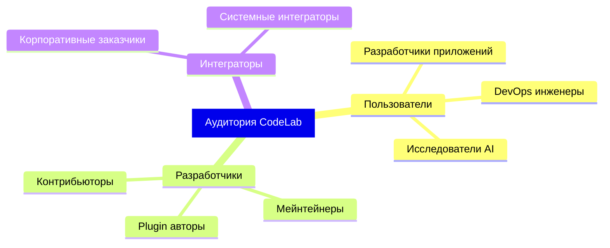
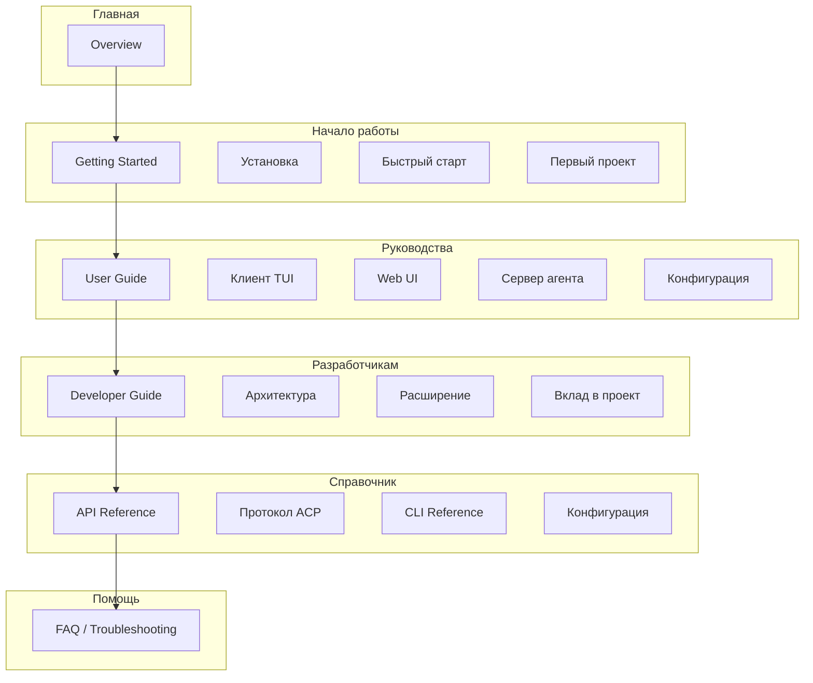
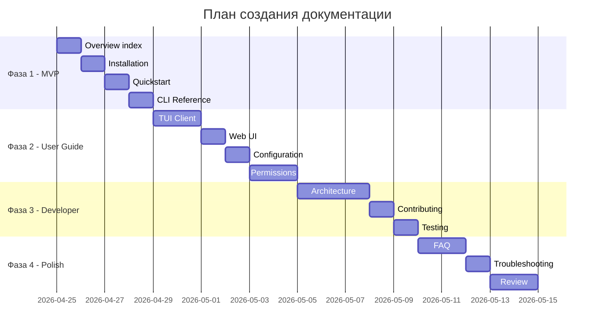

# Структура продуктовой документации CodeLab

**Версия:** 1.0  
**Дата:** 2026-04-24  
**Статус:** Утверждено

---

## 1. Обзор

Данный документ описывает структуру документации для сайта CodeLab — реализации Agent Client Protocol (ACP).

### 1.1 Целевая аудитория



### 1.2 Принципы документации

1. **Документация на русском языке** — основной язык
2. **Mermaid для диаграмм** — вся визуализация
3. **Практичность** — примеры кода в каждом разделе
4. **Актуальность** — синхронизация с кодом

---

## 2. Структура разделов сайта



---

## 3. Детальная структура файлов

### 3.1 Структура директорий

```
doc/
├── Agent Client Protocol/    # 🔒 Официальный протокол (НЕ ТРОГАТЬ!)
│   ├── get-started/
│   └── protocol/
│
├── product/                  # 🆕 СОЗДАТЬ - Продуктовая документация
│   ├── overview/
│   │   ├── index.md         # Обзор CodeLab
│   │   ├── features.md      # Возможности
│   │   └── use-cases.md     # Сценарии использования
│   │
│   ├── getting-started/
│   │   ├── index.md         # Обзор раздела
│   │   ├── installation.md  # Установка
│   │   ├── quickstart.md    # Быстрый старт (5 минут)
│   │   └── first-project.md # Первый проект
│   │
│   ├── user-guide/
│   │   ├── index.md         # Обзор руководства
│   │   ├── tui-client.md    # TUI клиент
│   │   ├── web-ui.md        # Web UI
│   │   ├── agent-server.md  # Сервер агента
│   │   ├── configuration.md # Конфигурация
│   │   ├── sessions.md      # Работа с сессиями
│   │   ├── tools.md         # Инструменты агента
│   │   └── permissions.md   # Система разрешений
│   │
│   ├── developer-guide/
│   │   ├── index.md         # Обзор для разработчиков
│   │   ├── architecture.md  # Архитектура системы
│   │   ├── client-arch.md   # Архитектура клиента
│   │   ├── server-arch.md   # Архитектура сервера
│   │   ├── extending.md     # Расширение функционала
│   │   ├── mcp-integration.md # Интеграция MCP
│   │   ├── testing.md       # Тестирование
│   │   └── contributing.md  # Вклад в проект
│   │
│   ├── reference/
│   │   ├── index.md         # Обзор справочника
│   │   ├── cli.md           # CLI команды
│   │   ├── config.md        # Параметры конфигурации
│   │   ├── env-vars.md      # Переменные окружения
│   │   └── api/             # API документация (автогенерация)
│   │       ├── server.md
│   │       └── client.md
│   │
│   └── support/
│       ├── faq.md           # Часто задаваемые вопросы
│       ├── troubleshooting.md # Решение проблем
│       └── changelog.md     # История изменений
│
├── architecture/             # 🔄 АКТУАЛИЗИРОВАТЬ
│   ├── README.md            # Индекс архитектурных документов
│   └── *.md                 # Существующие документы
│
└── archive/                  # Архивные документы
    └── ...
```

---

## 4. Описание содержимого разделов

### 4.1 Overview (Обзор)

| Файл | Содержимое | Статус |
|------|------------|--------|
| `overview/index.md` | Что такое CodeLab, основные концепции ACP, преимущества | 🆕 Создать |
| `overview/features.md` | Список возможностей с описанием | 🆕 Создать |
| `overview/use-cases.md` | Сценарии: IDE-интеграция, автоматизация, исследования | 🆕 Создать |

**Ключевое содержимое index.md:**
- Краткое описание (2-3 абзаца)
- Диаграмма высокоуровневой архитектуры
- Ссылки на быстрый старт

### 4.2 Getting Started (Начало работы)

| Файл | Содержимое | Статус |
|------|------------|--------|
| `getting-started/index.md` | Навигация по разделу | 🆕 Создать |
| `getting-started/installation.md` | Установка через uv/pip, требования | 🆕 Создать (на основе README) |
| `getting-started/quickstart.md` | 5-минутный старт: запуск сервера + клиент | 🆕 Создать |
| `getting-started/first-project.md` | Пошаговое создание первого проекта | 🆕 Создать |

**Пример структуры quickstart.md:**
```markdown
# Быстрый старт

## Шаг 1: Установка
## Шаг 2: Запуск сервера
## Шаг 3: Подключение клиента
## Шаг 4: Первый промпт
## Следующие шаги
```

### 4.3 User Guide (Руководство пользователя)

| Файл | Содержимое | Статус |
|------|------------|--------|
| `user-guide/index.md` | Обзор возможностей, навигация | 🆕 Создать |
| `user-guide/tui-client.md` | Клавиши, панели, навигация | 🆕 Создать |
| `user-guide/web-ui.md` | Web-интерфейс, браузеры | 🆕 Создать |
| `user-guide/agent-server.md` | Запуск, мониторинг, логи | 🆕 Создать |
| `user-guide/configuration.md` | .env, параметры, режимы | 🆕 Создать (на основе README) |
| `user-guide/sessions.md` | Создание, загрузка, экспорт сессий | 🆕 Создать |
| `user-guide/tools.md` | File System, Terminal, MCP tools | 🆕 Создать |
| `user-guide/permissions.md` | Система разрешений, политики | 🆕 Создать |

### 4.4 Developer Guide (Руководство разработчика)

| Файл | Содержимое | Источник |
|------|------------|----------|
| `developer-guide/index.md` | Обзор архитектуры | 🆕 Создать |
| `developer-guide/architecture.md` | Общая архитектура системы | 🔄 Консолидировать из doc/architecture/ |
| `developer-guide/client-arch.md` | Clean Architecture клиента | 🔄 Из acp-client/docs |
| `developer-guide/server-arch.md` | Архитектура сервера | 🔄 Из acp-server/docs |
| `developer-guide/extending.md` | Создание инструментов, handlers | 🆕 Создать |
| `developer-guide/mcp-integration.md` | Интеграция с MCP серверами | 🔄 Из doc/architecture/MCP* |
| `developer-guide/testing.md` | Запуск тестов, написание тестов | 🆕 Создать |
| `developer-guide/contributing.md` | Как внести вклад, code style | 🆕 Создать |

### 4.5 Reference (Справочник)

| Файл | Содержимое | Статус |
|------|------------|--------|
| `reference/index.md` | Обзор справочных материалов | 🆕 Создать |
| `reference/cli.md` | `codelab serve`, `codelab connect` | 🆕 Создать (из CLI --help) |
| `reference/config.md` | Все параметры конфигурации | 🆕 Создать |
| `reference/env-vars.md` | Переменные окружения | 🆕 Создать (на основе README) |
| `reference/api/server.md` | Server API | 🆕 Автогенерация |
| `reference/api/client.md` | Client API | 🆕 Автогенерация |

### 4.6 Support (Поддержка)

| Файл | Содержимое | Статус |
|------|------------|--------|
| `support/faq.md` | Часто задаваемые вопросы | 🆕 Создать |
| `support/troubleshooting.md` | Типичные ошибки и решения | 🆕 Создать |
| `support/changelog.md` | История версий | 🔄 Из CHANGELOG.md |

---

## 5. Навигация сайта

### 5.1 Структура меню

```yaml
navigation:
  - title: "Обзор"
    path: "/overview"
    items:
      - title: "О CodeLab"
        path: "/overview/"
      - title: "Возможности"
        path: "/overview/features"
      - title: "Сценарии использования"
        path: "/overview/use-cases"

  - title: "Начало работы"
    path: "/getting-started"
    items:
      - title: "Установка"
        path: "/getting-started/installation"
      - title: "Быстрый старт"
        path: "/getting-started/quickstart"
      - title: "Первый проект"
        path: "/getting-started/first-project"

  - title: "Руководство"
    path: "/user-guide"
    items:
      - title: "TUI клиент"
        path: "/user-guide/tui-client"
      - title: "Web UI"
        path: "/user-guide/web-ui"
      - title: "Сервер агента"
        path: "/user-guide/agent-server"
      - title: "Конфигурация"
        path: "/user-guide/configuration"
      - title: "Сессии"
        path: "/user-guide/sessions"
      - title: "Инструменты"
        path: "/user-guide/tools"
      - title: "Разрешения"
        path: "/user-guide/permissions"

  - title: "Разработчикам"
    path: "/developer-guide"
    items:
      - title: "Архитектура"
        path: "/developer-guide/architecture"
      - title: "Клиент"
        path: "/developer-guide/client-arch"
      - title: "Сервер"
        path: "/developer-guide/server-arch"
      - title: "Расширение"
        path: "/developer-guide/extending"
      - title: "MCP интеграция"
        path: "/developer-guide/mcp-integration"
      - title: "Тестирование"
        path: "/developer-guide/testing"
      - title: "Вклад в проект"
        path: "/developer-guide/contributing"

  - title: "Справочник"
    path: "/reference"
    items:
      - title: "CLI"
        path: "/reference/cli"
      - title: "Конфигурация"
        path: "/reference/config"
      - title: "Переменные окружения"
        path: "/reference/env-vars"
      - title: "API Reference"
        path: "/reference/api/"

  - title: "Поддержка"
    path: "/support"
    items:
      - title: "FAQ"
        path: "/support/faq"
      - title: "Решение проблем"
        path: "/support/troubleshooting"
      - title: "Changelog"
        path: "/support/changelog"

  - title: "Протокол ACP"
    path: "/acp-protocol"
    external: true
    note: "Официальная спецификация"
```

### 5.2 Хлебные крошки

```
Главная > Руководство > Конфигурация
Главная > Разработчикам > Архитектура > Клиент
```

---

## 6. План создания документации

### 6.1 Приоритеты



### 6.2 Файлы для создания vs актуализации

#### Создать (новые файлы)

| Приоритет | Путь | Описание |
|-----------|------|----------|
| 1 | `doc/product/overview/index.md` | Главная страница |
| 1 | `doc/product/getting-started/installation.md` | Установка |
| 1 | `doc/product/getting-started/quickstart.md` | Быстрый старт |
| 1 | `doc/product/reference/cli.md` | CLI справочник |
| 2 | `doc/product/user-guide/tui-client.md` | TUI клиент |
| 2 | `doc/product/user-guide/web-ui.md` | Web UI |
| 2 | `doc/product/user-guide/configuration.md` | Конфигурация |
| 2 | `doc/product/user-guide/permissions.md` | Разрешения |
| 3 | `doc/product/developer-guide/architecture.md` | Архитектура |
| 3 | `doc/product/developer-guide/contributing.md` | Вклад в проект |
| 4 | `doc/product/support/faq.md` | FAQ |
| 4 | `doc/product/support/troubleshooting.md` | Решение проблем |

#### Актуализировать (существующие)

| Путь | Действие |
|------|----------|
| `doc/architecture/*.md` | Обновить пути на codelab/, добавить в developer-guide |
| `codelab/README.md` | Расширить, использовать как источник |
| `CHANGELOG.md` | Обновить пути, использовать в support/changelog.md |

#### Архивировать

| Путь | Причина |
|------|---------|
| `doc/analysis/*.md` | Debug-отчёты устарели |
| `plans/CODELAB_UNIFICATION_PLAN.md` | Выполнен |
| `plans/MCP_INTEGRATION_PLAN.md` | Выполнен |

---

## 7. Шаблоны документов

### 7.1 Шаблон страницы руководства

```markdown
# Заголовок

Краткое описание (1-2 предложения).

## Обзор

Что делает, для чего нужно.

## Требования

- Требование 1
- Требование 2

## Использование

### Базовое

Пример кода с объяснением.

### Расширенное

Продвинутые сценарии.

## Примеры

### Пример 1: Название

Описание и код.

## Связанные разделы

- [Раздел 1](../path/to/section1.md)
- [Раздел 2](../path/to/section2.md)
```

### 7.2 Шаблон страницы API

```markdown
# API: Название модуля

## Обзор

Краткое описание модуля.

## Функции

### function_name

Сигнатура, параметры, возвращаемое значение.

## Классы

### ClassName

Описание, методы, примеры.

## Примеры

Практические примеры использования.
```

---

## 8. Технические требования

### 8.1 Генератор сайта

Рекомендуемые варианты:
- **MkDocs** с темой Material (Python, хорошо интегрируется с проектом)
- **Docusaurus** (React, продвинутая навигация)
- **VitePress** (Vue, быстрый)

### 8.2 Mermaid поддержка

Все генераторы поддерживают Mermaid через плагины:
- MkDocs: `mkdocs-mermaid2-plugin`
- Docusaurus: встроенная поддержка
- VitePress: `vitepress-plugin-mermaid`

### 8.3 Автогенерация API

Для Python:
- `mkdocstrings` (MkDocs)
- `sphinx-autodoc` + конвертация

---

## 9. Итоги

### 9.1 Статистика

| Метрика | Значение |
|---------|----------|
| Разделов верхнего уровня | 6 |
| Файлов для создания | ~25 |
| Файлов для актуализации | ~15 |
| Файлов для архивации | ~10 |

### 9.2 Ключевые решения

1. **Новая директория `doc/product/`** — отделяет продуктовую документацию от архитектурной
2. **Протокол ACP остаётся отдельно** — в `doc/Agent Client Protocol/` (не трогаем!)
3. **Архитектурные документы** — актуализируем и ссылаемся из developer-guide
4. **Приоритет — Getting Started** — первыми создаём страницы для новых пользователей
