# Диаграммы взаимодействия ACP Client ↔ Server

## Архитектура взаимодействия

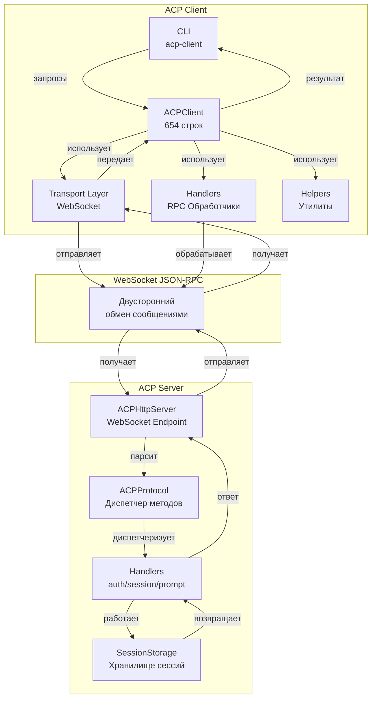

## Жизненный цикл Client→Server запроса

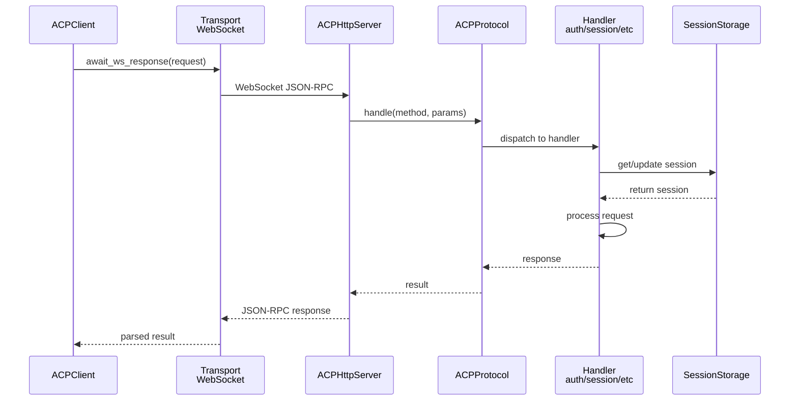

## Обработка Server→Client RPC (обратные запросы)

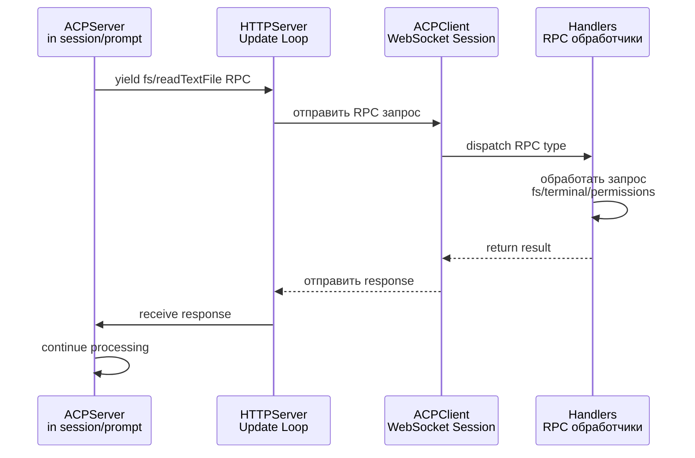

## Полный цикл Session/Prompt с updates

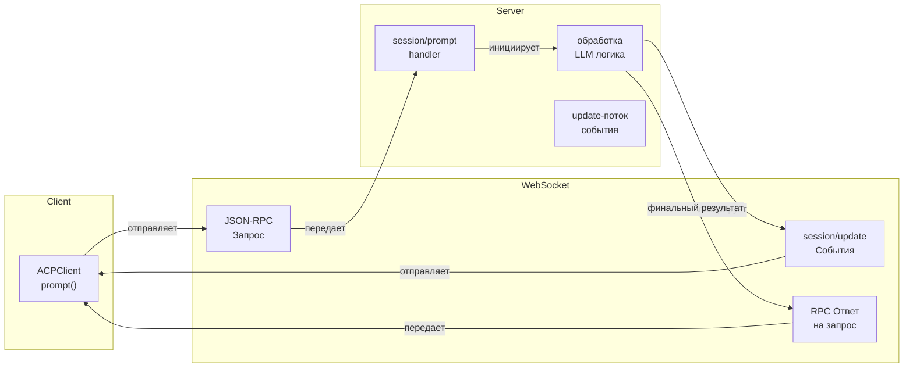

## Типы взаимодействия

### 1. Синхронные запросы (Client→Server)

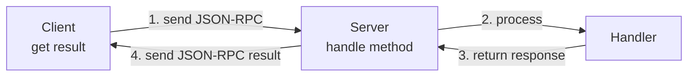

### 2. Асинхронные события (Server→Client)

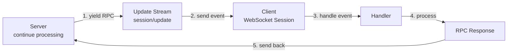

## Поток данных в session/prompt

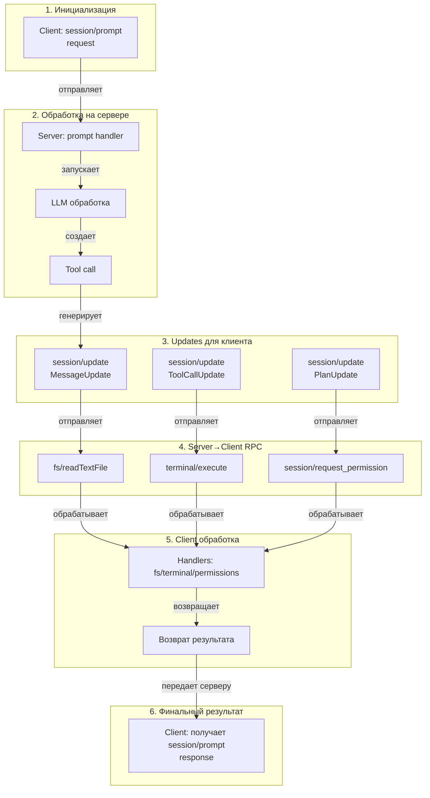

## Состояния WebSocket сессии

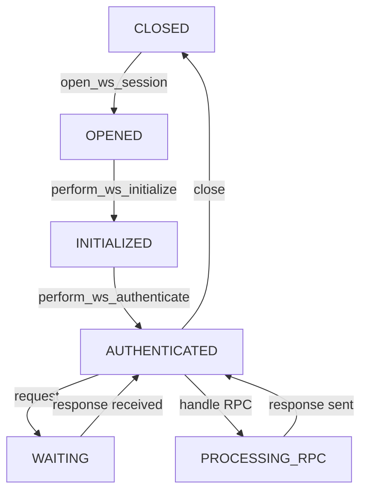

## Взаимодействие модулей Client

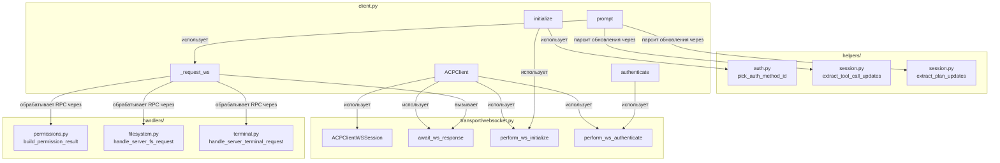

## Протокол обмена сообщениями

### Инициализация (Initialize)

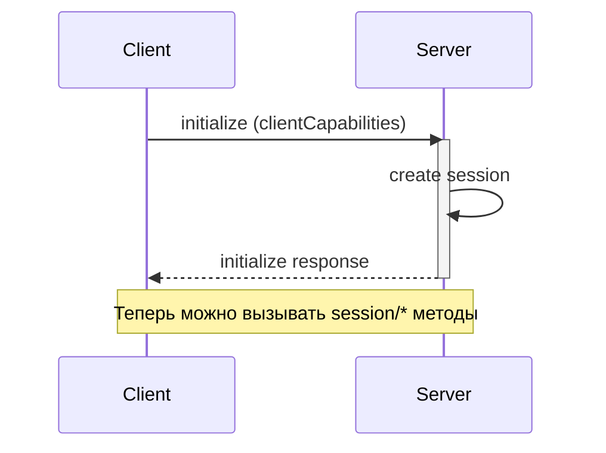

### Аутентификация (Authenticate)

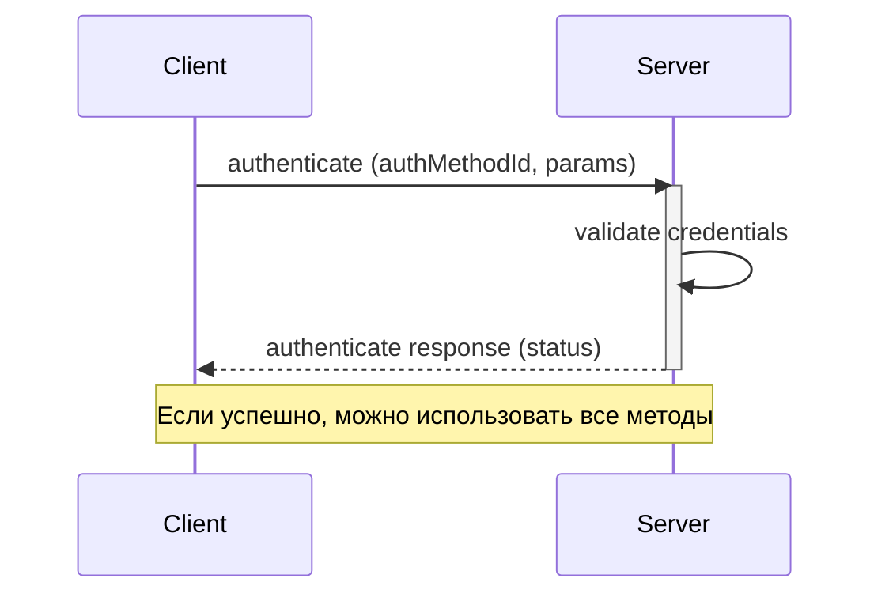

### Создание сессии (Session/New)

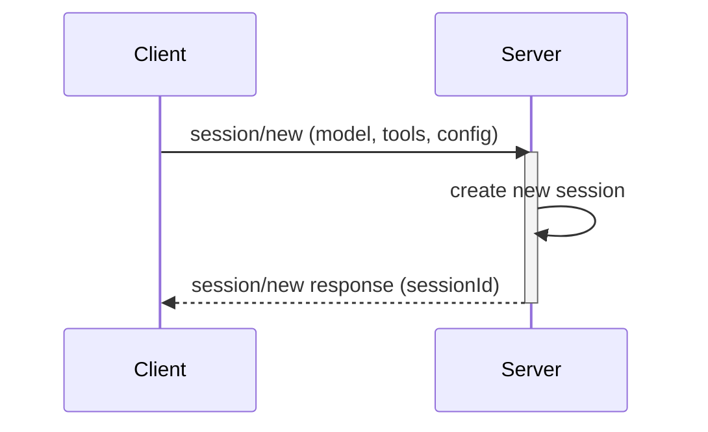

### Prompt Turn (Session/Prompt)

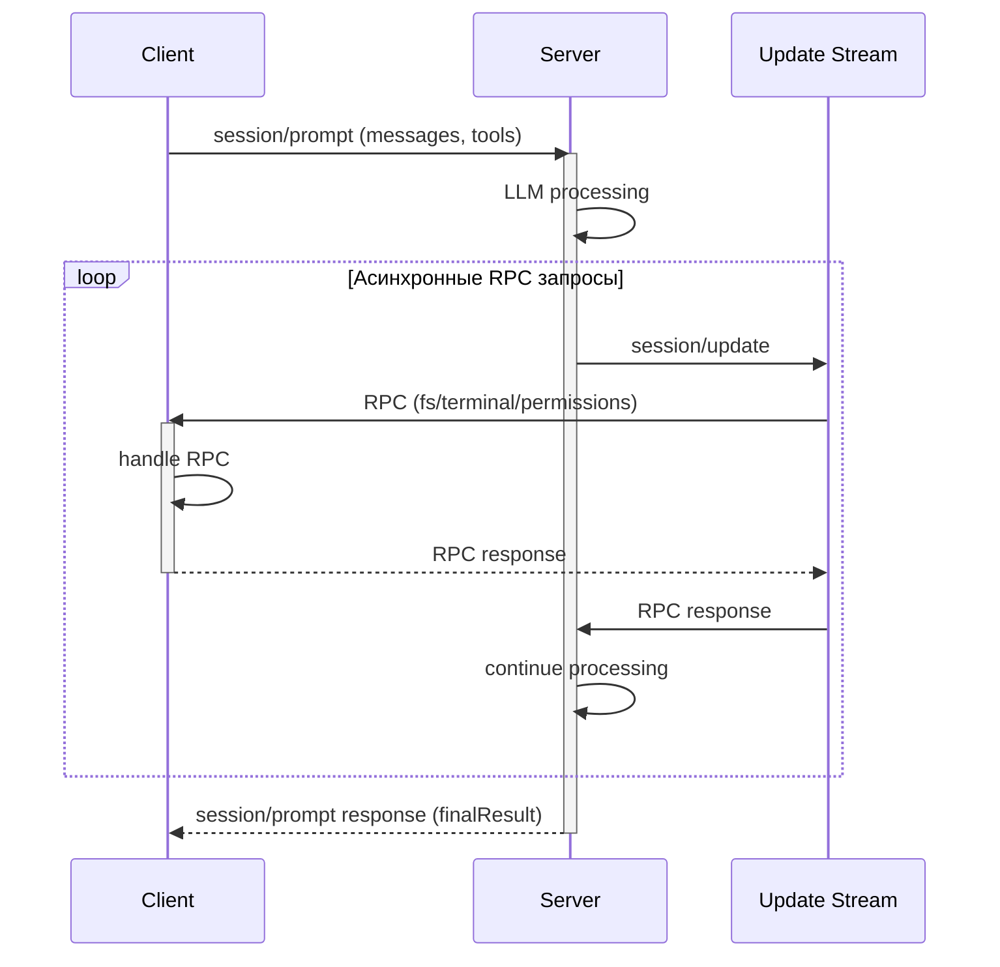

## Обработка ошибок и исключений

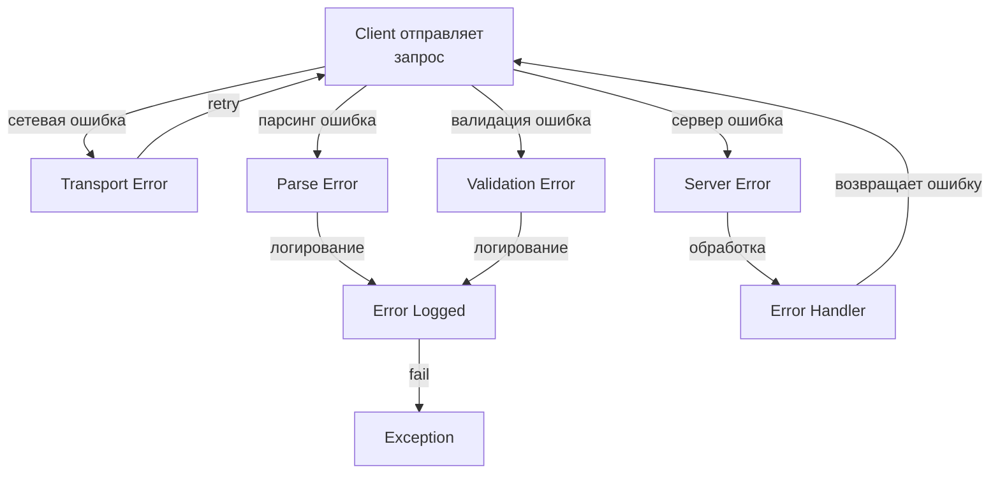

## Performance: Асинхронность и параллелизм

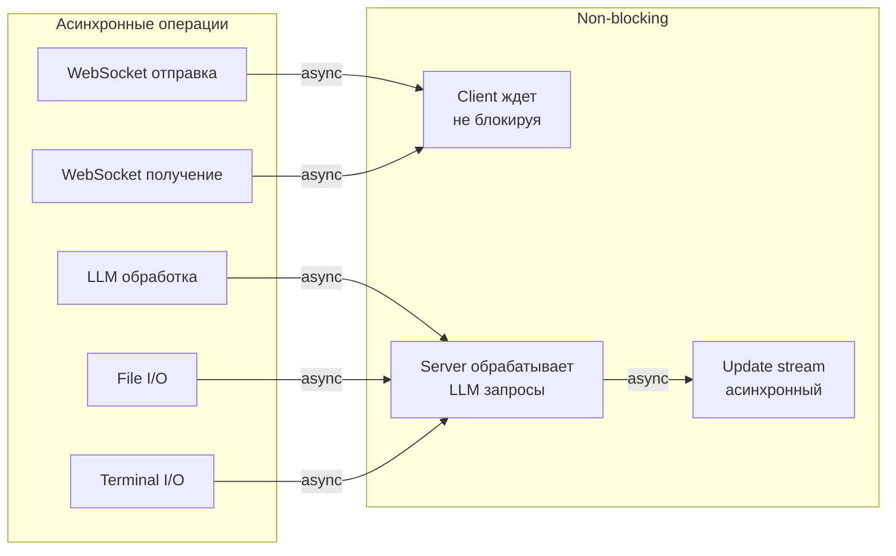
