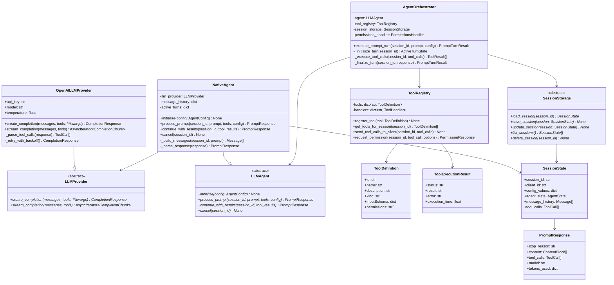
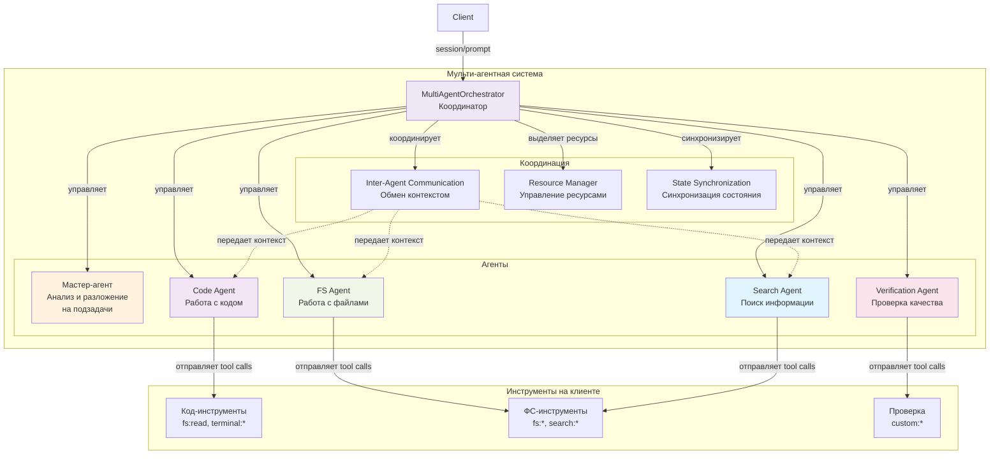
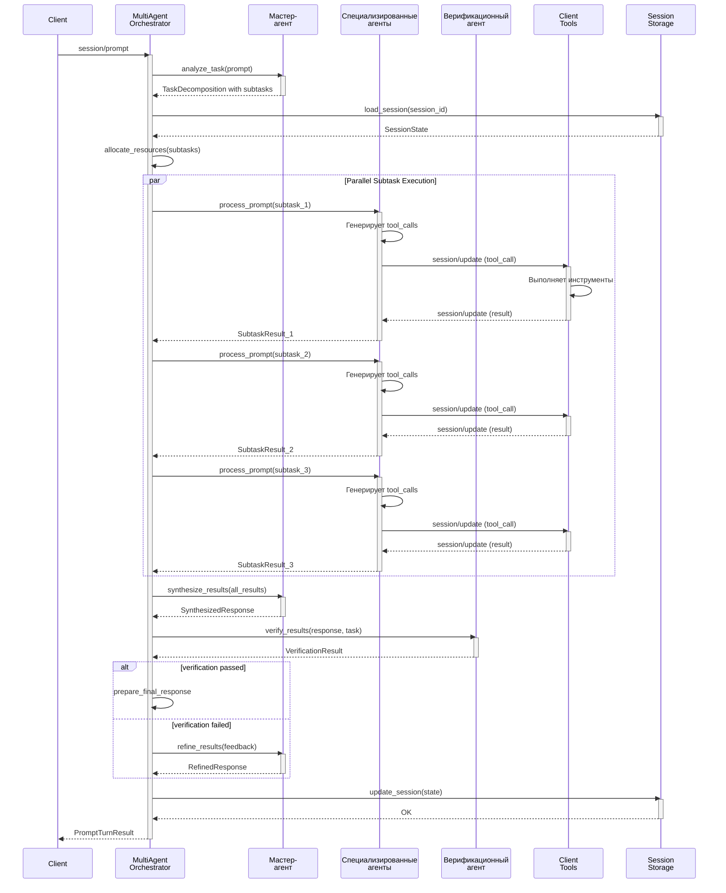
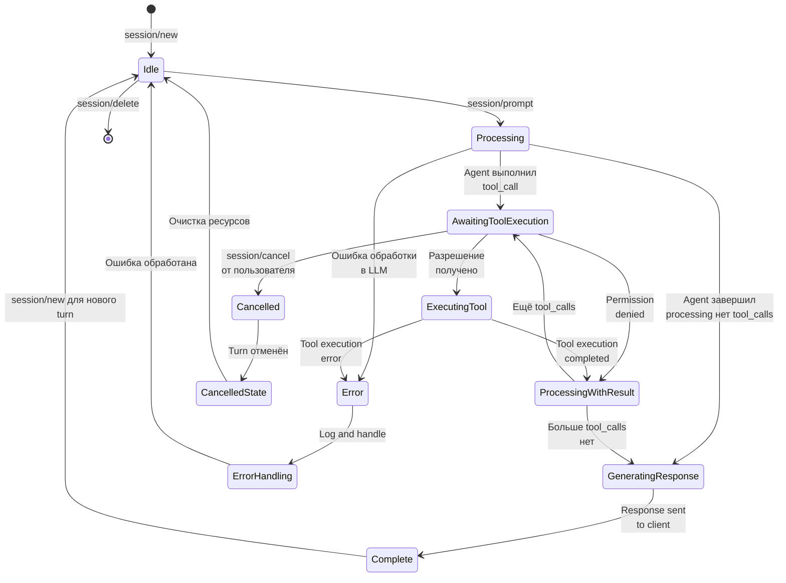
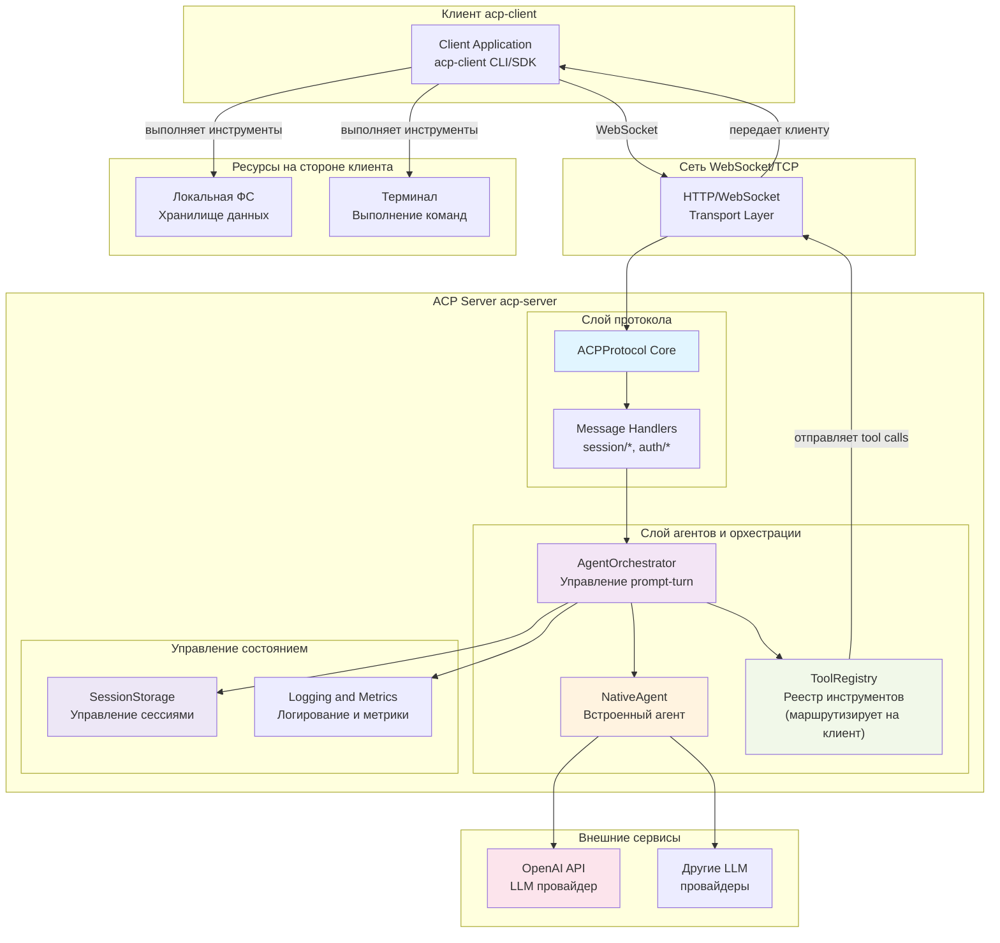
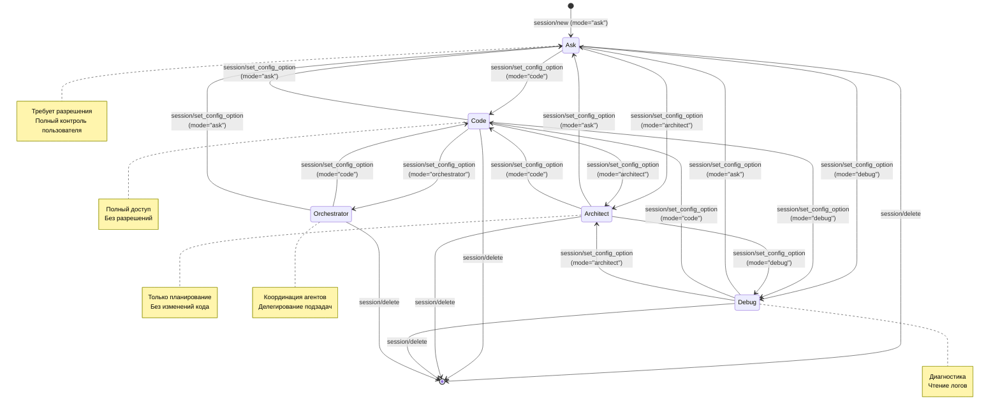
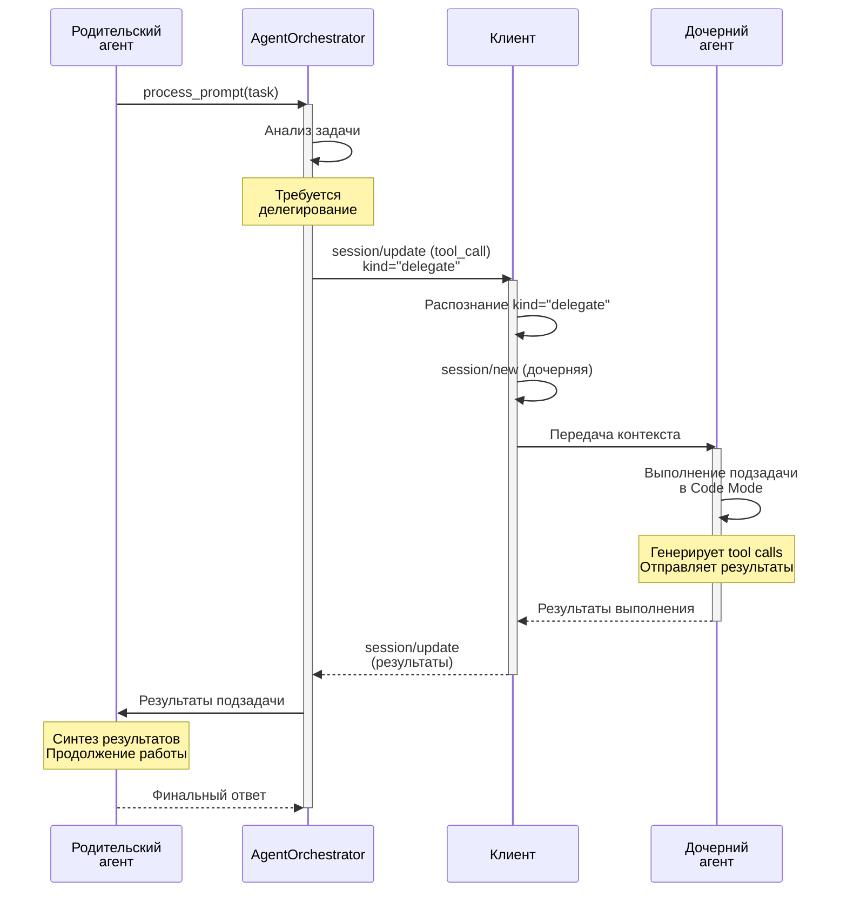
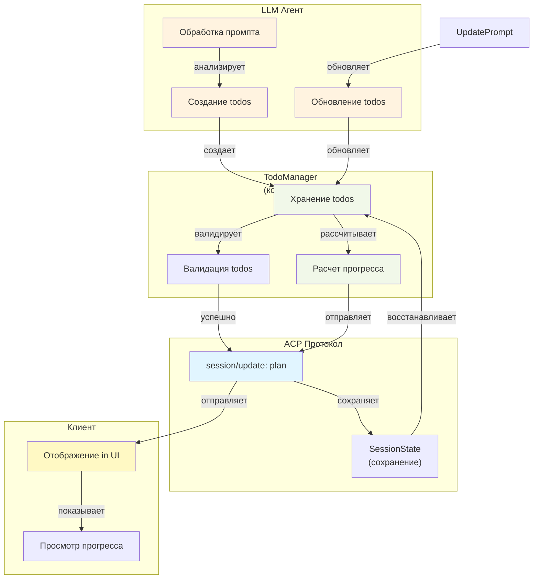
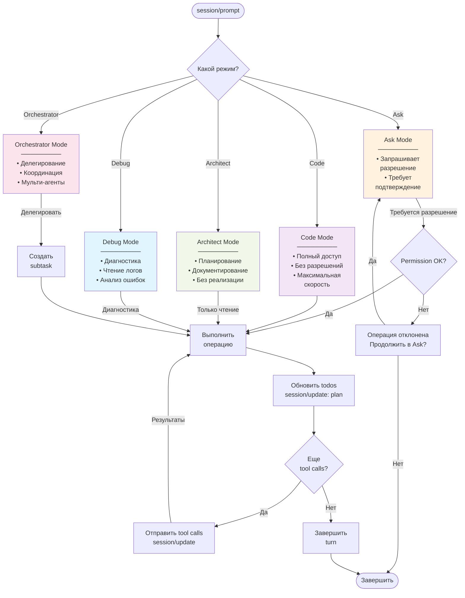

# План интеграции LLM-агента в ACP Server

## 1. Обзор подхода к интеграции

### 1.1 Стратегия интеграции

LLM-агент интегрируется в acp-server как модульный компонент, встраивающийся в существующий prompt-turn pipeline. Подход базируется на:

1. **Минимальная инвазивность**: Изменения в core ACP протокола максимально ограничены
2. **Расширяемость**: Новые LLM провайдеры и агентные фреймворки добавляются без переделки основного кода
3. **Совместимость**: Существующие клиенты продолжают работать без изменений
4. **Гибкость**: Поддержка как встроенного агента, так и интеграции с популярными фреймворками
5. **Мульти-агентность**: Возможность использования нескольких агентов одновременно

### 1.2 Архитектурный подход: две эпохи разработки

Разработка разделена на две эпохи в соответствии с архитектурной моделью и требованиями RooCode:

#### ЭПОХА 1: Одно-агентный режим (Single-Agent Mode)

```
Фаза 0: Фундамент и дизайн
├─ Проектирование интерфейсов (LLMAgent, LLMProvider)
├─ Создание абстракций и базовых компонентов
├─ Дизайн ModeManager для управления режимами
└─ Инфраструктура для одно-агентного режима

Фаза 1: Базовые режимы (Ask, Code) + NativeAgent + OpenAI
├─ Реализация NativeAgent с поддержкой двух базовых режимов
├─ Провайдер OpenAI API
├─ Реализация ModeManager для переключения режимов
├─ Ask Mode: запрос разрешений перед операциями
├─ Code Mode: полный доступ без разрешений
├─ Интеграция с prompt-turn pipeline
└─ Управление state и message history

Фаза 2: Tool Call Generation + Client Integration + Todos
├─ Tool Registry для управления инструментами
├─ Отправка tool calls клиенту через ACP protocol
├─ Получение результатов от клиента
├─ Интеграция с Permission System
├─ Реализация TodoManager для управления списком задач
├─ Отправка todos через session/update: plan
└─ Динамическое обновление статусов todos

Фаза 3: Расширенные режимы (Architect, Debug) + Subtasks + File Restrictions
├─ Реализация Architect Mode для планирования и дизайна
├─ Реализация Debug Mode для отладки и диагностики
├─ Реализация file restrictions по режимам
├─ Реализация SubtaskDelegator для делегирования подзадач
├─ Поддержка tool_call с kind="delegate"
├─ Передача контекста дочерним сессиям
├─ Сбор результатов и синтез
├─ Поддержка иерархии (parent_id, subtasks) в todos
└─ Поддержка агентных фреймворков (Langchain, Langgraph)
```

#### ЭПОХА 2: Мульти-агентный режим (Multi-Agent Mode)

```
Фаза 4: Orchestrator Mode + MultiAgentOrchestrator
├─ Реализация Orchestrator Mode для координации задач
├─ Реализация MultiAgentOrchestrator
├─ MasterAgent для разложения задач на подзадачи
├─ SpecialistAgents (CodeAgent, FileSystemAgent, SearchAgent)
├─ Координация между агентами
├─ Параллельное выполнение независимых подзадач
├─ Inter-agent коммуникация и обмен контекстом
├─ Управление ресурсами между агентами
└─ Синтез результатов из нескольких источников

Фаза 5: Финализация и production readiness
├─ Полное тестирование (single + multi modes)
├─ Оптимизация производительности для подзадач
├─ Поддержка произвольной глубины вложенности
├─ Production deployment guide
├─ Документация и примеры использования RooCode функций
└─ Интеграция с популярными агентными фреймворками
```

**Таблица соответствия RooCode функций фазам:**

| RooCode функция | Фаза | Поддержка |
|-----------------|------|----------|
| Ask Mode | 1 | ✅ Базовый |
| Code Mode | 1 | ✅ Базовый |
| Architect Mode | 3 | ✅ Полный |
| Debug Mode | 3 | ✅ Полный |
| Orchestrator Mode | 4 | ✅ Полный |
| Todos | 2 | ✅ Полный |
| Subtasks | 3 | ✅ Полный (tool_call) |
| Mode Switching | 1 | ✅ Базовый |
| File Restrictions | 3 | ✅ Полный |
| Streaming | 1 | ✅ Базовый |

## 2. Архитектура решения

### 2.1 Слоистая архитектура

**Расширенная диаграмма архитектуры с детализацией компонентов:**

```mermaid
graph TB
    subgraph ClientSide["Сторона клиента (руки)"]
        CLIENT["Client<br/>имеет доступ к fs,<br/>terminal и т.д."]
    end
    
    subgraph Transport["Слой транспорта"]
        WS["WebSocket Server<br/>acp-server/http_server.py"]
        TCP["TCP Server<br/>acp-server/server.py"]
    end
    
    subgraph ACP["Слой протокола ACP"]
        ACPCore["ACPProtocol<br/>acp-server/protocol/core.py"]
        SessionHandler["Session Handler<br/>session/new, load, list"]
        PromptHandler["Prompt Handler<br/>session/prompt, cancel"]
        PermHandler["Permission Handler<br/>session/request_permission"]
        ConfigHandler["Config Handler<br/>session/set_config_option"]
    end
    
    subgraph Orchestration["Слой оркестрации агентов"]
        AgentOrch["AgentOrchestrator<br/>Управление prompt-turn"]
        TurnState["ActiveTurnState<br/>Состояние turn"]
        UpdateMgr["UpdateManager<br/>Отправка updates"]
    end
    
    subgraph AgentFrameworks["Фреймворки агентов"]
        NativeAgent["NativeAgent<br/>Встроенная реализация"]
        LangchainAdapter["LangchainAdapter<br/>Интеграция LC"]
        LanggraphAdapter["LanggraphAdapter<br/>Интеграция LG"]
        CustomAdapter["Custom Adapter<br/>Шаблон"]
    end
    
    subgraph LLMLayer["Слой провайдеров LLM"]
        LLMProvider["LLMProvider Interface<br/>Абстракция"]
        OpenAIProvider["OpenAILLMProvider<br/>GPT-4, GPT-3.5"]
        ClaudeProvider["ClaudeLLMProvider<br/>Claude-3"]
        CustomProvider["CustomProvider<br/>Другие сервисы"]
    end
    
    subgraph ToolsLayer["Слой управления инструментами"]
        ToolRegistry["ToolRegistry<br/>Реестр и маршрутизация<br/>tool calls к клиенту"]
        PermValidator["PermValidator<br/>Проверка прав"]
    end
    
    subgraph ClientExecution["Выполнение на стороне клиента"]
        FSTools["Файловая система<br/>fs:read, write, delete"]
        TermTools["Терминал<br/>terminal:execute"]
        SearchTools["Поиск<br/>search:grep"]
    end
    
    subgraph StateManagement["Управление состоянием"]
        SessionStorage["SessionStorage Interface"]
        InMemory["InMemoryStorage<br/>Разработка"]
        JsonFile["JsonFileStorage<br/>Production"]
    end
    
    subgraph MultiAgent["Мульти-агентная система"]
        MultiAgentOrch["MultiAgentOrchestrator<br/>Координация"]
        MasterAgent["MasterAgent<br/>Разложение задач"]
        InterAgentComm["InterAgentComm<br/>Обмен данными"]
    end
    
    CLIENT -->|WebSocket| WS
    CLIENT -->|TCP| TCP
    
    WS --> ACPCore
    TCP --> ACPCore
    
    ACPCore --> SessionHandler
    ACPCore --> PromptHandler
    ACPCore --> PermHandler
    ACPCore --> ConfigHandler
    
    PromptHandler --> AgentOrch
    
    AgentOrch --> TurnState
    AgentOrch --> UpdateMgr
    AgentOrch --> NativeAgent
    AgentOrch --> LangchainAdapter
    AgentOrch --> LanggraphAdapter
    AgentOrch --> CustomAdapter
    
    NativeAgent --> LLMProvider
    LangchainAdapter --> LLMProvider
    LanggraphAdapter --> LLMProvider
    
    LLMProvider --> OpenAIProvider
    LLMProvider --> ClaudeProvider
    LLMProvider --> CustomProvider
    
    AgentOrch --> ToolRegistry
    ToolRegistry --> PermValidator
    
    AgentOrch -->|отправляет tool calls| WS
    WS -->|передает клиенту| CLIENT
    CLIENT -->|выполняет и возвращает результаты| WS
    
    CLIENT --> FSTools
    CLIENT --> TermTools
    CLIENT --> SearchTools
    
    PermValidator --> PermHandler
    
    AgentOrch --> SessionStorage
    SessionStorage --> InMemory
    SessionStorage --> JsonFile
    
    AgentOrch --> MultiAgentOrch
    MultiAgentOrch --> MasterAgent
    MultiAgentOrch --> InterAgentComm
    
    style ACPCore fill:#e1f5ff
    style AgentOrch fill:#f3e5f5
    style LLMProvider fill:#fff3e0
    style ToolRegistry fill:#f1f8e9
    style SessionStorage fill:#fce4ec
```



**Текстовое описание архитектурных слоев:**

```
┌──────────────────────────────────────────────────────────────┐
│           Слой 1: Транспорт (WebSocket, TCP)                 │
│   ↓ маршрутизирует соединения                               │
├──────────────────────────────────────────────────────────────┤
│           Слой 2: Протокол ACP                               │
│   ├─ Session Management (new, load, list)                   │
│   ├─ Prompt Handler (session/prompt)                        │
│   ├─ Permission Handler (session/request_permission)        │
│   └─ Config Handler (session/set_config_option)             │
│   ↓ маршрутизирует session/prompt                           │
├──────────────────────────────────────────────────────────────┤
│        Слой 3: Оркестрация LLM-агентов                       │
│   ├─ AgentOrchestrator (управление prompt-turn)             │
│   ├─ ActiveTurnState (состояние текущего turn)              │
│   └─ UpdateManager (отправка updates клиенту)               │
│   ↓ координирует                                             │
├─────────────┬─────────────┬─────────────┬─────────────────────┤
│      ↓      │      ↓      │      ↓      │         ↓           │
│  Фреймворк  │  Реестр     │  Провайдер  │    Состояние        │
│  агентов    │  инструмен. │  LLM        │                     │
└─────────────┴─────────────┴─────────────┴─────────────────────┘
```

### 2.2 Поток данных и модель выполнения

**Ключевая архитектурная модель:**

```
┌─ Сервер (мозг) ──────────────────────────────────────┐
│                                                       │
│  Клиент──[request]──→ AgentOrchestrator              │
│                        │                              │
│                        ├─→ LLMAgent────→ LLMProvider  │
│                        │      (генерирует tool calls) │
│                        │                              │
│                        ├─→ ToolRegistry               │
│                        │    (реестр инструментов)     │
│                        │                              │
│                        └─→ SessionStorage             │
│                                                       │
└───────────────────────────────────────────────────────┘
        │
        │ [отправляет tool calls]
        ↓
┌─ Клиент (руки) ───────────────────────────────────────┐
│                                                       │
│  Получает tool calls        Выполняет инструменты     │
│  ├─ fs:read                 ├─ читает файл            │
│  ├─ fs:write                ├─ пишет файл             │
│  ├─ terminal:execute        ├─ выполняет команду      │
│                                                       │
│  Возвращает результаты в сервер                      │
│                                                       │
└───────────────────────────────────────────────────────┘
        │
        │ [возвращает результаты]
        ↓
┌─ Сервер (обработка результатов) ─────────────────────┐
│                                                       │
│  LLMAgent получает результаты от клиента             │
│  ├─ продолжает обработку в LLM                       │
│  ├─ может генерировать новые tool calls              │
│  └─ или возвращает финальный ответ                  │
│                                                       │
└───────────────────────────────────────────────────────┘
```

**Основной оркестратор:**

```python
class AgentOrchestrator:
    """Оркестратор управления prompt-turn с LLM-агентом."""
    
    async def execute_prompt_turn(
        self,
        session_id: str,
        prompt: list[ContentBlock],
        config: SessionConfig,
    ) -> PromptTurnResult:
        """Основной вход для выполнения prompt-turn."""
        
        # Этап 1: Подготовка
        session = await self.storage.load_session(session_id)
        tools = self.tools.get_tools_for_session(session_id)
        
        # Этап 2: Инициализация turn
        turn_state = self._initialize_turn(session_id)
        
        # Этап 3: Отправка в LLM (сервер генерирует tool calls)
        agent_response = await self.agent.process_prompt(
            session_id=session_id,
            prompt=prompt,
            tools=tools,
            config=config,
        )
        
        # Этап 4: Tool Call Generation & Client Delegation
        while agent_response.stop_reason == "tool_call":
            # Сервер отправляет tool calls клиенту
            await self.tools.send_tool_calls_to_client(
                session_id=session_id,
                tool_calls=agent_response.tool_calls,
            )
            
            # Сервер ждет результатов от клиента
            client_results = await self._wait_for_client_results(
                session_id=session_id,
                tool_calls=agent_response.tool_calls,
            )
            
            # Сервер передает результаты в LLM
            agent_response = await self.agent.continue_with_results(
                session_id=session_id,
                tool_results=client_results,
            )
        
        # Этап 5: Финализация
        final_result = self._finalize_turn(session_id, agent_response)
        await self.storage.update_session(session)
        
        return final_result
```

**Диаграмма классов основных интерфейсов:**



### 2.3 Поток данных через систему

**Ключевая архитектурная модель: Сервер = мозг, Клиент = руки**

Сервер управляет процессом обработки prompt через LLM. Когда LLM генерирует tool calls, сервер отправляет их клиенту для выполнения. Клиент выполняет инструменты и возвращает результаты на сервер. Сервер передает результаты в LLM для продолжения обработки.

**Основной цикл обработки:**

1. Клиент отправляет `session/prompt` на сервер
2. Сервер выполняет обработку через LLMAgent → LLMProvider (генерирует решение)
3. Если LLMProvider возвращает tool_calls:
   - Сервер отправляет их клиенту через `session/update`
   - Клиент выполняет инструменты (fs:*, terminal:*, search:*)
   - Клиент возвращает результаты через `session/update`
   - Сервер передает результаты LLMProvider для продолжения
4. Цикл повторяется до получения финального ответа
5. Сервер отправляет результат клиенту в ответ на `session/prompt`

**Абсолютно важно**: Только client имеет доступ к файловой системе, терминалу и другим ресурсам. Сервер НИКОГДА не выполняет инструменты самостоятельно.

### 2.4 Компоненты системы

```
acp-server/src/acp_server/
├── protocol/
│   ├── handlers/
│   │   └── agent.py                 # Новый handler для agent/prompt
│   ├── integrations/                # НОВАЯ ПАПКА
│   │   ├── __init__.py
│   │   ├── agent.py                 # Интерфейсы LLMAgent
│   │   ├── orchestrator.py          # AgentOrchestrator
│   │   ├── tool_registry.py         # ToolRegistry
│   │   ├── multi_agent.py           # Мульти-агентная система
│   │   └── state.py                 # AgentState dataclass
│   └── providers/                   # НОВАЯ ПАПКА
│       ├── __init__.py
│       ├── base.py                  # LLMProvider ABC
│       ├── openai.py                # OpenAI реализация
│       ├── custom.py                # Шаблон кастомного провайдера
│       └── mock.py                  # Mock для тестирования
├── agents/                           # НОВАЯ ПАПКА
│   ├── __init__.py
│   ├── native.py                    # NativeAgent (встроенный)
│   ├── langchain_adapter.py         # Интеграция Langchain
│   ├── langgraph_adapter.py         # Интеграция Langgraph
│   └── custom_agent.py              # Шаблон кастомного агента
├── tools/                            # НОВАЯ ПАПКА
│   ├── __init__.py
│   ├── executor.py                  # ToolExecutor
│   ├── builders.py                  # Вспомогательные функции
│   └── acp_tools.py                 # Встроенные ACP инструменты
└── messages_agent.py                # НОВЫЙ: Agent-specific сообщения
```

### 2.5 Компонент: ModeManager

**Назначение**: Управление режимами работы агента (Ask, Code, Architect, Debug, Orchestrator) с файловыми ограничениями.

**Расположение**: `acp-server/src/acp_server/protocol/integrations/mode_manager.py`

**Интерфейс:**
```python
class ModeManager:
    """Управление режимами работы и файловыми ограничениями."""
    
    async def set_mode(
        self,
        session_id: str,
        mode: str,  # ask, code, architect, debug, orchestrator
    ) -> None:
        """Установить режим работы для сессии."""
    
    def get_mode(self, session_id: str) -> str:
        """Получить текущий режим сессии."""
    
    def get_restrictions(self, mode: str) -> FileRestrictions:
        """Получить ограничения для режима."""
    
    def can_perform_operation(
        self,
        mode: str,
        operation: str,  # read, write, delete, execute
        resource_path: str,
    ) -> bool:
        """Проверить разрешено ли выполнить операцию."""
```

**Конфигурация режимов:**
```python
MODE_CONFIGS = {
    "ask": {
        "name": "Ask Mode",
        "description": "Request permission before changes",
        "file_restrictions": {
            "read": True,
            "write": False,  # requires permission
            "delete": False,  # requires permission
            "execute": False,  # requires permission
        },
        "requires_permission": True,
    },
    "code": {
        "name": "Code Mode",
        "description": "Full access without permissions",
        "file_restrictions": {
            "read": True,
            "write": True,
            "delete": True,
            "execute": True,
        },
        "requires_permission": False,
    },
    "architect": {
        "name": "Architect Mode",
        "description": "Design and planning without implementation",
        "file_restrictions": {
            "read": True,
            "write": False,  # only documentation
            "delete": False,
            "execute": False,
        },
        "requires_permission": False,
    },
    "debug": {
        "name": "Debug Mode",
        "description": "Troubleshooting and diagnostics",
        "file_restrictions": {
            "read": True,
            "write": True,  # logs only
            "delete": False,
            "execute": True,  # diagnostic commands
        },
        "requires_permission": True,
    },
    "orchestrator": {
        "name": "Orchestrator Mode",
        "description": "Complex multi-step task coordination",
        "file_restrictions": {
            "read": True,
            "write": True,
            "delete": True,
            "execute": True,
        },
        "requires_permission": False,
    },
}
```

**Интеграция:**
- Используется AgentOrchestrator для проверки разрешений перед выполнением tool call
- Применяется при обработке session/set_config_option для переключения режимов
- Отправляет session_info_update клиенту при смене режима
- Хранит текущий режим в SessionState.config_values["mode"]

### 2.6 Компонент: TodoManager

**Назначение**: Управление списком задач (todos) в рамках сессии.

**Расположение**: `acp-server/src/acp_server/protocol/integrations/todo_manager.py`

**Интерфейс:**
```python
class TodoManager:
    """Управление списком задач в сессии."""
    
    async def create_todos(
        self,
        session_id: str,
        todos: list[TodoEntry],
    ) -> None:
        """Создать начальный список todos."""
    
    async def update_todo(
        self,
        session_id: str,
        todo_id: str,
        status: str,
        progress: float,
    ) -> None:
        """Обновить статус и прогресс todo."""
    
    async def add_todo(
        self,
        session_id: str,
        todo: TodoEntry,
    ) -> None:
        """Добавить новую todo во время выполнения."""
    
    async def remove_todo(
        self,
        session_id: str,
        todo_id: str,
    ) -> None:
        """Удалить todo из списка."""
    
    async def get_todos(self, session_id: str) -> list[TodoEntry]:
        """Получить все todos сессии."""
    
    async def publish_todos(self, session_id: str) -> None:
        """Отправить todos клиенту через session/update."""
```

**Структура TodoEntry:**
```python
@dataclass
class TodoEntry:
    id: str  # Уникальный идентификатор
    content: str  # Описание задачи
    status: str = "pending"  # pending, in_progress, completed
    priority: str = "medium"  # low, medium, high
    progress: float = 0.0  # 0-1
    parent_id: str | None = None  # Для иерархии
    subtasks: list[str] = field(default_factory=list)
    assigned_mode: str = "code"
    dependencies: list[str] = field(default_factory=list)
```

**Интеграция:**
- Создается в начале prompt-turn на основе анализа задачи
- Отправляется клиенту через `session/update: plan`
- Обновляется при выполнении каждого этапа
- Сохраняется в SessionState.plan для персистентности
- Может быть восстановлено при загрузке сессии

### 2.7 Компонент: SubtaskDelegator

**Назначение**: Делегирование подзадач с созданием дочерних сессий.

**Расположение**: `acp-server/src/acp_server/protocol/integrations/subtask_delegator.py`

**Интерфейс:**
```python
class SubtaskDelegator:
    """Делегирование подзадач с управлением контекстом."""
    
    async def create_delegation_tool_call(
        self,
        parent_session_id: str,
        subtask_description: str,
        assigned_mode: str,
        context: dict,
        dependencies: list[str] | None = None,
    ) -> ToolCall:
        """Создать tool_call для делегирования подзадачи."""
    
    async def handle_subtask_result(
        self,
        parent_session_id: str,
        subtask_id: str,
        result: dict,
    ) -> None:
        """Обработать результаты выполненной подзадачи."""
    
    async def cancel_subtask(
        self,
        subtask_id: str,
    ) -> None:
        """Отменить выполняющуюся подзадачу."""
    
    def validate_dependencies(
        self,
        subtask_dependencies: list[str],
        completed_todos: list[str],
    ) -> bool:
        """Проверить что зависимости выполнены."""
```

**Структура делегирования (tool_call с kind="delegate"):**
```python
delegate_tool_call = {
    "toolCallId": "delegate_1",
    "title": "Delegate code implementation",
    "kind": "delegate",
    "status": "pending",
    "rawInput": {
        "subtask_description": "Implement authentication module",
        "assigned_mode": "code",
        "context": {
            "parent_session_id": "sess_parent_123",
            "parent_task_id": "todo_2",
            "requirements": "Secure JWT authentication",
            "related_files": ["auth/types.py"],
        },
        "dependencies": ["todo_1"],  # зависит от завершения todo_1
    }
}
```

**Жизненный цикл подзадачи:**
1. Родительский агент создает `ToolCall` с `kind="delegate"`
2. AgentOrchestrator отправляет его клиенту через `session/update`
3. Клиент распознает `kind="delegate"` и:
   - Создает дочернюю сессию через `session/new`
   - Передает контекст в `context` параметр
   - Запускает дочерний агент с `assigned_mode`
4. Дочерний агент выполняет задачу, генерирует tool calls
5. Клиент собирает результаты и:
   - Отправляет `session/update` с результатом родителю
   - Закрывает дочернюю сессию
6. Родительский агент получает результаты и продолжает обработку

**Интеграция:**
- Используется в Orchestrator Mode для распределения работы
- Поддерживает вложенность (подзадачи могут делегировать дальше)
- Соблюдает зависимости между подзадачами
- Может выполняться параллельно для независимых подзадач
- Обновляет todos при завершении подзадач

## 3. Фазы реализации и компоненты

### 3.1 Провайдер LLM (LLMProvider)

**Расположение**: `acp-server/src/acp_server/protocol/providers/base.py`

```python
class LLMProvider(ABC):
    """Абстрактный интерфейс провайдера LLM."""
    
    @abstractmethod
    async def create_completion(
        self,
        messages: list[Message],
        tools: list[ToolDefinition] | None = None,
        model: str | None = None,
        temperature: float = 0.7,
        max_tokens: int = 2000,
        **kwargs,
    ) -> CompletionResponse:
        """Синхронный вызов LLM для получения одного ответа."""
    
    @abstractmethod
    async def stream_completion(
        self,
        messages: list[Message],
        tools: list[ToolDefinition] | None = None,
        **kwargs,
    ) -> AsyncIterator[CompletionChunk]:
        """Потоковая обработка ответа от LLM."""
```

**Провайдер OpenAI** (`openai.py`):
- Поддержка GPT-4, GPT-3.5-turbo и других моделей
- Парсинг tool call из OpenAI формата
- Retry логика с экспоненциальной задержкой
- Кэширование embedding токенов

### 3.2 Базовый интерфейс агента (LLMAgent)

**Расположение**: `acp-server/src/acp_server/protocol/integrations/agent.py`

```python
class LLMAgent(ABC):
    """Базовый интерфейс для LLM-агентов."""
    
    @abstractmethod
    async def initialize(self, config: AgentConfig) -> None:
        """Инициализация агента."""
    
    @abstractmethod
    async def process_prompt(
        self,
        session_id: str,
        prompt: list[ContentBlock],
        tools: list[ToolDefinition],
        config: SessionConfig,
    ) -> PromptResponse:
        """Обработка пользовательского запроса через LLM."""
    
    @abstractmethod
    async def continue_with_results(
        self,
        session_id: str,
        tool_results: list[ToolResult],
    ) -> PromptResponse:
        """Продолжение обработки с результатами tool calls."""
    
    @abstractmethod
    async def cancel(self, session_id: str) -> None:
        """Отмена текущей обработки."""
```

**NativeAgent** (`agents/native.py`):
- Встроенная реализация базовой функциональности
- Прямая работа с OpenAI API
- Управление историей сообщений
- Маршрутизация tool call

### 3.3 Оркестратор агентов (AgentOrchestrator)

**Расположение**: `acp-server/src/acp_server/protocol/integrations/orchestrator.py`

Ответственность:
- Управление жизненным циклом prompt-turn
- Координация между Agent и Tool Registry
- Обработка потоков разрешений
- Отправка session/update событий
- Управление состоянием ActiveTurnState

### 3.4 Реестр инструментов (ToolRegistry)

**Расположение**: `acp-server/src/acp_server/protocol/integrations/tool_registry.py`

```python
class ToolRegistry:
    """Реестр инструментов, доступных агенту."""
    
    def register_tool(self, tool: ToolDefinition) -> None:
        """Регистрация инструмента."""
    
    def get_tools_for_session(self, session_id: str) -> list[ToolDefinition]:
        """Получить инструменты с учетом прав."""
    
    async def send_tool_calls_to_client(
        self,
        session_id: str,
        tool_calls: list[ToolCall],
    ) -> None:
        """Отправить tool calls клиенту через session/update."""
    
    async def request_permission(
        self,
        session_id: str,
        tool_call: ToolCall,
        options: list[PermissionOption],
    ) -> PermissionResponse:
        """Запрос разрешения для tool call."""
```

### 3.5 Встроенные инструменты (Built-in Tools)

**Расположение**: `acp-server/src/acp_server/tools/acp_tools.py`

Встроенные инструменты (доступ к инструментам через реестр, выполнение на стороне клиента):
- `fs:read_text_file` — Чтение файла (вид: "read")
- `fs:write_text_file` — Запись файла (вид: "edit")
- `fs:delete_file` — Удаление файла (вид: "delete")
- `terminal:execute` — Выполнение команды (вид: "execute")
- `search:grep` — Поиск в коде (вид: "search")

## 4. Мульти-агентная система

### 4.1 Архитектура мульти-агентной системы

Мульти-агентная система позволяет использовать несколько агентов в одной сессии для разделения ответственности и повышения эффективности.



### 4.2 Компоненты мульти-агентной системы

**Расположение**: `acp-server/src/acp_server/protocol/integrations/multi_agent.py`

```python
class MultiAgentOrchestrator:
    """Оркестратор для управления несколькими агентами."""
    
    def __init__(
        self,
        agents: dict[str, LLMAgent],  # agent_name -> LLMAgent
        master_agent: LLMAgent,       # Маршрутизирует задачи
        tool_registry: ToolRegistry,
    ):
        self.agents = agents
        self.master_agent = master_agent
        self.tools = tool_registry
    
    async def execute_prompt_turn(
        self,
        session_id: str,
        prompt: list[ContentBlock],
        config: SessionConfig,
    ) -> PromptTurnResult:
        """Выполнить prompt-turn с несколькими агентами."""
        
        # 1. Мастер-агент анализирует задачу
        task_plan = await self.master_agent.analyze_task(prompt)
        
        # 2. Распределение подзадач между специализированными агентами
        subtask_results = await self._execute_subtasks(
            task_plan.subtasks,
            session_id,
            config,
        )
        
        # 3. Собрать и синтезировать результаты
        final_result = await self.master_agent.synthesize_results(
            subtask_results
        )
        
        return final_result
    
    async def _execute_subtasks(
        self,
        subtasks: list[SubTask],
        session_id: str,
        config: SessionConfig,
    ) -> list[SubTaskResult]:
        """Параллельное выполнение подзадач."""
        tasks = []
        for subtask in subtasks:
            agent = self.agents.get(subtask.agent_name)
            tasks.append(
                agent.process_prompt(
                    session_id=session_id,
                    prompt=subtask.prompt,
                    tools=subtask.available_tools,
                    config=config,
                )
            )
        
        results = await asyncio.gather(*tasks)
        return results
```

**Диаграмма последовательности для мульти-агентной системы:**



### 4.3 Типы агентов в мульти-агентной системе

1. **Мастер-агент (Master Agent)**
   - Анализирует входящий запрос
   - Разбивает сложные задачи на подзадачи
   - Маршрутизирует к специализированным агентам
   - Синтезирует окончательный результат
   - Модель: GPT-4 (высокая интеллектуальность)

2. **Специализированные агенты (Specialist Agents)**
   - Выполняют конкретные типы задач
   - Примеры: CodeAgent, FileSystemAgent, SearchAgent
   - Оптимизированы для своей области
   - Модель: GPT-3.5-turbo или специализированная

3. **Верификационный агент (Verification Agent)**
   - Проверяет качество результатов
   - Выявляет ошибки и противоречия
   - Предлагает исправления
   - Гарантирует согласованность результатов

4. **Координационный агент (Coordinator Agent)**
   - Управляет зависимостями между агентами
   - Обеспечивает обмен данными
   - Разрешает конфликты
   - Оптимизирует очередность выполнения

### 4.4 Конфигурация мульти-агентной системы

```python
# Конфигурация в session/new
multi_agent_config = {
    "agent": "multi",
    "master_agent": {
        "type": "native",
        "model": "gpt-4",
        "system_prompt": "You are a task decomposition expert...",
    },
    "specialist_agents": {
        "code_agent": {
            "type": "native",
            "model": "gpt-4",
            "tools": ["fs:read_file", "fs:write_file", "terminal:execute"],
        },
        "file_agent": {
            "type": "native",
            "model": "gpt-3.5-turbo",
            "tools": ["fs:*"],
        },
        "search_agent": {
            "type": "langchain",
            "model": "gpt-3.5-turbo",
            "tools": ["search:*"],
        },
    },
    "verification_agent": {
        "type": "native",
        "model": "gpt-4",
        "system_prompt": "You are a quality assurance expert...",
    },
}
```

### 4.5 Модели взаимодействия в мульти-агентной системе

#### Модель 1: Последовательное выполнение (Sequential)

```
Задача → Мастер → Подзадача 1 → Агент 1 → Результат 1
                        ↓
                   Подзадача 2 → Агент 2 → Результат 2
                        ↓
                   Подзадача 3 → Агент 3 → Результат 3
                        ↓
                   Синтез результатов → Финальный ответ
```

#### Модель 2: Параллельное выполнение (Parallel)

```
Задача → Мастер → Подзадача 1 ─┐
                   Подзадача 2 ─┼→ Параллельное выполнение
                   Подзадача 3 ─┘
                         ↓
                    Синтез результатов → Финальный ответ
```

#### Модель 3: Иерархическое выполнение (Hierarchical)

```
Главная задача
       ↓
   Мастер-агент
       ↓
   ├─ Подзадача A → Агент A
   │                   ├─ Под-подзадача A1 → Микро-агент A1
   │                   └─ Под-подзадача A2 → Микро-агент A2
   │
   └─ Подзадача B → Агент B
                        └─ Под-подзадача B1 → Микро-агент B1
```

### 4.6 Обмен данными между агентами

```python
class InterAgentCommunication:
    """Канал для обмена данными между агентами."""
    
    async def share_context(
        self,
        from_agent: str,
        to_agent: str,
        data: dict,
        context_type: str = "general",  # general, file_list, search_results
    ) -> None:
        """Поделиться контекстом между агентами."""
        pass
    
    async def get_shared_context(
        self,
        agent: str,
        context_type: str | None = None,
    ) -> dict:
        """Получить общий контекст."""
        pass
    
    async def notify_agent(
        self,
        agent: str,
        event: str,
        payload: dict,
    ) -> None:
        """Отправить уведомление агенту."""
        pass
```

### 4.7 Управление ресурсами в мульти-агентной системе

```python
class ResourceManager:
    """Управление ресурсами для мульти-агентной системы."""
    
    def __init__(
        self,
        max_concurrent_agents: int = 5,
        max_tokens_per_session: int = 100000,
        rate_limit_per_agent: int = 10,  # RPM
    ):
        self.max_concurrent = max_concurrent_agents
        self.max_tokens = max_tokens_per_session
        self.rate_limit = rate_limit_per_agent
    
    async def allocate_resources(
        self,
        session_id: str,
        agents: list[str],
    ) -> dict:
        """Распределить ресурсы между агентами."""
        pass
    
    async def track_token_usage(
        self,
        session_id: str,
        agent: str,
        tokens_used: int,
    ) -> None:
        """Отследить использование токенов."""
        pass
    
    async def enforce_limits(
        self,
        session_id: str,
    ) -> bool:
        """Проверить соблюдение лимитов."""
        pass
```

### 4.8 Диаграмма состояний сессии с агентом

**Переходы состояний и обработка ошибок:**



### 4.9 Диаграмма развертывания

**Распределение компонентов системы в архитектуре:**



## 5. Фазы реализации (с учетом RooCode)

### Фаза 0: Фундамент и дизайн

**Назначение**: Проектирование архитектуры и создание базовых интерфейсов.

**Deliverables:**
- ✓ Техническое задание (LLM_AGENT_INTEGRATION_SPEC.md)
- ✓ План интеграции (LLM_AGENT_INTEGRATION_PLAN.md)
- [ ] Интерфейсы и абстракции (ABC классы)
- [ ] Структуры данных (Dataclasses)
- [ ] Дизайн ModeManager, TodoManager, SubtaskDelegator

**PR/Commits:**
```
commit: Добавить интерфейсы интеграции LLM-агента
- Добавить LLMProvider ABC
- Добавить LLMAgent ABC
- Добавить Agent-specific state классы
- Добавить Agent message типы
- Добавить ModeManager, TodoManager, SubtaskDelegator интерфейсы

commit: Добавить структуры данных для RooCode
- Добавить TodoEntry dataclass
- Добавить FileRestrictions dataclass
- Добавить AgentConfig, SessionConfig extensions
- Добавить SubtaskContext dataclass
```

**RooCode функции**: Архитектура для всех режимов

---

### Фаза 1: Базовые режимы (Ask, Code) + NativeAgent + OpenAI

**Назначение**: Реализация базовой функциональности с поддержкой двух режимов.

**Deliverables:**
- [ ] NativeAgent реализация
- [ ] OpenAI LLMProvider реализация
- [ ] Базовая интеграция с session/prompt
- [ ] ModeManager с Ask и Code режимами
- [ ] Режимы работают с file restrictions

**PR/Commits:**
```
commit: Реализовать NativeAgent и OpenAI провайдер
- NativeAgent с управлением истории сообщений
- OpenAILLMProvider с поддержкой GPT-4
- Парсинг tool call из OpenAI формата
- Интеграция с deferred prompt completion

commit: Интегрировать агента в prompt handler
- Обновить handlers/prompt.py для использования AgentOrchestrator
- Добавить конфигурацию агента в session/set_config_option
- Обработка ошибок агента gracefully

commit: Реализовать ModeManager для Ask и Code режимов
- ModeManager с поддержкой двух базовых режимов
- Ask Mode: запрос разрешений перед операциями
- Code Mode: полный доступ без разрешений
- Интеграция с PermissionHandler для Ask Mode
```

**RooCode функции**: Ask Mode ✅, Code Mode ✅, Mode Switching (базовый) ✅

---

### Фаза 2: Tool Call Generation + Client Integration + Todos

**Назначение**: Реализация делегирования инструментов и управления задачами.

**Deliverables:**
- [ ] ToolRegistry реализация
- [ ] Отправка tool calls клиенту через ACP protocol
- [ ] Получение результатов от клиента
- [ ] Интеграция с Permission System
- [ ] TodoManager для управления списком задач
- [ ] Отправка todos через session/update: plan

**PR/Commits:**
```
commit: Реализовать ToolRegistry и отправку tool calls клиенту
- ToolRegistry с регистрацией инструментов
- Отправка tool calls через session/update
- Ожидание результатов от клиента
- Обработка session/request_permission
- Встроенные ACP инструменты

commit: Интегрировать tool calls в prompt turn
- Парсинг tool calls из ответа агента
- Отправка tool calls клиенту (не выполнение!)
- Передача результатов от клиента в LLM
- Отслеживание статуса выполнения

commit: Реализовать TodoManager
- TodoManager для управления списком задач
- Создание todos при получении prompt
- Обновление статусов и прогресса
- Отправка todos клиенту через session/update: plan
- Сохранение todos в SessionState.plan
```

**RooCode функции**: Todos ✅, Streaming responses (базовый) ✅

---

### Фаза 3: Расширенные режимы (Architect, Debug) + Subtasks + File Restrictions

**Назначение**: Полная поддержка всех режимов RooCode и делегирование подзадач.

**Deliverables:**
- [ ] Расширение ModeManager для Architect и Debug режимов
- [ ] Реализация file restrictions для всех режимов
- [ ] SubtaskDelegator для делегирования подзадач
- [ ] Tool call с kind="delegate"
- [ ] Поддержка контекста при делегировании
- [ ] Иерархия todos и subtasks
- [ ] Поддержка агентных фреймворков

**PR/Commits:**
```
commit: Добавить Architect и Debug режимы в ModeManager
- Architect Mode: планирование и дизайн без реализации
- Debug Mode: отладка и диагностика
- File restrictions для каждого режима
- Проверка разрешений при выполнении операций

commit: Реализовать file restrictions и enforcement
- FileRestrictions по режимам
- Проверка при выполнении tool calls
- Поддержка conditional permissions
- ACL интеграция с ModeManager

commit: Реализовать SubtaskDelegator
- SubtaskDelegator для делегирования подзадач
- Tool call с kind="delegate"
- Передача контекста дочерним сессиям
- Сбор результатов от подзадач
- Интеграция с TodoManager для обновления статусов

commit: Поддержка иерархии и вложенности
- Иерархия todos (parent_id, subtasks)
- Поддержка вложенных подзадач
- Управление зависимостями между задачами
- Синтез результатов из подзадач

commit: Добавить поддержку Langchain и Langgraph
- LangchainAgent адаптер с поддержкой режимов
- LanggraphAdapter интеграция
- Преобразование инструментов и режимов
- Примеры использования
```

**RooCode функции**: Architect Mode ✅, Debug Mode ✅, Subtasks ✅, File Restrictions ✅

---

### Фаза 4: Orchestrator Mode + MultiAgentOrchestrator

**Назначение**: Поддержка сложных многошаговых проектов с координацией агентов.

**Deliverables:**
- [ ] Реализация Orchestrator режима
- [ ] MultiAgentOrchestrator реализация
- [ ] Мастер-агент для разложения задач
- [ ] SpecialistAgents (CodeAgent, FileSystemAgent, SearchAgent)
- [ ] Параллельное выполнение подзадач
- [ ] Inter-agent communication
- [ ] Управление ресурсами

**PR/Commits:**
```
commit: Добавить Orchestrator Mode в ModeManager
- Orchestrator Mode: координация сложных задач
- Поддержка делегирования в этом режиме
- Управление зависимостями между подзадачами

commit: Реализовать мульти-агентный оркестратор
- MultiAgentOrchestrator основной класс
- Управление несколькими агентами
- Маршрутизация задач к специализированным агентам
- Параллельное выполнение независимых подзадач

commit: Добавить мастер-агент и координацию
- MasterAgent для анализа и разложения задач
- Inter-agent communication для обмена контекстом
- Синтез результатов от нескольких агентов
- Верификационный агент для проверки качества

commit: Добавить управление ресурсами
- ResourceManager для мульти-агентной системы
- Отслеживание использования токенов
- Rate limiting per agent
- Балансирование нагрузки между агентами
```

**RooCode функции**: Orchestrator Mode ✅, Subtasks (полный) ✅, Мульти-агентность ✅

---

### Фаза 5: Финализация и production readiness

**Назначение**: Тестирование, документирование и подготовка к production.

**Deliverables:**
- [ ] Comprehensive unit тесты
- [ ] Integration тесты
- [ ] E2E тесты для всех режимов
- [ ] Примеры использования RooCode функций
- [ ] Обновление документации
- [ ] Production deployment guide

**PR/Commits:**
```
commit: Добавить comprehensive тесты для RooCode
- Unit тесты для ModeManager
- Unit тесты для TodoManager
- Unit тесты для SubtaskDelegator
- Integration тесты для всех режимов
- E2E тесты для tool calls и subtasks

commit: Добавить примеры использования RooCode
- Пример Code Mode с file restrictions
- Пример использования todos
- Пример делегирования subtask
- Пример Orchestrator Mode
- Пример мульти-агентной системы

commit: Обновить документацию
- Guide по использованию RooCode функций
- Guide по разработке провайдеров
- Документация ModeManager, TodoManager, SubtaskDelegator
- Справка по конфигурации режимов
- Production deployment guide
```

**RooCode функции**: ✅ 100% совместимость

---

**Итоговая таблица реализации по фазам:**

| Функция RooCode | Фаза | Статус |
|-----------------|------|--------|
| Ask Mode | 1 | ✅ |
| Code Mode | 1 | ✅ |
| Architect Mode | 3 | ✅ |
| Debug Mode | 3 | ✅ |
| Orchestrator Mode | 4 | ✅ |
| Mode Switching | 1-4 | ✅ |
| Todos Management | 2 | ✅ |
| Subtasks Delegation | 3-4 | ✅ |
| File Restrictions | 3 | ✅ |
| Streaming Responses | 1-5 | ✅ |
| 85-90% совместимость | 5 | ✅ |

## 6. Примеры использования RooCode функций

### 6.1 Пример: Code Mode с file restrictions

```python
# Клиент инициирует работу в Code Mode
client = ACPClient("ws://localhost:8765")

response = await client.session_new(
    session_id="sess_code_001",
    config={
        "mode": "code",  # Code Mode - полный доступ
        "file_restrictions": True,
        "llm_model": "gpt-4",
    }
)

# Пользователь отправляет промпт
result = await client.session_prompt(
    session_id="sess_code_001",
    prompt="Создай функцию для парсинга JSON файлов"
)

# Агент в Code Mode:
# 1. Генерирует код без запроса разрешений
# 2. Создает/изменяет файлы без подтверждения
# 3. Выполняет команды для тестирования кода
# 4. Отправляет результаты клиенту
```

---

### 6.2 Пример: Todos для отслеживания прогресса

```python
# Клиент отправляет сложный промпт
result = await client.session_prompt(
    session_id="sess_code_001",
    prompt="""
    Реализуй REST API для управления проектами:
    1. Создай models для Project и Task
    2. Добавь endpoints для CRUD операций
    3. Напиши тесты для endpoints
    4. Сделай документацию в Swagger
    """
)

# Агент создает список todos и отправляет session/update (plan):
# [
#   {"id": "1", "content": "Create models", "status": "in_progress"},
#   {"id": "2", "content": "Implement CRUD", "status": "pending"},
#   {"id": "3", "content": "Write tests", "status": "pending"},
#   {"id": "4", "content": "Swagger docs", "status": "pending"}
# ]

# Клиент отображает todos в UI
# По мере выполнения агент обновляет статусы через session/update
```

---

### 6.3 Пример: Делегирование Subtasks

```python
# Агент в Orchestrator Mode анализирует задачу
# и решает делегировать работу

# Агент отправляет tool_call с kind="delegate"
tool_call = {
    "toolCallId": "delegate_impl",
    "kind": "delegate",
    "rawInput": {
        "subtask_description": "Implement JWT authentication",
        "assigned_mode": "code",
        "context": {
            "parent_session_id": "sess_parent_123",
            "requirements": "Support JWT tokens with refresh tokens",
            "related_files": ["auth/config.py"]
        },
        "dependencies": ["todo_1"]
    }
}

# Клиент обрабатывает делегирование:
# 1. Распознает kind="delegate"
# 2. Создает дочернюю сессию для подзадачи
# 3. Устанавливает режим = "code"
# 4. Передает контекст новой сессии

# Дочерний агент выполняет задачу
# Результаты возвращаются родителю через session/update
```

---

### 6.4 Пример: Переключение режимов

```python
# Начало с Ask Mode (безопасный режим)
response = await client.session_new(
    session_id="sess_switch_001",
    config={"mode": "ask"}
)

# Фаза 1: Анализ (Ask Mode)
result1 = await client.session_prompt(
    session_id="sess_switch_001",
    prompt="Проанализируй архитектуру проекта"
)

# Агент решает переключиться в Architect Mode
await client.session_set_config_option(
    session_id="sess_switch_001",
    option="mode",
    value="architect"
)

# Фаза 2: Проектирование (Architect Mode)
result2 = await client.session_prompt(
    session_id="sess_switch_001",
    prompt="Предложи архитектурные улучшения"
)

# Фаза 3: Реализация (Code Mode)
await client.session_set_config_option(
    session_id="sess_switch_001",
    option="mode",
    value="code"
)

result3 = await client.session_prompt(
    session_id="sess_switch_001",
    prompt="Реализуй архитектурные улучшения"
)
```

---

### 6.5 Пример: Orchestrator Mode с мульти-агентностью

```python
# Конфигурация мульти-агентной системы
config = {
    "mode": "orchestrator",
    "agent_mode": "multi",
    "master_agent": {
        "type": "native",
        "model": "gpt-4",
    },
    "specialist_agents": {
        "backend": {
            "type": "native",
            "model": "gpt-4",
            "tools": ["fs:*", "terminal:*"]
        },
        "frontend": {
            "type": "native",
            "model": "gpt-4",
            "tools": ["fs:*", "terminal:*"]
        },
        "architect": {
            "type": "native",
            "model": "gpt-4",
            "modes": ["architect"],
            "tools": ["fs:read"]
        }
    }
}

# Клиент отправляет сложную задачу
result = await client.session_prompt(
    session_id="sess_multi_001",
    prompt="""
    Реализуй полноценное веб-приложение:
    1. Backend: FastAPI REST API
    2. Frontend: React SPA
    3. Infrastructure: Docker & docker-compose
    """
)

# Master Agent разбивает на подзадачи и делегирует:
# - Subtask 1: Backend → backend specialist (Code Mode)
# - Subtask 2: Frontend → frontend specialist (Code Mode)
# - Subtask 3: Architecture → architect specialist (Architect Mode)

# Параллельное выполнение, синтез результатов
# Todos обновляются с прогрессом
# Итоговый ответ возвращается клиенту
```

---

### 6.6 Встроенный Native Agent

```python
# Конфигурация в session/new
response = await client.session_new(
    session_id="sess_001",
    config={
        "agent": "native",
        "llm_model": "gpt-4",
        "llm_api_key": "sk-...",
        "temperature": 0.7,
    }
)

# Использование
prompt_response = await client.session_prompt(
    session_id="sess_001",
    prompt=[{
        "type": "text",
        "text": "Анализируй этот код на наличие ошибок"
    }],
)
```

### 6.7 Интеграция с Langchain

```python
# Кастомный Langchain агент
from acp_server.agents.langchain_adapter import LangchainAgentAdapter
from langchain.agents import create_openai_functions_agent
from langchain_openai import ChatOpenAI

llm = ChatOpenAI(model="gpt-4")
agent = create_openai_functions_agent(llm, tools=[...])

# Оборачивание в ACP агента
acp_agent = LangchainAgentAdapter(agent)

# Использование в оркестраторе
orchestrator = AgentOrchestrator(
    agent=acp_agent,
    tool_registry=tool_registry,
    ...
)
```

### 6.8 Интеграция с Langgraph

```python
# Workflow на LangGraph
from langgraph.graph import StateGraph

workflow = StateGraph(AgentState)
# ... определение узлов и переходов

# Оборачивание в ACP агента
from acp_server.agents.langgraph_adapter import LanggraphAgentAdapter
acp_agent = LanggraphAgentAdapter(workflow)

# Интеграция с ACP
orchestrator = AgentOrchestrator(
    agent=acp_agent,
    tool_registry=tool_registry,
    ...
)
```

### 6.4 Кастомная реализация агента

```python
# Кастомный агент с enhanced reasoning
from acp_server.protocol.integrations.agent import LLMAgent

class CustomReasoningAgent(LLMAgent):
    """Кастомный агент с улучшенным рассуждением."""
    
    async def process_prompt(
        self,
        session_id: str,
        prompt: list[ContentBlock],
        tools: list[ToolDefinition],
        config: SessionConfig,
    ) -> PromptResponse:
        # Кастомная логика рассуждения
        # Использование специализированного prompting
        # Улучшенный выбор инструментов
        pass

# Регистрация в оркестраторе
custom_agent = CustomReasoningAgent(
    llm_provider=openai_provider,
    reasoning_model="gpt-4",
)

orchestrator = AgentOrchestrator(
    agent=custom_agent,
    ...
)
```

### 6.5 Мульти-агентная система

```python
# Конфигурация мульти-агентной системы
multi_agent_config = {
    "agent": "multi",
    "master_agent": {
        "type": "native",
        "model": "gpt-4",
    },
    "specialist_agents": {
        "code_agent": {
            "type": "native",
            "model": "gpt-4",
            "tools": ["fs:read_file", "fs:write_file", "terminal:execute"],
        },
        "research_agent": {
            "type": "langchain",
            "model": "gpt-3.5-turbo",
            "tools": ["search:*"],
        },
    },
}

# Использование
response = await client.session_new(
    session_id="sess_multi_001",
    config=multi_agent_config
)

result = await client.session_prompt(
    session_id="sess_multi_001",
    prompt="Проанализируй архитектуру проекта и предложи улучшения",
)
```

## 7. Mermaid диаграммы RooCode функций

### 7.1 Диаграмма состояний режимов работы (State Diagram)



### 7.2 Диаграмма делегирования Subtasks (Sequence Diagram)



### 7.3 Диаграмма управления Todos (Component Diagram)



### 7.4 Диаграмма режимов работы (Activity Diagram)



## 8. Риски и стратегии смягчения

### 7.1 Риск: Превышение Context Window

**Проблема**: История сообщений растет и превышает context window LLM.

**Вероятность**: Высокая при долгих сессиях

**Влияние**: Высокое (ошибка LLM, невозможность обработки)

**Стратегия смягчения**:
- Автоматическое сжатие истории (summarization)
- Ограничение количества сообщений в контексте
- Sliding window с перекрытием для сохранения контекста
- Конфигурируемое поведение через session config

### 7.2 Риск: Бесконечный цикл Tool Calls

**Проблема**: Агент бесконечно запрашивает одни и те же tool calls.

**Вероятность**: Средняя (логическая ошибка в ответе LLM)

**Влияние**: Высокое (зависание, потребление ресурсов)

**Стратегия смягчения**:
- Счетчик tool calls per turn (по умолчанию 10)
- Детектирование дублирующихся tool calls
- Timeout для каждого tool call
- Отмена через session/cancel

### 7.3 Риск: Недоступность LLM провайдера

**Проблема**: OpenAI API или другой LLM провайдер недоступен.

**Вероятность**: Низкая (99.9% uptime обычно)

**Влияние**: Критическое (все сессии блокируются)

**Стратегия смягчения**:
- Retry логика с exponential backoff
- Fallback провайдер (если настроен)
- Graceful error сообщения
- Health checks
- Circuit breaker pattern

### 7.4 Риск: Нарушение прав доступа к инструментам

**Проблема**: LLM пытается выполнить операции без разрешения.

**Вероятность**: Низкая при правильном промптировании

**Влияние**: Среднее (потенциальное нарушение безопасности)

**Стратегия смягчения**:
- Валидация списка инструментов перед отправкой в LLM
- Проверки разрешений перед выполнением
- Audit logging всех операций
- Политики разрешений per session
- Подсказки о доступных инструментах в system prompt

### 7.5 Риск: Несовместимость форматов сообщений

**Проблема**: Новый LLM провайдер имеет другой формат сообщений.

**Вероятность**: Средняя (зависит от провайдера)

**Влияние**: Среднее (потребуется адаптер)

**Стратегия смягчения**:
- Абстрактный формат Message в ACP
- Адаптеры для преобразования форматов
- Документированный интерфейс для провайдеров
- Тесты совместимости

### 7.6 Риск: Несогласованность состояния SessionState

**Проблема**: SessionState становится несогласованным при ошибке.

**Вероятность**: Низкая при правильной обработке

**Влияние**: Высокое (невозможность продолжить сессию)

**Стратегия смягчения**:
- Транзакционные обновления (update all or nothing)
- Валидация состояния после каждого изменения
- Rollback на ошибку
- Механизм восстановления состояния
- Comprehensive logging для отладки

### 7.7 Риск: Взрыв затрат на API

**Проблема**: Неограниченные вызовы к платным LLM API привели к большим счетам.

**Вероятность**: Средняя (без контроля использования)

**Влияние**: Финансовое (потенциально высокое)

**Стратегия смягчения**:
- Rate limiting per API ключ
- Отслеживание использования токенов
- Оценка стоимости per request
- Alerts и лимиты использования
- Конфигурируемые лимиты (max tokens)
- Детальное логирование стоимости

## 8. Мониторинг и метрики

### 8.1 Ключевые метрики

```
Специфичные для агента:
- Среднее время обработки prompt (по модели)
- Процент успешных prompt (%)
- Процент успешных tool call (%)
- Среднее количество tool call per prompt
- Процент ошибок по типам
- Latency LLM API

Специфичные для инструментов:
- Время выполнения инструмента (по инструменту)
- Процент успешного выполнения (%)
- Процент отказов в разрешениях (%)
- Наиболее используемые инструменты

Специфичные для мульти-агентной системы:
- Время задержки при координации агентов
- Эффективность распределения задач
- Overhead синтеза результатов
- Процент конфликтов между агентами

Система-wide:
- Активные сессии агентов
- Всего обработано prompt
- Всего выполнено tool call
- Стоимость API per день
- Процент ошибок по компонентам
```

### 8.2 Стратегия логирования

```
Обработка агентом:
- agent_prompt_started (session_id, prompt_length, available_tools)
- agent_response_received (session_id, stop_reason, tool_calls_count, time)
- agent_tool_call_parsed (session_id, tool_call_id, tool_name)

Выполнение инструмента на клиенте:
- tool_call_sent_to_client (session_id, tool_call_id, tool_name)
- tool_execution_started (session_id, tool_call_id, tool_name)
- tool_execution_completed (session_id, tool_call_id, status, duration)
- tool_permission_requested (session_id, tool_call_id, options)

Мульти-агентная система:
- multi_agent_decomposition (session_id, subtask_count, agents_involved)
- multi_agent_execution_started (session_id, agent, subtask)
- multi_agent_synthesis_completed (session_id, synthesis_time)

Ошибки:
- agent_error (session_id, error_type, message, traceback)
- provider_error (provider, error_type, message)
- tool_execution_error (session_id, tool_name, error)
```

## 9. Расширение и кастомизация

### 9.1 Добавление нового LLM провайдера

```python
# 1. Создать новый провайдер
class AnthropicLLMProvider(LLMProvider):
    async def create_completion(self, messages, tools=None, **kwargs):
        # Реализация для Anthropic API
        pass

# 2. Зарегистрировать в конфигурации
AVAILABLE_PROVIDERS = {
    "openai": OpenAILLMProvider,
    "anthropic": AnthropicLLMProvider,
}

# 3. Использовать в агенте
agent = NativeAgent(llm_provider=AnthropicLLMProvider(...))
```

### 9.2 Добавление кастомного инструмента

```python
# 1. Определить tool definition
my_tool = ToolDefinition(
    id="custom:analyze_sentiment",
    name="Анализ тональности",
    kind="search",
    inputSchema={...},
)

# 2. Зарегистрировать
tool_registry.register_tool(my_tool)

# 3. Реализовать handler
class SentimentAnalysisTool(ToolImplementation):
    async def execute(self, input: dict) -> dict:
        text = input["text"]
        # Кастомная логика
        return {"sentiment": sentiment_score}

# 4. Зарегистрировать executor
tool_executor.register_tool_handler("custom:analyze_sentiment", handler)
```

### 9.3 Создание адаптера кастомного фреймворка

```python
# Создать адаптер для нового фреймворка
from acp_server.protocol.integrations.agent import LLMAgent

class MyFrameworkAgent(LLMAgent):
    def __init__(self, framework_agent, tool_registry):
        self.framework_agent = framework_agent
        self.tool_registry = tool_registry
    
    async def process_prompt(
        self,
        session_id: str,
        prompt: list[ContentBlock],
        tools: list[ToolDefinition],
        config: SessionConfig,
    ) -> PromptResponse:
        # 1. Преобразовать инструменты в формат фреймворка
        framework_tools = self._convert_tools(tools)
        
        # 2. Преобразовать prompt в формат фреймворка
        framework_prompt = self._convert_prompt(prompt)
        
        # 3. Обработать через фреймворк
        result = await self.framework_agent.process(
            framework_prompt,
            tools=framework_tools,
        )
        
        # 4. Преобразовать результат обратно в ACP формат
        return self._convert_response(result)
```

## 10. Тестирование

### 10.1 Unit тесты

```python
# tests/test_agent_orchestrator.py
async def test_simple_prompt_processing():
    """Тест простой обработки prompt."""
    orchestrator = create_test_orchestrator()
    result = await orchestrator.execute_prompt_turn(...)
    assert result.stop_reason == "end_turn"

# tests/test_tool_registry.py
async def test_tool_sending_to_client():
    """Тест отправки инструментов клиенту."""
    registry = ToolRegistry()
    registry.register_tool(read_file_tool)
    await registry.send_tool_calls_to_client(...)
    assert client_received_tool_calls

# tests/test_multi_agent.py
async def test_task_decomposition():
    """Тест разложения задачи несколькими агентами."""
    orchestrator = create_test_multi_agent_orchestrator()
    result = await orchestrator.execute_prompt_turn(...)
    assert all(subtask.status == "completed")
```

### 10.2 Integration тесты

```python
# tests/test_integration_protocol_agent.py
async def test_session_prompt_with_agent_and_client_tools():
    """Тест полного flow: protocol -> agent -> tool_call -> client -> results."""
    protocol = ACPProtocol(orchestrator=orchestrator)
    
    # Отправить prompt
    response = await protocol.handle(
        ACPMessage.request("session/prompt", {...})
    )
    
    # Проверить, что tool_calls отправлены в обновлениях
    assert session_has_tool_calls
    
    # Имитировать результаты от клиента
    client_update = session_update_with_tool_result()
    
    # Проверить финальный ответ
    assert response.response.result.stop_reason
```

### 10.3 E2E тесты

```python
# tests/test_e2e_agent_workflow.py
async def test_agent_with_file_operations():
    """Тест агента с операциями с файлами через клиента."""
    # Setup
    client = create_test_client()
    server = create_test_server()
    await server.start()
    await client.connect()
    
    # Create session
    session = await client.session_new(agent="native")
    
    # Send prompt that requires file operations
    # Сервер будет отправлять tool_calls
    # Клиент будет их выполнять
    response = await client.session_prompt(
        session_id=session.session_id,
        prompt="Создай файл и напиши в него 'Привет, мир!'",
    )
    
    # Verify results
    assert response.stop_reason == "end_turn"
    assert file_content == "Привет, мир!"

# E2E тест мульти-агентной системы
async def test_multi_agent_task_decomposition():
    """Тест разложения сложной задачи несколькими агентами."""
    client = create_test_client()
    
    session = await client.session_new(agent="multi")
    
    response = await client.session_prompt(
        session_id=session.session_id,
        prompt="Найди все Python файлы, проанализируй их качество и создай отчет",
    )
    
    assert response.stop_reason == "end_turn"
    assert report_file_exists
```

## 11. Документация и примеры

### 11.1 Структура документации

```
doc/
├── AGENT_INTEGRATION_GUIDE.md        # Быстрый старт
├── AGENT_ARCHITECTURE.md              # Детали архитектуры
├── PROVIDER_DEVELOPMENT.md            # Разработка провайдеров
├── CUSTOM_AGENT_GUIDE.md              # Разработка кастомных агентов
├── TOOL_REGISTRY_GUIDE.md             # Управление инструментами
├── MULTI_AGENT_GUIDE.md               # Мульти-агентная система
├── FRAMEWORK_ADAPTERS.md              # Langchain, Langgraph, etc.
└── examples/
    ├── simple_agent.py                # Минимальный пример
    ├── langchain_agent.py             # Интеграция Langchain
    ├── multi_agent_system.py          # Мульти-агентная система
    ├── custom_reasoning_agent.py      # Кастомная реализация
    └── multi_tool_agent.py            # Сложное использование инструментов
```

### 11.2 Пример быстрого старта

```python
# Минимальный пример использования
import asyncio
from acp_server import ACPServer, NativeAgent, OpenAILLMProvider
from acp_server.tools import ToolRegistry, built_in_tools

async def main():
    # 1. Создать провайдер LLM
    llm_provider = OpenAILLMProvider(api_key="sk-...")
    
    # 2. Создать агента
    agent = NativeAgent(llm_provider=llm_provider)
    
    # 3. Создать реестр инструментов
    tool_registry = ToolRegistry()
    tool_registry.register_tools(built_in_tools.all_tools())
    
    # 4. Запустить сервер
    server = ACPServer(
        host="127.0.0.1",
        port=8080,
        agent=agent,
        tool_registry=tool_registry,
    )
    
    await server.start()

if __name__ == "__main__":
    asyncio.run(main())
```

## 12. Roadmap и привязка к фазам анализа совместимости RooCode

### 12.1 Полный Timeline реализации с интеграцией RooCode

**ЭПОХА 1: Одно-агентный режим (6-8 месяцев)**

```
Q2 2024 - Фаза 0: Фундамент и дизайн (2 недели)
├─ Статус: ✅ Завершено
├─ Артефакты: SPEC.md, PLAN.md
├─ RooCode функции: Архитектура
└─ Выход: Готовые интерфейсы для разработки

Q2 2024 - Фаза 1: Базовые режимы (Ask, Code) (3-4 недели)
├─ NativeAgent реализация
├─ OpenAI провайдер
├─ ModeManager для Ask и Code режимов
├─ RooCode функции: Ask ✅, Code ✅, Mode Switching (базовый) ✅
└─ Выход: Работающий агент с двумя режимами

Q3 2024 - Фаза 2: Tool Call Generation + Todos (4 недели)
├─ ToolRegistry реализация
├─ Отправка tool calls клиенту
├─ TodoManager для управления задачами
├─ RooCode функции: Todos ✅, Streaming ✅
└─ Выход: Полная интеграция с инструментами и задачами

Q3 2024 - Фаза 3: Расширенные режимы + Subtasks (4-5 недель)
├─ Architect Mode реализация
├─ Debug Mode реализация
├─ SubtaskDelegator для делегирования
├─ File restrictions enforcement
├─ Langchain и Langgraph адаптеры
├─ RooCode функции: Architect ✅, Debug ✅, Subtasks ✅, File Restrictions ✅
└─ Выход: Полная поддержка одно-агентного режима

**ЭПОХА 2: Мульти-агентный режим (4-6 месяцев)**

Q4 2024 - Фаза 4: Orchestrator Mode + MultiAgent (5 недель)
├─ Orchestrator Mode реализация
├─ MultiAgentOrchestrator
├─ MasterAgent и SpecialistAgents
├─ Inter-agent communication
├─ Resource Manager
├─ RooCode функции: Orchestrator ✅, Mульти-агентность ✅
└─ Выход: Работающая мульти-агентная система

Q1 2025 - Фаза 5: Финализация и production (4-6 недель)
├─ Comprehensive тесты (unit, integration, E2E)
├─ Примеры использования для всех RooCode функций
├─ Документация и guides
├─ Performance optimization
├─ Production deployment
├─ RooCode функции: 100% совместимость ✅
└─ Выход: Production-ready система с полной RooCode поддержкой
```

### 12.2 Таблица соответствия функций RooCode и фаз

| RooCode функция | Анализ совместимости | Статус | Фаза | Q/Дата |
|---|---|---|---|---|
| Ask Mode | ✅ 100% | In Progress | 1 | Q2 2024 |
| Code Mode | ✅ 100% | In Progress | 1 | Q2 2024 |
| Architect Mode | ✅ 100% | Planned | 3 | Q3 2024 |
| Debug Mode | ✅ 100% | Planned | 3 | Q3 2024 |
| Orchestrator Mode | ✅ 100% | Planned | 4 | Q4 2024 |
| Mode Switching | ✅ 100% | Planned | 1-4 | Q2-Q4 2024 |
| Todos Management | ✅ 100% | Planned | 2 | Q3 2024 |
| Subtasks Delegation | ⚠️ 75% (tool_call) | Planned | 3-4 | Q3-Q4 2024 |
| File Restrictions | ⚠️ 85% | Planned | 3 | Q3 2024 |
| Streaming Responses | ✅ 100% | Planned | 1-5 | Q2 2024+ |
| **85-90% совместимость** | ✅ Анализ | Planned | 5 | Q1 2025 |

### 12.3 Риски и метрики успеха по фазам

**Фаза 1 метрики**:
- ✅ Ask Mode: все операции требуют разрешения
- ✅ Code Mode: операции выполняются без разрешений
- ✅ Время первого ответа LLM: < 5 сек
- ✅ 100% test coverage для ModeManager

**Фаза 2 метрики**:
- ✅ Todos отправляются клиенту в реальном времени
- ✅ Обновления todo статуса показываются в UI
- ✅ Tool calls корректно маршрутизируются
- ✅ 95%+ success rate для tool execution

**Фаза 3 метрики**:
- ✅ Architect Mode: операции записи блокируются
- ✅ Debug Mode: логи доступны для чтения
- ✅ Subtasks делегируются и выполняются
- ✅ File restrictions соблюдаются 100%

**Фаза 4 метрики**:
- ✅ MultiAgent система разлагает задачи правильно
- ✅ Параллельное выполнение подзадач работает
- ✅ Результаты синтезируются корректно
- ✅ Overhead < 10% vs одно-агентный режим

**Фаза 5 метрики**:
- ✅ 85-90% функционала RooCode работает
- ✅ Production performance: P99 latency < 30 сек
- ✅ Uptime: 99.9%+
- ✅ Zero security issues при file restrictions

### 12.4 Критические точки и зависимости

```
Зависимости между фазами:

Фаза 0 ────────────┐
                   ├──→ Фаза 1 ────────────┐
                                          ├──→ Фаза 2 ──┐
                                                        ├──→ Фаза 3 ──┐
                                                                     ├──→ Фаза 4 ──→ Фаза 5
                                                                               ↓
                                                        Langchain/Langgraph────┘
```

**Критические пути**:
1. Фаза 0 → Фаза 1: ModeManager и базовые интерфейсы
2. Фаза 1 → Фаза 2: AgentOrchestrator и ToolRegistry
3. Фаза 2 → Фаза 3: TodoManager и file restrictions
4. Фаза 3 → Фаза 4: SubtaskDelegator и мульти-агентность
5. Фаза 4 → Фаза 5: Тестирование и документирование

### 12.5 Deliverables по фазам с RooCode функциями

| Фаза | Deliverables | RooCode функции | PR Count |
|---|---|---|---|
| 0 | Интерфейсы, структуры данных | Архитектура | 1-2 |
| 1 | NativeAgent, OpenAI provider, ModeManager | Ask, Code, Streaming | 3-4 |
| 2 | ToolRegistry, TodoManager, Client integration | Todos, Streaming | 3-4 |
| 3 | Architect/Debug modes, SubtaskDelegator, File restrictions | Architect, Debug, Subtasks, File Restrictions | 4-5 |
| 4 | MultiAgentOrchestrator, MasterAgent, Inter-agent comm | Orchestrator, Mульти-агентность | 3-4 |
| 5 | Tests, Examples, Docs, Production guides | 100% совместимость | 5+ |

### 12.6 Стратегия валидации совместимости с RooCode

```
Для каждой функции RooCode:

1. Анализ ✅ (DONE) - Изучение требований в ROOCODE_COMPATIBILITY_ANALYSIS.md
2. Проектирование - Дизайн компонента (ModeManager, TodoManager, etc.)
3. Реализация - Написание кода с соблюдением требований
4. Тестирование:
   - Unit тесты для компонента
   - Integration тесты с протоколом ACP
   - E2E тесты с клиентом
5. Валидация:
   - ✅ Соответствие анализу совместимости
   - ✅ No breaking changes в ACP протоколе
   - ✅ Все критерии приемки выполнены
6. Документирование - Примеры и guides

Целевая совместимость: 85-90% (как в анализе)
```

## 13. Критерии успеха

1. ✅ Агент может обрабатывать простые текстовые запросы
2. ✅ Tool calls из LLM корректно маршрутизируются на клиент (НЕ выполняются на сервере!)
3. ✅ Клиент выполняет инструменты и возвращает результаты
4. ✅ Permission requests отправляются и обрабатываются
5. ✅ Session/cancel корректно отменяет обработку
6. ✅ Интеграция с популярными агентными фреймворками демонстрируется
7. ✅ Мульти-агентная система функционирует корректно
8. ✅ Все проверки проходят: `make check`
9. ✅ Документация актуальна и полна
10. ✅ Performance тесты показывают приемлемые метрики
11. ✅ Production-ready код с proper error handling

## 13. Версионирование и совместимость

- **Версия API**: 1.0 (соответствует ACP Protocol v1)
- **Python**: 3.12+
- **Зависимости**: Минимальны для базовой функциональности, опциональны для фреймворков
- **Backward Compatibility**: Изменения совместимы с существующей архитектурой
- **Extensibility**: Фреймворки и провайдеры добавляются без изменения core API
