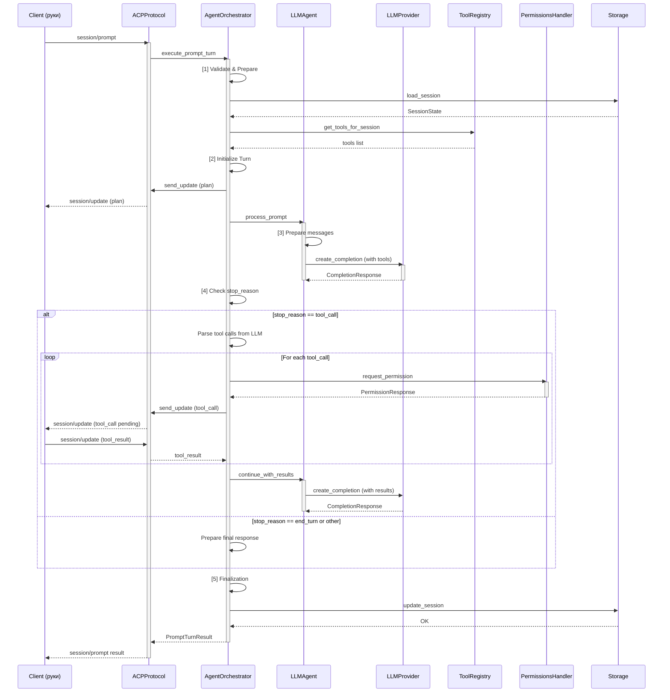
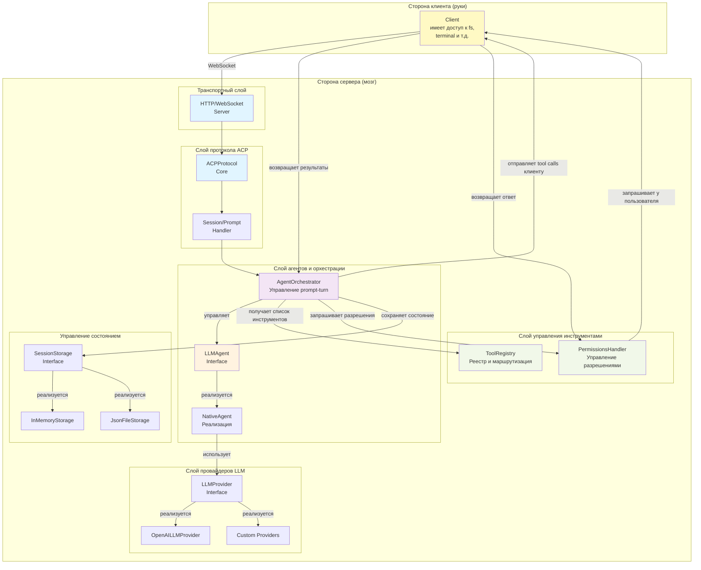

# Техническое задание на интеграцию LLM-агента в ACP Server

## 1. Цели и задачи интеграции

### Основная цель
Интегрировать поддержку LLM-агентов в acp-server, обеспечивающую гибкую архитектуру для использования как самописных агентов, так и готовых решений, при сохранении совместимости с протоколом ACP и текущей архитектурой сервера.

### Задачи
1. Создать абстрактный интерфейс для LLM-агентов, независимый от конкретной реализации
2. Интегрировать поддержку OpenAI API как первичного провайдера LLM (но без жесткой привязки)
3. Обеспечить совместимость с популярными агентными фреймворками (langchain, langgraph, agents, langflow)
4. Реализовать механизм управления инструментами и их жизненным циклом
5. Создать точки расширения для добавления новых LLM провайдеров и агентных фреймворков
6. Обеспечить прозрачное взаимодействие между ACP протоколом и LLM-агентом

## 2. Функциональные требования

### 2.1 Интерфейс агента (Agent Interface)

Агент должен реализовать следующий контракт:

```python
class LLMAgent(ABC):
    """Базовый интерфейс для LLM-агентов в ACP."""
    
    async def initialize(self, config: AgentConfig) -> None:
        """Инициализация агента с конфигурацией."""
        pass
    
    async def process_prompt(
        self,
        session_id: str,
        prompt: list[ContentBlock],
        tools: list[ToolDefinition],
        config: SessionConfig,
    ) -> PromptResponse:
        """Обработка пользовательского запроса с помощью LLM."""
        pass
    
    async def cancel_prompt(self, session_id: str) -> None:
        """Отмена текущего обработки запроса."""
        pass
```

**Требования:**
- Асинхронный API для работы с asyncio
- Поддержка streaming (опционально)
- Обработка ошибок и таймаутов
- Кэширование контекста сессии
- Управление состоянием обработки

### 2.2 LLM Provider Interface

Провайдер должен обеспечивать взаимодействие с конкретной LLM API:

```python
class LLMProvider(ABC):
    """Интерфейс для взаимодействия с LLM."""
    
    async def create_completion(
        self,
        messages: list[Message],
        tools: list[ToolDefinition] | None = None,
        **kwargs
    ) -> CompletionResponse:
        """Получить ответ от LLM."""
        pass
    
    async def stream_completion(
        self,
        messages: list[Message],
        tools: list[ToolDefinition] | None = None,
    ) -> AsyncIterator[CompletionChunk]:
        """Потоковый ответ от LLM."""
        pass
```

**Требования:**
- Поддержка системных промптов
- Форматирование tool definitions для LLM
- Обработка параметров модели (temperature, max_tokens, top_p и т.д.)
- Retry-логика при сбоях
- Соблюдение rate limits

### 2.3 Tool Call Generation & Client Delegation

**Ключевой принцип архитектуры:**
- **Сервер = мозг**: генерирует решения через LLM, определяет какие tool calls нужны
- **Клиент = руки**: выполняет инструменты, имеет доступ к файловой системе и ресурсам
- **Протокол ACP**: средство коммуникации для передачи tool calls и результатов

Реестр инструментов управляет доступным набором tool definitions:

```python
class ToolRegistry:
    """Реестр инструментов для агента."""
    
    def register_tool(self, tool: ToolDefinition) -> None:
        """Регистрация инструмента."""
        pass
    
    def get_tools_for_session(self, session_id: str) -> list[ToolDefinition]:
        """Получить инструменты для сессии с учетом прав."""
        pass
    
    async def send_tool_calls_to_client(
        self,
        session_id: str,
        tool_calls: list[ToolCall],
    ) -> None:
        """Отправить tool calls клиенту через session/update."""
        # Отправляет tool calls клиенту, который выполнит их
        pass
    
    async def request_permission(
        self,
        session_id: str,
        tool_call: ToolCall,
        options: list[PermissionOption],
    ) -> PermissionResponse:
        """Запрос разрешения на выполнение tool call (если режим "ask")."""
        pass
```

**Модель выполнения инструментов:**
1. **Сервер генерирует tool calls** через LLM (NativeAgent или другой фреймворк)
2. **Сервер отправляет tool calls клиенту** через протокол ACP (session/update)
3. **Клиент выполняет инструменты** (имеет доступ к fs, terminal и т.д.)
4. **Клиент возвращает результаты серверу** через session/update
5. **Сервер передает результаты в LLM** для продолжения обработки

**Требования:**
- Интеграция с Permission System (session/request_permission)
- Отправка tool calls клиенту через protocolнные сообщения
- Ожидание результатов от клиента
- Отслеживание статуса выполнения (pending → in_progress → completed)
- Обработка результатов и ошибок

### 2.4 Agent Session State Integration

Расширение SessionState для поддержки LLM-агента:

```python
@dataclass
class AgentState:
    """Состояние LLM-агента в сессии."""
    
    # История сообщений для LLM (может отличаться от ACP history)
    llm_message_history: list[Message]
    
    # Последний обработанный prompt
    current_prompt: list[ContentBlock] | None = None
    
    # Конвертация между ACP tools и LLM tool definitions
    tool_definitions_cache: list[ToolDefinition] | None = None
    
    # Текущее выполняемое tool call
    active_tool_call: ToolCall | None = None
```

**Требования:**
- Сохранение истории для перезагрузки сессии
- Управление контекстной длиной (context window)
- Синхронизация между ACP и LLM представлениями данных

### 2.5 Execution Pipeline

Обработка prompt turn должна проходить следующие этапы:

```
Client Request (session/prompt)
    ↓
[1] Validate & Prepare
    - Валидация prompt содержимого
    - Загрузка SessionState
    - Подготовка tool definitions для LLM
    ↓
[2] Initialize Turn
    - Создание ActiveTurnState
    - Отправка plan update (если требуется)
    ↓
[3] LLM Processing
    - Отправка в LLM с контекстом сессии
    - Потоковое получение ответов
    - Генерация tool calls (если требуется)
    ↓
[4] Tool Call Generation & Client Delegation
    - Парсинг tool calls из LLM ответа
    - Запрос разрешений (если режим "ask")
    - Отправка tool calls КЛИЕНТУ через session/update
    - Ожидание результатов от клиента
    - Получение результатов от клиента
    - Отправка результатов в LLM для продолжения
    ↓
[5] Finalization
    - Завершение turn с stopReason
    - Сохранение истории
    - Обновление SessionState
    ↓
Client Response (session/prompt result)
```

**Диаграмма последовательности Execution Pipeline:**



**Требования:**
- Поддержка deferred responses (WS)
- Обработка отмены (session/cancel)
- Отправка промежуточных updates
- Корректная обработка ошибок на каждом этапе

### 2.6 Режимы работы сервера

Сервер поддерживает два режима работы агентов:

#### Одно-агентный режим (Single-Agent Mode)
- **Описание**: Один универсальный агент обрабатывает все запросы
- **Компонент**: NativeAgent или адаптер фреймворка (Langchain, Langgraph)
- **Конфигурация**: `agent_mode: "single"`
- **Преимущества**:
  - Простота реализации и понимания
  - Снижение overhead коммуникации между агентами
  - Полный контекст всей задачи в одном агенте
- **Недостатки**:
  - Один агент должен быть универсальным
  - Может быть менее эффективен для сложных составных задач
- **Сценарии использования**:
  - Простые информационные запросы
  - Линейные workflows
  - Прототипирование и разработка

```python
config = {
    "agent_mode": "single",
    "agent_type": "native",  # или "langchain", "langgraph"
    "llm_model": "gpt-4",
    "llm_temperature": 0.7,
}
```

#### Мульти-агентный режим (Multi-Agent Mode)
- **Описание**: Несколько специализированных агентов работают согласованно под управлением оркестратора
- **Компоненты**:
  - MultiAgentOrchestrator (координатор)
  - MasterAgent (разложение задач на подзадачи)
  - SpecialistAgents (CodeAgent, FileSystemAgent, SearchAgent и т.д.)
  - InterAgentCommunication (обмен контекстом между агентами)
- **Конфигурация**: `agent_mode: "multi"`
- **Преимущества**:
  - Каждый агент специализирован на своей области
  - Параллельное выполнение независимых подзадач
  - Лучший баланс между эффективностью и универсальностью
  - Возможность отдельного масштабирования каждого агента
- **Недостатки**:
  - Большая сложность реализации
  - Overhead коммуникации между агентами
  - Нужна координация и синхронизация
- **Сценарии использования**:
  - Сложные многошаговые задачи
  - Работа с разными типами данных (код, файлы, информация)
  - Production системы с высокими требованиями к качеству
  - Необходимость параллельной обработки

```python
config = {
    "agent_mode": "multi",
    "master_agent": {
        "type": "native",
        "llm_model": "gpt-4",
        "system_prompt": "You are a task decomposition expert...",
    },
    "specialist_agents": {
        "code": {"type": "native", "llm_model": "gpt-4"},
        "filesystem": {"type": "native", "llm_model": "gpt-3.5-turbo"},
        "search": {"type": "native", "llm_model": "gpt-3.5-turbo"},
    },
}
```

**Переключение режимов:**
- Режим выбирается при создании сессии (session/new с параметром agent_mode)
- Режим можно изменить через session/set_config_option (перезагрузка агента)
- Режим и конфигурация сохраняются в SessionState

### 2.9 Configuration System

Конфигурация агента через SessionState.config_values:

```python
AGENT_CONFIG_SPECS = {
    "llm_model": {
        "name": "LLM Model",
        "category": "agent",
        "default": "gpt-4",
        "options": ["gpt-4", "gpt-3.5-turbo", "claude-3-opus", ...],
    },
    "llm_temperature": {
        "name": "Temperature",
        "category": "agent",
        "default": "0.7",
        "range": [0.0, 2.0],
    },
    "agent_framework": {
        "name": "Agent Framework",
        "category": "agent",
        "default": "native",
        "options": ["native", "langchain", "langgraph", "agents"],
    },
    "max_tool_calls_per_turn": {
        "name": "Max Tool Calls Per Turn",
        "category": "agent",
        "default": "10",
        "range": [1, 100],
    },
}
```

**Требования:**
- Динамическое изменение конфигурации через session/set_config_option
- Валидация параметров LLM
- Влияние на поведение агента в реальном времени

### 2.8 Диаграмма компонентов системы

**Архитектурные компоненты и их взаимосвязи:**



## 3. Нефункциональные требования

### 3.1 Производительность
- **Latency**: Первый ответ LLM в течение 1-5 секунд для типичных запросов
- **Throughput**: Поддержка одновременной обработки 10+ сессий
- **Memory**: Рациональное использование памяти с поддержкой кэширования контекста
- **Tool Execution**: Параллельное выполнение инструментов где возможно

### 3.2 Надежность
- **Error Handling**: Graceful degradation при недоступности LLM провайдера
- **Retry Logic**: Автоматические повторы с экспоненциальной задержкой
- **Timeout Management**: Явные таймауты для всех асинхронных операций
- **State Consistency**: Консистентность SessionState при сбоях

### 3.3 Масштабируемость
- **Pluggable Architecture**: Легко добавлять новые LLM провайдеры и агентные фреймворки
- **Tool Extensibility**: Механизм для регистрации собственных инструментов
- **Storage Independence**: Работа с любым SessionStorage backend
- **Framework Compatibility**: Интеграция с популярными агентными библиотеками

### 3.4 Безопасность
- **API Key Management**: Безопасное хранение и передача API ключей
- **Tool Authorization**: Проверка разрешений перед выполнением инструментов
- **Input Validation**: Валидация всех входных данных от LLM
- **Audit Logging**: Логирование всех операций для аудита

### 3.5 Совместимость
- **Python 3.12+**: Полная поддержка современных версий Python
- **ACP Protocol**: Соответствие спецификации ACP (версия 1)
- **Existing Code**: Минимальные изменения существующей кодовой базы
- **Transport Agnostic**: Работа как с WebSocket, так и с потенциальными новыми транспортами

## 4. Архитектурные принципы

### 4.1 Separation of Concerns
- Отделение логики агента от протокола и транспорта
- Разделение LLM провайдера от реализации агента
- Независимость Tool Registry от исполнителя

### 4.2 Dependency Injection
- Конструктивное внедрение зависимостей (LLMProvider, ToolRegistry, SessionStorage)
- Конфигурируемость на уровне приложения
- Облегчение тестирования с mock-объектами

### 4.3 Interface Segregation
- Минимальные необходимые интерфейсы
- Отсутствие избыточных методов
- Возможность реализации разных вариантов без переопределения ненужного

### 4.4 Open/Closed Principle
- Открыто для расширения (добавление новых провайдеров/фреймворков)
- Закрыто для модификации (существующие интерфейсы стабильны)

### 4.5 Composition over Inheritance
- Использование composition для комбинирования функциональности
- Гибкое построение pipeline-ов обработки
- Минимальное использование наследования

## 5. Интерфейсы и контракты

### 5.1 Agent Interface Contract

```python
# Инициализация
agent.initialize(config={
    "model": "gpt-4",
    "api_key": "sk-...",
    "temperature": 0.7,
    "system_prompt": "You are a helpful assistant.",
})

# Обработка prompt
response = await agent.process_prompt(
    session_id="sess_123",
    prompt=[{"type": "text", "text": "What is 2+2?"}],
    tools=[...],  # ToolDefinition[]
    config={"mode": "ask"},  # SessionConfig
)

# Результат
PromptResponse = {
    "stop_reason": "end_turn",  # или "tool_call", "cancelled", "max_tokens"
    "content": [...],
    "tool_calls": [...],  # Если stop_reason == "tool_call"
}
```

### 5.2 LLM Provider Contract

```python
# OpenAI API Compatible
provider = OpenAILLMProvider(api_key="sk-...", model="gpt-4")

completion = await provider.create_completion(
    messages=[
        {"role": "system", "content": "..."},
        {"role": "user", "content": "..."},
    ],
    tools=[...],  # Если агент поддерживает tool calls
    temperature=0.7,
    max_tokens=2000,
)
```

### 5.3 Tool Definition Contract

```python
# В ACP terms
tool = {
    "id": "read_file",
    "name": "Read File",
    "description": "Read contents of a file",
    "kind": "read",
    "inputSchema": {
        "type": "object",
        "properties": {
            "path": {"type": "string"},
        },
        "required": ["path"],
    },
}
```

### 5.4 Session Update Contract

Агент отправляет updates через ACP session/update:

```python
# Plan update
await session.send_update(
    update_type="plan",
    entries=[...],
)

# Tool call
await session.send_update(
    update_type="tool_call",
    tool_call_id="call_001",
    title="Reading file",
    kind="read",
    status="pending",
)

# Tool call update
await session.send_update(
    update_type="tool_call_update",
    tool_call_id="call_001",
    status="in_progress",
)
```

## 6. Ограничения и допущения

### 6.1 Ограничения

1. **Context Window**: Агент должен корректно обрабатывать ограничения context window LLM
2. **Tool Call Limits**: Максимум инструментов в одном turn ограничен (по умолчанию 10)
3. **Timeout**: Максимальное время обработки одного prompt-turn (по умолчанию 5 минут)
4. **Message History**: История сообщений ограничена памятью (может быть в сессии)
5. **Concurrent Sessions**: Одно соединение поддерживает одну активную обработку

### 6.2 Допущения

1. **Availability**: LLM провайдер доступен и функционирует
2. **API Keys**: Валидные API ключи предоставлены при инициализации
3. **Tool Availability**: Инструменты, запрошенные LLM, доступны и исполняемы
4. **Session Isolation**: Сессии независимы друг от друга
5. **Stateless LLM Calls**: Каждый вызов LLM включает полный контекст (нет side-effects между вызовами)

### 6.3 Не входит в scope

1. **Custom LLM Training**: Fine-tuning или обучение моделей
2. **RAG Implementation**: Внешние системы для поиска и обогащения контекста
3. **Multi-Modal Processing**: Глубокая обработка изображений, видео
4. **Real-time Streaming UI**: Клиентская визуализация потока данных
5. **Persistent Learning**: Сохранение и применение знаний между сессиями

## 7. Критерии приемки

1. ✅ Агент может обрабатывать простые текстовые запросы
2. ✅ Tool calls из LLM корректно маршрутизируются и выполняются
3. ✅ Permission requests отправляются и обрабатываются
4. ✅ Session/cancel корректно отменяет обработку
5. ✅ Интеграция с populer агентными фреймворками демонстрируется
6. ✅ Все проверки проходят: `make check`
7. ✅ Документация актуальна и полна

## 8. Версионирование и совместимость

- **Версия API**: 1.0 (соответствует ACP Protocol v1)
- **Python**: 3.12+
- **Зависимости**: Минимальны для базовой функциональности, опциональны для фреймворков
- **Backward Compatibility**: Изменения должны быть совместимы с существующей архитектурой
