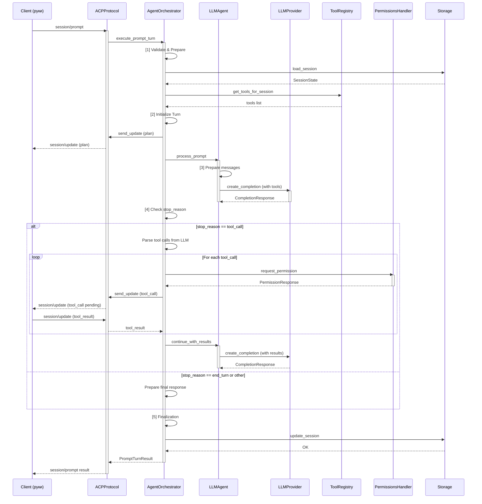
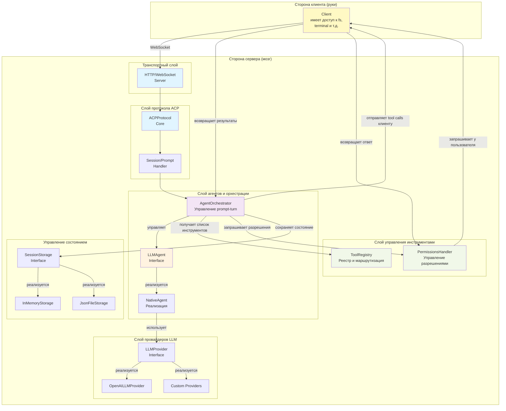

# Техническое задание на интеграцию LLM-агента в ACP Server

## 1. Цели и задачи интеграции

### Основная цель
Интегрировать поддержку LLM-агентов в acp-server, обеспечивающую гибкую архитектуру для использования как самописных агентов, так и готовых решений, при сохранении совместимости с протоколом ACP и текущей архитектурой сервера.

### Задачи
1. Создать абстрактный интерфейс для LLM-агентов, независимый от конкретной реализации
2. Интегрировать поддержку OpenAI API как первичного провайдера LLM (но без жесткой привязки)
3. Обеспечить совместимость с популярными агентными фреймворками (langchain, langgraph, agents, langflow)
4. Реализовать механизм управления инструментами и их жизненным циклом
5. Создать точки расширения для добавления новых LLM провайдеров и агентных фреймворков
6. Обеспечить прозрачное взаимодействие между ACP протоколом и LLM-агентом

## 2. Функциональные требования

### 2.1 Интерфейс агента (Agent Interface)

Агент должен реализовать следующий контракт:

```python
class LLMAgent(ABC):
    """Базовый интерфейс для LLM-агентов в ACP."""
    
    async def initialize(self, config: AgentConfig) -> None:
        """Инициализация агента с конфигурацией."""
        pass
    
    async def process_prompt(
        self,
        session_id: str,
        prompt: list[ContentBlock],
        tools: list[ToolDefinition],
        config: SessionConfig,
    ) -> PromptResponse:
        """Обработка пользовательского запроса с помощью LLM."""
        pass
    
    async def cancel_prompt(self, session_id: str) -> None:
        """Отмена текущего обработки запроса."""
        pass
```

**Требования:**
- Асинхронный API для работы с asyncio
- Поддержка streaming (опционально)
- Обработка ошибок и таймаутов
- Кэширование контекста сессии
- Управление состоянием обработки

### 2.2 LLM Provider Interface

Провайдер должен обеспечивать взаимодействие с конкретной LLM API:

```python
class LLMProvider(ABC):
    """Интерфейс для взаимодействия с LLM."""
    
    async def create_completion(
        self,
        messages: list[Message],
        tools: list[ToolDefinition] | None = None,
        **kwargs
    ) -> CompletionResponse:
        """Получить ответ от LLM."""
        pass
    
    async def stream_completion(
        self,
        messages: list[Message],
        tools: list[ToolDefinition] | None = None,
    ) -> AsyncIterator[CompletionChunk]:
        """Потоковый ответ от LLM."""
        pass
```

**Требования:**
- Поддержка системных промптов
- Форматирование tool definitions для LLM
- Обработка параметров модели (temperature, max_tokens, top_p и т.д.)
- Retry-логика при сбоях
- Соблюдение rate limits

### 2.3 Tool Call Generation & Client Delegation

**Ключевой принцип архитектуры:**
- **Сервер = мозг**: генерирует решения через LLM, определяет какие tool calls нужны
- **Клиент = руки**: выполняет инструменты, имеет доступ к файловой системе и ресурсам
- **Протокол ACP**: средство коммуникации для передачи tool calls и результатов

Реестр инструментов управляет доступным набором tool definitions:

```python
class ToolRegistry:
    """Реестр инструментов для агента."""
    
    def register_tool(self, tool: ToolDefinition) -> None:
        """Регистрация инструмента."""
        pass
    
    def get_tools_for_session(self, session_id: str) -> list[ToolDefinition]:
        """Получить инструменты для сессии с учетом прав."""
        pass
    
    async def send_tool_calls_to_client(
        self,
        session_id: str,
        tool_calls: list[ToolCall],
    ) -> None:
        """Отправить tool calls клиенту через session/update."""
        # Отправляет tool calls клиенту, который выполнит их
        pass
    
    async def request_permission(
        self,
        session_id: str,
        tool_call: ToolCall,
        options: list[PermissionOption],
    ) -> PermissionResponse:
        """Запрос разрешения на выполнение tool call (если режим "ask")."""
        pass
```

**Модель выполнения инструментов:**
1. **Сервер генерирует tool calls** через LLM (NativeAgent или другой фреймворк)
2. **Сервер отправляет tool calls клиенту** через протокол ACP (session/update)
3. **Клиент выполняет инструменты** (имеет доступ к fs, terminal и т.д.)
4. **Клиент возвращает результаты серверу** через session/update
5. **Сервер передает результаты в LLM** для продолжения обработки

**Требования:**
- Интеграция с Permission System (session/request_permission)
- Отправка tool calls клиенту через protocolнные сообщения
- Ожидание результатов от клиента
- Отслеживание статуса выполнения (pending → in_progress → completed)
- Обработка результатов и ошибок

### 2.4 Agent Session State Integration

Расширение SessionState для поддержки LLM-агента:

```python
@dataclass
class AgentState:
    """Состояние LLM-агента в сессии."""
    
    # История сообщений для LLM (может отличаться от ACP history)
    llm_message_history: list[Message]
    
    # Последний обработанный prompt
    current_prompt: list[ContentBlock] | None = None
    
    # Конвертация между ACP tools и LLM tool definitions
    tool_definitions_cache: list[ToolDefinition] | None = None
    
    # Текущее выполняемое tool call
    active_tool_call: ToolCall | None = None
```

**Требования:**
- Сохранение истории для перезагрузки сессии
- Управление контекстной длиной (context window)
- Синхронизация между ACP и LLM представлениями данных

### 2.5 Execution Pipeline

Обработка prompt turn должна проходить следующие этапы:

```
Client Request (session/prompt)
    ↓
[1] Validate & Prepare
    - Валидация prompt содержимого
    - Загрузка SessionState
    - Подготовка tool definitions для LLM
    ↓
[2] Initialize Turn
    - Создание ActiveTurnState
    - Отправка plan update (если требуется)
    ↓
[3] LLM Processing
    - Отправка в LLM с контекстом сессии
    - Потоковое получение ответов
    - Генерация tool calls (если требуется)
    ↓
[4] Tool Call Generation & Client Delegation
    - Парсинг tool calls из LLM ответа
    - Запрос разрешений (если режим "ask")
    - Отправка tool calls КЛИЕНТУ через session/update
    - Ожидание результатов от клиента
    - Получение результатов от клиента
    - Отправка результатов в LLM для продолжения
    ↓
[5] Finalization
    - Завершение turn с stopReason
    - Сохранение истории
    - Обновление SessionState
    ↓
Client Response (session/prompt result)
```

**Диаграмма последовательности Execution Pipeline:**



**Требования:**
- Поддержка deferred responses (WS)
- Обработка отмены (session/cancel)
- Отправка промежуточных updates
- Корректная обработка ошибок на каждом этапе

### 2.6 Режимы работы сервера

Сервер поддерживает два режима работы агентов:

#### Одно-агентный режим (Single-Agent Mode)
- **Описание**: Один универсальный агент обрабатывает все запросы
- **Компонент**: NativeAgent или адаптер фреймворка (Langchain, Langgraph)
- **Конфигурация**: `agent_mode: "single"`
- **Преимущества**:
  - Простота реализации и понимания
  - Снижение overhead коммуникации между агентами
  - Полный контекст всей задачи в одном агенте
- **Недостатки**:
  - Один агент должен быть универсальным
  - Может быть менее эффективен для сложных составных задач
- **Сценарии использования**:
  - Простые информационные запросы
  - Линейные workflows
  - Прототипирование и разработка

```python
config = {
    "agent_mode": "single",
    "agent_type": "native",  # или "langchain", "langgraph"
    "llm_model": "gpt-4",
    "llm_temperature": 0.7,
}
```

#### Мульти-агентный режим (Multi-Agent Mode)
- **Описание**: Несколько специализированных агентов работают согласованно под управлением оркестратора
- **Компоненты**:
  - MultiAgentOrchestrator (координатор)
  - MasterAgent (разложение задач на подзадачи)
  - SpecialistAgents (CodeAgent, FileSystemAgent, SearchAgent и т.д.)
  - InterAgentCommunication (обмен контекстом между агентами)
- **Конфигурация**: `agent_mode: "multi"`
- **Преимущества**:
  - Каждый агент специализирован на своей области
  - Параллельное выполнение независимых подзадач
  - Лучший баланс между эффективностью и универсальностью
  - Возможность отдельного масштабирования каждого агента
- **Недостатки**:
  - Большая сложность реализации
  - Overhead коммуникации между агентами
  - Нужна координация и синхронизация
- **Сценарии использования**:
  - Сложные многошаговые задачи
  - Работа с разными типами данных (код, файлы, информация)
  - Production системы с высокими требованиями к качеству
  - Необходимость параллельной обработки

```python
config = {
    "agent_mode": "multi",
    "master_agent": {
        "type": "native",
        "llm_model": "gpt-4",
        "system_prompt": "You are a task decomposition expert...",
    },
    "specialist_agents": {
        "code": {"type": "native", "llm_model": "gpt-4"},
        "filesystem": {"type": "native", "llm_model": "gpt-3.5-turbo"},
        "search": {"type": "native", "llm_model": "gpt-3.5-turbo"},
    },
}
```

**Переключение режимов:**
- Режим выбирается при создании сессии (session/new с параметром agent_mode)
- Режим можно изменить через session/set_config_option (перезагрузка агента)
- Режим и конфигурация сохраняются в SessionState

### 2.7 Режимы работы агента (RooCode-совместимые)

Интеграция с функциями RooCode обеспечивает поддержку пяти специализированных режимов работы агента, каждый с уникальными ограничениями и возможностями:

#### 2.7.1 Ask Mode
**Назначение**: Запрос разрешения перед выполнением чувствительных операций, информационный режим.

**Поведение агента**:
- Читает файлы без запроса разрешения
- Запрашивает разрешение перед записью/изменением файлов
- Запрашивает разрешение перед выполнением команд
- Предлагает альтернативы перед изменениями

**Файловые ограничения**:
| Операция | Ask Mode |
|----------|----------|
| Чтение файлов | ✅ Да |
| Запись файлов | ⚠️ Требует разрешения |
| Удаление файлов | ⚠️ Требует разрешения |
| Выполнение команд | ⚠️ Требует разрешения |
| Создание директорий | ⚠️ Требует разрешения |

**Сценарии использования**:
- Анализ существующего кода
- Исследовательские задачи
- Безопасная интеграция в existing проекты
- Прототипирование с контролем пользователя

#### 2.7.2 Code Mode
**Назначение**: Полный доступ к инструментам и файловой системе для реализации задач.

**Поведение агента**:
- Полный доступ ко всем операциям
- Выполняет инструменты без запроса разрешения
- Оптимизирован для скорости выполнения
- Минимальные интерактивные действия

**Файловые ограничения**:
| Операция | Code Mode |
|----------|-----------|
| Чтение файлов | ✅ Да |
| Запись файлов | ✅ Да |
| Удаление файлов | ✅ Да |
| Выполнение команд | ✅ Да |
| Создание директорий | ✅ Да |

**Сценарии использования**:
- Разработка новых функций
- Автоматизация рутинных задач
- Production deployment
- Trusted environment с полным контролем

#### 2.7.3 Architect Mode
**Назначение**: Планирование и проектирование архитектуры без реализации.

**Поведение агента**:
- Чтение и анализ файлов
- Создание документов и планов (без изменения исходного кода)
- Проектирование архитектур
- Диаграммы и спецификации
- Предложения без реализации

**Файловые ограничения**:
| Операция | Architect Mode |
|----------|---|
| Чтение файлов | ✅ Да |
| Запись файлов | ❌ Нет (только документация) |
| Удаление файлов | ❌ Нет |
| Выполнение команд | ❌ Нет |
| Создание документов | ✅ Да |

**Сценарии использования**:
- Дизайн архитектуры системы
- Создание техдокументации
- Анализ и планирование рефакторинга
- Code review и предложения улучшений

#### 2.7.4 Debug Mode
**Назначение**: Отладка и диагностика проблем, анализ логов и трассировок.

**Поведение агента**:
- Чтение логов и диагностических файлов
- Выполнение диагностических команд
- Анализ ошибок
- Запрашивает разрешение перед изменением кода/конфигурации

**Файловые ограничения**:
| Операция | Debug Mode |
|----------|---|
| Чтение файлов | ✅ Да |
| Чтение логов | ✅ Да |
| Запись файлов | ⚠️ Только для логов/отчетов |
| Выполнение команд | ✅ Диагностические команды |
| Изменение конфигурации | ⚠️ Требует разрешения |

**Сценарии использования**:
- Анализ и исправление ошибок
- Диагностика проблем производительности
- Анализ логов и трейсов
- Troubleshooting продакшена

#### 2.7.5 Orchestrator Mode
**Назначение**: Координация сложных многошаговых задач с делегированием подзадач.

**Поведение агента**:
- Разложение задач на подзадачи
- Делегирование подзадач специализированным агентам
- Управление зависимостями между подзадачами
- Координация параллельного выполнения
- Синтез результатов из нескольких источников

**Файловые ограничения**:
| Операция | Orchestrator Mode |
|----------|---|
| Чтение файлов | ✅ Да |
| Запись файлов | ✅ Да (управляется подзадачами) |
| Удаление файлов | ✅ Да (управляется подзадачами) |
| Выполнение команд | ✅ Да (управляется подзадачами) |
| Управление подзадачами | ✅ Да |

**Сценарии использования**:
- Сложные многошаговые проекты
- Параллельная разработка нескольких компонентов
- Интеграция результатов нескольких разработчиков
- Production deployment с множеством стадий

**Конфигурация режимов в session/new:**
```python
config = {
    "mode": "code",  # ask, code, architect, debug, orchestrator
    "file_restrictions": True,  # Соблюдать ограничения режима
    "request_permissions": True,  # Запрашивать разрешение (для ask/debug)
}
```

### 2.8 Система управления задачами (Todos)

Интегрированная система управления задачами позволяет агенту создавать и отслеживать список дел (todos) в рамках обработки prompt-turn.

#### 2.8.1 Структура задачи (TodoEntry)

```python
@dataclass
class TodoEntry:
    """Запись задачи в плане сессии."""
    
    # Уникальный идентификатор (обязательно)
    id: str
    
    # Содержание и описание
    content: str  # "Read configuration file"
    description: str | None = None
    
    # Статус выполнения
    status: str = "pending"  # pending, in_progress, completed
    
    # Приоритет и прогресс
    priority: str = "medium"  # low, medium, high
    progress: float = 0.0  # 0-1 для отслеживания процента
    
    # Иерархия (опционально)
    parent_id: str | None = None  # ID родительской задачи
    subtasks: list[str] = field(default_factory=list)  # IDs подзадач
    
    # Конфигурация выполнения
    assigned_mode: str = "code"  # Mode для выполнения подзадачи
    dependencies: list[str] = field(default_factory=list)  # IDs зависимостей
```

#### 2.8.2 Жизненный цикл todos

```
[1] Создание (session/prompt начало)
    ↓
[2] Инициализация (pending → in_progress)
    ├─ Первая задача получает статус in_progress
    └─ Остальные остаются pending
    ↓
[3] Выполнение и обновление
    ├─ Агент обновляет progress (0-1)
    ├─ Agora may move to next task when current done
    └─ session/update: plan с обновленными todos
    ↓
[4] Завершение
    └─ Все todos completed когда turn завершен
```

#### 2.8.3 Отправка todos через ACP

Todos передаются клиенту через стандартный механизм `session/update: plan`:

```json
{
  "jsonrpc": "2.0",
  "method": "session/update",
  "params": {
    "sessionId": "sess_abc123def456",
    "update": {
      "sessionUpdate": "plan",
      "entries": [
        {
          "id": "todo_1",
          "content": "Analyze requirements",
          "priority": "high",
          "status": "completed",
          "progress": 1.0
        },
        {
          "id": "todo_2",
          "content": "Design architecture",
          "priority": "high",
          "status": "in_progress",
          "progress": 0.5
        },
        {
          "id": "todo_3",
          "content": "Implement features",
          "priority": "medium",
          "status": "pending",
          "progress": 0.0
        }
      ]
    }
  }
}
```

#### 2.8.4 Управление todos агентом

**Инициализация (при получении prompt):**
```python
# Агент анализирует промпт и генерирует план
todos = [
    TodoEntry(id="1", content="Parse requirements", status="in_progress"),
    TodoEntry(id="2", content="Design solution", status="pending"),
    TodoEntry(id="3", content="Implement code", status="pending"),
    TodoEntry(id="4", content="Write tests", status="pending"),
]

# Отправка плана клиенту
await session.send_update(sessionUpdate="plan", entries=todos)
```

**Обновление статуса:**
```python
# По мере выполнения - обновить todo и отправить update
todos[0].status = "completed"
todos[0].progress = 1.0
todos[1].status = "in_progress"
todos[1].progress = 0.3

await session.send_update(sessionUpdate="plan", entries=todos)
```

**Динамическое добавление/удаление:**
```python
# Агент может добавить новую задачу в процессе
new_todo = TodoEntry(id="5", content="Deploy to staging")
todos.append(new_todo)

await session.send_update(sessionUpdate="plan", entries=todos)
```

#### 2.8.5 Требования

- Todos обновляются с каждым значительным прогрессом
- Клиент отображает todos в интерфейсе для пользователя
- Todos сохраняются в SessionState.plan для персистентности
- Иерархия todos (parent_id, subtasks) - опциональная поддержка
- Синхронизация todos с Agent Plan в реальном времени

### 2.9 Делегирование подзадач (Subtasks)

Механизм делегирования позволяет агенту создавать и выполнять вложенные подзадачи в отдельных сессиях с сохранением контекста.

#### 2.9.1 Архитектура делегирования

**Подход 1: Tool Call с kind="delegate" (рекомендуется для ЭПОХИ 1)**

Делегирование реализуется как специальный тип tool call:

```json
{
  "jsonrpc": "2.0",
  "method": "session/update",
  "params": {
    "sessionId": "sess_parent_123",
    "update": {
      "sessionUpdate": "tool_call",
      "toolCallId": "delegate_1",
      "title": "Delegate code implementation",
      "kind": "delegate",
      "status": "pending",
      "rawInput": {
        "subtask_description": "Implement authentication module",
        "assigned_mode": "code",
        "context": {
          "parent_session_id": "sess_parent_123",
          "parent_task_id": "todo_2",
          "requirements": "Secure user authentication with JWT",
          "related_files": ["auth/types.py", "auth/config.py"]
        },
        "dependencies": ["todo_1"]
      }
    }
  }
}
```

**Подход 2: Расширенный sessionUpdate (для ЭПОХИ 2)**

```json
{
  "jsonrpc": "2.0",
  "method": "session/update",
  "params": {
    "sessionId": "sess_parent_123",
    "update": {
      "sessionUpdate": "subtask",
      "subtaskId": "sub_1",
      "parentTodoId": "todo_2",
      "title": "Implement authentication",
      "assignedMode": "code",
      "context": {
        "parent_context": {...},
        "dependencies": ["todo_1"],
        "requirements": "..."
      },
      "status": "pending"
    }
  }
}
```

#### 2.9.2 Жизненный цикл подзадачи

```
[1] Инициирование (родительский агент)
    ├─ Создание tool_call с kind="delegate"
    └─ Отправка клиенту через session/update
    ↓
[2] Обработка на клиенте
    ├─ Распознавание kind="delegate"
    ├─ Создание дочерней сессии (session/new)
    └─ Передача контекста и режима
    ↓
[3] Выполнение подзадачи
    ├─ Дочерний агент обрабатывает задачу
    ├─ Выполняет tool calls
    ├─ Генерирует результаты
    └─ Отправляет обновления плана (todos)
    ↓
[4] Сбор результатов
    ├─ Клиент собирает результаты из дочерней сессии
    ├─ Отправляет результаты родителю (session/update с результатом)
    └─ Закрывает дочернюю сессию
    ↓
[5] Синтез (родительский агент)
    ├─ Получает результаты от подзадачи
    ├─ Интегрирует в общий контекст
    └─ Продолжает обработку родительской задачи
```

#### 2.9.3 Структура контекста подзадачи

```python
subtask_context = {
    # Идентификация
    "parent_session_id": "sess_parent_123",
    "parent_agent": "master_agent",
    "parent_task_id": "todo_2",
    
    # Описание работы
    "subtask_description": "Implement authentication module",
    "assigned_mode": "code",  # ask, code, architect, debug
    
    # Зависимости
    "dependencies": ["todo_1"],  # Какие todos должны быть готовы
    "depends_on_subtasks": [],  # Какие подзадачи должны завершиться
    
    # Контекст выполнения
    "requirements": "Secure user authentication with JWT",
    "related_files": ["auth/types.py", "auth/config.py"],
    "forbidden_paths": [],  # Запретные директории
    
    # Параметры выполнения
    "timeout": 300,  # Максимум 5 минут для подзадачи
    "max_tool_calls": 20,
}
```

#### 2.9.4 Поддержка вложенности и параллелизма

**Вложенность (иерархия подзадач):**
```
Родительская задача
├─ Подзадача 1
│  ├─ Под-подзадача 1.1
│  └─ Под-подзадача 1.2
├─ Подзадача 2
│  └─ Под-подзадача 2.1
└─ Подзадача 3
```

**Параллельное выполнение:**
```python
# Агент может делегировать несколько независимых подзадач
delegated = [
    delegate_subtask("Implement auth module", depends_on=[]),
    delegate_subtask("Implement API endpoints", depends_on=[]),
    delegate_subtask("Implement tests", depends_on=["auth", "endpoints"]),
]

# Клиент выполнит первые две параллельно, третья ждет завершения
```

#### 2.9.5 Требования

- Контекст сохраняется при передаче подзадаче
- Результаты собираются и возвращаются родителю
- Поддержка зависимостей между подзадачами
- Таймауты и обработка ошибок для подзадач
- Изоляция - подзадача работает в отдельной сессии

### 2.10 Переключение режимов (Mode Switching)

Агент может динамически переключаться между режимами во время выполнения prompt-turn на основе анализа задачи.

#### 2.10.1 Механизм переключения

**Инициирование переключения:**
```python
# Агент анализирует текущий режим и требования задачи
if requires_design_phase(task):
    # Переключиться в Architect Mode для планирования
    await session.set_config_option("mode", "architect")
elif requires_debugging(task):
    # Переключиться в Debug Mode для диагностики
    await session.set_config_option("mode", "debug")
else:
    # Остаться в текущем режиме или переключиться в Code
    await session.set_config_option("mode", "code")
```

**Отправка уведомления клиенту:**
```json
{
  "jsonrpc": "2.0",
  "method": "session/update",
  "params": {
    "sessionId": "sess_123",
    "update": {
      "sessionUpdate": "session_info_update",
      "session": {
        "mode": "code",
        "reason": "Switched from ask to code mode for implementation"
      }
    }
  }
}
```

#### 2.10.2 Сохранение контекста

При переключении режима:
- ✅ История сообщений сохраняется
- ✅ Выполненные tool calls остаются в контексте
- ✅ Todos и их статусы сохраняются
- ✅ SessionState полностью доступен
- ✅ Только изменяются file restrictions и поведение агента

#### 2.10.3 Условия переключения

| Условие | Из режима | В режим | Причина |
|---------|----------|--------|---------|
| Требуется проектирование | ask/code | architect | Дизайн архитектуры |
| Требуется отладка | ask/code | debug | Анализ ошибок |
| Требуется реализация | architect/debug | code | Написание кода |
| Требуется безопасность | code | ask | Высокорисковая операция |
| Требуется координация | ask/code | orchestrator | Сложная многошаговая задача |

#### 2.10.4 Ограничения и рекомендации

- Переключение режима - явное действие агента, инициируемое через `session/set_config_option`
- Клиент должен быть уведомлен об изменении режима через `session_info_update`
- Переключение режима не отменяет выполняющиеся task calls
- Рекомендуется переключаться режимы между логическими блоками работы
- Максимум переключений в одном turn: неограниченно, но разумно (обычно 2-3)

### 2.11 Configuration System

Конфигурация агента через SessionState.config_values:

```python
AGENT_CONFIG_SPECS = {
    "llm_model": {
        "name": "LLM Model",
        "category": "agent",
        "default": "gpt-4",
        "options": ["gpt-4", "gpt-3.5-turbo", "claude-3-opus", ...],
    },
    "llm_temperature": {
        "name": "Temperature",
        "category": "agent",
        "default": "0.7",
        "range": [0.0, 2.0],
    },
    "agent_framework": {
        "name": "Agent Framework",
        "category": "agent",
        "default": "native",
        "options": ["native", "langchain", "langgraph", "agents"],
    },
    "max_tool_calls_per_turn": {
        "name": "Max Tool Calls Per Turn",
        "category": "agent",
        "default": "10",
        "range": [1, 100],
    },
}
```

**Требования:**
- Динамическое изменение конфигурации через session/set_config_option
- Валидация параметров LLM
- Влияние на поведение агента в реальном времени

### 2.8 Диаграмма компонентов системы

**Архитектурные компоненты и их взаимосвязи:**



## 3. Нефункциональные требования

### 3.1 Производительность
- **Latency**: Первый ответ LLM в течение 1-5 секунд для типичных запросов
- **Throughput**: Поддержка одновременной обработки 10+ сессий
- **Memory**: Рациональное использование памяти с поддержкой кэширования контекста
- **Tool Execution**: Параллельное выполнение инструментов где возможно
- **Streaming**: Потоковая отправка промежуточных результатов без задержек

### 3.2 Надежность
- **Error Handling**: Graceful degradation при недоступности LLM провайдера
- **Retry Logic**: Автоматические повторы с экспоненциальной задержкой
- **Timeout Management**: Явные таймауты для всех асинхронных операций
- **State Consistency**: Консистентность SessionState при сбоях
- **Mode Persistence**: Сохранение текущего режима при восстановлении сессии

### 3.3 Масштабируемость
- **Pluggable Architecture**: Легко добавлять новые LLM провайдеры и агентные фреймворки
- **Tool Extensibility**: Механизм для регистрации собственных инструментов
- **Storage Independence**: Работа с любым SessionStorage backend
- **Framework Compatibility**: Интеграция с популярными агентными библиотеками
- **Subtask Scalability**: Поддержка произвольной глубины вложенности подзадач

### 3.4 Безопасность
- **API Key Management**: Безопасное хранение и передача API ключей
- **Tool Authorization**: Проверка разрешений перед выполнением инструментов
- **Input Validation**: Валидация всех входных данных от LLM
- **Audit Logging**: Логирование всех операций для аудита
- **File Restrictions**: Строгое соблюдение ограничений по режимам
- **Mode Enforcement**: Невозможность обхода ограничений режима

### 3.5 Совместимость
- **Python 3.12+**: Полная поддержка современных версий Python
- **ACP Protocol**: Соответствие спецификации ACP (версия 1)
- **Existing Code**: Минимальные изменения существующей кодовой базы
- **Transport Agnostic**: Работа как с WebSocket, так и с потенциальными новыми транспортами

### 3.6 Совместимость с RooCode
- **Mode Coverage**: Поддержка всех 5 режимов RooCode (Ask, Code, Architect, Debug, Orchestrator)
- **File Restrictions**: Полная реализация ограничений по режимам (85-90% совместимости)
- **Todos Integration**: Управление списком задач через Agent Plan (session/update: plan)
- **Subtask Support**: Делегирование подзадач через tool calls (kind="delegate")
- **Mode Switching**: Динамическое переключение режимов с сохранением контекста
- **Streaming Responses**: Потоковая отправка промежуточных обновлений через session/update
- **Context Preservation**: Полное сохранение контекста при переключении режимов и завершении подзадач

## 4. Архитектурные принципы

### 4.1 Separation of Concerns
- Отделение логики агента от протокола и транспорта
- Разделение LLM провайдера от реализации агента
- Независимость Tool Registry от исполнителя

### 4.2 Dependency Injection
- Конструктивное внедрение зависимостей (LLMProvider, ToolRegistry, SessionStorage)
- Конфигурируемость на уровне приложения
- Облегчение тестирования с mock-объектами

### 4.3 Interface Segregation
- Минимальные необходимые интерфейсы
- Отсутствие избыточных методов
- Возможность реализации разных вариантов без переопределения ненужного

### 4.4 Open/Closed Principle
- Открыто для расширения (добавление новых провайдеров/фреймворков)
- Закрыто для модификации (существующие интерфейсы стабильны)

### 4.5 Composition over Inheritance
- Использование composition для комбинирования функциональности
- Гибкое построение pipeline-ов обработки
- Минимальное использование наследования

## 5. Интерфейсы и контракты

### 5.1 Agent Interface Contract

```python
# Инициализация
agent.initialize(config={
    "model": "gpt-4",
    "api_key": "sk-...",
    "temperature": 0.7,
    "system_prompt": "You are a helpful assistant.",
})

# Обработка prompt
response = await agent.process_prompt(
    session_id="sess_123",
    prompt=[{"type": "text", "text": "What is 2+2?"}],
    tools=[...],  # ToolDefinition[]
    config={"mode": "ask"},  # SessionConfig
)

# Результат
PromptResponse = {
    "stop_reason": "end_turn",  # или "tool_call", "cancelled", "max_tokens"
    "content": [...],
    "tool_calls": [...],  # Если stop_reason == "tool_call"
}
```

### 5.2 LLM Provider Contract

```python
# OpenAI API Compatible
provider = OpenAILLMProvider(api_key="sk-...", model="gpt-4")

completion = await provider.create_completion(
    messages=[
        {"role": "system", "content": "..."},
        {"role": "user", "content": "..."},
    ],
    tools=[...],  # Если агент поддерживает tool calls
    temperature=0.7,
    max_tokens=2000,
)
```

### 5.3 Tool Definition Contract

```python
# В ACP terms
tool = {
    "id": "read_file",
    "name": "Read File",
    "description": "Read contents of a file",
    "kind": "read",
    "inputSchema": {
        "type": "object",
        "properties": {
            "path": {"type": "string"},
        },
        "required": ["path"],
    },
}
```

### 5.4 Session Update Contract

Агент отправляет updates через ACP session/update:

```python
# Plan update
await session.send_update(
    update_type="plan",
    entries=[...],
)

# Tool call
await session.send_update(
    update_type="tool_call",
    tool_call_id="call_001",
    title="Reading file",
    kind="read",
    status="pending",
)

# Tool call update
await session.send_update(
    update_type="tool_call_update",
    tool_call_id="call_001",
    status="in_progress",
)
```

## 6. Ограничения и допущения

### 6.1 Ограничения

1. **Context Window**: Агент должен корректно обрабатывать ограничения context window LLM
2. **Tool Call Limits**: Максимум инструментов в одном turn ограничен (по умолчанию 10)
3. **Timeout**: Максимальное время обработки одного prompt-turn (по умолчанию 5 минут)
4. **Message History**: История сообщений ограничена памятью (может быть в сессии)
5. **Concurrent Sessions**: Одно соединение поддерживает одну активную обработку

### 6.2 Допущения

1. **Availability**: LLM провайдер доступен и функционирует
2. **API Keys**: Валидные API ключи предоставлены при инициализации
3. **Tool Availability**: Инструменты, запрошенные LLM, доступны и исполняемы
4. **Session Isolation**: Сессии независимы друг от друга
5. **Stateless LLM Calls**: Каждый вызов LLM включает полный контекст (нет side-effects между вызовами)

### 6.3 Не входит в scope

1. **Custom LLM Training**: Fine-tuning или обучение моделей
2. **RAG Implementation**: Внешние системы для поиска и обогащения контекста
3. **Multi-Modal Processing**: Глубокая обработка изображений, видео
4. **Real-time Streaming UI**: Клиентская визуализация потока данных
5. **Persistent Learning**: Сохранение и применение знаний между сессиями

## 7. Критерии приемки

### 7.1 Базовая функциональность

1. ✅ Агент может обрабатывать простые текстовые запросы
2. ✅ Tool calls из LLM корректно маршрутизируются и выполняются
3. ✅ Permission requests отправляются и обрабатываются
4. ✅ Session/cancel корректно отменяет обработку
5. ✅ Интеграция с populer агентными фреймворками демонстрируется
6. ✅ Все проверки проходят: `make check`
7. ✅ Документация актуальна и полна

### 7.2 Режимы работы (RooCode)

**Ask Mode:**
- ✅ Агент читает файлы без запроса разрешения
- ✅ Агент запрашивает разрешение перед записью файлов
- ✅ Агент запрашивает разрешение перед выполнением команд
- ✅ File restrictions соблюдаются строго
- ✅ Пользователь может отклонить опасные операции

**Code Mode:**
- ✅ Агент имеет полный доступ без запроса разрешения
- ✅ File restrictions не применяются
- ✅ Все операции выполняются без подтверждения
- ✅ Режим оптимизирован для скорости

**Architect Mode:**
- ✅ Агент может читать и анализировать файлы
- ✅ Агент может создавать документацию и планы
- ✅ Агент НЕ может изменять исходный код
- ✅ Агент НЕ может выполнять команды
- ✅ File restrictions на запись/delete работают

**Debug Mode:**
- ✅ Агент может читать логи и диагностические файлы
- ✅ Агент может выполнять диагностические команды
- ✅ Агент может создавать отчеты об ошибках
- ✅ Агент запрашивает разрешение перед изменением конфигурации
- ✅ File restrictions соблюдаются

**Orchestrator Mode:**
- ✅ Агент может делегировать подзадачи
- ✅ Агент управляет зависимостями между подзадачами
- ✅ Параллельное выполнение подзадач работает
- ✅ Результаты синтезируются корректно
- ✅ Context сохраняется при делегировании

### 7.3 Управление задачами (Todos)

- ✅ Агент может создавать список todos при получении промпта
- ✅ Todos отправляются клиенту через session/update: plan
- ✅ Статусы todos обновляются (pending → in_progress → completed)
- ✅ Progress отслеживается для каждой todos (0.0-1.0)
- ✅ Приоритеты (high, medium, low) соблюдаются
- ✅ Todos сохраняются в SessionState для персистентности
- ✅ Иерархия todos (parent_id, subtasks) поддерживается (опционально)
- ✅ Агент может динамически добавлять/удалять todos

### 7.4 Делегирование подзадач (Subtasks)

- ✅ Агент может делегировать подзадачи через tool_call с kind="delegate"
- ✅ Контекст передается дочерней сессии
- ✅ Дочерняя сессия создается с сохраненным режимом
- ✅ Результаты подзадачи собираются и возвращаются родителю
- ✅ Поддержка зависимостей между подзадачами
- ✅ Поддержка вложенности (подзадачи могут делегировать дальше)
- ✅ Параллельное выполнение независимых подзадач
- ✅ Таймауты и обработка ошибок для подзадач

### 7.5 Переключение режимов (Mode Switching)

- ✅ Агент может переключаться между режимами через session/set_config_option
- ✅ Клиент уведомляется об изменении режима через session_info_update
- ✅ История сообщений сохраняется при переключении
- ✅ Todos и их статусы сохраняются при переключении
- ✅ File restrictions обновляются после переключения
- ✅ Контекст полностью доступен в новом режиме

### 7.6 Совместимость с RooCode

- ✅ 85-90% функционала RooCode реализовано
- ✅ Все 5 режимов работают корректно
- ✅ File restrictions соблюдаются по режимам
- ✅ Todos и subtasks управляются корректно
- ✅ Streaming responses работают для промежуточных обновлений
- ✅ Mode switching сохраняет контекст
- ✅ Нет глобальных расширений протокола (используются существующие механизмы)

## 8. Версионирование и совместимость

- **Версия API**: 1.0 (соответствует ACP Protocol v1)
- **Python**: 3.12+
- **Зависимости**: Минимальны для базовой функциональности, опциональны для фреймворков
- **Backward Compatibility**: Изменения должны быть совместимы с существующей архитектурой
