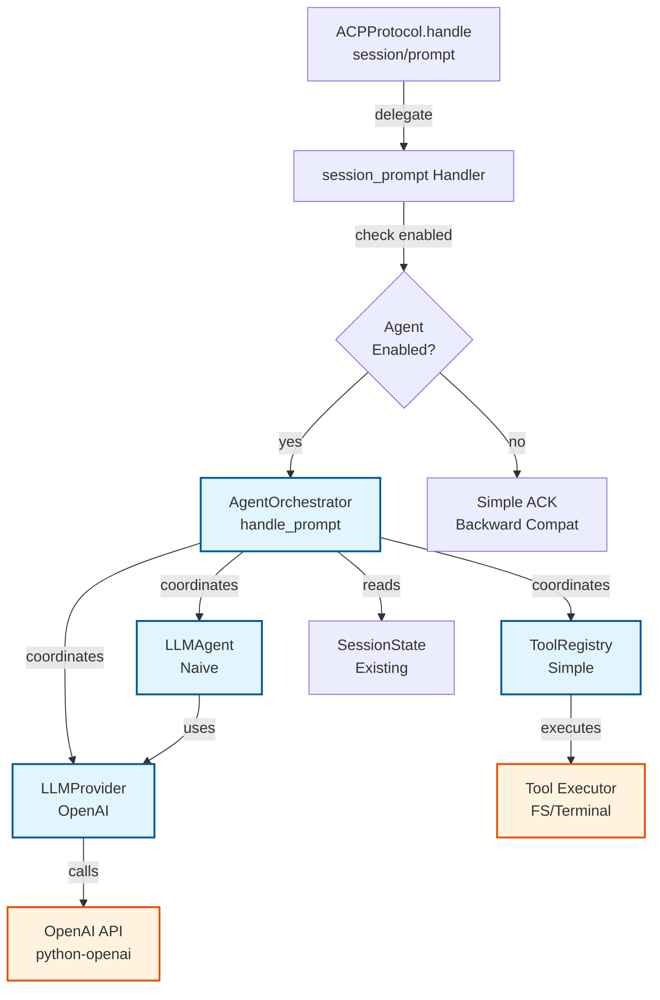
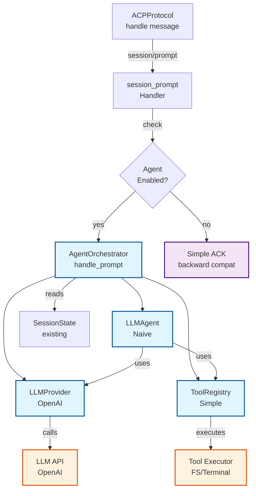
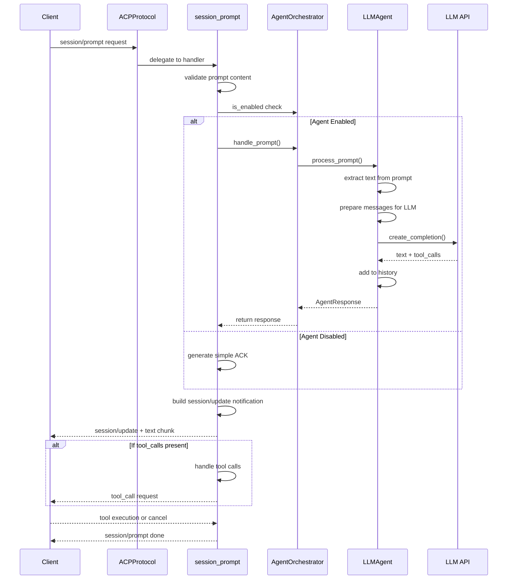
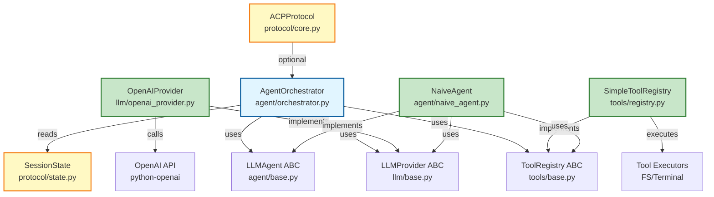
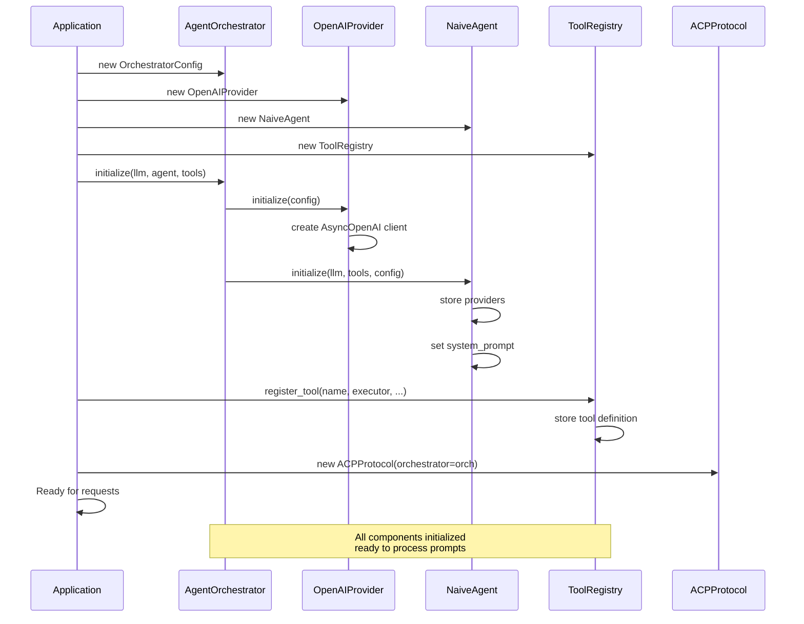
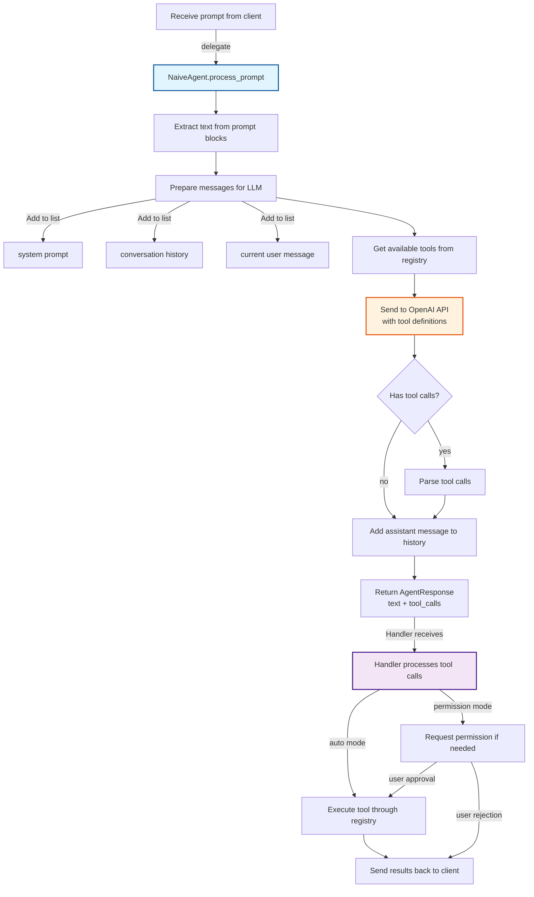

# Наивная архитектура LLM-агента для ACP Server

## Scope наивной реализации

**Важно:** Наивная архитектура описывает **минимальную реализацию** LLM-агента для ACP Server.

### Что включено в наивную реализацию:
- ✅ Базовая интеграция с LLM провайдерами (OpenAI, Mock)
- ✅ Простая обработка prompt turns
- ✅ Управление историей сообщений в памяти
- ✅ Регистрация и выполнение инструментов (tool calls)
- ✅ Интеграция с session/update для отправки tool calls
- ✅ Интеграция с session/request_permission для запроса разрешений
- ✅ Обратная совместимость (opt-in через переменные окружения)

### Что НЕ включено (будет в следующих итерациях):
- ❌ RooCode функции (режимы, TodoManager, SubtaskDelegator)
- ❌ File restrictions и advanced permission system
- ❌ Потоковое обновление ответов (streaming)
- ❌ Retry логика при сбоях API
- ❌ Кэширование LLM ответов
- ❌ Advanced prompt engineering и few-shot примеры
- ❌ Интеграция с agent/plan (план выполнения)

---

## 1. Обзор архитектуры

Данный документ описывает детальную архитектуру наивной реализации LLM-агента для acp-server с минимальной связанностью между компонентами и обеспечением обратной совместимости.

### 1.1 Принципы дизайна

1. **Минимальная связанность** - логика агента изолирована от протокола и транспорта
2. **Наивная реализация** - простая реализация без сложных паттернов, легко заменяемая
3. **Обратная совместимость** - существующий код работает без изменений
4. **Расширяемость** - легко добавлять новые LLM провайдеры и фреймворки
5. **Асинхронность** - полная поддержка asyncio для неблокирующей работы

### 1.2 Структура модулей

```
acp-server/src/acp_server/
├── agent/                         # НОВАЯ ПАПКА - логика агента
│   ├── __init__.py               # Экспорт публичных классов
│   ├── base.py                   # Интерфейсы (ABC)
│   ├── state.py                  # AgentState, AgentContext
│   ├── orchestrator.py           # AgentOrchestrator (точка входа)
│   ├── naive_agent.py            # NaiveAgent (первая реализация)
│   └── config.py                 # Конфигурация агента
├── llm/                           # НОВАЯ ПАПКА - провайдеры LLM
│   ├── __init__.py               # Экспорт публичных классов
│   ├── base.py                   # LLMProvider ABC
│   ├── openai_provider.py        # OpenAI реализация
│   └── mock_provider.py          # Mock для тестов
├── tools/                         # НОВАЯ ПАПКА - инструменты
│   ├── __init__.py               # Экспорт публичных классов
│   ├── base.py                   # ToolDefinition, ToolExecutor ABC
│   ├── registry.py               # ToolRegistry
│   ├── executor.py               # Выполнение инструментов
│   └── builtin_tools.py          # Встроенные ACP инструменты
└── protocol/
    ├── handlers/
    │   └── prompt.py             # МОДИФИЦИРОВАТЬ: добавить orchestrator
    └── core.py                   # МОДИФИЦИРОВАТЬ: инициализация orchestrator
```

---

## 2. Интерфейсы и контракты

### 2.1 LLMProvider - Интерфейс провайдера LLM

Файл: `acp-server/src/acp_server/llm/base.py`

```python
from abc import ABC, abstractmethod
from dataclasses import dataclass
from typing import Any, AsyncIterator

@dataclass
class LLMMessage:
    """Сообщение для отправки в LLM."""
    role: str  # "system", "user", "assistant"
    content: str

@dataclass
class LLMToolCall:
    """Вызов инструмента из LLM."""
    id: str
    name: str
    arguments: dict[str, Any]

@dataclass
class LLMResponse:
    """Ответ от LLM."""
    text: str
    tool_calls: list[LLMToolCall]
    stop_reason: str  # "end_turn", "tool_use", "max_tokens", "error"

class LLMProvider(ABC):
    """Интерфейс для взаимодействия с LLM API.
    
    Провайдер инкапсулирует всю специфику работы с конкретной LLM,
    включая форматирование сообщений, обработку tool calls, retry-логику.
    """

    @abstractmethod
    async def initialize(self, config: dict[str, Any]) -> None:
        """Инициализация провайдера с конфигурацией.
        
        Args:
            config: Словарь с параметрами (api_key, model, temperature, etc.)
        """
        pass

    @abstractmethod
    async def create_completion(
        self,
        messages: list[LLMMessage],
        tools: list[dict[str, Any]] | None = None,
        **kwargs: Any,
    ) -> LLMResponse:
        """Получить завершение от LLM.
        
        Args:
            messages: История сообщений
            tools: Определения доступных инструментов
            **kwargs: Дополнительные параметры (temperature, max_tokens, etc.)
            
        Returns:
            Ответ от LLM с текстом и tool calls
        """
        pass

    @abstractmethod
    async def stream_completion(
        self,
        messages: list[LLMMessage],
        tools: list[dict[str, Any]] | None = None,
        **kwargs: Any,
    ) -> AsyncIterator[LLMResponse]:
        """Потоковое получение ответа от LLM.
        
        Генерирует промежуточные LLMResponse при получении данных.
        """
        pass
```

**Контракт:**
- Все методы асинхронные
- `initialize()` вызывается один раз при создании провайдера
- `create_completion()` блокирует до полного ответа LLM
- `stream_completion()` возвращает async generator для real-time обновлений
- Все параметры LLM (temperature, max_tokens) передаются в kwargs

---

### 2.2 ToolRegistry - Реестр инструментов

Файл: `acp-server/src/acp_server/tools/registry.py`

```python
from abc import ABC, abstractmethod
from dataclasses import dataclass
from typing import Any, Callable

@dataclass
class ToolDefinition:
    """Определение инструмента для LLM."""
    name: str
    description: str
    parameters: dict[str, Any]  # JSON Schema
    kind: str  # "terminal", "filesystem", "other"
    requires_permission: bool = True

@dataclass
class ToolExecutionResult:
    """Результат выполнения инструмента."""
    success: bool
    output: str | None = None
    error: str | None = None

class ToolRegistry(ABC):
    """Реестр инструментов с механизмом выполнения.
    
    Отвечает за:
    - Регистрацию инструментов
    - Управление доступом (с учетом прав)
    - Выполнение инструментов
    - Преобразование в LLM tool definitions
    """

    @abstractmethod
    def register_tool(
        self,
        name: str,
        description: str,
        parameters: dict[str, Any],
        kind: str,
        executor: Callable,
        requires_permission: bool = True,
    ) -> None:
        """Регистрация инструмента.
        
        Args:
            name: Уникальное имя инструмента
            description: Человеческое описание
            parameters: JSON Schema параметров
            kind: Категория инструмента (terminal, filesystem, other)
            executor: Async callable для выполнения
            requires_permission: Требуется ли разрешение пользователя
        """
        pass

    @abstractmethod
    def get_available_tools(
        self,
        session_id: str,
        include_permission_required: bool = True,
    ) -> list[ToolDefinition]:
        """Получить доступные инструменты для сессии.
        
        Учитывает права доступа сессии и конфигурацию.
        """
        pass

    @abstractmethod
    def to_llm_tools(self, tools: list[ToolDefinition]) -> list[dict[str, Any]]:
        """Преобразовать определения инструментов для отправки в LLM.
        
        Конкретный формат зависит от LLM провайдера.
        """
        pass

    @abstractmethod
    async def execute_tool(
        self,
        session_id: str,
        tool_name: str,
        arguments: dict[str, Any],
    ) -> ToolExecutionResult:
        """Выполнить инструмент.
        
        Проверяет разрешения, выполняет инструмент, возвращает результат.
        """
        pass
```

**Контракт:**
- Инструменты регистрируются один раз при инициализации
- `get_available_tools()` возвращает список на основе текущих прав сессии
- `to_llm_tools()` преобразует в формат конкретного LLM
- `execute_tool()` - точка интеграции с Permission System

---

### 2.3 LLMAgent - Интерфейс агента

Файл: `acp-server/src/acp_server/agent/base.py`

```python
from abc import ABC, abstractmethod
from dataclasses import dataclass
from typing import Any

@dataclass
class AgentContext:
    """Контекст выполнения агента для одного prompt turn."""
    session_id: str
    prompt: list[dict[str, Any]]  # Содержимое prompt от пользователя
    conversation_history: list[LLMMessage]  # История сообщений для LLM
    available_tools: list[ToolDefinition]  # Инструменты для этого turn
    config: dict[str, Any]  # SessionState.config_values

@dataclass
class AgentResponse:
    """Ответ агента после обработки prompt."""
    text: str  # Текстовый ответ
    tool_calls: list[LLMToolCall]  # Инструменты для вызова
    stop_reason: str  # "end_turn", "tool_use", "max_tokens", "error"
    metadata: dict[str, Any] = None  # Доп. информация

class LLMAgent(ABC):
    """Базовый интерфейс для LLM-агентов.
    
    Агент отвечает за:
    - Обработку prompt turns
    - Управление историей сообщений
    - Интеграцию с LLM провайдером
    - Координацию выполнения инструментов
    """

    @abstractmethod
    async def initialize(
        self,
        llm_provider: LLMProvider,
        tool_registry: ToolRegistry,
        config: dict[str, Any],
    ) -> None:
        """Инициализация агента.
        
        Args:
            llm_provider: Провайдер LLM
            tool_registry: Реестр инструментов
            config: Конфигурация агента (model, api_key, temperature, etc.)
        """
        pass

    @abstractmethod
    async def process_prompt(self, context: AgentContext) -> AgentResponse:
        """Обработать prompt и вернуть ответ.
        
        Основной метод для обработки пользовательского запроса.
        Агент должен:
        1. Подготовить сообщения для LLM
        2. Отправить в LLM с инструментами
        3. Обработать ответ (text + tool_calls)
        4. Вернуть AgentResponse
        
        Args:
            context: Контекст выполнения с history, tools, config
            
        Returns:
            AgentResponse с текстом, tool calls и stop reason
        """
        pass

    @abstractmethod
    async def cancel_prompt(self, session_id: str) -> None:
        """Отменить текущую обработку prompt.
        
        Вызывается при получении session/cancel.
        """
        pass

    @abstractmethod
    def add_to_history(
        self,
        session_id: str,
        role: str,
        content: str,
    ) -> None:
        """Добавить сообщение в историю сессии.
        
        Неблокирующий метод для добавления в историю.
        """
        pass

    @abstractmethod
    def get_session_history(self, session_id: str) -> list[LLMMessage]:
        """Получить историю сообщений для сессии."""
        pass

    @abstractmethod
    async def end_session(self, session_id: str) -> None:
        """Завершить сессию и освободить ресурсы."""
        pass
```

**Контракт:**
- `initialize()` вызывается один раз при создании агента
- `process_prompt()` - основной метод, может быть вызван многократно
- `add_to_history()` - быстрое добавление в историю
- `get_session_history()` - получить историю в формате LLM
- `cancel_prompt()` - graceful shutdown текущего обработки
- Все методы асинхронные кроме `add_to_history()`

---

### 2.4 AgentOrchestrator - Оркестратор выполнения

Файл: `acp-server/src/acp_server/agent/orchestrator.py`

```python
from dataclasses import dataclass
from typing import Any

@dataclass
class OrchestratorConfig:
    """Конфигурация оркестратора."""
    enabled: bool = False  # Включить ли использование агента
    llm_provider_class: str = "openai"  # Класс провайдера
    agent_class: str = "naive"  # Класс агента
    llm_config: dict[str, Any] = None  # Конфиг для LLM провайдера

class AgentOrchestrator:
    """Оркестратор интеграции LLM-агента с ACP протоколом.
    
    Точка интеграции между:
    - ACPProtocol (session_prompt)
    - LLMAgent (обработка)
    - ToolRegistry (выполнение инструментов)
    - SessionState (хранение состояния)
    
    Отвечает за:
    - Инициализацию провайдера и агента
    - Преобразование ACP контекста в AgentContext
    - Координацию обработки prompt turns
    - Управление историей и состоянием
    """

    def __init__(self, config: OrchestratorConfig):
        """Инициализация оркестратора."""
        self.config = config
        self._llm_provider: LLMProvider | None = None
        self._agent: LLMAgent | None = None
        self._tool_registry: ToolRegistry | None = None

    async def initialize(
        self,
        llm_provider: LLMProvider,
        agent: LLMAgent,
        tool_registry: ToolRegistry,
    ) -> None:
        """Инициализировать оркестратор.
        
        Args:
            llm_provider: Провайдер LLM
            agent: Экземпляр агента
            tool_registry: Реестр инструментов
        """
        self._llm_provider = llm_provider
        self._agent = agent
        self._tool_registry = tool_registry
        
        # Инициализировать провайдер и агент
        await self._llm_provider.initialize(self.config.llm_config or {})
        await self._agent.initialize(
            self._llm_provider,
            self._tool_registry,
            self.config.llm_config or {},
        )

    async def handle_prompt(
        self,
        session_state: SessionState,
        prompt_content: list[dict[str, Any]],
        session_config: dict[str, Any],
    ) -> AgentResponse:
        """Обработать prompt turn через агента.
        
        Преобразует ACP контекст в AgentContext, делегирует агенту,
        возвращает AgentResponse.
        
        Args:
            session_state: Состояние сессии из SessionState
            prompt_content: Содержимое prompt от пользователя
            session_config: Конфигурация сессии (mode, llm_model, etc.)
            
        Returns:
            AgentResponse с текстом, tool calls, stop reason
        """
        pass

    async def handle_tool_execution(
        self,
        session_id: str,
        tool_call: LLMToolCall,
    ) -> ToolExecutionResult:
        """Выполнить tool call через registry.
        
        Точка интеграции с Permission System.
        """
        pass

    async def cancel_prompt(self, session_id: str) -> None:
        """Отменить текущую обработку."""
        pass

    def is_enabled(self) -> bool:
        """Проверить, включен ли оркестратор."""
        return self.config.enabled
```

**Контракт:**
- Опциональный компонент (может быть disabled)
- `initialize()` вызывается один раз при создании
- `handle_prompt()` - главная точка интеграции с `session_prompt()`
- Инкапсулирует создание и управление LLMProvider, Agent, ToolRegistry

---

## 3. Наивная реализация (NaiveAgent)

### 3.1 Концепция

`NaiveAgent` - простая, прямолинейная реализация `LLMAgent` без сложных паттернов.

**Характеристики:**
- Хранит историю сообщений в памяти (dict по session_id)
- Прямой вызов LLM API через провайдер
- Простая обработка tool calls согласно ACP протоколу
- Минимум переиспользуемого кода
- Легко понять и модифицировать

### 3.1.1 Правильная модель выполнения tool calls (согласно ACP)

**Ключевая концепция:** Tool calls **выполняются на Agent (сервере)**, но Agent может использовать **Client RPC методы** (fs/*, terminal/*) для доступа к ресурсам клиента.

**Поток выполнения:**

1. **LLM генерирует tool calls** → Agent получает их в ответе
2. **Agent отправляет tool call клиенту** → через `session/update` (sessionUpdate: "tool_call")
3. **Agent может запросить разрешение** → через `session/request_permission` если нужно
4. **Agent выполняет tool** → используя Client RPC методы или локальную логику
5. **Agent отправляет результат клиенту** → через `session/update` (sessionUpdate: "tool_call_update")

### 3.2 Структура NaiveAgent

Файл: `acp-server/src/acp_server/agent/naive_agent.py`

```python
from typing import Any
from .base import LLMAgent, AgentContext, AgentResponse, LLMMessage, LLMToolCall
from ..llm.base import LLMProvider
from ..tools.registry import ToolRegistry, ToolDefinition

class NaiveAgent(LLMAgent):
    """Наивная реализация LLM-агента.
    
    Основные особенности:
    - История сообщений хранится в памяти (dict[session_id -> list])
    - Прямой однопроходный вызов LLM
    - Простая обработка tool calls без сложной логики
    - Нет retry-логики, кэширования, потокового обновления
    """

    def __init__(self):
        """Инициализация пустого агента."""
        self._llm_provider: LLMProvider | None = None
        self._tool_registry: ToolRegistry | None = None
        self._conversation_history: dict[str, list[LLMMessage]] = {}
        self._system_prompt: str = ""

    async def initialize(
        self,
        llm_provider: LLMProvider,
        tool_registry: ToolRegistry,
        config: dict[str, Any],
    ) -> None:
        """Инициализация агента.
        
        Args:
            llm_provider: Провайдер LLM
            tool_registry: Реестр инструментов
            config: Конфиг с параметрами (system_prompt, etc.)
        """
        self._llm_provider = llm_provider
        self._tool_registry = tool_registry
        self._system_prompt = config.get(
            "system_prompt",
            "You are a helpful assistant. Use provided tools when necessary.",
        )

    async def process_prompt(self, context: AgentContext) -> AgentResponse:
        """Обработать prompt и вернуть ответ.
        
        Алгоритм:
        1. Преобразовать ACP prompt в LLM message (user role)
        2. Получить доступные инструменты
        3. Отправить в LLM (system + history + new message + tools)
        4. Распарсить ответ (text + tool_calls)
        5. Добавить assistant message в историю
        6. Вернуть AgentResponse
        """
        session_id = context.session_id
        
        # 1. Преобразовать prompt в текст
        prompt_text = self._extract_text_from_prompt(context.prompt)
        
        # 2. Подготовить сообщения для LLM
        messages = self._prepare_messages(session_id, prompt_text, context)
        
        # 3. Получить инструменты в формате LLM
        llm_tools = self._tool_registry.to_llm_tools(context.available_tools)
        
        # 4. Отправить в LLM
        llm_response = await self._llm_provider.create_completion(
            messages=messages,
            tools=llm_tools if llm_tools else None,
            temperature=float(context.config.get("llm_temperature", 0.7)),
            max_tokens=int(context.config.get("max_tokens", 2000)),
        )
        
        # 5. Добавить assistant message в историю
        self.add_to_history(session_id, "assistant", llm_response.text)
        
        # 6. Вернуть результат
        return AgentResponse(
            text=llm_response.text,
            tool_calls=llm_response.tool_calls,
            stop_reason=llm_response.stop_reason,
            metadata={"model": context.config.get("llm_model", "gpt-4")},
        )

    def _extract_text_from_prompt(self, prompt: list[dict[str, Any]]) -> str:
        """Извлечь текст из ACP prompt блоков."""
        texts = []
        for block in prompt:
            if isinstance(block, dict) and block.get("type") == "text":
                texts.append(block.get("text", ""))
        return "\n".join(texts) if texts else "Please help."

    def _prepare_messages(
        self,
        session_id: str,
        prompt_text: str,
        context: AgentContext,
    ) -> list[LLMMessage]:
        """Подготовить список сообщений для LLM."""
        messages = []
        
        # Системный промпт
        messages.append(LLMMessage(role="system", content=self._system_prompt))
        
        # История (если есть)
        if session_id in self._conversation_history:
            messages.extend(self._conversation_history[session_id])
        
        # Новое сообщение от пользователя
        messages.append(LLMMessage(role="user", content=prompt_text))
        
        return messages

    def add_to_history(
        self,
        session_id: str,
        role: str,
        content: str,
    ) -> None:
        """Добавить сообщение в историю (неблокирующее)."""
        if session_id not in self._conversation_history:
            self._conversation_history[session_id] = []
        self._conversation_history[session_id].append(
            LLMMessage(role=role, content=content)
        )

    def get_session_history(self, session_id: str) -> list[LLMMessage]:
        """Получить историю для сессии."""
        return self._conversation_history.get(session_id, [])

    async def cancel_prompt(self, session_id: str) -> None:
        """Отменить обработку (NOP для наивной реализации)."""
        pass

    async def end_session(self, session_id: str) -> None:
        """Завершить сессию и освободить память."""
        if session_id in self._conversation_history:
            del self._conversation_history[session_id]
```

**Особенности наивной реализации:**
- Стателесс в смысле обработки (нет промежуточных состояний)
- История хранится в памяти (не сохраняется при перезагрузке)
- Нет потокового обновления UI
- Нет retry-логики
- Простая в отладке и модификации

---

## 4. OpenAI LLM Provider

Файл: `acp-server/src/acp_server/llm/openai_provider.py`

**Зависимость:** `python-openai` (добавить в `pyproject.toml`)

```python
import json
from typing import Any, AsyncIterator
from openai import AsyncOpenAI
from .base import LLMProvider, LLMMessage, LLMResponse, LLMToolCall

class OpenAIProvider(LLMProvider):
    """Провайдер для OpenAI API (GPT-4, GPT-3.5-turbo, и т.д.).
    
    Использует python-openai async клиент для взаимодействия с OpenAI API:
    - Форматирование сообщений в формат OpenAI
    - Преобразование tool definitions в OpenAI function calls
    - Парсинг ответов и tool calls
    - Поддержка потокового ответа
    """

    def __init__(self):
        """Инициализация пустого провайдера."""
        self._client: AsyncOpenAI | None = None
        self._model: str = "gpt-4"

    async def initialize(self, config: dict[str, Any]) -> None:
        """Инициализировать провайдер с API ключом и моделью.
        
        Args:
            config: Словарь с параметрами:
                - api_key: OpenAI API ключ (обязателен)
                - model: Модель (по умолчанию gpt-4)
                - base_url: Базовый URL API (опционально)
                - timeout: Таймаут запроса (опционально)
        """
        api_key = config.get("api_key")
        if not api_key:
            raise ValueError("api_key is required in OpenAI config")
        
        self._model = config.get("model", "gpt-4")
        
        # Инициализировать AsyncOpenAI клиент
        self._client = AsyncOpenAI(
            api_key=api_key,
            base_url=config.get("base_url"),  # Если None, используется по умолчанию
            timeout=config.get("timeout", 30.0),
        )

    async def create_completion(
        self,
        messages: list[LLMMessage],
        tools: list[dict[str, Any]] | None = None,
        **kwargs: Any,
    ) -> LLMResponse:
        """Получить завершение от OpenAI используя python-openai.
        
        Args:
            messages: История сообщений в формате LLMMessage
            tools: Tool definitions для OpenAI function_call
            **kwargs: Параметры LLM (temperature, max_tokens, top_p, etc.)
        
        Returns:
            LLMResponse с текстом, tool calls и stop reason
        """
        if not self._client:
            raise RuntimeError("Provider not initialized")
        
        openai_messages = self._format_messages(messages)
        openai_tools = self._format_tools(tools) if tools else None
        
        # Вызов OpenAI API через python-openai
        response = await self._client.chat.completions.create(
            model=self._model,
            messages=openai_messages,
            tools=openai_tools,
            temperature=float(kwargs.get("temperature", 0.7)),
            max_tokens=int(kwargs.get("max_tokens", 2000)),
            top_p=float(kwargs.get("top_p", 1.0)),
        )
        
        # Парсинг ответа от OpenAI
        return self._parse_response(response)

    async def stream_completion(
        self,
        messages: list[LLMMessage],
        tools: list[dict[str, Any]] | None = None,
        **kwargs: Any,
    ) -> AsyncIterator[LLMResponse]:
        """Потоковое получение ответа от OpenAI.
        
        Генерирует промежуточные LLMResponse при получении данных.
        """
        if not self._client:
            raise RuntimeError("Provider not initialized")
        
        openai_messages = self._format_messages(messages)
        openai_tools = self._format_tools(tools) if tools else None
        
        # Потоковый вызов OpenAI API через python-openai
        async with await self._client.chat.completions.create(
            model=self._model,
            messages=openai_messages,
            tools=openai_tools,
            stream=True,
            temperature=float(kwargs.get("temperature", 0.7)),
            max_tokens=int(kwargs.get("max_tokens", 2000)),
        ) as stream:
            accumulated_text = ""
            accumulated_tool_calls = []
            
            async for chunk in stream:
                delta = chunk.choices[0].delta
                
                # Накопить текст если есть
                if delta.content:
                    accumulated_text += delta.content
                
                # Накопить tool calls если есть
                if delta.tool_calls:
                    for tool_call in delta.tool_calls:
                        accumulated_tool_calls.append(tool_call)
                
                # Генерировать промежуточный ответ
                yield LLMResponse(
                    text=accumulated_text,
                    tool_calls=self._parse_tool_calls(accumulated_tool_calls),
                    stop_reason="streaming",
                )

    def _format_messages(self, messages: list[LLMMessage]) -> list[dict[str, str]]:
        """Преобразовать LLMMessage в формат OpenAI.
        
        OpenAI ожидает список вида: [{"role": "system", "content": "..."}]
        """
        return [{"role": msg.role, "content": msg.content} for msg in messages]

    def _format_tools(self, tools: list[dict[str, Any]]) -> list[dict[str, Any]]:
        """Преобразовать tool definitions в формат OpenAI function_call.
        
        OpenAI format:
            {"type": "function", "function": {"name": "...", "parameters": {...}}}
        """
        if not tools:
            return None
        
        return [
            {
                "type": "function",
                "function": {
                    "name": tool["name"],
                    "description": tool.get("description", ""),
                    "parameters": tool.get("parameters", {"type": "object"}),
                },
            }
            for tool in tools
        ]

    def _parse_response(self, response: Any) -> LLMResponse:
        """Распарсить ответ от OpenAI (completion object).
        
        Args:
            response: ChatCompletion object от python-openai
        
        Returns:
            LLMResponse с извлеченным текстом, tool calls и stop reason
        """
        text = ""
        tool_calls = []
        stop_reason = response.choices[0].finish_reason or "unknown"
        
        for choice in response.choices:
            message = choice.message
            
            # Извлечь текст если есть
            if message.content:
                text += message.content
            
            # Извлечь tool calls если есть
            if message.tool_calls:
                tool_calls.extend(message.tool_calls)
        
        return LLMResponse(
            text=text.strip(),
            tool_calls=self._parse_tool_calls(tool_calls),
            stop_reason=self._map_stop_reason(stop_reason),
        )

    def _parse_tool_calls(
        self,
        openai_tool_calls: list[Any],
    ) -> list[LLMToolCall]:
        """Преобразовать tool calls из OpenAI формата в LLMToolCall.
        
        Args:
            openai_tool_calls: Список ToolCall объектов от OpenAI
        
        Returns:
            Список LLMToolCall
        """
        result = []
        for tc in openai_tool_calls:
            if tc.type == "function":
                import json as json_lib
                try:
                    args = json_lib.loads(tc.function.arguments)
                except (json_lib.JSONDecodeError, AttributeError):
                    args = {}
                
                result.append(
                    LLMToolCall(
                        id=tc.id,
                        name=tc.function.name,
                        arguments=args,
                    )
                )
        return result

    def _map_stop_reason(self, openai_reason: str) -> str:
        """Преобразовать OpenAI stop_reason в стандартный формат.
        
        OpenAI: "stop", "tool_calls", "length", "content_filter", etc.
        Стандартный: "end_turn", "tool_use", "max_tokens", "error"
        """
        mapping = {
            "stop": "end_turn",
            "tool_calls": "tool_use",
            "length": "max_tokens",
            "content_filter": "error",
        }
        return mapping.get(openai_reason, "unknown")
```

**Особенности реализации:**
- Использует `python-openai` AsyncOpenAI для асинхронных вызовов
- Поддерживает оба режима: синхронное завершение и потоковый ответ
- Форматирует в специфичный для OpenAI format (function_call)
- Парсит tool calls из OpenAI ToolCall объектов
- Преобразует OpenAI stop_reason в стандартный формат
- Обработка JSON парсинга при наличии tool calls
- Может быть легко адаптирован для других провайдеров (Claude, Gemini)

---

## 5. ToolRegistry реализация

Файл: `acp-server/src/acp_server/tools/registry.py`

```python
class SimpleToolRegistry(ToolRegistry):
    """Простая реализация реестра инструментов.
    
    Хранит инструменты в памяти, управляет доступом на основе
    SessionState.runtime_capabilities и permission_policy.
    """

    def __init__(self):
        """Инициализация пустого реестра."""
        self._tools: dict[str, tuple[ToolDefinition, Callable]] = {}

    def register_tool(
        self,
        name: str,
        description: str,
        parameters: dict[str, Any],
        kind: str,
        executor: Callable,
        requires_permission: bool = True,
    ) -> None:
        """Регистрация инструмента."""
        definition = ToolDefinition(
            name=name,
            description=description,
            parameters=parameters,
            kind=kind,
            requires_permission=requires_permission,
        )
        self._tools[name] = (definition, executor)

    def get_available_tools(
        self,
        session_id: str,
        include_permission_required: bool = True,
    ) -> list[ToolDefinition]:
        """Получить доступные инструменты для сессии."""
        # Фильтровать на основе runtime_capabilities и permission_policy
        available = []
        for definition, _ in self._tools.values():
            if self._is_tool_available(definition, include_permission_required):
                available.append(definition)
        return available

    def to_llm_tools(self, tools: list[ToolDefinition]) -> list[dict[str, Any]]:
        """Преобразовать в LLM format."""
        return [
            {
                "name": tool.name,
                "description": tool.description,
                "parameters": tool.parameters,
            }
            for tool in tools
        ]

    async def execute_tool(
        self,
        session_id: str,
        tool_name: str,
        arguments: dict[str, Any],
    ) -> ToolExecutionResult:
        """Выполнить инструмент."""
        if tool_name not in self._tools:
            return ToolExecutionResult(
                success=False,
                error=f"Tool not found: {tool_name}",
            )
        
        definition, executor = self._tools[tool_name]
        
        try:
            # Выполнить executor
            result = await executor(arguments)
            return ToolExecutionResult(success=True, output=result)
        except Exception as e:
            return ToolExecutionResult(success=False, error=str(e))

    def _is_tool_available(
        self,
        definition: ToolDefinition,
        include_permission_required: bool,
    ) -> bool:
        """Проверить, доступен ли инструмент."""
        # Логика фильтрации на основе runtime_capabilities
        return True  # Упрощено для наивной реализации
```

---

## 6. Точки интеграции с существующим кодом

### 6.1 Модификация ACPProtocol

Файл: `acp-server/src/acp_server/protocol/core.py`

**Добавить в `__init__`:**

```python
def __init__(
    self,
    *,
    require_auth: bool = False,
    auth_api_key: str | None = None,
    storage: SessionStorage | None = None,
    agent_orchestrator: AgentOrchestrator | None = None,  # НОВОЕ
) -> None:
    # ... существующий код ...
    
    # НОВОЕ: Оркестратор агента (опциональный)
    self._agent_orchestrator = agent_orchestrator
```

### 6.2 Модификация session_prompt() - правильная обработка tool calls

Файл: `acp-server/src/acp_server/protocol/handlers/prompt.py`

**Согласно ACP протоколу ([`08-Tool Calls.md`](doc/Agent%20Client%20Protocol/protocol/08-Tool%20Calls.md)):**

Правильный flow обработки tool calls:

```python
# Если агент включен, делегировать ему
if protocol._agent_orchestrator and protocol._agent_orchestrator.is_enabled():
    # Получить ответ от агента (включает text + tool_calls)
    agent_response = await protocol._agent_orchestrator.handle_prompt(
        session_state=session,
        prompt_content=prompt,
        session_config=session.config_values,
    )
    
    # 1. Отправить текстовый ответ клиенту
    if agent_response.text:
        update = ACPMessage.notification(
            "session/update",
            {
                "sessionId": session_id,
                "update": {
                    "sessionUpdate": "agent_message_chunk",
                    "content": {
                        "type": "text",
                        "text": agent_response.text,
                    },
                },
            },
        )
        notifications.append(update)
    
    # 2. Обработать tool calls согласно ACP протоколу
    if agent_response.tool_calls:
        for tool_call in agent_response.tool_calls:
            # Отправить tool call клиенту для отображения прогресса
            await protocol.notify_tool_call(
                session_id=session_id,
                tool_call_id=tool_call.id,
                tool_name=tool_call.name,
                status="pending",
                raw_input=tool_call.arguments,
            )
            
            # Запросить разрешение если требуется
            if requires_permission(tool_call.name):
                permission = await protocol.request_permission(
                    session_id=session_id,
                    tool_call_id=tool_call.id,
                    tool_name=tool_call.name,
                )
                if permission.outcome != "allow":
                    # Отправить отказ клиенту
                    await protocol.notify_tool_call_update(
                        session_id=session_id,
                        tool_call_id=tool_call.id,
                        status="rejected",
                    )
                    continue
            
            # Выполнить tool через orchestrator
            result = await protocol._agent_orchestrator.handle_tool_execution(
                session_id=session_id,
                tool_name=tool_call.name,
                arguments=tool_call.arguments,
            )
            
            # Отправить результат клиенту
            await protocol.notify_tool_call_update(
                session_id=session_id,
                tool_call_id=tool_call.id,
                status="completed",
                content=[{"type": "text", "text": result.get("output", "")}],
            )
else:
    # Обратная совместимость: простой ACK
    agent_text = f"ACK: {text_preview}"
    update = ACPMessage.notification(
        "session/update",
        {
            "sessionId": session_id,
            "update": {
                "sessionUpdate": "agent_message_chunk",
                "content": {
                    "type": "text",
                    "text": agent_text,
                },
            },
        },
    )
    notifications.append(update)
```

**Новые методы в ACPProtocol:**

```python
async def notify_tool_call(
    self,
    session_id: str,
    tool_call_id: str,
    tool_name: str,
    status: str = "pending",
    raw_input: dict | None = None,
) -> None:
    """Отправить tool call клиенту через session/update.
    
    Согласно ACP протоколу, это уведомляет клиента о том, что 
    сервер начинает выполнять инструмент.
    """
    update = {
        "jsonrpc": "2.0",
        "method": "session/update",
        "params": {
            "sessionId": session_id,
            "update": {
                "sessionUpdate": "tool_call",
                "toolCallId": tool_call_id,
                "title": tool_name,
                "kind": self._get_tool_kind(tool_name),
                "status": status,
                "rawInput": raw_input or {},
            },
        },
    }
    await self.send_notification(session_id, update)

async def request_permission(
    self,
    session_id: str,
    tool_call_id: str,
    tool_name: str,
) -> PermissionResponse:
    """Запросить разрешение на выполнение инструмента.
    
    Согласно ACP протоколу, агент может запросить разрешение пользователя
    перед выполнением опасного инструмента.
    """
    request_msg = {
        "jsonrpc": "2.0",
        "id": self._next_request_id(),
        "method": "session/request_permission",
        "params": {
            "sessionId": session_id,
            "toolCall": {
                "toolCallId": tool_call_id,
                "name": tool_name,
            },
            "options": [
                {
                    "optionId": "allow-once",
                    "name": "Allow once",
                    "kind": "allow_once",
                },
                {
                    "optionId": "reject-once",
                    "name": "Reject",
                    "kind": "reject_once",
                },
            ],
        },
    }
    response = await self.send_request(session_id, request_msg)
    return PermissionResponse(
        outcome="allow" if response.get("optionId") == "allow-once" else "reject"
    )

async def notify_tool_call_update(
    self,
    session_id: str,
    tool_call_id: str,
    status: str,
    content: list | None = None,
) -> None:
    """Отправить обновление статуса выполнения tool call.
    
    Согласно ACP протоколу, это уведомляет клиента о прогрессе или 
    завершении выполнения инструмента.
    """
    update = {
        "jsonrpc": "2.0",
        "method": "session/update",
        "params": {
            "sessionId": session_id,
            "update": {
                "sessionUpdate": "tool_call_update",
                "toolCallId": tool_call_id,
                "status": status,
                "content": content or [],
            },
        },
    }
    await self.send_notification(session_id, update)
```

**Ключевые моменты:**
- Проверка `is_enabled()` - агент опциональный
- Асинхронный вызов `handle_prompt()` 
- Отправка tool calls клиенту через `session/update`
- Запрос разрешений через `session/request_permission`
- Обработка результатов tool calls
- Fallback на простой ACK если агент disabled
- Интеграция с Permission System для опасных операций

---

## 7. Точки расширения

### 7.1 Добавление нового LLM провайдера

1. Создать класс, наследующий `LLMProvider`
2. Реализовать:
   - `initialize(config)` - инициализация с API ключом
   - `create_completion()` - синхронный вызов
   - `stream_completion()` - потоковый вызов
3. Зарегистрировать в фабрике провайдеров (в `llm/__init__.py`)

**Пример для Claude:**

```python
class ClaudeProvider(LLMProvider):
    async def initialize(self, config):
        self._api_key = config.get("api_key")
    
    async def create_completion(self, messages, tools=None, **kwargs):
        # Специфичный для Claude API код
        pass
```

### 7.2 Добавление нового агентного фреймворка

1. Создать класс, наследующий `LLMAgent`
2. Реализовать методы интерфейса
3. Использовать `LLMProvider` и `ToolRegistry` для работы

**Пример для LangChain:**

```python
class LangChainAgent(LLMAgent):
    async def initialize(self, llm_provider, tool_registry, config):
        # Инициализировать LangChain agent
        self.chain = ...
    
    async def process_prompt(self, context):
        # Использовать LangChain для обработки
        pass
```

### 7.3 Расширение ToolRegistry

1. Наследовать `ToolRegistry`
2. Переопределить `get_available_tools()` для специальной логики фильтрации
3. Переопределить `execute_tool()` для специальной логики выполнения

**Пример с фильтрацией по ролям:**

```python
class RoleBasedToolRegistry(ToolRegistry):
    async def get_available_tools(self, session_id, ...):
        user_role = get_user_role(session_id)
        tools = super().get_available_tools(session_id, ...)
        return [t for t in tools if self._has_permission(user_role, t.name)]
```

---

## 8. Диаграммы архитектуры

### 8.1 Диаграмма компонентов





ASCII диаграмма (deprecated):
```
┌─────────────────────────────────────────────────────────────┐
│                    ACP Protocol Layer                        │
│  ACPProtocol.handle(message) -> ProtocolOutcome             │
└──────────────────┬──────────────────────────────────────────┘
                   │
                   │ session/prompt
                   ↓
┌─────────────────────────────────────────────────────────────┐
│            Handler Layer (prompt.py)                         │
│  session_prompt(...) -> ProtocolOutcome                     │
└──────────────────┬──────────────────────────────────────────┘
                   │
      ┌────────────┴────────────┐
      │ (опциональное)          │
      ↓                         ↓
   [ENABLED]              [DISABLED]
      │                       │
      ↓                       ↓
┌─────────────────┐    ┌────────────────┐
│ AgentOrchestrator│    │ Simple ACK     │
│ .handle_prompt()│    │ (backward compat)
└─────────┬───────┘    └────────────────┘
          │
          ├──────────────┬────────────────┬──────────────┐
          ↓              ↓                ↓              ↓
     ┌─────────┐  ┌────────────┐  ┌────────────┐  ┌─────────────┐
     │LLMAgent │  │LLMProvider │  │ToolRegistry│  │SessionState │
     │(Naive)  │  │(OpenAI)    │  │(Simple)    │  │ (existing)  │
     └────┬────┘  └────────────┘  └────────────┘  └─────────────┘
          │
          └─────────────┬──────────────┐
                        ↓              ↓
                   ┌──────────┐   ┌──────────┐
                   │LLM API   │   │Tool Exec │
                   │(OpenAI)  │   │(FS/Term) │
                   └──────────┘   └──────────┘
```

### 8.2 Диаграмма последовательности (Prompt Turn с агентом)



### 8.3 Диаграмма зависимостей



### 8.4 Диаграмма инициализации компонентов



### 8.5 Диаграмма обработки prompt с tool calls



---

## 9. Обратная совместимость

### 9.1 Механизм opt-in

Агент включается **только** если:

1. `AgentOrchestrator` передан в конструктор `ACPProtocol`
2. `AgentOrchestrator.config.enabled == True`

**Если оба условия не выполнены → используется текущий ACK-ответ**

### 9.2 Гарантии

- ✅ Существующие клиенты работают без изменений
- ✅ Нет обязательных зависимостей на OpenAI API
- ✅ Нет breaking changes в public интерфейсах
- ✅ SessionState не изменяется (только расширяется)
- ✅ Все новые компоненты в отдельных директориях

### 9.3 Пример инициализации

```python
# Без агента (текущее поведение)
protocol = ACPProtocol()
# → session/prompt возвращает простой ACK

# С агентом (новое поведение)
from acp_server.agent import AgentOrchestrator, NaiveAgent
from acp_server.llm import OpenAIProvider
from acp_server.tools import SimpleToolRegistry

orchestrator = AgentOrchestrator(
    config=OrchestratorConfig(
        enabled=True,
        llm_config={"api_key": "...", "model": "gpt-4"},
    )
)
protocol = ACPProtocol(agent_orchestrator=orchestrator)
# → session/prompt делегирует NaiveAgent
```

---

## 10. План реализации

### Фаза 1: Интерфейсы и базовые компоненты
- [ ] Создать `agent/base.py` с ABC для LLMAgent
- [ ] Создать `llm/base.py` с ABC для LLMProvider
- [ ] Создать `tools/base.py` с ABC для ToolRegistry
- [ ] Создать `agent/state.py` с AgentContext, AgentResponse

### Фаза 2: Наивная реализация
- [ ] Создать `agent/naive_agent.py` (простая реализация)
- [ ] Создать `llm/mock_provider.py` (для тестов)
- [ ] Создать `tools/registry.py` (простой реестр)

### Фаза 3: OpenAI интеграция
- [ ] Создать `llm/openai_provider.py`
- [ ] Добавить зависимость на openai package (опционально)
- [ ] Реализовать форматирование и парсинг

### Фаза 4: Оркестратор и интеграция
- [ ] Создать `agent/orchestrator.py`
- [ ] Модифицировать `protocol/core.py` (принять orchestrator)
- [ ] Модифицировать `protocol/handlers/prompt.py` (делегирование)
- [ ] Написать интеграционные тесты

### Фаза 5: Документация и полировка
- [ ] Написать docstrings для всех публичных методов
- [ ] Создать примеры использования
- [ ] Написать тесты
- [ ] Обновить README

---

## 10.5 Добавление зависимости python-openai

Файл: `acp-server/pyproject.toml`

**Обновить секцию dependencies:**

```toml
[project]
dependencies = [
  "aiohttp>=3.12.15",
  "pydantic>=2.11.0",
  "structlog>=24.1.0",
  "aiofiles>=24.1.0",
  "openai>=1.50.0",  # НОВОЕ - для LLM интеграции
]
```

Обоснование:
- `openai>=1.50.0` - требует Python 3.7+, полностью совместима с 3.12+
- Библиотека предоставляет AsyncOpenAI для асинхронных запросов
- Активно поддерживается OpenAI, регулярные обновления
- Альтернатива: можно использовать `aiohttp` напрямую, но `python-openai` проще и безопаснее

---

## 11. Конфигурация и переменные окружения

### 11.1 Переменные окружения для OpenAI

```bash
AGENT_ENABLED=true
AGENT_LLM_PROVIDER=openai
AGENT_LLM_API_KEY=sk-...
AGENT_LLM_MODEL=gpt-4
AGENT_LLM_TEMPERATURE=0.7
AGENT_SYSTEM_PROMPT="You are a helpful assistant..."
```

### 11.2 Конфигурация в SessionState

```python
session.config_values = {
    "llm_model": "gpt-4",
    "llm_temperature": "0.7",
    "max_tokens": "2000",
    "mode": "ask",  # "ask" или "auto"
}
```

---

## 12. Примеры использования

### 12.1 Базовое использование

```python
from acp_server.protocol import ACPProtocol
from acp_server.agent import AgentOrchestrator, NaiveAgent
from acp_server.llm import OpenAIProvider
from acp_server.tools import SimpleToolRegistry

# 1. Создать компоненты
provider = OpenAIProvider()
agent = NaiveAgent()
tools = SimpleToolRegistry()

# 2. Создать оркестратор
orchestrator = AgentOrchestrator(
    config={"enabled": True, "llm_config": {"api_key": "..."}}
)
await orchestrator.initialize(provider, agent, tools)

# 3. Создать протокол с оркестратором
protocol = ACPProtocol(agent_orchestrator=orchestrator)

# 4. Обработать запросы как обычно
outcome = protocol.handle(message)
```

### 12.2 С регистрацией пользовательских инструментов

```python
async def execute_custom_tool(args):
    return f"Executed with {args}"

tools.register_tool(
    name="custom_tool",
    description="Custom tool for demo",
    parameters={"type": "object", "properties": {}},
    kind="other",
    executor=execute_custom_tool,
)
```

---

## Заключение

Данная архитектура обеспечивает:

1. **Минимальную связанность** - компоненты изолированы, интерфейсы чистые
2. **Наивную реализацию** - простой однопроходный flow без сложных паттернов
3. **Обратную совместимость** - агент опциональный, существующий код работает
4. **Расширяемость** - легко добавлять новые провайдеры и реализации
5. **Асинхронность** - полная поддержка asyncio для масштабируемости

Реализация готова к переходу в режим Code для создания файлов и интеграции.
