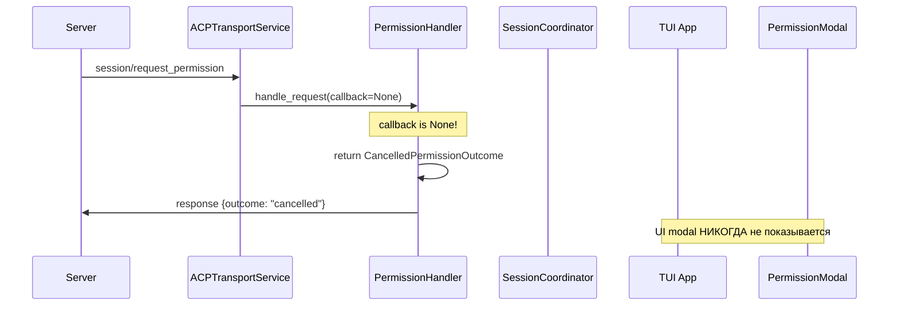
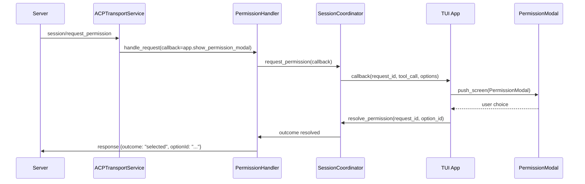

# Диагностический отчет: Permission Modal не появляется на UI

**Дата:** 2026-04-17  
**Проблема:** Permission modal не показывается пользователю при получении `session/request_permission` от сервера

## Симптомы из логов

```
tool_lifecycle_permission_callback_start has_callback=True permission_id=2b6537ad
permission_request_received perm_data={...}
tool_lifecycle_permission_callback_done permission_id=2b6537ad selected_option=None
tool_lifecycle_permission_response_sending outcome={'outcome': 'cancelled'}
```

**Ключевая проблема:** 
- Permission request получен и распарсен успешно
- Callback вызвана (`has_callback=True`)
- Но `selected_option=None` - пользователь не сделал выбор
- Response отправлен как `"cancelled"` вместо ожидания выбора

## Анализ возможных источников проблемы

### 1. ❌ Событие PermissionRequestedEvent не публикуется
**Статус:** ПОДТВЕРЖДЕНО - это НЕ основная проблема

- Событие `PermissionRequestedEvent` определено в [`domain/events.py:107`](acp-client/src/acp_client/domain/events.py:107)
- `ChatViewModel._handle_permission_requested` подписан на это событие ([`chat_view_model.py:149`](acp-client/src/acp_client/presentation/chat_view_model.py:149))
- Но событие нигде не публикуется в EventBus
- **Однако:** это событие используется для старого механизма (legacy), новый механизм использует callback напрямую

### 2. ✅ Callback передается как None в PermissionHandler
**Статус:** ОСНОВНАЯ ПРОБЛЕМА НАЙДЕНА

**Место проблемы:** [`acp_transport_service.py:814-819`](acp-client/src/acp_client/infrastructure/services/acp_transport_service.py:814)

```python
# Обработка через handler без callback
# (callback=None приведет к CancelledPermissionOutcome)
outcome = await self._permission_handler.handle_request(
    request=request,
    callback=None,  # ← ПРОБЛЕМА: callback должен быть show_permission_modal!
)
```

**Последствия:**
- В [`permission_handler.py:490-497`](acp-client/src/acp_client/application/permission_handler.py:490) есть fallback:
  ```python
  if callback is not None:
      outcome = await self._coordinator.request_permission(
          request=request,
          callback=callback,
      )
  else:
      # Fallback: показать ошибку логирования и вернуть cancelled
      self._logger.warning("permission_request_no_callback", request_id=request_id)
      outcome = CancelledPermissionOutcome(outcome="cancelled")
  ```
- Поскольку `callback=None`, всегда возвращается `CancelledPermissionOutcome`
- UI modal никогда не показывается

### 3. ✅ TUI App имеет метод show_permission_modal, но он не используется
**Статус:** ПОДТВЕРЖДЕНО

**Существующий код:** [`tui/app.py:425-489`](acp-client/src/acp_client/tui/app.py:425)

```python
def show_permission_modal(
    self,
    request_id: str | int,
    tool_call: PermissionToolCall,
    options: list[PermissionOption],
) -> None:
    """Показывает модальное окно для запроса разрешения."""
    # ... создает PermissionModal и показывает его
    # ... создает on_choice callback для coordinator.resolve_permission
```

**Проблема:** Этот метод существует, но никогда не вызывается, потому что:
- `ACPTransportService._handle_permission_request_with_handler` вызывается с `callback=None`
- Нет механизма передачи `app.show_permission_modal` в transport service

## Архитектурный анализ

### Текущий flow (НЕРАБОТАЮЩИЙ):



### Ожидаемый flow (ДОЛЖЕН БЫТЬ):



## Корневая причина

**Проблема:** Отсутствует механизм передачи `app.show_permission_modal` callback в `ACPTransportService`

**Детали:**
1. `ACPTransportService` создается в [`di_bootstrapper.py:86`](acp-client/src/acp_client/infrastructure/di_bootstrapper.py:86) без ссылки на TUI App
2. `TUI App` создается после DI контейнера и не может передать свой callback в transport service
3. `_handle_permission_request_with_handler` жестко закодирован с `callback=None`

## Возможные решения

### Решение 1: Передать callback через setter в ACPTransportService (РЕКОМЕНДУЕТСЯ)

**Преимущества:**
- Минимальные изменения
- Сохраняет существующую архитектуру
- Не нарушает DI принципы

**Реализация:**
1. Добавить метод `set_permission_callback` в `ACPTransportService`
2. В `TUI App.on_mount` установить callback: `transport.set_permission_callback(self.show_permission_modal)`
3. В `_handle_permission_request_with_handler` использовать сохраненный callback

### Решение 2: Использовать EventBus для публикации PermissionRequestedEvent

**Преимущества:**
- Полностью decoupled архитектура
- Соответствует паттерну EventBus

**Недостатки:**
- Требует больше изменений
- Нужно переделать механизм ожидания ответа пользователя

### Решение 3: Передать TUI App в DI контейнер

**Недостатки:**
- Нарушает принципы DI (UI не должен быть в контейнере)
- Создает циклическую зависимость

## Рекомендация

**Использовать Решение 1** - добавить setter для permission callback в `ACPTransportService`.

Это минимальное изменение, которое:
- Не нарушает существующую архитектуру
- Использует уже существующий `app.show_permission_modal`
- Сохраняет callback-based подход для синхронного показа modal

## Следующие шаги

1. ✅ Добавить детальное логирование для подтверждения диагноза
2. ⬜ Реализовать Решение 1
3. ⬜ Протестировать с реальным permission request
4. ⬜ Обновить документацию

## Связанные файлы

- [`acp_transport_service.py:781-854`](acp-client/src/acp_client/infrastructure/services/acp_transport_service.py:781) - `_handle_permission_request_with_handler`
- [`permission_handler.py:424-557`](acp-client/src/acp_client/application/permission_handler.py:424) - `handle_request`
- [`session_coordinator.py:179-296`](acp-client/src/acp_client/application/session_coordinator.py:179) - `request_permission`
- [`tui/app.py:425-489`](acp-client/src/acp_client/tui/app.py:425) - `show_permission_modal`
- [`di_bootstrapper.py:83-136`](acp-client/src/acp_client/infrastructure/di_bootstrapper.py:83) - DI setup
