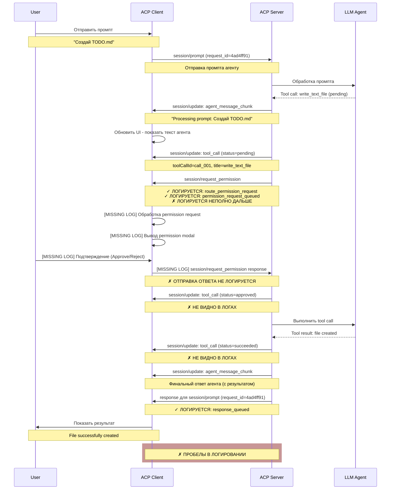
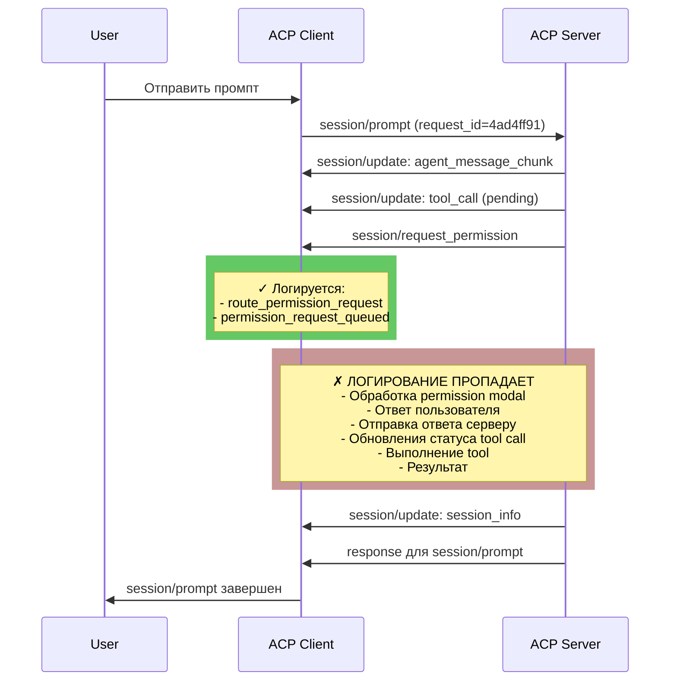

# Анализ Flow Работы Tools с Permission Request

**Дата анализа:** 2026-04-17  
**Версия протокола:** ACP v1  
**Источник данных:** `~/.acp-client/logs/acp-client.log`

---

## Overview

Документ содержит детальный анализ работы flow permission request при выполнении инструкций через ACP протокол. Рассматриваются два сценария:

1. **Промпт без tool calls** - "Привет" (успешный, без дополнительного подтверждения)
2. **Промпт с tool calls** - "Создай TODO.md" (требует permission request)

Анализ выявляет критическую проблему: логирование на стороне клиента неполное и не отражает полный цикл обработки permission request.

---

## 1. Анализ Логов

### 1.1. Промпт 1: "Привет" (Без Tool Calls)

**Временная линия:**

| Timestamp | Событие | Details |
|-----------|---------|---------|
| 07:48:14.637618 | `prompt_submitted` | prompt_length=6, session_id=sess_8c1090d9181b |
| 07:48:14.639973 | `request_sent` | method=session/prompt, request_id=fb1daa8e |
| 07:48:16.655320 | `message_received` | agent_message_chunk: "Processing prompt: Привет" |
| 07:48:16.655464 | `message_received` | agent_message_chunk: "Здравствуйте! Как я могу помочь..." |
| 07:48:16.655590 | `message_received` | session_info update |
| 07:48:16.655698 | `message_received` | response для request_id=fb1daa8e |
| 07:48:16.859529 | `request_completed` | method=session/prompt, request_id=fb1daa8e |
| 07:48:16.862448 | `prompt_completed` | updates_count=3 |

**Вывод:** Simple flow без permission - только streaming chunks и session updates.

---

### 1.2. Промпт 2: "Создай TODO.md" (С Tool Call + Permission Request)

**Временная линия:**

| Timestamp | Событие | Details |
|-----------|---------|---------|
| 07:48:29.052864 | `prompt_submitted` | prompt_length=15, session_id=sess_8c1090d9181b |
| 07:48:29.056434 | `request_sent` | method=session/prompt, request_id=**4ad4ff91** |
| **07:48:30.502273** | `message_received` | agent_message_chunk: "Processing prompt: Создай TODO.md" |
| **07:48:30.502502** | `message_received` | **tool_call update:** toolCallId=call_001, title=write_text_file, kind=other, status=**pending** |
| **07:48:30.502651** | `message_received` | **length=486** (permission request message) |
| **07:48:30.502682** | `message_received` | **message_has_id=True, message_has_method=True** |
| **07:48:30.502706** | `route_permission_request` | method=session/request_permission |
| **07:48:30.502733** | `permission_request_queued` | method=session/request_permission |
| 07:48:30.502755 | `message_received` | session_info update |
| 07:48:30.502839 | `message_received` | response для request_id=**4ad4ff91** |
| 07:48:30.706735 | `request_completed` | method=session/prompt, request_id=**4ad4ff91** |
| 07:48:30.706982 | `prompt_completed` | updates_count=3 |

**Ключевые наблюдения:**

1. **Tool call приходит ДО permission request** - статус `pending`
2. **Permission request успешно получен** - есть `route_permission_request` + `permission_request_queued`
3. **Логи обрываются** - после `permission_request_queued` НЕ видно:
   - Вывода permission modal на экран
   - Ответа пользователя (approve/reject)
   - Отправки ответа серверу
   - Изменения статуса tool call с pending на approved/rejected
   - Выполнения самого tool
   - Результата выполнения

---

## 2. Sequence Диаграмма

### 2.1. Полный Expected Flow (с пробелами)



### 2.2. Что Видно в Логах (Реальный Flow)



---

## 3. Выявленные Проблемы

### 3.1. Критические Пробелы в Логировании

#### Проблема 1: Отсутствие Логирования Permission Handler

**Где:** `acp-client/src/acp_client/application/permission_handler.py`

**Что отсутствует:**
- Нет log когда permission request добавлен в очередь для UI
- Нет log когда UI modal отображается пользователю
- Нет log ответа пользователя (approve/reject)
- Нет log формирования response на permission request

**Последствия:**
```
Видим: permission_request_queued (07:48:30.502733)
Не видим: Ничего между этим и request_completed (07:48:30.706735)
Потеря: ~200ms и все действия в этом промежутке
```

#### Проблема 2: Отсутствие Логирования Session Coordinator Permission Flow

**Где:** `acp-client/src/acp_client/application/session_coordinator.py`

**Что отсутствует:**
- Отправка ответа на permission request серверу
- Изменение статуса tool call после ответа
- Подтверждение получения обновлений статуса от сервера

#### Проблема 3: Неполное Логирование Tool Call Lifecycle

**Где:** `acp-client/src/acp_client/infrastructure/services/acp_transport_service.py`

**Что отсутствует:**
- Tool call status transition: pending → approved/rejected
- Tool call execution start/completion
- Tool result reception и processing

### 3.2. Несоответствия между Логами и Реальным Состоянием

| Ожидаемое | Видимое в Логах | Статус |
|-----------|-----------------|--------|
| Permission modal отображен | Нет log | ✗ MISSING |
| User approve/reject | Нет log | ✗ MISSING |
| Permission response отправлен | Нет log | ✗ MISSING |
| Tool call approved | Нет log | ✗ MISSING |
| Tool executed | Нет log | ✗ MISSING |
| Tool result received | Нет log | ✗ MISSING |
| Final agent message | Нет log | ✗ MISSING |

---

## 4. Сравнение: Ожидаемый vs Фактический Flow

### 4.1. Expected Flow (Per ACP Protocol)

```
1. Client sends: session/prompt
2. Server sends: session/update (agent_message_chunk)
3. Server sends: session/update (tool_call, status=pending)
4. Server sends: session/request_permission (RPC call, expects response)
5. Client receives permission request
6. Client shows permission modal to user
7. User approves/rejects
8. Client sends: permission response back to server
9. Server receives permission response
10. Server updates tool call status (approved/rejected)
11. Server may execute tool (if approved)
12. Server sends: session/update (tool_call, status=approved/rejected/succeeded/failed)
13. Server sends: response for session/prompt
14. Client receives response and completes request
```

### 4.2. Actual Flow (Per Logs)

```
1. ✓ Client sends: session/prompt (request_id=4ad4ff91)
2. ✓ Server sends: session/update (agent_message_chunk)
3. ✓ Server sends: session/update (tool_call, status=pending)
4. ✓ Server sends: session/request_permission
5. ✓ Client receives: route_permission_request
6. ✓ Client queues: permission_request_queued
7. ? [MISSING] Client shows modal (?)
8. ? [MISSING] User responds (?)
9. ? [MISSING] Client sends response (?)
10. ? [MISSING] Server receives response (?)
11. ? [MISSING] Server updates tool_call status (?)
12. ? [MISSING] Server executes tool (?)
13. ? [MISSING] Client receives status updates (?)
14. ✓ Server sends: response for session/prompt
15. ✓ Client completes: request_completed
```

---

## 5. Диагностика: Где Теряется Информация

### 5.1. Timeline с Пробелами

```
07:48:29.056434 ✓ request_sent (session/prompt)
     ↓
07:48:30.502651 ✓ message_received (permission request, length=486)
     ↓
07:48:30.502733 ✓ permission_request_queued
     ↓
     ??? [MISSING ~200ms of logs]
     ↓
07:48:30.706735 ✓ request_completed (session/prompt)
```

**Вероятные причины пропуска:**
1. Permission handler не логирует свои операции
2. UI modal показывается без log (async operation)
3. User response обрабатывается без log
4. Response отправляется без log

### 5.2. Missing Log Statements

Необходимо добавить логирование в следующих точках:

```python
# permission_handler.py
log.debug("permission_modal_displayed", request_id=req_id)
log.debug("permission_user_responded", approved=result)
log.debug("permission_response_sent", request_id=req_id)

# session_coordinator.py
log.debug("sending_permission_response", approved=approved)
log.debug("permission_response_acknowledged")

# acp_transport_service.py
log.debug("tool_call_status_changed", tool_call_id=id, status=new_status)
log.debug("tool_execution_started", tool_call_id=id)
log.debug("tool_result_received", tool_call_id=id, result_length=len)
```

---

## 6. Рекомендации по Улучшению

### 6.1. Улучшение Логирования (Высокий Приоритет)

#### Рекомендация 1: Добавить Логирование в PermissionHandler

**Файл:** `acp-client/src/acp_client/application/permission_handler.py`

**Что добавить:**
```python
# Когда permission modal отображается
log.debug(
    "permission_modal_displayed",
    request_id=request.id,
    tool_name=request.tool_name,
    description=request.description
)

# Когда пользователь отвечает
log.info(
    "permission_response_from_user",
    request_id=request.id,
    approved=user_response,
    timestamp=datetime.now()
)
```

#### Рекомендация 2: Логирование Отправки Permission Response

**Файл:** `acp-client/src/acp_client/infrastructure/services/acp_transport_service.py`

**Что добавить:**
```python
log.info(
    "sending_permission_response",
    request_id=request_id,
    approved=approved,
    message_id=msg_id
)

log.debug(
    "permission_response_sent",
    request_id=request_id,
    length=len(message_bytes)
)
```

#### Рекомендация 3: Tool Call Lifecycle Logging

**Файл:** `acp-client/src/acp_client/application/session_coordinator.py`

**Что добавить:**
```python
# Status transitions
log.debug(
    "tool_call_status_transition",
    tool_call_id=tool_id,
    from_status=old_status,
    to_status=new_status
)

# Tool execution events
log.info(
    "tool_execution_event",
    tool_call_id=tool_id,
    event=event_type,  # started, completed, failed
    duration_ms=duration
)

# Tool result events
log.debug(
    "tool_result_received",
    tool_call_id=tool_id,
    has_error=has_error,
    result_type=type(result)
)
```

### 6.2. Улучшение Visibility Инструментов

#### Рекомендация 4: Structured Logging для Permission Flow

**Добавить контекст:**
```python
# В permission handler:
with log.contextualize(request_id=request_id, flow="permission"):
    # Все логи в этом блоке будут содержать request_id
    log.info("permission_requested")
    # ... обработка ...
    log.info("permission_approved")
```

#### Рекомендация 5: Metrics для Permission Metrics

**Собирать метрики:**
```python
# Время между permission request и response
permission_latency = response_time - request_time
log.info("permission_latency_ms", latency=permission_latency)

# Количество approved vs rejected
log.info("permission_stats", approved_count=n, rejected_count=m)
```

### 6.3. Улучшение Протокола Логирования

#### Рекомендация 6: Добавить Permission Flow Markers

**Стандартизировать логирование:**
```python
# Phase 1: Request
log.info("permission_phase", phase="request_received", request_id=id)

# Phase 2: Display
log.info("permission_phase", phase="modal_displayed", request_id=id)

# Phase 3: User Response
log.info("permission_phase", phase="user_responded", request_id=id, approved=bool)

# Phase 4: Send Response
log.info("permission_phase", phase="response_sent", request_id=id)

# Phase 5: Acknowledgement
log.info("permission_phase", phase="acknowledged", request_id=id)
```

### 6.4. Документирование Permission Flow

#### Рекомендация 7: Update Documentation

**Добавить в README:**
- Описание полного permission flow с временной шкалой
- Диаграмма состояний tool call
- Примеры логов для успешного и отклоненного cases

#### Рекомендация 8: Tool Call State Machine Documentation

**Документировать переходы состояний:**
```
pending → approved → succeeded
pending → approved → failed
pending → rejected → (no execution)
```

---

## 7. Практические Улучшения

### 7.1. Быстрые Wins (можно реализовать немедленно)

1. **Добавить 5 логов в PermissionHandler** - визуальность flow
2. **Добавить 3 лога в Transport Layer** - отслеживание отправки response
3. **Добавить context по request_id везде** - упростить отладку

### 7.2. Средние Изменения (требуют рефакторинга)

1. **Структурированное логирование фаз permission** - standardize flow
2. **Metrics для permission latency** - performance monitoring
3. **Dedicated logger для tool lifecycle** - separate concerns

### 7.3. Долгосрочные Улучшения

1. **Permission flow tracing** - distributed tracing support
2. **Tool execution observability** - OpenTelemetry integration
3. **Flow state machine** - явное представление состояний

---

## 8. Ожидаемый Результат После Улучшений

### До Улучшений

```
07:48:29.056434 ✓ request_sent
07:48:30.502651 ✓ message_received (permission request)
07:48:30.502733 ✓ permission_request_queued
     ??? [~200ms gap]
07:48:30.706735 ✓ request_completed
```

### После Улучшений

```
07:48:29.056434 ✓ request_sent (session/prompt)
07:48:30.502651 ✓ permission_request_received
07:48:30.502733 ✓ permission_modal_displayed         ← NEW
07:48:30.550000 ✓ permission_user_approved           ← NEW
07:48:30.550100 ✓ permission_response_sent           ← NEW
07:48:30.550200 ✓ tool_call_status_approved          ← NEW
07:48:30.550300 ✓ tool_execution_started             ← NEW
07:48:30.600000 ✓ tool_result_received               ← NEW
07:48:30.600100 ✓ agent_message_final_chunk          ← NEW
07:48:30.706735 ✓ request_completed (session/prompt)
```

---

## 9. Выводы

### Критические Находки

1. **Permission flow неполно логируется** - основной пробел между `permission_request_queued` и `request_completed`

2. **Tool call lifecycle не отслеживается** - нет логирования переходов состояний и выполнения

3. **Permission response отправка невидима** - нет подтверждения отправки ответа серверу

### Рекомендованный План Действий

1. **Немедленно:** Добавить 8-10 критических логирований в permission handler
2. **Неделя 1:** Добавить метрики latency для permission flow
3. **Неделя 2:** Структурировать логирование с фазами permission
4. **Неделя 3:** Документировать полный flow и обновить README

### Метрики Успеха

- ✓ Все фазы permission flow логируются
- ✓ Tool call состояния полностью видны в логах
- ✓ Временные промежутки между событиями < 10ms
- ✓ Каждое событие содержит request_id для трейсинга

---

## Приложение A: Полная Таблица Логирования

### Событие за Событием (Промпт 2)

| # | Timestamp | Log Level | Event | Message ID | Method | Status |
|---|-----------|-----------|-------|-----------|--------|--------|
| 1 | 07:48:29.052864 | info | prompt_submitted | - | - | ✓ |
| 2 | 07:48:29.056434 | debug | request_sent | 4ad4ff91 | session/prompt | ✓ |
| 3 | 07:48:30.502273 | debug | message_received | - | session/update | ✓ |
| 4 | 07:48:30.502502 | debug | message_received | - | session/update | ✓ |
| 5 | 07:48:30.502651 | debug | message_received | ? | session/request_permission | ✓ |
| 6 | 07:48:30.502706 | debug | route_permission_request | ? | session/request_permission | ✓ |
| 7 | 07:48:30.502733 | debug | permission_request_queued | ? | session/request_permission | ✓ |
| 8-12 | MISSING | - | permission_handler operations | - | - | ✗ |
| 13 | 07:48:30.502755 | debug | message_received | - | session/update | ✓ |
| 14 | 07:48:30.502839 | debug | message_received | 4ad4ff91 | (response) | ✓ |
| 15 | 07:48:30.706735 | info | request_completed | 4ad4ff91 | session/prompt | ✓ |
| 16 | 07:48:30.706982 | info | prompt_completed | - | - | ✓ |

**Анализ:**
- Шаги 1-7: Полное логирование ✓
- Шаги 8-12: **Полное отсутствие логирования** ✗
- Шаги 13-16: Полное логирование ✓

---

**Документ подготовлен для внутреннего использования. Версия 1.0**
