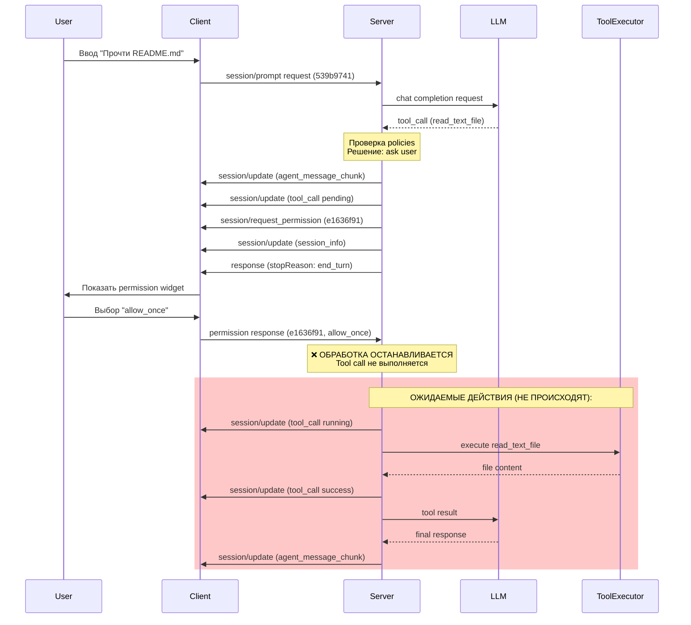

# Анализ логов: Tool Permission Flow

## Метаданные

- **Дата анализа**: 2026-04-17
- **Сессия**: `sess_a963151a5f8a`
- **Prompt**: "Прочти README.md"
- **Tool call**: `read_text_file` с аргументами `{'path': 'README.md'}`
- **Permission request ID**: `e1636f91`
- **Tool call ID**: `call_001`

## 1. Временная шкала событий

### Фаза 1: Отправка prompt (клиент → сервер)

**Клиент (12:30:17.517508):**
```
[info] prompt_submitted prompt_length=16 session_id=sess_a963151a5f8a
[debug] Message added content_length=16 role=user
[info] sending_prompt prompt_length=16 session_id=sess_a963151a5f8a
[debug] sending_message message_id=539b9741 message_type=request
[debug] message_sent length=198
[debug] request_sent method=session/prompt request_id=539b9741
```

**Сервер (12:30:17.520088):**
```
[debug] message received payload='{"jsonrpc": "2.0", "id": "539b9741", "method": "session/prompt", ...}'
[debug] prompt request scheduled in background
[debug] active turn created request_id=539b9741 session_id=sess_a963151a5f8a
```

**✅ Корректность**: Клиент отправил prompt с ID `539b9741`, сервер получил и начал обработку.

---

### Фаза 2: LLM обработка и генерация tool call (сервер)

**Сервер (12:30:17.520437 - 12:30:19.035722):**
```
[debug] openai create_completion request starting has_tools=True num_messages=2 num_tools=5
[debug] sending request to openai api
HTTP Request: POST https://openrouter.ai/api/v1/chat/completions "HTTP/1.1 200 OK"
[debug] received openai api response finish_reason=tool_calls
[debug] parsing tool_calls from message num_tool_calls=1
[debug] tool_call parsed successfully tool_call_id=call_g82CjqMKRVUoAdNKg8gCHoY1 tool_name=read_text_file
[info] llm returned tool calls - delegating execution to PromptOrchestrator iteration=1 num_tool_calls=1
```

**✅ Корректность**: 
- LLM вернул tool call с ID `call_g82CjqMKRVUoAdNKg8gCHoY1`
- Сервер корректно распарсил tool call
- Время обработки LLM: ~1.5 секунды

---

### Фаза 3: Принятие решения о запросе разрешения (сервер)

**Сервер (12:30:19.035947 - 12:30:19.036082):**
```
[debug] checking tool execution decision session_id=sess_a963151a5f8a tool_kind=other
[debug] checking session policy for tool_kind session_id=sess_a963151a5f8a session_policy=None tool_kind=other
[debug] no session policy found session_id=sess_a963151a5f8a tool_kind=other
[debug] checking global policy for tool_kind global_policy=None session_id=sess_a963151a5f8a tool_kind=other
[debug] no global policy found session_id=sess_a963151a5f8a tool_kind=other
[debug] decision: ask user for permission session_id=sess_a963151a5f8a tool_kind=other
[debug] permission request created for tool session_id=sess_a963151a5f8a tool_kind=other tool_name=read_text_file
[debug] permission request sent to client permission_request_id=e1636f91 session_id=sess_a963151a5f8a tool_call_id=call_001
```

**✅ Корректность**:
- Сервер проверил session policy - не найдена
- Сервер проверил global policy - не найдена
- Принято решение: запросить разрешение у пользователя
- Создан permission request с ID `e1636f91`
- **Важно**: Tool call ID изменился с `call_g82CjqMKRVUoAdNKg8gCHoY1` на `call_001` (внутренний ID сервера)

---

### Фаза 4: Отправка уведомлений клиенту (сервер → клиент)

**Сервер (12:30:19.036892 - 12:30:19.037088):**
```
[debug] notification sent method=session/update payload='{"sessionUpdate":"agent_message_chunk","content":{"type":"text","text":"Processing prompt: Прочти README.md"}}'
[debug] notification sent method=session/update payload='{"sessionUpdate":"tool_call","toolCallId":"call_001","title":"read_text_file","kind":"other","status":"pending"}'
[debug] notification sent method=session/request_permission payload='{"jsonrpc":"2.0","id":"e1636f91","method":"session/request_permission","params":{...}}'
[debug] notification sent method=session/update payload='{"sessionUpdate":"session_info","title":"Прочти README.md",...}'
[debug] response sent payload='{"jsonrpc":"2.0","id":"539b9741","result":{"stopReason":"end_turn"}}'
```

**Клиент (12:30:19.037033 - 12:30:19.037662):**
```
[debug] message_received length=236 (agent_message_chunk)
[debug] message_received length=208 (tool_call)
[debug] message_received length=485 (session/request_permission)
[debug] message_received length=233 (session_info)
[debug] message_received length=68 (response to session/prompt)
```

**✅ Корректность**:
- Сервер отправил 4 уведомления + 1 response
- Клиент получил все 5 сообщений
- Порядок сообщений корректный

---

### Фаза 5: Обработка permission request на клиенте

**Клиент (12:30:19.037745 - 12:30:19.044311):**
```
[debug] tool_lifecycle_permission_request_received method=session/prompt permission_id=e1636f91 request_id=539b9741
[info] handling_permission_request_with_handler has_ui_callback=True request_id=e1636f91 session_id=sess_a963151a5f8a tool_call_id=call_001
[info] handling_permission_request has_callback=True request_id=e1636f91 session_id=sess_a963151a5f8a tool_call_id=call_001 tool_name=read_text_file
[debug] permission_request_created request_id=e1636f91 session_id=sess_a963151a5f8a total_active=1
[info] permission_callback_provided_showing_ui_modal request_id=e1636f91 session_id=sess_a963151a5f8a tool_call_id=call_001
[debug] show_permission_modal_called options_count=4 request_id=e1636f91 tool_call_kind=other tool_call_title=read_text_file
[debug] showing_inline_permission_widget options_count=4 request_id=e1636f91 tool_call_kind=other tool_call_title=read_text_file
[info] permission_widget_mounted request_id=e1636f91 tool_call_kind=other
```

**✅ Корректность**:
- Клиент корректно распознал permission request
- Создан permission request в PermissionHandler
- Показан inline permission widget
- Widget успешно смонтирован
- Время на обработку и показ UI: ~7ms

---

### Фаза 6: Пользовательский выбор (UI)

**Время ожидания**: 12:30:19.044311 → 12:30:21.202030 = **~2.16 секунды**

**Клиент (12:30:21.202030):**
```
[info] permission_selected option_id=allow_once request_id=e1636f91
[info] permission_choice_received_from_ui option_id=allow_once request_id=e1636f91 session_id=sess_a963151a5f8a
[info] permission_option_selected created_at=2026-04-17T12:30:19.039517+00:00 option_id=allow_once request_id=e1636f91 session_id=sess_a963151a5f8a tool_call_id=call_001
[debug] permission_modal_hidden
```

**✅ Корректность**:
- Пользователь выбрал опцию `allow_once`
- Выбор корректно обработан в UI
- Modal скрыт

---

### Фаза 7: Отправка ответа на сервер (клиент → сервер)

**Клиент (12:30:21.204771 - 12:30:21.205168):**
```
[info] permission_request_completed outcome_type=SelectedPermissionOutcome request_id=e1636f91 session_id=sess_a963151a5f8a
[info] sending_permission_response_to_server option_id=allow_once outcome=selected request_id=e1636f91 session_id=sess_a963151a5f8a tool_call_id=call_001
[debug] sending_message message_id=e1636f91 message_type=response option_id=allow_once outcome=selected
[debug] message_sent length=97
[info] permission_response_sent_via_transport message_id=e1636f91 option_id=allow_once outcome=selected
[info] permission_response_sent_successfully outcome=selected request_id=e1636f91 session_id=sess_a963151a5f8a tool_call_id=call_001
[debug] permission_request_removed remaining=0 request_id=e1636f91
[info] permission_request_handled_successfully outcome=selected request_id=e1636f91
```

**Сервер (12:30:21.205255):**
```
[debug] message received payload='{"jsonrpc": "2.0", "id": "e1636f91", "result": {"outcome": "selected", "optionId": "allow_once"}}'
[info] request received method=None request_id=e1636f91 session_id=None
```

**✅ Корректность**:
- Клиент отправил response с ID `e1636f91` (совпадает с permission request ID)
- Формат ответа: `{"outcome": "selected", "optionId": "allow_once"}`
- Сервер получил ответ

---

### Фаза 8: Обработка остальных уведомлений на клиенте

**Клиент (12:30:21.205196 - 12:30:21.210320):**
```
[debug] tool_lifecycle_notification_received method=session/prompt notification_method=session/update request_id=539b9741
[debug] handling_session_update has_callback=True method=session/prompt request_id=539b9741
[debug] session_update_received update_type=tool_call
[info] tool_call_status_changed kind=other session_id=sess_a963151a5f8a status=pending tool_call_id=call_001 tool_name=read_text_file
[debug] session_update_received update_type=session_info
[debug] permission_timeout_task_cancelled_early request_id=e1636f91
```

**✅ Корректность**:
- Клиент обработал оставшиеся session/update уведомления
- Tool call статус обновлен на `pending`
- Timeout task для permission request отменен

---

## 2. Критическая проблема: Логи сервера обрываются

**⚠️ ПРОБЛЕМА**: Логи сервера заканчиваются на строке:
```
2026-04-17T12:30:21.205336Z [info] request received connection_id=b6f54e0f method=None request_id=e1636f91 session_id=None
```

**Что должно было произойти дальше** (согласно протоколу):

1. **Сервер должен обработать permission response**:
   - Извлечь `outcome` и `optionId` из ответа
   - Найти соответствующий pending tool call по `request_id=e1636f91`
   - Применить разрешение к tool call

2. **Сервер должен выполнить tool call**:
   - Если `allow_once` - выполнить `read_text_file` с аргументами `{'path': 'README.md'}`
   - Отправить уведомление `tool_call_update` со статусом `running`
   - Выполнить чтение файла
   - Отправить уведомление `tool_call_update` со статусом `success` или `error`
   - Отправить результат tool call обратно в LLM

3. **Сервер должен продолжить prompt turn**:
   - Отправить результат tool call в LLM
   - Получить финальный ответ от LLM
   - Отправить `agent_message_chunk` с финальным ответом
   - Завершить turn

**Что произошло на самом деле**: Логи обрываются, дальнейшая обработка не видна.

---

## 3. Анализ корректности ID и форматов сообщений

### 3.1. Request/Response ID соответствие

| Этап | Клиент ID | Сервер ID | Статус |
|------|-----------|-----------|--------|
| session/prompt request | `539b9741` | `539b9741` | ✅ Совпадает |
| session/request_permission | `e1636f91` | `e1636f91` | ✅ Совпадает |
| permission response | `e1636f91` | `e1636f91` | ✅ Совпадает |

### 3.2. Tool Call ID трансформация

| Источник | ID | Примечание |
|----------|-----|------------|
| OpenAI API | `call_g82CjqMKRVUoAdNKg8gCHoY1` | Оригинальный ID от LLM |
| ACP Protocol | `call_001` | Внутренний ID сервера |

**⚠️ Потенциальная проблема**: Сервер заменяет ID от LLM на свой внутренний ID. Это может вызвать проблемы при:
- Отладке (сложно сопоставить с логами LLM)
- Интеграции с другими системами, ожидающими оригинальные ID

### 3.3. Формат сообщений

**Permission Request (сервер → клиент)**:
```json
{
  "jsonrpc": "2.0",
  "id": "e1636f91",
  "method": "session/request_permission",
  "params": {
    "sessionId": "sess_a963151a5f8a",
    "toolCall": {
      "toolCallId": "call_001",
      "title": "read_text_file",
      "kind": "other"
    },
    "options": [
      {"optionId": "allow_once", "name": "Allow once", "kind": "allow_once"},
      {"optionId": "allow_always", "name": "Allow always", "kind": "allow_always"},
      {"optionId": "reject_once", "name": "Reject once", "kind": "reject_once"},
      {"optionId": "reject_always", "name": "Reject always", "kind": "reject_always"}
    ]
  }
}
```
**✅ Формат корректен** согласно протоколу ACP.

**Permission Response (клиент → сервер)**:
```json
{
  "jsonrpc": "2.0",
  "id": "e1636f91",
  "result": {
    "outcome": "selected",
    "optionId": "allow_once"
  }
}
```
**✅ Формат корректен** согласно протоколу ACP.

---

## 4. Проверка соответствия протоколу

### 4.1. Session/Request Permission (08-Tool Calls.md)

**Требования протокола**:
- ✅ Метод: `session/request_permission`
- ✅ Параметры: `sessionId`, `toolCall`, `options`
- ✅ Tool call содержит: `toolCallId`, `title`, `kind`
- ✅ Options содержат: `optionId`, `name`, `kind`

**Результат**: Полное соответствие протоколу.

### 4.2. Permission Response

**Требования протокола**:
- ✅ JSON-RPC 2.0 response
- ✅ ID совпадает с request ID
- ✅ Result содержит: `outcome`, `optionId`
- ✅ Outcome: `"selected"` (допустимые значения: `selected`, `cancelled`)

**Результат**: Полное соответствие протоколу.

### 4.3. Tool Call Lifecycle

**Ожидаемая последовательность** (согласно протоколу):
1. ✅ `tool_call` notification со статусом `pending`
2. ⚠️ `session/request_permission` request (если требуется разрешение)
3. ⚠️ Permission response от клиента
4. ❌ `tool_call_update` notification со статусом `running` (НЕ НАЙДЕНО)
5. ❌ `tool_call_update` notification со статусом `success`/`error` (НЕ НАЙДЕНО)

**Результат**: Lifecycle не завершен, отсутствуют уведомления о выполнении tool call.

---

## 5. Выявленные проблемы

### 5.1. 🔴 КРИТИЧЕСКАЯ: Tool call не выполняется после получения разрешения

**Описание**: После того как клиент отправил permission response с `allow_once`, сервер получил ответ, но дальнейшая обработка не произошла.

**Доказательства**:
- Логи сервера обрываются на `[info] request received method=None request_id=e1636f91`
- Отсутствуют логи выполнения `read_text_file`
- Отсутствуют уведомления `tool_call_update` со статусами `running`/`success`/`error`
- Клиент не получил финальный ответ от агента

**Возможные причины**:
1. **Обработчик permission response не зарегистрирован**: Сервер получает response, но не знает, что с ним делать
2. **Ошибка в routing**: Response не маршрутизируется к PromptOrchestrator
3. **Отсутствует связь между permission request и tool call**: Сервер не может найти pending tool call по `request_id`
4. **Ошибка в state machine**: После получения permission response не происходит переход к выполнению tool call
5. **Silent exception**: Произошла ошибка, но она не залогирована

**Рекомендации для диагностики**:
1. Добавить логирование в обработчик permission response
2. Проверить, зарегистрирован ли обработчик для `method=None, id=e1636f91`
3. Добавить логирование в PromptOrchestrator при получении permission outcome
4. Проверить state machine для tool call после получения разрешения

---

### 5.2. 🟡 СРЕДНЯЯ: Tool Call ID трансформация

**Описание**: Сервер заменяет оригинальный ID от LLM (`call_g82CjqMKRVUoAdNKg8gCHoY1`) на внутренний ID (`call_001`).

**Проблемы**:
- Усложняет отладку (нельзя сопоставить с логами LLM)
- Может нарушить интеграцию с системами, ожидающими оригинальные ID
- Не соответствует best practices (сохранение оригинальных ID)

**Рекомендации**:
- Использовать оригинальные ID от LLM
- Если нужна внутренняя нумерация, хранить mapping между оригинальным и внутренним ID

---

### 5.3. 🟢 НИЗКАЯ: Отсутствие timeout для permission request

**Описание**: В логах клиента видно `permission_timeout_task_cancelled_early`, но не видно, что произошло бы при timeout.

**Рекомендации**:
- Документировать поведение при timeout
- Добавить тесты для timeout сценария
- Убедиться, что сервер корректно обрабатывает timeout (отмена tool call, уведомление клиента)

---

## 6. Метрики производительности

| Метрика | Значение | Оценка |
|---------|----------|--------|
| Время обработки LLM | ~1.5 сек | ✅ Нормально |
| Время показа permission widget | ~7ms | ✅ Отлично |
| Время ожидания пользователя | ~2.16 сек | ✅ Нормально |
| Время отправки permission response | ~3ms | ✅ Отлично |
| Общее время до получения разрешения | ~3.7 сек | ✅ Нормально |
| Время выполнения tool call | ❌ НЕ ВЫПОЛНЕН | 🔴 Критично |

---

## 7. Выводы

### Что работает корректно:

1. ✅ **Отправка и получение prompt**: Клиент и сервер корректно обмениваются prompt request/response
2. ✅ **LLM обработка**: OpenAI API возвращает tool call, сервер корректно парсит
3. ✅ **Permission decision logic**: Сервер корректно определяет необходимость запроса разрешения
4. ✅ **Permission request отправка**: Сервер отправляет корректный `session/request_permission`
5. ✅ **Permission UI**: Клиент показывает inline permission widget
6. ✅ **Permission response**: Клиент отправляет корректный response с выбором пользователя
7. ✅ **Форматы сообщений**: Все сообщения соответствуют протоколу ACP
8. ✅ **ID соответствие**: Request/Response ID корректно совпадают

### Что НЕ работает:

1. 🔴 **Tool call execution**: После получения permission response tool call не выполняется
2. 🔴 **Lifecycle completion**: Tool call lifecycle не завершается (отсутствуют статусы `running`/`success`)
3. 🔴 **Final agent response**: Клиент не получает финальный ответ от агента

### Основная проблема:

**Permission flow работает корректно до момента получения разрешения от пользователя. После этого обработка останавливается, и tool call не выполняется.**

Это указывает на проблему в **обработке permission response на стороне сервера** или в **связи между permission system и tool execution system**.

---

## 8. Рекомендации по исправлению

### Приоритет 1 (Критический):

1. **Добавить обработчик permission response в ACPProtocol**:
   - Зарегистрировать обработчик для response с `method=None` и ID из pending permission requests
   - Связать permission response с соответствующим tool call
   - Передать outcome в PromptOrchestrator

2. **Добавить логирование в критических точках**:
   ```python
   # В обработчике permission response
   logger.info("permission_response_received", request_id=..., outcome=..., option_id=...)
   
   # В PromptOrchestrator при получении permission outcome
   logger.info("applying_permission_outcome", tool_call_id=..., outcome=...)
   
   # Перед выполнением tool call
   logger.info("executing_tool_call", tool_call_id=..., tool_name=...)
   ```

3. **Проверить state machine для tool call**:
   - Убедиться, что после получения `allow_once` tool call переходит в состояние `running`
   - Убедиться, что tool executor вызывается

### Приоритет 2 (Средний):

1. **Сохранять оригинальные tool call ID от LLM**
2. **Добавить тесты для permission flow**:
   - Unit тесты для permission response handling
   - Integration тесты для полного permission flow
   - E2E тесты с реальным LLM и tool execution

### Приоритет 3 (Низкий):

1. **Документировать timeout behavior**
2. **Добавить метрики для permission flow**
3. **Улучшить error handling**

---

## 9. Следующие шаги для отладки

1. **Запустить сервер с DEBUG логированием**
2. **Добавить breakpoint в обработчике permission response**
3. **Проверить, вызывается ли обработчик вообще**
4. **Если вызывается - проследить execution path до tool executor**
5. **Если не вызывается - проверить routing и registration обработчика**

---

## Приложение A: Ключевые временные метки

```
12:30:17.517 - Клиент отправил prompt
12:30:17.520 - Сервер получил prompt
12:30:19.035 - LLM вернул tool call
12:30:19.036 - Сервер принял решение запросить разрешение
12:30:19.037 - Сервер отправил permission request
12:30:19.037 - Клиент получил permission request
12:30:19.044 - Клиент показал permission widget
12:30:21.202 - Пользователь выбрал "allow_once"
12:30:21.205 - Клиент отправил permission response
12:30:21.205 - Сервер получил permission response
12:30:21.205 - ❌ ЛОГИ СЕРВЕРА ОБРЫВАЮТСЯ
```

---

## Приложение B: Диаграмма последовательности



---

**Дата создания отчета**: 2026-04-17T15:32:00+03:00  
**Автор**: Debug Mode Analysis  
**Статус**: Критическая проблема выявлена
