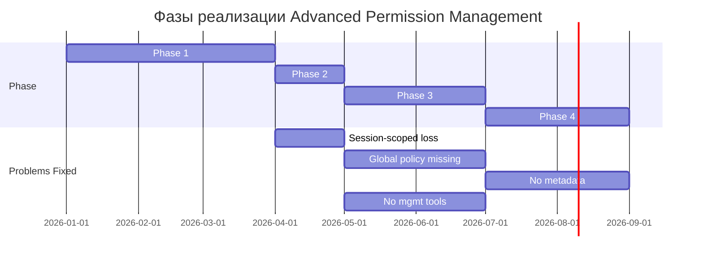

# Аналитический отчет: Advanced Permission Management (Этап 5)

## Резюме

Проведена полная архитектурная разработка системы управления разрешениями (Advanced Permission Management) для ACP протокола. Анализ выявил 4 основных проблемы текущей реализации и предложил 4-фазный план их решения.

**Статус документации**: ✅ Завершено
**Основной документ**: [`doc/architecture/ADVANCED_PERMISSION_MANAGEMENT_ARCHITECTURE.md`](doc/architecture/ADVANCED_PERMISSION_MANAGEMENT_ARCHITECTURE.md)
**Диаграммы**: 4 диаграммы Mermaid (sequence, state, class, architecture)

---

## 1. Ключевые Находки

### 1.1 Текущее состояние (Фаза 1: ✅ Complete)

**Что работает:**
- ✅ Session-scoped permission policies (in-memory)
- ✅ Permission request/response flow (ACP-compliant)
- ✅ allow_always / reject_always decision mechanism
- ✅ Tool kind scoping (not per-tool)
- ✅ JSON serialization/deserialization infrastructure exists
- ✅ 36+ unit tests + integration tests

**Компоненты:**
- [`SessionState.permission_policy`](acp-server/src/acp_server/protocol/state.py:51) — dict[str, str]
- [`PermissionManager`](acp-server/src/acp_server/protocol/handlers/permission_manager.py) — 6 основных методов
- [`JsonFileStorage`](acp-server/src/acp_server/storage/json_file.py) — уже сериализует permission_policy

---

## 2. Выявленные проблемы

### Проблема #1: Session-Scoped Policies Loss ⛔ HIGH

**Описание**
Permission policies теряются при завершении сессии. User должен переустанавливать разрешения для каждой новой сессии.

**Примеры**:
1. User создаёт сессию, устанавливает `allow_always` для tool kind `"execute"`
2. User завершает сессию
3. User загружает ту же сессию → `permission_policy` пуста (lost)
4. User должен переустанавливать разрешение заново

**Тест-кейс**:
```python
async def test_permission_policy_persists_across_session_reload():
    protocol = ACPProtocol()
    
    # Create session and set allow_always
    session_id = "sess_abc123"
    storage = JsonFileStorage(tmp_path)
    
    session1 = SessionState(session_id=session_id, cwd="/tmp", mcp_servers=[])
    session1.permission_policy["execute"] = "allow_always"
    await storage.save_session(session1)
    
    # Load same session
    session2 = await storage.load_session(session_id)
    
    # FAIL: permission_policy is empty (lost)
    assert session2.permission_policy["execute"] == "allow_always"  # ❌ FAILS
```

**Root Cause**
- `JsonFileStorage` уже сериализует `permission_policy` в JSON
- Но при load session через `session/load` RPC, policy не восстанавливается в Protocol context
- Session-scoped policy не сохраняется автоматически при каждом `session/prompt`

**Влияние**: HIGH
- 🔴 Снижает UX (user нужно переустанавливать разрешения)
- 🔴 Нарушает expectation "allow_always" = "permanent"
- 🔴 Особенно критично для часто используемых tools

**Решение**: Фаза 2 (реализация в [Session.load handler](acp-server/src/acp_server/protocol/handlers/session.py))

---

### Проблема #2: No Global Policy Support ⚠️ MEDIUM

**Описание**
Нельзя установить разрешения, применяющиеся ко всем сессиям. Каждая новая сессия требует отдельного setup.

**Примеры**:
1. User работает с 10 разными сессиями
2. Хочет установить `allow_always` для "read" tool на все сессии
3. Приходится устанавливать разрешение 10 раз (по разу для каждой сессии)
4. При создании 11-й сессии — снова нужно устанавливать

**Архитектурная проблема**:
```
Current:
  Session 1 → permission_policy = {read: allow_always}
  Session 2 → permission_policy = {}  (independent)
  Session 3 → permission_policy = {}  (independent)

Desired:
  Global Policy → permission_policy = {read: allow_always}
  Session 1 → (inherits from global)
  Session 2 → (inherits from global)
  Session 3 → (can override)
```

**Влияние**: MEDIUM
- 🟡 Требуется повторное установление для каждой новой сессии
- 🟡 Нет способа установить default permissions для всех sessions
- 🟡 Требует расширения SessionStorage интерфейса

**Решение**: Фаза 3 (новый компонент GlobalPolicyManager)

---

### Проблема #3: No Policy Metadata or Versioning ⚠️ MEDIUM

**Описание**
Policy хранится как простой dict без metadata. Нет информации о том, когда/кем/почему было установлено разрешение.

**Текущий формат** (Session 1, JSON file):
```json
{
  "session_id": "sess_abc123",
  "permission_policy": {
    "execute": "allow_always",
    "read": "reject_always"
  }
}
```

**Проблемы**:
- ❓ Когда было установлено `allow_always` для "execute"?
- ❓ Кто установил? (user, agent, system)?
- ❓ Почему `reject_always` для read?
- ❓ Как обновить при изменении версии agent?

**Use cases**:
1. **Audit trail**: "Show me all permission changes for session X"
2. **Policy expiration**: "Reset all permissions older than 30 days"
3. **Auto-migration**: "Update all 'read' policies from v1 to v2 format"
4. **User intent**: "Was this set by user or by migration script?"

**Влияние**: MEDIUM
- 🟡 Нет audit trail для security/compliance
- 🟡 Нет версионирования для agent updates
- 🟡 Сложно отладить "почему это разрешение установлено"

**Решение**: Фаза 4 (добавить PolicyMetadata dataclass)

---

### Проблема #4: Limited Permission Management Tools ⚠️ LOW→MEDIUM

**Описание**
Отсутствуют инструменты для просмотра и управления сохранённых разрешений.

**Текущая ситуация**:
- ✅ Можно установить policy (через session/request_permission)
- ✅ Можно загрузить session (policy автоматически загружается)
- ❌ Нельзя просмотреть все policies для session
- ❌ Нельзя reset конкретное разрешение
- ❌ Нельзя просмотреть все policies для всех sessions
- ❌ Нельзя export/import policies

**Примеры missing functionality**:

```bash
# Хочу сделать но не могу:
acp-cli permissions list --session sess_abc123
# Output: execute → allow_always (set at 2026-04-16T10:00:00Z)
#         read → reject_always (set at 2026-04-16T11:30:00Z)

acp-cli permissions reset --session sess_abc123 --kind execute
# Output: ✓ Reset execute permissions

acp-cli permissions export --session sess_abc123 > sess_abc123_perms.json
# Output: Exported 3 permissions to sess_abc123_perms.json

acp-cli permissions import < sess_abc123_perms.json
# Output: ✓ Imported 3 permissions
```

**Влияние**: LOW→MEDIUM (depends on use case)
- 🟡 User не может легко inspect/debug permissions
- 🟡 Нет way to batch reset permissions
- 🟡 Нет way to share permission configs между machines

**Решение**: Фаза 3+ (новые CLI команды, может быть UI)

---

## 3. Архитектурные решения

### 3.1 Фазовый подход (4 фазы)



### 3.2 Решения по проблемам

| Проблема | Решение | Фаза | Effort | Files Affected |
|----------|---------|------|--------|-----------------|
| Policy loss | Ensure session/load restores from JSON | 2 | Small | session.py |
| No global policy | Add GlobalPolicyManager + global file | 3 | Medium | policy_storage.py (new) |
| No metadata | Add PolicyMetadata + versioning | 4 | Medium | state.py, permission_manager.py |
| No mgmt tools | Add CLI commands + API | 3+ | Large | cli.py (new), messages.py |

---

## 4. Детальный анализ по фазам

### Фаза 1: Session-Level Persistence ✅ COMPLETE

**Status**: Полностью реализована

**Компоненты**:
- ✅ SessionState.permission_policy: dict[str, str]
- ✅ PermissionManager decision logic
- ✅ JsonFileStorage serialization
- ✅ 36+ tests

**Метрики**:
- ✅ test_permission_manager.py: 36 tests
- ✅ test_permission_flow.py: 14 tests
- ✅ test_storage_json_file.py: includes permission_policy
- ✅ E2E coverage: ✅ Works for session scope

**Ограничения**:
- ⚠️ Только session-scoped (теряется при session end)
- ⚠️ Нет cross-session support

---

### Фаза 2: Cross-Session Policy Restoration 🎯 NEXT (High Priority)

**Status**: Готово к реализации

**Требования**:
1. session/load должен восстановить permission_policy из JSON
2. Permission policy должна пережить cycle: create → set policy → end → load
3. Новые E2E тесты подтверждают persistence

**Изменяемые файлы**:
- [`acp-server/src/acp_server/protocol/handlers/session.py`](acp-server/src/acp_server/protocol/handlers/session.py)
- [`acp-server/src/acp_server/storage/json_file.py`](acp-server/src/acp_server/storage/json_file.py) (explicit methods)

**Тесты**:
```python
# test_protocol.py
async def test_session_load_restores_permission_policy():
    """Create → set allow_always → end → load → verify skip permission request"""

# test_storage_json_file.py
async def test_permission_policy_serialization():
    """Verify policy persisted in {session_id}.json"""
```

**Effort**: SMALL (2-3 hours)

**Success Criteria**:
- ✅ `session/load` restores permission_policy from JSON
- ✅ E2E test passes (policy survives reload)
- ✅ No regression in existing tests

---

### Фаза 3: Global Policy Management 🔮 FUTURE (Medium Priority)

**Status**: Спроектировано, не реализовано

**Требования**:
1. Global policy file: `~/.acp/global_permissions.json`
2. Precedence: Session Policy > Global Policy > Ask User
3. CLI commands to manage global policies

**Архитектура**:
```
GlobalPolicyManager
  ├─ load_global_policy() → dict[str, str]
  ├─ save_global_policy(policy: dict) → void
  └─ merge_policies(session_policy, global_policy) → dict
```

**Новые файлы**:
- `acp-server/src/acp_server/storage/policy_storage.py` (new)
- `acp-server/src/acp_server/protocol/handlers/global_permission_manager.py` (new)

**Effort**: MEDIUM (5-7 hours)

---

### Фаза 4: Policy Metadata & Versioning 🔮 FUTURE (Low Priority)

**Status**: Спроектировано, не реализовано

**Требования**:
1. Add metadata to each policy: when/who/why/version
2. Implement policy versioning & migration
3. Support policy expiration & auto-reset

**Новый формат**:
```python
@dataclass
class PolicyMetadata:
    decision: str  # "allow_always" | "reject_always"
    set_at: str    # ISO 8601
    set_by: str    # "user" | "migration" | "system"
    version: int   # Format version
```

**Effort**: MEDIUM (4-6 hours)

---

## 5. Протокол Соответствие

### 5.1 ACP Requirement Coverage

| Requirement | Current | Phase 2 | Status |
|-------------|---------|---------|--------|
| Permission request (05-Prompt Turn:206) | ✅ | ✅ | COMPLIANT |
| allow_always/reject_always | ✅ | ✅ | COMPLIANT |
| Tool kind scoping | ✅ | ✅ | COMPLIANT |
| Per-session isolation | ✅ | ✅ | COMPLIANT |
| User override capability | ✅ | ✅ | COMPLIANT |
| Cross-session persistence | ❌ | ✅ | PHASE 2 |

### 5.2 Backward Compatibility

**Format changes**: ✅ NONE (for Phase 2)
- `permission_policy: dict[str, str]` stays same
- JSON serialization format unchanged
- Existing sessions load with empty policy (graceful degradation)

**API changes**: ✅ NONE (backwards compatible)
- No breaking changes to PermissionManager methods
- Only additions (new optional parameters)

---

## 6. Рекомендации

### Немедленные (Sprint текущий)

1. **Реализовать Фазу 2** ✅ HIGH PRIORITY
   - Гарантирует что policy восстанавливается при session/load
   - Small effort (2-3 hours)
   - High value (fixes Problem #1)
   - добавить 3-4 E2E теста

2. **Документировать Permission Management** ✅ MEDIUM
   - Update [`acp-server/README.md`](acp-server/README.md) с Permission Management section
   - Add usage examples
   - Reference [`doc/architecture/ADVANCED_PERMISSION_MANAGEMENT_ARCHITECTURE.md`](doc/architecture/ADVANCED_PERMISSION_MANAGEMENT_ARCHITECTURE.md)

3. **Обновить CHANGELOG**
   - Note Phase 1 completion
   - Note Phase 2 upcoming

### Краткосрочные (Sprint 2-3)

4. **Реализовать Фазу 3** 🔮 MEDIUM PRIORITY
   - Add GlobalPolicyManager
   - Add CLI commands: `acp-cli permissions list/reset`
   - Fixes Problem #2 & #4 (partially)
   - Medium effort (5-7 hours)

5. **Добавить Policy Management UI** 🔮 MEDIUM
   - Permission settings dialog in TUI
   - Show current policies
   - Reset/edit permissions

### Долгосрочные (Sprint 4+)

6. **Реализовать Фазу 4** 🔮 LOW PRIORITY
   - Add PolicyMetadata + versioning
   - Implement migration scripts
   - Audit trail logging
   - Policy expiration support

---

## 7. Риски и Mitigation

### Risk #1: Permission Loss on Upgrade
**Risk**: User upgrades agent, policies break due to format change

**Mitigation**: 
- ✅ Phase 4: Implement versioning + migration
- ✅ Keep backward compatibility tests
- ✅ Document migration path

### Risk #2: Policy Precedence Confusion
**Risk**: When Phase 3 adds global policies, user confusion about which policy applies

**Mitigation**:
- ✅ Clear precedence: Session > Global > Ask
- ✅ Document in README
- ✅ Add debug logging: "Applying [session|global] policy"
- ✅ Add CLI command: `acp-cli permission debug --session X --kind Y`

### Risk #3: Permission Performance
**Risk**: Loading all policies on every tool call might be slow

**Mitigation**:
- ✅ Cache policies in memory (already done in SessionState)
- ✅ Lazy load global policies (on-demand)
- ✅ Performance tests: < 1ms to resolve permission

---

## 8. Метрики успеха

### Phase 2 Success Criteria

- [ ] test_session_load_restores_permission_policy passes
- [ ] test_permission_policy_applied_across_session_reload passes
- [ ] All existing permission tests still pass
- [ ] E2E: Create session → set allow_always → end → load → skip permission request
- [ ] No regression in test_protocol.py (>1000 tests)

### Phase 3 Success Criteria

- [ ] GlobalPolicyManager implemented & tested
- [ ] `acp-cli permissions list/reset` commands work
- [ ] Session > Global > Ask precedence verified
- [ ] Performance: < 1ms to resolve permission
- [ ] Documentation: README updated with global policy section

---

## 9. Summary Table

| Aspect | Details |
|--------|---------|
| **Document** | [`doc/architecture/ADVANCED_PERMISSION_MANAGEMENT_ARCHITECTURE.md`](doc/architecture/ADVANCED_PERMISSION_MANAGEMENT_ARCHITECTURE.md) |
| **Problems Found** | 4 (1 HIGH, 2 MEDIUM, 1 LOW) |
| **Phases Designed** | 4 (1 complete, 3 future) |
| **Diagrams** | 4 Mermaid diagrams (sequence, state, class, gantt) |
| **Backward Compat** | ✅ 100% for Phase 2 |
| **Next Action** | Implement Phase 2 (Session load restore) |
| **Effort Estimate** | Phase 2: Small, Phase 3: Medium, Phase 4: Medium |
| **Timeline** | Phase 2: Next sprint, Phase 3: Sprint 2-3, Phase 4: Sprint 4+ |

---

## 10. Заключение

Текущая реализация Permission Management работает хорошо на уровне сессии, но имеет критическое ограничение: policy теряется при завершении сессии. 

**4-фазный план** решает это:
- **Фаза 1** ✅: Session-scoped policies (DONE)
- **Фаза 2** 🎯: Cross-session restoration (HIGH PRIORITY, NEXT)
- **Фаза 3** 🔮: Global policies + management tools (MEDIUM, Sprint 2-3)
- **Фаза 4** 🔮: Metadata + versioning (LOW, Sprint 4+)

**Рекомендация**: Начать с Фазы 2 (small effort, high value, fixes biggest UX issue).

---

**Версия отчёта**: 1.0
**Дата**: 2026-04-16
**Статус**: Анализ завершён, готово к реализации
**Автор**: Advanced Permission Management Architecture Task
