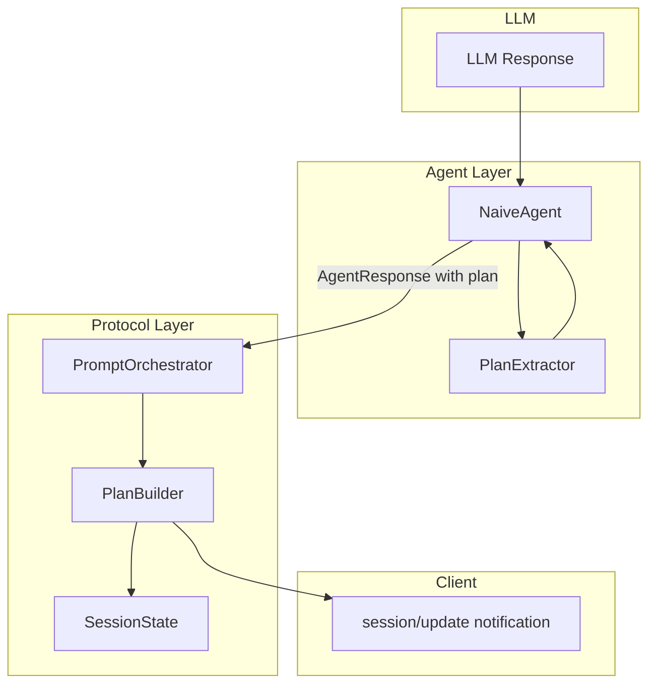
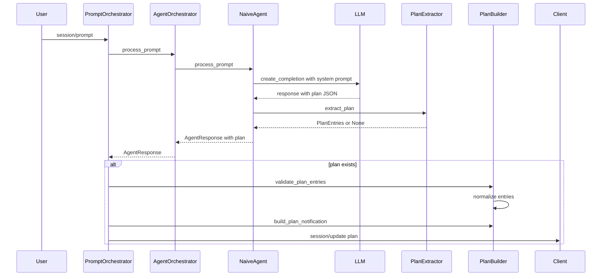
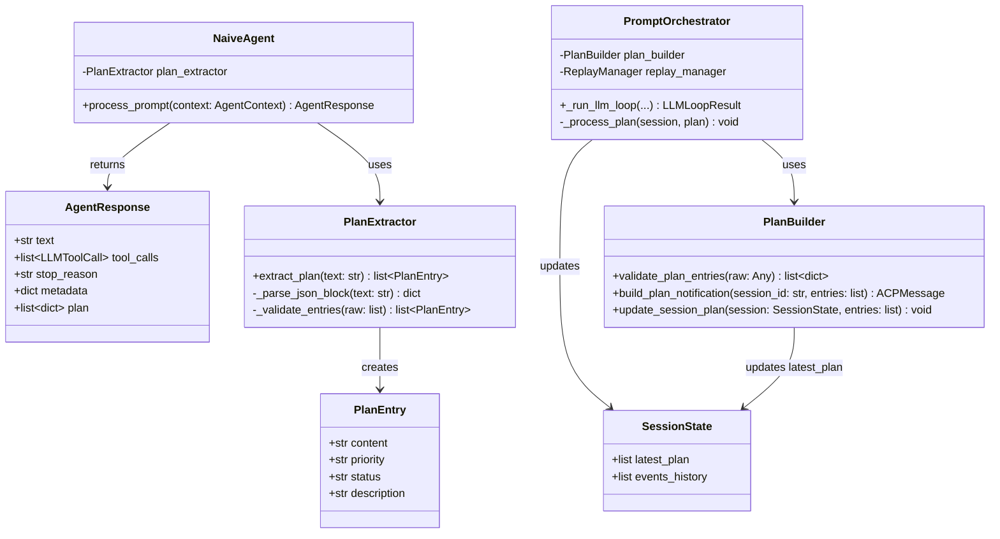
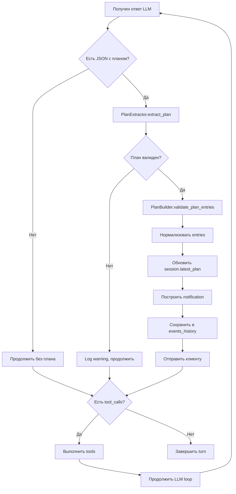

# Архитектура генерации планов LLM → Plan

> **Этап 7** — Интеграция генерации планов в LLM loop

## 1. Обзор

### 1.1 Цель

Реализовать автоматическую генерацию и обновление планов выполнения агентом на основе ответов LLM. План должен отражать текущую стратегию агента и динамически обновляться по мере выполнения задач.

### 1.2 Scope

- Извлечение структурированного плана из ответа LLM
- Расширение [`AgentResponse`](acp-server/src/acp_server/agent/base.py:27) полем `plan`
- Интеграция публикации плана в LLM loop
- Обновление system prompt для генерации планов

### 1.3 Требования протокола ACP

Согласно [Agent Plan спецификации](doc/Agent%20Client%20Protocol/protocol/11-Agent%20Plan.md):

**Формат notification:**
```json
{
  "jsonrpc": "2.0",
  "method": "session/update",
  "params": {
    "sessionId": "sess_abc123def456",
    "update": {
      "sessionUpdate": "plan",
      "entries": [
        {
          "content": "Описание задачи",
          "priority": "high",
          "status": "pending"
        }
      ]
    }
  }
}
```

**Обязательные поля PlanEntry:**

| Поле | Тип | Значения | Описание |
|------|-----|----------|----------|
| `content` | string | — | Описание задачи |
| `priority` | PlanEntryPriority | `high`, `medium`, `low` | Важность задачи |
| `status` | PlanEntryStatus | `pending`, `in_progress`, `completed` | Текущий статус |

**Правила протокола:**
- Агент **SHOULD** отправлять план через `session/update` notification
- Каждое обновление **MUST** содержать полный список entries (полная замена)
- Клиент **MUST** заменять текущий план полностью
- План **MAY** динамически изменяться (добавление/удаление/изменение entries)

## 2. Текущее состояние

### 2.1 Что уже реализовано

| Компонент | Статус | Описание |
|-----------|--------|----------|
| [`PlanBuilder`](acp-server/src/acp_server/protocol/handlers/plan_builder.py:22) | ✅ Готов | Валидация entries, построение notifications |
| [`ReplayManager`](acp-server/src/acp_server/protocol/handlers/replay_manager.py) | ✅ Готов | Сохранение/воспроизведение планов |
| [`SessionState.latest_plan`](acp-server/src/acp_server/protocol/state.py:49) | ✅ Готов | Хранение текущего плана |
| [`SessionState.events_history`](acp-server/src/acp_server/protocol/state.py:66) | ✅ Готов | Персистентная история событий |

### 2.2 Что требуется реализовать

| Компонент | Статус | Описание |
|-----------|--------|----------|
| `PlanExtractor` | ❌ Требуется | Извлечение плана из LLM response |
| [`AgentResponse.plan`](acp-server/src/acp_server/agent/base.py:27) | ❌ Требуется | Поле для передачи плана |
| System prompt | ❌ Требуется | Инструкции для LLM |
| Интеграция в LLM loop | ❌ Требуется | Публикация плана |

## 3. Архитектура решения

### 3.1 Подход: Structured Output

LLM будет генерировать план в JSON формате внутри ответа. Используем два варианта:

1. **JSON в markdown code block** — парсинг из текстового ответа
2. **Tool call `update_plan`** — LLM вызывает специальный tool для обновления плана

**Рекомендуется вариант 2** как более надежный и соответствующий архитектуре tool calling.

### 3.2 Высокоуровневая архитектура



### 3.3 Поток данных



## 4. Компоненты

### 4.1 PlanExtractor

Новый модуль для извлечения плана из ответа LLM.

**Расположение:** `acp-server/src/acp_server/agent/plan_extractor.py`

```python
@dataclass
class PlanEntry:
    content: str
    priority: Literal["low", "medium", "high"]
    status: Literal["pending", "in_progress", "completed"]
    description: str = ""


class PlanExtractor:
    """Извлекает план из текстового ответа LLM.
    
    Поддерживает форматы:
    - JSON в markdown code block: ```json {"plan": [...]} ```
    - Inline JSON объект с ключом "plan"
    """
    
    def extract_plan(self, text: str) -> list[PlanEntry] | None:
        """Извлечь план из текста ответа LLM."""
        ...
    
    def _parse_json_block(self, text: str) -> dict | None:
        """Найти и распарсить JSON из markdown code block."""
        ...
    
    def _validate_entries(self, raw: list) -> list[PlanEntry]:
        """Валидировать и нормализовать entries."""
        ...
```

### 4.2 Изменения в AgentResponse

**Файл:** [`acp-server/src/acp_server/agent/base.py`](acp-server/src/acp_server/agent/base.py:26)

```python
@dataclass
class AgentResponse:
    """Ответ агента после обработки prompt."""
    
    text: str
    tool_calls: list[LLMToolCall]
    stop_reason: str  # "end_turn", "tool_use", "max_tokens", "error"
    metadata: dict[str, Any] = field(default_factory=dict)
    
    # НОВОЕ ПОЛЕ:
    plan: list[dict[str, str]] | None = None  # План выполнения
```

### 4.3 Изменения в NaiveAgent

**Файл:** [`acp-server/src/acp_server/agent/naive.py`](acp-server/src/acp_server/agent/naive.py:56)

```python
async def process_prompt(self, context: AgentContext) -> AgentResponse:
    # ... существующий код ...
    
    # НОВОЕ: Извлечь план из ответа
    plan_extractor = PlanExtractor()
    extracted_plan = plan_extractor.extract_plan(response.text)
    
    return AgentResponse(
        text=response.text,
        tool_calls=response.tool_calls,
        stop_reason=response.stop_reason,
        plan=extracted_plan,  # НОВОЕ
        metadata={"iterations": iteration},
    )
```

### 4.4 Изменения в PromptOrchestrator

**Файл:** [`acp-server/src/acp_server/protocol/handlers/prompt_orchestrator.py`](acp-server/src/acp_server/protocol/handlers/prompt_orchestrator.py:885)

Добавить обработку плана в [`_run_llm_loop`](acp-server/src/acp_server/protocol/handlers/prompt_orchestrator.py:885):

```python
async def _run_llm_loop(self, ...) -> LLMLoopResult:
    # ... существующий код получения agent_response ...
    
    # НОВОЕ: Обработка плана из agent_response
    if agent_response.plan:
        validated_plan = self.plan_builder.validate_plan_entries(agent_response.plan)
        if validated_plan:
            # Обновить состояние сессии
            self.plan_builder.update_session_plan(session, validated_plan)
            
            # Построить и отправить notification
            plan_notification = self.plan_builder.build_plan_notification(
                session_id, validated_plan
            )
            notifications.append(plan_notification)
            
            # Сохранить в events_history для replay
            self.replay_manager.save_plan(session, validated_plan)
    
    # ... продолжение существующего кода ...
```

### 4.5 System Prompt для генерации планов

**Файл:** `acp-server/src/acp_server/agent/prompts/plan_instructions.py`

```python
PLAN_GENERATION_INSTRUCTIONS = """
## Планирование задач

При работе над сложными задачами, которые требуют нескольких шагов:

1. Создай план выполнения в формате JSON
2. Обнови план по мере выполнения задач
3. Отмечай статус каждого шага

### Формат плана

Включай JSON блок в свой ответ когда нужно создать или обновить план:

```json
{
  "plan": [
    {
      "content": "Описание задачи",
      "priority": "high|medium|low",
      "status": "pending|in_progress|completed",
      "description": "Детальное описание (опционально)"
    }
  ]
}
```

### Правила:
- Всегда отправляй ПОЛНЫЙ список задач при каждом обновлении
- Обновляй status когда начинаешь или завершаешь задачу
- Используй priority для указания важности
- Добавляй новые задачи если обнаруживаешь дополнительные требования
"""
```

## 5. Class Diagram



## 6. Flow Diagram: Обновление статусов плана



## 7. Альтернативный подход: Plan как Tool

Вместо парсинга JSON из текста, можно использовать специальный tool `update_plan`:

```python
UPDATE_PLAN_TOOL = {
    "type": "function",
    "function": {
        "name": "update_plan",
        "description": "Обновить план выполнения задачи",
        "parameters": {
            "type": "object",
            "properties": {
                "entries": {
                    "type": "array",
                    "items": {
                        "type": "object",
                        "properties": {
                            "content": {"type": "string"},
                            "priority": {"enum": ["low", "medium", "high"]},
                            "status": {"enum": ["pending", "in_progress", "completed"]},
                            "description": {"type": "string"}
                        },
                        "required": ["content", "priority", "status"]
                    }
                }
            },
            "required": ["entries"]
        }
    }
}
```

**Преимущества:**
- Структурированный output гарантирован
- Валидация на уровне LLM API
- Единообразие с другими tools

**Недостатки:**
- Требует обработки как специальный tool call
- Может конфликтовать с обычными tool calls

## 8. План реализации

### Шаг 1: Создать PlanExtractor

**Файлы:**
- `acp-server/src/acp_server/agent/plan_extractor.py` — модуль извлечения
- `acp-server/tests/test_plan_extractor.py` — тесты

**Задачи:**
- Реализовать парсинг JSON из markdown code block
- Реализовать валидацию и нормализацию entries
- Покрыть edge cases тестами

### Шаг 2: Расширить AgentResponse

**Файлы:**
- `acp-server/src/acp_server/agent/base.py` — добавить поле `plan`

**Задачи:**
- Добавить поле `plan: list[dict[str, str]] | None = None`
- Обновить docstring

### Шаг 3: Интегрировать в NaiveAgent

**Файлы:**
- `acp-server/src/acp_server/agent/naive.py` — использовать PlanExtractor

**Задачи:**
- Импортировать и инстанцировать PlanExtractor
- Извлекать план после получения ответа LLM
- Передавать план в AgentResponse

### Шаг 4: Интегрировать в PromptOrchestrator

**Файлы:**
- `acp-server/src/acp_server/protocol/handlers/prompt_orchestrator.py`

**Задачи:**
- Обработать `agent_response.plan` в `_run_llm_loop`
- Вызвать PlanBuilder для валидации и notification
- Сохранить в events_history через ReplayManager

### Шаг 5: Создать system prompt инструкции

**Файлы:**
- `acp-server/src/acp_server/agent/prompts/plan_instructions.py`

**Задачи:**
- Написать инструкции для LLM
- Интегрировать в NaiveAgent system prompt

### Шаг 6: Интеграционные тесты

**Файлы:**
- `acp-server/tests/test_plan_generation_integration.py`

**Задачи:**
- Тест end-to-end flow с mock LLM
- Тест обновления статусов
- Тест persistence через ReplayManager

## 9. Тестирование

### Unit тесты

| Компонент | Тесты |
|-----------|-------|
| PlanExtractor | Парсинг JSON, валидация, edge cases |
| AgentResponse | Сериализация с планом |
| NaiveAgent | Интеграция с extractor |

### Integration тесты

| Сценарий | Описание |
|----------|----------|
| Full flow | prompt → LLM → plan → notification |
| Plan update | Обновление статусов в течение turn |
| Replay | session/load восстанавливает план |

## 10. Риски и митигация

| Риск | Митигация |
|------|-----------|
| LLM не генерирует валидный JSON | Fallback: игнорировать невалидный план |
| Слишком частые обновления плана | Rate limiting на notification |
| Конфликт с tool calls | Обрабатывать план отдельно от tool execution |

## 11. Сравнение с другими проектами

### 11.1 RooCode / Cline

**RooCode** (ранее Roo-Cline) использует несколько подходов к планированию:

**Mode-based Planning:**
- Architect Mode создаёт план в виде markdown файла
- План содержит шаги, которые выполняются в Code Mode
- Человекочитаемый формат, не структурированные данные

**Todo List (Checklist):**
```markdown
- [ ] Шаг 1: Анализ требований
- [-] Шаг 2: Реализация (в процессе)
- [x] Шаг 3: Завершено
```

**System Prompt Instructions:**
- Агент получает инструкции думать пошагово
- План описывается в текстовом ответе

### 11.2 Сравнение подходов

| Аспект | RooCode | ACP (наша реализация) |
|--------|---------|----------------------|
| **Формат плана** | Markdown checklist | Структурированный JSON |
| **Хранение** | Файл в проекте | SessionState.latest_plan |
| **Передача клиенту** | Нет (только файл) | session/update notification |
| **Real-time updates** | Нет | Да (WebSocket) |
| **Persistence** | Файловая система | events_history + storage |
| **Валидация** | Нет | PlanBuilder.validate_plan_entries |
| **Priority/Status** | Только checkbox | high/medium/low + pending/in_progress/completed |

### 11.3 Другие подходы в индустрии

**AutoGPT / BabyAGI:**
- Task decomposition с приоритетами
- Хранение в памяти (не персистентное)
- Нет UI для плана

**LangChain Plan-and-Execute:**
- Отдельный LLM call для создания плана
- План как list of steps
- Не структурированный формат

**OpenAI Assistants API:**
- Нет явного плана
- Агент решает следующий шаг динамически
- План не exposed для клиента

### 11.4 Преимущества и недостатки каждого подхода

#### RooCode (Markdown Checklist в файле)

| Преимущества | Недостатки |
|--------------|------------|
| ✅ Простота реализации | ❌ Нет real-time sync с UI |
| ✅ Человекочитаемый формат | ❌ Требует парсинга для UI |
| ✅ Версионируется в Git | ❌ Конфликты при merge |
| ✅ Работает offline | ❌ Нет валидации структуры |
| ✅ Легко редактировать вручную | ❌ Нет приоритетов (только status) |

#### AutoGPT / BabyAGI (In-memory task queue)

| Преимущества | Недостатки |
|--------------|------------|
| ✅ Автономное планирование | ❌ Нет persistence |
| ✅ Динамическое перепланирование | ❌ Потеря плана при перезапуске |
| ✅ Приоритизация задач | ❌ Нет интеграции с клиентом |
| ✅ Параллельное выполнение | ❌ Сложная отладка |

#### LangChain Plan-and-Execute

| Преимущества | Недостатки |
|--------------|------------|
| ✅ Отдельный planning step | ❌ Дополнительный LLM call (cost) |
| ✅ Можно использовать разные LLM | ❌ Увеличенная latency |
| ✅ Декомпозиция сложных задач | ❌ План статичен после создания |
| ✅ Интеграция с LangChain ecosystem | ❌ Нет real-time updates |

#### ACP Structured JSON (наш подход)

| Преимущества | Недостатки |
|--------------|------------|
| ✅ Real-time sync через WebSocket | ❌ Зависит от LLM генерировать JSON |
| ✅ Persistence в events_history | ❌ Сложнее парсинг из текста |
| ✅ Replay при session/load | ❌ Overhead на notification |
| ✅ Валидация через PlanBuilder | ❌ Требует system prompt tuning |
| ✅ Priority + Status + Description | ❌ Больше кода для поддержки |
| ✅ UI-ready формат | |
| ✅ Соответствует протоколу ACP | |

### 11.5 Рекомендация

**Для ACP-протокола рекомендуется наш подход** по следующим причинам:

1. **Соответствие спецификации** — ACP определяет формат `session/update: plan`
2. **UX** — пользователь видит план в реальном времени
3. **Восстановление** — план сохраняется при перезагрузке сессии
4. **Интеграция** — единообразие с другими session/update types

**Опционально можно добавить:**
- Export в markdown для совместимости с RooCode workflows
- Fallback на текстовый план если JSON не распарсился

## 12. Метрики успеха

- План корректно извлекается из 95%+ ответов с планом
- Notifications отправляются клиенту
- План сохраняется и восстанавливается при session/load
- Все тесты проходят
