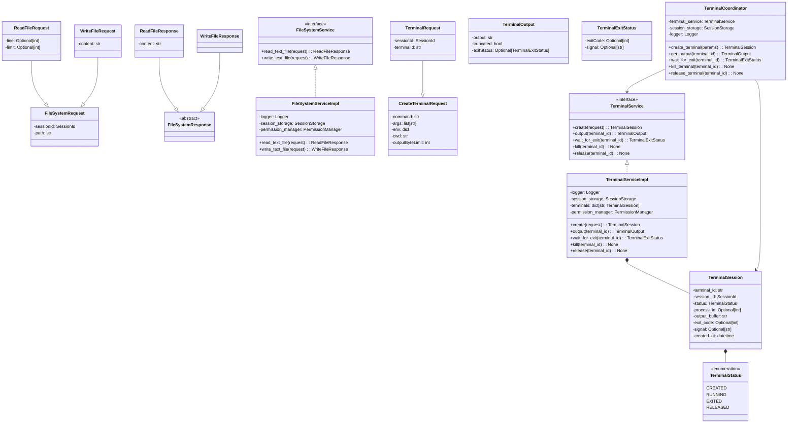
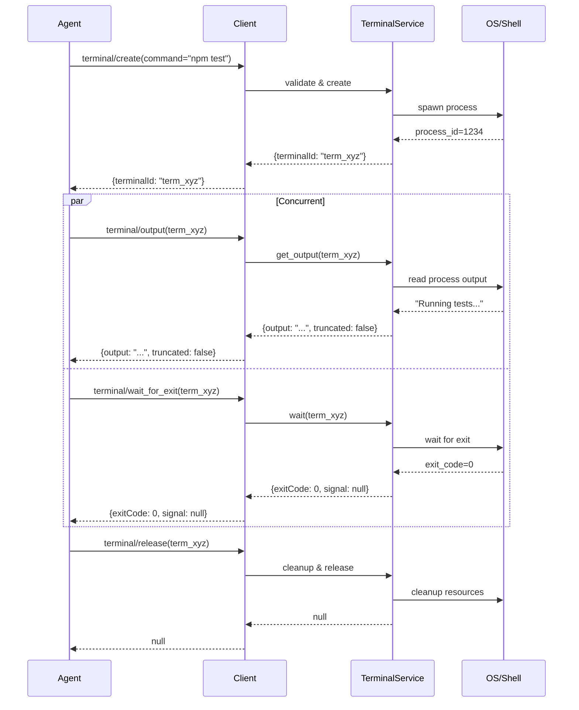
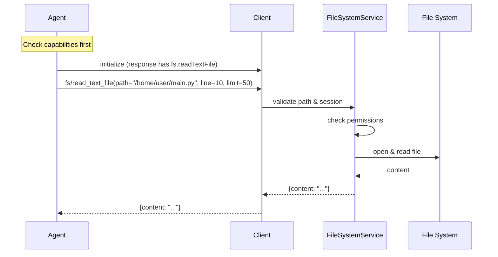
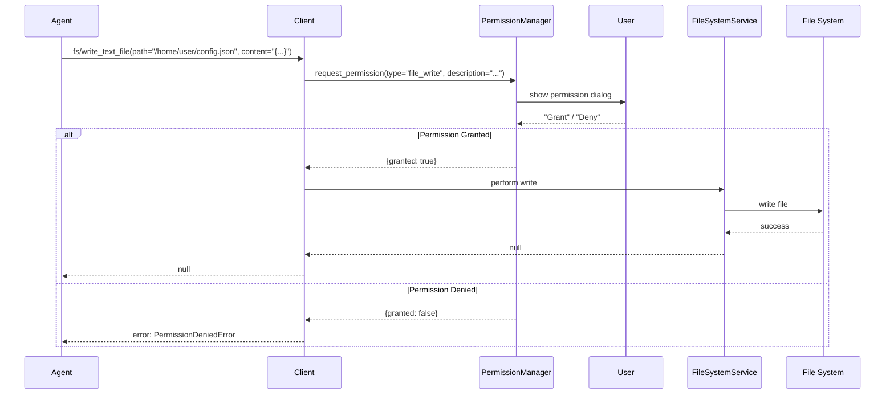
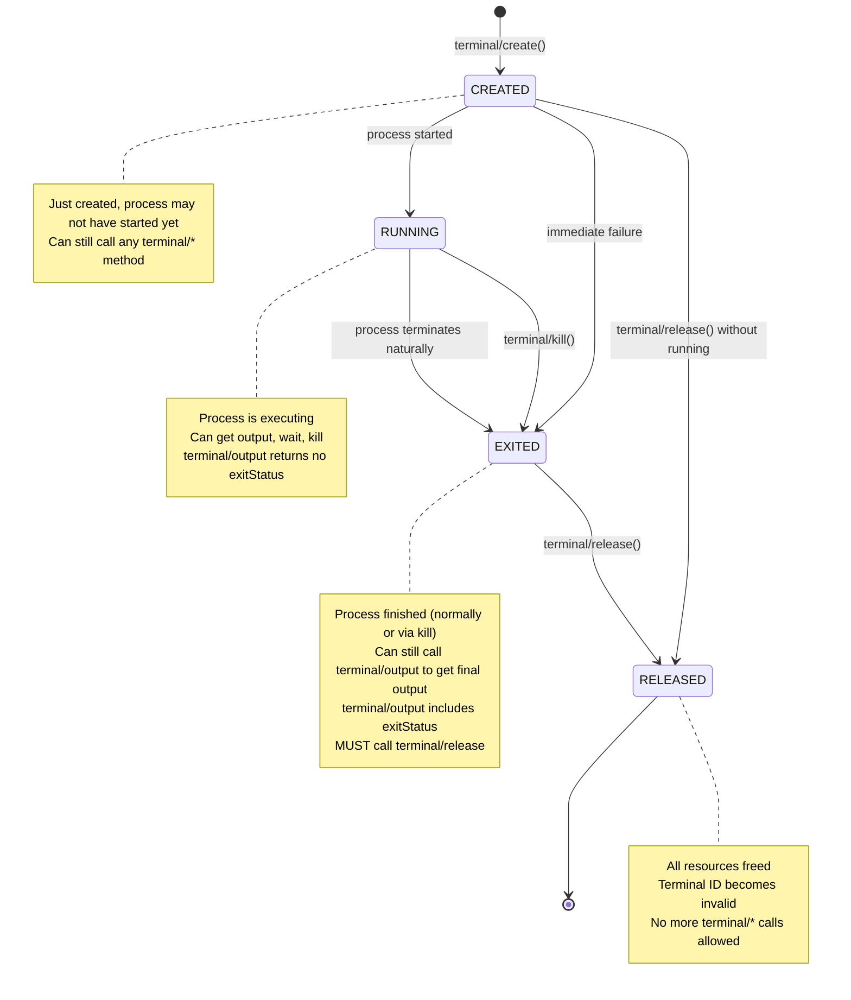
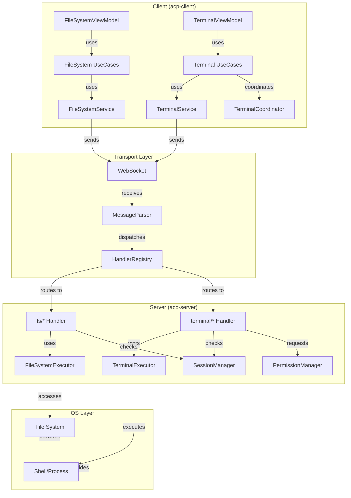

# Архитектура File System и Terminal методов в ACP протоколе

## Содержание

1. [Обзор](#обзор)
2. [File System методы](#file-system-методы)
3. [Terminal методы](#terminal-методы)
4. [Архитектура реализации](#архитектура-реализации)
5. [Безопасность и разрешения](#безопасность-и-разрешения)
6. [Обработка ошибок](#обработка-ошибок)
7. [Интеграция с существующими компонентами](#интеграция-с-существующими-компонентами)
8. [Диаграммы](#диаграммы)
9. [План реализации](#план-реализации)

---

## Обзор

Документ описывает архитектуру реализации клиентских методов для работы с файловой системой (File System) и терминалом (Terminal) согласно спецификации ACP протокола ([09-File System.md](../Agent%20Client%20Protocol/protocol/09-File System.md) и [10-Terminal.md](../Agent%20Client%20Protocol/protocol/10-Terminal.md)).

### Назначение методов

**File System методы** предоставляют агентам возможность:
- Читать файлы с клиентской машины, включая несохраненные изменения в редакторе
- Записывать и обновлять текстовые файлы в файловой системе клиента
- Организовать доступ к исходному коду, конфигурациям и другим текстовым ресурсам

**Terminal методы** позволяют агентам:
- Выполнять произвольные shell команды в окружении клиента
- Контролировать процессы (остановка, получение результата)
- Потреблять output в реальном времени для встраивания в tool calls
- Реализовывать таймауты и асинхронное выполнение команд

### Ключевые требования

1. **Проверка возможностей (Capability Check)** перед использованием методов
2. **Асинхронное выполнение** команд без блокирования агента
3. **Управление ресурсами** — явное завершение и освобождение терминалов
4. **Потоковая доставка** output для встраивания в UI
5. **Полное соответствие спецификации** ACP протокола

---

## File System методы

### Обзор

Два метода для работы с текстовыми файлами:
1. `fs/read_text_file` — чтение файлов
2. `fs/write_text_file` — запись файлов

### 1. fs/read_text_file

Метод для чтения текстовых файлов с клиентской машины, включая несохраненные изменения в редакторе.

#### Сигнатура

```json
{
  "jsonrpc": "2.0",
  "id": 3,
  "method": "fs/read_text_file",
  "params": {
    "sessionId": "sess_abc123def456",
    "path": "/home/user/project/src/main.py",
    "line": 10,
    "limit": 50
  }
}
```

#### Параметры

| Параметр | Тип | Обязателен | Описание |
|----------|-----|-----------|---------|
| `sessionId` | SessionId | Да | ID сессии для трассировки контекста |
| `path` | string | Да | Абсолютный путь к файлу на клиенте |
| `line` | number | Нет | Номер строки для начала чтения (1-based). Если не задан, начинается с начала файла |
| `limit` | number | Нет | Максимальное количество строк для чтения. Если не задан, читается весь файл |

#### Валидация параметров

1. `sessionId` — должен быть валидным ID существующей сессии
2. `path` — должен быть абсолютным путем
3. `line` — если задан, должен быть ≥ 1
4. `limit` — если задан, должен быть ≥ 1

#### Требования к разрешениям

- Требует проверки `clientCapabilities.fs.readTextFile == true` перед вызовом
- Должна быть запрошена явная пермиссия пользователя на чтение файла (опционально, зависит от конфигурации агента)
- Агент не может читать файлы за пределами санкционированных директорий (если настроены ограничения)

#### Ответ

```json
{
  "jsonrpc": "2.0",
  "id": 3,
  "result": {
    "content": "def hello_world():\n    print('Hello, world!')\n"
  }
}
```

| Поле | Тип | Описание |
|------|-----|---------|
| `content` | string | Содержимое файла (полное или частичное в зависимости от параметров) |

#### Обработка ошибок

| Ошибка | Код | Описание |
|--------|-----|---------|
| File not found | -32602 (Invalid params) | Файл не существует по указанному пути |
| Access denied | -32600 (Invalid Request) | Нет разрешения на чтение файла |
| Invalid session | -32602 | SessionId не является валидной сессией |
| Path traversal | -32602 | Попытка доступа за пределы разрешенной директории |

#### Примеры использования

**Пример 1: Чтение всего файла**
```json
{
  "jsonrpc": "2.0",
  "id": 101,
  "method": "fs/read_text_file",
  "params": {
    "sessionId": "sess_abc123",
    "path": "/home/user/config.json"
  }
}
```

**Пример 2: Чтение части файла (строки 10-60)**
```json
{
  "jsonrpc": "2.0",
  "id": 102,
  "method": "fs/read_text_file",
  "params": {
    "sessionId": "sess_abc123",
    "path": "/home/user/src/main.py",
    "line": 10,
    "limit": 50
  }
}
```

---

### 2. fs/write_text_file

Метод для записи или обновления текстовых файлов на клиентской машине.

#### Сигнатура

```json
{
  "jsonrpc": "2.0",
  "id": 4,
  "method": "fs/write_text_file",
  "params": {
    "sessionId": "sess_abc123def456",
    "path": "/home/user/project/config.json",
    "content": "{\n  \"debug\": true,\n  \"version\": \"1.0.0\"\n}"
  }
}
```

#### Параметры

| Параметр | Тип | Обязателен | Описание |
|----------|-----|-----------|---------|
| `sessionId` | SessionId | Да | ID сессии для трассировки контекста |
| `path` | string | Да | Абсолютный путь к файлу. Клиент ДОЛЖЕН создать файл, если он не существует |
| `content` | string | Да | Содержимое для записи в файл |

#### Валидация параметров

1. `sessionId` — должен быть валидным ID существующей сессии
2. `path` — должен быть абсолютным путем
3. `content` — может быть пустой строкой, но должна быть строкой

#### Требования к разрешениям

- Требует проверки `clientCapabilities.fs.writeTextFile == true` перед вызовом
- Должна быть запрошена явная пермиссия пользователя на запись файла (обязательно)
- Обычно требует подтверждения пользователя через `session/request_permission`
- Агент не может писать в системные директории

#### Ответ

```json
{
  "jsonrpc": "2.0",
  "id": 4,
  "result": null
}
```

При успехе возвращается `null`.

#### Обработка ошибок

| Ошибка | Код | Описание |
|--------|-----|---------|
| Access denied | -32600 (Invalid Request) | Нет разрешения на запись в директорию |
| Invalid session | -32602 | SessionId не является валидной сессией |
| Permission denied | -32600 | Пользователь отклонил запрос на запись |
| Path traversal | -32602 | Попытка записи за пределы разрешенной директории |
| Disk space | -32603 | Недостаточно места на диске |

#### Примеры использования

**Пример 1: Создание нового файла**
```json
{
  "jsonrpc": "2.0",
  "id": 201,
  "method": "fs/write_text_file",
  "params": {
    "sessionId": "sess_abc123",
    "path": "/home/user/new_file.txt",
    "content": "Initial content\nLine 2\nLine 3"
  }
}
```

**Пример 2: Обновление существующего файла**
```json
{
  "jsonrpc": "2.0",
  "id": 202,
  "method": "fs/write_text_file",
  "params": {
    "sessionId": "sess_abc123",
    "path": "/home/user/config.json",
    "content": "{\"updated\": true, \"timestamp\": \"2024-01-15\"}"
  }
}
```

---

## Terminal методы

### Обзор

Набор методов для создания, управления и контроля терминальных сессий:
1. `terminal/create` — создание и запуск команды
2. `terminal/output` — получение текущего output
3. `terminal/wait_for_exit` — ожидание завершения команды
4. `terminal/kill` — завершение команды без освобождения терминала
5. `terminal/release` — освобождение ресурсов терминала

### 1. terminal/create

Метод для создания нового терминала и запуска команды в фоновом режиме.

#### Сигнатура

```json
{
  "jsonrpc": "2.0",
  "id": 5,
  "method": "terminal/create",
  "params": {
    "sessionId": "sess_abc123def456",
    "command": "npm",
    "args": ["test", "--coverage"],
    "env": [
      {
        "name": "NODE_ENV",
        "value": "test"
      },
      {
        "name": "DEBUG",
        "value": "true"
      }
    ],
    "cwd": "/home/user/project",
    "outputByteLimit": 1048576
  }
}
```

#### Параметры

| Параметр | Тип | Обязателен | Описание |
|----------|-----|-----------|---------|
| `sessionId` | SessionId | Да | ID сессии для трассировки контекста |
| `command` | string | Да | Команда для выполнения (e.g., "npm", "python", "bash") |
| `args` | string[] | Нет | Массив аргументов команды |
| `env` | EnvVariable[] | Нет | Массив переменных окружения: {name, value} |
| `cwd` | string | Нет | Абсолютный путь рабочей директории (по умолчанию текущая директория клиента) |
| `outputByteLimit` | number | Нет | Максимум байт для буферизации output (по умолчанию 10 MB) |

#### Валидация параметров

1. `sessionId` — должен быть валидным ID существующей сессии
2. `command` — не может быть пустой строкой
3. `args` — каждый элемент должен быть строкой
4. `cwd` — если задан, должен быть абсолютным путем и существовать
5. `outputByteLimit` — если задан, должен быть > 0

#### Требования к разрешениям

- Требует проверки `clientCapabilities.terminal == true` перед вызовом
- Обычно требует явного подтверждения пользователя (зависит от конфигурации)
- Может быть ограничено к определенным командам (белый список)

#### Ответ

```json
{
  "jsonrpc": "2.0",
  "id": 5,
  "result": {
    "terminalId": "term_xyz789"
  }
}
```

| Поле | Тип | Описание |
|------|-----|---------|
| `terminalId` | string | Уникальный идентификатор терминала для последующих операций |

#### Обработка ошибок

| Ошибка | Код | Описание |
|--------|-----|---------|
| Invalid session | -32602 | SessionId не является валидной сессией |
| Permission denied | -32600 | Нет разрешения на выполнение команд |
| Command not found | -32603 (Server error) | Команда не найдена в системе |
| Invalid cwd | -32602 | Рабочая директория не существует |
| Unsupported command | -32600 | Команда в черном списке или не разрешена |

#### Примеры использования

**Пример 1: Запуск npm тестов**
```json
{
  "jsonrpc": "2.0",
  "id": 301,
  "method": "terminal/create",
  "params": {
    "sessionId": "sess_abc123",
    "command": "npm",
    "args": ["test"],
    "cwd": "/home/user/project"
  }
}
```

**Пример 2: Запуск Python скрипта с переменными окружения**
```json
{
  "jsonrpc": "2.0",
  "id": 302,
  "method": "terminal/create",
  "params": {
    "sessionId": "sess_abc123",
    "command": "python",
    "args": ["train.py", "--epochs=100"],
    "env": [
      {"name": "CUDA_VISIBLE_DEVICES", "value": "0"},
      {"name": "LOG_LEVEL", "value": "DEBUG"}
    ],
    "cwd": "/home/user/ml-project",
    "outputByteLimit": 5242880
  }
}
```

---

### 2. terminal/output

Метод для получения текущего output терминала без ожидания его завершения.

#### Сигнатура

```json
{
  "jsonrpc": "2.0",
  "id": 6,
  "method": "terminal/output",
  "params": {
    "sessionId": "sess_abc123def456",
    "terminalId": "term_xyz789"
  }
}
```

#### Параметры

| Параметр | Тип | Обязателен | Описание |
|----------|-----|-----------|---------|
| `sessionId` | SessionId | Да | ID сессии для трассировки контекста |
| `terminalId` | string | Да | ID терминала, возвращенный `terminal/create` |

#### Валидация параметров

1. `sessionId` — должен быть валидным ID существующей сессии
2. `terminalId` — должен быть валидным ID терминала

#### Требования к разрешениям

- Никаких дополнительных разрешений не требуется после создания терминала
- Агент может получать output неограниченное количество раз

#### Ответ

```json
{
  "jsonrpc": "2.0",
  "id": 6,
  "result": {
    "output": "Running tests...\n✓ All tests passed (42 total)\n",
    "truncated": false,
    "exitStatus": {
      "exitCode": 0,
      "signal": null
    }
  }
}
```

| Поле | Тип | Обязателен | Описание |
|------|-----|-----------|---------|
| `output` | string | Да | Полный captured output (или усеченный, если превышен limit) |
| `truncated` | boolean | Да | Был ли output усечен из-за byte limit |
| `exitStatus` | TerminalExitStatus | Нет | Присутствует только если процесс завершился; содержит exitCode и signal |

#### Обработка ошибок

| Ошибка | Код | Описание |
|--------|-----|---------|
| Invalid session | -32602 | SessionId не является валидной сессией |
| Invalid terminal | -32602 | TerminalId не существует или был освобожден |

#### Примеры использования

**Пример 1: Получение текущего output (процесс еще выполняется)**
```json
{
  "jsonrpc": "2.0",
  "id": 401,
  "method": "terminal/output",
  "params": {
    "sessionId": "sess_abc123",
    "terminalId": "term_xyz789"
  }
}

// Ответ (процесс еще работает)
{
  "jsonrpc": "2.0",
  "id": 401,
  "result": {
    "output": "Running tests...\n✓ Test 1 passed\n✓ Test 2 passed\n",
    "truncated": false
  }
}
```

**Пример 2: Получение output завершившегося процесса**
```json
{
  "jsonrpc": "2.0",
  "id": 402,
  "method": "terminal/output",
  "params": {
    "sessionId": "sess_abc123",
    "terminalId": "term_xyz789"
  }
}

// Ответ (процесс завершился)
{
  "jsonrpc": "2.0",
  "id": 402,
  "result": {
    "output": "Running tests...\n✓ All tests passed (42 total)\n",
    "truncated": false,
    "exitStatus": {
      "exitCode": 0,
      "signal": null
    }
  }
}
```

---

### 3. terminal/wait_for_exit

Метод для ожидания завершения команды (блокирует до выхода процесса).

#### Сигнатура

```json
{
  "jsonrpc": "2.0",
  "id": 7,
  "method": "terminal/wait_for_exit",
  "params": {
    "sessionId": "sess_abc123def456",
    "terminalId": "term_xyz789"
  }
}
```

#### Параметры

| Параметр | Тип | Обязателен | Описание |
|----------|-----|-----------|---------|
| `sessionId` | SessionId | Да | ID сессии для трассировки контекста |
| `terminalId` | string | Да | ID терминала, возвращенный `terminal/create` |

#### Валидация параметров

1. `sessionId` — должен быть валидным ID существующей сессии
2. `terminalId` — должен быть валидным ID терминала

#### Требования к разрешениям

- Никаких дополнительных разрешений не требуется

#### Ответ

```json
{
  "jsonrpc": "2.0",
  "id": 7,
  "result": {
    "exitCode": 0,
    "signal": null
  }
}
```

| Поле | Тип | Описание |
|------|-----|---------|
| `exitCode` | number | Exit code процесса (может быть null если завершен сигналом) |
| `signal` | string | Сигнал, который завершил процесс (может быть null если нормальный выход) |

#### Обработка ошибок

| Ошибка | Код | Описание |
|--------|-----|---------|
| Invalid session | -32602 | SessionId не является валидной сессией |
| Invalid terminal | -32602 | TerminalId не существует или был освобожден |

#### Особенности

- Этот метод может ждать длительное время (часы)
- Агент должен реализовать собственный таймаут, используя асинхронное выполнение
- После завершения процесса output может быть получен через `terminal/output`

#### Примеры использования

**Пример 1: Простое ожидание завершения**
```json
{
  "jsonrpc": "2.0",
  "id": 501,
  "method": "terminal/wait_for_exit",
  "params": {
    "sessionId": "sess_abc123",
    "terminalId": "term_xyz789"
  }
}

// Ответ (после завершения команды)
{
  "jsonrpc": "2.0",
  "id": 501,
  "result": {
    "exitCode": 0,
    "signal": null
  }
}
```

---

### 4. terminal/kill

Метод для завершения процесса без освобождения ресурсов терминала.

#### Сигнатура

```json
{
  "jsonrpc": "2.0",
  "id": 8,
  "method": "terminal/kill",
  "params": {
    "sessionId": "sess_abc123def456",
    "terminalId": "term_xyz789"
  }
}
```

#### Параметры

| Параметр | Тип | Обязателен | Описание |
|----------|-----|-----------|---------|
| `sessionId` | SessionId | Да | ID сессии для трассировки контекста |
| `terminalId` | string | Да | ID терминала, возвращенный `terminal/create` |

#### Валидация параметров

1. `sessionId` — должен быть валидным ID существующей сессии
2. `terminalId` — должен быть валидным ID терминала

#### Требования к разрешениям

- Никаких дополнительных разрешений не требуется (агент уже имел разрешение на создание терминала)

#### Ответ

```json
{
  "jsonrpc": "2.0",
  "id": 8,
  "result": null
}
```

Возвращает `null` при успехе.

#### Обработка ошибок

| Ошибка | Код | Описание |
|--------|-----|---------|
| Invalid session | -32602 | SessionId не является валидной сессией |
| Invalid terminal | -32602 | TerminalId не существует или был освобожден |
| Already exited | -32603 | Процесс уже завершен |

#### После вызова kill

- Терминал остается валидным для использования
- Можно вызвать `terminal/output` для получения финального output
- Можно вызвать `terminal/wait_for_exit` для получения exit status
- ОБЯЗАТЕЛЬНО нужно вызвать `terminal/release` для освобождения ресурсов

#### Примеры использования

**Пример: Реализация таймаута**
```json
// 1. Создание терминала
{
  "jsonrpc": "2.0",
  "id": 1,
  "method": "terminal/create",
  "params": {
    "sessionId": "sess_abc123",
    "command": "long_running_task"
  }
}
// => { "terminalId": "term_xyz789" }

// 2. Агент начинает ждать завершение с таймаутом
// (в реальной реализации это асинхронно)

// 3. Если таймаут истек, убиваем процесс
{
  "jsonrpc": "2.0",
  "id": 2,
  "method": "terminal/kill",
  "params": {
    "sessionId": "sess_abc123",
    "terminalId": "term_xyz789"
  }
}
// => null

// 4. Получаем final output
{
  "jsonrpc": "2.0",
  "id": 3,
  "method": "terminal/output",
  "params": {
    "sessionId": "sess_abc123",
    "terminalId": "term_xyz789"
  }
}
// => { "output": "...", "truncated": false, "exitStatus": {...} }

// 5. Освобождаем ресурсы
{
  "jsonrpc": "2.0",
  "id": 4,
  "method": "terminal/release",
  "params": {
    "sessionId": "sess_abc123",
    "terminalId": "term_xyz789"
  }
}
// => null
```

---

### 5. terminal/release

Метод для освобождения ресурсов терминала (убивает процесс если еще работает).

#### Сигнатура

```json
{
  "jsonrpc": "2.0",
  "id": 9,
  "method": "terminal/release",
  "params": {
    "sessionId": "sess_abc123def456",
    "terminalId": "term_xyz789"
  }
}
```

#### Параметры

| Параметр | Тип | Обязателен | Описание |
|----------|-----|-----------|---------|
| `sessionId` | SessionId | Да | ID сессии для трассировки контекста |
| `terminalId` | string | Да | ID терминала, возвращенный `terminal/create` |

#### Валидация параметров

1. `sessionId` — должен быть валидным ID существующей сессии
2. `terminalId` — должен быть валидным ID терминала

#### Требования к разрешениям

- Никаких дополнительных разрешений не требуется

#### Ответ

```json
{
  "jsonrpc": "2.0",
  "id": 9,
  "result": null
}
```

Возвращает `null` при успехе.

#### Обработка ошибок

| Ошибка | Код | Описание |
|--------|-----|---------|
| Invalid session | -32602 | SessionId не является валидной сессией |
| Invalid terminal | -32602 | TerminalId не существует или уже был освобожден |

#### Поведение при освобождении

1. Если процесс еще работает — убивается
2. Буфер output может быть очищен (но клиент должен хранить его для отображения в tool calls)
3. TerminalId становится инвалидным для всех последующих `terminal/*` вызовов
4. Если терминал был встроен в tool call — клиент продолжает отображать finalized output

#### Примеры использования

**Пример: Освобождение терминала после завершения**
```json
{
  "jsonrpc": "2.0",
  "id": 601,
  "method": "terminal/release",
  "params": {
    "sessionId": "sess_abc123",
    "terminalId": "term_xyz789"
  }
}

// Ответ
{
  "jsonrpc": "2.0",
  "id": 601,
  "result": null
}

// Все последующие вызовы с этим terminalId будут ошибочными
```

---

## Архитектура реализации

### Структура модулей

#### Клиентская сторона (acp-client)

```
acp-client/src/acp_client/
├── domain/
│   ├── file_system/
│   │   ├── __init__.py                 # Экспорт публичных классов
│   │   ├── entities.py                 # FileSystemRequest, FileSystemResponse
│   │   └── services.py                 # FileSystemService интерфейс
│   ├── terminal/
│   │   ├── __init__.py                 # Экспорт публичных классов
│   │   ├── entities.py                 # Terminal, TerminalSession dataclasses
│   │   ├── services.py                 # TerminalService интерфейс
│   │   └── events.py                   # TerminalOutputEvent, TerminalExitEvent
│   └── ...
├── application/
│   ├── file_system/
│   │   ├── __init__.py
│   │   └── use_cases.py                # ReadFileUseCase, WriteFileUseCase
│   ├── terminal/
│   │   ├── __init__.py
│   │   ├── use_cases.py                # CreateTerminalUseCase, GetOutputUseCase, WaitForExitUseCase
│   │   └── terminal_coordinator.py     # TerminalCoordinator (управление жизненным циклом)
│   └── ...
├── infrastructure/
│   ├── services/
│   │   ├── file_system_service.py      # Реализация FileSystemService
│   │   └── terminal_service.py         # Реализация TerminalService
│   ├── handler_registry.py             # Регистрация обработчиков fs/* и terminal/*
│   └── ...
└── presentation/
    ├── file_viewer_view_model.py       # ViewModel для просмотра файлов
    ├── terminal_view_model.py          # ViewModel для терминала
    └── ...
```

#### Серверная сторона (acp-server)

```
acp-server/src/acp_server/
├── protocol/
│   ├── handlers/
│   │   ├── file_system.py              # Обработчик fs/* методов
│   │   ├── terminal.py                 # Обработчик terminal/* методов
│   │   └── ...
│   └── ...
├── services/
│   ├── file_system_executor.py         # Исполнитель операций с файлами
│   └── terminal_executor.py            # Исполнитель операций с терминалом
├── models.py                           # Pydantic модели для fs/* и terminal/*
└── ...
```

### Иерархия классов

**File System:**
```
FileSystemRequest (dataclass)
├── path: str
├── sessionId: SessionId
└── ...

ReadFileRequest (FileSystemRequest)
├── line: Optional[int]
└── limit: Optional[int]

WriteFileRequest (FileSystemRequest)
└── content: str

FileSystemResponse (dataclass)
└── ...

ReadFileResponse (FileSystemResponse)
└── content: str

WriteFileResponse (FileSystemResponse)
└── # пусто (возвращается null)

FileSystemService (ABC)
├── read_text_file(request) -> ReadFileResponse
└── write_text_file(request) -> WriteFileResponse
```

**Terminal:**
```
TerminalSession (dataclass)
├── terminal_id: str
├── status: TerminalStatus  # created, running, exited, released
├── process_id: Optional[int]
├── output_buffer: str
├── exit_code: Optional[int]
├── signal: Optional[str]
└── created_at: datetime

Terminal (dataclass)
├── sessionId: SessionId
├── terminalId: str
├── command: str
├── args: list[str]
├── env: dict[str, str]
├── cwd: str
└── output_byte_limit: int

TerminalStatus (Enum)
├── CREATED
├── RUNNING
├── EXITED
└── RELEASED

TerminalService (ABC)
├── create(request) -> TerminalSession
├── output(terminal_id) -> TerminalOutput
├── wait_for_exit(terminal_id) -> TerminalExitStatus
├── kill(terminal_id) -> None
└── release(terminal_id) -> None

TerminalCoordinator (управление жизненным циклом)
├── create_terminal(params) -> TerminalSession
├── get_output(terminal_id, session_id) -> TerminalOutput
├── wait_for_exit(terminal_id, session_id) -> TerminalExitStatus
├── kill_terminal(terminal_id, session_id) -> None
└── release_terminal(terminal_id, session_id) -> None
```

### Взаимодействие компонентов

```
┌─────────────┐
│   Client    │  Отправляет JSON-RPC запросы
└──────┬──────┘
       │
       ▼
┌─────────────────────────┐
│  Transport Layer        │  WebSocket / TCP
│  (http_server.py)       │
└──────┬──────────────────┘
       │
       ▼
┌─────────────────────────┐
│  Message Parser         │  Парсит JSON-RPC
│  (message_parser.py)    │
└──────┬──────────────────┘
       │
       ▼
┌─────────────────────────┐
│  Handler Registry       │  Диспетчеризует методы
│  (handler_registry.py)  │
└──────┬──────────────────┘
       │
   ┌───┴───┐
   │       │
   ▼       ▼
┌────────────────┐  ┌─────────────────┐
│  fs/* Handler  │  │ terminal/* ...  │
│ (file_system.py)  │ (terminal.py)   │
└────┬───────────┘  └────┬────────────┘
     │                   │
     ▼                   ▼
┌──────────────────┐  ┌─────────────────┐
│ FileSystemService│  │ TerminalService │
│ (infrastructure) │  │ (infrastructure)│
└──────┬───────────┘  └────┬────────────┘
       │                   │
       ▼                   ▼
┌──────────────────┐  ┌─────────────────┐
│ File System      │  │ Process/Shell   │
│ Operations       │  │ Execution       │
└──────────────────┘  └─────────────────┘
```

---

## Безопасность и разрешения

### Модель доступа

#### Проверка возможностей (Capability Check)

Перед вызовом любого метода агент ДОЛЖЕН проверить `clientCapabilities`:

**Для File System методов:**
```python
if not client_capabilities.get("fs", {}).get("readTextFile"):
    raise ClientNotSupportedError("File reading not supported")

if not client_capabilities.get("fs", {}).get("writeTextFile"):
    raise ClientNotSupportedError("File writing not supported")
```

**Для Terminal методов:**
```python
if not client_capabilities.get("terminal"):
    raise ClientNotSupportedError("Terminal not supported")
```

#### Управление разрешениями

**File System:**
1. `fs/read_text_file`:
   - Требует проверки capability
   - Может требовать per-file разрешения (зависит от конфигурации агента)
   - Может быть ограничено списком разрешенных директорий

2. `fs/write_text_file`:
   - Требует проверки capability
   - **ОБЯЗАТЕЛЬНО** требует явного разрешения пользователя
   - Использует `session/request_permission` API
   - Может быть ограничено списком разрешенных директорий

**Terminal:**
1. `terminal/create`:
   - Требует проверки capability
   - Требует явного разрешения пользователя (HIGH risk операция)
   - Может быть ограничено белым списком команд
   - Может быть ограничено черным списком команд

2. `terminal/output`, `terminal/wait_for_exit`, `terminal/kill`, `terminal/release`:
   - Требуют только что терминал был ранее создан с разрешением

### Стратегия валидации пути

Для предотвращения path traversal атак:

```python
def validate_file_path(path: str, allowed_roots: list[str]) -> bool:
    """Проверяет, что path находится в allowed_roots"""
    abs_path = os.path.abspath(path)
    
    for root in allowed_roots:
        abs_root = os.path.abspath(root)
        if abs_path.startswith(abs_root):
            # Проверяем, что нет symlink-атак
            if os.path.islink(os.path.dirname(abs_path)):
                return False
            return True
    
    return False
```

### Черный список команд

Некоторые команды должны быть заблокированы по умолчанию:
- `rm -rf /` — удаление всей системы
- `dd if=/dev/zero of=/dev/sda` — уничтожение диска
- `fork bomb` — замораживание системы
- Системные утилиты для изменения конфигурации ОС

Черный список должен быть конфигурируемым.

### Белый список команд

Альтернативно, можно использовать белый список разрешенных команд:
```python
WHITELIST = {
    "npm": ["test", "run", "build"],
    "python": ["train.py", "test.py"],
    "node": ["*.js"],
}
```

---

## Обработка ошибок

### Иерархия исключений

```python
class FileSystemError(ACPError):
    """Базовая ошибка для файловой системы"""
    pass

class FileNotFoundError(FileSystemError):
    """Файл не найден"""
    pass

class PermissionDeniedError(FileSystemError):
    """Доступ запрещен"""
    pass

class PathTraversalError(FileSystemError):
    """Попытка доступа за пределы разрешенной директории"""
    pass

class TerminalError(ACPError):
    """Базовая ошибка для терминала"""
    pass

class InvalidTerminalError(TerminalError):
    """Терминал не существует или был освобожден"""
    pass

class TerminalAlreadyExitedError(TerminalError):
    """Процесс уже завершен"""
    pass

class CommandNotFoundError(TerminalError):
    """Команда не найдена"""
    pass

class UnsupportedCommandError(TerminalError):
    """Команда в черном списке"""
    pass
```

### Отображение ошибок в JSON-RPC

```python
# File not found
{
  "jsonrpc": "2.0",
  "id": 3,
  "error": {
    "code": -32602,
    "message": "Invalid params",
    "data": {
      "reason": "File not found: /home/user/missing.txt"
    }
  }
}

# Permission denied
{
  "jsonrpc": "2.0",
  "id": 4,
  "error": {
    "code": -32600,
    "message": "Invalid Request",
    "data": {
      "reason": "Permission denied for /etc/passwd"
    }
  }
}

# Invalid terminal
{
  "jsonrpc": "2.0",
  "id": 6,
  "error": {
    "code": -32602,
    "message": "Invalid params",
    "data": {
      "reason": "Terminal 'term_invalid' does not exist"
    }
  }
}
```

### Стратегия логирования ошибок

```python
# Все ошибки логируются с контекстом
logger.error(
    "File read failed",
    error_type=type(e).__name__,
    session_id=session_id,
    path=path,
    line=line,
    limit=limit
)

# Terminal ошибки также логируют состояние процесса
logger.error(
    "Terminal operation failed",
    error_type=type(e).__name__,
    session_id=session_id,
    terminal_id=terminal_id,
    status=terminal_session.status,
    exit_code=terminal_session.exit_code
)
```

---

## Интеграция с существующими компонентами

### Интеграция с Session Management

File System и Terminal методы требуют активной сессии:

```python
# В handler'е проверяем сессию
session = self.session_storage.load(session_id)
if not session:
    raise InvalidSessionError(f"Session {session_id} not found")

# Все операции привязаны к сессии
file_read_operation.session_id = session_id
terminal_session.session_id = session_id
```

### Интеграция с Permission System

Terminal методы используют существующий `session/request_permission` API:

```python
# При создании терминала запрашиваем разрешение
permission_request = PermissionRequest(
    type="terminal",
    description=f"Execute command: {command} {' '.join(args)}",
    decision_required=True
)

# Блокируем до получения разрешения
permission_result = await self.permission_manager.request(permission_request)
if not permission_result.granted:
    raise PermissionDeniedError("User rejected terminal creation")
```

Write File методы также используют `session/request_permission`:

```python
permission_request = PermissionRequest(
    type="file_write",
    description=f"Write to file: {path}",
    decision_required=True
)
```

### Интеграция с Tool Calls

Terminal output может быть встроен в tool calls для реального времени отображения:

```python
# Создаем tool call с встроенным терминалом
tool_call_update = {
    "sessionUpdate": "tool_call",
    "toolCallId": call_id,
    "title": "Running tests",
    "kind": "execute",
    "status": "in_progress",
    "content": [
        {
            "type": "terminal",
            "terminalId": terminal_id
        }
    ]
}

# Отправляем update в клиент
await self.send_update(tool_call_update)

# Клиент будет обновлять output в реальном времени
# через series of terminal/output вызовов
```

### Интеграция с Client Capabilities

При инициализации сессии проверяем и кэшируем capabilities:

```python
class SessionState:
    capabilities: ClientCapabilities = None
    
    def supports_file_reading(self) -> bool:
        return self.capabilities.fs.readTextFile
    
    def supports_file_writing(self) -> bool:
        return self.capabilities.fs.writeTextFile
    
    def supports_terminal(self) -> bool:
        return self.capabilities.terminal
```

### Интеграция с Logging System

Используем структурированное логирование (structlog):

```python
logger.info(
    "file_read_started",
    session_id=session_id,
    path=path,
    line=line,
    limit=limit
)

logger.info(
    "terminal_created",
    session_id=session_id,
    terminal_id=terminal_id,
    command=command,
    cwd=cwd
)
```

---

## Диаграммы

### Class Diagram: Иерархия классов



### Sequence Diagram: Типичный сценарий использования Terminal



### Sequence Diagram: Чтение файла



### Sequence Diagram: Запись файла с разрешением



### State Diagram: Жизненный цикл терминальной сессии



### Component Diagram: Архитектура системы



---

## План реализации

### Фаза 1: Подготовка инфраструктуры

**Цель:** Создать базовую структуру модулей и интерфейсов для File System и Terminal операций.

**Задачи:**

1. **Создать модули File System в acp-client:**
   - `acp-client/src/acp_client/domain/file_system/__init__.py`
   - `acp-client/src/acp_client/domain/file_system/entities.py` — RequestResponse типы
   - `acp-client/src/acp_client/domain/file_system/services.py` — FileSystemService интерфейс
   - `acp-client/src/acp_client/application/file_system/use_cases.py` — UseCases

2. **Создать модули Terminal в acp-client:**
   - `acp-client/src/acp_client/domain/terminal/__init__.py`
   - `acp-client/src/acp_client/domain/terminal/entities.py` — Terminal, TerminalSession, TerminalStatus
   - `acp-client/src/acp_client/domain/terminal/services.py` — TerminalService интерфейс
   - `acp-client/src/acp_client/domain/terminal/events.py` — TerminalOutputEvent, TerminalExitEvent
   - `acp-client/src/acp_client/application/terminal/use_cases.py` — UseCases
   - `acp-client/src/acp_client/application/terminal/terminal_coordinator.py` — TerminalCoordinator

3. **Создать обработчики в acp-server:**
   - `acp-server/src/acp_server/protocol/handlers/file_system.py` — Обработчик fs/*
   - `acp-server/src/acp_server/protocol/handlers/terminal.py` — Обработчик terminal/*

4. **Обновить Pydantic модели:**
   - `acp-server/src/acp_server/models.py` — добавить модели для fs/* и terminal/*
   - `acp-client/src/acp_client/messages.py` — добавить сообщения

### Фаза 2: Реализация File System методов

**Цель:** Полная реализация fs/read_text_file и fs/write_text_file.

**Задачи:**

1. **Реализовать FileSystemService:**
   - `acp-client/src/acp_client/infrastructure/services/file_system_service.py`
   - Методы: read_text_file, write_text_file
   - Валидация параметров
   - Обработка ошибок

2. **Реализовать обработчик в сервере:**
   - Парсинг fs/* запросов
   - Валидация sessionId и path
   - Проверка разрешений
   - Вызов FileSystemExecutor

3. **Реализовать FileSystemExecutor:**
   - `acp-server/src/acp_server/services/file_system_executor.py`
   - Чтение файлов с валидацией path
   - Запись файлов с проверкой разрешений
   - Обработка ошибок файловой системы

4. **Добавить тесты:**
   - Unit тесты для валидации параметров
   - Unit тесты для FileSystemService
   - Integration тесты для end-to-end сценариев
   - Security тесты для path traversal проверок

### Фаза 3: Реализация Terminal методов

**Цель:** Полная реализация terminal/create, terminal/output, terminal/wait_for_exit, terminal/kill, terminal/release.

**Задачи:**

1. **Реализовать TerminalService:**
   - `acp-client/src/acp_client/infrastructure/services/terminal_service.py`
   - Методы: create, output, wait_for_exit, kill, release
   - Управление состоянием терминалов
   - Буферизация output
   - Обработка процессов

2. **Реализовать TerminalCoordinator:**
   - Высокоуровневые операции (create_terminal, release_terminal)
   - Управление жизненным циклом
   - Обработка таймаутов
   - Интеграция с permission manager

3. **Реализовать обработчики в сервере:**
   - Парсинг terminal/* запросов
   - Валидация sessionId и terminalId
   - Проверка разрешений (особенно для create)
   - Вызов TerminalExecutor

4. **Реализовать TerminalExecutor:**
   - `acp-server/src/acp_server/services/terminal_executor.py`
   - Запуск процессов (subprocess)
   - Чтение output в real-time
   - Управление процессами (kill, wait)
   - Обработка сигналов и exit codes

5. **Добавить тесты:**
   - Unit тесты для state transitions
   - Unit тесты для output буферизации
   - Integration тесты для процесс-управления
   - Stress тесты для больших output

### Фаза 4: Интеграция с Permission System

**Цель:** Интегрировать разрешения для File System и Terminal операций.

**Задачи:**

1. **Интегрировать fs/write_text_file с Permission System:**
   - При write_text_file вызвать session/request_permission
   - Типы разрешений: "file_write"
   - Описание разрешения включает путь файла

2. **Интегрировать terminal/create с Permission System:**
   - При создании терминала запросить разрешение
   - Типы разрешений: "terminal"
   - Описание включает команду и аргументы
   - Рассмотреть черный список команд

3. **Добавить конфигурацию разрешений:**
   - `acp-server/src/acp_server/config.py` — настройки безопасности
   - Черный список команд
   - Белый список команд (опционально)
   - Разрешенные директории для файлов

### Фаза 5: Интеграция с Tool Calls

**Цель:** Поддержка встраивания Terminal output в tool calls.

**Задачи:**

1. **Поддерживать terminal content в tool calls:**
   - Type: "terminal"
   - Поле: terminalId
   - Update session/tool_call с терминалом

2. **Реализовать потоковое обновление output:**
   - Агент периодически вызывает terminal/output
   - Клиент обновляет UI с новым output
   - Финальный output остается видимым после release

3. **Примеры использования:**
   - Создание терминала
   - Встраивание в tool call
   - Обновление output через session/update
   - Финальное отображение результата

### Фаза 6: ViewModels и UI

**Цель:** Создать UI компоненты для взаимодействия с File System и Terminal.

**Задачи:**

1. **Создать FileSystemViewModel:**
   - `acp-client/src/acp_client/presentation/file_system_view_model.py`
   - Управление state (loading, error, content)
   - Observable для bindings
   - Использование FileSystemService

2. **Создать TerminalViewModel:**
   - `acp-client/src/acp_client/presentation/terminal_view_model.py`
   - Управление terminal sessions
   - Real-time output обновления
   - Control buttons (kill, release)

3. **Интеграция с TUI:**
   - Компоненты для просмотра файлов
   - Компоненты для отображения терминала
   - Модальные окна для разрешений

### Фаза 7: Тестирование и документация

**Цель:** Полное тестовое покрытие и документация.

**Задачи:**

1. **Unit тесты (аnnex к каждой фазе):**
   - Валидация параметров
   - Error handling
   - State transitions

2. **Integration тесты:**
   - End-to-end сценарии
   - Client-Server взаимодействие
   - Permission flows

3. **Security тесты:**
   - Path traversal атаки
   - Command injection
   - Permission bypass

4. **Performance тесты:**
   - Large file reading
   - High-volume terminal output
   - Concurrent operations

5. **Документация:**
   - Примеры использования
   - API документация
   - Configuration guide

### Приоритизация

**Высокий приоритет (Phase 1-3):**
- File System методы (read & write)
- Terminal методы (create, output, wait, kill, release)
- Базовая валидация и обработка ошибок

**Средний приоритет (Phase 4-5):**
- Permission system интеграция
- Tool calls интеграция
- Security проверки

**Низкий приоритет (Phase 6-7):**
- ViewModels и UI компоненты
- Расширенное тестирование
- Performance оптимизация

### Зависимости между компонентами

```
Phase 1 (Infrastructure)
    ↓
Phase 2 (FileSystem) + Phase 3 (Terminal)
    ↓
Phase 4 (Permissions)
    ↓
Phase 5 (ToolCalls Integration)
    ↓
Phase 6 (ViewModels)
    ↓
Phase 7 (Testing & Docs)
```

Фазы 2 и 3 могут выполняться параллельно.
Фазы 4 и 5 частично зависят от Phase 2/3, но могут частично выполняться параллельно.

---

## Примечания реализации

### Для File System операций

1. **Обработка больших файлов:**
   - Параметры `line` и `limit` позволяют читать файлы по частям
   - Не загружаем весь файл в памяти сразу

2. **Безопасность:**
   - Всегда валидируем `path` перед доступом
   - Проверяем symlink-атаки
   - Логируем все операции с файлами

3. **Возможности улучшений:**
   - Support для бинарных файлов (base64 encoding)
   - Поддержка списков файлов в директории (fs/list_directory)
   - Поддержка создания директорий

### Для Terminal операций

1. **Управление ресурсами:**
   - Всегда освобождаем процессы
   - Используем context managers для cleanup
   - Таймауты для long-running операций

2. **Output буферизация:**
   - Используем circular buffer для больших output
   - Учитываем byte limits
   - Сохраняем последние строки при truncation

3. **Возможности улучшений:**
   - Support для interactive input (terminal/send_input)
   - Support для resize (terminal/resize)
   - Support для multiple parallel terminals

---

## Заключение

Этот документ представляет полную архитектуру для реализации File System и Terminal методов согласно спецификации ACP протокола. Архитектура следует принципам:

- **Модульность:** Отдельные компоненты для File System и Terminal
- **Безопасность:** Валидация, разрешения, логирование
- **Расширяемость:** Интерфейсы (ABC) позволяют plug-and-play реализации
- **Тестируемость:** Четкое разделение слоев облегчает unit тестирование
- **Документированность:** Все методы, ошибки и сценарии описаны

Реализация может выполняться в несколько фаз с параллельным выполнением независимых задач.
