# План интеграции неиспользуемых TUI-компонентов

## Обзор

Документ описывает план внедрения TUI-компонентов, которые созданы и протестированы, но пока не интегрированы в основное приложение [`app.py`](codelab/src/codelab/client/tui/app.py).

---

## 1. Приоритеты внедрения

### P0 - Критично для UX

| Компонент | Обоснование | Зависимости |
|-----------|-------------|-------------|
| [`ToastContainer`](codelab/src/codelab/client/tui/components/toast.py) | Уведомления об ошибках, успехах, предупреждениях | UIViewModel |
| [`Spinner`](codelab/src/codelab/client/tui/components/spinner.py) | Индикатор загрузки при ожидании ответа | ChatViewModel |
| [`LoadingIndicator`](codelab/src/codelab/client/tui/components/spinner.py) | Визуальная обратная связь | UIViewModel |
| [`ProgressBar`](codelab/src/codelab/client/tui/components/progress.py) | Прогресс долгих операций | ChatViewModel |

### P1 - Улучшает функциональность

| Компонент | Обоснование | Зависимости |
|-----------|-------------|-------------|
| [`MessageList`](codelab/src/codelab/client/tui/components/message_list.py) | Структурированный список сообщений | ChatViewModel |
| [`SessionTurn`](codelab/src/codelab/client/tui/components/session_turn.py) | Отображение turn сессии | SessionViewModel |
| [`ToolCallList`](codelab/src/codelab/client/tui/components/tool_call_list.py) | Список tool calls в ToolPanel | ChatViewModel |
| [`FileChangePreview`](codelab/src/codelab/client/tui/components/file_change_preview.py) | Превью изменений файлов | FileViewerViewModel |
| [`PermissionRequest`](codelab/src/codelab/client/tui/components/permission_request.py) | Альтернатива InlinePermissionWidget | PermissionViewModel |
| [`ActionBar`](codelab/src/codelab/client/tui/components/action_bar.py) | Панель быстрых действий | UIViewModel |
| [`MarkdownViewer`](codelab/src/codelab/client/tui/components/markdown.py) | Полноэкранный просмотр markdown | - |
| [`TerminalPanel`](codelab/src/codelab/client/tui/components/terminal_panel.py) | Панель терминала с toolbar | TerminalViewModel |

### P2 - Nice-to-have

| Компонент | Обоснование | Зависимости |
|-----------|-------------|-------------|
| [`MainLayout`](codelab/src/codelab/client/tui/components/main_layout.py) | Рефакторинг layout | UIViewModel |
| [`StyledContainer`](codelab/src/codelab/client/tui/components/container.py), [`Card`](codelab/src/codelab/client/tui/components/container.py) | Стилизация | - |
| [`CollapsiblePanel`](codelab/src/codelab/client/tui/components/panel.py), [`AccordionPanel`](codelab/src/codelab/client/tui/components/panel.py) | Сворачиваемые панели | - |
| [`ContextMenu`](codelab/src/codelab/client/tui/components/context_menu.py) | Контекстные действия | UIViewModel |
| [`SearchInput`](codelab/src/codelab/client/tui/components/search_input.py) | Поиск в сессиях/файлах | FileSystemViewModel |
| [`StatusLine`](codelab/src/codelab/client/tui/components/status_line.py) | Альтернатива FooterBar | UIViewModel |

---

## 2. План интеграции по компонентам

### 2.1 P0: Toast и ToastContainer

**Где использовать:** Добавить [`ToastContainer`](codelab/src/codelab/client/tui/components/toast.py) в корневой compose приложения.

**Изменения в [`app.py`](codelab/src/codelab/client/tui/app.py:173):**

```python
def compose(self) -> ComposeResult:
    yield HeaderBar(self._ui_vm)
    with Horizontal(id="body"):
        # ... existing layout ...
    with Vertical(id="bottom"):
        yield PromptInput(self._chat_vm)
        yield FooterBar(self._ui_vm)
    # Добавить ToastContainer как overlay
    yield ToastContainer(id="toast-container")
```

**Новые методы в ACPClientApp:**

```python
def show_toast(
    self,
    message: str,
    toast_type: ToastType = ToastType.INFO,
    duration: float = 3.0,
    title: str | None = None,
) -> None:
    """Показать уведомление."""
    container = self.query_one("#toast-container", ToastContainer)
    container.add_toast(ToastData(
        message=message,
        toast_type=toast_type,
        duration=duration,
        title=title,
    ))
```

**События для обработки:**
- [`Toast.Dismissed`](codelab/src/codelab/client/tui/components/toast.py:115) - удаление toast из контейнера
- Подписка на `UIViewModel.error_message` для автоматического показа ошибок

**Story Points:** 2

---

### 2.2 P0: Spinner и LoadingIndicator

**Где использовать:** 
- [`ChatView`](codelab/src/codelab/client/tui/app.py:186) - при ожидании ответа агента
- [`PromptInput`](codelab/src/codelab/client/tui/app.py:191) - индикатор в поле ввода

**Интеграция с ChatView:**

```python
# В ChatView.compose()
yield LoadingIndicator(id="chat-loading", visible=False)

# Подписка в on_mount
self._chat_vm.is_processing.subscribe(self._on_processing_changed)

def _on_processing_changed(self, is_processing: bool) -> None:
    loading = self.query_one("#chat-loading", LoadingIndicator)
    loading.display = is_processing
```

**Story Points:** 2

---

### 2.3 P0: ProgressBar

**Где использовать:** 
- [`ToolPanel`](codelab/src/codelab/client/tui/app.py:189) - прогресс выполнения tool calls
- [`ChatView`](codelab/src/codelab/client/tui/app.py:186) - прогресс streaming

**Изменения в ToolPanel:**

```python
def compose(self) -> ComposeResult:
    yield ProgressBar(id="tool-progress", visible=False)
    # ... existing content ...
```

**Story Points:** 2

---

### 2.4 P1: MessageList и SessionTurn

**Где использовать:** Замена текущей реализации в [`ChatView`](codelab/src/codelab/client/tui/components/chat_view.py).

**Текущая проблема:** ChatView использует собственную логику рендеринга сообщений.

**План интеграции:**

1. Добавить [`MessageList`](codelab/src/codelab/client/tui/components/message_list.py) в ChatView
2. Использовать [`SessionTurn`](codelab/src/codelab/client/tui/components/session_turn.py) для группировки turn
3. Подписаться на `ChatViewModel.messages`

```python
def compose(self) -> ComposeResult:
    yield MessageList(id="messages")

def _on_messages_changed(self, messages: list) -> None:
    message_list = self.query_one("#messages", MessageList)
    message_list.update_messages(messages)
```

**Story Points:** 5

---

### 2.5 P1: ToolCallList

**Где использовать:** [`ToolPanel`](codelab/src/codelab/client/tui/components/tool_panel.py).

**Интеграция:**

```python
def compose(self) -> ComposeResult:
    yield ToolCallList(chat_vm=self._chat_vm, id="tool-calls")
```

**События:**
- Подписка на `ChatViewModel.active_tool_calls`
- Обработка [`ToolCallCard.Selected`](codelab/src/codelab/client/tui/components/tool_call_card.py) для детального просмотра

**Story Points:** 3

---

### 2.6 P1: FileChangePreview

**Где использовать:** 
- Модальное окно при просмотре изменений файла
- [`ToolPanel`](codelab/src/codelab/client/tui/app.py:189) для preview изменений

**Интеграция:**

```python
def action_show_file_changes(self, file_path: str, changes: list) -> None:
    preview = FileChangePreview(
        file_path=file_path,
        changes=changes,
    )
    self.push_screen(preview)
```

**Story Points:** 3

---

### 2.7 P1: TerminalPanel

**Где использовать:** Замена или дополнение [`TerminalOutputPanel`](codelab/src/codelab/client/tui/components/terminal_output.py).

**Преимущества TerminalPanel:**
- Встроенный toolbar с кнопками
- Управление несколькими сессиями терминала
- Лучшая интеграция с TerminalViewModel

**Story Points:** 3

---

### 2.8 P2: MainLayout

**Решение:** Постепенная миграция от текущего layout к MainLayout.

**Преимущества MainLayout:**
- Reactive управление видимостью панелей
- Responsive поведение
- Единообразная структура

**План миграции:**

1. Перенести логику из [`app.py`](codelab/src/codelab/client/tui/app.py:173) в MainLayout
2. Обновить compose() для использования MainLayout
3. Сохранить обратную совместимость

```python
def compose(self) -> ComposeResult:
    yield HeaderBar(self._ui_vm)
    yield MainLayout(
        ui_vm=self._ui_vm,
        sidebar=self._create_sidebar(),
        main_content=self._create_main_content(),
        right_panel=self._create_tool_panel(),
    )
    with Vertical(id="bottom"):
        yield PromptInput(self._chat_vm)
        yield FooterBar(self._ui_vm)
```

**Story Points:** 5

---

### 2.9 P2: CollapsiblePanel и AccordionPanel

**Где использовать:**
- [`Sidebar`](codelab/src/codelab/client/tui/components/sidebar.py) - сворачиваемые секции
- [`ToolPanel`](codelab/src/codelab/client/tui/components/tool_panel.py) - группировка инструментов

**Story Points:** 2

---

### 2.10 P2: SearchInput

**Где использовать:**
- [`Sidebar`](codelab/src/codelab/client/tui/components/sidebar.py) - поиск по сессиям
- [`FileTree`](codelab/src/codelab/client/tui/components/file_tree.py) - поиск файлов

**Story Points:** 2

---

### 2.11 P2: ContextMenu

**Где использовать:**
- Правый клик на сессии в Sidebar
- Правый клик на файле в FileTree
- Правый клик на сообщении в ChatView

**Интеграция через ContextMenuScreen:**

```python
def on_click(self, event: Click) -> None:
    if event.button == 3:  # Right click
        menu = ContextMenuScreen(
            items=[
                MenuItem("Copy", action="copy"),
                MenuItem("Delete", action="delete"),
                MenuSeparator(),
                MenuItem("Properties", action="properties"),
            ]
        )
        self.app.push_screen(menu)
```

**Story Points:** 3

---

## 3. Решение по дубликатам

### 3.1 MainLayout vs текущий layout в app.py

**Рекомендация:** Постепенный рефакторинг

| Аспект | Текущий layout | MainLayout |
|--------|----------------|------------|
| Reactive | Ручное управление | Встроенное |
| Responsive | Нет | Да |
| Тестируемость | Сложнее | Проще |

**План:**
1. Оставить текущий layout для MVP
2. Планировать миграцию на MainLayout в P2
3. Не дублировать логику - выбрать один подход

**Решение:** Перенести в MainLayout в рамках P2.

---

### 3.2 StatusLine vs FooterBar

**Рекомендация:** Объединить функциональность

| Аспект | FooterBar | StatusLine |
|--------|-----------|------------|
| Hotkeys | Да | Да |
| Режимы | Нет | Да |
| Токены | Да | Нет |
| UIViewModel | Да | Да |

**План:**
1. Добавить поддержку режимов в FooterBar
2. StatusLine использовать для компактных случаев
3. Не заменять FooterBar на StatusLine

**Решение:** Расширить FooterBar, StatusLine оставить для специфичных use cases.

---

## 4. Диаграмма зависимостей компонентов

```mermaid
flowchart TB
    subgraph ViewModels
        UIViewModel
        ChatViewModel
        SessionViewModel
        PermissionViewModel
        FileSystemViewModel
        TerminalViewModel
        FileViewerViewModel
    end

    subgraph P0_Components[P0: Критичные]
        ToastContainer --> UIViewModel
        Toast --> ToastContainer
        Spinner --> ChatViewModel
        LoadingIndicator --> UIViewModel
        ProgressBar --> ChatViewModel
    end

    subgraph P1_Components[P1: Функциональные]
        MessageList --> ChatViewModel
        SessionTurn --> SessionViewModel
        ToolCallList --> ChatViewModel
        FileChangePreview --> FileViewerViewModel
        PermissionRequest --> PermissionViewModel
        ActionBar --> UIViewModel
        TerminalPanel --> TerminalViewModel
    end

    subgraph P2_Components[P2: Nice-to-have]
        MainLayout --> UIViewModel
        CollapsiblePanel
        AccordionPanel
        SearchInput --> FileSystemViewModel
        ContextMenu --> UIViewModel
        StatusLine --> UIViewModel
        StyledContainer
        Card
    end

    subgraph CurrentLayout[Текущий Layout в app.py]
        HeaderBar --> UIViewModel
        Sidebar --> SessionViewModel
        FileTree --> FileSystemViewModel
        ChatView --> ChatViewModel
        ChatView --> PermissionViewModel
        PlanPanel
        ToolPanel --> ChatViewModel
        ToolPanel --> TerminalViewModel
        PromptInput --> ChatViewModel
        FooterBar --> UIViewModel
    end

    ToastContainer -.-> CurrentLayout
    Spinner -.-> ChatView
    LoadingIndicator -.-> PromptInput
    ProgressBar -.-> ToolPanel
    MessageList -.-> ChatView
    ToolCallList -.-> ToolPanel
    SearchInput -.-> Sidebar
    SearchInput -.-> FileTree
    ContextMenu -.-> Sidebar
    ContextMenu -.-> FileTree
    MainLayout -.-> CurrentLayout
```



---

## 5. Оценка трудозатрат

### Сводная таблица по приоритетам

| Приоритет | Компоненты | Story Points |
|-----------|------------|--------------|
| **P0** | Toast, Spinner, LoadingIndicator, ProgressBar | 6 SP |
| **P1** | MessageList, SessionTurn, ToolCallList, FileChangePreview, PermissionRequest, ActionBar, TerminalPanel | 19 SP |
| **P2** | MainLayout, Panels, SearchInput, ContextMenu, StatusLine | 12 SP |
| **Итого** | 20 компонентов | **37 SP** |

### Детальная оценка

| Компонент | SP | Комментарий |
|-----------|------|-------------|
| ToastContainer | 2 | Простая интеграция |
| Spinner/LoadingIndicator | 2 | Простая интеграция |
| ProgressBar | 2 | Простая интеграция |
| MessageList | 5 | Рефакторинг ChatView |
| SessionTurn | 2 | Интеграция с MessageList |
| ToolCallList | 3 | Средняя сложность |
| FileChangePreview | 3 | Модальное окно |
| PermissionRequest | 2 | Альтернатива |
| ActionBar | 2 | Простая интеграция |
| TerminalPanel | 3 | Замена существующего |
| MainLayout | 5 | Рефакторинг layout |
| CollapsiblePanel/AccordionPanel | 2 | Простая интеграция |
| SearchInput | 2 | Простая интеграция |
| ContextMenu | 3 | Новый паттерн |

---

## 6. Рекомендуемый порядок внедрения

### Фаза 1: P0 - Базовый UX

1. ToastContainer + Toast
2. Spinner + LoadingIndicator
3. ProgressBar

### Фаза 2: P1 - Функциональность

1. ToolCallList в ToolPanel
2. FileChangePreview
3. MessageList + SessionTurn в ChatView
4. TerminalPanel

### Фаза 3: P2 - Полировка

1. SearchInput в Sidebar и FileTree
2. CollapsiblePanel/AccordionPanel
3. ContextMenu
4. MainLayout миграция

---

## 7. Риски и митигации

| Риск | Вероятность | Влияние | Митигация |
|------|-------------|---------|-----------|
| Конфликты стилей CSS | Средняя | Низкое | Использовать scoped CSS |
| Регрессии в существующем функционале | Средняя | Высокое | Покрытие тестами перед изменениями |
| Увеличение времени загрузки | Низкая | Среднее | Lazy loading компонентов |
| Дублирование кода | Низкая | Низкое | Рефакторинг при интеграции |

---

## 8. Критерии готовности

Для каждого компонента перед интеграцией:

- [ ] Существуют unit-тесты компонента
- [ ] Компонент корректно работает с соответствующим ViewModel
- [ ] CSS стили не конфликтуют с существующими
- [ ] Документация обновлена
- [ ] Интеграционный тест добавлен
