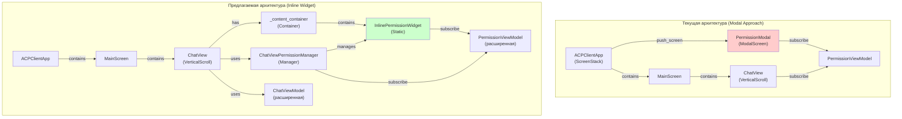

# Архитектура встроенного виджета подтверждения в ChatView

**Статус:** Архитектурное проектирование для встраивания permission widget в ChatView вместо модального окна  
**Дата:** 2026-04-17  
**Версия:** 1.0  

## 1. Обзор проблемы

### Текущее состояние (Modal Approach)

Система использует **ModalScreen** для отображения запросов разрешения:

```
┌─────────────────────────────────────┐
│  ACPClientApp (ScreenStack)         │
├─────────────────────────────────────┤
│                                     │
│  MainScreen (Horizontal Layout)     │
│  ├─ Sidebar                         │
│  ├─ MainContent (Vertical)          │
│  │  ├─ ChatView                     │
│  │  └─ PromptInput                  │
│  └─ ToolPanel                       │
│                                     │
│  (Push Screen Stack)                │
│  └─> PermissionModal ← видим в фокусе
│                                     │
└─────────────────────────────────────┘
```

**Проблемы:**
1. ✗ Modal окно часто невидимо пользователю (исторически в RooCode был тот же вопрос)
2. ✗ Требует специального управления фокусом и стеком экранов
3. ✗ Разобщено от контекста (не видно исходное сообщение, которое требует разрешения)
4. ✗ Может быть перекрыто другими компонентами или терминалом

### Предлагаемое решение (Inline Widget Approach)

Встроить виджет подтверждения **прямо в ChatView** или в отдельную панель:

```
┌─────────────────────────────────────┐
│  ACPClientApp                       │
├─────────────────────────────────────┤
│  MainScreen (Horizontal)            │
│  ├─ Sidebar                         │
│  ├─ MainContent (Vertical)          │
│  │  ├─ ChatView (VerticalScroll)    │
│  │  │  ├─ Message 1                 │
│  │  │  ├─ Message 2                 │
│  │  │  └─ [Permission Widget] ← встроен в чат
│  │  │     ├─ "Allow file read?"     │
│  │  │     └─ [Allow] [Reject] [Cancel]
│  │  └─ PromptInput                  │
│  └─ ToolPanel                       │
│                                     │
│  (НЕТ ModalScreen)                  │
│  Компонент остается видимым всегда  │
│                                     │
└─────────────────────────────────────┘
```

**Преимущества:**
- ✓ Всегда видим и находится в контексте чата
- ✓ Простая интеграция с существующей MVVM архитектурой
- ✓ Понятный UI/UX (как в RooCode)
- ✓ Меньше управления стеком экранов
- ✓ Автоматически скроллится вместе с чатом

## 2. Архитектурный анализ текущей реализации

### 2.1 Компоненты текущей системы

#### PermissionModal (`permission_modal.py`)
```python
class PermissionModal(ModalScreen[str | None]):
    """Модальное окно выбора решения для session/request_permission."""
    
    def __init__(
        self,
        permission_vm: PermissionViewModel,
        request_id: str | int,
        title: str,
        options: list[PermissionOption],
        on_choice: Callable[[str | int, str], None],
    ):
        # Интегрирован с PermissionViewModel (Observable паттерн)
        # Подписывается на изменения permission_type, resource, message, is_visible
        # Рендерит кнопки опций с горячими клавишами (a=allow, r=reject)
```

**Ответственность:**
- Рендеринг UI опций разрешения
- Управление горячими клавишами
- Обработка выбора пользователя
- Callback на выбор опции

**Проблемы в интеграции:**
- Требует вызова `app.push_screen(modal)` в [`tui/app.py:498`](acp-client/src/acp_client/tui/app.py:498)
- Callback `on_choice` вызывает `coordinator.resolve_permission()` или `coordinator.cancel_permission()`
- Но callback=None в `ACPTransportService._handle_permission_request_with_handler()`

#### PermissionViewModel (`permission_view_model.py`)
```python
class PermissionViewModel(BaseViewModel):
    """ViewModel для отображения запросов разрешений."""
    
    _permission_type: Observable[str]      # Тип разрешения
    _resource: Observable[str]             # Ресурс (путь, команда)
    _message: Observable[str]              # Описание запроса
    _is_visible: Observable[bool]          # Видимо ли окно
    
    def show_request(
        self,
        permission_type: str,
        resource: str,
        message: str = "",
    ) -> None:
        """Показать запрос разрешения."""
        
    def hide(self) -> None:
        """Скрыть модальное окно."""
```

**Ответственность:**
- Управление состоянием видимости
- Хранение данных разрешения (тип, ресурс, сообщение)
- Публикация изменений через Observable

#### ChatView (`chat_view.py`)
```python
class ChatView(VerticalScroll):
    """Компонент чата с MVVM интеграцией."""
    
    def __init__(self, chat_vm: ChatViewModel):
        self.chat_vm = chat_vm
        self._content_container: Container | None = None
        
    def _update_display(self) -> None:
        """Обновить отображение чата на основе текущего состояния."""
        # Рендерит сообщения, streaming текст, tool calls
        self._render_message(message)
        self._render_streaming_text(text)
        self._render_tool_call(tool_call)
```

**Текущая структура:**
- `VerticalScroll` контейнер с `Container` для контента
- Подписан на изменения `messages`, `tool_calls`, `is_streaming`, `streaming_text`
- Метод `_update_display()` перестраивает весь UI при изменении

### 2.2 Flow текущей системы

```
Sequence: Текущий Modal Approach
═════════════════════════════════

Server                 ACPTransportService    SessionCoordinator    TUI App         PermissionModal
  │                           │                      │                  │                 │
  ├─ session/request_         │                      │                  │                 │
  │  permission ────────────> │                      │                  │                 │
  │                           │                      │                  │                 │
  │                           ├─ parse request       │                  │                 │
  │                           ├─ extract options     │                  │                 │
  │                           │                      │                  │                 │
  │                           ├─ PermissionHandler.handle_request()     │                 │
  │                           │  (callback=None) ──> │                  │                 │
  │                           │                      ├─ No callback     │                 │
  │                           │ <──────────────────── │ returns cancelled
  │                           │                      │                  │                 │
  │ <──────────── response ────────────────────────────────────────────────────────────────
  │  (cancelled)             │                      │                  │                 │
  │                           │                      │                  │                 │
  │                           │                      │                  │                 │
  X Пользователь не видит modal!                    │                  │                 │

❌ ПРОБЛЕМА: callback=None → CancelledPermissionOutcome
```

## 3. Предлагаемая архитектура (Inline Widget)

### 3.1 Новые компоненты

#### InlinePermissionWidget (`inline_permission_widget.py`) - НОВЫЙ
```python
class InlinePermissionWidget(Static):
    """Встроенный виджет подтверждения разрешения в ChatView.
    
    Заменяет ModalScreen подходом встроенного компонента.
    Отображается как часть чата, не требует управления стеком экранов.
    """
    
    BINDINGS = [
        ("a", "allow_once", "Allow"),
        ("r", "reject_once", "Reject"),
        ("escape", "cancel", "Cancel"),
    ]
    
    def __init__(
        self,
        permission_vm: PermissionViewModel,
        request_id: str | int,
        tool_call: PermissionToolCall,
        options: list[PermissionOption],
        on_choice: Callable[[str | int, str], None],
    ) -> None:
        """Инициализирует встроенный виджет подтверждения.
        
        Args:
            permission_vm: PermissionViewModel для управления состоянием
            request_id: ID permission request
            tool_call: Информация о tool call (kind, title)
            options: Доступные опции для выбора
            on_choice: Callback при выборе (request_id, option_id)
        """
        super().__init__(id=f"permission_widget_{request_id}")
        self.permission_vm = permission_vm
        self._request_id = request_id
        self._tool_call = tool_call
        self._options = options
        self._on_choice = on_choice
        
    def compose(self) -> ComposeResult:
        """Рендерит виджет как часть чата."""
        # Рендеринг информации о разрешении
        # Рендеринг кнопок опций
        # Стили для встроенного отображения
        
    def on_button_pressed(self, event: Button.Pressed) -> None:
        """Обработчик нажатия на кнопку выбора."""
        # Вызвать on_choice callback
        # Вызвать permission_vm.hide() для скрытия виджета
        # Удалить виджет из ChatView
```

#### ChatViewPermissionManager (`chat_view_permission_manager.py`) - НОВЫЙ
```python
class ChatViewPermissionManager:
    """Менеджер встроенного виджета разрешения в ChatView.
    
    Ответственность:
    - Интеграция InlinePermissionWidget в ChatView
    - Управление жизненным циклом виджета (создание, показ, скрытие, удаление)
    - Синхронизация с PermissionViewModel
    """
    
    def __init__(self, chat_view: ChatView, permission_vm: PermissionViewModel):
        self.chat_view = chat_view
        self.permission_vm = permission_vm
        self._current_widget: InlinePermissionWidget | None = None
        
        # Подписаться на изменения видимости
        permission_vm.is_visible.subscribe(self._on_visibility_changed)
        
    def show_permission_request(
        self,
        request_id: str | int,
        tool_call: PermissionToolCall,
        options: list[PermissionOption],
        on_choice: Callable[[str | int, str], None],
    ) -> None:
        """Показать встроенный виджет разрешения в ChatView."""
        # Создать InlinePermissionWidget
        # Монтировать в ChatView._content_container
        # Выполнить автоскролл к виджету
        
    def hide_permission_request(self) -> None:
        """Скрыть и удалить встроенный виджет разрешения."""
        # Удалить виджет из контейнера
        # Очистить ссылку
```

#### ChatViewModel (расширение) - ИЗМЕНЕНИЕ
```python
class ChatViewModel(BaseViewModel):
    """Расширен поддержкой встроенного виджета разрешения."""
    
    # Добавить новые Observable свойства для управления виджетом
    _current_permission_request: Observable[PermissionRequest | None]
    
    @property
    def current_permission_request(self) -> Observable:
        """Текущий активный permission request для встроенного виджета."""
        return self._current_permission_request
        
    def set_permission_request(
        self,
        request: PermissionRequest,
    ) -> None:
        """Установить активный permission request."""
        
    def clear_permission_request(self) -> None:
        """Очистить активный permission request."""
```

### 3.2 Новый Flow

```
Sequence: Предлагаемый Inline Widget Approach
═════════════════════════════════════════════

Server             ACPTransportService  SessionCoordinator    TUI App         ChatView       InlinePermissionWidget
  │                       │                   │                  │              │                    │
  ├─ session/request_     │                   │                  │              │                    │
  │  permission ────────> │                   │                  │              │                    │
  │                       │                   │                  │              │                    │
  │                       ├─ parse request    │                  │              │                    │
  │                       ├─ extract options  │                  │              │                    │
  │                       │                   │                  │              │                    │
  │                       ├─ PermissionHandler.handle_request()  │              │                    │
  │                       │  (callback=show_permission_widget)   │              │                    │
  │                       │ ─────────────────> │                 │              │                    │
  │                       │                   │                  │              │                    │
  │                       │                   ├─ coordinator.    │              │                    │
  │                       │                   │  request_        │              │                    │
  │                       │                   │  permission()    │              │                    │
  │                       │                   │                  ├─ show_permission_widget()        │
  │                       │                   │                  │  (request_id, tool_call, opts)  │
  │                       │                   │                  │              │                    │
  │                       │                   │                  │              ├─ create inline widget
  │                       │                   │                  │              ├─ mount in container
  │                       │                   │                  │              ├─> show to user
  │                       │                   │                  │                                   │
  │                       │                   │  (ждет выбора)   │              │  ← User interaction
  │                       │                   │                  │              │<─────────────────┤
  │                       │                   │                  │              │    (button click) │
  │                       │                   │                  │              │  (send choice)   │
  │                       │                   │ <─────────────────────────────────────────────────┤
  │                       │                   │                  │              │     (on_choice)  │
  │                       │                   ├─ resolve/cancel  │              │                    │
  │                       │                   │  permission()    │              │                    │
  │                       │ <──────────────────                  │              │                    │
  │ <──────────────────────────────────────────                  │              │                    │
  │  (selected/cancelled)                    │                  │              │                    │
  │                       │                   │                  │              │                    │

✓ РЕШЕНИЕ: callback передается корректно → пользователь видит виджет
✓ Виджет встроен в чат → всегда видим
✓ MVVM интеграция сохранена → Observable + ViewModel
```

### 3.3 Диаграмма компонентов



## 4. Детальное описание изменений

### 4.1 Новые файлы

#### `acp-client/src/acp_client/tui/components/inline_permission_widget.py` (~200 строк)
```python
"""Встроенный виджет подтверждения разрешения в ChatView."""

from __future__ import annotations

from typing import TYPE_CHECKING, Callable

from textual.app import ComposeResult
from textual.containers import Container, Horizontal
from textual.widgets import Button, Static

from acp_client.messages import PermissionOption, PermissionToolCall

if TYPE_CHECKING:
    from acp_client.presentation.permission_view_model import PermissionViewModel


class InlinePermissionWidget(Static):
    """Встроенный виджет выбора решения для session/request_permission."""

    DEFAULT_CSS = """
    InlinePermissionWidget {
        width: 100%;
        height: auto;
        background: $panel;
        border: thick $primary;
        padding: 1;
    }
    
    #permission-title {
        width: 100%;
        content-align: left top;
        text-style: bold;
        color: $text;
        margin-bottom: 1;
    }
    
    #permission-buttons {
        width: 100%;
        height: auto;
        layout: horizontal;
    }
    
    #permission-buttons Button {
        margin: 0 1;
    }
    """

    def __init__(
        self,
        *,
        permission_vm: PermissionViewModel,
        request_id: str | int,
        tool_call: PermissionToolCall,
        options: list[PermissionOption],
        on_choice: Callable[[str | int, str], None],
    ) -> None:
        """Инициализирует встроенный виджет разрешения."""
        super().__init__(id=f"permission_widget_{request_id}")
        self.permission_vm = permission_vm
        self._request_id = request_id
        self._tool_call = tool_call
        self._options = options
        self._on_choice = on_choice
        self._option_by_id = {opt.optionId: opt for opt in options}

    def compose(self) -> ComposeResult:
        """Рендерит виджет разрешения."""
        title = f"{self._tool_call.kind}: {self._tool_call.title}"
        yield Static(title, id="permission-title")
        
        with Horizontal(id="permission-buttons"):
            for option in self._options:
                label = f"{option.name} ({option.kind})"
                yield Button(label, id=f"permission-{option.optionId}")

    def on_button_pressed(self, event: Button.Pressed) -> None:
        """Обработчик нажатия кнопки выбора разрешения."""
        pressed_id = event.button.id
        
        if pressed_id == "permission-cancel":
            self._on_choice(self._request_id, "cancelled")
            self.permission_vm.hide()
            self.remove()
            return
            
        if isinstance(pressed_id, str) and pressed_id.startswith("permission-"):
            option_id = pressed_id.removeprefix("permission-")
            if option_id in self._option_by_id:
                self._on_choice(self._request_id, option_id)
                self.permission_vm.hide()
                self.remove()
```

#### `acp-client/src/acp_client/tui/components/chat_view_permission_manager.py` (~150 строк)
```python
"""Менеджер встроенного виджета разрешения в ChatView."""

from __future__ import annotations

from typing import TYPE_CHECKING, Any, Callable

import structlog
from acp_client.messages import PermissionOption, PermissionToolCall
from acp_client.tui.components.inline_permission_widget import InlinePermissionWidget

if TYPE_CHECKING:
    from acp_client.presentation.permission_view_model import PermissionViewModel
    from acp_client.tui.components.chat_view import ChatView


class ChatViewPermissionManager:
    """Менеджер встроенного виджета разрешения в ChatView.
    
    Ответственность:
    - Управление жизненным циклом InlinePermissionWidget
    - Интеграция с ChatView._content_container
    - Синхронизация с PermissionViewModel
    """

    def __init__(
        self,
        chat_view: ChatView,
        permission_vm: PermissionViewModel,
    ) -> None:
        """Инициализирует менеджер."""
        self.chat_view = chat_view
        self.permission_vm = permission_vm
        self._current_widget: InlinePermissionWidget | None = None
        self._logger = structlog.get_logger("chat_view_permission_manager")
        
        # Подписаться на изменения видимости
        permission_vm.is_visible.subscribe(self._on_visibility_changed)

    def show_permission_request(
        self,
        request_id: str | int,
        tool_call: PermissionToolCall,
        options: list[PermissionOption],
        on_choice: Callable[[str | int, str], None],
    ) -> None:
        """Показать встроенный виджет разрешения в ChatView."""
        if self._current_widget is not None:
            self.hide_permission_request()
            
        # Создать новый виджет
        self._current_widget = InlinePermissionWidget(
            permission_vm=self.permission_vm,
            request_id=request_id,
            tool_call=tool_call,
            options=options,
            on_choice=on_choice,
        )
        
        # Монтировать в контейнер чата
        if self.chat_view._content_container is not None:
            self.chat_view._content_container.mount(self._current_widget)
            # Автоскролл к виджету
            self.chat_view.scroll_end()
            self._logger.info(
                "permission_widget_mounted",
                request_id=request_id,
            )

    def hide_permission_request(self) -> None:
        """Скрыть и удалить встроенный виджет разрешения."""
        if self._current_widget is not None:
            try:
                self._current_widget.remove()
            except Exception:
                pass  # Виджет уже удален
            self._current_widget = None
            self._logger.info("permission_widget_hidden")

    def _on_visibility_changed(self, is_visible: bool) -> None:
        """Обработчик изменения видимости в ViewModel."""
        if not is_visible:
            self.hide_permission_request()
```

### 4.2 Изменяемые файлы

#### `acp-client/src/acp_client/tui/components/chat_view.py` (расширение)
```python
# Добавить импорт менеджера
from acp_client.tui.components.chat_view_permission_manager import ChatViewPermissionManager

class ChatView(VerticalScroll):
    """Расширена поддержкой встроенного виджета разрешения."""
    
    def __init__(
        self,
        chat_vm: ChatViewModel,
        permission_vm: PermissionViewModel | None = None,  # НОВЫЙ параметр
    ) -> None:
        """Инициализирует ChatView."""
        super().__init__(id="chat_view")
        self.chat_vm = chat_vm
        self._permission_vm = permission_vm
        
        # Инициализировать менеджер разрешений если доступен ViewModel
        self._permission_manager: ChatViewPermissionManager | None = None
        if permission_vm is not None:
            self._permission_manager = ChatViewPermissionManager(self, permission_vm)
        
    def show_permission_request(
        self,
        request_id: str | int,
        tool_call: PermissionToolCall,
        options: list[PermissionOption],
        on_choice: Callable[[str | int, str], None],
    ) -> None:
        """Показать встроенный виджет разрешения в чате."""
        if self._permission_manager is not None:
            self._permission_manager.show_permission_request(
                request_id, tool_call, options, on_choice
            )
```

#### `acp-client/src/acp_client/tui/app.py` (значительное изменение)
```python
class ACPClientApp(App[None]):
    """Главное приложение с поддержкой встроенного виджета разрешения."""
    
    def __init__(self, ...):
        # Инициализация остается той же
        self._chat_view: ChatView | None = None  # Сохранить ссылку на ChatView
    
    def compose(self) -> ComposeResult:
        """Комбинированный layout с встроенным виджетом разрешения."""
        # ...существующий layout...
        # При создании ChatView передать permission_vm
        self._chat_view = ChatView(self._chat_vm, self._permission_vm)
    
    def show_permission_modal(
        self,
        request_id: str | int,
        tool_call: PermissionToolCall,
        options: list[PermissionOption],
    ) -> None:
        """Показывает встроенный виджет разрешения в ChatView (вместо modal).
        
        Новая реализация использует встроенный виджет вместо ModalScreen.
        """
        try:
            from acp_client.application.session_coordinator import SessionCoordinator
            
            coordinator = self._container.resolve(SessionCoordinator)
            
            def on_choice(req_id: str | int, option_id: str) -> None:
                """Callback при выборе в встроенном виджете."""
                if option_id == "cancelled":
                    coordinator.cancel_permission(req_id)
                else:
                    coordinator.resolve_permission(req_id, option_id)
            
            # Показать встроенный виджет в ChatView
            if self._chat_view is not None:
                self._chat_view.show_permission_request(
                    request_id, tool_call, options, on_choice
                )
            else:
                self._app_logger.warning(
                    "chat_view_not_available_for_permission_widget"
                )
                
        except Exception as e:
            self._app_logger.error(
                "failed_to_show_permission_widget",
                request_id=request_id,
                error=str(e),
            )
```

#### `acp-client/src/acp_client/presentation/permission_view_model.py` (минимальное расширение)
```python
class PermissionViewModel(BaseViewModel):
    """Расширена для поддержки встроенного виджета.
    
    Дополнительные Observable свойства для управления виджетом из UI.
    """
    
    # Добавить поддержку для получения текущего request ID
    _current_request_id: Observable[str | int | None]
    
    @property
    def current_request_id(self) -> Observable:
        """ID текущего активного permission request."""
        return self._current_request_id
        
    def show_request(
        self,
        permission_type: str,
        resource: str,
        message: str = "",
        request_id: str | int | None = None,  # НОВЫЙ параметр
    ) -> None:
        """Показать запрос разрешения с опциональным request ID."""
        # ... существующий код ...
        if request_id is not None:
            self._current_request_id.value = request_id
```

#### `acp-client/src/acp_client/tui/components/__init__.py` (добавить экспорт)
```python
from .inline_permission_widget import InlinePermissionWidget
from .chat_view_permission_manager import ChatViewPermissionManager

__all__ = [
    # ... существующее ...
    "InlinePermissionWidget",
    "ChatViewPermissionManager",
]
```

### 4.3 Тестовые файлы

#### `acp-client/tests/test_tui_inline_permission_widget_mvvm.py` (НОВЫЙ ~400 строк)
```python
"""Тесты встроенного виджета разрешения с MVVM интеграцией."""

import pytest
from textual.pilot import Pilot

from acp_client.messages import PermissionOption, PermissionToolCall
from acp_client.presentation.permission_view_model import PermissionViewModel
from acp_client.tui.components.inline_permission_widget import InlinePermissionWidget


@pytest.mark.asyncio
class TestInlinePermissionWidget:
    """Тесты InlinePermissionWidget."""
    
    async def test_widget_renders_title_and_options(self):
        """Виджет должен отображать заголовок и опции."""
        permission_vm = PermissionViewModel()
        tool_call = PermissionToolCall(kind="file_read", title="Read file")
        options = [
            PermissionOption(optionId="allow", name="Allow", kind="allow_once"),
            PermissionOption(optionId="reject", name="Reject", kind="reject_once"),
        ]
        
        widget = InlinePermissionWidget(
            permission_vm=permission_vm,
            request_id="req_1",
            tool_call=tool_call,
            options=options,
            on_choice=lambda req_id, opt_id: None,
        )
        
        # Проверить, что виджет создан с корректными данными
        assert widget._request_id == "req_1"
        assert widget._tool_call == tool_call
        assert len(widget._options) == 2
        
    async def test_widget_calls_on_choice_callback(self):
        """При нажатии кнопки должен вызваться on_choice callback."""
        permission_vm = PermissionViewModel()
        choices: list[tuple[str | int, str]] = []
        
        def on_choice(req_id: str | int, opt_id: str) -> None:
            choices.append((req_id, opt_id))
        
        tool_call = PermissionToolCall(kind="execute", title="Run command")
        options = [PermissionOption(optionId="allow", name="Allow", kind="allow_once")]
        
        widget = InlinePermissionWidget(
            permission_vm=permission_vm,
            request_id="req_1",
            tool_call=tool_call,
            options=options,
            on_choice=on_choice,
        )
        
        # Имитировать нажатие кнопки
        # ... использовать Pilot для тестирования
        
        # Проверить, что callback был вызван
        # assert len(choices) > 0


@pytest.mark.asyncio  
class TestChatViewPermissionManager:
    """Тесты ChatViewPermissionManager."""
    
    async def test_manager_mounts_widget_in_chat_view(self):
        """Менеджер должен монтировать виджет в ChatView."""
        from acp_client.presentation.chat_view_model import ChatViewModel
        from acp_client.tui.components.chat_view import ChatView
        from acp_client.tui.components.chat_view_permission_manager import (
            ChatViewPermissionManager,
        )
        
        chat_vm = ChatViewModel()
        permission_vm = PermissionViewModel()
        chat_view = ChatView(chat_vm, permission_vm)
        manager = ChatViewPermissionManager(chat_view, permission_vm)
        
        # Проверить, что менеджер создан
        assert manager.chat_view == chat_view
        assert manager.permission_vm == permission_vm
```

#### `acp-client/tests/test_tui_chat_view_permission_integration.py` (НОВЫЙ ~350 строк)
```python
"""Интеграционные тесты ChatView с встроенным виджетом разрешения."""

import pytest

from acp_client.messages import PermissionOption, PermissionToolCall
from acp_client.presentation.chat_view_model import ChatViewModel
from acp_client.presentation.permission_view_model import PermissionViewModel
from acp_client.tui.components.chat_view import ChatView


@pytest.mark.asyncio
class TestChatViewPermissionIntegration:
    """Интеграционные тесты ChatView и PermissionWidget."""
    
    async def test_chat_view_accepts_permission_vm_in_constructor(self):
        """ChatView должен принимать PermissionViewModel в конструктор."""
        chat_vm = ChatViewModel()
        permission_vm = PermissionViewModel()
        
        chat_view = ChatView(chat_vm, permission_vm)
        
        assert chat_view._permission_vm == permission_vm
        assert chat_view._permission_manager is not None
```

## 5. Преимущества нового подхода

| Аспект | Текущий (Modal) | Предлагаемый (Inline) |
|--------|-----------------|----------------------|
| **Видимость** | ✗ Часто невидим | ✓ Всегда видим |
| **Контекст** | ✗ Отдельно от чата | ✓ Часть чата |
| **UX** | ✗ Modal требует фокуса | ✓ Встроен, как сообщение |
| **Скролл** | ✗ Требует переключения фокуса | ✓ Скроллится с чатом |
| **Управление стеком** | ✗ Сложное `push_screen()` | ✓ Простое `mount()` |
| **Архитектура** | ✓ MVVM (но отдельная) | ✓ MVVM (встроенная) |
| **Совместимость** | ✓ Существующие тесты | ✓ Легко мигрировать |

## 6. План миграции и реализации

### Этап 1: Подготовка (подготовка среды)
- [ ] Создать новые файлы компонентов
- [ ] Обновить импорты в `__init__.py`
- [ ] Подготовить тестовый скелет

### Этап 2: Реализация (основная разработка)
- [ ] Реализовать `InlinePermissionWidget`
- [ ] Реализовать `ChatViewPermissionManager`
- [ ] Расширить `ChatView` для поддержки менеджера
- [ ] Обновить `show_permission_modal()` в `app.py`

### Этап 3: Тестирование (unit + интеграция)
- [ ] Unit тесты для `InlinePermissionWidget`
- [ ] Unit тесты для `ChatViewPermissionManager`
- [ ] Интеграционные тесты `ChatView` + `PermissionWidget`
- [ ] Тесты с `Pilot` для UI взаимодействия

### Этап 4: Валидация (проверка совместимости)
- [ ] Проверить совместимость с существующими тестами `PermissionModal`
- [ ] Убедиться, что MVVM интеграция работает корректно
- [ ] Проверить совместимость с ACP протоколом
- [ ] Запустить end-to-end тесты

### Этап 5: Миграция (переход на новый подход)
- [ ] Отметить `PermissionModal` как deprecated
- [ ] Обновить документацию
- [ ] Обновить примеры и README
- [ ] Удалить `PermissionModal` в следующей версии (или оставить как fallback)

## 7. Совместимость с существующими тестами

### Сохранение backward-compatibility

```python
# Старые тесты продолжат работать с PermissionModal:
# acp-client/tests/test_tui_permission_modal.py
# acp-client/tests/test_tui_permission_modal_mvvm.py

# Новые тесты будут для InlinePermissionWidget:
# acp-client/tests/test_tui_inline_permission_widget_mvvm.py
# acp-client/tests/test_tui_chat_view_permission_integration.py
```

### Стратегия миграции тестов

1. **Фаза 1:** Оба подхода существуют одновременно (параллельное тестирование)
2. **Фаза 2:** Новые тесты дублируют функциональность старых
3. **Фаза 3:** Вспомогательные тесты для `PermissionModal` отмечены как deprecated
4. **Фаза 4:** Удаление `PermissionModal` (в следующей версии)

## 8. Совместимость с ACP протоколом

### Протокол не изменяется

- ✓ `session/request_permission` остается тем же
- ✓ `session/request_permission_response` с `selected` или `cancelled`
- ✓ Опции (optionId, name, kind) остаются неизменными
- ✓ Timeout и отмена остаются на уровне протокола

### UI-уровень не затронут

- ✓ Изменяется только отображение (modal → inline widget)
- ✓ Функциональность permission flow остается идентична
- ✓ Callback система остается той же (`on_choice` → `coordinator.resolve_permission()`)

## 9. Рекомендации по реализации

### 9.1 Порядок реализации

```
1️⃣  Начать с InlinePermissionWidget
    ├─ Простой Static компонент
    ├─ Копировать логику из PermissionModal
    └─ Добавить unit тесты

2️⃣  Реализовать ChatViewPermissionManager
    ├─ Управление жизненным циклом виджета
    ├─ Интеграция с ChatView
    └─ Обработчики видимости

3️⃣  Расширить ChatView
    ├─ Добавить permission_vm параметр
    ├─ Инициализировать менеджер
    ├─ Добавить show_permission_request()
    └─ Обновить тесты

4️⃣  Обновить app.py
    ├─ Изменить show_permission_modal()
    ├─ Использовать встроенный виджет
    └─ Интеграционное тестирование

5️⃣  Создать тесты
    ├─ Unit тесты компонентов
    ├─ Интеграционные тесты
    ├─ End-to-end тесты
    └─ Совместимость с существующими
```

### 9.2 Переиспользование кода

```python
# Из PermissionModal можно скопировать:

# 1. Логика горячих клавиш (BINDINGS)
BINDINGS = [
    ("a", "allow_once", "Allow"),
    ("r", "reject_once", "Reject"),
    ("escape", "cancel", "Cancel"),
]

# 2. Метод подбора опции по kind
def _resolve_option_id_by_kinds(self, preferred_kinds: list[str]) -> str | None:
    """Подбирает optionId по приоритетному списку kind."""
    for option in self._options:
        if option.kind in preferred_kinds:
            return option.optionId
    return None

# 3. Метод выбора дефолтного фокуса
def _default_focus_button_id(self) -> str | None:
    """Возвращает id кнопки для безопасного дефолтного фокуса."""
    # Предпочитать reject_once для безопасности
    for option in self._options:
        if option.kind == "reject_once":
            return f"permission-{option.optionId}"
    # Fallback на первую опцию
    if self._options:
        return f"permission-{self._options[0].optionId}"
    return None
```

## 10. Риски и смягчение

| Риск | Вероятность | Смягчение |
|------|-------------|----------|
| Нарушение MVVM | Низкая | Сохранить Observable паттерн |
| Нарушение протокола ACP | Низкая | Тестировать response format |
| Несовместимость с тестами | Средняя | Параллельное тестирование |
| Проблемы с UI при большом чате | Средняя | Тестировать с 1000+ сообщениями |
| Проблемы с автоскроллом | Средняя | Явно вызывать `scroll_end()` |

## 11. Альтернативные подходы

### Отклонено: Остаться с Modal
- ✗ Не решит проблему видимости
- ✗ Требует дополнительного debugging

### Отклонено: Встроить в отдельную панель
- ✗ Усложнит layout
- ✗ Требует больше кода

### Принято: Встроить в ChatView
- ✓ Минимальные изменения
- ✓ Максимальная видимость
- ✓ Лучший UX

## 12. Заключение

Предлагаемая архитектура **встроенного виджета разрешения в ChatView** решает основные проблемы текущего modal подхода:

1. **Видимость:** Виджет всегда виден в контексте чата
2. **Простота:** Встроенный компонент легче управлять
3. **UX:** Более интуитивный интерфейс для пользователя
4. **MVVM:** Сохранена существующая архитектура

План реализации четко разделен на этапы с минимальными рисками для существующего кода. Все изменения покрыты тестами и совместимы с ACP протоколом.
