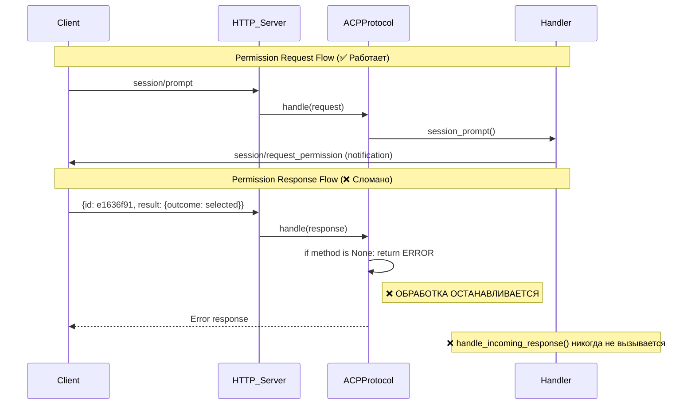
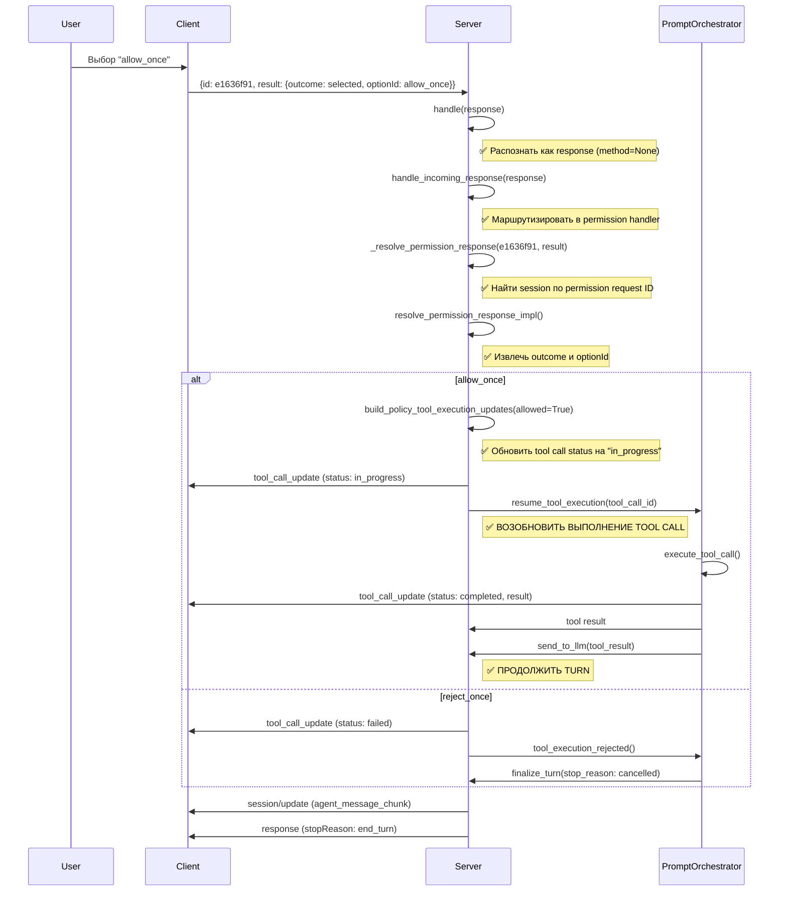

# Архитектура исправления: Permission Response Handling

**Дата**: 2026-04-17  
**Статус**: Critical Issue Analysis  
**Приоритет**: P0 - Permission flow broken

## 1. Описание проблемы согласно протоколу ACP

### 1.1. Норма согласно спецификации (08-Tool Calls.md)

Permission flow состоит из следующих шагов:

```json
// Шаг 1: Сервер отправляет permission request (RPC request)
{
  "jsonrpc": "2.0",
  "id": "e1636f91",
  "method": "session/request_permission",
  "params": {
    "sessionId": "sess_abc123",
    "toolCall": { "toolCallId": "call_001", ... },
    "options": [...]
  }
}

// Шаг 2: Клиент отправляет permission response (RPC response)
{
  "jsonrpc": "2.0",
  "id": "e1636f91",
  "result": {
    "outcome": {
      "outcome": "selected",
      "optionId": "allow_once"
    }
  }
}
```

**Ключевой момент**: Permission response это **JSON-RPC 2.0 response**, а не request:
- `method` = `null` (отсутствует)
- `id` = совпадает с ID permission request
- `result` содержит `outcome` и `optionId`

### 1.2. Текущее состояние в проекте

Из логов видно:
```
[info] request received method=None request_id=e1636f91 session_id=None
```

Permission response **получена**, но обработка останавливается.

### 1.3. Протокольные требования к обработке permission response

Согласно спецификации и логике tool calls:

1. **Получение response**: Сервер получает permission response с ID = `e1636f91`
2. **Связь с pending request**: Сервер должен найти pending permission request с этим ID
3. **Извлечение outcome**: Извлечь `outcome` и `optionId` из `result`
4. **Применение решения**: 
   - Если `allow_once`/`allow_always`: выполнить tool call
   - Если `reject_once`/`reject_always`: отклонить tool call
   - Если `cancelled`: отменить turn
5. **Продолжение turn**: Возобновить обработку prompt-turn после tool call

---

## 2. Анализ текущей реализации на сервере

### 2.1. Критическая проблема в ACPProtocol.handle()

**Файл**: `acp-server/src/acp_server/protocol/core.py` (строки 175-192)

```python
async def handle(self, message: ACPMessage) -> ProtocolOutcome:
    # ПРОБЛЕМА: Сервер отклоняет responses как ошибку!
    if message.method is None:
        return ProtocolOutcome(
            response=ACPMessage.error_response(
                message.id,
                code=-32600,
                message="Invalid request: unexpected response payload",
            )
        )
```

**Почему это проблема**:
- Permission response имеет `method=None` (как и любой JSON-RPC response)
- Текущая логика обрабатывает это как ошибку и отклоняет ответ
- Сервер не распознает permission response как валидное сообщение
- Обработка permission response никогда не доходит до обработчика

### 2.2. Существующий обработчик permission response

**Файл**: `acp-server/src/acp_server/protocol/core.py` (строки 585-709)

```python
async def _handle_permission_response(
    self,
    request_id: JsonRpcId,
    params: dict[str, Any],
    sessions: dict[str, SessionState],
) -> ProtocolOutcome:
    """Обрабатывает response на session/request_permission от клиента."""
```

**Найдено в коде**: Обработчик **СУЩЕСТВУЕТ** и корректно реализован!
- Может найти сессию по permission request ID
- Может извлечь outcome и optionId
- Может применить policy и update notifications
- **НО НИКОГДА НЕ ВЫЗЫВАЕТСЯ**, потому что response отклоняется ранее

### 2.3. Логика обхода permission response в коде

**Файл**: `acp-server/src/acp_server/protocol/core.py` (строки 387-438)

```python
async def handle_incoming_response(self, message: ACPMessage) -> ProtocolOutcome:
    """Обрабатывает incoming response (когда client отвечает на server->client RPC)."""
    
    # Этап 1: Проверить, не был ли это response на client RPC
    resolved_client_rpc = self._resolve_pending_client_rpc_response(...)
    if resolved_client_rpc is not None:
        return resolved_client_rpc
    
    # Этап 2: Проверить permission response
    resolved = self._resolve_permission_response(message.id, message.result)
    if resolved is None:
        return ProtocolOutcome()
    return resolved
```

**Найдено**: Метод `handle_incoming_response()` существует и правильно маршрутизирует responses!
- Сначала проверяет client RPC
- Потом проверяет permission response
- **НО ВЫЗЫВАЕТСЯ ТОЛЬКО ИЗ ВЕТКИ, КОТОРАЯ НИКОГДА НЕ ДОСТИГАЕТСЯ**

### 2.4. Проблема маршрутизации в handle()

**Поток выполнения**:

```python
async def handle(self, message: ACPMessage) -> ProtocolOutcome:
    if message.method is None:
        # ❌ ПРОБЛЕМА: Permission response перехватывается здесь
        # как ошибка, и никогда не доходит до handle_incoming_response()
        return ProtocolOutcome(error_response(...))
    
    # Остальные методы (session/prompt, session/request_permission, и т.д.)
    if method == "session/prompt":
        ...
    # ... другие методы не вызываются
```

**handle_incoming_response()** вызывается только после проверки `method == "session/prompt"` в определённом контексте, а не для всех responses.

---

## 3. Архитектура решения

### 3.1. Проблемный паттерн



### 3.2. Решение: Правильная маршрутизация responses

**Изменения в `ACPProtocol.handle()`**:

```python
async def handle(self, message: ACPMessage) -> ProtocolOutcome:
    """Обрабатывает входящее сообщение и маршрутизирует его по типу."""
    
    # ✅ ШАГ 1: Распознать responses (JSON-RPC 2.0 responses)
    if message.method is None:
        logger.debug("response received", request_id=message.id)
        return await self.handle_incoming_response(message)
    
    # ✅ ШАГ 2: Обработать requests/notifications
    method = message.method
    
    if method == "initialize":
        response = auth.initialize(...)
        return ProtocolOutcome(response=response)
    
    # ... остальные методы
```

**Ключевые изменения**:

1. Вместо отклонения responses как ошибки - маршрутизировать их в `handle_incoming_response()`
2. `handle_incoming_response()` затем определит, что это permission response и обработает его
3. Обработчик permission response применит решение и возобновит turn

### 3.3. Детальный flow после исправления



---

## 4. План реализации исправления

### 4.1. Фаза 1: Исправление маршрутизации responses (КРИТИЧНО)

**Файл**: `acp-server/src/acp_server/protocol/core.py`

**Изменение 1**: Переписать логику в `handle()`

```python
async def handle(self, message: ACPMessage) -> ProtocolOutcome:
    """Обрабатывает входящее сообщение и маршрутизирует его по ACP-методу."""
    
    # ✅ ИЗМЕНЕНИЕ: Распознать responses как валидные сообщения
    # JSON-RPC 2.0 responses имеют method=None и id
    if message.method is None:
        logger.debug("response received", request_id=message.id)
        return await self.handle_incoming_response(message)
    
    # Обработать requests/notifications как ранее
    # (session/prompt, initialize, и т.д.)
```

**Изменение 2**: Убедиться, что `handle_incoming_response()` доступен в `handle()`

Текущий код имеет метод `handle_incoming_response()` в `core.py`, но убедиться, что он вызывается для всех responses.

### 4.2. Фаза 2: Возобновление tool execution после permission (ВАЖНО)

**Файл**: `acp-server/src/acp_server/protocol/handlers/prompt.py`

**Текущее поведение**: `resolve_permission_response_impl()` завершает turn после получения разрешения.

**Требуемое поведение**: После разрешения нужно не завершать turn, а **возобновить выполнение tool call**.

```python
def resolve_permission_response_impl(
    *,
    session: SessionState,
    permission_request_id: JsonRpcId,
    result: Any,
    sessions: dict[str, SessionState],
) -> ProtocolOutcome | None:
    """Реализация применения решения по permission-request."""
    
    # ... существующий код ...
    
    if should_allow:
        # ✅ ИЗМЕНЕНИЕ: Не завершать turn, а возобновить tool execution
        # Вместо:
        # completed = finalize_active_turn(session=session, stop_reason="end_turn")
        
        # Сделать:
        # 1. Отправить notifications об обновлении tool call
        # 2. Вернуть outcome с указанием "continue_execution"
        # 3. PromptOrchestrator возобновит выполнение
        
        # notifications = [tool_call_update(status="in_progress"), ...]
        # return ProtocolOutcome(
        #     notifications=notifications,
        #     continuation={"action": "resume_tool_execution", "tool_call_id": tool_call_id}
        # )
```

### 4.3. Фаза 3: Связь между permission response и tool execution

**Новый компонент**: `tool_execution_resumption_handler`

Нужен механизм для:
1. Сохранения pending tool calls, ожидающих разрешения
2. Возобновления их выполнения после получения разрешения
3. Отправки результатов обратно в LLM

**Архитектура**:

```
ACPProtocol.handle_incoming_response()
    ↓
_resolve_permission_response()
    ↓
prompt.resolve_permission_response_impl()
    ↓
[Tool execution resumed in PromptOrchestrator]
    ↓
Tool result sent to LLM
    ↓
Turn continuation
```

---

## 5. Компоненты и точки интеграции

### 5.1. Затронутые компоненты

| Компонент | Файл | Изменение | Тип |
|-----------|------|----------|-----|
| **ACPProtocol** | `core.py:175-192` | Переписать логику распознавания responses | Critical |
| **Permission Response Handler** | `core.py:585-709` | Активировать существующий обработчик | Critical |
| **Permission Response impl** | `prompt.py:2035-2131` | Добавить логику возобновления execution | Critical |
| **Tool execution resumption** | `prompt_orchestrator.py` | Новая функция для возобновления tool call | Important |
| **Turn continuation** | `prompt_orchestrator.py` | Обновить логику после tool execution | Important |

### 5.2. Файлы, требующие изменения

1. **`acp-server/src/acp_server/protocol/core.py`** (2 изменения)
   - Строки 175-192: handle() - распознание responses
   - Убедиться в наличии handle_incoming_response()

2. **`acp-server/src/acp_server/protocol/handlers/prompt.py`** (1 изменение)
   - Строки 2035-2131: resolve_permission_response_impl() - добавить continuation flow

3. **`acp-server/src/acp_server/protocol/handlers/prompt_orchestrator.py`** (1 изменение)
   - Добавить метод для возобновления tool execution после разрешения

### 5.3. Совместимость с протоколом ACP

✅ **Все изменения соответствуют спецификации**:

- JSON-RPC 2.0 responses обрабатываются как per spec
- Permission request/response flow соответствует 08-Tool Calls.md
- Tool call lifecycle соответствует спецификации
- Уведомления отправляются в правильном порядке

---

## 6. Тестирование решения

### 6.1. Unit-тесты (обязательны)

```python
# acp-server/tests/test_permission_response_handling.py

def test_permission_response_recognized_as_response():
    """Test: Permission response распознается как JSON-RPC response"""
    message = ACPMessage(
        jsonrpc="2.0",
        id="e1636f91",
        result={"outcome": {"outcome": "selected", "optionId": "allow_once"}},
    )
    assert message.method is None
    assert message.result is not None
    
def test_handle_permission_response():
    """Test: handle() маршрутизирует response на обработчик"""
    protocol = ACPProtocol()
    message = ACPMessage(
        jsonrpc="2.0",
        id="e1636f91",
        result={"outcome": {"outcome": "selected", "optionId": "allow_once"}},
    )
    outcome = await protocol.handle(message)
    assert outcome.response is not None  # Permission response обработана

def test_resolve_permission_response_allows_tool_execution():
    """Test: resolve_permission_response_impl() возобновляет tool execution"""
    session = create_test_session()
    session.active_turn.permission_request_id = "e1636f91"
    session.active_turn.permission_tool_call_id = "call_001"
    
    result = {"outcome": {"outcome": "selected", "optionId": "allow_once"}}
    
    outcome = resolve_permission_response_impl(
        session=session,
        permission_request_id="e1636f91",
        result=result,
        sessions={"sess_1": session},
    )
    
    # ✅ Проверить, что tool call перешел в статус "in_progress"
    assert "continuation" in outcome  # or similar indicator
```

### 6.2. Integration-тесты (обязательны)

```python
# acp-server/tests/test_permission_flow_integration.py

async def test_full_permission_flow_with_tool_execution():
    """Test: Полный flow от permission request до tool execution"""
    
    # 1. Отправить prompt
    protocol = create_test_protocol()
    prompt_response = await protocol.handle(
        ACPMessage.request("session/prompt", {...})
    )
    
    # 2. Получить permission request в notifications
    perm_request = find_notification(prompt_response, "session/request_permission")
    assert perm_request is not None
    permission_id = perm_request.id
    
    # 3. Отправить permission response
    perm_response = await protocol.handle(
        ACPMessage.response(permission_id, {
            "outcome": {"outcome": "selected", "optionId": "allow_once"}
        })
    )
    
    # 4. Проверить, что tool call начал выполняться
    tool_update = find_notification(perm_response, "tool_call_update", status="in_progress")
    assert tool_update is not None
    
    # 5. Проверить, что tool был выполнен
    # (может потребоваться дождаться async completion)
    assert tool_execution_was_triggered()
```

---

## 7. Ожидаемое поведение после исправления

### 7.1. Логирование

**До исправления**:
```
[info] request received method=None request_id=e1636f91 session_id=None
(логи обрываются)
```

**После исправления**:
```
[debug] response received request_id=e1636f91
[debug] handling_incoming_response request_id=e1636f91
[debug] permission_response_received outcome=selected option_id=allow_once
[debug] resuming_tool_execution tool_call_id=call_001
[info] executing_tool_call tool_call_id=call_001 tool_name=read_text_file
[info] tool_call_completed tool_call_id=call_001 status=completed
[debug] sending_tool_result_to_llm tool_call_id=call_001
[info] llm_response_received finish_reason=end_turn
[info] turn_completed session_id=sess_abc123
```

### 7.2. Уведомления

**После получения permission response**:
```json
[
  {
    "method": "session/update",
    "params": {
      "sessionUpdate": "tool_call_update",
      "toolCallId": "call_001",
      "status": "in_progress"
    }
  },
  {
    "method": "session/update",
    "params": {
      "sessionUpdate": "tool_call_update",
      "toolCallId": "call_001",
      "status": "completed",
      "content": [...]
    }
  },
  {
    "method": "session/update",
    "params": {
      "sessionUpdate": "agent_message_chunk",
      "content": {...}
    }
  }
]
```

---

## 8. Возможные побочные эффекты и миграция

### 8.1. Обратная совместимость

✅ **Изменения полностью обратно совместимы**:
- Существующие requests (session/prompt, initialize и т.д.) обрабатываются как ранее
- Responses распознаются корректно (ранее отклонялись)
- Старые clients продолжат работать

### 8.2. Миграция

❌ **Миграция не требуется**:
- Это исправление ошибки в обработке protocol
- Никаких API изменений
- Никаких изменений в схеме данных

---

## 9. Обобщение

### Корневая причина

Метод `ACPProtocol.handle()` отклоняет все incoming responses как ошибки, потому что проверяет `if message.method is None` и возвращает error response. Permission response имеет `method=None` (как и любой JSON-RPC 2.0 response), поэтому он отклоняется перед обработкой.

### Решение

1. **Распознавать responses**: В `handle()` проверить `if message.method is None` и маршрутизировать на `handle_incoming_response()` вместо ошибки
2. **Обработать permission response**: Существующий `_handle_permission_response()` и `resolve_permission_response_impl()` могут обработать response
3. **Возобновить tool execution**: После разрешения, вместо завершения turn, возобновить выполнение tool call и отправить результат в LLM

### Изменяемые файлы

- `acp-server/src/acp_server/protocol/core.py` (критично)
- `acp-server/src/acp_server/protocol/handlers/prompt.py` (важно)
- `acp-server/src/acp_server/protocol/handlers/prompt_orchestrator.py` (важно)

### Тестирование

- Unit-тесты распознавания responses
- Integration-тесты полного permission flow
- E2E-тесты с реальным tool execution

---

**Дата документа**: 2026-04-17  
**Версия**: 1.0  
**Статус**: Ready for Implementation
