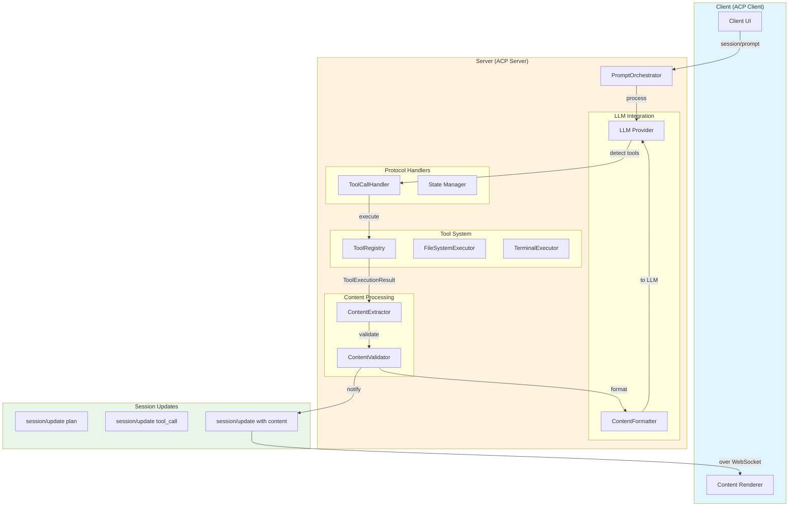
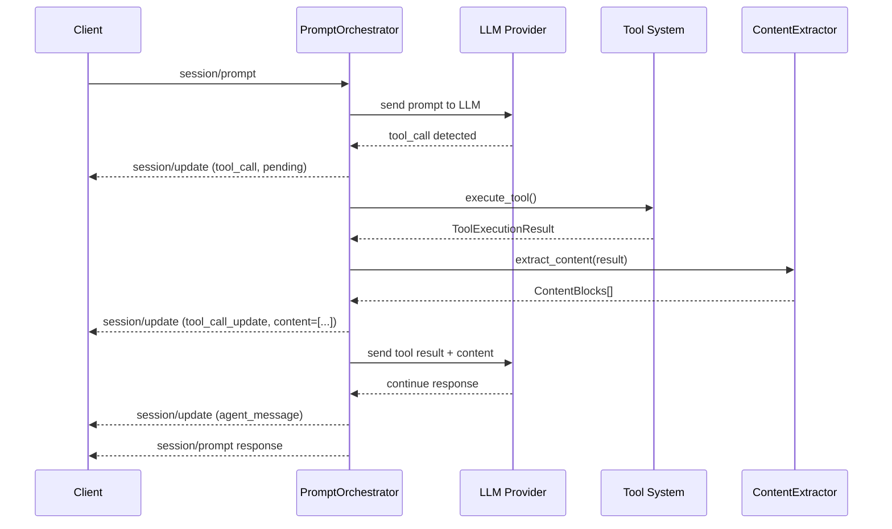
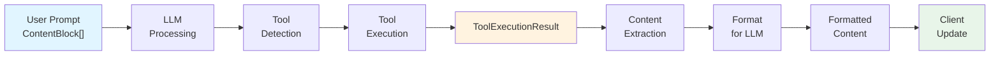
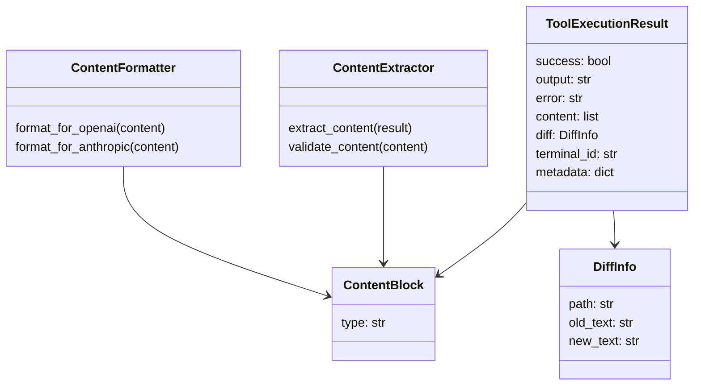

# Архитектура интеграции Content Types и Tool Calls в Prompt Turn

Документ описывает архитектурный дизайн Этапа 4 - интеграции Content Types (из Этапа 1-2) с Tool Calls Integration (из Этапа 3) в рамках полного цикла обработки Prompt Turn.

---

## a) Executive Summary

### Цели интеграции

Этап 4 завершает реализацию полного жизненного цикла обработки пользовательских запросов с полной поддержкой структурированного контента:

1. **Content-rich user inputs**: Пользователи отправляют промпты с текстом, изображениями, аудио и встроенными ресурсами
2. **Tool execution with content results**: Инструменты (FileSystem, Terminal) возвращают результаты в виде структурированного контента
3. **LLM-friendly content formatting**: Результаты инструментов форматируются для отправки обратно в языковую модель
4. **Client-side content rendering**: Клиент отображает контент из результатов инструментов в реальном времени

### Ключевые компоненты

- **ToolExecutionResult** (расширение) - результаты с поддержкой ContentBlocks
- **ContentExtractor** - извлечение контента из результатов инструментов
- **ContentFormatter** - трансформация контента для различных LLM провайдеров
- **ToolCallContentBuilder** - построение session/update notifications с контентом
- **PromptOrchestrator** (интеграция) - управление полным циклом с контентом

### Scope Этапа 4

**Входит:**
- Расширение ToolExecutionResult для поддержки ContentBlocks
- Обработка контента в PromptOrchestrator
- Форматирование контента для OpenAI и Anthropic провайдеров
- Session/update notifications с контентом
- Client-side обработка tool content

**Не входит (Этап 5+):**
- Трансформация контента (resizing, encoding)
- Stream-based контент transfer
- Кэширование результатов

---

## b) Protocol Specification Analysis

### 1. Prompt Turn цикл

Согласно [`doc/Agent Client Protocol/protocol/05-Prompt Turn.md`](../Agent%20Client%20Protocol/protocol/05-Prompt%20Turn.md):

**User Input (session/prompt):**
```json
{
  "method": "session/prompt",
  "params": {
    "sessionId": "sess_abc123",
    "prompt": [
      {
        "type": "text",
        "text": "Analyze this file:"
      },
      {
        "type": "resource",
        "resource": {
          "uri": "file:///path/to/file.py",
          "mimeType": "text/x-python",
          "text": "def process(): ..."
        }
      }
    ]
  }
}
```

**Agent Response Cycle:**
1. Plan update (опционально)
2. Agent message chunks
3. Tool calls (если требуются)
4. Tool execution and updates
5. Final response с stopReason

### 2. Content Types

Согласно [`doc/Agent Client Protocol/protocol/06-Content.md`](../Agent%20Client%20Protocol/protocol/06-Content.md):

**Поддерживаемые типы:**
- `text` - обычный текстовый контент
- `image` - изображения (base64, MIME type)
- `audio` - аудиоданные (base64, MIME type)
- `resource` - встроенные текстовые или бинарные ресурсы

Все типы контента соответствуют MCP (Model Context Protocol) спецификации.

### 3. Tool Calls спецификация

Согласно [`doc/Agent Client Protocol/protocol/08-Tool Calls.md`](../Agent%20Client%20Protocol/protocol/08-Tool%20Calls.md):

**Tool Call Update с контентом:**
```json
{
  "method": "session/update",
  "params": {
    "sessionId": "sess_abc123",
    "update": {
      "sessionUpdate": "tool_call_update",
      "toolCallId": "call_001",
      "status": "completed",
      "content": [
        {
          "type": "content",
          "content": {
            "type": "text",
            "text": "Tool result text"
          }
        },
        {
          "type": "diff",
          "path": "/path/to/file",
          "oldText": "old content",
          "newText": "new content"
        }
      ]
    }
  }
}
```

**Поддерживаемые ToolCallContent типы:**
- `content` - обычный ContentBlock
- `diff` - различия в файлах
- `terminal` - терминальный вывод

### 4. Integration Points в Prompt Turn Cycle

```
User sends prompt (with content)
        ↓
LLM processes (receives content)
        ↓
Tool calls detected
        ↓
Tool execution → ToolExecutionResult
        ↓
Content extraction (NEW - Этап 4)
        ↓
LLM context building (NEW - Этап 4)
        ↓
session/update notifications (with content)
        ↓
Client renders content
```

---

## c) Анализ текущего состояния

### Реализовано в Этап 1-3

**Content Types (Этап 1-2):**
- [`acp-client/src/acp_client/domain/content/base.py`](../../acp-client/src/acp_client/domain/content/base.py) - базовые классы
- [`acp-client/src/acp_client/domain/content/text.py`](../../acp-client/src/acp_client/domain/content/text.py) - TextContent
- [`acp-client/src/acp_client/domain/content/image.py`](../../acp-client/src/acp_client/domain/content/image.py) - ImageContent
- [`acp-client/src/acp_client/domain/content/audio.py`](../../acp-client/src/acp_client/domain/content/audio.py) - AudioContent
- [`acp-client/src/acp_client/domain/content/embedded.py`](../../acp-client/src/acp_client/domain/content/embedded.py) - EmbeddedResourceContent
- [`acp-client/src/acp_client/domain/content/resource_link.py`](../../acp-client/src/acp_client/domain/content/resource_link.py) - ResourceLinkContent

**Tool Calls Integration (Этап 3):**
- [`acp-server/src/acp_server/tools/base.py`](../../acp-server/src/acp_server/tools/base.py) - ToolRegistry, ToolExecutionResult
- [`acp-server/src/acp_server/protocol/handlers/tool_call_handler.py`](../../acp-server/src/acp_server/protocol/handlers/tool_call_handler.py) - ToolCallHandler
- [`acp-server/src/acp_server/protocol/handlers/prompt_orchestrator.py`](../../acp-server/src/acp_server/protocol/handlers/prompt_orchestrator.py) - PromptOrchestrator
- FileSystem и Terminal executors

### Текущие gaps (пробелы)

1. **ToolExecutionResult не поддерживает Content** - только текстовый output
2. **PromptOrchestrator не обрабатывает контент** - нет extraction/formatting
3. **LLM провайдеры не знают о контенте** - нет преобразования для OpenAI/Anthropic
4. **Client-side обработка неполна** - session/update не содержит контент
5. **Нет тестов для контента в tool results** - отсутствует coverage

---

## d) Архитектурный дизайн

### 1. Component Diagram



### 2. Sequence Diagram: Tool Call with Content



### 3. Data Flow Diagram



### 4. Class Diagram: Content Integration



---

## e) Implementation Plan

### Фаза 1: Расширение ToolExecutionResult

**Цель**: Добавить поддержку структурированного контента в результаты инструментов

**Файлы для изменения:**
- [`acp-server/src/acp_server/tools/base.py`](../../acp-server/src/acp_server/tools/base.py)

**Добавить классы:**
```python
@dataclass
class DiffInfo:
    path: str
    old_text: str | None = None
    new_text: str | None = None

@dataclass
class ToolExecutionResult:
    success: bool
    output: str | None = None
    error: str | None = None
    content: list[dict] | None = None  # ContentBlocks
    diff: DiffInfo | None = None
    terminal_id: str | None = None
    metadata: dict | None = None
```

**Тесты:** Backward compatibility, content validation

### Фаза 2: Content Extraction в PromptOrchestrator

**Цель**: Извлечение ContentBlocks из результатов инструментов

**Новые модули:**
- `acp-server/src/acp_server/protocol/content/extractor.py`
- `acp-server/src/acp_server/protocol/content/validator.py`

**Класс ContentExtractor:**
- `extract_content(result: ToolExecutionResult) → list[dict]`
- Трансформирует в ToolCallContent формат
- Обрабатывает различные типы контента

**Тесты:** Extraction для текста, diff, изображений

### Фаза 3: Content Formatting для LLM

**Цель**: Трансформация контента в формат конкретных LLM провайдеров

**Новый модуль:**
- `acp-server/src/acp_server/llm/content_formatters.py`

**Классы:**
- `ContentFormatter` - базовый интерфейс
- `OpenAIContentFormatter` - для OpenAI API
- `AnthropicContentFormatter` - для Anthropic API

**Интеграция:**
- Добавить в [`acp-server/src/acp_server/llm/base.py`](../../acp-server/src/acp_server/llm/base.py)
- Использовать в [`acp-server/src/acp_server/protocol/handlers/prompt_orchestrator.py`](../../acp-server/src/acp_server/protocol/handlers/prompt_orchestrator.py)

**Тесты:** OpenAI format compliance, Anthropic format compliance

### Фаза 4: Client-side Content Rendering

**Цель**: Отправка и обработка контента на клиентской стороне

**Обновить файлы:**
- [`acp-client/src/acp_client/infrastructure/handlers/`](../../acp-client/src/acp_client/infrastructure/handlers/)
- [`acp-client/src/acp_client/presentation/`](../../acp-client/src/acp_client/presentation/)

**Логика:**
- Message routing для tool content
- Content rendering для каждого типа
- Integration с UI view models

**Тесты:** Content handling, rendering logic

### Фаза 5: Testing Strategy

**Минимальные требования:**
- Unit tests: 85%+ coverage
- Integration tests для полного цикла
- E2E сценарии для основных типов контента
- Backward compatibility tests

**Test organization:**
- `acp-server/tests/test_content_extractor.py`
- `acp-server/tests/test_content_formatters.py`
- `acp-server/tests/test_tool_content_integration.py`
- `acp-server/tests/test_prompt_content_e2e.py`

---

## f) Technical Specifications

### 1. Content Serialization

**Text to ToolCallContent:**
```json
{
  "type": "content",
  "content": {
    "type": "text",
    "text": "Result text"
  }
}
```

**Diff to ToolCallContent:**
```json
{
  "type": "diff",
  "path": "/path/to/file",
  "oldText": "old",
  "newText": "new"
}
```

**Image to ToolCallContent:**
```json
{
  "type": "content",
  "content": {
    "type": "image",
    "mimeType": "image/png",
    "data": "base64data"
  }
}
```

### 2. LLM Provider Compatibility

**OpenAI Tool Result Format:**
```json
{
  "type": "tool",
  "tool_use_id": "call_001",
  "content": [
    {"type": "text", "text": "result"}
  ]
}
```

**Anthropic Tool Result Format:**
```json
{
  "type": "tool_result",
  "tool_use_id": "call_001",
  "content": [
    {"type": "text", "text": "result"}
  ]
}
```

### 3. Error Handling

**Invalid Content:**
- Логирование ошибки
- Fallback на текстовый формат
- Продолжение обработки

**Tool Execution Error:**
- `success: false` в ToolExecutionResult
- Отправка error текста в session/update
- Содержание контента в error case

**Unsupported Content Type:**
- Трансформация в поддерживаемый формат
- Логирование unsupported типа
- Отправка warning в client

### 4. Performance

**Content Size Limits:**
- Text: до 100KB
- Image: до 5MB (base64)
- Audio: до 25MB (base64)
- Total per tool result: до 50MB

**Lazy Loading:**
- Большие файлы - отправить metadata и preview
- Client запрашивает полный контент отдельно

---

## g) Testing Strategy

### Unit Tests

**ContentExtractor:**
- Extraction текста
- Extraction diff
- Extraction images
- Invalid content handling
- Empty results

**ContentFormatter:**
- OpenAI formatting
- Anthropic formatting
- Unsupported types handling
- Error cases

### Integration Tests

**Tool Execution with Content:**
```python
# Tool returns structured content
result = await executor.execute(session, args)
assert result.content is not None
assert len(result.content) > 0
```

**PromptOrchestrator Content Handling:**
```python
# Orchestrator processes tool results with content
notifications = await orchestrator.handle_tool_result(
    session, "call_001", result_with_content
)
assert any("content" in u for u in notifications)
```

### E2E Scenarios

**Text Content Flow:**
User → Server → Tool → Content → LLM → Client

**File Modification Flow:**
Tool modifies file → DiffInfo extracted → Client renders diff

**Image Analysis Flow:**
Client sends image → LLM requests tool → Tool returns image+text → Client renders

### Coverage Targets

- Unit: 85%+
- Integration: 75%+
- Critical paths: 100%

---

## h) Migration Path

### Backward Compatibility

Старый код с только `output` продолжает работать:
```python
result = ToolExecutionResult(
    success=True,
    output="text"
    # content = None (default)
)
```

### Gradual Migration

1. Новый код может использовать `content`
2. Executors обновляются постепенно
3. Deprecation warnings через 2-3 релиза

### Version Strategy

- Protocol version: остаётся v1.0
- ToolExecutionResult: совместимое расширение

---

## Summary

Этап 4 интегрирует Content Types с Tool Calls в полный Prompt Turn цикл:

1. Расширение ToolExecutionResult для контента
2. Extraction контента из результатов
3. Formatting для LLM провайдеров
4. Client notifications и rendering
5. Comprehensive testing (85%+ coverage)

**Результат:** Полная поддержка структурированного контента в результатах инструментов с сохранением backward compatibility.

---

**Версия:** 1.0 | **Дата:** 16 апреля 2026 г.
