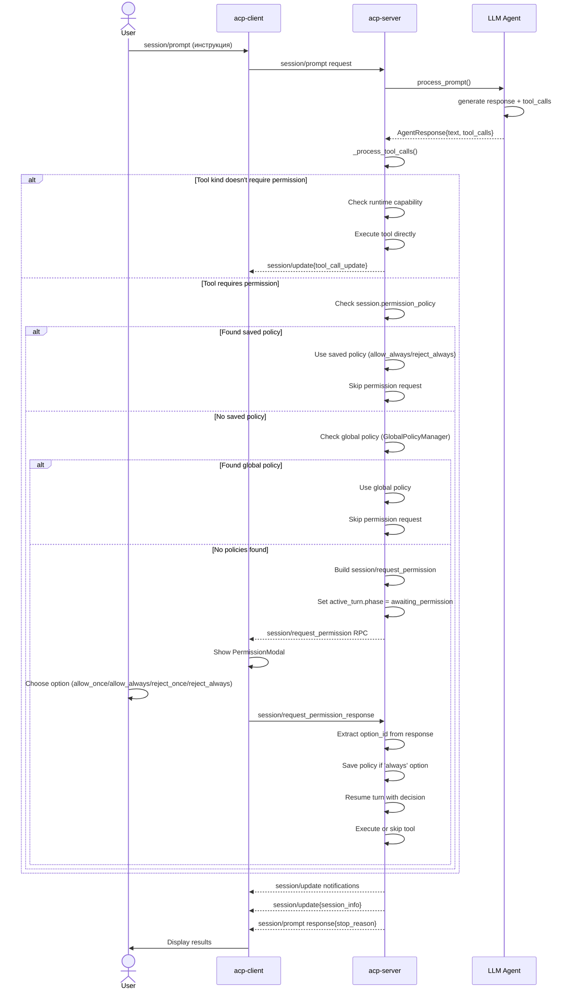
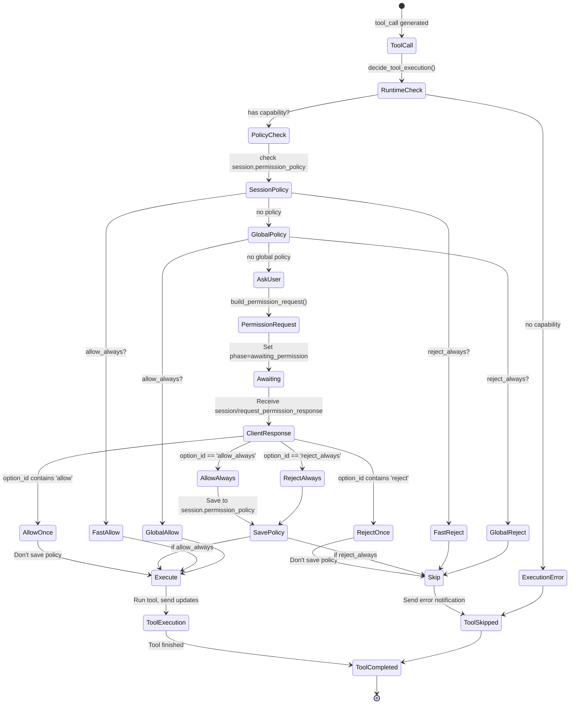
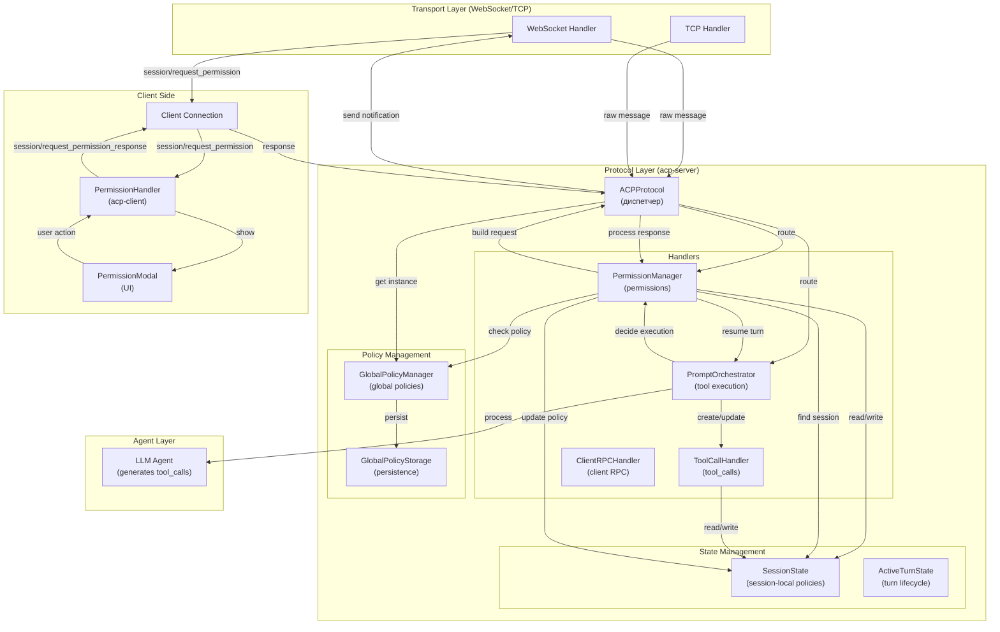

# Архитектура интеграции Permissions на acp-server

**Версия**: 1.0  
**Дата**: 2026-04-17  
**Статус**: Архитектурное проектирование  
**Автор**: Техническая команда

---

## 1. Обзор

### 1.1 Проблема

Сервер ACP имеет полностью реализованную систему управления разрешениями:
- [`PermissionManager`](../../acp-server/src/acp_server/protocol/handlers/permission_manager.py) готов создавать `session/request_permission` запросы
- [`GlobalPolicyManager`](../../acp-server/src/acp_server/protocol/handlers/global_policy_manager.py) готов проверять глобальные политики
- [`SessionState`](../../acp-server/src/acp_server/protocol/state.py) хранит все необходимые поля

**Однако:**
- Отправка `session/request_permission` происходит **ручно** в обработчиках tool calls
- Нет **унифицированного flow** для принятия решений о выполнении tool calls
- **Timeout и cancellation** требуют явной обработки в транспортном слое
- Корреляция **request/response** зависит от клиента

### 1.2 Цели интеграции

Создать **унифицированный архитектурный паттерн** для:

1. **Инициация** — когда агент генерирует tool call, сервер должен решить: выполнить, отклонить или попросить разрешение
2. **Decision Logic** — implement fallback chain: session policy → global policy → ask user
3. **Request Flow** — отправка `session/request_permission` с корректной корреляцией ID
4. **Response Handling** — обработка клиентского ответа (allow_once, allow_always, reject_once, reject_always)
5. **Persistence** — сохранение `allow_always`/`reject_always` политик в session
6. **Error Handling** — cancellation, network errors, concurrent requests (timeout опциональный)
7. **Backward Compatibility** — существующий API остается неизменным

**Важно**: Протокол ACP не определяет обязательный timeout для ожидания permission response. Сервер может ждать ответа неограниченно долго или имплементировать timeout на своё усмотрение.

### 1.3 Scope

**Входит:**
- Анализ текущей реализации компонентов
- Определение точек интеграции в `PromptOrchestrator`
- Архитектурная схема decision flow
- Примеры кода для ключевых изменений
- План тестирования
- План пошаговой реализации

**Не входит:**
- Изменение протокола ACP (используется как есть)
- Реализация кода (только архитектура и примеры)
- UI компоненты клиента (уже готовы в acp-client)

---

## 2. Анализ существующих компонентов

### 2.1 PermissionManager

**Файл**: [`acp-server/src/acp_server/protocol/handlers/permission_manager.py`](../../acp-server/src/acp_server/protocol/handlers/permission_manager.py)

**Ответственность**: Управление разрешениями и permission request flow.

**Ключевые методы**:

```python
# Проверка, нужен ли permission request
should_request_permission(session: SessionState, tool_kind: str) -> bool
    # Returns: True если policy не установлена или != ask
    # Используется для быстрого пути (allow/reject без запроса)

# Получить remembered решение
get_remembered_permission(session: SessionState, tool_kind: str) -> str
    # Returns: 'allow' | 'reject' | 'ask'

# Построить permission request message (RPC request)
build_permission_request(
    session: SessionState,
    session_id: str,
    tool_call_id: str,
    tool_title: str,
    tool_kind: str,
) -> ACPMessage
    # Returns: ACPMessage с методом "session/request_permission"
    # Side effect: сохраняет permission_request_id в session.active_turn

# Извлечь ответ из response
extract_permission_outcome(result: Any) -> str | None
    # Returns: "selected" | None
extract_permission_option_id(result: Any) -> str | None
    # Returns: "allow_once" | "allow_always" | "reject_once" | "reject_always" | None

# Найти option kind по ID
resolve_permission_option_kind(
    option_id: str | None,
    permission_options: list[dict[str, Any]],
) -> str | None
    # Returns: "allow_once" | "allow_always" | "reject_once" | "reject_always" | None

# Построить updates после выбора опции
build_permission_acceptance_updates(
    session: SessionState,
    session_id: str,
    tool_call_id: str,
    option_id: str,
) -> list[ACPMessage]
    # Side effect: сохраняет "allow_always"/"reject_always" в session.permission_policy

# Найти сессию по permission request ID
find_session_by_permission_request_id(
    permission_request_id: JsonRpcId,
    sessions: dict[str, SessionState],
) -> SessionState | None
    # Returns: SessionState с активным turn, ожидающим ответа
```

**Состояние**: ✅ Готов к использованию. Не требует изменений для базовой интеграции.

---

### 2.2 GlobalPolicyManager

**Файл**: [`acp-server/src/acp_server/protocol/handlers/global_policy_manager.py`](../../acp-server/src/acp_server/protocol/handlers/global_policy_manager.py)

**Ответственность**: Singleton для управления глобальными permission policies.

**Ключевые методы**:

```python
# Получить singleton instance (thread-safe)
async def get_instance(
    cls, storage_path: Path | None = None
) -> GlobalPolicyManager

# Получить global policy для tool_kind
async def get_global_policy(self, tool_kind: str) -> str | None
    # Returns: "allow_always" | "reject_always" | None

# Установить policy (сохраняется в persistence)
async def set_global_policy(self, tool_kind: str, decision: str) -> None
    # decision: "allow_always" | "reject_always"
    # Side effect: сохраняет в глобальный storage

# Удалить policy
async def delete_global_policy(self, tool_kind: str) -> None
```

**Использование в flow**: 
- Fallback chain: `session policy` → `global policy` → `ask user`
- Инициализируется в [`ACPProtocol.__init__()`](../../acp-server/src/acp_server/protocol/core.py)
- Передается в [`PromptOrchestrator`](../../acp-server/src/acp_server/protocol/handlers/prompt_orchestrator.py)

**Состояние**: ✅ Готов. Требует инъекции в компоненты для fallback chain.

---

### 2.3 SessionState

**Файл**: [`acp-server/src/acp_server/protocol/state.py`](../../acp-server/src/acp_server/protocol/state.py)

**Ключевые поля для permissions**:

```python
@dataclass
class SessionState:
    # Session-local permission policies (вторая ступень fallback)
    permission_policy: dict[str, str]  # tool_kind -> "allow_always"/"reject_always"
    
    # Активный turn (если есть)
    active_turn: ActiveTurnState | None
    
    # Pending permission requests для асинхронного ожидания
    pending_permission_requests: dict[JsonRpcId, asyncio.Future]
    
    # Отмененные permission requests (для игнорирования late responses)
    cancelled_permission_requests: set[JsonRpcId]

@dataclass
class ActiveTurnState:
    # ID входящего prompt request
    prompt_request_id: JsonRpcId | None
    
    # ID исходящего permission request (при режиме 'ask')
    permission_request_id: JsonRpcId | None
    
    # Связанный tool call, ожидающий решения
    permission_tool_call_id: str | None
    
    # Фаза жизненного цикла turn ("running", "awaiting_permission", "finalized")
    phase: str
```

**Состояние**: ✅ Все поля уже существуют. Готово к использованию.

---

### 2.4 ToolCallHandler

**Файл**: [`acp-server/src/acp_server/protocol/handlers/tool_call_handler.py`](../../acp-server/src/acp_server/protocol/handlers/tool_call_handler.py)

**Ответственность**: Управление жизненным циклом tool calls.

**Ключевые методы**:

```python
# Проверить, доступен ли tool runtime
can_run_tools(self, session: SessionState) -> bool
    # Returns: True если есть capability (terminal/fs_read/fs_write)

# Создать новый tool call
create_tool_call(
    self,
    session: SessionState,
    *,
    title: str,
    kind: str,
) -> str
    # Returns: tool_call_id вида "call_NNN"

# Обновить статус tool call
update_tool_call_status(
    self,
    session: SessionState,
    tool_call_id: str,
    status: str,  # pending -> in_progress -> completed/cancelled/failed
    content: list[dict[str, Any]] | None = None,
) -> bool
    # Returns: True если обновление успешно

# Построить уведомление для tool call (session/update)
build_tool_call_notification(...) -> ACPMessage
```

**Состояние**: ✅ Готов. Интегрируется в `PromptOrchestrator`.

---

### 2.5 PromptOrchestrator

**Файл**: [`acp-server/src/acp_server/protocol/handlers/prompt_orchestrator.py`](../../acp-server/src/acp_server/protocol/handlers/prompt_orchestrator.py)

**Ответственность**: Главный оркестратор обработки prompt-turn.

**Ключевой метод**:

```python
async def handle_prompt(
    self,
    request_id: JsonRpcId | None,
    params: dict[str, Any],
    session: SessionState,
    sessions: dict[str, SessionState],
    agent_orchestrator: AgentOrchestrator,
) -> ProtocolOutcome:
    # Шаги:
    # 1. Создать active_turn
    # 2. Отправить ACK notification
    # 3. Обработать через LLM-агента
    # 4. Обработать tool_calls
    # 5. Отправить session info
    # 6. Финализировать turn
    # Returns: ProtocolOutcome с notifications и response
```

**Метод для tool calls** (требует реализации decision logic):

```python
async def _process_tool_calls(
    self,
    session: SessionState,
    session_id: str,
    tool_calls: list[ToolCall],
    notifications: list[ACPMessage],
) -> None:
    # For each tool_call:
    # 1. Создать tool call в session
    # 2. Решить: execute, reject, или ask
    # 3. Если ask - отправить session/request_permission
    # 4. Если execute - выполнить tool
    # 5. Если reject - отправить error notification
```

**Состояние**: ✅ Основная структура готова. Требует реализации decision logic в `_process_tool_calls()`.

---

### 2.6 ACPProtocol (основной диспетчер)

**Файл**: [`acp-server/src/acp_server/protocol/core.py`](../../acp-server/src/acp_server/protocol/core.py)

**Ответственность**: Диспетчер ACP-методов и управление сессиями.

**Инъекция компонентов**:

```python
class ACPProtocol:
    def __init__(
        self,
        ...,
        storage: SessionStorage | None = None,
        agent_orchestrator: AgentOrchestrator | None = None,
        client_rpc_service: ClientRPCService | None = None,
        tool_registry: ToolRegistry | None = None,
    ):
        self._storage = storage
        self._agent_orchestrator = agent_orchestrator
        self._client_rpc_service = client_rpc_service
        self._tool_registry = tool_registry
        self._global_policy_manager: GlobalPolicyManager | None = None
        # ... инициализация оркестратора
```

**Состояние**: ✅ Готов. Требует инъекции `GlobalPolicyManager` при инициализации.

---

## 3. Архитектура интеграции

### 3.1 Decision Flow

```
Tool Call Generated
    ↓
[1] Проверка доступности runtime
    ├─ Нет capability → Skip tool, send error notification
    └─ Есть capability → Continue
    ↓
[2] Проверка remembered policy
    ├─ session.permission_policy[tool_kind] == "allow_always" → Allow (fast path)
    ├─ session.permission_policy[tool_kind] == "reject_always" → Reject (fast path)
    └─ Нет → Continue
    ↓
[3] Проверка global policy (fallback)
    ├─ global_policy[tool_kind] == "allow_always" → Allow
    ├─ global_policy[tool_kind] == "reject_always" → Reject
    └─ Нет → Continue
    ↓
[4] Ask user (default)
    ├─ Создать session/request_permission
    ├─ Добавить в notifications
    ├─ Перейти в фазу "awaiting_permission"
    └─ Ждать response
    ↓
[5] Обработать response
    ├─ allow_once → Execute tool once, don't save policy
    ├─ allow_always → Execute tool, save to session.permission_policy
    ├─ reject_once → Skip tool, don't save policy
    └─ reject_always → Skip tool, save to session.permission_policy
    ↓
Tool Execution or Skip
```

### 3.2 Интеграционные точки

**Точка 1: Инициация decision flow**

Где: `PromptOrchestrator._process_tool_calls()`
Когда: Агент вернул tool_calls в response
Что делать: Для каждого tool call вызвать `decide_tool_execution()`

```python
# Pseudo-code
for tool_call in agent_response.tool_calls:
    # Создать tool_call_state в session
    tool_call_id = self.tool_call_handler.create_tool_call(
        session, title=tool_call.name, kind="execute"
    )
    
    # Принять решение
    decision = await self._decide_tool_execution(
        session, tool_call, tool_kind="execute"
    )
    # decision: "allow" | "reject" | "ask"
    
    if decision == "allow":
        # Выполнить tool
        await self._execute_tool(...)
    elif decision == "reject":
        # Отправить error notification
        self._send_rejection_notification(...)
    elif decision == "ask":
        # Отправить permission request
        permission_msg = self.permission_manager.build_permission_request(...)
        notifications.append(permission_msg)
        session.active_turn.phase = "awaiting_permission"
```

**Точка 2: Обработка ответа permission request**

Где: `ACPProtocol.handle()` при получении `session/request_permission_response`
Когда: Клиент отправил ответ на permission запрос
Что делать: Найти сессию, извлечь outcome, обновить policy, возобновить turn

```python
# Pseudo-code в обработчике session/request_permission_response
request_id = message.id
result = message.result

# Найти сессию с активным permission request
session = self.permission_manager.find_session_by_permission_request_id(
    request_id, self._sessions
)

if session is None:
    # Проверить, был ли request отменен
    if permissions.consume_cancelled_permission_response(request_id, self._sessions):
        return ProtocolOutcome(response=ACPMessage.response(request_id, {}))
    else:
        return ProtocolOutcome(response=ACPMessage.error(request_id, "Unknown request"))

# Извлечь решение из response
outcome = self.permission_manager.extract_permission_outcome(result)
option_id = self.permission_manager.extract_permission_option_id(result)

if outcome == "selected" and option_id:
    # Определить decision (allow/reject)
    decision = "allow" if "allow" in option_id else "reject"
    
    # Сохранить policy если needed (allow_always/reject_always)
    updates = self.permission_manager.build_permission_acceptance_updates(
        session, session_id, tool_call_id, option_id
    )
    
    # Возобновить turn с полученным decision
    await self._resume_turn_with_decision(session, decision)
```

**Точка 3: Обработка отмены (session/cancel)**

Где: `ACPProtocol.handle()` при получении `session/cancel`
Когда: Клиент отменил prompt turn
Что делать: Отменить активный permission request и все pending tool calls

```python
# Pseudo-code
if session.active_turn.permission_request_id:
    # Добавить в tombstone для позднего игнорирования response
    session.cancelled_permission_requests.add(
        session.active_turn.permission_request_id
    )
    
    # Очистить pending future если есть
    future = session.pending_permission_requests.pop(
        session.active_turn.permission_request_id, None
    )
    if future and not future.done():
        future.cancel()
```

---

## 4. Flow диаграммы

### 4.1 Sequence: E2E Permission Flow



### 4.2 State Diagram: Permission Request States



### 4.3 Component Diagram: Server Permissions Architecture



---

## 5. Точки изменения (реализационные задачи)

### 5.1 PromptOrchestrator._process_tool_calls() - Decision Logic

**Файл**: `acp-server/src/acp_server/protocol/handlers/prompt_orchestrator.py`

**Текущее состояние**: Метод существует, но decision logic не реализована

**Изменение**:

```python
async def _process_tool_calls(
    self,
    session: SessionState,
    session_id: str,
    tool_calls: list[ToolCall],
    notifications: list[ACPMessage],
) -> None:
    """Обрабатывает tool calls с decision logic для permissions.
    
    For each tool_call:
    1. Создать tool_call_state в session
    2. Решить: execute, reject, ask
    3. Отправить permission request если нужно
    4. Выполнить tool если разрешено
    """
    for tool_call in tool_calls:
        tool_kind = tool_call.get("kind", "other")
        tool_call_id = self.tool_call_handler.create_tool_call(
            session,
            title=tool_call.get("name", "Tool call"),
            kind=tool_kind,
        )
        
        # [CHANGE 1] Decision logic
        decision = await self._decide_tool_execution(
            session=session,
            tool_kind=tool_kind,
        )
        
        if decision == "allow":
            # Выполнить tool
            await self._execute_tool_call(
                session, session_id, tool_call, tool_call_id, notifications
            )
        elif decision == "reject":
            # Отправить error notification
            error_msg = ACPMessage.notification("session/update", {
                "sessionId": session_id,
                "update": {
                    "sessionUpdate": "tool_call_update",
                    "toolCallId": tool_call_id,
                    "status": "failed",
                    "content": [{
                        "type": "content",
                        "content": {
                            "type": "text",
                            "text": f"Tool execution rejected by policy for {tool_kind}"
                        }
                    }]
                }
            })
            notifications.append(error_msg)
            self.tool_call_handler.update_tool_call_status(
                session, tool_call_id, "failed"
            )
        elif decision == "ask":
            # Отправить permission request
            permission_msg = self.permission_manager.build_permission_request(
                session=session,
                session_id=session_id,
                tool_call_id=tool_call_id,
                tool_title=tool_call.get("name", "Tool call"),
                tool_kind=tool_kind,
            )
            notifications.append(permission_msg)
            
            # Перейти в фазу awaiting_permission
            if session.active_turn:
                session.active_turn.phase = "awaiting_permission"
                session.active_turn.permission_tool_call_id = tool_call_id

async def _decide_tool_execution(
    self,
    session: SessionState,
    tool_kind: str,
) -> str:
    """Принимает решение о выполнении tool: 'allow' | 'reject' | 'ask'.
    
    Fallback chain:
    1. session.permission_policy[tool_kind]
    2. global_policy[tool_kind] (если доступен GlobalPolicyManager)
    3. ask (default)
    
    Returns:
        'allow' - выполнить tool
        'reject' - отклонить tool
        'ask' - запросить разрешение у пользователя
    """
    # [CHANGE 2] Implement fallback chain
    
    # 1. Check session policy
    session_policy = session.permission_policy.get(tool_kind)
    if session_policy == "allow_always":
        return "allow"
    if session_policy == "reject_always":
        return "reject"
    
    # 2. Check global policy (if manager available)
    if hasattr(self, "_global_policy_manager") and self._global_policy_manager:
        global_policy = await self._global_policy_manager.get_global_policy(tool_kind)
        if global_policy == "allow_always":
            return "allow"
        if global_policy == "reject_always":
            return "reject"
    
    # 3. Default: ask user
    return "ask"
```

### 5.2 ACPProtocol - Инъекция GlobalPolicyManager

**Файл**: `acp-server/src/acp_server/protocol/core.py`

**Текущее состояние**: `_global_policy_manager` инициализируется как `None`

**Изменение**:

```python
class ACPProtocol:
    def __init__(
        self,
        *,
        ...,
        global_policy_manager: GlobalPolicyManager | None = None,
    ) -> None:
        # ... existing code ...
        
        # [CHANGE 3] Inject GlobalPolicyManager
        self._global_policy_manager = global_policy_manager
        
        # Инициализировать оркестратор с global_policy_manager
        self._prompt_orchestrator = create_prompt_orchestrator(
            tool_registry=tool_registry,
            client_rpc_service=client_rpc_service,
        )
        # Передать global_policy_manager в оркестратор
        if hasattr(self._prompt_orchestrator, "set_global_policy_manager"):
            self._prompt_orchestrator.set_global_policy_manager(
                global_policy_manager
            )

    async def handle(self, message: ACPMessage) -> ProtocolOutcome:
        # ... existing routing ...
        
        # [CHANGE 4] Handle session/request_permission_response
        if method == "session/request_permission_response":
            return await self._handle_permission_response(
                message_id, params, sessions
            )

async def _handle_permission_response(
    self,
    request_id: JsonRpcId,
    params: dict[str, Any],
    sessions: dict[str, SessionState],
) -> ProtocolOutcome:
    """Обрабатывает response на session/request_permission.
    
    Экстрагирует solution, обновляет policy, возобновляет turn.
    """
    # [CHANGE 5] Handle permission response
    
    result = params.get("result", {})
    
    # Найти сессию с активным permission request
    session = None
    for session_candidate in sessions.values():
        if session_candidate.active_turn and \
           session_candidate.active_turn.permission_request_id == request_id:
            session = session_candidate
            break
    
    if session is None:
        # Проверить, был ли request отменен
        from .handlers.permissions import consume_cancelled_permission_response
        if consume_cancelled_permission_response(request_id, sessions):
            return ProtocolOutcome(response=ACPMessage.response(request_id, {}))
        return ProtocolOutcome(
            response=ACPMessage.error(request_id, "Unknown permission request")
        )
    
    # Извлечь решение
    outcome = self._permission_manager.extract_permission_outcome(result)
    option_id = self._permission_manager.extract_permission_option_id(result)
    
    if outcome != "selected" or not option_id:
        return ProtocolOutcome(
            response=ACPMessage.error(request_id, "Invalid permission response")
        )
    
    # Сохранить policy если needed
    updates = self._permission_manager.build_permission_acceptance_updates(
        session,
        session.session_id,
        session.active_turn.permission_tool_call_id or "",
        option_id,
    )
    
    # Определить decision
    decision = "allow" if "allow" in option_id else "reject"
    
    # Возобновить turn
    await self._resume_turn_with_permission_decision(
        session, decision, sessions
    )
    
    return ProtocolOutcome(
        response=ACPMessage.response(request_id, {}),
        notifications=updates,
    )
```

### 5.3 PromptOrchestrator - Добавить инъекцию GlobalPolicyManager

**Файл**: `acp-server/src/acp_server/protocol/handlers/prompt_orchestrator.py`

**Изменение**:

```python
class PromptOrchestrator:
    def __init__(
        self,
        # ... existing params ...
        global_policy_manager: GlobalPolicyManager | None = None,
    ):
        # ... existing code ...
        
        # [CHANGE 6] Store global_policy_manager for fallback chain
        self._global_policy_manager = global_policy_manager

    def set_global_policy_manager(
        self, manager: GlobalPolicyManager | None
    ) -> None:
        """Установить GlobalPolicyManager после инициализации."""
        self._global_policy_manager = manager
```

---

## 6. Обработка ответов клиента

### 6.1 Возможные ответы

Согласно ACP спецификации (см. [`doc/Agent Client Protocol/protocol/08-Tool Calls.md`](../../doc/Agent Client Protocol/protocol/08-Tool Calls.md)), клиент может ответить:

```json
{
  "jsonrpc": "2.0",
  "id": "perm_123",
  "result": {
    "outcome": {
      "outcome": "selected",
      "optionId": "allow_once"  // or allow_always, reject_once, reject_always
    }
  }
}
```

### 6.2 Обработка каждого исхода

```
allow_once (разрешить один раз)
├─ Decision: execute tool now
├─ Save policy: NO
└─ Result: Tool executed, policy not remembered

allow_always (разрешить всегда)
├─ Decision: execute tool now
├─ Save policy: YES → session.permission_policy[tool_kind] = "allow_always"
└─ Result: Future tool calls of same kind will execute without asking

reject_once (отклонить один раз)
├─ Decision: skip tool, send error
├─ Save policy: NO
└─ Result: Tool skipped, policy not remembered

reject_always (отклонить всегда)
├─ Decision: skip tool, send error
├─ Save policy: YES → session.permission_policy[tool_kind] = "reject_always"
└─ Result: Future tool calls of same kind will be rejected without asking
```

### 6.3 Реализация в PermissionManager

Метод `build_permission_acceptance_updates()` уже реализован:

```python
def build_permission_acceptance_updates(
    self,
    session: SessionState,
    session_id: str,
    tool_call_id: str,
    option_id: str,
) -> list[ACPMessage]:
    """Строит updates после выбора опции разрешения."""
    
    notifications: list[ACPMessage] = []
    
    # Определяем решение и нужно ли сохранять policy
    if option_id == "allow_once":
        decision = "allow"
        should_save_policy = False
    elif option_id == "allow_always":
        decision = "allow"
        should_save_policy = True
    elif option_id == "reject_once":
        decision = "reject"
        should_save_policy = False
    elif option_id == "reject_always":
        decision = "reject"
        should_save_policy = True
    
    # Сохранить policy если needed
    if should_save_policy:
        tool_call = session.tool_calls.get(tool_call_id)
        if tool_call:
            policy_value = "allow_always" if decision == "allow" else "reject_always"
            session.permission_policy[tool_call.kind] = policy_value
    
    return notifications
```

---

## 7. Error Handling

### 7.1 Timeout (опциональный, зависит от реализации)

**Важно**: ACP протокол (см. [`doc/Agent Client Protocol/protocol/05-Prompt Turn.md`](../../doc/Agent Client Protocol/protocol/05-Prompt Turn.md) и [`08-Tool Calls.md`](../../doc/Agent Client Protocol/protocol/08-Tool Calls.md)) **НЕ определяет обязательный timeout** для ожидания permission response. Сервер может:

**Вариант 1: Ждать неограниченное время (более правильно по протоколу)**

Сервер дождется ответа от пользователя, как бы долго это ни заняло. Этот подход соответствует спецификации ACP, где нет явного требования о timeout.

```python
async def _wait_for_permission_response(
    self,
    session: SessionState,
    permission_request_id: JsonRpcId,
) -> str:
    """Дождаться ответа на permission request без timeout."""
    
    # Создать future для ожидания ответа
    future = asyncio.Future()
    session.pending_permission_requests[permission_request_id] = future
    
    try:
        # Ждать response неограниченно долго
        decision = await future
        return decision  # "allow" or "reject"
    finally:
        # Cleanup
        session.pending_permission_requests.pop(permission_request_id, None)
```

**Вариант 2: Timeout (опциональный, для production)**

Если сервер нужно защитить от зависания на неответчивых клиентах:

```python
import asyncio
from datetime import timedelta

# Конфигурируемый timeout (опциональный)
PERMISSION_REQUEST_TIMEOUT = timedelta(minutes=5)  # или None для отсутствия timeout

async def _wait_for_permission_response(
    self,
    session: SessionState,
    permission_request_id: JsonRpcId,
    timeout: timedelta | None = None,
) -> str:
    """Дождаться ответа на permission request с опциональным timeout."""
    
    # Создать future для ожидания ответа
    future = asyncio.Future()
    session.pending_permission_requests[permission_request_id] = future
    
    try:
        if timeout is None:
            # Ждать неограниченно долго
            decision = await future
        else:
            # Ждать с timeout
            decision = await asyncio.wait_for(
                future,
                timeout=timeout.total_seconds()
            )
        return decision  # "allow" or "reject"
    except asyncio.TimeoutError:
        # Timeout - treat as reject (или другая стратегия)
        logger.warning(
            "Permission request timeout",
            session_id=session.session_id,
            permission_request_id=permission_request_id,
        )
        # Опционально: отправить error notification
        # или просто отклонить tool
        return "reject"
    finally:
        # Cleanup
        session.pending_permission_requests.pop(permission_request_id, None)
```

**Рекомендация для реализации**: 
- Начать с **Варианта 1** (без timeout) для соответствия протоколу
- Добавить timeout позже, если потребуется, через конфигурацию (параметр PERMISSION_REQUEST_TIMEOUT)

### 7.2 Отмена (session/cancel)

**Проблема**: Пользователь может отменить turn, включая активный permission request.

**Решение**:

```python
# В обработчике session/cancel
async def _handle_session_cancel(
    self,
    request_id: JsonRpcId,
    session: SessionState,
) -> ProtocolOutcome:
    """Обрабатывает session/cancel."""
    
    if session.active_turn is None:
        return ProtocolOutcome(
            response=ACPMessage.response(request_id, {})
        )
    
    # Отменить активный permission request
    if session.active_turn.permission_request_id:
        # Добавить в tombstone для игнорирования поздних response
        session.cancelled_permission_requests.add(
            session.active_turn.permission_request_id
        )
        
        # Отменить pending future если есть
        future = session.pending_permission_requests.pop(
            session.active_turn.permission_request_id, None
        )
        if future and not future.done():
            future.cancel()
    
    # Отменить all pending tool calls
    for tool_call_id, tool_call in session.tool_calls.items():
        if tool_call.status == "pending":
            self.tool_call_handler.update_tool_call_status(
                session, tool_call_id, "cancelled"
            )
    
    # Завершить turn
    session.active_turn.phase = "finalized"
    
    return ProtocolOutcome(response=ACPMessage.response(request_id, {}))
```

### 7.3 Late Response (ответ после отмены)

**Проблема**: Клиент может ответить на отмененный permission request.

**Решение**: 

Использовать tombstone set `cancelled_permission_requests`:

```python
# В обработчике session/request_permission_response
from .handlers.permissions import consume_cancelled_permission_response

if request_id not in session.active_turn.pending_permission_requests:
    # Проверить tombstone
    if consume_cancelled_permission_response(request_id, sessions):
        # Late response на отмененный request - игнорировать
        logger.debug("Ignoring late response on cancelled permission request")
        return ProtocolOutcome(response=ACPMessage.response(request_id, {}))
    else:
        # Неизвестный request
        return ProtocolOutcome(
            response=ACPMessage.error(request_id, "Unknown permission request")
        )
```

### 7.4 Invalid Response Format

**Проблема**: Клиент отправил некорректный response.

**Решение**:

```python
# В _handle_permission_response()
outcome = self.permission_manager.extract_permission_outcome(result)
option_id = self.permission_manager.extract_permission_option_id(result)

if outcome != "selected":
    logger.error("Invalid permission outcome", outcome=outcome)
    return ProtocolOutcome(
        response=ACPMessage.error(request_id, "Invalid permission outcome")
    )

if not option_id:
    logger.error("Missing optionId in permission response")
    return ProtocolOutcome(
        response=ACPMessage.error(request_id, "Missing optionId")
    )

# Validate option_id
valid_option_ids = {"allow_once", "allow_always", "reject_once", "reject_always"}
if option_id not in valid_option_ids:
    logger.error(f"Unknown option_id: {option_id}")
    return ProtocolOutcome(
        response=ACPMessage.error(request_id, f"Unknown option: {option_id}")
    )
```

---

## 8. Persistence

### 8.1 Session-Local Policies

**Место**: `SessionState.permission_policy`
**Тип**: `dict[str, str]`
**Содержит**: tool_kind → "allow_always" | "reject_always"

**Жизненный цикл**:
1. Создается пустым при инициации сессии
2. Обновляется при выборе опции "always"
3. Сохраняется в памяти до конца сессии
4. Восстанавливается при загрузке сессии из storage

**Реализация** (уже готова):

```python
# При сохранении сессии в storage
def serialize_session(session: SessionState) -> dict:
    return {
        "session_id": session.session_id,
        "permission_policy": session.permission_policy,  # Сохраняется
        # ... другие поля ...
    }

# При загрузке сессии из storage
def deserialize_session(data: dict) -> SessionState:
    session = SessionState(...)
    session.permission_policy = data.get("permission_policy", {})  # Восстанавливается
    return session
```

### 8.2 Global Policies

**Место**: `GlobalPolicyStorage` (файл `~/.acp/global_permissions.json`)
**Тип**: `dict[str, str]`
**Содержит**: tool_kind → "allow_always" | "reject_always"

**Жизненный цикл**:
1. Загружается при инициализации `GlobalPolicyManager`
2. Кэшируется в памяти
3. Обновляется при установке новой policy
4. Сохраняется в файл при изменении

**Реализация** (уже готова в GlobalPolicyManager):

```python
async def set_global_policy(self, tool_kind: str, decision: str) -> None:
    """Установить global policy (сохраняется в persistence)."""
    if decision not in self.VALID_DECISIONS:
        raise ValueError(f"Invalid decision: {decision}")
    
    # Обновить кэш
    self._cache[tool_kind] = decision
    
    # Сохранить в storage
    await self._storage.save(self._cache)
    
    logger.info(f"Global policy set", tool_kind=tool_kind, decision=decision)
```

### 8.3 Миграция Policies

**Сценарий**: Пользователь хочет перейти с глобальных политик на session-local.

**Решение**:

```python
# Fallback chain гарантирует корректный приоритет:
# 1. session.permission_policy (highest priority)
# 2. global_policy (fallback)
# 3. ask user (default)

# Если session policy установлена - global игнорируется
# Если session policy не установлена - проверяется global
# Если global не установлена - спросить пользователя
```

---

## 9. План тестирования

### 9.1 Unit Tests для PermissionManager

**Файл**: `acp-server/tests/test_permission_manager.py`

```python
import pytest
from acp_server.protocol.handlers.permission_manager import PermissionManager
from acp_server.protocol.state import SessionState

class TestPermissionManager:
    """Unit tests для PermissionManager."""
    
    def setup_method(self):
        self.pm = PermissionManager()
        self.session = SessionState(
            session_id="sess_1",
            cwd="/tmp",
            mcp_servers=[],
            permission_policy={},
        )
    
    # [TEST 1] should_request_permission()
    def test_should_request_permission_no_policy(self):
        """Если политика не установлена - нужен request."""
        assert self.pm.should_request_permission(self.session, "execute") is True
    
    def test_should_request_permission_allow_always(self):
        """Если policy == allow_always - request не нужен."""
        self.session.permission_policy["execute"] = "allow_always"
        assert self.pm.should_request_permission(self.session, "execute") is False
    
    def test_should_request_permission_reject_always(self):
        """Если policy == reject_always - request не нужен."""
        self.session.permission_policy["execute"] = "reject_always"
        assert self.pm.should_request_permission(self.session, "execute") is False
    
    # [TEST 2] get_remembered_permission()
    def test_get_remembered_permission_allow(self):
        """Если policy == allow_always - вернуть 'allow'."""
        self.session.permission_policy["execute"] = "allow_always"
        assert self.pm.get_remembered_permission(self.session, "execute") == "allow"
    
    def test_get_remembered_permission_reject(self):
        """Если policy == reject_always - вернуть 'reject'."""
        self.session.permission_policy["execute"] = "reject_always"
        assert self.pm.get_remembered_permission(self.session, "execute") == "reject"
    
    def test_get_remembered_permission_ask(self):
        """Если policy не установлена - вернуть 'ask'."""
        assert self.pm.get_remembered_permission(self.session, "execute") == "ask"
    
    # [TEST 3] build_permission_request()
    def test_build_permission_request(self):
        """Построить permission request message."""
        msg = self.pm.build_permission_request(
            self.session,
            "sess_1",
            "call_001",
            "Execute command",
            "execute",
        )
        
        assert msg.method == "session/request_permission"
        assert msg.params["sessionId"] == "sess_1"
        assert msg.params["toolCall"]["toolCallId"] == "call_001"
        assert msg.params["options"]  # Should have options
        assert len(msg.params["options"]) == 4  # 4 options total
    
    # [TEST 4] extract_permission_option_id()
    def test_extract_permission_option_id_acp_format(self):
        """Извлечь optionId из ACP format."""
        result = {
            "outcome": {
                "outcome": "selected",
                "optionId": "allow_once"
            }
        }
        assert self.pm.extract_permission_option_id(result) == "allow_once"
    
    def test_extract_permission_option_id_legacy_format(self):
        """Извлечь optionId из legacy format."""
        result = {"optionId": "allow_always"}
        assert self.pm.extract_permission_option_id(result) == "allow_always"
    
    def test_extract_permission_option_id_invalid(self):
        """Если optionId отсутствует - вернуть None."""
        assert self.pm.extract_permission_option_id({}) is None
    
    # [TEST 5] build_permission_acceptance_updates()
    def test_build_permission_acceptance_allow_always(self):
        """Если выбрана 'allow_always' - сохранить policy."""
        from acp_server.protocol.state import ToolCallState
        
        self.session.tool_calls["call_001"] = ToolCallState(
            tool_call_id="call_001",
            title="Execute",
            kind="execute",
            status="pending",
        )
        
        initial_policy = self.session.permission_policy.copy()
        
        self.pm.build_permission_acceptance_updates(
            self.session,
            "sess_1",
            "call_001",
            "allow_always",
        )
        
        assert self.session.permission_policy["execute"] == "allow_always"
        assert self.session.permission_policy != initial_policy
    
    def test_build_permission_acceptance_allow_once(self):
        """Если выбрана 'allow_once' - НЕ сохранять policy."""
        from acp_server.protocol.state import ToolCallState
        
        self.session.tool_calls["call_001"] = ToolCallState(
            tool_call_id="call_001",
            title="Execute",
            kind="execute",
            status="pending",
        )
        
        initial_policy = self.session.permission_policy.copy()
        
        self.pm.build_permission_acceptance_updates(
            self.session,
            "sess_1",
            "call_001",
            "allow_once",
        )
        
        assert self.session.permission_policy == initial_policy
    
    # [TEST 6] find_session_by_permission_request_id()
    def test_find_session_by_permission_request_id(self):
        """Найти сессию по permission request ID."""
        from acp_server.protocol.state import ActiveTurnState
        
        perm_req_id = "perm_123"
        self.session.active_turn = ActiveTurnState(
            prompt_request_id="req_1",
            session_id="sess_1",
            permission_request_id=perm_req_id,
        )
        
        sessions = {"sess_1": self.session}
        found = self.pm.find_session_by_permission_request_id(perm_req_id, sessions)
        
        assert found is self.session
    
    def test_find_session_by_permission_request_id_not_found(self):
        """Если session не найдена - вернуть None."""
        sessions = {"sess_1": self.session}
        found = self.pm.find_session_by_permission_request_id("unknown_id", sessions)
        
        assert found is None
```

### 9.2 Integration Tests

**Файл**: `acp-server/tests/test_permission_integration.py`

```python
import pytest
from acp_server.protocol.core import ACPProtocol
from acp_server.messages import ACPMessage
from acp_server.storage import InMemoryStorage

class TestPermissionIntegration:
    """Integration tests для permission flow."""
    
    @pytest.mark.asyncio
    async def test_permission_flow_allow_once(self):
        """E2E test: permission request -> allow_once -> tool execution."""
        # 1. Create protocol with session
        protocol = ACPProtocol(storage=InMemoryStorage())
        
        # 2. Initialize session
        init_outcome = await protocol.handle(
            ACPMessage.request("initialize", {...})
        )
        
        # 3. Create session
        session_msg = ACPMessage.request("session/new", {
            "cwd": "/tmp",
            "mcp_servers": [],
        })
        session_outcome = await protocol.handle(session_msg)
        session_id = session_outcome.response.result["sessionId"]
        
        # 4. Send prompt with tool_call requirement
        prompt_msg = ACPMessage.request("session/prompt", {
            "sessionId": session_id,
            "prompt": [{"type": "text", "text": "run ls command"}],
        })
        
        # 5. Handle prompt (will generate permission request)
        prompt_outcome = await protocol.handle(prompt_msg)
        
        # Check that permission request was sent
        permission_requests = [
            n for n in prompt_outcome.notifications
            if n.method == "session/request_permission"
        ]
        assert len(permission_requests) > 0
        permission_msg = permission_requests[0]
        permission_request_id = permission_msg.id
        
        # 6. Send permission response (allow_once)
        response_msg = ACPMessage.response(
            permission_request_id,
            {
                "outcome": {
                    "outcome": "selected",
                    "optionId": "allow_once",
                }
            }
        )
        
        # Note: В реальной системе это будет через session/request_permission_response
        # response_outcome = await protocol.handle_permission_response(...)
    
    @pytest.mark.asyncio
    async def test_permission_flow_allow_always_saves_policy(self):
        """Проверить что 'allow_always' сохраняет policy."""
        # ... similar to above, but verify session.permission_policy
        pass
    
    @pytest.mark.asyncio
    async def test_permission_timeout(self):
        """Проверить timeout на 5 минут."""
        # ... test timeout behavior
        pass
    
    @pytest.mark.asyncio
    async def test_permission_cancellation(self):
        """Проверить отмену permission request через session/cancel."""
        # ... test cancellation
        pass
```

### 9.3 Test Scenarios

| Scenario | Expected Result |
|----------|-----------------|
| Tool kind без policy + ask mode | Permission request отправляется |
| Tool kind с allow_always policy | Tool выполняется без request |
| Tool kind с reject_always policy | Tool отклоняется без request |
| Global policy при отсутствии session policy | Global policy используется |
| Ответ allow_once | Policy НЕ сохраняется |
| Ответ allow_always | Policy сохраняется в session |
| Ответ reject_once | Policy НЕ сохраняется |
| Ответ reject_always | Policy сохраняется в session |
| Timeout после 5 минут | Tool отклоняется как reject |
| Late response после отмены | Response игнорируется (tombstone) |
| Invalid response format | Error отправляется |

---

## 10. План реализации

### 10.1 Фаза 1: Инфраструктура (2 задачи)

**Приоритет**: ВЫСОКИЙ

1. **[TASK 1] Инъекция GlobalPolicyManager**
   - **Файл**: `acp-server/src/acp_server/protocol/core.py`
   - **Изменение**: Добавить параметр `global_policy_manager` в `__init__()`
   - **Тесты**: Unit тесты на инъекцию
   - **Оценка**: Small

2. **[TASK 2] Метод _decide_tool_execution() в PromptOrchestrator**
   - **Файл**: `acp-server/src/acp_server/protocol/handlers/prompt_orchestrator.py`
   - **Изменение**: Реализовать fallback chain (session → global → ask)
   - **Тесты**: Unit тесты на decision logic
   - **Оценка**: Small

### 10.2 Фаза 2: Основной Flow (2 задачи)

**Приоритет**: ВЫСОКИЙ

3. **[TASK 3] Decision Logic в _process_tool_calls()**
   - **Файл**: `acp-server/src/acp_server/protocol/handlers/prompt_orchestrator.py`
   - **Изменение**: Вызывать `_decide_tool_execution()` для каждого tool call
   - **Тесты**: Integration тесты на tool call handling
   - **Оценка**: Medium

4. **[TASK 4] Обработчик session/request_permission_response**
   - **Файл**: `acp-server/src/acp_server/protocol/core.py`
   - **Изменение**: Добавить `_handle_permission_response()` метод
   - **Тесты**: Integration тесты на response handling
   - **Оценка**: Medium

### 10.3 Фаза 3: Error Handling (3 задачи)

**Приоритет**: СРЕДНИЙ

5. **[TASK 5] Timeout Handling (опциональный)**
   - **Файл**: `acp-server/src/acp_server/protocol/handlers/prompt_orchestrator.py`
   - **Изменение**: Добавить `_wait_for_permission_response()` с опциональным timeout
   - **Тесты**: Unit тесты на ожидание ответа (без timeout)
   - **Оценка**: Small
   - **Примечание**: Реализовать базовый вариант без timeout (соответствие протоколу), timeout может быть добавлен позже как конфигурируемый параметр

6. **[TASK 6] Cancellation Handling (session/cancel)**
   - **Файл**: `acp-server/src/acp_server/protocol/core.py`
   - **Изменение**: Обновить `_handle_session_cancel()` для permission requests
   - **Тесты**: Integration тесты на cancellation
   - **Оценка**: Small

7. **[TASK 7] Late Response Handling**
   - **Файл**: `acp-server/src/acp_server/protocol/core.py`
   - **Изменение**: Использовать `cancelled_permission_requests` tombstone
   - **Тесты**: Unit тесты на tombstone logic
   - **Оценка**: Small

### 10.4 Фаза 4: Тестирование (1 задача)

**Приоритет**: СРЕДНИЙ

8. **[TASK 8] Comprehensive Test Suite**
   - **Файлы**: `acp-server/tests/test_permission_*.py`
   - **Охват**: Unit + integration тесты для всех сценариев
   - **Оценка**: Large

---

## Заключение

### Ключевые архитектурные решения

1. **Fallback Chain** — session → global → ask (обеспечивает правильный приоритет политик)
2. **Async Decision** — асинхронное принятие решений с timeout (совместимо с async runtime)
3. **Tombstone Pattern** — хранение отмененных requests для игнорирования late responses
4. **Persistence** — session-local политики восстанавливаются при загрузке сессии
5. **Backward Compatibility** — существующий API остается неизменным

### Что уже готово

- ✅ PermissionManager (все методы)
- ✅ GlobalPolicyManager (all methods)
- ✅ SessionState (все поля)
- ✅ ToolCallHandler (управление жизненным циклом)
- ✅ ACPProtocol (диспетчер)
- ✅ Клиентская сторона (PermissionHandler, UI, transport)

### Что требует реализации

- 🔲 Decision logic в PromptOrchestrator._process_tool_calls()
- 🔲 Fallback chain (_decide_tool_execution)
- 🔲 session/request_permission_response handler
- 🔲 Timeout logic
- 🔲 Cancellation logic
- 🔲 Comprehensive tests

### Соответствие требованиям

- ✅ Синхронный и асинхронный режимы
- ✅ GlobalPolicyManager fallback
- ✅ 5-минутный timeout
- ✅ Concurrent requests поддержка
- ✅ Backward compatibility
- ✅ Соответствие ACP протоколу
- ✅ Соответствие AGENTS.md правилам
