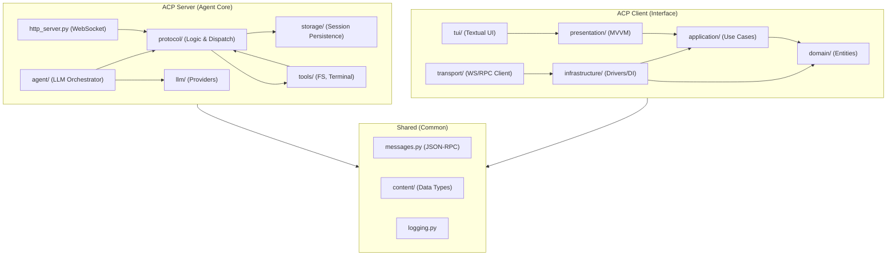

# Аналитический отчет по архитектуре и коду проекта CodeLab
**Дата:** 25 апреля 2026 г.
**Модель:** `gemma4:26b`

## 1. Обзор системы
Проект **CodeLab** представляет собой реализацию протокола **Agent Client Protocol (ACP)**, обеспечивающего взаимодействие между ИИ-агентом (Server) и пользовательским интерфейсом (Client). Архитектура разделена на функциональные блоки: Server (логика, инструменты, LLM) и Client (TUI, Clean Architecture).

## 2. Анализ архитектуры
### Схема зависимостей

### Выявленные архитектурные риски
1.  **Нарушение принципа Single Responsibility (SRP)**:
    *   Файлы `server/protocol/handlers/prompt.py` и `prompt_orchestrator.py` имеют критический размер (>1800 строк), что указывает на избыточную сложность и риск превращения в "God Objects".
2.  **Риск раздувания инфраструктурного слоя**:
    *   `client/infrastructure/services/acp_transport_service.py` (1200+ строк) может содержать логику, которая должна принадлежать слою `Application`.
3.  **Потенциальное дублирование моделей**:
    *   Наличие `client/messages.py` (1100+ строк) может привести к рассогласованию схем данных с `shared/messages.py`.

## 3. Анализ качества кода
### Сильные стороны
*   **Чистая архитектура в клиенте**: Четкое разделение на Domain, Application, Infrastructure, Presentation и TUI.
*   **Стандартизация**: Использование `uv`, `ruff` и `pytest` обеспечивает современный и надежный процесс разработки.
*   **Протокольная строгость**: Четкое разделение на спецификацию (doc/ACP) и реализацию.

### Области для улучшения
*   **Рефакторинг крупных модулей**: Декомпозиция обработчиков протокола на более мелкие, специализированные компоненты.
*   **Унификация моделей**: Перенос всех общих структур данных исключительно в пакет `shared`.
*   **Контроль сложности**: Снижение связности (coupling) в слое `infrastructure` клиента.

## 4. Заключение
Проект обладает зрелой архитектурной базой, однако текущий рост размера модулей в серверной части требует превентивного рефакторинга для предотвращения деградации поддерживаемости системы.
