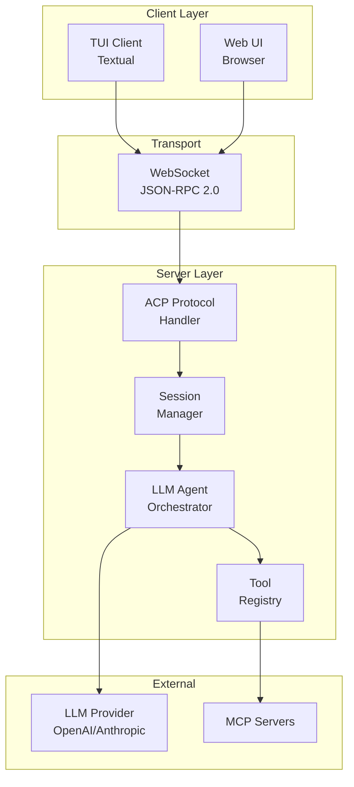
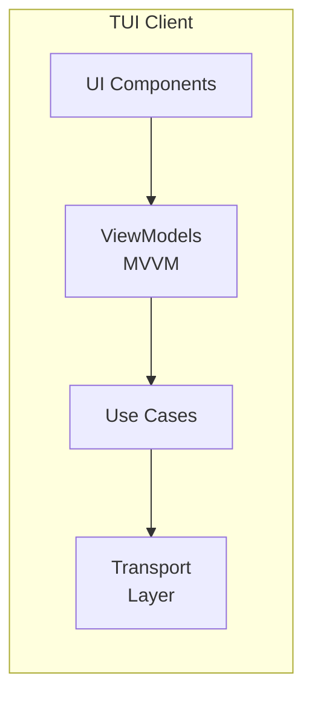
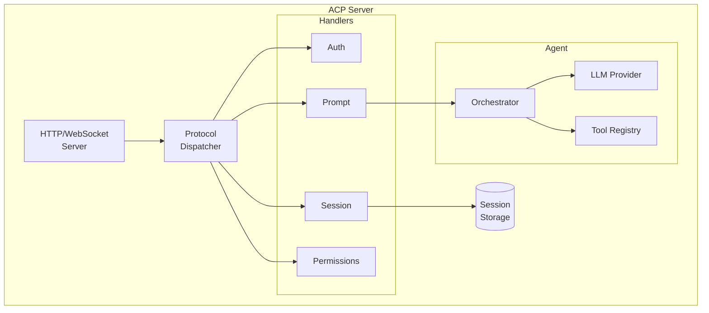
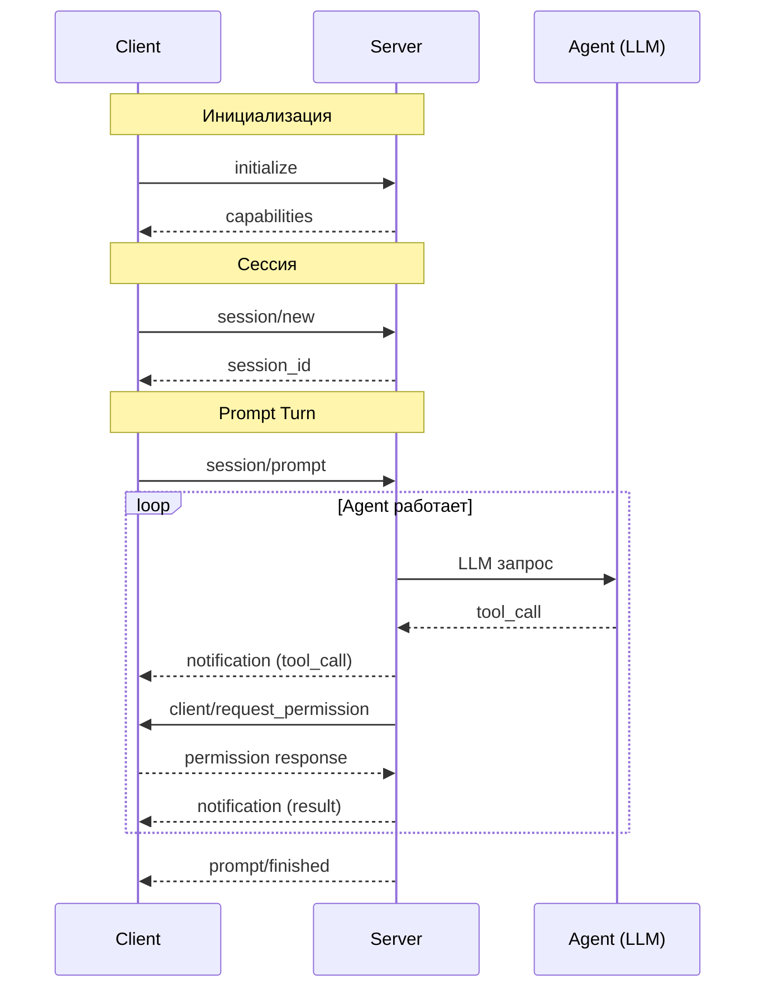
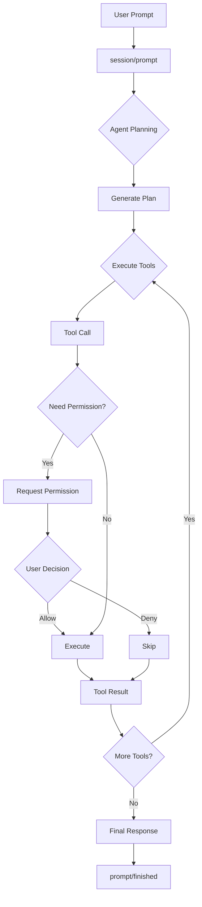
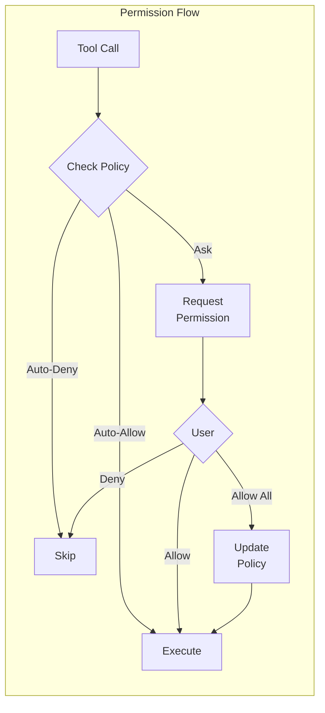
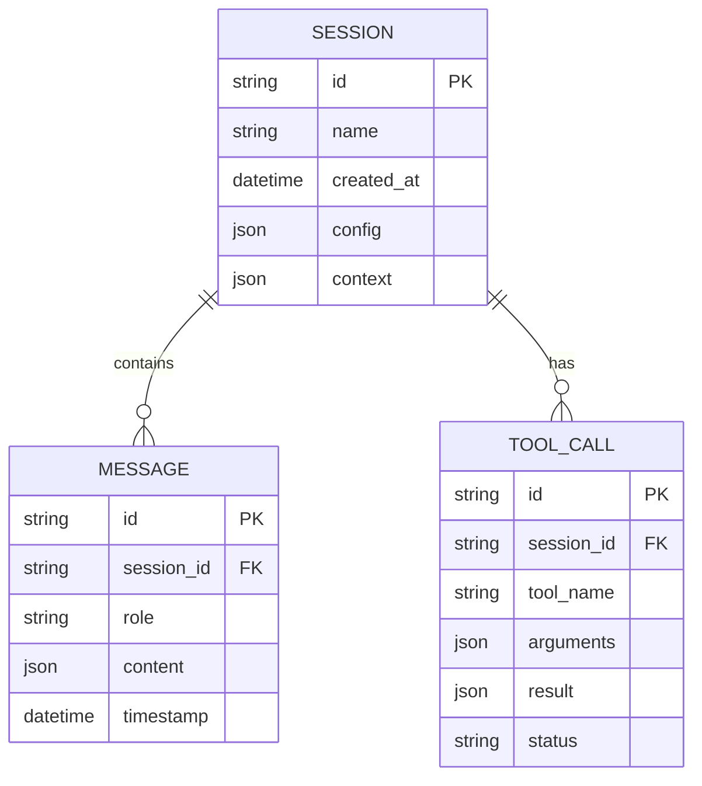

# Архитектура CodeLab

> Обзор архитектуры системы и взаимодействия компонентов.

## Общая архитектура

CodeLab реализует клиент-серверную архитектуру, определённую [Agent Client Protocol (ACP)](../../Agent%20Client%20Protocol/get-started/02-Architecture.md).



## Компоненты системы

### Клиент (Client)

Клиент предоставляет пользовательский интерфейс и обрабатывает запросы сервера:



**Слои клиента (Clean Architecture):**
- **Presentation** — UI компоненты (Textual widgets)
- **ViewModels** — логика представления (MVVM паттерн)
- **Application** — use cases, state machine
- **Infrastructure** — транспорт, DI, handlers

### Сервер (Server)

Сервер содержит AI-агента и обрабатывает протокол ACP:



## Протокол ACP

Взаимодействие происходит через JSON-RPC 2.0:



## Потоки данных

### Prompt Turn

Цикл обработки пользовательского запроса:



### Система разрешений



## Хранение данных

### Структура сессий



## Директории проекта

```
codelab/src/codelab/
├── shared/              # Общие модули
│   ├── messages.py      # JSON-RPC сообщения
│   ├── logging.py       # Структурированное логирование
│   └── content/         # Типы контента ACP
│
├── server/              # Серверная часть
│   ├── protocol/        # ACP протокол
│   ├── agent/           # LLM агент
│   ├── tools/           # Инструменты
│   ├── storage/         # Хранилище сессий
│   └── mcp/             # MCP интеграция
│
└── client/              # Клиентская часть
    ├── domain/          # Domain Layer
    ├── application/     # Application Layer
    ├── infrastructure/  # Infrastructure Layer
    ├── presentation/    # ViewModels (MVVM)
    └── tui/             # TUI компоненты
```

## См. также

- [Введение](01-introduction.md) — общая информация о CodeLab
- [Сценарии использования](03-use-cases.md) — примеры применения
- [Спецификация ACP](../../Agent%20Client%20Protocol/protocol/01-Overview.md) — детали протокола
