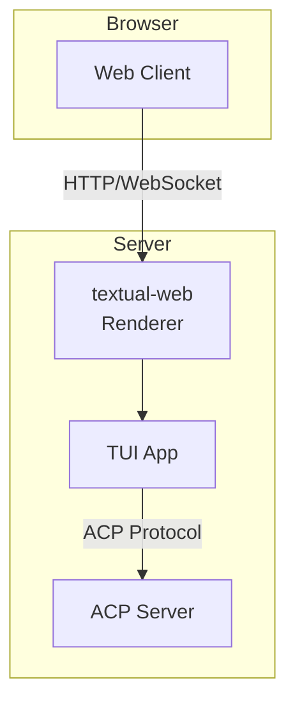

# Web Клиент

> Руководство по доступу к CodeLab через браузер.

## Обзор

Web клиент позволяет использовать CodeLab через браузер без установки TUI. Реализован на базе [textual-web](https://github.com/Textualize/textual-web) — технологии, которая транслирует Textual приложения в веб-браузер.

## Запуск Web UI

### Встроенный Web UI (рекомендуется)

При запуске сервера Web UI доступен автоматически:

```bash
# Запуск сервера
codelab serve --port 8765

# Web UI доступен на http://localhost:8765/
```

### Отдельный textual-web сервер

Для изолированного запуска:

```bash
cd codelab
uv run textual-web --run "python -m codelab.client.tui.app"
```

По умолчанию доступен на `http://localhost:8000/`

## Доступ через браузер

1. Откройте браузер
2. Перейдите по адресу `http://localhost:8765/`
3. Интерфейс загрузится автоматически

### Поддерживаемые браузеры

- Chrome / Chromium (рекомендуется)
- Firefox
- Safari
- Edge

## Интерфейс

Web клиент предоставляет **тот же интерфейс**, что и TUI:



### Компоненты интерфейса

- **Header** — статус подключения
- **Sidebar** — сессии, файлы, план
- **Chat** — диалог с агентом
- **Tool Panel** — результаты операций
- **Prompt Input** — ввод сообщений

## Горячие клавиши

Все горячие клавиши из [TUI клиента](01-tui-client.md) работают в браузере:

| Клавиша | Действие |
|---------|----------|
| `Ctrl+N` | Новая сессия |
| `Ctrl+Q` | Выход |
| `Ctrl+H` | Справка |
| `Tab` | Переключение фокуса |

> ⚠️ **Примечание:** Некоторые комбинации могут конфликтовать с браузерными shortcut'ами. Используйте Chrome для лучшей совместимости.

## Конфигурация

### Настройка порта

```bash
# Изменить порт Web UI
codelab serve --port 9000
```

### Отключение Web UI

```bash
# Только WebSocket API, без Web UI
codelab serve --disable-web
```

### Привязка к внешнему интерфейсу

```bash
# Доступ из сети (не только localhost)
codelab serve --host 0.0.0.0 --port 8765
```

> ⚠️ **Безопасность:** При открытии на внешний интерфейс рекомендуется настроить аутентификацию.

## Удаленный доступ

### Через SSH туннель

```bash
# На удаленном сервере
codelab serve --port 8765

# На локальной машине
ssh -L 8765:localhost:8765 user@remote-server
# Затем открыть http://localhost:8765/
```

### Через reverse proxy (nginx)

```nginx
server {
    listen 443 ssl;
    server_name codelab.example.com;

    location / {
        proxy_pass http://127.0.0.1:8765;
        proxy_http_version 1.1;
        proxy_set_header Upgrade $http_upgrade;
        proxy_set_header Connection "upgrade";
        proxy_set_header Host $host;
    }
}
```

## Отличия от TUI

| Аспект | TUI | Web |
|--------|-----|-----|
| Производительность | Выше | Зависит от сети |
| Горячие клавиши | Все работают | Возможны конфликты |
| Установка | Требуется | Не требуется |
| Мобильные устройства | Нет | Да |

## Мобильные устройства

Web клиент можно использовать на планшетах и телефонах:

1. Откройте URL сервера в браузере
2. Интерфейс адаптируется к размеру экрана
3. Используйте touch для навигации

> 💡 **Совет:** Для мобильных устройств включите "Desktop mode" для лучшего отображения.

## Troubleshooting

### Не загружается интерфейс

1. Проверьте, запущен ли сервер
2. Проверьте порт в адресной строке
3. Убедитесь, что не заблокирован firewall

### Медленная работа

- Используйте локальное подключение
- Уменьшите размер окна браузера
- Закройте лишние вкладки

### Проблемы с клавишами

- Используйте Chrome
- Отключите browser extensions
- Используйте полноэкранный режим (F11)

## См. также

- [TUI клиент](01-tui-client.md) — терминальный интерфейс
- [Настройка сервера](03-server-setup.md) — параметры запуска
