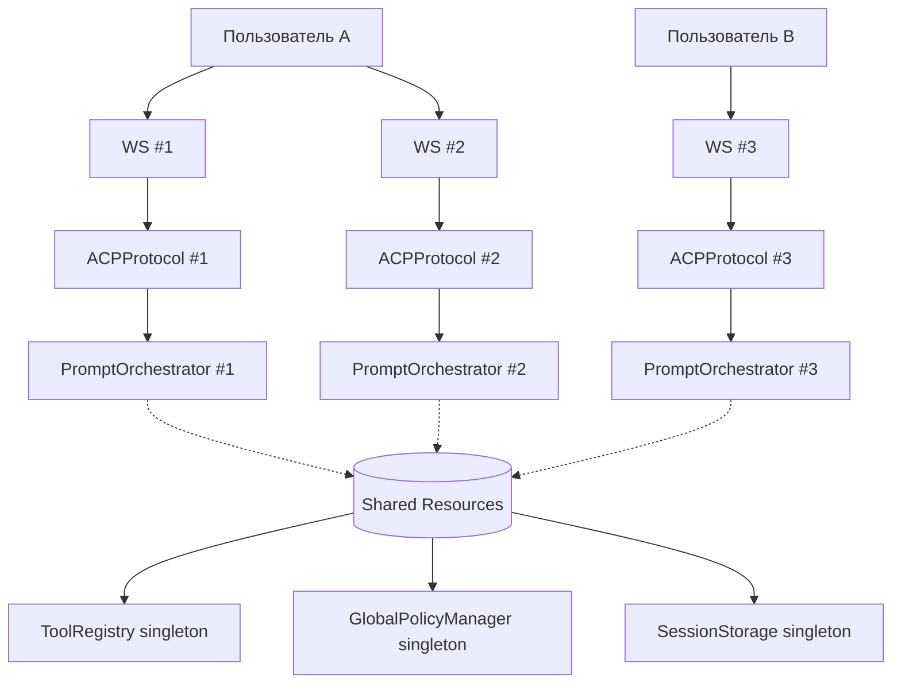

# 2.7 — Инжектировать `PromptOrchestrator` через конструктор `ACPProtocol`

**Приоритет:** 🟡 Средний  
**Оценка:** 2 часа  
**Файл:** `src/codelab/server/protocol/core.py`

---

## Проблема

`PromptOrchestrator` создаётся заново при каждом вызове `execute_pending_tool`:

```python
async def execute_pending_tool(self, session_id: str, tool_call_id: str) -> LLMLoopResult:
    # Создаётся при каждом вызове — это неверно
    orchestrator = prompt.create_prompt_orchestrator(
        tool_registry=self._tool_registry,
        client_rpc_service=self._client_rpc_service,
        global_policy_manager=self._global_policy_manager,
    )
    return await orchestrator.execute_pending_tool(...)
```

`PromptOrchestrator` является stateless агрегатором зависимостей. Создавать его при каждом вызове — это нарушение DI-принципа и лишние накладные расходы. Кроме того, это означает, что `ACPProtocol.__init__` и `execute_pending_tool` содержат разные наборы зависимостей.

---

## Scope: Per-Connection

`PromptOrchestrator` имеет **per-connection scope** (или per-request в HTTP):

- **Каждое WebSocket-подключение** создаёт свой экземпляр `ACPProtocol`, а значит и свой `PromptOrchestrator`.
- **Не per-user**: один пользователь с несколькими подключениями получит отдельные оркестраторы на каждое.
- **Причина**: `PromptOrchestrator` — stateless процессор, но держит зависимые сервисы (`ClientRPCService`), которые привязаны к конкретному соединению.

### Почему не per-user?

| Проблема | Per-Connection | Per-User |
|----------|----------------|----------|
| Race conditions при параллельных запросах | Нет | Возможны |
| Отмена запросов при disconnect | Простая | Сложная |
| Горизонтальное масштабирование | Без sticky sessions | Требует sticky sessions |
| Изоляция active_turn | Полная | Частичная |

### Диаграмма scope



Компоненты с **singleton scope** (общие для всех подключений):
- `ToolRegistry` — реестр инструментов
- `GlobalPolicyManager` — глобальные политики разрешений
- `SessionStorage` — хранилище сессий

Компоненты с **per-connection scope**:
- `ACPProtocol` — экземпляр протокола
- `PromptOrchestrator` — оркестратор обработки промптов
- `ClientRPCService` — сервис вызовов к клиенту (привязан к WS)

---

## Решение

Создавать `PromptOrchestrator` один раз в `ACPProtocol.__init__` и хранить как поле экземпляра.

### Шаг 1 — Обновить конструктор `ACPProtocol`

```python
# БЫЛО:
class ACPProtocol:
    def __init__(
        self,
        *,
        require_auth: bool = False,
        auth_api_key: str | None = None,
        storage: SessionStorage | None = None,
        agent_orchestrator: AgentOrchestrator | None = None,
        client_rpc_service: ClientRPCService | None = None,
        tool_registry: ToolRegistry | None = None,
    ) -> None:
        ...
        self._agent_orchestrator = agent_orchestrator
        self._client_rpc_service = client_rpc_service
        self._tool_registry = tool_registry
        self._global_policy_manager: GlobalPolicyManager | None = None
        # PromptOrchestrator не создавался здесь!
```

```python
# СТАЛО:
class ACPProtocol:
    def __init__(
        self,
        *,
        require_auth: bool = False,
        auth_api_key: str | None = None,
        storage: SessionStorage | None = None,
        agent_orchestrator: AgentOrchestrator | None = None,
        client_rpc_service: ClientRPCService | None = None,
        tool_registry: ToolRegistry | None = None,
        prompt_orchestrator: PromptOrchestrator | None = None,  # ← новый параметр
    ) -> None:
        ...
        self._agent_orchestrator = agent_orchestrator
        self._client_rpc_service = client_rpc_service
        self._tool_registry = tool_registry
        self._global_policy_manager: GlobalPolicyManager | None = None

        # PromptOrchestrator создаётся один раз, если не передан извне
        self._prompt_orchestrator: PromptOrchestrator | None = prompt_orchestrator
```

### Шаг 2 — Лениво создавать оркестратор при первом обращении

Если передан явно — использовать его (удобно для тестов). Если нет — создавать лениво:

```python
def _get_prompt_orchestrator(self) -> PromptOrchestrator | None:
    """Получить или создать PromptOrchestrator."""
    if self._prompt_orchestrator is not None:
        return self._prompt_orchestrator

    if self._tool_registry is None:
        return None  # Агент не настроен

    self._prompt_orchestrator = prompt.create_prompt_orchestrator(
        tool_registry=self._tool_registry,
        client_rpc_service=self._client_rpc_service,
        global_policy_manager=self._global_policy_manager,
    )
    return self._prompt_orchestrator
```

### Шаг 3 — Обновить `execute_pending_tool`

```python
# БЫЛО:
async def execute_pending_tool(self, session_id: str, tool_call_id: str) -> LLMLoopResult:
    ...
    orchestrator = prompt.create_prompt_orchestrator(  # ← каждый раз новый
        tool_registry=self._tool_registry,
        client_rpc_service=self._client_rpc_service,
        global_policy_manager=self._global_policy_manager,
    )
    return await orchestrator.execute_pending_tool(...)
```

```python
# СТАЛО:
async def execute_pending_tool(self, session_id: str, tool_call_id: str) -> LLMLoopResult:
    session = await self._storage.load_session(session_id)
    if session is None:
        logger.error("session_not_found", session_id=session_id)
        return LLMLoopResult(notifications=[], stop_reason="end_turn")

    orchestrator = self._get_prompt_orchestrator()   # ← переиспользуем
    if orchestrator is None:
        logger.error("orchestrator_not_configured", session_id=session_id)
        return LLMLoopResult(notifications=[], stop_reason="end_turn")

    return await orchestrator.execute_pending_tool(
        session=session,
        session_id=session_id,
        tool_call_id=tool_call_id,
        agent_orchestrator=self._agent_orchestrator,
    )
```

### Шаг 4 — Обновить `initialize_global_policy_manager`

После инициализации `GlobalPolicyManager` — сбросить кэшированный оркестратор, чтобы следующее обращение пересоздало его с актуальным менеджером:

```python
async def initialize_global_policy_manager(self) -> None:
    try:
        from .handlers.global_policy_manager import GlobalPolicyManager
        self._global_policy_manager = await GlobalPolicyManager.get_instance()
        await self._global_policy_manager.initialize()
        # Сбросить кэш, чтобы оркестратор пересоздался с новым policy manager
        self._prompt_orchestrator = None
        logger.info("GlobalPolicyManager initialized successfully")
    except Exception as e:
        logger.warning("GlobalPolicyManager init failed", error=str(e))
        self._global_policy_manager = None
```

---

## Тесты

```python
@pytest.mark.asyncio
async def test_orchestrator_created_once():
    """PromptOrchestrator должен создаваться единожды."""
    tool_registry = MagicMock()
    protocol = ACPProtocol(tool_registry=tool_registry)

    orch1 = protocol._get_prompt_orchestrator()
    orch2 = protocol._get_prompt_orchestrator()

    assert orch1 is orch2  # один и тот же объект


@pytest.mark.asyncio
async def test_orchestrator_can_be_injected():
    """Внешний PromptOrchestrator должен использоваться вместо создания нового."""
    mock_orchestrator = MagicMock(spec=PromptOrchestrator)
    protocol = ACPProtocol(prompt_orchestrator=mock_orchestrator)

    result = protocol._get_prompt_orchestrator()
    assert result is mock_orchestrator


@pytest.mark.asyncio
async def test_orchestrator_reset_after_policy_manager_init():
    """После инициализации GlobalPolicyManager оркестратор должен пересоздаться."""
    tool_registry = MagicMock()
    protocol = ACPProtocol(tool_registry=tool_registry)

    orch_before = protocol._get_prompt_orchestrator()
    await protocol.initialize_global_policy_manager()
    orch_after = protocol._get_prompt_orchestrator()

    # Оркестратор пересоздан с новым policy manager
    assert orch_before is not orch_after
```
