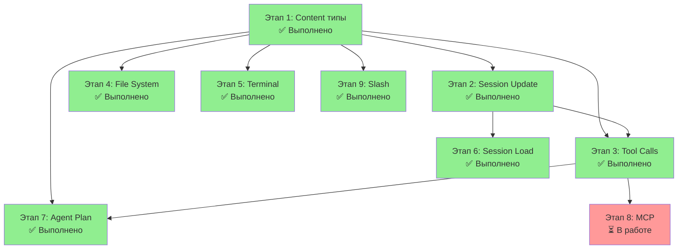
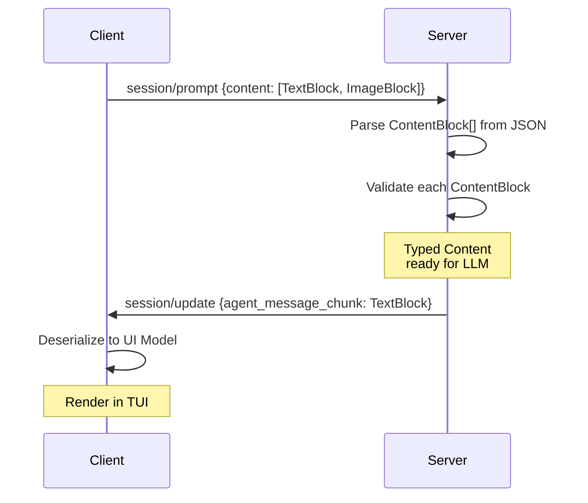
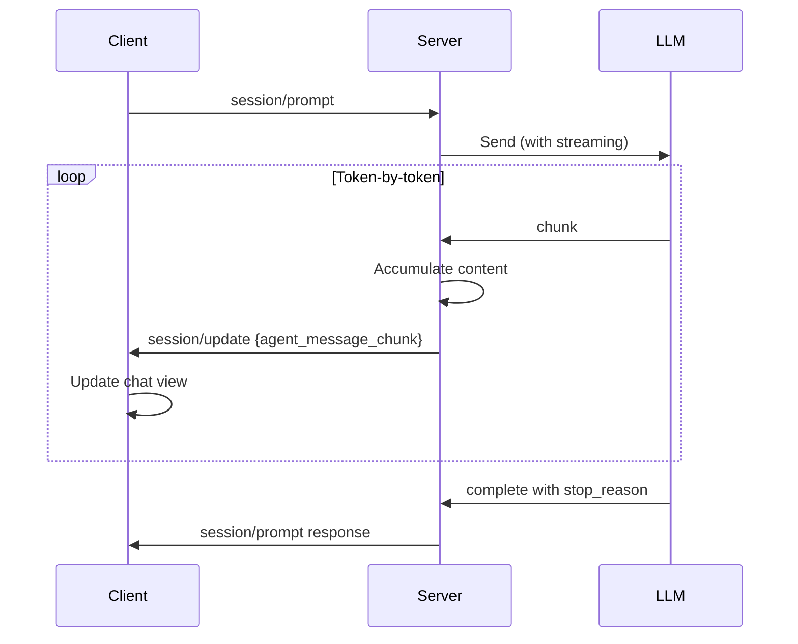
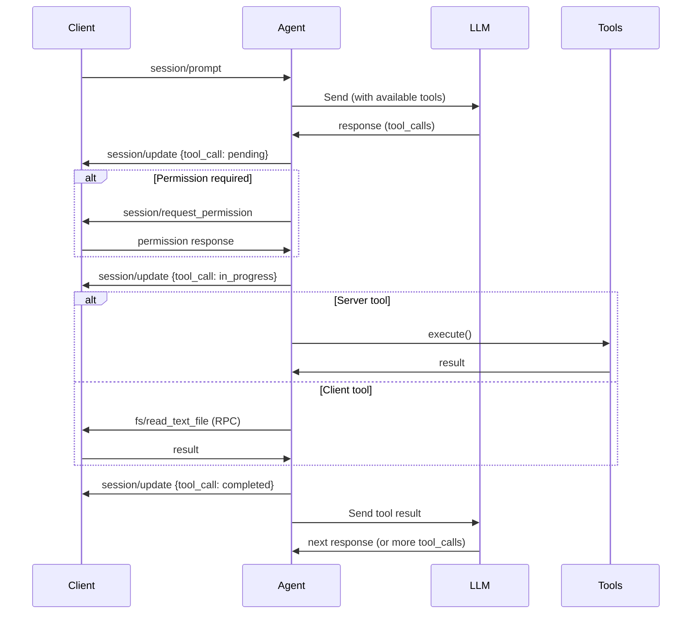
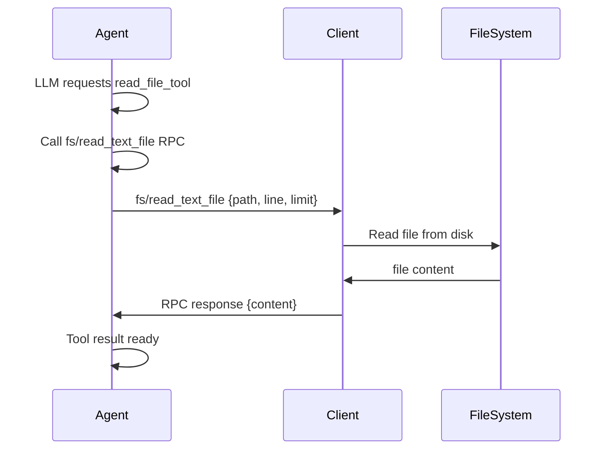
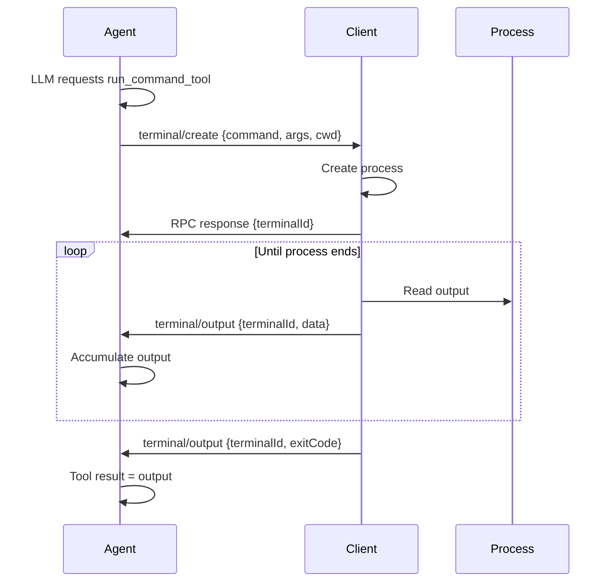

# План доработки ACP до полного соответствия спецификации

## Текущий статус

**Дата обновления:** 2026-04-23  
**Уровень соответствия:** ~85%

### ✅ Полностью реализовано:
- Initialization (version negotiation, capabilities, authMethods)
- Session Setup (session/new, session/load, history replay, configOptions)
- Session List (session/list, pagination, notifications)
- Prompt Turn (session/prompt, session/cancel, все chunks и stopReasons)
- Content Types (Text, Image, Audio, EmbeddedResource, ResourceLink, Diff)
- Tool Calls (tool_call/update, permissions flow, все tool kinds)
- File System (fs/read_text_file, fs/write_text_file)
- Terminal (create, output, wait_for_exit, kill, release)
- Agent Plan (plan updates, PlanEntry, replay)
- Session Modes и Config Options
- Slash Commands
- Extensibility (_meta, custom methods)
- WebSocket Transport

### ⚠️ Частично реализовано:
- promptCapabilities (готово, но image/audio выключены)
- rawInput/rawOutput в tool calls

### 🔴 Не реализовано:
- MCP Integration (mcpServers в session/new) — **Высокий приоритет**
- Global Policy Storage (~/.acp/global_permissions.json) — **Высокий приоритет**
- stdio transport — Средний приоритет
- Policy versioning и аудит — Средний приоритет

---

## Обзор

Этот план детализирует разработку 9 этапов доработки протокола ACP для достижения полного соответствия официальной спецификации в [`doc/Agent Client Protocol/`](../doc/Agent Client Protocol/). Текущий уровень соответствия: **~85%**.

Подход основан на:
1. **Минимальных целевых изменениях** — только то, что требует спецификация
2. **Зависимостях между компонентами** — выполнение в логическом порядке
3. **Инкрементальности** — каждый этап дает работающую функциональность
4. **Тестируемости** — каждый этап покрыт unit и интеграционными тестами

**Исключение:** stdio транспорт НЕ требуется — достаточно WebSocket и TCP транспортов.

---

## Архитектурная диаграмма зависимостей



---

## Этап 1: Content типы

**Приоритет:** Критический  
**Трудозатраты:** 2-3 дня  
**Зависимости:** —

### Цели

Реализовать полную поддержку типизированных Content блоков согласно спецификации [`06-Content.md`](../doc/Agent Client Protocol/protocol/06-Content.md).

Текущее состояние: поддерживается только текст. Требуется типизированная модель для всех видов контента.

### Задачи

1. **Создать Pydantic модели для Content типов**
   - Файлы: 
     - [`acp-server/src/acp_server/models.py`](../acp-server/src/acp_server/models.py) (расширить)
     - [`acp-client/src/acp_client/messages.py`](../acp-client/src/acp_client/messages.py) (расширить)
   - Описание: Реализовать иерархию ContentBlock классов:
     - `TextContentBlock` — текстовый контент с optional annotations
     - `ImageContentBlock` — изображение с mimeType и base64 data
     - `DocumentContentBlock` — встроенные ресурсы
     - Объединяющий `ContentBlock = Union[TextContentBlock, ImageContentBlock, DocumentContentBlock]`
   - Спецификация: [`06-Content.md`](../doc/Agent Client Protocol/protocol/06-Content.md)
   - Тесты:
     - Unit тесты сериализации/десериализации для каждого типа
     - Тесты валидации (например, image должен иметь `mimeType`)
     - Тесты JSON-RPC wire format

2. **Обновить типизацию методов Protocol и Handlers**
   - Файлы:
     - [`acp-server/src/acp_server/protocol/core.py`](../acp-server/src/acp_server/protocol/core.py)
     - [`acp-server/src/acp_server/protocol/handlers/prompt.py`](../acp-server/src/acp_server/protocol/handlers/prompt.py)
     - [`acp-server/src/acp_server/protocol/handlers/prompt_orchestrator.py`](../acp-server/src/acp_server/protocol/handlers/prompt_orchestrator.py)
   - Описание: Заменить `list[dict[str, Any]]` на `list[ContentBlock]` для:
     - Параметра `content` в `session/prompt` request
     - Параметра `content` в `session/update` для `agent_message_chunk`
   - Тесты: Интеграционные тесты prompt-turn с разными типами контента

3. **Обновить клиентскую типизацию**
   - Файлы:
     - [`acp-client/src/acp_client/application/dto.py`](../acp-client/src/acp_client/application/dto.py)
     - [`acp-client/src/acp_client/presentation/chat_view_model.py`](../acp-client/src/acp_client/presentation/chat_view_model.py)
   - Описание: Использовать ContentBlock модели в:
     - DTO для передачи между слоями
     - View Model для отрисовки в TUI
   - Тесты: Unit тесты преобразования между DTO и UI моделями

### Критерии приемки

- [ ] Все Content типы реализованы с Pydantic моделями
- [ ] Server корректно парсит и валидирует Content из JSON-RPC
- [ ] Client корректно десериализует Content в DTO
- [ ] Unit тесты покрывают все типы контента (>90%)
- [ ] Интеграционные тесты проходят с разными типами контента
- [ ] ruff check и ty check без ошибок
- [ ] Все 118+ существующих тестов все еще проходят

### Диаграмма взаимодействия



---

## Этап 2: Session Update Notifications

**Приоритет:** Критический  
**Трудозатраты:** 2-3 дня  
**Зависимости:** Этап 1 (Content типы)

### Цели

Реализовать полный цикл отправки `session/update` notifications согласно спецификации [`05-Prompt Turn.md`](../doc/Agent Client Protocol/protocol/05-Prompt Turn.md).

Текущее состояние: есть инфраструктура для `session/update`, но цикл неполный. Отсутствуют:
- `agent_message_chunk` notifications в реальном времени
- Синхронизация с Tool Calls
- Отправка плана и других updates

### Задачи

1. **Реализовать streaming updates в Prompt Orchestrator**
   - Файлы:
     - [`acp-server/src/acp_server/protocol/handlers/prompt_orchestrator.py`](../acp-server/src/acp_server/protocol/handlers/prompt_orchestrator.py)
   - Описание: 
     - Добавить callback механизм для отправки updates по мере получения от LLM
     - Синхронизировать отправку updates с WebSocket transport
     - Поддержать streaming LLM responses (token-by-token)
   - Спецификация: [`05-Prompt Turn.md`](../doc/Agent Client Protocol/protocol/05-Prompt Turn.md), sections 3-5
   - Тесты:
     - Unit тесты обработки LLM chunks
     - Интеграционные тесты update sequence
     - Тесты timing (updates приходят в правильном порядке)

2. **Подключить WebSocket transport к Prompt Orchestrator**
   - Файлы:
     - [`acp-server/src/acp_server/http_server.py`](../acp-server/src/acp_server/http_server.py)
     - [`acp-server/src/acp_server/protocol/core.py`](../acp-server/src/acp_server/protocol/core.py)
   - Описание:
     - Передать reference на WebSocket connection handler в PromptOrchestrator
     - Реализовать `await send_update()` метод для асинхронной отправки
   - Тесты: Интеграционные тесты WS transport с updates

3. **Реализовать обработку updates на клиенте**
   - Файлы:
     - [`acp-client/src/acp_client/infrastructure/services/message_router.py`](../acp-client/src/acp_client/infrastructure/services/message_router.py)
     - [`acp-client/src/acp_client/application/use_cases.py`](../acp-client/src/acp_client/application/use_cases.py)
   - Описание:
     - Router правильно распределяет `session/update` notifications
     - Use Cases обновляют состояние на основе updates
     - State Machine синхронизируется с updates
   - Тесты: Unit тесты routing и state updates

4. **Обновить типизацию Update notifications**
   - Файлы:
     - [`acp-server/src/acp_server/protocol/state.py`](../acp-server/src/acp_server/protocol/state.py)
   - Описание: Создать типизированные dataclasses для разных видов updates:
     - `AgentMessageChunkUpdate`
     - `ToolCallUpdate`
     - `PlanUpdate`
     - `AvailableCommandsUpdate`
   - Тесты: Unit тесты сериализации updates в JSON-RPC

### Критерии приемки

- [ ] `session/update` notifications отправляются в реальном времени
- [ ] Updates содержат правильно типизированный контент
- [ ] Порядок updates соответствует спецификации
- [ ] WebSocket connection правильно обрабатывает concurrent updates
- [ ] Client правильно обрабатывает и отображает updates
- [ ] Интеграционные тесты проходят для полного prompt-turn цикла
- [ ] ruff check и ty check без ошибок

### Диаграмма взаимодействия



---

## Этап 3: Tool Calls Интеграция

**Приоритет:** Критический  
**Трудозатраты:** 3-4 дня  
**Зависимости:** Этап 1 (Content), Этап 2 (Updates)

### Цели

Реализовать полный цикл обработки tool calls из LLM согласно спецификации [`08-Tool Calls.md`](../doc/Agent Client Protocol/protocol/08-Tool Calls.md).

Текущее состояние: инфраструктура есть (registry, handlers), но LLM не интегрирован в цикл. Отсутствует:
- Связь LLM → Tool Calls (LLM запрашивает инструменты)
- Обработка tool call responses
- Feedback цикл LLM → tools → LLM

### Задачи

1. **Интегрировать Tool Registry с LLM Provider**
   - Файлы:
     - [`acp-server/src/acp_server/tools/registry.py`](../acp-server/src/acp_server/tools/registry.py)
     - [`acp-server/src/acp_server/agent/orchestrator.py`](../acp-server/src/acp_server/agent/orchestrator.py)
     - [`acp-server/src/acp_server/llm/openai_provider.py`](../acp-server/src/acp_server/llm/openai_provider.py) или используемый LLM provider
   - Описание:
     - LLMProvider получает list всех доступных инструментов из ToolRegistry
     - Преобразовать ToolDefinition в формат LLM tool schema (OpenAI function_calling, Claude tools и т.д.)
     - Передать tools в LLM при запросе
   - Спецификация: [`08-Tool Calls.md`](../doc/Agent Client Protocol/protocol/08-Tool Calls.md)
   - Тесты:
     - Unit тесты преобразования ToolDefinition в LLM schema
     - Тесты что tools передаются правильно в LLM API

2. **Обработать Tool Call responses от LLM**
   - Файлы:
     - [`acp-server/src/acp_server/agent/orchestrator.py`](../acp-server/src/acp_server/agent/orchestrator.py)
     - [`acp-server/src/acp_server/protocol/handlers/tool_call_handler.py`](../acp-server/src/acp_server/protocol/handlers/tool_call_handler.py)
   - Описание:
     - Когда LLM возвращает tool_call, PromptOrchestrator:
       1. Отправляет `session/update {tool_call: pending}` клиенту
       2. Проверяет нужно ли разрешение (permission request)
       3. Ждет разрешения (если нужно)
       4. Выполняет инструмент
       5. Отправляет `session/update {tool_call: in_progress}`
       6. Отправляет результат обратно в LLM
   - Тесты:
     - Unit тесты обработки tool call response
     - Интеграционные тесты полного цикла (LLM → tool → LLM)
     - Тесты permission flow

3. **Реализовать Client-side Tool Execution (fs/*, terminal/*)**
   - Файлы:
     - [`acp-server/src/acp_server/protocol/handlers/client_rpc_handler.py`](../acp-server/src/acp_server/protocol/handlers/client_rpc_handler.py)
   - Описание:
     - Когда tool требует client-side выполнения (например, fs/read):
       1. Agent запрашивает у client через RPC
       2. Client выполняет и возвращает результат
       3. Agent получает результат и продолжает
   - Спецификация: [`09-File System.md`](../doc/Agent Client Protocol/protocol/09-File System.md), [`10-Terminal.md`](../doc/Agent Client Protocol/protocol/10-Terminal.md)
   - Тесты: Интеграционные тесты client RPC calls

4. **Создать базовый набор встроенных Tools**
   - Файлы:
     - [`acp-server/src/acp_server/tools/`](../acp-server/src/acp_server/tools/) (новый файл: `builtins.py`)
   - Описание: Создать несколько базовых встроенных инструментов для демонстрации:
     - `echo` — просто возвращает то же сообщение
     - `calculate` — простой калькулятор
     - `list_files` — список файлов в директории
   - Тесты: Unit тесты для каждого инструмента

### Критерии приемки

- [ ] Tool Registry интегрирован с LLM Provider
- [ ] Tool Calls из LLM правильно обрабатываются
- [ ] Permission flow работает для tool calls
- [ ] Client RPC calls работают (async request-response)
- [ ] Tool execution результаты отправляются обратно в LLM
- [ ] Feedback цикл работает (LLM → tool → LLM)
- [ ] Встроенные инструменты регистрируются и выполняются
- [ ] Интеграционные тесты проходят
- [ ] ruff check и ty check без ошибок

### Диаграмма взаимодействия



---

## Этап 4: File System методы

**Приоритет:** Высокий  
**Трудозатраты:** 2 дня  
**Зависимости:** Этап 1 (Content), Этап 3 (Tool Calls)

### Цели

Реализовать client-side File System методы согласно спецификации [`09-File System.md`](../doc/Agent Client Protocol/protocol/09-File System.md).

Текущее состояние: методы объявлены в protokol handlers, но не реализованы. Требуется:
- Обработчики `fs/read_text_file`
- Обработчики `fs/write_text_file`
- Поддержка в Client

### Задачи

1. **Реализовать Server-side RPC handlers для fs методов**
   - Файлы:
     - [`acp-server/src/acp_server/protocol/handlers/client_rpc_handler.py`](../acp-server/src/acp_server/protocol/handlers/client_rpc_handler.py) (расширить)
   - Описание:
     - `fs/read_text_file` — отправить RPC клиенту для чтения файла
     - `fs/write_text_file` — отправить RPC клиенту для записи файла
     - Поддержать `line` и `limit` параметры для partial reads
     - Ожидать RPC response с содержимым файла
   - Спецификация: [`09-File System.md`](../doc/Agent Client Protocol/protocol/09-File System.md)
   - Тесты:
     - Unit тесты RPC запроса/ответа
     - Тесты обработки ошибок (файл не найден и т.д.)

2. **Реализовать Client-side RPC handlers для fs методов**
   - Файлы:
     - [`acp-client/src/acp_client/infrastructure/handler_registry.py`](../acp-client/src/acp_client/infrastructure/handler_registry.py) (расширить)
   - Описание:
     - Зарегистрировать handlers для `fs/read_text_file` и `fs/write_text_file`
     - Реализовать логику чтения/записи файлов на диск
     - Обработать ошибки доступа
   - Тесты:
     - Unit тесты RPC handlers
     - Интеграционные тесты с mock файловой системой

3. **Обновить Client Capabilities**
   - Файлы:
     - [`acp-server/src/acp_server/protocol/handlers/auth.py`](../acp-server/src/acp_server/protocol/handlers/auth.py)
   - Описание: Добавить в `initialize` response:
     ```json
     "clientCapabilities": {
       "fs": {
         "readTextFile": true,
         "writeTextFile": true
       }
     }
     ```
   - Тесты: Unit тесты что capabilities правильно передаются

4. **Интегрировать FS методы в Tool Calls**
   - Файлы:
     - [`acp-server/src/acp_server/tools/builtins.py`](../acp-server/src/acp_server/tools/builtins.py) (расширить)
   - Описание: Создать инструменты которые используют fs RPC:
     - `read_file_tool` — использует `fs/read_text_file`
     - `write_file_tool` — использует `fs/write_text_file`
   - Тесты: Интеграционные тесты tool → RPC → file operation

### Критерии приемки

- [ ] `fs/read_text_file` RPC handler реализован на сервере
- [ ] `fs/write_text_file` RPC handler реализован на сервере
- [ ] Client handlers реализованы и регистрируются
- [ ] Поддержка partial reads (`line`, `limit`)
- [ ] Client Capabilities правильно сообщаются в `initialize`
- [ ] File tools используют fs RPC методы
- [ ] Интеграционные тесты (Agent → fs tool → Client RPC → file read) проходят
- [ ] ruff check и ty check без ошибок

### Диаграмма взаимодействия



---

## Этап 5: Terminal методы

**Приоритет:** Высокий  
**Трудозатраты:** 3 дня  
**Зависимости:** Этап 1 (Content), Этап 3 (Tool Calls)

### Цели

Реализовать client-side Terminal методы согласно спецификации [`10-Terminal.md`](../doc/Agent Client Protocol/protocol/10-Terminal.md).

Текущее состояние: методы объявлены, но не реализованы. Требуется:
- `terminal/create` — запуск команды
- `terminal/read` — чтение вывода
- `terminal/send_input` — отправка ввода
- `terminal/kill` — завершение процесса

### Задачи

1. **Реализовать Server-side RPC handlers для terminal методов**
   - Файлы:
     - [`acp-server/src/acp_server/protocol/handlers/client_rpc_handler.py`](../acp-server/src/acp_server/protocol/handlers/client_rpc_handler.py) (расширить)
   - Описание:
     - `terminal/create` — отправить RPC клиенту для запуска команды
     - `terminal/read` — отправить RPC клиенту для чтения output
     - `terminal/send_input` — отправить RPC клиенту для отправки input
     - `terminal/kill` — отправить RPC клиенту для завершения процесса
     - Поддержать `outputByteLimit` для ограничения вывода
   - Спецификация: [`10-Terminal.md`](../doc/Agent Client Protocol/protocol/10-Terminal.md)
   - Тесты:
     - Unit тесты RPC запросов
     - Тесты обработки ошибок (command not found и т.д.)

2. **Реализовать Client-side RPC handlers для terminal методов**
   - Файлы:
     - [`acp-client/src/acp_client/infrastructure/handler_registry.py`](../acp-client/src/acp_client/infrastructure/handler_registry.py) (расширить)
   - Описание:
     - Зарегистрировать handlers для всех 4 методов
     - Использовать `asyncio` или `subprocess` для управления процессами
     - Отслеживать открытые терминалы по `terminalId`
     - Отправлять `terminal/output` notifications для streaming вывода
   - Тесты:
     - Unit тесты RPC handlers
     - Интеграционные тесты запуска простых команд

3. **Реализовать Terminal State Management**
   - Файлы:
     - [`acp-client/src/acp_client/application/state_machine.py`](../acp-client/src/acp_client/application/state_machine.py) (расширить)
   - Описание:
     - Отслеживать состояние активных терминалов
     - Сохранять output для каждого терминала
     - Обновлять UI при получении новых данных
   - Тесты: Unit тесты state transitions

4. **Обновить Client Capabilities**
   - Файлы:
     - [`acp-server/src/acp_server/protocol/handlers/auth.py`](../acp-server/src/acp_server/protocol/handlers/auth.py)
   - Описание: Добавить в `initialize` response:
     ```json
     "clientCapabilities": {
       "terminal": true
     }
     ```
   - Тесты: Unit тесты что capabilities правильно передаются

5. **Интегрировать Terminal методы в Tool Calls**
   - Файлы:
     - [`acp-server/src/acp_server/tools/builtins.py`](../acp-server/src/acp_server/tools/builtins.py) (расширить)
   - Описание: Создать инструменты которые используют terminal RPC:
     - `run_command_tool` — использует `terminal/create` + `terminal/read`
   - Тесты: Интеграционные тесты tool → RPC → command execution

6. **Реализовать Terminal Output streaming notifications**
   - Файлы:
     - [`acp-client/src/acp_client/infrastructure/services/message_router.py`](../acp-client/src/acp_client/infrastructure/services/message_router.py)
   - Описание:
     - Клиент отправляет `terminal/output` notifications по мере получения данных
     - Server правильно маршрутизирует и отображает output
   - Тесты: Интеграционные тесты streaming output

### Критерии приемки

- [ ] `terminal/create` RPC handler реализован на сервере
- [ ] `terminal/read` RPC handler реализован на сервере
- [ ] `terminal/send_input` RPC handler реализован на сервере
- [ ] `terminal/kill` RPC handler реализован на сервере
- [ ] Client handlers реализованы и регистрируются
- [ ] Terminal state management работает
- [ ] Output streaming notifications работают
- [ ] Client Capabilities правильно сообщаются в `initialize`
- [ ] Terminal tools используют RPC методы
- [ ] Интеграционные тесты (Agent → terminal tool → Client RPC → command execution) проходят
- [ ] ruff check и ty check без ошибок

### Диаграмма взаимодействия



---

## Этап 6: Session Load Replay

**Приоритет:** Средний  
**Трудозатраты:** 2 дня  
**Зависимости:** Этап 1 (Content), Этап 2 (Updates)

### Цели

Реализовать полное воспроизведение истории при `session/load` согласно спецификации [`03-Session Setup.md`](../doc/Agent Client Protocol/protocol/03-Session%20Setup.md).

Текущее состояние: `session/load` загружает сессию, но не отправляет `session/update` notifications для replay истории.

### Задачи

1. **Реализовать Replay Manager**
   - Файлы:
     - [`acp-server/src/acp_server/protocol/handlers/`](../acp-server/src/acp_server/protocol/handlers/) (новый файл: `session_replay.py`)
   - Описание:
     - Загрузить все истории сообщений и tool calls из storage
     - Сгенерировать `session/update` notifications для каждого сообщения
     - Отправить notifications в порядке их сохранения
   - Спецификация: [`03-Session Setup.md`](../doc/Agent Client Protocol/protocol/03-Session%20Setup.md)
   - Тесты:
     - Unit тесты что все updates генерируются
     - Тесты что updates отправляются в правильном порядке
     - Интеграционные тесты полного replay

2. **Обновить Session Storage для сохранения Update History**
   - Файлы:
     - [`acp-server/src/acp_server/storage/base.py`](../acp-server/src/acp_server/storage/base.py)
     - [`acp-server/src/acp_server/storage/json_file.py`](../acp-server/src/acp_server/storage/json_file.py)
   - Описание:
     - Расширить SessionState для сохранения всех updates (не только final)
     - Сохранять в JSON файл по мере получения
     - Загружать при session/load
   - Тесты: Unit тесты persistence и loading

3. **Обновить PromptOrchestrator для сохранения Updates**
   - Файлы:
     - [`acp-server/src/acp_server/protocol/handlers/prompt_orchestrator.py`](../acp-server/src/acp_server/protocol/handlers/prompt_orchestrator.py)
   - Описание:
     - После отправки каждого update, сохранить в session storage
     - Синхронизировать с WebSocket send
   - Тесты: Интеграционные тесты что updates сохраняются

### Критерии приемки

- [ ] Replay Manager реализован
- [ ] Session load отправляет все `session/update` notifications
- [ ] Updates отправляются в правильном порядке
- [ ] Storage сохраняет всю историю updates
- [ ] Integration тесты (load old session → see full history) проходят
- [ ] ruff check и ty check без ошибок

---

## Этап 7: Agent Plan Генерация

**Приоритет:** Средний  
**Трудозатраты:** 2-3 дня  
**Зависимости:** Этап 1 (Content), Этап 2 (Updates), Этап 3 (Tool Calls)

### Цели

Реализовать генерацию и отправку Agent Plan согласно спецификации [`11-Agent Plan.md`](../doc/Agent Client Protocol/protocol/11-Agent%20Plan.md).

Текущее состояние: `PlanBuilder` есть, но не интегрирован. LLM не генерирует план.

### Задачи

1. **Реализовать Plan Generation в LLM Agent**
   - Файлы:
     - [`acp-server/src/acp_server/agent/naive.py`](../acp-server/src/acp_server/agent/naive.py) или используемый агент
   - Описание:
     - Добавить логику парсинга плана из LLM response (если LLM поддерживает structured output)
     - Или использовать separate LLM call для генерации плана
     - Валидировать план согласно спецификации
   - Спецификация: [`11-Agent Plan.md`](../doc/Agent Client Protocol/protocol/11-Agent%20Plan.md)
   - Тесты:
     - Unit тесты парсинга плана
     - Тесты валидации плана

2. **Интегрировать Plan в PromptOrchestrator**
   - Файлы:
     - [`acp-server/src/acp_server/protocol/handlers/prompt_orchestrator.py`](../acp-server/src/acp_server/protocol/handlers/prompt_orchestrator.py)
   - Описание:
     - Когда LLM возвращает план, отправить `session/update {plan}` клиенту
     - Синхронизировать обновление плана с tool calls (по мере выполнения)
   - Тесты: Интеграционные тесты update sequencing

3. **Обновить Plan в Client UI**
   - Файлы:
     - [`acp-client/src/acp_client/presentation/plan_view_model.py`](../acp-client/src/acp_client/presentation/plan_view_model.py)
     - [`acp-client/src/acp_client/tui/components/plan_panel.py`](../acp-client/src/acp_client/tui/components/plan_panel.py)
   - Описание:
     - View Model получает plan из state machine
     - TUI компонент отображает план с progress indicators
     - Обновлять статус по мере выполнения
   - Тесты: Unit тесты View Model обновлений

### Критерии приемки

- [ ] LLM генерирует план или отправляет структурированный output
- [ ] PlanBuilder валидирует план согласно спецификации
- [ ] `session/update {plan}` отправляются в правильное время
- [ ] Client View Model обновляется при получении плана
- [ ] TUI отображает план и progress
- [ ] Интеграционные тесты проходят
- [ ] ruff check и ty check без ошибок

---

## Этап 8: MCP Интеграция

**Приоритет:** Высокий  
**Трудозатраты:** 3-4 дня  
**Зависимости:** Этап 3 (Tool Calls) ✅

### Цели

Реализовать подключение к MCP (Model Context Protocol) серверам согласно спецификации [`15-Extensibility.md`](../doc/Agent Client Protocol/protocol/15-Extensibility.md).

Текущее состояние: параметры принимаются в `session/new`, но MCP серверы не подключаются.

### Задачи

1. **Реализовать MCP Client**
   - Файлы:
     - [`acp-server/src/acp_server/mcp/`](../acp-server/src/acp_server/mcp/) (новая папка)
     - `client.py` — MCP клиент для подключения к MCP серверам
     - `transport.py` — stdio/SSE транспорт для MCP
   - Описание:
     - Подключаться к MCP серверам по конфигурации
     - Получать доступные tools и resources
     - Отправлять tool calls в MCP серверы
   - Спецификация: MCP spec https://modelcontextprotocol.io/
   - Тесты:
     - Unit тесты MCP communication
     - Интеграционные тесты с mock MCP сервером

2. **Интегрировать MCP Tools в Tool Registry**
   - Файлы:
     - [`acp-server/src/acp_server/tools/registry.py`](../acp-server/src/acp_server/tools/registry.py)
   - Описание:
     - При инициализации сессии, загрузить tools из MCP серверов
     - Зарегистрировать их в ToolRegistry с namespace (например, `mcp:server_name:tool_name`)
     - Когда LLM вызывает такой tool, делегировать в MCP сервер
   - Тесты: Unit тесты tool loading и execution

3. **Обновить Session Factory для MCP**
   - Файлы:
     - [`acp-server/src/acp_server/protocol/session_factory.py`](../acp-server/src/acp_server/protocol/session_factory.py)
   - Описание:
     - Парсить `mcp_servers` из `session/new` параметров
     - Инициализировать MCP клиентов
     - Обработать ошибки при подключении
   - Тесты: Unit тесты парсинга параметров

4. **Обработать MCP Tool Responses**
   - Файлы:
     - [`acp-server/src/acp_server/protocol/handlers/tool_call_handler.py`](../acp-server/src/acp_server/protocol/handlers/tool_call_handler.py)
   - Описание:
     - Когда tool из MCP возвращает результат, правильно его обработать
     - Преобразовать в format для LLM
     - Отправить обратно в LLM
   - Тесты: Интеграционные тесты tool execution

### Критерии приемки

- [ ] MCP клиент реализован и может подключаться к MCP серверам
- [ ] MCP tools загружаются и регистрируются в Tool Registry
- [ ] LLM получает MCP tools в prompt
- [ ] Tool calls в MCP серверы правильно маршрутизируются
- [ ] MCP responses правильно обрабатываются
- [ ] Session Factory парсит MCP конфигурацию
- [ ] Интеграционные тесты с mock MCP сервером проходят
- [ ] ruff check и ty check без ошибок

---

## Этап 9: Slash Commands

**Приоритет:** Низкий  
**Трудозатраты:** 2 дня  
**Зависимости:** Этап 1 (Content), Этап 2 (Updates)

### Цели

Реализовать парсинг и обработку Slash Commands согласно спецификации [`14-Slash Commands.md`](../doc/Agent Client Protocol/protocol/14-Slash%20Commands.md).

Текущое состояние: инфраструктура есть (DirectiveResolver), но slash commands не объявляются клиентам.

### Задачи

1. **Реализовать Slash Command Registry**
   - Файлы:
     - [`acp-server/src/acp_server/commands/`](../acp-server/src/acp_server/commands/) (новая папка)
     - `registry.py` — реестр доступных команд
     - `builtins.py` — встроенные команды
   - Описание:
     - Создать Command dataclass с name, description, input params
     - Реестр для регистрации команд
     - Встроенные команды (например, `/help`, `/clear_history` и т.д.)
   - Спецификация: [`14-Slash Commands.md`](../doc/Agent Client Protocol/protocol/14-Slash%20Commands.md)
   - Тесты:
     - Unit тесты парсинга команд
     - Тесты execution команд

2. **Отправить Available Commands в `available_commands_update`**
   - Файлы:
     - [`acp-server/src/acp_server/protocol/handlers/session.py`](../acp-server/src/acp_server/protocol/handlers/session.py)
   - Описание:
     - При создании сессии, отправить `session/update {available_commands_update}`
     - При session/load, также отправить команды
     - Список включает все registered commands
   - Тесты: Unit тесты что commands отправляются

3. **Реализовать Slash Command Parsing**
   - Файлы:
     - [`acp-server/src/acp_server/protocol/handlers/prompt_orchestrator.py`](../acp-server/src/acp_server/protocol/handlers/prompt_orchestrator.py)
   - Описание:
     - Когда client отправляет prompt, проверить если это slash command
     - Парсить команду и параметры (например, `/help command_name`)
     - Выполнить встроенную команду (не отправлять в LLM)
   - Тесты:
     - Unit тесты парсинга команд
     - Unit тесты execution встроенных команд

4. **Интегрировать Slash Commands в Client**
   - Файлы:
     - [`acp-client/src/acp_client/presentation/chat_view_model.py`](../acp-client/src/acp_client/presentation/chat_view_model.py)
   - Описание:
     - View Model получает список доступных команд из state
     - TUI может показывать подсказки (autocomplete) при вводе `/`
   - Тесты: Unit тесты View Model

### Критерии приемки

- [x] Command Registry реализован
- [x] Встроенные команды (минимум 2-3) реализованы
- [x] `available_commands_update` отправляется при session create/load
- [x] Slash commands правильно парсятся
- [x] Встроенные команды выполняются без отправки в LLM
- [x] Client может отобразить список доступных команд
- [x] Интеграционные тесты проходят
- [x] ruff check и ty check без ошибок

---

## Этап 10: Global Policy Storage

**Приоритет:** Высокий  
**Трудозатраты:** 2-3 дня  
**Зависимости:** —

### Цели

Реализовать глобальное хранилище политик разрешений в `~/.acp/global_permissions.json`.

### Задачи

1. **Реализовать Global Policy Storage**
   - Файлы:
     - [`acp-server/src/acp_server/storage/global_policy_storage.py`](../acp-server/src/acp_server/storage/global_policy_storage.py)
   - Описание:
     - Чтение/запись политик из `~/.acp/global_permissions.json`
     - Атомарные операции записи
     - Валидация схемы политик
   - Тесты: Unit тесты CRUD операций

2. **Интегрировать в Permission Manager**
   - Файлы:
     - [`acp-server/src/acp_server/protocol/handlers/permission_manager.py`](../acp-server/src/acp_server/protocol/handlers/permission_manager.py)
   - Описание:
     - При проверке разрешений сначала проверять глобальные политики
     - При сохранении "Always Allow" записывать в глобальное хранилище
   - Тесты: Интеграционные тесты permission flow

3. **Добавить CLI для управления политиками**
   - Файлы:
     - [`acp-server/src/acp_server/cli.py`](../acp-server/src/acp_server/cli.py)
   - Описание:
     - `acp-server policy list` — список глобальных политик
     - `acp-server policy clear` — очистка политик
     - `acp-server policy export/import` — backup
   - Тесты: Интеграционные тесты CLI

### Критерии приемки

- [ ] Политики сохраняются в `~/.acp/global_permissions.json`
- [ ] Permission Manager учитывает глобальные политики
- [ ] CLI позволяет управлять политиками
- [ ] Интеграционные тесты проходят
- [ ] ruff check и ty check без ошибок

---

## Этап 11: Дополнительные улучшения

**Приоритет:** Низкий  
**Трудозатраты:** 2-3 дня  
**Зависимости:** —

### Задачи

1. **promptCapabilities для image/audio**
   - Статус: ⚠️ Код готов, но выключен
   - Описание: Активировать image и audio в capabilities ответе

2. **rawInput/rawOutput в Tool Calls**
   - Статус: ⚠️ Частично реализовано
   - Описание: Поддержка raw форматов ввода/вывода для tools

3. **stdio Transport** (опционально)
   - Описание: Альтернативный транспорт через stdin/stdout

4. **Policy Versioning и аудит**
   - Зависимости: Этап 10
   - Описание: История изменений и аудит-лог политик

---

## Общие требования для всех этапов

### Стиль кода

- ✅ Все переменные и функции типизированы (Python 3.12+ type hints)
- ✅ Простые функции < 20 строк (сложную логику разложить)
- ✅ Явные имена (не сокращать переменные)
- ✅ Docstrings для всех public функций и классов
- ✅ Комментарии для non-obvious логики

### Тестирование

- ✅ Каждое изменение покрыто тестами
- ✅ Unit тесты для логики (mocking dependencies)
- ✅ Интеграционные тесты для взаимодействия компонентов
- ✅ Не нарушать существующие тесты (118+ текущих)
- ✅ Минимум 80% покрытие новым кодом

### Проверки качества

После каждого этапа:
```bash
# Из корня репозитория
make check

# Или локально в подпроекте
uv run --directory acp-server ruff check .
uv run --directory acp-server ty check
uv run --directory acp-server python -m pytest

uv run --directory acp-client ruff check .
uv run --directory acp-client ty check
uv run --directory acp-client python -m pytest
```

### Документация

- ✅ Обновить [`acp-server/README.md`](../acp-server/README.md) при изменении функциональности
- ✅ Обновить [`acp-client/README.md`](../acp-client/README.md) при изменении функциональности
- ✅ Обновить [`ARCHITECTURE.md`](../ARCHITECTURE.md) при изменении архитектуры
- ✅ Обновить [`AGENTS.md`](../AGENTS.md) при изменении структуры модулей
- ❌ **НЕ менять** `doc/Agent Client Protocol/` — это официальный протокол

### Соответствие спецификации

- ✅ Все изменения должны соответствовать спецификации в `doc/Agent Client Protocol/`
- ✅ Если нужно что-то, что не в спецификации — обсудить сначала
- ✅ При несоответствии спецификации — исправить КОД, не спецификацию

---

## График реализации

| Этап | Название | Приоритет | Зависимости | Дни | Статус |
|------|----------|-----------|-------------|------|--------|
| 1 | Content типы | 🔴 Критический | — | 2-3 | ✅ Done |
| 2 | Session Updates | 🔴 Критический | 1 | 2-3 | ✅ Done |
| 3 | Tool Calls | 🔴 Критический | 1, 2 | 3-4 | ✅ Done |
| 4 | File System | 🟠 Высокий | 1, 3 | 2 | ✅ Done |
| 5 | Terminal | 🟠 Высокий | 1, 3 | 3 | ✅ Done |
| 6 | Session Load | 🟡 Средний | 1, 2 | 2 | ✅ Done |
| 7 | Agent Plan | 🟡 Средний | 1, 2, 3 | 2-3 | ✅ Done |
| 8 | MCP | 🔴 Высокий | 3 | 3-4 | ⏳ Pending |
| 9 | Slash Commands | 🔵 Низкий | 1, 2 | 2 | ✅ Done |
| 10 | Global Policy Storage | 🔴 Высокий | — | 2-3 | ⏳ Pending |
| 11 | Дополнительные улучшения | 🔵 Низкий | 10 | 2-3 | ⚠️ Partial |

**Оставшиеся задачи:** MCP Integration (Этап 8), Global Policy Storage (Этап 10), promptCapabilities image/audio, rawInput/rawOutput, Policy versioning

---

## Матрица тестирования

Каждый этап должен обеспечить:

| Тип теста | Описание | Требования |
|-----------|---------|-----------|
| **Unit** | Изолированное тестирование функций/методов | Все новые функции должны иметь unit тесты |
| **Integration** | Тестирование взаимодействия компонентов | Между server/client, protocol/storage и т.д. |
| **E2E** | Полный цикл от client до server | Для каждого критического этапа |
| **Conformance** | Проверка соответствия спецификации | Валидация JSON-RPC messages |
| **Regression** | Проверка что старые тесты не сломались | Все 118+ текущих тестов должны проходить |

---

## Сигналы успеха

Этап считается успешным, когда:

✅ Все критерии приемки выполнены  
✅ Новый код покрыт тестами (>80%)  
✅ Все проверки качества проходят (`ruff`, `ty`, `pytest`)  
✅ Нет регрессий в существующем коде  
✅ Документация обновлена  
✅ Изменения соответствуют спецификации  

---

## Известные риски и смягчающие стратегии

| Риск | Воздействие | Вероятность | Смягчение |
|------|-----------|------------|----------|
| **LLM Integration сложность** | Tool Calls может быть сложнее, чем ожидается | Средняя | Mock LLM provider для тестирования |
| **Async/concurrency баги** | Session updates + parallel tool calls | Средняя | Extensive concurrent tests |
| **Schema changes** | Обновления спецификации | Низкая | Версионирование в protocol |
| **Storage migration** | Изменения в SessionState | Средняя | Migration scripts в Session Factory |
| **Performance degradation** |많은 updates могут замедлить систему | Низкая | Performance benchmarks в тестах |

---

## Следующие шаги

1. **Согласовать план с командой** — обсудить приоритеты и зависимости
2. **Начать с Этапа 1** — Content типы (базовая инфраструктура)
3. **После каждого этапа** — обновить этот документ и запустить полный набор тестов
4. **При изменении требований** — обновить план и пересчитать зависимости

---

## Контрольный список для реализации

Перед началом каждого этапа:

- [ ] Создана ветка git для этапа
- [ ] Спецификация прочитана и понята
- [ ] Зависимости проверены и готовы
- [ ] Test fixtures подготовлены
- [ ] Code review план согласован

После завершения этапа:

- [ ] Все критерии приемки выполнены
- [ ] Тесты проходят (unit, integration, regression)
- [ ] Code review пройден
- [ ] Документация обновлена
- [ ] Ветка merged в main
- [ ] Чек-лист обновлен в этом документе
