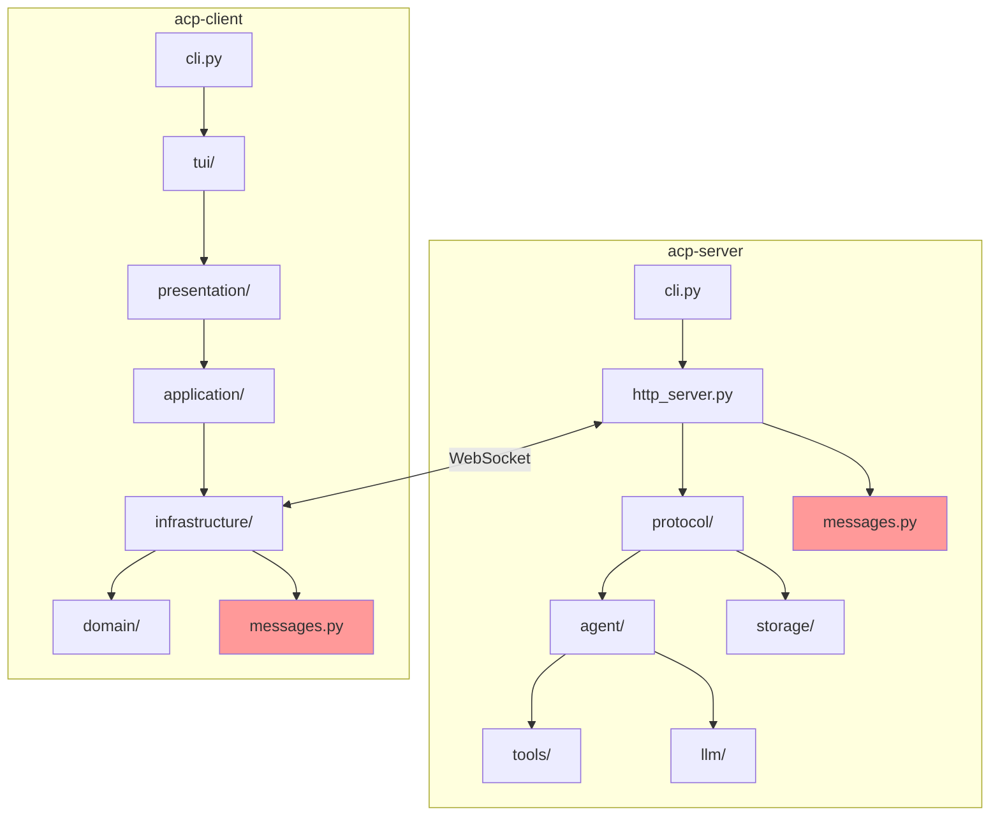
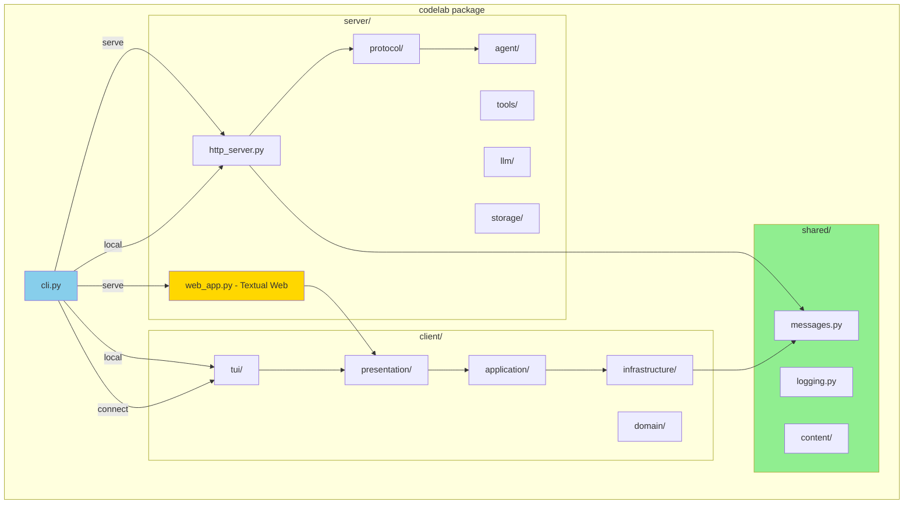
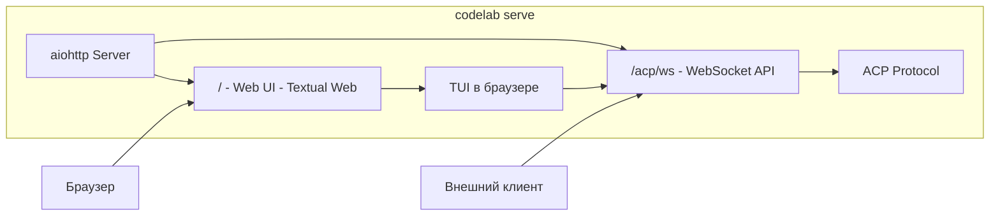
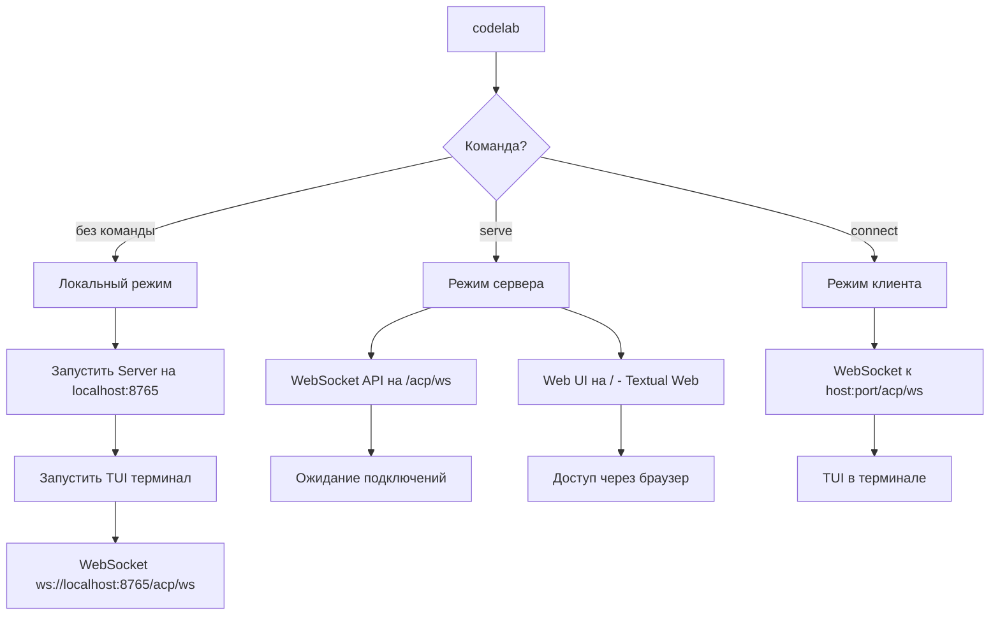
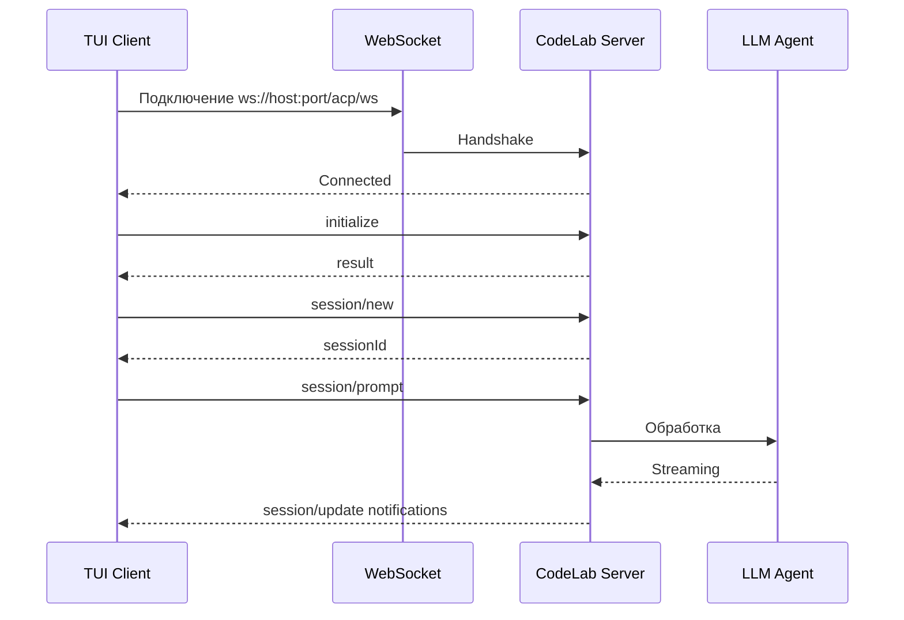
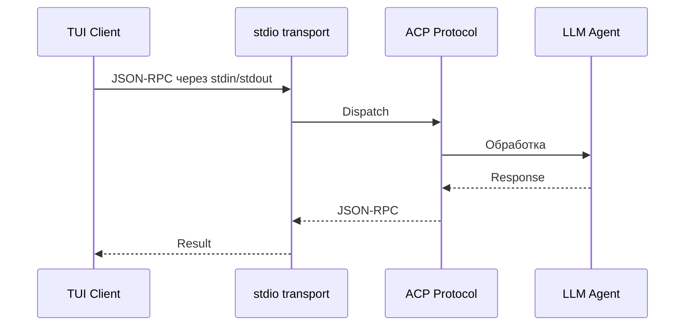
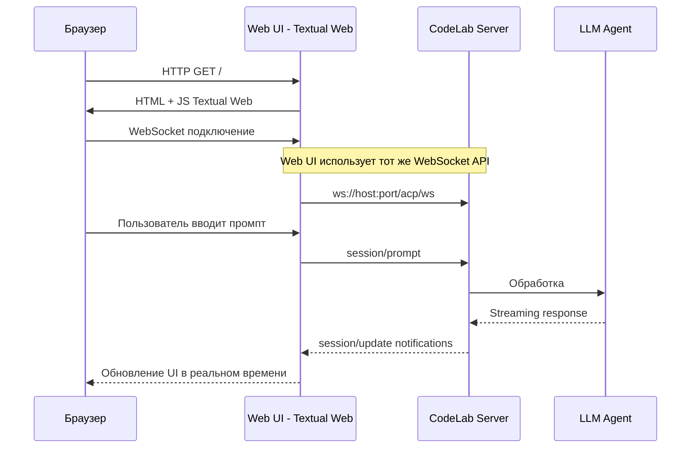
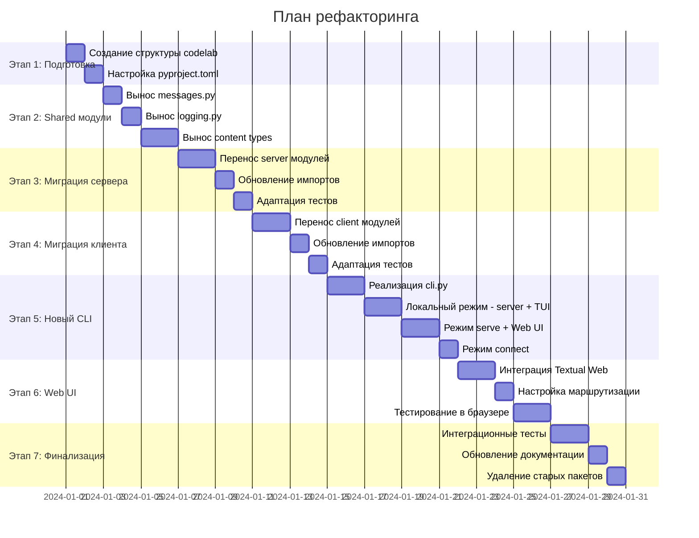

# План объединения acp-client и acp-server в единый модуль CodeLab

## Обзор

Данный документ описывает план объединения двух независимых проектов `acp-client` и `acp-server` в единый пакет `codelab` с поддержкой разных режимов работы.

## 1. Текущая архитектура

### 1.1 Структура репозитория

```
acp-protocol/
├── acp-server/           # Python сервер с LLM агентом
│   └── src/acp_server/
│       ├── protocol/     # ACP протокол (handlers, state, content)
│       ├── agent/        # LLM агент (orchestrator, naive)
│       ├── tools/        # Инструменты (registry, executors)
│       ├── llm/          # LLM провайдеры (OpenAI, Mock)
│       ├── storage/      # Хранилище сессий (memory, json_file)
│       ├── client_rpc/   # RPC для Agent→Client вызовов
│       ├── mcp/          # MCP интеграция
│       ├── http_server.py
│       ├── messages.py   # JSON-RPC модели
│       └── cli.py
│
├── acp-client/           # TUI клиент на Textual
│   └── src/acp_client/
│       ├── domain/       # Entities, Repositories (interfaces)
│       ├── application/  # Use Cases, DTOs, State Machine
│       ├── infrastructure/
│       │   ├── di_*      # DI Container
│       │   ├── transport.py
│       │   ├── handlers/ # fs, terminal handlers
│       │   └── services/ # executors, routing
│       ├── presentation/ # ViewModels (MVVM)
│       ├── tui/          # Textual UI компоненты
│       ├── messages.py   # JSON-RPC модели (дубль!)
│       └── cli.py
└── doc/
    └── Agent Client Protocol/  # Спецификация протокола
```

### 1.2 Транспортный слой

**Важно:** Текущая реализация использует **WebSocket транспорт** для всех режимов работы. Даже при локальном запуске TUI клиент подключается к серверу через WebSocket на localhost.

В будущем планируется реализация **stdio транспорта** для прямого in-process взаимодействия.

### 1.3 Диаграмма текущей архитектуры



## 2. Дублирующийся код

### 2.1 Идентичные модули

| Модуль | acp-server | acp-client | Различия |
|--------|------------|------------|----------|
| `messages.py` | `ACPMessage`, `JsonRpcError` | `ACPMessage`, `JsonRpcError` | Практически идентичны, ConfigDict extra отличается |
| `logging.py` | `setup_logging()` | `setup_logging()` | Разные пути по умолчанию |
| Content types | `protocol/content/` | `domain/content/` | Структурно похожи |

### 2.2 Код для вынесения в общий модуль

```python
# codelab/shared/messages.py - единый модуль
# codelab/shared/logging.py - общая настройка логирования
# codelab/shared/content/ - типы контента ACP
```

## 3. Целевая архитектура

### 3.1 Новая структура пакета

```
codelab/
├── src/codelab/
│   ├── __init__.py
│   ├── cli.py              # Единая точка входа
│   ├── shared/             # Общий код
│   │   ├── messages.py     # JSON-RPC модели
│   │   ├── logging.py      # Логирование
│   │   └── content/        # ACP Content Types
│   │
│   ├── server/             # Бывший acp-server
│   │   ├── http_server.py  # WebSocket API
│   │   ├── web_app.py      # Web UI (Textual Web)
│   │   ├── protocol/
│   │   ├── agent/
│   │   ├── tools/
│   │   ├── llm/
│   │   ├── storage/
│   │   ├── client_rpc/
│   │   └── mcp/
│   │
│   └── client/             # Бывший acp-client
│       ├── domain/
│       ├── application/
│       ├── infrastructure/
│       ├── presentation/
│       └── tui/
│
├── pyproject.toml          # Единый проект
└── README.md
```

### 3.2 Диаграмма целевой архитектуры



## 4. Новый CLI интерфейс

### 4.1 Команды

```bash
# Локальный режим (по умолчанию)
# Запускает сервер на localhost и TUI клиент, связь через WebSocket
codelab

# Режим сервера (serve)
# WebSocket API + Web UI (Textual Web) для браузерных клиентов
codelab serve --port 4096 --host 0.0.0.0

# Режим клиента (connect)
# Только TUI, подключается к удаленному серверу через WebSocket
codelab connect --port 4096 --host 192.168.1.100
```

### 4.2 Режим serve подробно

В режиме `codelab serve` запускается:

1. **WebSocket API** на `/acp/ws` — для programmatic доступа
2. **Web UI** на `/` — Textual Web интерфейс в браузере



### 4.3 Флаги

| Флаг | Описание | Режим |
|------|----------|-------|
| `--port` | Порт сервера (default: 8765) | serve, connect |
| `--host` | Хост сервера (default: 127.0.0.1) | serve, connect |
| `--cors` | CORS origins для Web UI | serve |
| `--mdns` | mDNS discovery для автообнаружения | serve |
| `--storage` | Backend хранилища (memory, json:path) | serve, local |
| `--no-web` | Отключить Web UI, только API | serve |
| `--log-level` | Уровень логирования | все |
| `--log-json` | JSON формат логов | все |
| `--log-file` | Файл логов | все |
| `--home-dir` | Домашняя директория приложения (default: ~/.codelab) | все |

### 4.4 Домашняя директория приложения

По умолчанию CodeLab создаёт домашнюю директорию `~/.codelab/` для хранения:

```
~/.codelab/
├── config/           # Конфигурационные файлы
│   ├── config.toml   # Основная конфигурация
│   └── modes/        # Конфигурации режимов
├── logs/             # Файлы логов
│   ├── codelab.log   # Основной лог
│   └── debug.log     # Debug лог (при --log-level DEBUG)
├── data/             # Данные приложения
│   ├── sessions/     # Сохранённые сессии (JsonFileStorage)
│   └── history/      # История чатов
└── cache/            # Кэш
    └── mcp/          # Кэш MCP серверов
```

**Смена директории через аргумент:**

```bash
# Использовать кастомную директорию
codelab --home-dir /path/to/custom/dir

# Все данные будут в /path/to/custom/dir/
codelab serve --home-dir ~/projects/myproject/.codelab
```

**Переменная окружения:**

```bash
export CODELAB_HOME=~/my-codelab-dir
codelab  # Использует CODELAB_HOME
```

**Приоритет:**
1. `--home-dir` аргумент (высший приоритет)
2. `CODELAB_HOME` переменная окружения
3. `~/.codelab/` (по умолчанию)

### 4.5 Диаграмма режимов работы



### 4.6 Транспортный слой

**Текущая реализация (WebSocket):**

Все режимы используют WebSocket транспорт:



**Будущая реализация (stdio):**

После реализации stdio транспорта появится возможность in-process взаимодействия без сети:



## 5. Web UI с Textual Web

### 5.1 Технология

[Textual Web](https://github.com/Textualize/textual-web) позволяет запускать Textual приложения в браузере без изменения кода UI.

```python
# server/web_app.py
from textual_web import WebApplication
from codelab.client.tui import ACPClientApp

async def create_web_app():
    """Создает Textual Web приложение для браузера."""
    return WebApplication(ACPClientApp)
```

### 5.2 Интеграция с aiohttp

```python
# server/http_server.py
from aiohttp import web
from textual_web.aiohttp import setup_textual_routes

class CodeLabServer:
    def __init__(self, host, port):
        self.app = web.Application()
        
        # WebSocket API для внешних клиентов
        self.app.router.add_get("/acp/ws", self.websocket_handler)
        
        # Web UI - Textual Web
        setup_textual_routes(self.app, "/", ACPClientApp)
```

### 5.3 Архитектура Web режима



## 6. Преимущества и недостатки

### 6.1 Преимущества

| Преимущество | Описание |
|--------------|----------|
| **Упрощение развертывания** | Одна команда `pip install codelab` вместо двух пакетов |
| **Web доступ** | Работа через браузер без установки TUI клиента |
| **Единая кодовая база** | Проще поддерживать, тестировать, документировать |
| **Устранение дублирования** | messages.py, logging.py, content types в одном месте |
| **Локальный режим** | Автоматический запуск сервера и клиента одной командой |
| **Единый CLI** | Пользователь работает с одним инструментом |
| **Согласованные версии** | Клиент и сервер всегда совместимы |

### 6.2 Недостатки

| Недостаток | Митигация |
|------------|-----------|
| **Увеличение размера пакета** | Optional dependencies: `codelab[web]`, `codelab[tui]` |
| **Зависимость textual-web** | Опциональная установка, fallback на `--no-web` |
| **Усложнение зависимостей** | Модульная структура, lazy imports |
| **Потеря независимого деплоя** | Сохранить возможность отдельной установки через extras |
| **Сложность тестирования** | Разделение тестов по модулям, CI матрица |

## 7. План рефакторинга

### 7.1 Этапы



### 7.2 Детальный чеклист

#### Этап 1: Подготовка структуры
- [ ] Создать директорию `codelab/src/codelab/`
- [ ] Создать `pyproject.toml` с optional dependencies
- [ ] Настроить entry points для CLI
- [ ] Создать базовые `__init__.py`

#### Этап 2: Shared модули
- [ ] Вынести `messages.py` в `shared/`
- [ ] Вынести `logging.py` в `shared/`
- [ ] Объединить `content/` типы в `shared/content/`
- [ ] Добавить re-exports в `__init__.py`

#### Этап 3: Миграция сервера
- [ ] Скопировать модули из `acp-server/src/acp_server/` в `codelab/src/codelab/server/`
- [ ] Заменить импорты `acp_server` на `codelab.server`
- [ ] Заменить импорты дублей на `codelab.shared`
- [ ] Перенести и адаптировать тесты

#### Этап 4: Миграция клиента
- [ ] Скопировать модули из `acp-client/src/acp_client/` в `codelab/src/codelab/client/`
- [ ] Заменить импорты `acp_client` на `codelab.client`
- [ ] Заменить импорты дублей на `codelab.shared`
- [ ] Перенести и адаптировать тесты

#### Этап 5: Новый CLI
- [ ] Реализовать `cli.py` с subcommands через argparse/click
- [ ] Реализовать локальный режим:
  - [ ] Запуск сервера на localhost:8765 в фоне
  - [ ] Запуск TUI с подключением через WebSocket
  - [ ] Корректное завершение обоих процессов
- [ ] Реализовать `serve` команду с WebSocket API
- [ ] Реализовать `connect` команду
- [ ] Добавить --help и документацию команд

#### Этап 6: Web UI
- [ ] Добавить зависимость `textual-web` в optional
- [ ] Создать `server/web_app.py` с Textual Web интеграцией
- [ ] Настроить маршруты в `http_server.py`
- [ ] Реализовать флаг `--no-web` для отключения Web UI
- [ ] Протестировать в Chrome, Firefox, Safari

#### Этап 7: Финализация
- [ ] Написать интеграционные тесты для всех режимов
- [ ] Обновить README.md, CHANGELOG.md
- [ ] Обновить AGENTS.md
- [ ] Удалить старые `acp-server/` и `acp-client/` директории
- [ ] Обновить CI/CD конфигурацию

## 8. Риски и митигация

| Риск | Вероятность | Влияние | Митигация |
|------|-------------|---------|-----------|
| Textual Web нестабильность | Средняя | Среднее | Fallback на `--no-web`, API-only режим |
| Нарушение обратной совместимости | Средняя | Высокое | Семантическое версионирование, deprecation warnings |
| Конфликты зависимостей | Низкая | Среднее | Тщательное тестирование, lock-файлы |
| Регрессии в функциональности | Средняя | Высокое | Комплексные интеграционные тесты |
| Производительность Web UI | Средняя | Среднее | Профилирование, оптимизация рендеринга |
| Сложность отладки | Низкая | Среднее | Хорошее логирование, трейсы |

## 9. Структура pyproject.toml

```toml
[project]
name = "codelab"
version = "0.1.0"
description = "AI coding assistant with ACP protocol"
requires-python = ">=3.12"

dependencies = [
    "pydantic>=2.0",
    "structlog",
    "aiohttp",
]

[project.optional-dependencies]
server = [
    "openai",
    # LLM providers
]
tui = [
    "textual>=0.40",
    # Terminal UI dependencies
]
web = [
    "textual-web>=0.5",
    # Web UI dependencies
]
full = [
    "codelab[server,tui,web]",
]
dev = [
    "pytest",
    "pytest-asyncio",
    "ruff",
    # dev tools
]

[project.scripts]
codelab = "codelab.cli:main"

[project.entry-points."codelab.commands"]
serve = "codelab.server.cli:serve_command"
connect = "codelab.client.cli:connect_command"
```

## 10. Примеры использования

### 10.1 Локальная разработка

```bash
# Установка с полным функционалом
pip install codelab[full]

# Запуск локально (сервер на localhost + TUI через WebSocket)
cd /path/to/project
codelab
```

### 10.2 Серверное развертывание

```bash
# Установка серверной части с Web UI
pip install codelab[server,web]

# Запуск сервера с Web UI
codelab serve --host 0.0.0.0 --port 8765

# Доступ через браузер: http://server-ip:8765/
# Доступ через API: ws://server-ip:8765/acp/ws
```

### 10.3 Удаленное подключение

```bash
# Установка только TUI клиента
pip install codelab[tui]

# Подключение к удаленному серверу через WebSocket
codelab connect --host 192.168.1.100 --port 8765
```

## 11. Будущие улучшения

### 11.1 Transport stdio

После реализации stdio транспорта можно будет добавить настоящий in-process режим без использования сети:

```bash
# Будущий локальный режим с stdio (без WebSocket)
codelab --transport stdio
```

### 11.2 Плагины

Возможность расширения через плагины:

```bash
# Установка плагинов
pip install codelab-plugin-github
codelab --plugins github
```

## 12. Заключение

Объединение `acp-client` и `acp-server` в единый пакет `codelab` позволит:

1. **Упростить установку и использование** — одна команда для всех режимов
2. **Добавить Web UI** — работа через браузер с Textual Web
3. **Устранить дублирование кода** — общие модули в `shared/`
4. **Обеспечить согласованность версий** — клиент и сервер всегда совместимы
5. **Упростить локальный запуск** — одна команда запускает сервер и клиент

**Архитектурное ограничение:** На текущем этапе все режимы используют WebSocket транспорт. Даже в локальном режиме TUI подключается к серверу через `ws://localhost:8765/acp/ws`. Это требование протокола ACP с WebSocket транспортом.

При этом необходимо:
- Сохранить модульность через optional dependencies
- Обеспечить полное покрытие тестами
- Не нарушать протокол ACP из `doc/Agent Client Protocol/`
