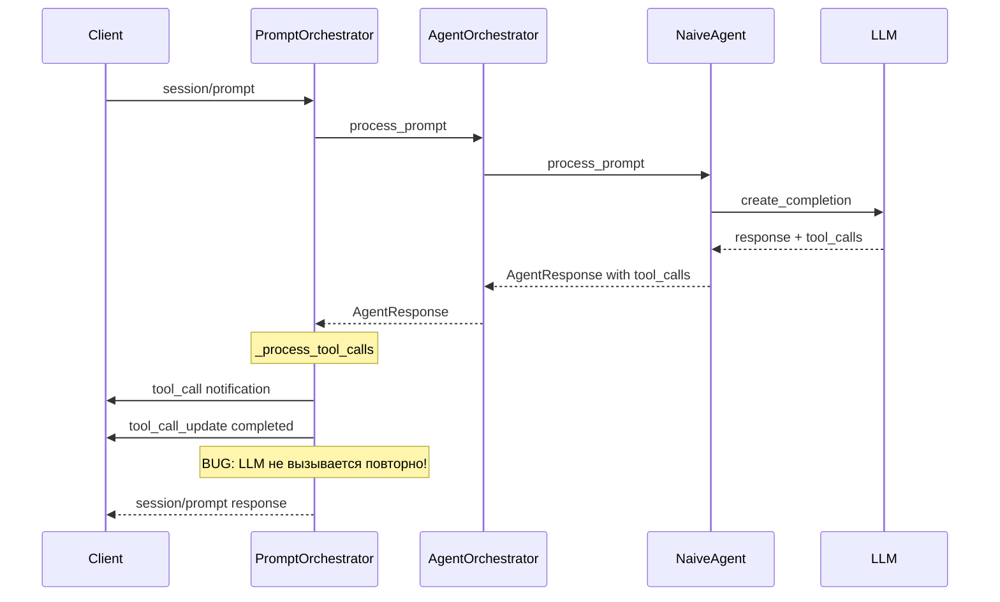
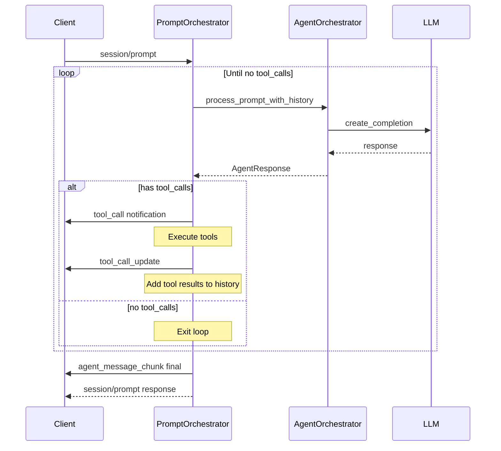
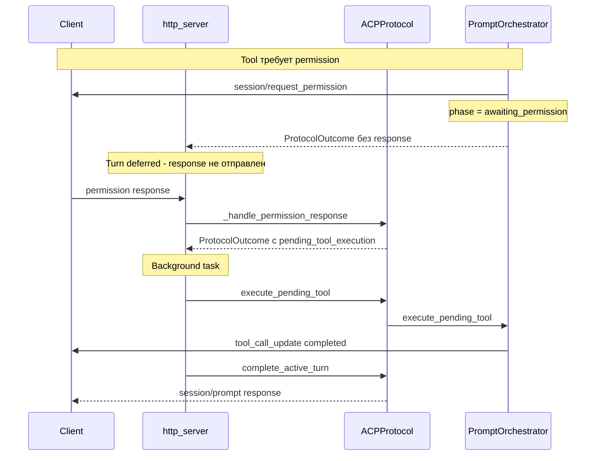
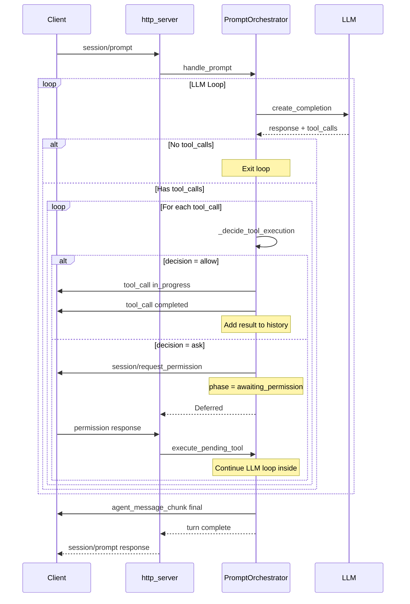
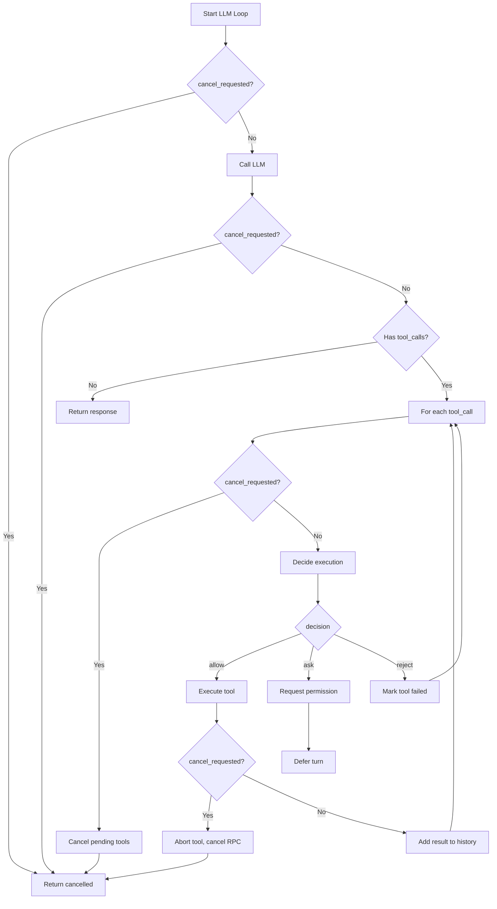
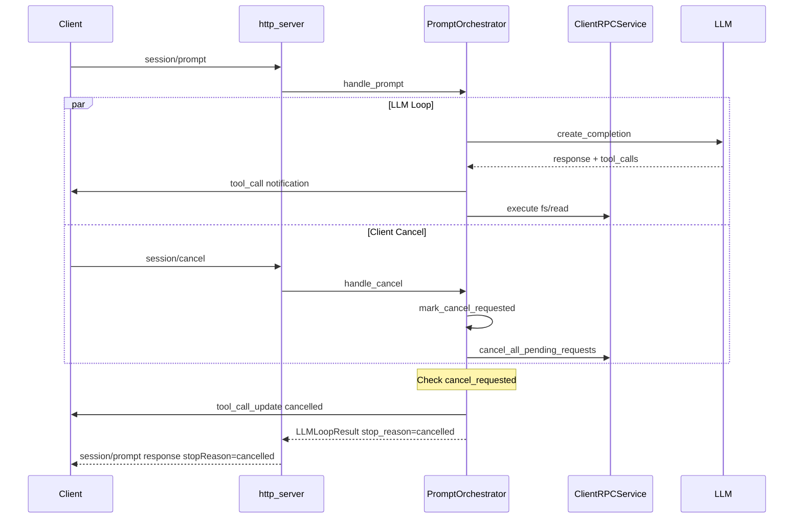

# Архитектура LLM Loop для Tool Calls

## BUG #3: LLM не вызывается повторно после tool execution

## Соответствие ACP протоколу

План разработан в соответствии с официальной спецификацией [Agent Client Protocol](doc/Agent%20Client%20Protocol/protocol/05-Prompt%20Turn.md).

### Ключевые требования протокола

#### 1. LLM Loop (Step 6 - Continue Conversation)

> "The Agent sends the tool results back to the language model as another request.
> The cycle returns to step 2, continuing until the language model completes its response without requesting additional tool calls or the turn gets stopped by the Agent or cancelled by the Client."

**Реализация:** Метод `_run_llm_loop` в PromptOrchestrator.

#### 2. Stop Reasons

| Stop Reason | Описание | Реализация |
|-------------|----------|------------|
| `end_turn` | LLM завершил без tool calls | `LLMLoopResult.stop_reason = "end_turn"` |
| `cancelled` | Client отменил turn | `LLMLoopResult.stop_reason = "cancelled"` |
| `max_turn_requests` | Превышен лимит итераций | `LLMLoopResult.stop_reason = "max_iterations"` |

#### 3. Cancellation Flow

Протокол (строки 285-318):
- Client sends `session/cancel` → **реализовано в `handle_cancel`**
- Agent SHOULD stop LLM requests and tool invocations → **проверки `cancel_requested` в loop**
- Agent MUST respond with `cancelled` stop reason → **`LLMLoopResult.stop_reason = "cancelled"`**
- Agent MAY send updates after cancel → **notifications отправляются перед response**

#### 4. Permission Flow

Протокол (Tool Calls, строки 110-188):
- Agent MAY request permission via `session/request_permission` → **реализовано**
- Client responds with `selected` + `optionId` → **обрабатывается в `_handle_permission_response`**
- If cancelled, Client MUST respond with `cancelled` outcome → **tombstone sets**

---

### Описание проблемы

После выполнения tool calls результаты отправляются клиенту, но LLM **не вызывается повторно** для обработки результатов. Согласно ACP протоколу, цикл должен продолжаться до финального ответа.

---

## Текущая архитектура



### Проблемные участки кода

#### 1. NaiveAgent - ранний выход из цикла

[`acp-server/src/acp_server/agent/naive.py`](acp-server/src/acp_server/agent/naive.py:161-171):

```python
# При получении tool_calls агент сразу возвращает ответ
# вместо выполнения tools и повторного вызова LLM
return AgentResponse(
    text=response.text,
    tool_calls=response.tool_calls,
    stop_reason=response.stop_reason,
    metadata={"iterations": iteration},
)
```

#### 2. PromptOrchestrator - нет LLM loop после tool execution

[`acp-server/src/acp_server/protocol/handlers/prompt_orchestrator.py`](acp-server/src/acp_server/protocol/handlers/prompt_orchestrator.py:248-255):

```python
# После _process_tool_calls нет повторного вызова LLM
if agent_response and agent_response.tool_calls:
    await self._process_tool_calls(
        session, session_id, agent_response.tool_calls, notifications
    )
# Сразу переходит к завершению turn
```

---

## Требуемая архитектура по ACP протоколу

Согласно [05-Prompt Turn.md](doc/Agent%20Client%20Protocol/protocol/05-Prompt%20Turn.md:30-54):

```
loop Until completion
    Note right of Agent: LLM responds with content/tool calls
    Agent->>Client: session/update agent_message_chunk
    opt Tool calls requested
        Agent->>Client: session/update tool_call
        Note right of Agent: Execute tool
        Agent->>Client: session/update tool_call status: completed
        Note right of Agent: Send tool results back to LLM  <-- КЛЮЧЕВОЙ ШАГ
    end
end
```

---

## Предлагаемое решение

### Вариант A: LLM Loop в PromptOrchestrator (рекомендуется)

Добавить цикл в `handle_prompt` который:
1. Вызывает LLM
2. Если есть tool_calls - выполняет их
3. Добавляет tool results в историю
4. Повторно вызывает LLM с обновленной историей
5. Повторяет до получения ответа без tool_calls



### Изменения в коде

#### 1. Новый метод в AgentOrchestrator

```python
async def continue_with_tool_results(
    self,
    session_state: SessionState,
    tool_results: list[ToolResult],
) -> AgentResponse:
    """Продолжить обработку после получения tool results.
    
    Добавляет tool results в историю и вызывает LLM повторно.
    """
    # Добавить tool results в conversation_history
    for result in tool_results:
        self._add_tool_result_to_history(session_state, result)
    
    # Вызвать LLM с обновленной историей (без нового user prompt)
    return await self.agent.continue_processing(session_state)
```

#### 2. Изменить handle_prompt в PromptOrchestrator

```python
async def handle_prompt(...) -> ProtocolOutcome:
    # ... инициализация ...
    
    max_iterations = 10
    iteration = 0
    
    while iteration < max_iterations:
        iteration += 1
        
        # Шаг: Получить ответ от LLM
        if iteration == 1:
            agent_response = await agent_orchestrator.process_prompt(
                session, prompt_text
            )
        else:
            # Продолжить с tool results
            agent_response = await agent_orchestrator.continue_with_tool_results(
                session, tool_results
            )
        
        # Отправить текстовый ответ
        if agent_response.text:
            notifications.append(
                _build_agent_response_notification(session_id, agent_response.text)
            )
        
        # Если нет tool_calls - выходим из цикла
        if not agent_response.tool_calls:
            break
        
        # Обработать tool_calls
        tool_results = await self._process_tool_calls_and_collect_results(
            session, session_id, agent_response.tool_calls, notifications
        )
    
    # Завершить turn
    return ProtocolOutcome(response=..., notifications=notifications)
```

#### 3. Структура ToolResult

```python
@dataclass
class ToolResult:
    """Результат выполнения tool для передачи в LLM."""
    tool_call_id: str
    tool_name: str
    success: bool
    output: str | None
    error: str | None
```

---

## План реализации

### Этап 1: Базовая структура
- [ ] Добавить `ToolResult` dataclass в `protocol/state.py`
- [ ] Добавить метод `continue_with_tool_results` в `AgentOrchestrator`
- [ ] Добавить метод `continue_processing` в `NaiveAgent`

### Этап 2: LLM Loop в PromptOrchestrator
- [ ] Рефакторинг `_process_tool_calls` - вернуть список ToolResult
- [ ] Добавить цикл в `handle_prompt`
- [ ] Обновить историю сессии с tool results

### Этап 3: Интеграция с permission flow
- [ ] Обработка deferred execution после permission approval
- [ ] Продолжение LLM loop после permission

### Этап 4: Тестирование
- [ ] Unit тесты для LLM loop
- [ ] Integration тесты с mock LLM
- [ ] E2E тест с реальным сценарием

---

## Интеграция с Permission Flow

### Текущий Permission Flow



### Ключевые точки интеграции

#### 1. Deferred Turn (строки 287-295 в prompt_orchestrator.py)

Текущая логика:
```python
if session.active_turn and session.active_turn.phase == "awaiting_permission":
    # НЕ завершать turn, вернуть ProtocolOutcome без response
    return ProtocolOutcome(notifications=notifications)
```

**Проблема:** После permission approval выполняется только один tool, LLM loop не продолжается.

#### 2. Background Tool Execution (строки 377-413 в http_server.py)

```python
async def _execute_tool_in_background():
    tool_notifications = await protocol.execute_pending_tool(...)
    # Отправить notifications
    # Завершить turn
    turn_completion = protocol.complete_active_turn(
        pending.session_id, stop_reason="end_turn"  # <-- BUG: Завершает turn сразу!
    )
```

**Проблема:** Turn завершается сразу после одного tool, без продолжения LLM loop.

### Требуемые изменения для Permission Flow

#### Вариант A: LLM Loop в execute_pending_tool (рекомендуется)

```python
async def execute_pending_tool(self, session, session_id, tool_call_id):
    # 1. Выполнить tool
    tool_result = await self._execute_tool(...)
    
    # 2. Добавить tool result в историю
    self._add_tool_result_to_history(session, tool_result)
    
    # 3. Продолжить LLM loop
    while True:
        agent_response = await agent_orchestrator.continue_with_tool_results(
            session, [tool_result]
        )
        
        if not agent_response.tool_calls:
            # Финальный ответ - выходим из loop
            break
        
        # Обработать следующие tool_calls
        for tc in agent_response.tool_calls:
            decision = await self._decide_tool_execution(session, tc.kind)
            
            if decision == "ask":
                # Permission needed - defer снова
                # Turn НЕ завершается, ждем следующий permission response
                return notifications, PendingToolExecution(...)
            
            # Execute tool
            tool_result = await self._execute_tool(...)
    
    # 4. Вернуть notifications (turn будет завершен в http_server.py)
    return notifications
```

#### Изменения в http_server.py

```python
async def _execute_tool_in_background():
    result = await protocol.execute_pending_tool(...)
    tool_notifications = result.notifications
    
    # Отправить notifications
    for notification in tool_notifications:
        await ws.send_str(notification.to_json())
    
    # Если есть еще pending permission - НЕ завершать turn
    if result.pending_tool_execution is not None:
        # Снова deferred, ждем следующий permission response
        return
    
    # Иначе завершить turn
    turn_completion = protocol.complete_active_turn(
        pending.session_id, stop_reason="end_turn"
    )
```

### Новая структура PendingToolExecutionResult

```python
@dataclass
class PendingToolExecutionResult:
    """Результат execute_pending_tool с возможным deferred состоянием."""
    notifications: list[ACPMessage]
    pending_tool_execution: PendingToolExecution | None = None
    # Если pending_tool_execution не None, turn не должен завершаться
```

### Диаграмма LLM Loop с Permission



### Обработка нескольких tool calls с разными decisions

Если LLM возвращает несколько tool_calls:

```
tool_calls: [
    {name: "fs/read_text_file", kind: "read"},   # decision: allow
    {name: "fs/write_text_file", kind: "edit"},  # decision: ask
    {name: "terminal/execute", kind: "execute"}  # decision: ask
]
```

**Стратегия:**
1. Выполнить все tools с `decision = allow`
2. При первом `decision = ask` - defer и ждать permission
3. После permission approval - продолжить с оставшимися tools
4. Сохранять состояние pending tools в session.active_turn

```python
@dataclass
class ActiveTurn:
    # ... existing fields ...
    pending_tool_calls: list[ToolCallState] = field(default_factory=list)
    current_tool_index: int = 0
```

---

## Обработка Cancel во время LLM Loop

### Текущая реализация cancel (handle_cancel)

[`prompt_orchestrator.py:315-398`](acp-server/src/acp_server/protocol/handlers/prompt_orchestrator.py:315):

```python
def handle_cancel(self, ...):
    # 1. Установить флаг cancel_requested
    self.turn_lifecycle_manager.mark_cancel_requested(session)
    
    # 2. Отменить все активные tool calls
    cancel_messages = self.tool_call_handler.cancel_active_tools(session, session_id)
    
    # 3. Добавить cancelled permission requests в tombstone
    if session.active_turn.permission_request_id is not None:
        session.cancelled_permission_requests.add(...)
    
    # 4. Отменить pending client RPC через ClientRPCService
    self.client_rpc_service.cancel_all_pending_requests(...)
    
    # 5. Завершить turn с stop_reason="cancelled"
    self.turn_lifecycle_manager.finalize_turn(session, "cancelled")
```

### Точки проверки cancel в LLM Loop

В новом LLM loop нужно проверять `cancel_requested` в следующих точках:



### Реализация cancel-aware LLM Loop

```python
async def _run_llm_loop(
    self,
    session: SessionState,
    session_id: str,
    agent_orchestrator: AgentOrchestrator,
    initial_prompt_text: str | None = None,
    tool_results: list[ToolResult] | None = None,
) -> LLMLoopResult:
    """LLM loop с поддержкой cancel.
    
    Args:
        session: Состояние сессии
        session_id: ID сессии
        agent_orchestrator: Оркестратор агента
        initial_prompt_text: Начальный промпт (None для продолжения)
        tool_results: Результаты tools для продолжения (None для начала)
    
    Returns:
        LLMLoopResult с notifications и статусом завершения
    """
    notifications: list[ACPMessage] = []
    max_iterations = 10
    iteration = 0
    
    while iteration < max_iterations:
        iteration += 1
        
        # CHECK 1: cancel перед вызовом LLM
        if self._is_cancel_requested(session):
            return LLMLoopResult(
                notifications=notifications,
                stop_reason="cancelled",
            )
        
        # Вызвать LLM
        if iteration == 1 and initial_prompt_text is not None:
            agent_response = await agent_orchestrator.process_prompt(
                session, initial_prompt_text
            )
        else:
            agent_response = await agent_orchestrator.continue_with_tool_results(
                session, tool_results or []
            )
        
        # CHECK 2: cancel после вызова LLM
        if self._is_cancel_requested(session):
            return LLMLoopResult(
                notifications=notifications,
                stop_reason="cancelled",
            )
        
        # Отправить текстовый ответ
        if agent_response.text:
            notifications.append(
                _build_agent_response_notification(session_id, agent_response.text)
            )
        
        # Если нет tool_calls - выходим из цикла
        if not agent_response.tool_calls:
            return LLMLoopResult(
                notifications=notifications,
                stop_reason="end_turn",
                final_text=agent_response.text,
            )
        
        # Обработать tool_calls
        tool_results = []
        for tool_call in agent_response.tool_calls:
            # CHECK 3: cancel перед обработкой каждого tool
            if self._is_cancel_requested(session):
                # Отменить оставшиеся tools
                await self._cancel_remaining_tools(session, session_id)
                return LLMLoopResult(
                    notifications=notifications,
                    stop_reason="cancelled",
                )
            
            decision = await self._decide_tool_execution(session, tool_call.kind)
            
            if decision == "ask":
                # Defer для permission - выходим из loop
                return LLMLoopResult(
                    notifications=notifications,
                    stop_reason=None,  # Turn not completed
                    pending_permission=True,
                    pending_tool_calls=remaining_tools,
                )
            
            if decision == "reject":
                tool_results.append(ToolResult(
                    tool_call_id=tool_call.id,
                    success=False,
                    error="Permission denied",
                ))
                continue
            
            # decision == "allow" - выполнить tool
            try:
                result = await self._execute_tool_with_cancel_check(
                    session, session_id, tool_call
                )
                tool_results.append(result)
            except CancelledError:
                # Tool execution был отменен
                return LLMLoopResult(
                    notifications=notifications,
                    stop_reason="cancelled",
                )
    
    # Достигнут лимит итераций
    return LLMLoopResult(
        notifications=notifications,
        stop_reason="max_iterations",
    )

def _is_cancel_requested(self, session: SessionState) -> bool:
    """Проверяет, был ли запрошен cancel для текущего turn."""
    return (
        session.active_turn is not None
        and session.active_turn.cancel_requested
    )

async def _execute_tool_with_cancel_check(
    self,
    session: SessionState,
    session_id: str,
    tool_call: ToolCall,
) -> ToolResult:
    """Выполняет tool с проверкой cancel.
    
    Если cancel запрошен во время выполнения, отменяет pending RPC
    и выбрасывает CancelledError.
    """
    # Создать task для выполнения
    execution_task = asyncio.create_task(
        self.tool_registry.execute_tool(
            session_id, tool_call.name, tool_call.arguments, session=session
        )
    )
    
    # Создать task для отслеживания cancel
    cancel_event = asyncio.Event()
    
    async def wait_for_cancel():
        while not self._is_cancel_requested(session):
            await asyncio.sleep(0.1)
        cancel_event.set()
    
    cancel_watcher = asyncio.create_task(wait_for_cancel())
    
    # Ждать первое завершение
    done, pending = await asyncio.wait(
        [execution_task, cancel_watcher],
        return_when=asyncio.FIRST_COMPLETED,
    )
    
    # Отменить оставшиеся tasks
    for task in pending:
        task.cancel()
    
    if execution_task in done:
        return execution_task.result()
    
    # Cancel был запрошен - отменить pending RPC
    if self.client_rpc_service is not None:
        self.client_rpc_service.cancel_all_pending_requests(
            reason="session/cancel during tool execution"
        )
    
    raise CancelledError("Tool execution cancelled")
```

### Структуры данных для cancel

```python
@dataclass
class LLMLoopResult:
    """Результат выполнения LLM loop."""
    notifications: list[ACPMessage]
    stop_reason: str | None  # "end_turn", "cancelled", "max_iterations", None
    final_text: str | None = None
    pending_permission: bool = False
    pending_tool_calls: list[ToolCall] = field(default_factory=list)
```

### Диаграмма Cancel Flow в LLM Loop



### Важные аспекты cancel handling

1. **Атомарность проверки**: `cancel_requested` - простой bool, потокобезопасен
2. **Graceful degradation**: При cancel во время LLM вызова - дождаться ответа, но не продолжать
3. **ClientRPC cancellation**: Немедленно отменяет все pending RPC requests
4. **Late responses**: После cancel поздние responses игнорируются через tombstone sets
5. **History consistency**: При cancel история не повреждается, сессия остается валидной

---

## Риски и ограничения

1. **Бесконечный цикл**: Необходим `max_iterations` для защиты
2. **Permission flow**: При `decision == "ask"` цикл должен приостановиться и продолжиться после ответа пользователя
3. **Cancel handling**: При `session/cancel` все pending operations должны быть отменены, проверки в каждой итерации
4. **История сообщений**: Tool results должны добавляться в формате OpenAI/Anthropic API
5. **Race conditions**: Cancel может прийти в любой момент, нужны atomic checks

---

## Формат Tool Results для OpenAI API

```python
# Assistant message с tool_calls
{
    "role": "assistant",
    "content": "I need to read the file",
    "tool_calls": [
        {
            "id": "call_abc123",
            "type": "function",
            "function": {
                "name": "fs/read_text_file",
                "arguments": '{"path": "/file.txt"}'
            }
        }
    ]
}

# Tool result message
{
    "role": "tool",
    "tool_call_id": "call_abc123",
    "content": "File contents here..."
}
```

---

## Следующие шаги

1. Утвердить план с командой
2. Переключиться в Code mode для реализации
3. Начать с Этапа 1: базовая структура
