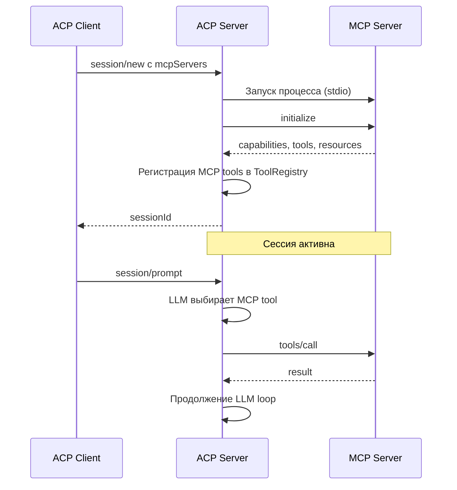
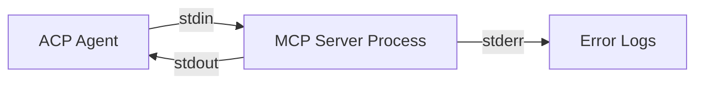
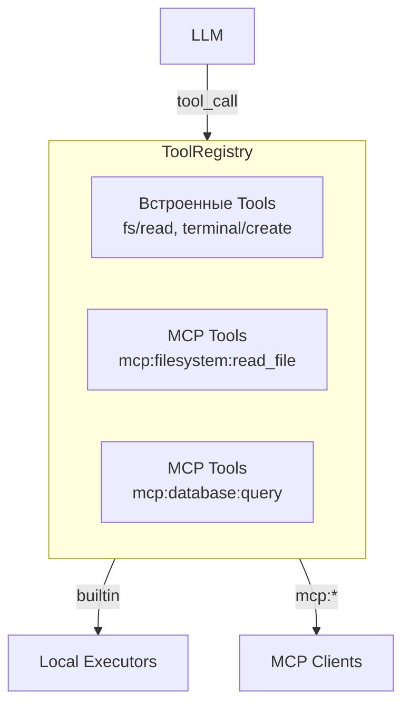
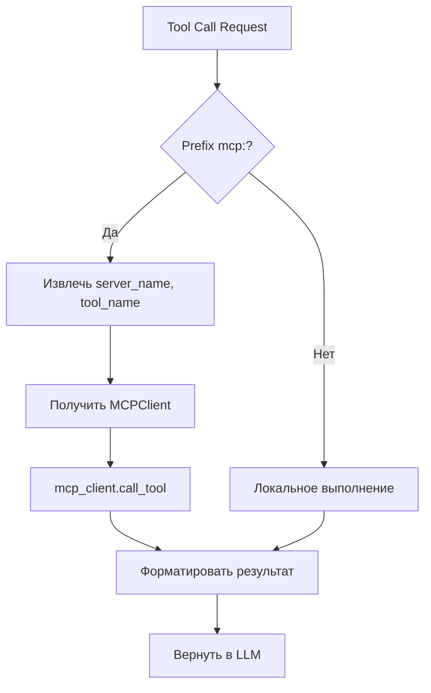
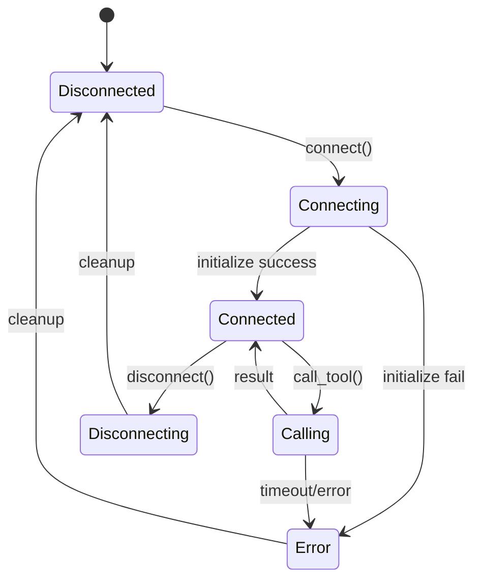
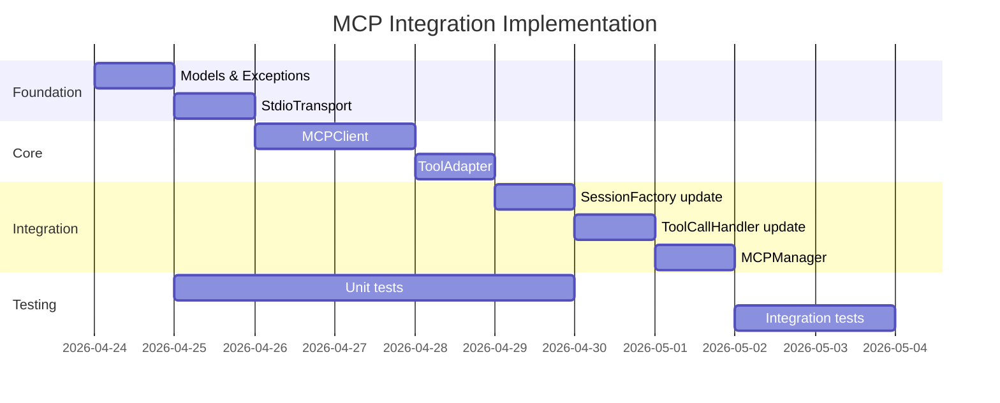

# План интеграции MCP (Model Context Protocol)

## Обзор

**Этап:** 8  
**Приоритет:** Высокий  
**Зависимости:** Этап 3 (Tool Calls) ✅  
**Статус:** В планировании

### Цель

Реализовать подключение к MCP (Model Context Protocol) серверам согласно спецификации [03-Session Setup.md](../doc/Agent%20Client%20Protocol/protocol/03-Session%20Setup.md) и [15-Extensibility.md](../doc/Agent%20Client%20Protocol/protocol/15-Extensibility.md).

### Текущее состояние

- `session/new` и `session/load` принимают параметр `mcpServers`
- [`SessionFactory`](../acp-server/src/acp_server/protocol/session_factory.py) сохраняет `mcp_servers` в `SessionState`, но не использует их
- MCP серверы **не подключаются** — функциональность не реализована

---

## Анализ требований протокола

### Формат mcpServers (из спецификации ACP)

```json
{
  "mcpServers": [
    {
      "name": "filesystem",
      "command": "/path/to/mcp-server",
      "args": ["--stdio"],
      "env": []
    }
  ]
}
```

### Жизненный цикл MCP сервера



---

## Детальный план реализации

### Задача 1: Создать модуль MCP клиента

**Расположение:** `acp-server/src/acp_server/mcp/`

#### Файловая структура

```
acp-server/src/acp_server/mcp/
├── __init__.py
├── client.py          # MCPClient - основной клиент
├── transport.py       # StdioTransport для stdio коммуникации
├── models.py          # Pydantic модели для MCP протокола
├── exceptions.py      # MCP-специфичные исключения
└── tool_adapter.py    # Адаптер MCP tools → ToolDefinition
```

#### Критерии приёмки

- [ ] MCPClient может запускать MCP сервер как subprocess
- [ ] MCPClient реализует MCP initialize handshake
- [ ] MCPClient получает список tools от MCP сервера
- [ ] MCPClient может вызывать tools/call
- [ ] StdioTransport корректно обрабатывает JSON-RPC через stdin/stdout
- [ ] Unit тесты покрывают все компоненты

---

### Задача 2: Реализовать MCP модели данных

**Файл:** `acp-server/src/acp_server/mcp/models.py`

```python
# Основные модели
class MCPServerConfig:
    name: str
    command: str
    args: list[str]
    env: list[dict[str, str]]

class MCPCapabilities:
    tools: bool
    resources: bool
    prompts: bool

class MCPToolDefinition:
    name: str
    description: str
    inputSchema: dict[str, Any]

class MCPToolCallResult:
    content: list[MCPContent]
    isError: bool
```

#### Критерии приёмки

- [ ] Модели соответствуют MCP спецификации
- [ ] Pydantic валидация работает корректно
- [ ] Сериализация/десериализация JSON работает

---

### Задача 3: Реализовать StdioTransport

**Файл:** `acp-server/src/acp_server/mcp/transport.py`

#### Функционал

- Запуск subprocess с указанной командой
- Асинхронное чтение stdout (JSON-RPC responses)
- Асинхронная запись в stdin (JSON-RPC requests)
- Обработка закрытия процесса
- Timeout для операций



#### Критерии приёмки

- [ ] Subprocess запускается корректно
- [ ] JSON-RPC сообщения отправляются/принимаются
- [ ] Graceful shutdown при закрытии
- [ ] Timeout обработка
- [ ] Unit тесты с mock процессом

---

### Задача 4: Реализовать MCPClient

**Файл:** `acp-server/src/acp_server/mcp/client.py`

#### API

```python
class MCPClient:
    async def connect(config: MCPServerConfig) -> None
    async def initialize() -> MCPCapabilities
    async def list_tools() -> list[MCPToolDefinition]
    async def call_tool(name: str, arguments: dict) -> MCPToolCallResult
    async def disconnect() -> None
```

#### Критерии приёмки

- [ ] connect() запускает MCP сервер и устанавливает соединение
- [ ] initialize() выполняет MCP handshake
- [ ] list_tools() возвращает доступные инструменты
- [ ] call_tool() вызывает инструмент и возвращает результат
- [ ] disconnect() корректно завершает процесс
- [ ] Обработка ошибок и reconnect логика

---

### Задача 5: Интегрировать MCP Tools в ToolRegistry

**Файлы:**
- `acp-server/src/acp_server/mcp/tool_adapter.py`
- `acp-server/src/acp_server/tools/registry.py`

#### Концепция

MCP tools регистрируются с namespace: `mcp:{server_name}:{tool_name}`



#### Критерии приёмки

- [ ] MCPToolAdapter конвертирует MCPToolDefinition → ToolDefinition
- [ ] Tools регистрируются с namespace prefix
- [ ] execute() для MCP tools делегирует в MCPClient
- [ ] Unit тесты для адаптера

---

### Задача 6: Обновить SessionFactory для MCP

**Файл:** `acp-server/src/acp_server/protocol/session_factory.py`

#### Изменения

```python
class SessionFactory:
    @staticmethod
    async def create_session(
        cwd: str,
        mcp_servers: list[dict[str, Any]] | None = None,
        ...
    ) -> SessionState:
        # Существующая логика
        session = SessionState(...)
        
        # Новая логика: подключение к MCP серверам
        mcp_clients = await SessionFactory._connect_mcp_servers(mcp_servers)
        session.mcp_clients = mcp_clients
        
        # Регистрация MCP tools
        await SessionFactory._register_mcp_tools(session, mcp_clients)
        
        return session
```

#### Критерии приёмки

- [ ] MCP серверы подключаются при создании сессии
- [ ] MCP tools регистрируются в ToolRegistry сессии
- [ ] Ошибки подключения логируются, но не блокируют создание сессии
- [ ] При session/load также подключаются MCP серверы

---

### Задача 7: Обновить ToolCallHandler для MCP

**Файл:** `acp-server/src/acp_server/protocol/handlers/tool_call_handler.py`

#### Изменения

При выполнении tool call:
1. Проверить, является ли tool MCP tool (prefix `mcp:`)
2. Если да — делегировать в соответствующий MCPClient
3. Если нет — выполнить локально



#### Критерии приёмки

- [ ] MCP tool calls корректно маршрутизируются
- [ ] Результаты MCP tools преобразуются в формат ACP
- [ ] Ошибки MCP tools обрабатываются gracefully
- [ ] Permission flow работает для MCP tools

---

### Задача 8: Управление жизненным циклом MCP

**Новые компоненты:**
- `acp-server/src/acp_server/mcp/manager.py` — MCPManager для управления клиентами

#### Жизненный цикл



#### Критерии приёмки

- [ ] MCPManager отслеживает все активные MCP клиенты
- [ ] Автоматический cleanup при завершении сессии
- [ ] Reconnect логика при разрыве соединения
- [ ] Health check для MCP серверов

---

### Задача 9: Интеграционные тесты

**Файлы:**
- `acp-server/tests/integration/test_mcp_integration.py`
- `acp-server/tests/mocks/mock_mcp_server.py`

#### Сценарии тестирования

1. **Базовый flow:**
   - session/new с mcpServers → MCP подключается → tools доступны

2. **Tool call flow:**
   - LLM вызывает MCP tool → результат возвращается → LLM продолжает

3. **Ошибки:**
   - MCP сервер не запускается → сессия создаётся без этих tools
   - MCP tool возвращает ошибку → LLM получает error content

4. **Cleanup:**
   - Сессия завершается → MCP процессы terminates

#### Критерии приёмки

- [ ] Интеграционные тесты с mock MCP сервером
- [ ] E2E тест полного цикла
- [ ] Тесты error scenarios

---

## Зависимости

### Внутренние зависимости

| Компонент | Зависит от |
|-----------|------------|
| MCPClient | StdioTransport, models |
| ToolAdapter | MCPClient, ToolDefinition |
| SessionFactory | MCPClient, ToolRegistry |
| ToolCallHandler | ToolRegistry |

### Внешние зависимости

- `asyncio` — асинхронные операции
- `structlog` — логирование (уже используется)
- Pydantic — модели данных (уже используется)

**Новых зависимостей НЕ требуется.**

---

## Риски и митигация

| Риск | Вероятность | Влияние | Митигация |
|------|-------------|---------|-----------|
| MCP сервер не отвечает | Средняя | Высокое | Timeout + graceful degradation |
| Некорректный MCP протокол | Низкая | Среднее | Строгая валидация, подробные логи |
| Memory leak от subprocess | Средняя | Высокое | Явный cleanup, context managers |
| Race conditions | Средняя | Среднее | Asyncio locks, proper lifecycle |

---

## Порядок реализации



---

## Checklist

### Этап 8.1: Foundation
- [ ] Создать `acp-server/src/acp_server/mcp/__init__.py`
- [ ] Создать `acp-server/src/acp_server/mcp/models.py` с Pydantic моделями
- [ ] Создать `acp-server/src/acp_server/mcp/exceptions.py`
- [ ] Unit тесты для моделей

### Этап 8.2: Transport
- [ ] Создать `acp-server/src/acp_server/mcp/transport.py`
- [ ] Реализовать StdioTransport
- [ ] Unit тесты с mock subprocess

### Этап 8.3: Client
- [ ] Создать `acp-server/src/acp_server/mcp/client.py`
- [ ] Реализовать MCPClient с полным API
- [ ] Unit тесты клиента

### Этап 8.4: Integration
- [ ] Создать `acp-server/src/acp_server/mcp/tool_adapter.py`
- [ ] Обновить `SessionFactory` для MCP
- [ ] Обновить `ToolCallHandler` для MCP tools
- [ ] Создать `MCPManager`

### Этап 8.5: Testing
- [ ] Создать mock MCP сервер для тестов
- [ ] Интеграционные тесты
- [ ] E2E тесты

### Этап 8.6: Documentation
- [ ] Обновить `ARCHITECTURE.md`
- [ ] Обновить `acp-server/README.md`
- [ ] Обновить `AGENTS.md`

---

## Критерии приёмки этапа

- [ ] MCP клиент реализован и может подключаться к MCP серверам
- [ ] MCP tools загружаются и регистрируются в Tool Registry
- [ ] LLM получает MCP tools в prompt
- [ ] Tool calls в MCP серверы правильно маршрутизируются
- [ ] MCP responses правильно обрабатываются
- [ ] Session Factory парсит MCP конфигурацию
- [ ] Интеграционные тесты с mock MCP сервером проходят
- [ ] `make check` проходит без ошибок
- [ ] Документация обновлена
