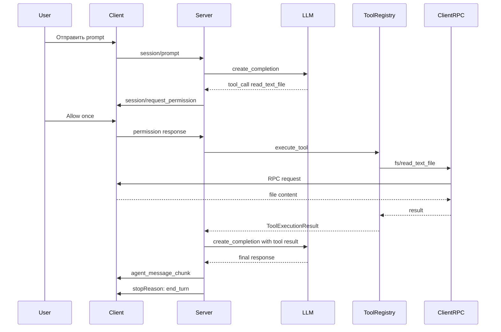

# План исправления Production Execution Backend

## Дата: 2026-04-21
## Статус: В разработке

---

## Резюме проблемы

При выполнении `session/prompt` с tool calls система **не выполняет реальные инструменты**. Вместо этого возвращается заглушка "Tool completed successfully." и turn завершается без повторного вызова LLM.

---

## Анализ критических багов

### BUG #1: Заглушка вместо реального выполнения

**Файл:** `acp-server/src/acp_server/protocol/handlers/prompt.py`  
**Функция:** `build_policy_tool_execution_updates()` (lines 1157-1185)

**Проблема:**
```python
completed_content = [
    {
        "type": "content",
        "content": {
            "type": "text",
            "text": "Tool completed successfully.",  # ЗАГЛУШКА!
        },
    }
]
```

**Причина:** Функция вызывается после permission approval, но вместо реального выполнения через `tool_registry.execute_tool()` просто отправляет hardcoded сообщение.

### BUG #2: Неправильный tool_kind mapping

**Файл:** `acp-server/src/acp_server/protocol/handlers/prompt_orchestrator.py`  
**Строки:** 489-494

**Проблема:**
```python
tool_kind = "other"
if tool_name.startswith("fs/"):  # Tool name = "read_text_file" (без prefix!)
    tool_kind = "read" if "read" in tool_name else "edit"
elif tool_name.startswith("terminal/"):
    tool_kind = "execute"
```

**Причина:** Tool зарегистрирован как `read_text_file` в `FileSystemToolDefinitions`, но код ожидает prefix `fs/`.

**Результат в логах:**
```
checking tool execution decision ... tool_kind=other  # Должно быть "read"!
```

### BUG #3: Отсутствие LLM loop после tool execution

**Проблема:** После выполнения tool, система завершает turn с `stopReason="end_turn"` без повторного вызова LLM с результатами.

**Ожидаемое поведение по протоколу:**
1. LLM возвращает tool_call
2. Запрос permission у пользователя
3. Пользователь разрешает
4. Выполнение tool через ClientRPC
5. **Повторный вызов LLM с результатом tool**
6. LLM генерирует финальный ответ пользователю
7. Завершение turn

---

## План исправления

### Фаза 1: Исправление tool_kind mapping

**Цель:** Tool kind должен определяться из `ToolDefinition.kind`, а не из prefix.

**Изменения в `prompt_orchestrator.py`:**

```python
# БЫЛО:
tool_kind = "other"
if tool_name.startswith("fs/"):
    tool_kind = "read" if "read" in tool_name else "edit"
elif tool_name.startswith("terminal/"):
    tool_kind = "execute"

# ДОЛЖНО БЫТЬ:
tool_definition = self.tool_registry.get_tool_definition(tool_name)
if tool_definition is not None:
    tool_kind = tool_definition.kind
else:
    tool_kind = "other"
```

**Тесты:**
- [ ] `test_tool_kind_from_definition_read`
- [ ] `test_tool_kind_from_definition_edit`
- [ ] `test_tool_kind_from_definition_execute`
- [ ] `test_tool_kind_fallback_other`

---

### Фаза 2: Удаление заглушки и интеграция реального execution

**Цель:** После permission approval вызывать реальный executor вместо заглушки.

**Архитектурное решение:**



**Изменения:**

1. **`prompt.py`** — удалить заглушку из `build_policy_tool_execution_updates()`:
   - Функция должна только отправлять `status: in_progress`
   - Реальное выполнение должно происходить в другом месте

2. **`http_server.py`** или **`prompt_orchestrator.py`** — после permission response:
   - Вызвать `PromptOrchestrator._process_tool_calls()` с pending tool calls
   - Получить результат и отправить его LLM
   - Вызвать LLM повторно
   - Получить финальный ответ

**Тесты:**
- [ ] `test_permission_approval_triggers_real_execution`
- [ ] `test_tool_execution_calls_client_rpc`
- [ ] `test_tool_result_sent_to_llm`

---

### Фаза 3: Добавление LLM loop после tool execution

**Цель:** После получения результата tool, вызвать LLM повторно для генерации ответа.

**Изменения в `prompt_orchestrator.py`:**

```python
async def handle_prompt_with_tools(self, ...):
    while True:
        # 1. Вызов LLM
        llm_response = await agent_orchestrator.process_prompt(...)
        
        # 2. Если нет tool calls - завершить
        if not llm_response.tool_calls:
            break
            
        # 3. Обработать tool calls
        for tool_call in llm_response.tool_calls:
            # 3a. Запросить permission если нужно
            decision = await self._decide_tool_execution(session, tool_kind)
            
            if decision == "ask":
                # Отправить permission request и дождаться ответа
                ...
            
            if decision in ["allow", "allow_always"]:
                # 3b. Выполнить tool
                result = await self.tool_registry.execute_tool(...)
                
                # 3c. Добавить результат в историю для LLM
                session.message_history.append({
                    "role": "tool",
                    "tool_call_id": tool_call.id,
                    "content": result.output
                })
        
        # 4. Повторить loop - LLM получит tool results
```

**Тесты:**
- [ ] `test_llm_receives_tool_results`
- [ ] `test_llm_loop_continues_until_no_tools`
- [ ] `test_final_response_sent_to_user`

---

### Фаза 4: E2E тестирование

**Сценарии:**

1. **Read file flow:**
   - User: "Прочти README.md"
   - LLM: tool_call read_text_file
   - Permission: allow_once
   - Tool: читает файл через fs/read_text_file
   - LLM: "Вот содержимое README.md: ..."

2. **Write file flow:**
   - User: "Создай файл test.txt"
   - LLM: tool_call write_text_file
   - Permission: allow_once
   - Tool: записывает через fs/write_text_file
   - LLM: "Файл test.txt успешно создан"

3. **Terminal flow:**
   - User: "Запусти npm test"
   - LLM: tool_call terminal/create
   - Permission: allow_once
   - Tool: создаёт терминал
   - LLM: "Тесты выполнены: ..."

---

## Файлы для изменения

| Файл | Изменения |
|------|-----------|
| `acp-server/src/acp_server/protocol/handlers/prompt_orchestrator.py` | Исправить tool_kind mapping, добавить LLM loop |
| `acp-server/src/acp_server/protocol/handlers/prompt.py` | Удалить заглушку из build_policy_tool_execution_updates |
| `acp-server/src/acp_server/http_server.py` | Интегрировать real execution после permission response |
| `acp-server/tests/test_tool_execution_integration.py` | Новые integration тесты |

---

## Риски и митигация

| Риск | Вероятность | Митигация |
|------|-------------|-----------|
| Regression в существующих тестах | Средняя | Запускать полный test suite после каждого изменения |
| Race condition при permission response | Низкая | Использовать существующий механизм deferred_prompt_tasks |
| Timeout при LLM loop | Средняя | Добавить max_iterations limit |

---

## Acceptance Criteria

- [ ] Tool execution реально вызывает ClientRPC методы
- [ ] Tool kind корректно определяется из ToolDefinition
- [ ] LLM получает результаты tool execution
- [ ] LLM генерирует финальный ответ на основе результатов
- [ ] Все существующие тесты проходят
- [ ] Новые integration тесты покрывают все сценарии
