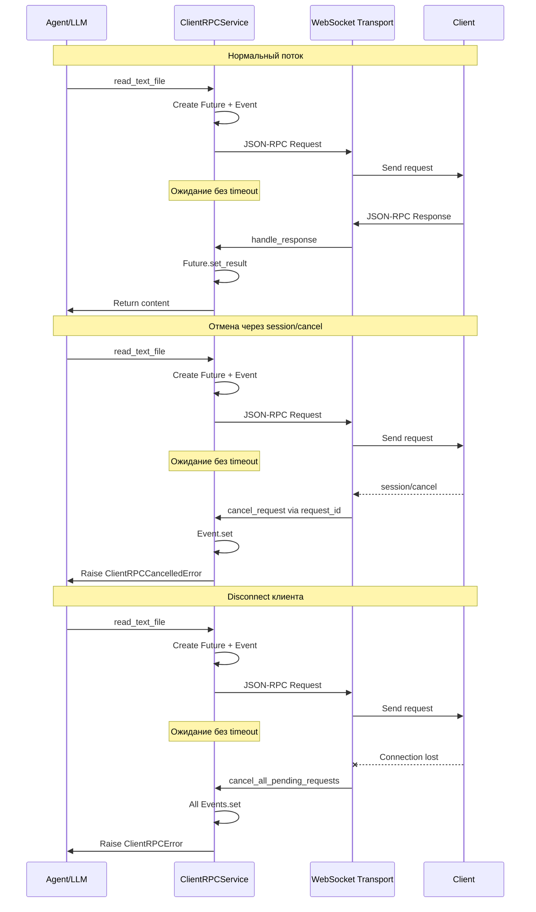
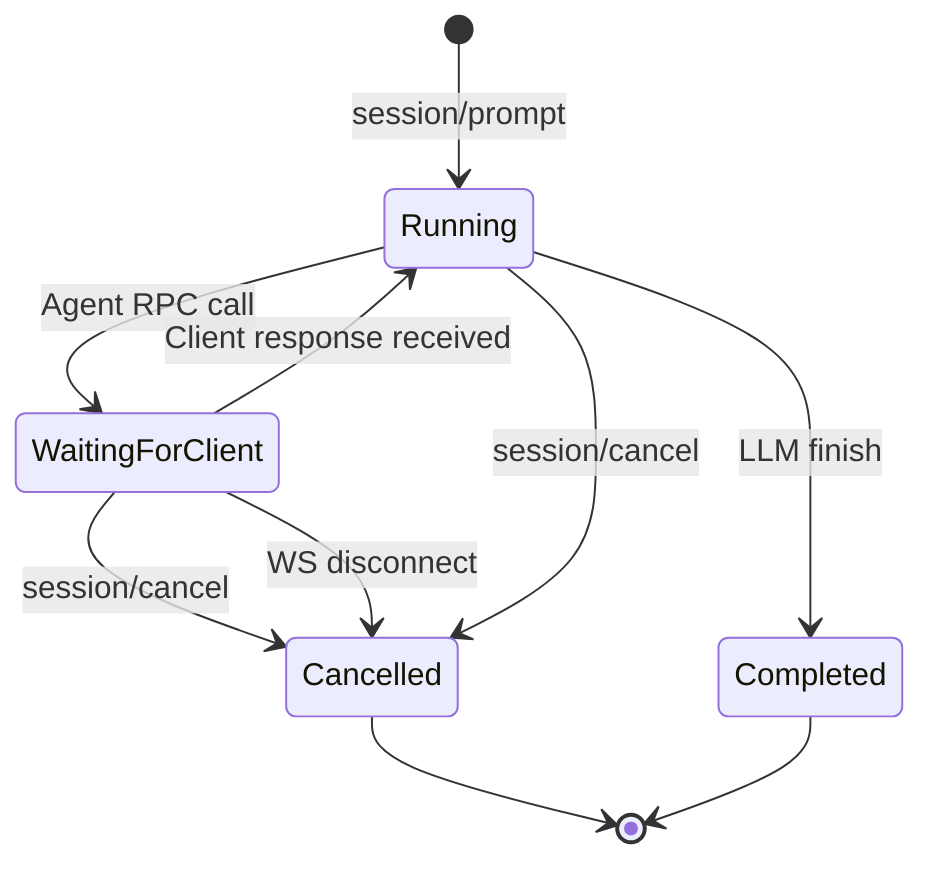

# Архитектура RPC без timeout

## 0. Соответствие протоколу ACP

Рекомендованный подход **полностью соответствует** спецификации Agent Client Protocol:

### Из [Prompt Turn - Cancellation](doc/Agent Client Protocol/protocol/05-Prompt Turn.md:285)

> "When the Agent receives this notification, it **SHOULD** stop all language model requests and all tool call invocations as soon as possible."
>
> "After all ongoing operations have been successfully aborted and pending updates have been sent, the Agent **MUST** respond to the original `session/prompt` request with the `cancelled` stop reason."
>
> "Agents **MUST** catch these errors and return the semantically meaningful `cancelled` stop reason, so that Clients can reliably confirm the cancellation."

### Протокол не предписывает timeout

В спецификации [File System](doc/Agent Client Protocol/protocol/09-File System.md) и [Terminal](doc/Agent Client Protocol/protocol/10-Terminal.md) **отсутствуют требования к timeout** для RPC вызовов. Протокол предполагает:

1. Клиент отвечает, когда операция завершена
2. При необходимости отмены используется `session/cancel`
3. Agent должен корректно обработать отмену и вернуть `cancelled`

### Вывод

State Machine + Event подход реализует именно эту семантику:
- Бесконечное ожидание ответа от клиента
- Явная отмена через `session/cancel` → `asyncio.Event`
- Возврат `cancelled` stop reason вместо timeout error

---

## 1. Контекст проблемы

### Текущее состояние

В [`ClientRPCService._call_method()`](acp-server/src/acp_server/client_rpc/service.py:102) используется `asyncio.wait_for()` с timeout 30 секунд:

```python
result = await asyncio.wait_for(future, timeout=self._timeout)
```

### Проблема Race Condition

1. Сервер отправляет RPC запрос клиенту
2. Через 30 секунд timeout срабатывает, Future удаляется из `_pending_requests`
3. Клиент отправляет ответ (с задержкой > 30 сек)
4. [`handle_response()`](acp-server/src/acp_server/client_rpc/service.py:154) логирует warning о неизвестном `request_id`
5. Turn завершается с ошибкой, хотя клиент выполнил операцию

### Влияние на пользователя

- Операции с большими файлами или медленным I/O прерываются
- Терминальные команды с долгим выполнением не работают
- Пользователь получает ошибку timeout, но операция на клиенте выполнена

---

## 2. Анализ вариантов

### Вариант A: Event-driven с correlation_id

**Описание**: Запрос отправляется без ожидания. Ответ обрабатывается асинхронно через event bus.

**Реализация**:
```python
class RPCEventBus:
    _handlers: dict[str, Callable]
    
    async def emit_request(self, request_id: str, method: str, params: dict):
        await self._send_request({...})
        # Возврат сразу, без ожидания
        
    def on_response(self, request_id: str, callback: Callable):
        self._handlers[request_id] = callback
```

**Плюсы**:
- Полностью асинхронно, нет блокировки
- Легко масштабируется для множественных параллельных запросов
- Естественная интеграция с WebSocket

**Минусы**:
- Требует переработки всех caller-ов (bridge, executors)
- Сложнее отслеживать жизненный цикл операции
- Callback hell или необходимость Future-обёртки

**Оценка**: Слишком радикальное изменение API, требует рефакторинга всех интеграций.

---

### Вариант B: State Machine с фазой waiting_for_client

**Описание**: Turn переходит в явное состояние ожидания без timeout. Состояние хранится в `ActiveTurnState`.

**Реализация**:
```python
@dataclass
class ActiveTurnState:
    phase: str  # running | waiting_for_client | cancelled
    pending_client_request: PendingClientRequestState | None
    cancellation_event: asyncio.Event  # Для явной отмены
```

```python
async def _call_method(...) -> Any:
    cancellation_event = asyncio.Event()
    future = asyncio.Future()
    
    self._pending_requests[request_id] = PendingRequest(
        future=future,
        cancellation_event=cancellation_event,
    )
    
    await self._send_request({...})
    
    # Ожидание без timeout, но с поддержкой отмены
    done, pending = await asyncio.wait(
        [future, cancellation_event.wait()],
        return_when=asyncio.FIRST_COMPLETED,
    )
    
    if cancellation_event.is_set():
        raise ClientRPCCancelledError("Request cancelled")
    
    return future.result()
```

**Плюсы**:
- Минимальные изменения существующего API
- Явное состояние, легко отлаживать
- Уже частично реализовано через `PendingClientRequestState`
- Интеграция с `session/cancel` через существующий механизм

**Минусы**:
- Требует координации между `ClientRPCService` и `ACPProtocol`
- Потенциальная утечка памяти при забытых запросах

**Оценка**: Рекомендуемый подход. Минимальные изменения, естественная интеграция.

---

### Вариант C: Cancellation Token

**Описание**: Вместо timeout передаётся токен отмены, который может быть триггерирован извне.

**Реализация**:
```python
class CancellationToken:
    def __init__(self):
        self._cancelled = False
        self._event = asyncio.Event()
    
    def cancel(self):
        self._cancelled = True
        self._event.set()
    
    async def wait(self):
        await self._event.wait()
```

```python
async def read_text_file(
    self,
    ...,
    cancellation_token: CancellationToken | None = None,
) -> str:
    return await self._call_method(
        ...,
        cancellation_token=cancellation_token,
    )
```

**Плюсы**:
- Явный контракт отмены
- Паттерн известен из .NET/Go
- Caller контролирует lifetime

**Минусы**:
- Изменение сигнатур всех методов
- Caller должен управлять токеном
- Избыточная абстракция для нашего use case

**Оценка**: Избыточно. State machine уже предоставляет нужный контроль.

---

## 3. Рекомендованный подход: State Machine + Event

### Принципы

1. **Без timeout**: Future ожидается бесконечно
2. **Явная отмена**: Через `asyncio.Event` при `session/cancel` или disconnect
3. **Graceful degradation**: При disconnect все pending requests отменяются

### Диаграмма взаимодействия



### Диаграмма состояний Turn



---

## 4. Детальный дизайн

### 4.1 Новая структура PendingRequest

```python
@dataclass
class PendingRequest:
    """Состояние ожидающего RPC запроса."""
    future: asyncio.Future
    cancellation_event: asyncio.Event
    method: str
    created_at: float  # time.time() для мониторинга
```

### 4.2 Изменения в ClientRPCService

```python
class ClientRPCService:
    _pending_requests: dict[str, PendingRequest]  # Изменение типа
    
    async def _call_method(
        self,
        method: str,
        params: dict,
        response_model: type[BaseModel],
    ) -> Any:
        request_id = str(uuid.uuid4())
        future: asyncio.Future = asyncio.Future()
        cancellation_event = asyncio.Event()
        
        self._pending_requests[request_id] = PendingRequest(
            future=future,
            cancellation_event=cancellation_event,
            method=method,
            created_at=time.time(),
        )
        
        try:
            await self._send_request({...})
            
            # Ожидание без timeout
            wait_task = asyncio.create_task(future)
            cancel_task = asyncio.create_task(cancellation_event.wait())
            
            done, pending = await asyncio.wait(
                [wait_task, cancel_task],
                return_when=asyncio.FIRST_COMPLETED,
            )
            
            # Отменяем оставшуюся задачу
            for task in pending:
                task.cancel()
            
            if cancellation_event.is_set():
                raise ClientRPCCancelledError(
                    f"Request {method} cancelled"
                )
            
            result = future.result()
            return response_model.model_validate(result)
            
        finally:
            self._pending_requests.pop(request_id, None)
    
    def cancel_request(self, request_id: str, reason: str) -> bool:
        """Отменить конкретный запрос по ID."""
        pending = self._pending_requests.get(request_id)
        if pending is None:
            return False
        pending.cancellation_event.set()
        return True
    
    def cancel_all_pending_requests(self, reason: str) -> int:
        """Отменить все ожидающие запросы."""
        count = 0
        for pending in self._pending_requests.values():
            if not pending.future.done():
                pending.cancellation_event.set()
                count += 1
        return count
```

### 4.3 Новое исключение

```python
class ClientRPCCancelledError(ClientRPCError):
    """Запрос был явно отменён через session/cancel или disconnect."""
    pass
```

### 4.4 Интеграция с session/cancel

В [`ACPProtocol.handle_session_cancel()`](acp-server/src/acp_server/protocol/core.py) добавить:

```python
def handle_session_cancel(self, session_id: str) -> ProtocolOutcome:
    session = self._get_session(session_id)
    
    # Отменить pending client RPC
    if session.active_turn and session.active_turn.pending_client_request:
        request_id = session.active_turn.pending_client_request.request_id
        self._client_rpc_service.cancel_request(request_id, "session/cancel")
        session.cancelled_client_rpc_requests.add(request_id)
    
    # Существующая логика...
```

---

## 5. План миграции

### Этап 1: Подготовка инфраструктуры

- [ ] Добавить `ClientRPCCancelledError` в `exceptions.py`
- [ ] Создать dataclass `PendingRequest` с Event
- [ ] Написать unit-тесты для нового поведения

### Этап 2: Изменение ClientRPCService

- [ ] Заменить `dict[str, Future]` на `dict[str, PendingRequest]`
- [ ] Переписать `_call_method()` без timeout
- [ ] Добавить метод `cancel_request(request_id)`
- [ ] Обновить `cancel_all_pending_requests()`

### Этап 3: Интеграция с Protocol

- [ ] Обновить `handle_session_cancel()` для отмены RPC
- [ ] Обновить cleanup в `http_server.py` при disconnect
- [ ] Добавить логирование состояний

### Этап 4: Обновление Bridge и Executors

- [ ] Обновить `ClientRPCBridge` для обработки `ClientRPCCancelledError`
- [ ] Добавить graceful handling в executors

### Этап 5: Тестирование

- [ ] Unit-тесты отмены через session/cancel
- [ ] Unit-тесты отмены при disconnect
- [ ] Integration-тест долгой операции без timeout
- [ ] E2E тест с реальным клиентом

---

## 6. Риски и митигации

| Риск | Вероятность | Митигация |
|------|-------------|-----------|
| Memory leak от забытых pending requests | Средняя | Добавить мониторинг возраста pending requests, логировать старые |
| Deadlock при неправильной координации | Низкая | Все операции через asyncio примитивы, unit-тесты |
| Поздние ответы после отмены | Средняя | `cancelled_client_rpc_requests` уже реализован |

---

## 7. Метрики успеха

1. **Нет TimeoutError** в логах для легитимных операций
2. **session/cancel** корректно прерывает ожидание RPC
3. **Disconnect** не оставляет зависших Future
4. **Отсутствие memory leaks** в длительных сессиях

---

## 8. Заключение

**Рекомендация**: Вариант B (State Machine + Event)

Этот подход:
- Минимизирует изменения существующего API
- Использует существующие механизмы (`cancelled_client_rpc_requests`)
- Предоставляет явный контроль через `asyncio.Event`
- Легко интегрируется с `session/cancel` и disconnect handling
