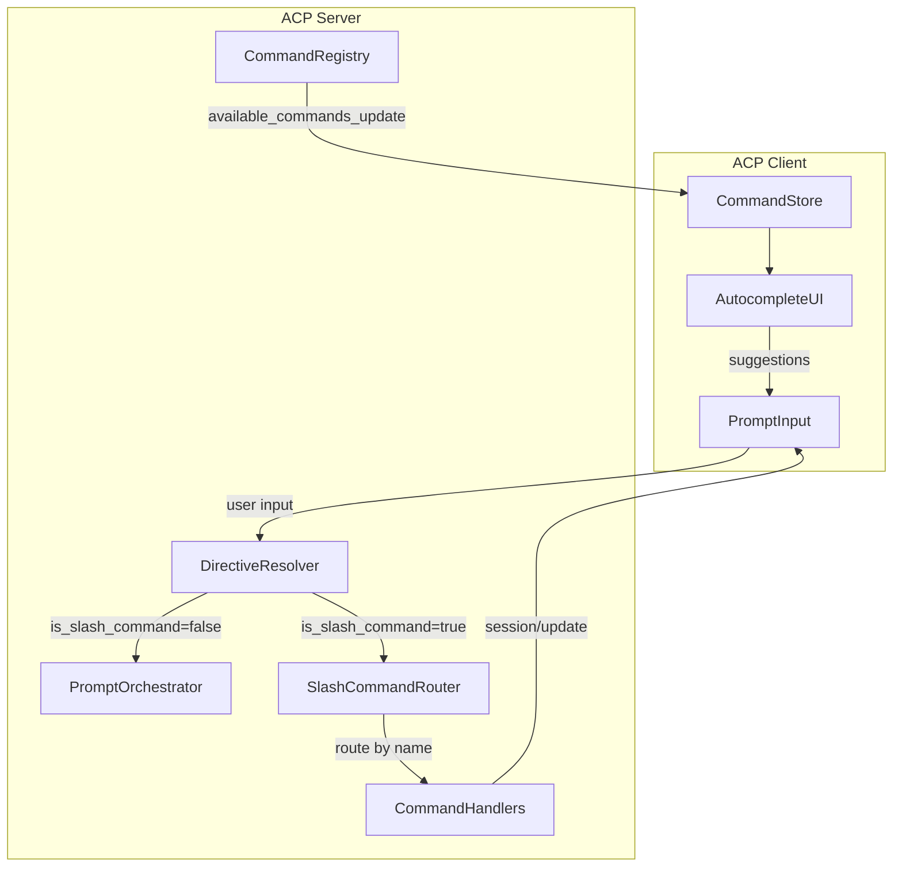
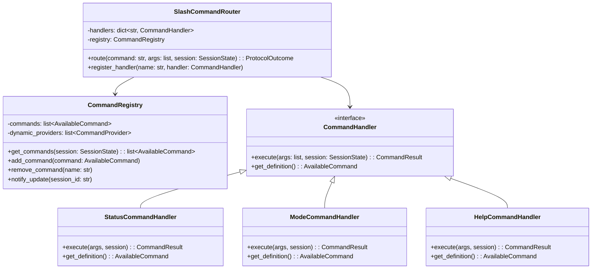
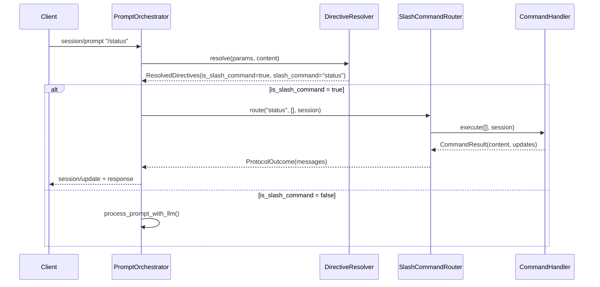
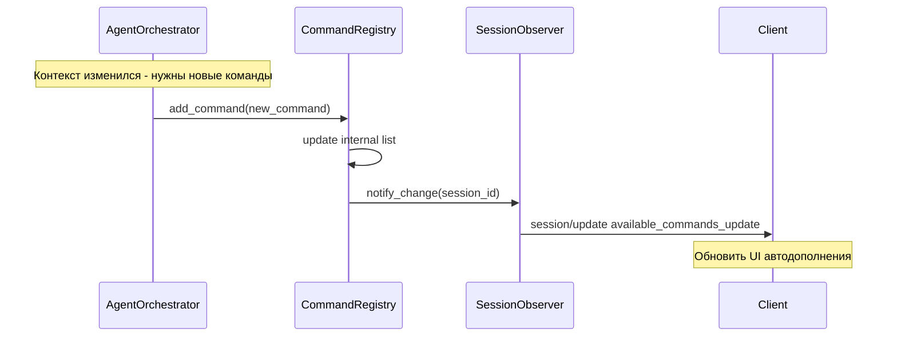

# План реализации Slash Commands

> Документ: plans/SLASH_COMMANDS_IMPLEMENTATION_PLAN.md  
> Дата: 2026-04-23  
> Версия: 1.0

## 1. Анализ текущего состояния

### 1.1 Что реализовано ✅

| Компонент | Файл | Описание |
|-----------|------|----------|
| Модель `AvailableCommand` (сервер) | [`acp-server/src/acp_server/models.py:44`](acp-server/src/acp_server/models.py:44) | Pydantic модель с полями `name`, `description`, `parameters` |
| Модель `AvailableCommand` (клиент) | [`acp-client/src/acp_client/messages.py:495`](acp-client/src/acp_client/messages.py:495) | Pydantic модель с полями `name`, `description`, `input` |
| Парсинг slash-команд | [`directive_resolver.py:43`](acp-server/src/acp_server/protocol/prompt_handlers/directive_resolver.py:43) | Парсит `/command args` и возвращает `is_slash_command`, `slash_command`, `slash_args` |
| Отправка `available_commands_update` | [`session.py:305`](acp-server/src/acp_server/protocol/handlers/session.py:305) | При создании сессии отправляется уведомление с командами |
| Дефолтные команды | [`session.py:513`](acp-server/src/acp_server/protocol/handlers/session.py:513) | `/status`, `/mode` — базовые команды демо-сессий |

### 1.2 Что НЕ реализовано ❌

| Проблема | Описание | Приоритет |
|----------|----------|-----------|
| **Обработка slash-команд** | Парсер возвращает `is_slash_command=True`, но это значение нигде не используется — команды уходят в LLM как обычный текст | Высокий |
| **Handlers встроенных команд** | Нет обработчиков для `/status`, `/mode`, `/help` — они объявлены, но не выполняют никаких действий | Высокий |
| **Динамическое обновление** | Команды устанавливаются только при `session/new`, нет механизма для динамического добавления/удаления | Средний |
| **UI автодополнения** | Клиент получает `available_commands_update`, но в `prompt_input.py` нет UI для их отображения | Низкий |
| **Несоответствие модели** | Сервер использует `parameters: list[CommandParameter]` вместо `input: { hint: str }` по спецификации | Высокий |

### 1.3 Несоответствия спецификации протокола

#### Модель сервера (текущая реализация)
```python
# acp-server/src/acp_server/models.py
class CommandParameter(BaseModel):
    name: str
    type: str
    description: str
    required: bool = True
    default: Any = None

class AvailableCommand(BaseModel):
    name: str
    description: str
    parameters: list[CommandParameter] = Field(default_factory=list)  # ❌ Не по спецификации
```

#### Спецификация протокола (14-Slash Commands.md)
```json
{
  "name": "web",
  "description": "Search the web for information",
  "input": {
    "hint": "query to search for"  // ✅ По спецификации
  }
}
```

#### Модель клиента (корректная)
```python
# acp-client/src/acp_client/messages.py
class AvailableCommandInput(BaseModel):
    hint: str  # ✅ Соответствует спецификации

class AvailableCommand(BaseModel):
    name: str
    description: str
    input: AvailableCommandInput | None = None  # ✅ Соответствует спецификации
```

---

## 2. Архитектура решения

### 2.1 Обзор архитектуры



### 2.2 Компонентная диаграмма сервера



### 2.3 Sequence диаграмма обработки slash-команды



### 2.4 Диаграмма потока данных динамического обновления



---

## 3. План реализации

### Этап 1: Исправление модели данных (сервер)

| Задача | Файл | Описание |
|--------|------|----------|
| 1.1 | `acp-server/src/acp_server/models.py` | Заменить `parameters: list[CommandParameter]` на `input: AvailableCommandInput | None` |
| 1.2 | `acp-server/src/acp_server/models.py` | Добавить класс `AvailableCommandInput` с полем `hint: str` |
| 1.3 | `acp-server/src/acp_server/protocol/handlers/session.py` | Обновить `build_default_commands()` для использования новой модели |
| 1.4 | `acp-server/tests/` | Добавить unit-тесты для новой модели |

### Этап 2: Создание инфраструктуры для обработки команд

| Задача | Файл | Описание |
|--------|------|----------|
| 2.1 | `acp-server/src/acp_server/protocol/handlers/slash_commands/__init__.py` | Создать пакет для slash commands |
| 2.2 | `acp-server/src/acp_server/protocol/handlers/slash_commands/router.py` | Реализовать `SlashCommandRouter` |
| 2.3 | `acp-server/src/acp_server/protocol/handlers/slash_commands/registry.py` | Реализовать `CommandRegistry` |
| 2.4 | `acp-server/src/acp_server/protocol/handlers/slash_commands/base.py` | Базовый класс `CommandHandler` |
| 2.5 | `acp-server/tests/test_slash_command_router.py` | Unit-тесты для роутера |

### Этап 3: Реализация встроенных команд

| Задача | Файл | Описание |
|--------|------|----------|
| 3.1 | `acp-server/src/acp_server/protocol/handlers/slash_commands/builtin/status.py` | Handler для `/status` — показывает состояние сессии |
| 3.2 | `acp-server/src/acp_server/protocol/handlers/slash_commands/builtin/mode.py` | Handler для `/mode` — показывает/изменяет режим |
| 3.3 | `acp-server/src/acp_server/protocol/handlers/slash_commands/builtin/help.py` | Handler для `/help` — показывает список команд |
| 3.4 | `acp-server/tests/test_builtin_commands.py` | Unit-тесты для встроенных команд |

### Этап 4: Интеграция с PromptOrchestrator

| Задача | Файл | Описание |
|--------|------|----------|
| 4.1 | `acp-server/src/acp_server/protocol/handlers/prompt_orchestrator.py` | Добавить обработку `is_slash_command` из `ResolvedDirectives` |
| 4.2 | `acp-server/src/acp_server/protocol/handlers/prompt_orchestrator.py` | Интегрировать `SlashCommandRouter` |
| 4.3 | `acp-server/src/acp_server/protocol/handlers/prompt.py` | Обновить логику ответа для slash-команд |
| 4.4 | `acp-server/tests/test_prompt_slash_integration.py` | Интеграционные тесты |

### Этап 5: Динамическое обновление команд

| Задача | Файл | Описание |
|--------|------|----------|
| 5.1 | `acp-server/src/acp_server/protocol/handlers/slash_commands/registry.py` | Добавить методы `add_command()`, `remove_command()` |
| 5.2 | `acp-server/src/acp_server/protocol/handlers/slash_commands/registry.py` | Реализовать `notify_update()` для отправки `available_commands_update` |
| 5.3 | `acp-server/src/acp_server/agent/orchestrator.py` | Интегрировать с `AgentOrchestrator` для контекстных команд |
| 5.4 | `acp-server/tests/test_dynamic_commands.py` | Тесты динамического обновления |

### Этап 6: UI автодополнения (клиент)

| Задача | Файл | Описание |
|--------|------|----------|
| 6.1 | `acp-client/src/acp_client/presentation/command_view_model.py` | ViewModel для хранения и фильтрации команд |
| 6.2 | `acp-client/src/acp_client/tui/components/command_autocomplete.py` | Компонент автодополнения |
| 6.3 | `acp-client/src/acp_client/tui/components/prompt_input.py` | Интеграция автодополнения в поле ввода |
| 6.4 | `acp-client/tests/test_command_autocomplete.py` | UI-тесты автодополнения |

---

## 4. Модели данных

### 4.1 Исправленная модель сервера

```python
# acp-server/src/acp_server/models.py

class AvailableCommandInput(BaseModel):
    """Спецификация ввода для slash-команды.
    
    Соответствует спецификации ACP Protocol 14-Slash Commands.
    """
    hint: str
    """Подсказка для пользователя о формате ввода."""


class AvailableCommand(BaseModel):
    """Доступная slash-команда.
    
    Соответствует спецификации ACP Protocol 14-Slash Commands.
    """
    model_config = ConfigDict(extra="allow")

    name: str
    """Имя команды без слеша, например: 'status', 'web'."""
    
    description: str
    """Человекочитаемое описание команды."""
    
    input: AvailableCommandInput | None = None
    """Опциональная спецификация ввода."""
```

### 4.2 Модель результата команды

```python
# acp-server/src/acp_server/protocol/handlers/slash_commands/base.py

@dataclass
class CommandResult:
    """Результат выполнения slash-команды."""
    
    content: list[dict[str, Any]]
    """Контент для отправки в session/update content."""
    
    updates: list[dict[str, Any]] = field(default_factory=list)
    """Дополнительные session/update уведомления."""
    
    stop_reason: str = "end_turn"
    """Причина завершения turn."""
```

### 4.3 Интерфейс обработчика команд

```python
# acp-server/src/acp_server/protocol/handlers/slash_commands/base.py

from abc import ABC, abstractmethod
from typing import TYPE_CHECKING

if TYPE_CHECKING:
    from acp_server.protocol.state import SessionState
    from acp_server.models import AvailableCommand

class CommandHandler(ABC):
    """Базовый класс для обработчиков slash-команд."""
    
    @abstractmethod
    def execute(
        self, 
        args: list[str], 
        session: SessionState
    ) -> CommandResult:
        """Выполняет команду.
        
        Args:
            args: Аргументы команды после имени
            session: Состояние текущей сессии
            
        Returns:
            Результат выполнения команды
        """
        ...
    
    @abstractmethod
    def get_definition(self) -> AvailableCommand:
        """Возвращает определение команды для регистрации."""
        ...
```

---

## 5. API изменения

### 5.1 Изменения в session/prompt

**Текущее поведение:**
```
session/prompt "/status" → DirectiveResolver → is_slash_command=True → [ИГНОРИРУЕТСЯ] → LLM
```

**Новое поведение:**
```
session/prompt "/status" → DirectiveResolver → is_slash_command=True → SlashCommandRouter → StatusHandler → response
```

### 5.2 Формат ответа slash-команды

```json
{
  "jsonrpc": "2.0",
  "id": 3,
  "result": {
    "stop": {
      "reason": "end_turn"
    }
  }
}
```

Параллельно отправляется `session/update`:

```json
{
  "jsonrpc": "2.0",
  "method": "session/update",
  "params": {
    "sessionId": "sess_abc123",
    "update": {
      "sessionUpdate": "content",
      "role": "assistant",
      "content": [
        {
          "type": "text",
          "text": "**Статус сессии:**\n- ID: sess_abc123\n- Режим: code\n- Активных tool calls: 0"
        }
      ]
    }
  }
}
```

### 5.3 Новые методы CommandRegistry

| Метод | Описание |
|-------|----------|
| `get_commands(session: SessionState) -> list[AvailableCommand]` | Получить все команды для сессии |
| `add_command(command: AvailableCommand)` | Добавить команду динамически |
| `remove_command(name: str)` | Удалить команду |
| `notify_update(session_id: str)` | Отправить `available_commands_update` клиенту |

---

## 6. Стратегия тестирования

### 6.1 Unit-тесты

| Компонент | Тест-файл | Что тестируем |
|-----------|-----------|---------------|
| `AvailableCommand` | `test_models.py` | Валидация модели, сериализация |
| `SlashCommandRouter` | `test_slash_command_router.py` | Маршрутизация команд, fallback на LLM |
| `CommandRegistry` | `test_command_registry.py` | CRUD операции, notify_update |
| `StatusCommandHandler` | `test_builtin_commands.py` | Формат вывода, корректность данных |
| `ModeCommandHandler` | `test_builtin_commands.py` | Смена режима, валидация аргументов |
| `HelpCommandHandler` | `test_builtin_commands.py` | Список команд, форматирование |

### 6.2 Интеграционные тесты

| Сценарий | Описание |
|----------|----------|
| Полный цикл `/status` | `session/prompt "/status"` → response + session/update |
| Неизвестная команда | `/unknown` → fallback в LLM |
| Динамическое обновление | `add_command()` → `available_commands_update` |
| Команда с аргументами | `/mode architect` → смена режима |

### 6.3 E2E тесты (клиент + сервер)

| Сценарий | Описание |
|----------|----------|
| Автодополнение | Ввод `/` → показ списка команд |
| Выполнение через UI | Ввод `/help` в prompt_input → отображение результата |
| Обновление списка | Сервер добавляет команду → UI обновляется |

---

## 7. Критерии готовности

### 7.1 Этап 1 (Модели)
- [ ] Модель `AvailableCommand` на сервере соответствует спецификации
- [ ] Unit-тесты проходят
- [ ] `make check` проходит

### 7.2 Этап 2-3 (Роутер + Команды)
- [ ] `/status` возвращает информацию о сессии
- [ ] `/mode` показывает/меняет режим
- [ ] `/help` показывает список команд
- [ ] Неизвестные команды уходят в LLM

### 7.3 Этап 4 (Интеграция)
- [ ] `session/prompt "/status"` работает end-to-end
- [ ] История сессии корректно сохраняет slash-команды

### 7.4 Этап 5 (Динамика)
- [ ] `available_commands_update` отправляется при изменении списка
- [ ] Агент может добавлять контекстные команды

### 7.5 Этап 6 (UI)
- [ ] При вводе `/` показываются доступные команды
- [ ] Tab/Enter выбирает команду
- [ ] Список обновляется при `available_commands_update`

---

## 8. Риски и митигации

| Риск | Вероятность | Влияние | Митигация |
|------|-------------|---------|-----------|
| Breaking change в API моделей | Средняя | Высокое | Поддержка обратной совместимости через `model_config = ConfigDict(extra="allow")` |
| Конфликт с существующими промптами начинающимися с `/` | Низкая | Среднее | Экранирование: `//` интерпретируется как литеральный `/` |
| Сложность интеграции с MCP | Низкая | Среднее | MCP команды регистрируются через тот же `CommandRegistry` |

---

## 9. Зависимости

- **Нет внешних зависимостей** — все изменения в рамках существующего кода
- **Внутренние зависимости:**
  - Этап 2 зависит от Этапа 1
  - Этап 3 зависит от Этапа 2
  - Этап 4 зависит от Этапов 2-3
  - Этап 5 зависит от Этапа 2
  - Этап 6 независим (можно делать параллельно с Этапами 3-5)
